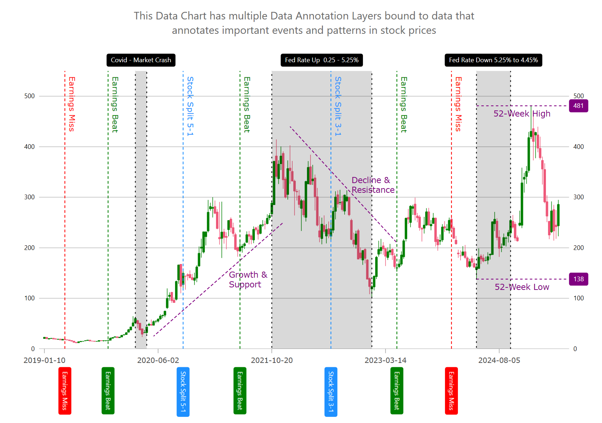
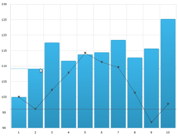
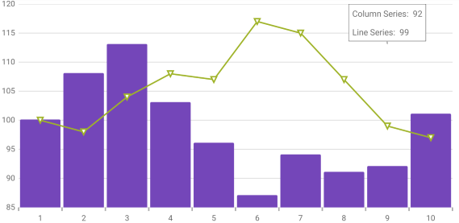
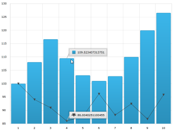
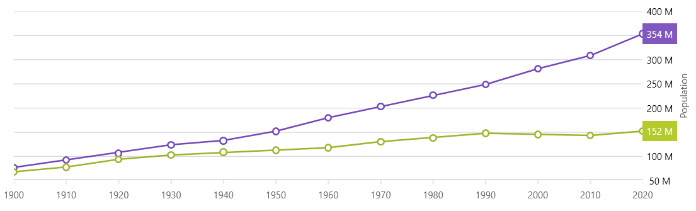

////
|metadata|
{
    "name": "datachart-chartannotationlayers",
    "controlName": ["{DataChartName}"],
    "tags": ["Charting","Getting Started","How Do I"],
    "guid": "210e57ae-6232-462f-89bf-76844d6e08f7",
    "buildFlags": ["WINFORMS","ANDROID","WPF","SL"],
    "createdOn": "2014-06-05T19:39:00.6333735Z"
}
|metadata|
////

= チャート注釈レイヤー

=== 目的

このトピックは、利用可能なさまざまなタイプのpick:[wpf,sl,win-universal,win-forms="ホバー"]pick:[xamarin="タッチ"]操作レイヤーなど、link:{DataChartLink}.{DataChartName}.html[{DataChartName}™] コントロール上で利用できる注釈やpick:[wpf,sl,win-universal,win-forms="ホバー"]pick:[xamarin="タッチ"]操作について概念的な情報を提供します。

=== 前提条件

本トピックの理解を深めるために、以下のトピックを参照することをお勧めします。

[options="header", cols="a,a"]
|====
|トピック|目的

| link:datachart-getting-started-with-datachart.html[データ チャートを使用した作業の開始]
|{DataChartName} コントロールは、コントロールの pick:[wpf,sl,win-universal,win-forms="DataContext"]pick:[xamarin="BindingContext"] プロパティにマップされるデータ オブジェクト モデルを必要とします。ここでは、簡単なデータ オブジェクト モデルを提供しますが、自分自身で作成し、このサンプル コードの代わりに使用することができます。

| link:datachart-category-series-overview.html[カテゴリ シリーズ]
|このトピックは、{DataChartName} コントロールのカテゴリ シリーズのさまざまなタイプを説明します。

|====

=== このトピックの内容

このトピックは、以下のセクションで構成されます。

* <<CommonProperties,共通のプロパティ>>
* <<TypesofLayers,レイヤーのタイプ>>

** <<CalloutLayer,コールアウト レイヤー>>
** <<CrosshairLayer,十字線レイヤー>>
** <<CategoryHighlightLayer,カテゴリ強調表示レイヤー>>
** <<CategoryItemHighlightLayer,カテゴリ項目強調表示レイヤー>>
** <<CategoryTooltipLayer,カテゴリ ツールチップ レイヤー>>
** <<DataTooltipLayer,データ ツールチップ レイヤー>>
** <<DataAnnotationBandLayer,データ注釈バンド レイヤー (ベータ版)>>
** <<DataAnnotationLineLayer,データ注釈ライン レイヤー (ベータ版)>>
** <<DataAnnotationRectLayer,データ注釈矩形レイヤー (ベータ版)>>
** <<DataAnnotationSliceLayer,データ注釈スライス レイヤー (ベータ版)>>
** <<DataAnnotationStripLayer,データ注釈ストリップ レイヤー (ベータ版)>>
** <<ItemTooltipLayer,項目ツールチップ レイヤー>>
** <<FinalValueLayer,最終値レイヤー>>
* <<HoverInteractions,ホバー操作>>

* <<RelatedContent,関連コンテンツ>>

*このプロパティは、オーバーレイ テキストの配置位置を管理します。

[[CommonProperties]]
== 共通のプロパティ

=== 共通のプロパティおよびメソッドの概要

pick:[wpf,sl,win-universal,win-forms="ホバー"]pick:[xamarin="タッチ"]操作レイヤーは link:{DataChartLink}.series_members.html[Series] オブジェクトから継承するため、link:{DataChartLink}.series_members.html[Series] 基本クラスで利用可能な多くのプロパティおよびメソッドを取得します。しかし、link:{DataChartLink}.series_members.html[Series] クラスからのすべてがホバー操作レイヤーで意味をなすわけではありません。たとえば、pick:[wpf,sl,win-universal,win-forms="ホバー"]pick:[xamarin="タッチ"] 操作レイヤーはpick:[wpf,sl,win-universal,win-forms="マウス"]pick:[xamarin="タッチ ポイント"]と対話するようには設計されておらずヒットでテストできません。従って、pick:[wpf,sl,win-universal,win-forms="マウス"]pick:[xamarin="タッチ ポイント"]関連のイベントは起動されません。

共通のプロパティおよびメソッドの詳細は、link:datachart-commonproperties.html[共通のプロパティ] トピックを参照してください。

[[TypesofLayers]]
== レイヤーのタイプ

=== 概要

現在、{DataChartName} コントロールで利用可能なpick:[wpf,sl,win-universal,win-forms="ホバー"]pick:[xamarin="タッチ"]操作レイヤーは 5 種類あります。これらのpick:[wpf,sl,win-universal,win-forms="ホバー"]pick:[xamarin="タッチ"]操作レイヤーのそれぞれが、異なる強調表示、pick:[wpf,sl,win-universal,win-forms="ホバー"]pick:[xamarin="タッチ"]およびツールチップの操作を個別に、または組み合わせて提供し、強力なpick:[wpf,sl,win-universal,win-forms="ホバー"]pick:[xamarin="タッチ"]操作を実現します。

=== レイヤーのタイプ

以下の表で、{DataChartName} コントロールで利用可能な各レイヤー タイプを簡単に説明します。

[options="header", cols="a,a"]
|====
|レイヤー タイプ|説明

|[[CalloutLayer]]

link:{DataChartLink}.calloutlayer_members.html[CalloutLayer]
|link:{DataChartLink}.calloutlayer_members.html[CalloutLayer] は X/Y 位置にコールアウト情報を表示します。マスク オーバー操作をする場合、ラベルと追加のコンテンツが表示されます。

CalloutLayer はすべてのシリーズ タイプをサポートします。

ifdef::wpf,sl,win-universal,win-forms[]
image::images/Hover_InteractionsOverview_8.png[0,600]
endif::wpf,sl,win-universal,win-forms[]

詳細は、link:datachart-calloutlayer.html[コールアウト レイヤー] トピックを参照してください。

|[[CrosshairLayer]] 

link:{DataChartLink}.crosshairlayer_members.html[CrosshairLayer]
| link:{DataChartLink}.crosshairlayer_members.html[CrosshairLayer] は、各ターゲット シリーズの実際の値に一致する十字線を提供します。 

ifdef::wpf,sl,win-universal,win-forms[]

endif::wpf,sl,win-universal,win-forms[]

ifdef::xamarin[]
image::images/XF_InteractionsOverview_2.png[]
endif::xamarin[]

詳細は link:datachart-crosshairlayer.html[十字線レイヤー] トピックを参照してください。

|[[CategoryHighlightLayer]] 

link:{DataChartLink}.categoryhighlightlayer_members.html[CategoryHighlightLayer]
| link:{DataChartLink}.categoryhighlightlayer_members.html[CategoryHighlightLayer] は、{DataChartName} コントロール内の 1 つまたはすべてのカテゴリー軸を対象にしています。pick:[wpf,sl,win-universal,win-forms="カーソル"]pick:[xamarin="タッチ"]位置に最も近い軸のエリアを照らすシェイプを描画します。 

ifdef::wpf,sl,win-universal,win-forms[]
image::images/Hover_InteractionsOverview_3.png[]
endif::wpf,sl,win-universal,win-forms[]

ifdef::xamarin[]

endif::xamarin[]

詳細は link:datachart-categoryhighlightlayer.html[カテゴリー強調表示レイヤー] トピックを参照してください。

|[[CategoryItemHighlightLayer]] 

link:{DataChartLink}.categoryitemhighlightlayer_members.html[CategoryItemHighlightLayer]
| link:{DataChartLink}.categoryitemhighlightlayer_members.html[CategoryItemHighlightLayer] レイヤーは、その位置で縞模様シェイプまたはマーカーを描画することによりカテゴリー軸を使用するシリーズ内の品目を強調表示します。 

ifdef::wpf,sl,win-universal,win-forms[]
image::images/Hover_InteractionsOverview_4.png[]
endif::wpf,sl,win-universal,win-forms[]

ifdef::xamarin[]
image::images/XF_InteractionsOverview_4.png[]
endif::xamarin[] 

詳細は link:datachart-categoryitemhighlightlayer.html[カテゴリー品目強調表示レイヤー] トピックを参照してください。

|[[CategoryToolTipLayer]] 

link:{DataChartLink}.categorytooltiplayer_members.html[CategoryToolTipLayer]
| link:{DataChartLink}.categorytooltiplayer_members.html[CategoryToolTipLayer] は、カテゴリ軸を使用するシリーズ用にグループ化されたヒントを表示します。 

ifdef::wpf,sl,win-universal,win-forms[]
image::images/Hover_InteractionsOverview_5.png[]
endif::wpf,sl,win-universal,win-forms[]

ifdef::xamarin[]

endif::xamarin[] 

詳細は link:datachart-categorytooltiplayer.html[カテゴリ ツールチップ レイヤー] トピックを参照してください。

|[[DataToolTipLayer]]

link:{DataChartLink}.DataToolTipLayer.html[DataToolTipLayer]

|link:{DataChartLink}.DataToolTipLayer.html[DataToolTipLayer] は、チャートのさまざまなシリーズにマウスを合わせると、link:datachart-data-legend.html[{DataLegendName}] のような視覚化を表示します。

詳細は、link:datachart-data-tooltip.html[データ ツールチップ レイヤー] トピックを参照してください。

|[[DataAnnotationBandLayer]]

link:{DataChartLink}.DataAnnotationBandLayer.html[DataAnnotationBandLayer]

|link:{DataChartLink}.DataAnnotationBandLayer.html[DataAnnotationBandLayer] は、チャートのシリーズ上に視覚的な注釈を表示します。

詳細は、link:datachart-data-annotation-band-layer.html[データ注釈バンド レイヤー] トピックを参照してください。

|[[DataAnnotationLineLayer]]

link:{DataChartLink}.DataAnnotationLineLayer.html[DataAnnotationLineLayer]

|link:{DataChartLink}.DataAnnotationLineLayer.html[DataAnnotationLineLayer] は、チャートのシリーズ上に視覚的な注釈を表示します。

詳細は、link:datachart-data-annotation-line-layer.html[データ注釈ライン レイヤー] トピックを参照してください。

|[[DataAnnotationRectLayer]]

link:{DataChartLink}.DataAnnotationRectLayer.html[DataAnnotationRectLayer]

|link:{DataChartLink}.DataAnnotationRectLayer.html[DataAnnotationRectLayer] は、チャートのシリーズ上に視覚的な注釈を表示します。

詳細は、link:datachart-data-annotation-rect-layer.html[データ注釈矩形レイヤー] トピックを参照してください。

|[[DataAnnotationSliceLayer]]

link:{DataChartLink}.DataAnnotationSliceLayer.html[DataAnnotationSliceLayer]

|link:{DataChartLink}.DataAnnotationSliceLayer.html[DataAnnotationSliceLayer] は、チャートのシリーズ上に視覚的な注釈を表示します。

詳細は、link:datachart-data-annotation-slice-layer.html[データ注釈スライス レイヤー] トピックを参照してください。

|[[DataAnnotationStripLayer]]

link:{DataChartLink}.DataAnnotationStripLayer.html[DataAnnotationStripLayer]

|link:{DataChartLink}.DataAnnotationStripLayer.html[DataAnnotationStripLayer] は、チャートのシリーズ上に視覚的な注釈を表示します。

詳細は、link:datachart-data-annotation-strip-layer.html[データ注釈ストリップ レイヤー] トピックを参照してください。

|[[ItemToolTipLayer]] 

link:{DataChartLink}.itemtooltiplayer_members.html[ItemToolTipLayer]
| link:{DataChartLink}.itemtooltiplayer_members.html[ItemToolTipLayer] は、すべてのターゲット シリーズに対して個別にヒントを表示します。 

ifdef::wpf,sl,win-universal,win-forms[]

endif::wpf,sl,win-universal,win-forms[]

ifdef::xamarin[]
image::images/XF_InteractionsOverview_6.png[]
endif::xamarin[] 

詳細は link:datachart-itemtooltiplayer.html[項目ツールチップレイヤー] トピックを参照してください。

|[[FinalValueLayer]]

link:{DataChartLink}.finalvaluelayer_members.html[FinalValueLayer]
|link:{DataChartLink}.finalvaluelayer_members.html[FinalValueLayer] は、シリーズに表示された最終値の軸に沿った注釈をサポートします。

ifdef::wpf,sl,win-universal,win-forms[]

endif::wpf,sl,win-universal,win-forms[]

詳細は link:datachart-finalvaluelayer.html[最終値レイヤー] トピックを参照してください。

|====

[[HoverInteractions]]
== ホバー操作

=== pick:[wpf,sl,win-universal,win-forms="ホバー"]pick:[xamarin="タッチ"]操作の概要

pick:[wpf,sl,win-universal,win-forms="ホバー"]pick:[xamarin="タッチ"] 操作は、シリーズ コレクションに追加されるシリーズであるpick:[wpf,sl,win-universal,win-forms="ホバー"]pick:[xamarin="タッチ"]操作レイヤーを通じて実装されます。これらのレイヤーはpick:[wpf,sl,win-universal,win-forms="カーソル"]pick:[xamarin="タッチ"]位置に依存します。pick:[wpf,sl,win-universal,win-forms="カーソル"]pick:[xamarin="タッチ"] 操作レイヤーを _{DataChartName}_  コントロールに追加すると、十字線および/またはヒントのデフォルト ビヘイビアが無効になります (追加されるレイヤーのタイプに依ります)。

デフォルトのビヘイビアは、pick:[wpf,sl,win-universal,win-forms="ホバー"]pick:[xamarin="タッチ"] 操作レイヤーのpick:[wpf,sl,win-universal,win-forms="カーソル"]pick:[xamarin="タッチ ポイント"]を動かすときの組み込みビヘイビアーと視覚的な機能が似ているため無効にします。ただしこのビヘイビアを上書きし、pick:[wpf,sl,win-universal,win-forms="ホバー"]pick:[xamarin="タッチ"] 操作レイヤーの機能に加えてデフォルトの十字線機能を動作させることが可能です。また、一度に 1 つのツールチップ レイヤーで 1 つのシリーズのみが対象になります。1 つのシリーズで複数のツールチップレイヤーをターゲットにすると、ツールチップを使用するpick:[wpf,sl,win-universal,win-forms="ホバー"]pick:[xamarin="タッチ"]操作レイヤーが正しく動作しなくなります。
ifdef::wpf[]
これは、シリーズのツールチップが `UIElements` であり、ビジュアル ツリーに一度にアタッチできるのが一か所のみであるためです。
endif::wpf[]
ifdef::xamarin[]
これは、シリーズ ツールチップはビジュアル ツリー内で親を 1 つしか持つことができないためです。
endif::xamarin[]
シリーズに対してツールチップを複数の場所で使用することはできません。

以下のスクリーンショットは、カテゴリ強調表示レイヤー、十字線レイヤー、および品目ツールチップ レイヤーが実装された _{DataChartName}_ コントロールを示しています。

ifdef::wpf,sl,win-universal,win-forms[]
image::images/Hover_InteractionsOverview_1.png[]
endif::wpf,sl,win-universal,win-forms[]

ifdef::xamarin[]
image::images/XF_InteractionsOverview_1.png[]
endif::xamarin[]

[[RelatedContent]]
== 関連コンテンツ

[options="header", cols="a,a"]
|====
|トピック|目的

| link:datachart-commonproperties.html[共通のプロパティ]
|このトピックは、pick:[wpf,sl,win-universal,win-forms="ホバー"]pick:[xamarin="タッチ"]操作機能が、 link:{DataChartLink}.series_members.html[Series] クラスから継承したツールチップの相互作用を強調表示pick:[wpf,sl,win-universal,win-forms="、ホバリング"]および相互作用するために使用するプロパティおよびメソッドについての情報を提供します。

| link:datachart-crosshairlayer.html[十字線レイヤー]
|このトピックは、pick:[wpf,sl,win-universal,win-forms="ホバー"]pick:[xamarin="タッチ"]操作に使用される十字線レイヤーについての情報を提供します。十字線のプロパティについて説明し、実装例を示します。

| link:datachart-categoryhighlightlayer.html[カテゴリ強調表示レイヤー]
|このトピックは、pick:[wpf,sl,win-universal,win-forms="ホバー"]pick:[xamarin="タッチ"]操作に使用されるカテゴリ強調表示レイヤーについての情報を提供します。カテゴリ強調表示レイヤーのプロパティについて説明し、実装例を示します。

| link:datachart-categoryitemhighlightlayer.html[カテゴリ項目強調表示レイヤー]
|このトピックは、pick:[wpf,sl,win-universal,win-forms="ホバー"]pick:[xamarin="タッチ"]操作に使用されるカテゴリ項目強調表示レイヤーについての情報を提供します。カテゴリ項目強調表示レイヤーのプロパティについて説明し、実装例を示します。

| link:datachart-categorytooltiplayer.html[カテゴリ ツールチップ レイヤー]
|このトピックは、pick:[wpf,sl,win-universal,win-forms="ホバー"]pick:[xamarin="タッチ"]操作に使用されるカテゴリ ツールチップ レイヤーについての情報を提供します。カテゴリ ツールチップ レイヤーのプロパティについて説明し、実装例を提供します。

| link:datachart-itemtooltiplayer.html[項目ツールチップ レイヤー]
|このトピックは、pick:[wpf,sl,win-universal,win-forms="ホバー"]pick:[xamarin="タッチ"]操作に使用される項目ツールチップ レイヤーについての情報を提供します。項目ツールチップ レイヤーのプロパティについて説明し、実装例も提供します。

|====