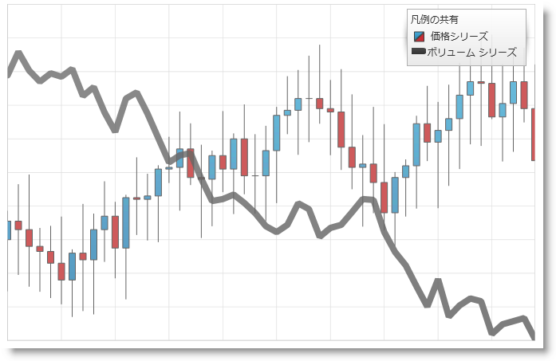

////

|metadata|
{
    "name": "datachart-common-legend",
    "controlName": ["{DataChartName}"],
    "tags": ["Application Scenarios","Charting","How Do I"],
    "guid": "41bed3d3-e267-4b63-bef1-2aefa06efc64",  
    "buildFlags": ["wpf","win-universal"],
    "createdOn": "2014-06-05T19:39:00.6763883Z"
}
|metadata|
////

= 共通凡例の追加

デフォルトでは、 link:{DataChartLink}.{DataChartName}.html[{DataChartName}] はチャート コントロールのシリーズに link:datachart-legends.html[チャート凡例]を表示しません。複数の Series で共通の凡例を表示したい場合、Legend オブジェクトをアプリケーションに追加して、それを {DataChartName} コントロールの link:{DataChartLink}.series{ApiProp}legend.html[Legend] プロパティにバインドする必要があります。さらに、各 Series オブジェクトの link:{DataChartLink}.series{ApiProp}title.html[Title] プロパティを設定する必要があります。そうでなければ、対応する凡例項目はデフォルトの Series タイトルを使用します。

以下のコード例は、{DataChartName} コントロールの Series コレクションで定義された複数のシリーズに共通の凡例を追加する方法を示しています。

ifdef::wpf,win-universal[]

*XAML の場合:*
[source,xaml]
----
<Grid>
    <ig:XamDataChart Legend="{Binding ElementName=Legend}">
        ...
        <ig:XamDataChart.Series>
            <ig:LineSeries Title="Volume Series"/> 
            <ig:FinancialPriceSeries Title="Price Series"/> 
        </ig:XamDataChart.Series>
    </ig:XamDataChart>
    <ig:Legend x:Name="Legend"
               Content="Common Legend" 
               HorizontalAlignment="Right"
               VerticalAlignment="Top">
    </ig:Legend> 
</Grid>
----

endif::wpf,win-universal[]

ifdef::xamarin[]
*XAML の場合:*
[source,xaml]
----
<Grid>
    <ig:XamDataChart Legend="{x:Reference Legend}">
        ...
        <ig:XamDataChart.Series>
            <ig:LineSeries Title="Volume Series"/> 
            <ig:FinancialPriceSeries Title="Price Series"/> 
        </ig:XamDataChart.Series>
    </ig:XamDataChart>
    <ig:Legend x:Name="Legend"  
               HorizontalOptions="EndAndExpand"
               VerticalOptions="StartAndExpand">
    </ig:Legend> 
</Grid>
----
endif::xamarin[]

以下の画像は、{DataChartName} コントロールが複数のシリーズの凡例でどのように見えるかを示しています。

== 関連コンテンツ

ifdef::wpf,win-universal[]
* link:datachart-docking-legends.html[凡例のドッキング]

endif::wpf,win-universal[]

* link:datachart-multiple-legends.html[複数凡例の追加]