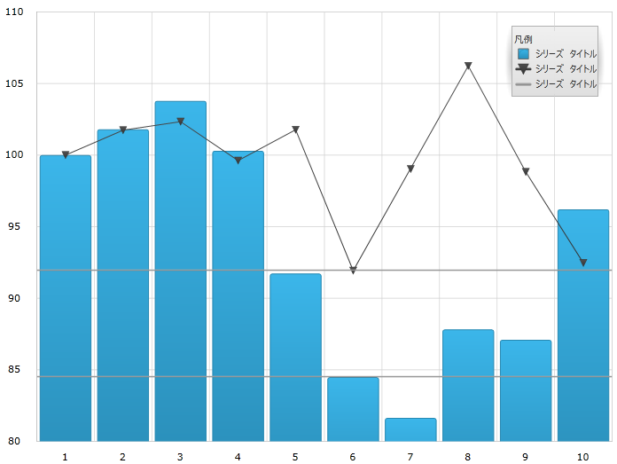
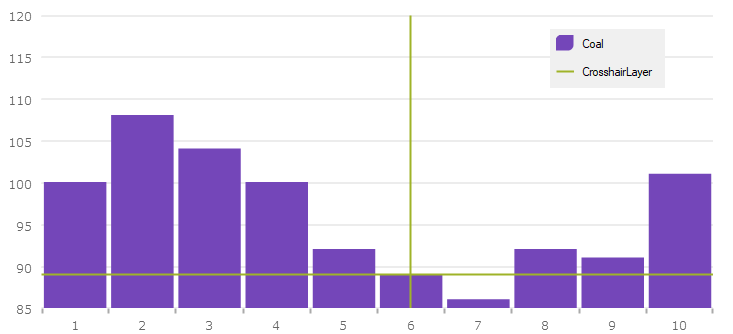

////
|metadata|
{
    "name": "datachart-commonproperties",
    "controlName": ["{DataChartName}"],
    "tags": ["Charting","Getting Started","How Do I"],
    "guid": "e082c77a-7b8f-48f8-9c9d-2db8f4a4a2cd",  
    "buildFlags": ["ANDROID","SL","WPF","WINFORMS"],
    "createdOn": "2014-06-05T19:39:00.6283712Z"
}
|metadata|
////

= 共通のプロパティ

=== 目的

このトピックは、pick:[wpf,sl,win-forms,win-universal,win-forms="ホバー"]pick:[xamarin="タッチ"]操作機能が、 link:{DataChartLink}.series_members.html[Series] クラスから継承したツールチップの相互作用を強調表示pick:[wpf,sl,win-forms,win-universal="、ホバリング"]および相互作用するために使用するプロパティおよびメソッドについての情報を提供します。

=== 前提条件

本トピックの理解を深めるために、以下のトピックを参照することをお勧めします。

[options="header", cols="a,a"]
|====
|トピック|目的

| link:datachart-getting-started-with-datachart.html[{DataChartName} を使用した作業の開始]
|{DataChartName} コントロールは、コントロールの pick:[wpf,sl,win-forms,win-universal="DataContext"]pick:[xamarin="BindingContext"]pick:[win-forms="DataSource"] プロパティにマップされるデータ オブジェクト モデルを必要とします。ここでは、簡単なデータ オブジェクト モデルを提供しますが、自分自身で作成し、このサンプル コードの代わりに使用することができます。

| link:datachart-category-series-overview.html[カテゴリ シリーズ]
|このトピックは、{DataChartName} コントロールのカテゴリ シリーズのさまざまなタイプを説明します。

|====

toc::[]

[[Overview]]
== 概要

=== 共通プロパティの概要

pick:[wpf,sl,win-forms,win-universal="ホバー"]pick:[xamarin="タッチ"] インタラクション レイヤーは、pick:[wpf,sl,win-forms,win-universal="ホバー"]pick:[xamarin="タッチ"]操作のコンテキストに関係する link:{DataChartLink}.series_members.html[Series] 基本クラスのプロパティおよびメソッドを継承します。たとえば、pick:[wpf,sl,win-forms,win-universal="ホバー"]pick:[xamarin="タッチ"]操作の設計ではpick:[wpf,sl,win-forms,win-universal="マウス"]pick:[xamarin="タッチ位置"]とは対話しないため、pick:[wpf,sl,win-forms,win-universal="マウス"]pick:[xamarin="タッチ"] イベントを起動しません。また、pick:[wpf,sl,win-forms,win-universal="ホバー"]pick:[xamarin="タッチ"] インタラクション レイヤーはデータを直接表示しないため、 link:{DataChartLink}.series~scrollintoview.html[ScrollIntoView] のようなメソッドはこの機能には該当しません。

[[CommonProperties]]
== 共通のプロパティ

=== 共通項目のサマリー

以下の表は、pick:[wpf,sl,win-forms,win-universal="ホバー"]pick:[xamarin="タッチ"] インタラクション クラスより継承された link:{DataChartLink}.series_members.html[Series] クラス プロパティをまとめたものです。

[options="header", cols="a,a,a"]
|====
|プロパティ名|プロパティ タイプ|説明

| link:{DataChartLink}.series{ApiProp}brush.html[Brush]
|`Brush`
|pick:[wpf,sl,win-forms,win-universal="ホバー"]pick:[xamarin="タッチ"] インタラクション レイヤーは相互作用しているシリーズからその link:{DataChartLink}.series{ApiProp}brush.html[Brush] を継承します。しかしこれには、 link:{DataChartLink}.series{ApiProp}brush.html[Brush] プロパティを直接設定してオーバーライドできます。

| link:{DataChartLink}.series{ApiProp}outline.html[Outline]
|`Brush`
|このプロパティは、上記に表示される link:{DataChartLink}.series{ApiProp}brush.html[Brush] プロパティと同じガイドラインに従います。

| link:{DataChartLink}.annotationlayer{ApiProp}cursorposition.html[CursorPosition]
|`Point`
|このプロパティは、デフォルトのpick:[wpf,sl,win-forms,win-universal="マウス"]pick:[xamarin="タッチ"]位置 (NaN, NaN) でなく使用するワールド位置を指定します。このプロパティを設定すると、提供されるワールド位置に特定のレイヤーを固定します。 

.注: 

[NOTE] 

==== 

ワールド位置に軸の全体範囲に対するカーソルのグローバル位置を表す 0 から 1 の範囲にある x 値と y 値があります。

====

ifdef::xaml,win-forms[]
| link:{DataChartLink}.series{ApiProp}isdefaultcrosshairbehaviordisabled.html[IsDefaultCrosshairBehaviorDisabled]
|`bool`
|このプロパティは、シリーズのデフォルト十字線がチャート上のpick:[wpf,sl,win-forms,win-universal="ホバー"]pick:[xamarin="タッチ"] インタラクション レイヤーであるときに無効になります。デフォルト値は True です。
endif::xaml,win-forms[]

| link:{DataChartLink}.annotationlayer{ApiProp}useindex.html[UseIndex]
|`bool`
|このプロパティは、pick:[wpf,sl,win-forms,win-universal="ホバー"]pick:[xamarin="タッチ"] インタラクション レイヤーがシリーズ インデックスを使用し、{DataChartName} コントロールに割り当てられるブラシ コレクションに色を予約するかどうかを指定します。デフォルト値は False です。

| link:{DataChartLink}.annotationlayer{ApiProp}uselegend.html[UseLegend]
|`bool`
|このプロパティは、pick:[wpf,sl,win-forms,win-universal="ホバー"]pick:[xamarin="タッチ"] インタラクション レイヤーを凡例に表示するかどうかを指定します。このプロパティを true に設定すると、凡例に表示する必要があるものとしてシリーズをインデックス化します。凡例で認識するためには、シリーズに単一の色を割り当てなければなりません。デフォルト値は False です。

|====

[[SettingtheInheritedPropertiesonaCrosshairLayer]]
== 十字線レイヤーで継承されたプロパティを設定

=== 例

以下のスクリーンショットは、以下の設定を使用した _{DataChartName}_ コントロールの link:{DataChartLink}.crosshairlayer.html[CrosshairLayer] を示します。

[options="header", cols="a,a"]
|====
|プロパティ|値

| link:{DataChartLink}.annotationlayer{ApiProp}cursorposition.html[CursorPosition]
|0.55, 0.55

| link:{DataChartLink}.annotationlayer{ApiProp}uselegend.html[UseLegend]
|True

|====

ifdef::wpf,sl,win-universal[]

endif::wpf,sl,win-universal[]

ifdef::xamarin[]
image::images/XF_Common_Properties_1.png[]
endif::xamarin[]

ifdef::win-forms[]

endif::win-forms[]

以下のコードはこの実装で使用されます。

ifdef::wpf,win-universal[]

*XAML の場合:*

[source,xaml]
----
<ig:CrosshairLayer VerticalLineVisiblity="Collapsed"
                   Legend="{Binding ElementName=TitleLegend}"
                   UseLegend="True"
                   CursorPosition="0.55, 0.55"/>
----

endif::wpf,win-universal[]

ifdef::xamarin[]

*XAML の場合:*

[source,xaml]
----
<ig:CrosshairLayer VerticalLineVisiblity="Collapsed"
                   Legend="{x:Reference TitleLegend}"
                   UseLegend="True"
                   CursorPosition="0.55, 0.55"/>
----

endif::xamarin[]

ifdef::wpf,win-universal[]

*C# の場合:*

[source,csharp]
----
var crosshairLayerSeries = new CrosshairLayer();
crosshairLayerSeries.UseLegend = true;
crosshairLayerSeries.CursorPosition = new Point(0.55, 0.55);
chart.Series.Add(crosshairLayerSeries);
----

endif::wpf,win-universal[]

ifdef::win-forms[]

*C# の場合:*

[source,csharp]
----
CrosshairLayer crosshairLayerSeries = new CrosshairLayer();
crosshairLayerSeries.UseLegend = true;
crosshairLayerSeries.CursorPosition = new Infragistics.Win.DataVisualization.Point(0.55, 0.55);
crosshairLayerSeries.Title = "CrosshairLayer";
crosshairLayerSeries.Legend = legend;
chart.Series.Add(crosshairLayerSeries);
----

endif::win-forms[]

ifdef::xamarin[]

*C# の場合:*

[source]
----
var crosshairLayerSeries = new CrosshairLayer();
crosshairLayerSeries.UseLegend = True;
crosshairLayerSeries.CursorPosition = new Point(0.55, 0.55);
chart.Series.Add(crosshairLayerSeries);
----

endif::xamarin[]

[[_Ref345510469]]
== 関連コンテンツ

=== トピック

[options="header", cols="a,a"]
|====
|トピック|目的

| link:datachart-chartannotationlayers.html[チャート注釈レイヤー]
|このトピックは、利用可能な異なる型のpick:[wpf,sl,win-forms,win-universal="ホバー"]pick:[xamarin="タッチ"]操作レイヤーなど、 link:{DataChartLink}.{DataChartName}.html[{DataChartName}™] コントロール上で利用できるpick:[wpf,sl,win-forms,win-universal="ホバー"]pick:[xamarin="タッチ"]操作について概念的な情報を提供します。

| link:datachart-crosshairlayer.html[十字線レイヤー]
|このトピックは、pick:[wpf,sl,win-forms,win-universal="ホバー"]pick:[xamarin="タッチ"]操作に使用される十字線レイヤーについての情報を提供します。十字線のプロパティについて説明し、実装例を示します。

| link:datachart-categoryitemhighlightlayer.html[カテゴリ項目強調表示レイヤー]
|このトピックは、pick:[wpf,sl,win-forms,win-universal="ホバー"]pick:[xamarin="タッチ"]操作に使用されるカテゴリ項目強調表示レイヤーについての情報を提供します。カテゴリ項目強調表示レイヤーのプロパティについて説明し、実装例を示します。

| link:datachart-categorytooltiplayer.html[カテゴリ ツールチップ レイヤー]
|このトピックは、pick:[wpf,sl,win-forms,win-universal="ホバー"]pick:[xamarin="タッチ"]操作に使用されるカテゴリ ツールチップ レイヤーについての情報を提供します。カテゴリ ツールチップ レイヤーのプロパティについて説明し、実装例を提供します。

| link:datachart-itemtooltiplayer.html[項目ツールチップ レイヤー]
|このトピックは、pick:[wpf,sl,win-forms,win-universal="ホバー"]pick:[xamarin="タッチ"]操作に使用される項目ツールチップ レイヤーについての情報を提供します。項目ツールチップ レイヤーのプロパティについて説明し、実装例も提供します。

| link:datachart-annotation-overlays.html[チャート オーバーレイ テキスト]
|このトピックでは、さまざまなタイプのpick:[wpf,sl,win-universal,win-forms="ホバー"]pick:[xamarin="タッチ"] オーバーレイ テキストのカスタマイズを含む、link:{DataChartLink}.{DataChartName}.html[{DataChartName}™] コントロールで使用できるpick:[wpf,sl,win-universal,win-forms="ホバー"]pick:[xamarin="タッチ"]操作に関する概念的な情報を提供します。

|====