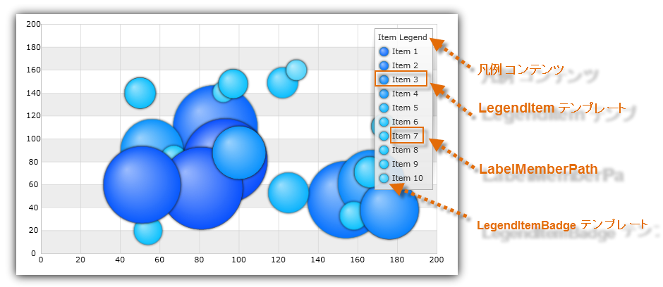

////

|metadata|
{
    "name": "datachart-configuring-itemlegend",
    "controlName": [],
    "tags": [],
    "guid": "5f976875-5ecd-457f-bd5a-194115a651ed",  
    "buildFlags": ["wpf","win-universal","WINFORMS","ANDROID"],
    "createdOn": "2015-09-22T18:25:38.5030504Z"
}
|metadata|
////

= 項目凡例の構成

このトピックでは、link:{ItemLegendLink}.{ItemLegendName}.html[{ItemLegendName}] コントロールを構成する方法をコード例と共に説明します。また link:{DataChartLink}.{DataChartName}.html[{DataChartName}] で link:datachart-series.html[チャート シリーズ]で使用する方法についても説明します。

[[Overview]]
== 概要

トピックは以下のとおりです。

* <<Introduction,概要>>
* <<Requirements,要件>>
* <<CodeExample,コード例>>
* <<RelatedContent,関連コンテンツ>>

[[Introduction]]
== 概要

項目凡例コントロールは、 link:{DataChartLink}.bubbleseries.html[BubbleSeries] にバインドするデータ項目をチャートプロット領域のビジュアル表示で識別します。凡例のビジュアルは、データ項目の link:{DataChartLink}.bubbleseries{ApiProp}labelmemberpath.html[LabelMemberPath] プロパティに一致する凡例テキストおよびシリーズの色を表す凡例バッジを持つ凡例項目の一覧で構成されます。pick:[wpf,win-universal="また、`{ItemLegendName}` には凡例項目上に表示する凡例タイトルがあります。"]

[[Properties]]
== プロパティ

項目凡例コントロールは、他のチャート凡例タイプのある共通プロパティを共有します。これらの共通プロパティの一覧は、 link:datachart-legends.html[チャート凡例] トピックを参照してください。

[[Requirements]]
== 要件

`{ItemLegendName}` コントロールは、`BubbleSeries` のみサポートし、凡例項目をシリーズにバインドした各データ メンバーに表示します。以下の表には、この凡例のすべての要件を示します。

ifdef::win-forms,wpf,win-universal,android,xamarin[]

[options="header", cols="a,a,a"]
|====
|Series プロパティ|プロパティ タイプ|説明

| link:{DataChartLink}.series{ApiProp}legend.html[Legend]
| `{LegendBase}` 
|シリーズにバインドする項目凡例を決定します。

| link:{DataChartLink}.bubbleseries{ApiProp}labelmemberpath.html[LabelMemberPath]
|`string`
|バブルのラベルを決定するデータ列

ifdef::wpf,win-universal[]
|pick:[wpf,win-universal="link:{DataChartLink}.series{ApiProp}legenditemtemplate.html[LegendItemTemplate]"]
|`DataTemplate`
|指定したチャート シリーズの凡例項目のためのテンプレートを決定します。
endif::wpf,win-universal[]

|====

endif::win-forms,wpf,win-universal,android,xamarin[]

[[CodeExample]]
== コード例

以下のコード例は、Label データ列にマップされた `LabelMemberPath` を使用して ItemLegend を link:{DataChartLink}.bubbleseries.html[BubbleSeries] にバインドする方法を示します。(図 3)

図 1: Label データ列にマップされた LabelMemberPath を使用して BubbleSeries にバインドされた項目凡例。

ifdef::wpf,win-universal[]

*XAML の場合:*
[source,xaml]
----
<ig:{DataChartName} >
    <ig:{DataChartName}.Series>
        <ig:BubbleSeries Legend="{Binding ElementName=ItemLegend}"
                         LabelMemberPath="Label">
        </ig:BubbleSeries>
    </ig:{DataChartName}.Series>
</ig:{DataChartName}>
<ig:ItemLegend x:Name="ItemLegend" Content="Item Legend" /> 
----

endif::wpf,win-universal[]

ifdef::xamarin[]

*XAML の場合:*
[source,xaml]
----
<ig:{DataChartName} >
    <ig:{DataChartName}.Series>
        <ig:BubbleSeries LabelMemberPath="Label"
                         Legend="{x:Reference ItemLegend}" >
        </ig:BubbleSeries>
    </ig:{DataChartName}.Series>
</ig:{DataChartName}>
<ig:ItemLegend x:Name="ItemLegend"  />
----

endif::xamarin[]

ifdef::xamarin[]

*C# の場合:*
[source,csharp]
----
var itemLegend = new ItemLegend();
var series = new BubbleSeries();
series.LabelMemberPath = "Label";
series.Legend = itemLegend;
...
var DataChart = new {DataChartName}();
dataChart.Series.Add(series);
----

endif::xamarin[]

ifdef::wpf,win-universal[]

*C# の場合:*
[source,csharp]
----
var itemLegend = new ItemLegend
{
    Content = "Item Legend" 
};
var series = new BubbleSeries();
series.LabelMemberPath = "Label";
series.Legend = itemLegend;
var DataChart = new {DataChartName}();
dataChart.Series.Add(series);
----

endif::wpf,win-universal[]

ifdef::win-forms[]

*C# の場合:*
[source,csharp]
----
var itemLegend = new UltraItemLegend;
var series = new BubbleSeries();
series.LabelMemberPath = "Label";
series.Legend = itemLegend;
var DataChart = new {DataChartName}();
dataChart.Series.Add(series);
----

endif::win-forms[]

ifdef::wpf,win-universal[]

*Visual Basic の場合:*
[source,vb]
----
Dim itemLegend As New ItemLegend() With { .Content = "Item Legend" }
Dim series As New BubbleSeries()
series.LabelMemberPath = "Label"
series.Legend = itemLegend
Dim dataChart As New {DataChartName}()
dataChart.Series.Add(series)
----

endif::wpf,win-universal[]

ifdef::win-forms[]
*Visual Basic の場合:*
[source,vb]
---- 
Dim itemLegend As New {ItemLegendName}
Dim series As New BubbleSeries()
series.LabelMemberPath = "Label"
series.Legend = itemLegend
Dim dataChart As New {DataChartName}()
dataChart.Series.Add(series)
---- 
endif::win-forms[]

ifdef::android[]

*Java の場合:*

[source,js]
----
DataChartView chart = new DataChartView(rootView.getContext());
chart.setId(1111); //ビューを識別するための任意の integer
ItemLegendView legend = new ItemLegendView(rootView.getContext());
RelativeLayout.LayoutParams legendParams = new RelativeLayout.LayoutParams(ViewGroup.LayoutParams.WRAP_CONTENT, ViewGroup.LayoutParams.WRAP_CONTENT);
legend.setContentDescription("Legend");
legendParams.addRule(RelativeLayout.ALIGN_TOP, chart.getId());
legendParams.addRule(RelativeLayout.ALIGN_RIGHT, chart.getId());
legend.setLayoutParams(legendParams);
legend.setLebelMemberPath("Label");
BubbleSeries series1 = new BubbleSeries();
series1.setLegend(legend);
chart.addSeries(series1);
----

endif::android[]

[[RelatedContent]]
== 関連コンテンツ

* link:datachart-configuring-basiclegend.html[基本凡例の構成]

ifdef::wpf,win-universal,xamarin,win-forms[]
* link:datachart-configuring-scalelegend.html[スケール凡例の構成]
endif::wpf,win-universal,xamarin,win-forms[]

ifdef::wpf,win-universal,xamarin[]
* link:datachart-common-legend.html[共通凡例の追加]
endif::wpf,win-universal,xamarin[]

ifdef::wpf,win-universal,xamarin[]
* link:datachart-multiple-legends.html[複数凡例の追加]
endif::wpf,win-universal,xamarin[]

ifdef::wpf,win-universal[]
* link:datachart-docking-legends.html[凡例のドッキング]
endif::wpf,win-universal[]