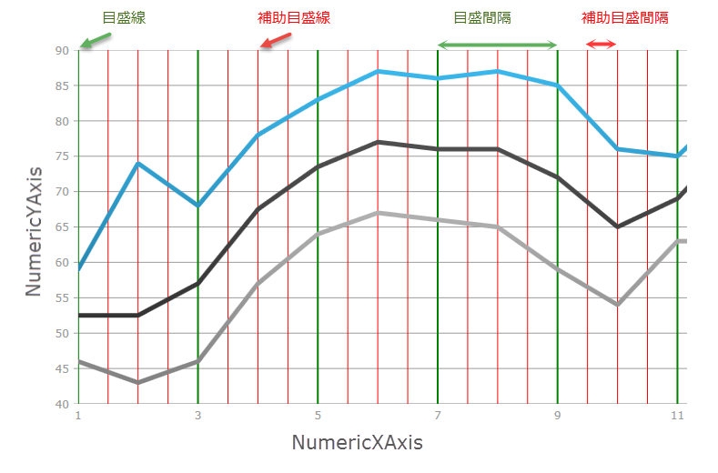
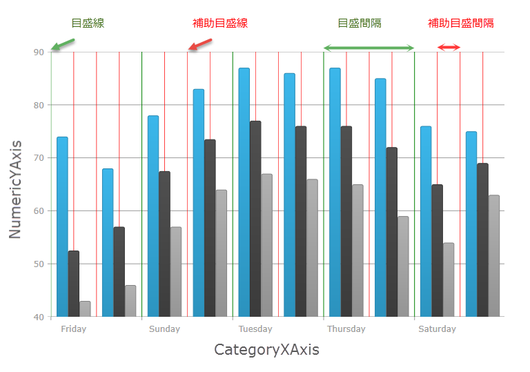
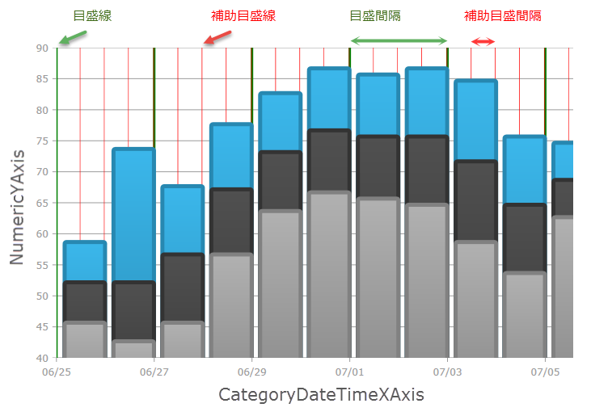

////

|metadata|
{
    "name": "datachart-configuring-major-and-minor-intervals",
    "controlName": [],
    "tags": [],
    "guid": "6d3aa20a-424c-4184-a11d-f04c7d4ff0c1",  
    "buildFlags": [],
    "createdOn": "2015-07-08T17:39:16.9550036Z"
}
|metadata|
////

= 主間隔と副間隔の構成

== トピックの概要

=== 目的

このトピックではコード例を使用して、 _{DataChartName}_  コントロールのチャート軸に主目盛と副目盛を構成する方法を説明します。

=== 前提条件

本トピックの理解を深めるために、以下のトピックを参照することをお勧めします。

[options="header", cols="a,a"]
|====
|トピック|目的

| link:datachart-getting-started-with-datachart.html[データ チャートを使用した作業の開始]
|{DataChartName} コントロールは、データ セットおよびデータ バインディングが必要です。このトピックでは、簡単なデータ オブジェクト モデルを提供する方法を示します。

| link:datachart-axes.html[チャート軸]
|このトピックは、 _{DataChartName}_ コントロールによってサポートされる軸のタイプを紹介します。

|====

=== このトピックの内容

このトピックは、以下のセクションで構成されます。

* <<_Ref421278386,軸に主間隔と副間隔を構成>>

** <<_Ref421279076,機能概要>>
** <<_Ref421278621,デザイン情報>>
** <<_Ref423010055,パフォーマンスへの影響>>
** <<_Ref422987569,NumericYAxis を使用した例>>
** <<_Ref422987654,NumericXAxis を使用した例>>
** <<_Ref422987623,CategoryXAxis を使用した例>>
** <<_Ref424054460,Category-DateTimeXAxis を使用した例>>

[[_Ref421278386]]
== 軸に副間隔を構成

[[_Ref421279076]]

=== 機能概要

{DataChartName} コントロールで、軸の主間隔は主グリッド線および軸ラベルがどれくらいの頻度で軸に描画されるかを指定します。同様に、軸副間隔は副グリッド線が軸に描画される頻度を指定します。

主間隔および副間隔はすべての数値およびカテゴリでサポートされます:

* link:{DataChartLink}.numericxaxis_members.html[NumericXAxis]
* link:{DataChartLink}.numericyaxis_members.html[NumericYAxis]
* link:{DataChartLink}.categoryxaxis_members.html[CategoryXAxis]
* link:{DataChartLink}.categoryyaxis_members.html[CategoryYAxis]
* link:{DataChartLink}.categorydatetimexaxis_members.html[CategoryDateTimeXAxis]
* link:{DataChartLink}.categoryangleaxis_members.html[CategoryAngleAxis]
* link:{DataChartLink}.numericangleaxis_members.html[NumericAngleAxis]
* link:{DataChartLink}.numericradiusaxis_members.html[NumericRadiusAxis]

以下は、緑の線で主間隔に値 10 を使用した NumericYAxis 上の主間隔の画像です。NumericYAxis の副間隔には赤い線と値に 2.5 を使用しています。

image::images/DataChart_Configuring_Major_and_Minor_Intervals_1.png[]

軸の主間隔および副間隔の実装は、軸で link:{DataChartLink}.numericxaxis_members.html[Interval] および link:{DataChartLink}.numericxaxis_members.html[MinorInterval] プロパティの値を 0 より大きくする必要があります。副間隔に対する副グリッド線を表示するには、軸の link:{DataChartLink}.numericxaxis_members.html[MinorStroke] および link:{DataChartLink}.numericxaxis_members.html[MinorStrokeThickness] プロパティを設定する必要があります。副グリッド線はデフォルトの色または太さが設定されていないため、表示するにはそれらをあらかじめ設定する必要があります。

[[_Ref421278621]]

=== デザイン情報

以下の表は、副間隔に使用するエフェクトの取得に必要となるプロパティ変更のマッピングを示します。

[options="header", cols="a,a,a"]
|====
|構成の目的:|使用するプロパティ|設定の選択肢:

|主間隔グリッド線の頻度。
| link:{DataChartLink}.numericxaxis_members.html[Interval]
|この値は軸ラベルおよび主間隔グリッド線に適切なスペース (使用される場合) を提供します。軸ラベルの間隔はこの値にも設定されます。間隔に関連付けられる軸ポイントに １ ラベル表示されます。 

この値は、カテゴリ軸で最初の項目から最後のカテゴリ項目までのインデックスとして表示されます。通常この値は、すべての軸ラベルが軸にフィットし、他の軸ラベルにクリップされないために、カテゴリ総数の 10-20% に相当します。 

数値軸でこの値は軸の最小値から最大値までの double として表示されます。デフォルトで数値軸は軸の最小値および最高値に基づいて自動的に適切な間隔を計算します。 

Date Time 軸でこの値は軸の最小値から最大値までの期間として表示されます。

|主間隔グリッド線の色
| link:{DataChartLink}.numericxaxis_members.html[MajorStroke]
|軸主間隔の色。

|主間隔グリッド線の太さ
| link:{DataChartLink}.numericxaxis_members.html[MajorStrokeThickness]
|double 値で設定された軸主目盛のピクセルでの太さ。

|主間隔グリッド線の破線
|link:{DataChartLink}.numericxaxis_members.html[MajorStrokeDashArray]
|ダッシュ配列内のダッシュの長さを記述するパラメータとして `double[]` を受け取る `DoubleCollection`。

|[[_Hlk356484826]] 

副間隔グリッド線の頻度
| link:{DataChartLink}.numericxaxis_members.html[MinorInterval]
|この値は、常に主間隔軸の間に描画される副グリッド線に適切なスペースを提供します。結果として、 link:{DataChartLink}.numericxaxis_members.html[MinorInterval] プロパティの値は主 Interval プロパティの値より小さい値でなければなりません。 

カテゴリ軸で、この値は主 link:{DataChartLink}.numericxaxis_members.html[Interval] プロパティの小数として表示されます。通常、この値は 0.25 から 0.5 の間です。 

数値軸でこの値は軸の最小値から最大値までの double として表示されます。デフォルトで数値軸は軸の最小値および最高値に基づいて自動的に適切な間隔を計算しません。 

Date Time 軸でこの値は軸の最小値から最大値までの期間として表示されます。

|副間隔グリッド線の色
| link:{DataChartLink}.numericxaxis_members.html[MinorStroke]
|軸副間隔の色。

|副間隔グリッド線の太さ
| link:{DataChartLink}.numericxaxis_members.html[MinorStrokeThickness]
|double 値で設定された軸副目盛のピクセルでの太さ。

|A dashed line for the minor interval gridlines
|link:{DataChartLink}.numericxaxis_members.html[MinorStrokeDashArray]
|A `DoubleCollection` taking a `double[]` as its parameter to describe the length of the dashes in the dash array.

|====

[[_Ref423010055]]

=== パフォーマンスへの影響

チャート コントロールで軸の主間隔と副間隔に以下のようなパフォーマンスに対する影響があります。

主 link:{DataChartLink}.numericxaxis_members.html[Interval] プロパティに非常に小さい値 (軸範囲と比較) を設定することによって、チャートが多くの主グリッド線を描画します。これによってユーザーがズームやパン操作でチャートとインタラクション時、あるいは軸範囲によってパフォーマンスが低下する場合があります。このプロパティは設定せずに、チャートで自動的に適切な主間隔を計算することをお勧めします。主 link:{DataChartLink}.numericxaxis_members.html[Interval] プロパティを設定することにより、主プロパティの値以下の軸範囲にユーザーがズームした場合に、軸ラベルと主グリッド線を描画しません。ただし、プロパティが未設定、あるいはユーザーがこのプロパティの値より軸範囲が小さくなるようズームする場合、チャートは自動的に主 link:{DataChartLink}.numericxaxis_members.html[Interval] プロパティを再計算します。

link:{DataChartLink}.numericxaxis_members.html[MinorInterval] プロパティに小さい値を設定するとチャートに多くの副グリッド線が描画されるため、主 link:{DataChartLink}.numericxaxis_members.html[Interval] プロパティを設定するよりもパフォーマンスが低下します。これはチャートにズームやパン操作を行うユーザーに認識される場合があります。

[[_Ref421278638]]

[[_Ref418859490]]

[[_Ref422987470]]

=== NumericYAxis を使用した例

以下のスクリーンショットは、以下の間隔に関する設定で  _{DataChartName}_  コントロールの NumericYAxis の外観を示します。

[options="header", cols="a,a"]
|====
|プロパティ|値

|MinorInterval
|2.5

|MinorStroke
|Red

|MinorStrokeThickness
|1

|Interval
|10

|MajorStroke
|Green

|MajorStrokeThickness
|2

|====

image::images/DataChart_Configuring_Major_and_Minor_Intervals_1.png[]

ifdef::xaml[]

*XAML の場合:*

[source,XAML]
----
<ig:NumericYAxis x:Name="yAxis"
                  MinorInterval="2.5" 
                  MinorStroke="Red" 
                  MinorStrokeThickness="1"
                  Interval="10"
                  MajorStroke="Green" 
                  MajorStrokeThickness="2"/>
----

endif::xaml[]

ifdef::wpf[]

*C# の場合:*

[source,csharp]
----
var yAxis = new NumericYAxis();
yAxis.MinorInterval = 2.5;
yAxis.MinorStrokeThickness = 1;
yAxis.MinorStroke = new SolidColorBrush("Red");
yAxis.Interval = 10;
yAxis.MajorStrokeThickness = 2;
yAxis.MajorStroke = new SolidColorBrush("Green");
----

endif::wpf[]

ifdef::win-forms[]

*C# の場合:*

[source,csharp]
----
var yAxis = new NumericYAxis();
yAxis.MinorInterval = 2.5;
yAxis.MinorStrokeThickness = 1;
yAxis.MinorStroke = new SolidColorBrush(Color.Red);
yAxis.Interval = 10;
yAxis.MajorStrokeThickness = 2;
yAxis.MajorStroke = new SolidColorBrush(Color.Green);
----

endif::win-forms[]

ifdef::xamarin[]

*C# の場合:*

[source,csharp]
----
var yAxis = new NumericYAxis();
yAxis.MinorInterval = 2.5;
yAxis.MinorStrokeThickness = 1;
yAxis.MinorStroke = new SolidColorBrush("Red");
yAxis.Interval = 10;
yAxis.MajorStrokeThickness = 2;
yAxis.MajorStroke = new SolidColorBrush("Green");
----

endif::xamarin[]

ifdef::wpf[]

*Visual Basic の場合:*

[source,vb]
----
Dim yAxis = New NumericYAxis()
yAxis.MinorInterval = 2.5
yAxis.MinorStrokeThickness = 1
yAxis.MinorStroke = New SolidColorBrush(Red)
yAxis.Interval = 10
yAxis.MajorStrokeThickness = 1
yAxis.MajorStroke = New SolidColorBrush(Green)
----

endif::wpf[]

ifdef::win-forms[]

*Visual Basic の場合:*

[source,vb]
----
Dim yAxis = New NumericYAxis()
yAxis.MinorInterval = 2.5
yAxis.MinorStrokeThickness = 1
yAxis.MinorStroke = New SolidColorBrush(Color.Red)
yAxis.Interval = 10
yAxis.MajorStrokeThickness = 1
yAxis.MajorStroke = New SolidColorBrush(Color.Green)
----

endif::win-forms[]

ifdef::android[]

*Java の場合:*

[source,js]
----
NumericYAxis yAxis = new NumericYAxis();     
yAxis.MinorInterval = 2.5;
yAxis.MinorStrokeThickness = 1;
yAxis.MinorStroke = new SolidColorBrush(Red");
yAxis.Interval = 10;
yAxis.MajorStrokeThickness = 2;
yAxis.MajorStroke = new SolidColorBrush("Green");
----

endif::android[]

[[_Ref422987654]]

以下のスクリーンショットは、以下の間隔に関する設定で  _{DataChartName}_  コントロールの NumericYAxis の外観を示します。

[options="header", cols="a,a"]
|====
|プロパティ|値

|MinorInterval
|0.5

|MinorStroke
|Red

|MinorStrokeThickness
|1

|Interval
|2

|MajorStroke
|Green

|MajorStrokeThickness
|2

|====

ifdef::xaml[]

*XAML の場合:*

[source,xaml]
----
<ig:NumericXAxis x:Name="xAxis"
                  MinorInterval="2.5" 
                  MinorStroke="Red" 
                  MinorStrokeThickness="1"
                  Interval="2"
                  MajorStroke="Green" 
                  MajorStrokeThickness="2"/>
----

endif::xaml[]

ifdef::wpf[]

*C# の場合:*

[source,csharp]
----
var xAxis = new NumericXAxis();
xAxis.MinorInterval = 2.5;
xAxis.MinorStrokeThickness = 1;
xAxis.MinorStroke = new SolidColorBrush("Red");
xAxis.Interval = 10;
xAxis.MajorStrokeThickness = 2;
xAxis.MajorStroke = new SolidColorBrush("Green");
----

endif::wpf[]

ifdef::win-forms[]

*C# の場合:*

[source,csharp]
----
var xAxis = new NumericXAxis();
xAxis.MinorInterval = 2.5;
xAxis.MinorStrokeThickness = 1;
xAxis.MinorStroke = new SolidColorBrush("Red");
xAxis.Interval = 10;
xAxis.MajorStrokeThickness = 2;
xAxis.MajorStroke = new SolidColorBrush("Green");
----

endif::win-forms[]

ifdef::xamarin[]

*C# の場合:*

[source,csharp]
----
var xAxis = new NumericXAxis();
xAxis.MinorInterval = 2.5;
xAxis.MinorStrokeThickness = 1;
xAxis.MinorStroke = new SolidColorBrush("Red");
xAxis.Interval = 10;
xAxis.MajorStrokeThickness = 2;
xAxis.MajorStroke = new SolidColorBrush("Green");
----

endif::xamarin[]

ifdef::wpf[]

*Visual Basic の場合:*

[source,vb]
----
Dim xAxis = New NumericXAxis()
xAxis.MinorInterval = 2.5
xAxis.MinorStrokeThickness = 1
xAxis.MinorStroke = New SolidColorBrush(Red)
xAxis.Interval = 10
xAxis.MajorStrokeThickness = 2
xAxis.MajorStroke = New SolidColorBrush(Green)
----

endif::wpf[]

ifdef::win-forms[]

*Visual Basic の場合:*

[source,vb]
----
Dim xAxis = New NumericXAxis()
xAxis.MinorInterval = 2.5
xAxis.MinorStrokeThickness = 1
xAxis.MinorStroke = New SolidColorBrush(Red)
xAxis.Interval = 10
xAxis.MajorStrokeThickness = 2
xAxis.MajorStroke = New SolidColorBrush(Green)
----

endif::win-forms[]

ifdef::android[]

*Java の場合:*

[source,js]
----
NumericXAxis xAxis = new NumericXAxis();     
xAxis.MinotrInterval = 2.5;
xAxis.MinorStrokeThickness = 1;
xAxis.MinorStroke = new SolidColorBrush(Red");
xAxis.Interval = 10;
xAxis.MajorStrokeThickness = 2;
xAxis.MajorStroke = new SolidColorBrush("Green");
----

endif::android[]

[[_Ref422987623]]

=== CategoryXAxis を使用した例

以下のスクリーンショットは、以下の間隔に関する設定の結果として、 _{DataChartName}_  コントロールの CategoryXAxis の外観を示します。

[options="header", cols="a,a"]
|====
|プロパティ|値

|MinorInterval
|0.5

|MinorStroke
|Red

|MinorStrokeThickness
|1

|Interval
|2

|MajorStroke
|Green

|MajorStrokeThickness
|2

|CategoryXAxis.Gap
|0.5

|====

ifdef::xaml[]

*XAML の場合:*

[source,xaml]
----
<ig:CategoryXAxis x:Name="xAxis"
                  MinorInterval="2.5" 
                  MinorStroke="Red" 
                  MinorStrokeThickness="2"
                  Interval="2"
                  MajorStroke="Green" 
                  MajorStrokeThickness="1"/>
----

endif::xaml[]

ifdef::wpf[]

*C# の場合:*

[source,csharp]
----
var xAxis= new CategoryXAxis();
xAxis.MinorInterval = 2.5;
xAxis.MinorStrokeThickness = 1;
xAxis.MinorStroke = new SolidColorBrush("Red");
xAxis.Interval = 10;
xAxis.MajorStrokeThickness = 2;
xAxis.MajorStroke = new SolidColorBrush("Green");
----

endif::wpf[]

ifdef::win-forms[]

*C# の場合:*

[source,csharp]
----
var xAxis= new CategoryXAxis();
xAxis.MinorInterval = 2.5;
xAxis.MinorStrokeThickness = 1;
xAxis.MinorStroke = new SolidColorBrush("Red");
xAxis.Interval = 10;
xAxis.MajorStrokeThickness = 2;
xAxis.MajorStroke = new SolidColorBrush("Green");
----

endif::win-forms[]

ifdef::xamarin[]

*C# の場合:*

[source,csharp]
----
var xAxis= new CategoryXAxis();
xAxis.MinorInterval = 2.5;
xAxis.MinorStrokeThickness = 1;
xAxis.MinorStroke = new SolidColorBrush("Red");
xAxis.Interval = 10;
xAxis.MajorStrokeThickness = 2;
xAxis.MajorStroke = new SolidColorBrush("Green");
----

endif::xamarin[]

ifdef::wpf[]

*Visual Basic の場合:*

[source,vb]
----
Dim xAxis = New CategoryXAxis()
xAxis.MinorInterval = 2.5
xAxisAxis.MinorStrokeThickness = 1
xAxis.MinorStroke = New SolidColorBrush(Red)
xAxis.Interval = 10
xAxis.MajorStrokeThickness = 2
xAxis.MajorStroke = New SolidColorBrush(Green)
----

endif::wpf[]

ifdef::win-forms[]

*Visual Basic の場合:*

[source,vb]
----
Dim xAxis = New CategoryXAxis()
xAxis.MinorInterval = 2.5
xAxisAxis.MinorStrokeThickness = 1
xAxis.MinorStroke = New SolidColorBrush(Red)
xAxis.Interval = 10
xAxis.MajorStrokeThickness = 2
xAxis.MajorStroke = New SolidColorBrush(Green)
----

endif::win-forms[]

ifdef::android[]

*Java の場合:*

[source,js]
----
CategoryXAxis xAxis = new CategoryXAxis();     
xAxis.MinotrInterval = 2.5;
xAxis.MinorStrokeThickness = 1;
xAxis.MinorStroke = new SolidColorBrush(Red");
xAxis.Interval = 10;
xAxis.MajorStrokeThickness = 2;
xAxis.MajorStroke = new SolidColorBrush("Green");
----

endif::android[]

[[_Ref424054460]]

=== CategoryDateTimeXAxis を使用した例

以下のスクリーンショットは、以下の間隔関連を設定した結果の _{DataChartName}_  コントロールの CategoryDateTimeXAxis の外観を示します。

[options="header", cols="a,a"]
|====
|プロパティ|値

|MinorInterval
|2.5

|MinorStroke
|Red

|MinorStrokeThickness
|1

|Interval
|10

|MajorStroke
|Green

|MajorStrokeThickness
|2

|====

ifdef::xaml[]

*XAML の場合:*

[source,xaml]
----
<ig:CategoryDateTimeXAxis x:Name="xAxis"
                  MinorInterval="00:12:00:00.00"
                  MinorStroke="Red" 
                  MinorStrokeThickness="1"
                  Interval="02:00:00:00.00"
                  MajorStroke="Green" 
                  MajorStrokeThickness="3"/>
----

endif::xaml[]

ifdef::wpf[]

*C# の場合:*

[source,csharp]
----
var xAxis = new CategoryDateTimeXAxis();
xAxis.MinorInterval = new TimeSpan(0, 12, 0, 0);
xAxis.MinorStrokeThickness = 1;
xAxis.MinorStroke = new SolidColorBrush("Red");
xAxis.Interval = new TimeSpan(2, 0, 0, 0);
xAxis.MajorStrokeThickness = 3;
xAxis.MajorStroke = new SolidColorBrush("Green");
----

endif::wpf[]

ifdef::win-forms[]

*C# の場合:*

[source,csharp]
----
var xAxis = new CategoryDateTimeXAxis();
xAxis.MinorInterval = new TimeSpan(0, 12, 0, 0);
xAxis.MinorStrokeThickness = 1;
xAxis.MinorStroke = new SolidColorBrush("Red");
xAxis.Interval = new TimeSpan(2, 0, 0, 0);
xAxis.MajorStrokeThickness = 3;
xAxis.MajorStroke = new SolidColorBrush("Green");
----

endif::win-forms[]

ifdef::xamarin[]

*C# の場合:*

[source,csharp]
----
var xAxis = new CategoryDateTimeXAxis();
xAxis.MinorInterval = new TimeSpan(0, 12, 0, 0);
xAxis.MinorStrokeThickness = 1;
xAxis.MinorStroke = new SolidColorBrush("Red");
xAxis.Interval = new TimeSpan(2, 0, 0, 0);
xAxis.MajorStrokeThickness = 3;
xAxis.MajorStroke = new SolidColorBrush("Green");
----

endif::xamarin[]

ifdef::wpf[]

*Visual Basic の場合:*

[source,vb]
----
Dim xAxis = New CategoryDateTimeXAxis()
xAxis.MinorInterval = New TimeSpan(0, 12, 0, 0)
xAxis.MinorStrokeThickness = 1
xAxis.MinorStroke = New SolidColorBrush(Red)
xAxis.Interval = New TimeSpan(2, 0, 0, 0)
xAxis.MajorStrokeThickness = 3
xAxis.MajorStroke = New SolidColorBrush(Green)
----

endif::wpf[]

ifdef::win-forms[]

*Visual Basic の場合:*

[source,vb]
----
Dim xAxis = New CategoryDateTimeXAxis()
xAxis.MinorInterval = New TimeSpan(0, 12, 0, 0)
xAxis.MinorStrokeThickness = 1
xAxis.MinorStroke = New SolidColorBrush(Red)
xAxis.Interval = New TimeSpan(2, 0, 0, 0)
xAxis.MajorStrokeThickness = 3
xAxis.MajorStroke = New SolidColorBrush(Green)
----

endif::win-forms[]

ifdef::android[]

*Java の場合:*

[source,js]
----
NumericXAxis xAxis = new NumericXAxis();     
xAxis.MinotrInterval = new TimeSpan(0, 12, 0, 0);
xAxis.MinorStrokeThickness = 1;
xAxis.MinorStroke = new SolidColorBrush(Red");
xAxis.Interval = new TimeSpan(2, 0, 0, 0);
xAxis.MajorStrokeThickness = 3;
xAxis.MajorStroke = new SolidColorBrush("Green");
----

endif::android[]

== 関連コンテンツ

=== トピック

このトピックの追加情報については、以下のトピックも合わせてご参照ください。

[options="header", cols="a,a"]
|====
|トピック|目的

| link:datachart-getting-started-with-datachart.html[データ チャートを使用した作業の開始]
|{DataChartName} コントロールは、データ セットおよびデータ バインディングが必要です。このトピックでは、簡単なデータ オブジェクト モデルを提供する方法を示します。

| link:datachart-axes.html[チャート軸]
|このトピックは、 _{DataChartName}_ コントロールによってサポートされる軸のタイプを紹介します。

| link:datachart-category-column-series.html[柱状シリーズ]
|このトピックは、コード例を示して、柱状シリーズを _{DataChartName}_ コントロールで使用する方法を説明します。

| link:datachart-scatter-series-overview.html[散布図シリーズ]
|このトピックは、コード例を示して、散布シリーズ タイプを _{DataChartName}_ コントロールで使用する方法を説明します。

|====