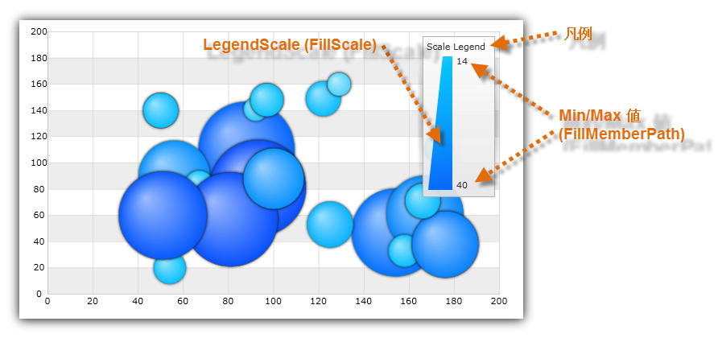

////

|metadata|
{
    "name": "datachart-configuring-scalelegend",
    "controlName": [],
    "tags": [],
    "guid": "fb64119c-2a97-4999-814b-d214043bcb96",  
    "buildFlags": ["wpf","win-universal","WINFORMS"],
    "createdOn": "2015-09-22T18:24:32.8696181Z"
}
|metadata|
////

= スケール凡例の構成

このトピックでは、link:{ScaleLegendLink}.{ScaleLegendName}.html[{ScaleLegendName}] コントロールの構成に関する情報、また link:{DataChartLink}.{DataChartName}.html[{DataChartName}]™ コントロールで link:datachart-series.html[チャート シリーズ]を使用する方法についても説明します。

トピックは以下のとおりです。

* <<Introduction,概要>>
* <<Requirements,要件>>
* <<CodeExample,コード例>>
* <<RelatedContent,関連コンテンツ>>

[[Introduction]]
== 概要

スケール凡例は特殊なタイプの凡例で、 link:{DataChartLink}.valuebrushscale.html[ValueBrushScale] または link:{DataChartLink}.custompalettebrushscale.html[CustomPaletteBrushScale] の link:{DataChartLink}.brushscale{ApiProp}brushes.html[Brushes] コレクションで、 link:{DataChartLink}.bubbleseries.html[BubbleSeries] のバブルに色を割り振る方法を示します。BubbleSeries の link:{DataChartLink}.bubbleseries{ApiProp}fillmemberpath.html[FillMemberPath] プロパティにマップされるデータ列からの最小値と最大値も表示します。ブラシ スケールの使用方法の詳細は、 link:datachart-bubble-series.html[散布バブル シリーズ]トピックを参照してください。pick:[wpf,win-universal="また、凡例には凡例項目上に表示する凡例タイトルがあります。"]

[[Properties]]
== プロパティ

項目凡例コントロールは、他のチャート凡例タイプのある共通プロパティを共有します。これらの共通プロパティの一覧は、 link:datachart-legends.html[チャート凡例] トピックを参照してください。

[[Requirements]]
== 要件

スケール凡例は、シリーズが以下の表のバインド要件を満たしている場合のみ BubbleSeries で使用できます。

[options="header", cols="a,a,a"]
|====
|Series プロパティ|プロパティ タイプ|バインド先のオブジェクト

| link:{DataChartLink}.series{ApiProp}legend.html[Legend]
| `{LegendBase}` 
|シリーズにバインドするスケール凡例を決定します。

| link:{DataChartLink}.bubbleseries{ApiProp}fillscale.html[FillScale]
|`BrushScale`
|バブルのブラシ スケールを定義する link:{DataChartLink}.valuebrushscale.html[ValueBrushScale] または link:{DataChartLink}.custompalettebrushscale.html[CustomPaletteBrushScale]。

| link:{DataChartLink}.bubbleseries{ApiProp}fillmemberpath.html[FillMemberPath]
|`string`
| link:{DataChartLink}.valuebrushscale.html[ValueBrushScale] が link:{DataChartLink}.bubbleseries{ApiProp}fillscale.html[FillScale] プロパティにバインドされる場合、バブルの補間ブラシのデータ列を指定。

|====

[[CodeExample]]
== コード例

コード スニペットは、バブルの塗りつぶしスケールとして ValueBrushScale を使用して Scale Legend を BubbleSeries にバインドする方法を示します。

図 2: バブルの塗りつぶしスケールとして ValueBrushScale を使用して BubbleSeries にバインドされた ScaleLegend

ifdef::wpf,win-universal[]

*XAML の場合:*
[source,xaml]
----
...
<ig:{DataChartName} >
    <ig:{DataChartName}.Series>
        <ig:BubbleSeries FillMemberPath="Radius"  
                         Legend="{Binding ElementName=ScaleLegend}" >
            <ig:BubbleSeries.FillScale>
                <ig:ValueBrushScale MaximumValue="50" MinimumValue="5">
                    <ig:ValueBrushScale.Brushes>
                        <ig:BrushCollection>
                            <SolidColorBrush Color="#FFC6EEFB" />
                            <SolidColorBrush Color="#FF08C3FE" />
                            <SolidColorBrush Color="#FF08A5FE" />
                            <SolidColorBrush Color="#FF086AFE" />
                            <SolidColorBrush Color="#FF084CFE" />
                        </ig:BrushCollection>
                    </ig:ValueBrushScale.Brushes>
                </ig:ValueBrushScale>
            </ig:BubbleSeries.FillScale>
        </ig:BubbleSeries>
    </ig:{DataChartName}.Series>
</ig:{DataChartName}>
<ig:ScaleLegend x:Name="ScaleLegend" Content="Scale Legend" 
                Margin="20" Height="200" Width="120" 
                VerticalAlignment="Top" HorizontalAlignment="Right">
</ig:ScaleLegend >
----

endif::wpf,win-universal[]

ifdef::xamarin[]
*XAML の場合:* 
[source,xaml]
----
xmlns:ig="clr-namespace:Infragistics.XamarinForms.Controls.Charts;assembly=Infragistics.XF.Charts"
xmlns:dv="clr-namespace:Infragistics.XamarinForms;assembly=Infragistics.XF.DataVisualization"
...
<ig:{DataChartName} >
    ...
    <ig:{DataChartName}.Series>
        <ig:BubbleSeries FillMemberPath="Radius"  
                         Legend="{x:Reference ScaleLegend}" >
            <ig:BubbleSeries.FillScale>
                <ig:ValueBrushScale MaximumValue="50" MinimumValue="5">
                    <ig:ValueBrushScale.Brushes>
                        <dv:BrushCollection>
                            <dv:SolidColorBrush Color="#FFC6EEFB" />
                            <dv:SolidColorBrush Color="#FF08C3FE" />
                            <dv:SolidColorBrush Color="#FF08A5FE" />
                            <dv:SolidColorBrush Color="#FF086AFE" />
                            <dv:SolidColorBrush Color="#FF084CFE" />
                        </dv:BrushCollection>
                    </ig:ValueBrushScale.Brushes>
                </ig:ValueBrushScale>
            </ig:BubbleSeries.FillScale>
        </ig:BubbleSeries>
    </ig:{DataChartName}.Series>
</ig:{DataChartName}> 
<ig:ScaleLegend x:Name="ScaleLegend" 
                HorizontalOptions="EndAndExpand"
                VerticalOptions="StartAndExpand">
</ig:ScaleLegend > 
----
endif::xamarin[]

ifdef::wpf,win-universal[]

*Visual Basic の場合:*

----
Imports {DataChartNamespace}
Imports Infragistics
...
Dim scaleLegend As New ScaleLegend() With { _
    .Content = "Scale Legend", _
    .Margin = New Thickness(20), _
    .VerticalAlignment = VerticalAlignment.Top, _
    .HorizontalAlignment = HorizontalAlignment.Right _
}
Dim brushCollection As New BrushCollection()
brushCollection.Add(New SolidColorBrush(Color.FromArgb(&Hff, &HC6, &Hee, &Hfb)))
brushCollection.Add(New SolidColorBrush(Color.FromArgb(&Hff, &H08, &Hc3, &Hfe)))
brushCollection.Add(New SolidColorBrush(Color.FromArgb(&Hff, &H08, &Ha5, &Hfe)))
brushCollection.Add(New SolidColorBrush(Color.FromArgb(&Hff, &H08, &H6a, &Hfe)))
brushCollection.Add(New SolidColorBrush(Color.FromArgb(&Hff, &H08, &H4c, &Hfe)))
Dim brushScale As New ValueBrushScale()
brushScale.Brushes = brushCollection
brushScale.MinimumValue = 5
brushScale.MaximumValue = 200
Dim series As New BubbleSeries()
series.FillScale = brushScale
series.FillMemberPath = "Radius"
series.Legend = scaleLegend
...
Dim dataChart As New {DataChartName}()
dataChart.Series.Add(series)
----

endif::wpf,win-universal[]

ifdef::wpf,win-universal[]

*C# の場合:*
[source,csharp]
----
using {DataChartNamespace};
using Infragistics;
var scaleLegend = new ScaleLegend
{
    Content = "Scale Legend",
    Margin = new Thickness(20),
    VerticalAlignment = VerticalAlignment.Top,
    HorizontalAlignment = HorizontalAlignment.Right
};
var brushCollection = new BrushCollection();
brushCollection.Add(new SolidColorBrush(Color.FromArgb(0xFF, 0xC6, 0xEE, 0xFB)));
brushCollection.Add(new SolidColorBrush(Color.FromArgb(0xFF, 0x08, 0xC3, 0xFE)));
brushCollection.Add(new SolidColorBrush(Color.FromArgb(0xFF, 0x08, 0xA5, 0xFE)));
brushCollection.Add(new SolidColorBrush(Color.FromArgb(0xFF, 0x08, 0x6A, 0xFE)));
brushCollection.Add(new SolidColorBrush(Color.FromArgb(0xFF, 0x08, 0x4C, 0xFE)));
var brushScale = new ValueBrushScale();
brushScale.Brushes = brushCollection;
brushScale.IsLogarithmic = false;
brushScale.MinimumValue = 5;
brushScale.MaximumValue = 200;
var series = new BubbleSeries();
series.FillScale = brushScale;
series.FillMemberPath = "Radius";
series.Legend = scaleLegend;
...
var DataChart = new {DataChartName}();
dataChart.Series.Add(series);
----

endif::wpf,win-universal[]

ifdef::xamarin[]
*C# の場合:*
[source,csharp]
----
using Infragistics.XamarinForms.Controls.Charts;
using Infragistics.XamarinForms;
...
var scaleLegend = new ScaleLegend
{ 
    Margin = new Thickness(20),
    VerticalOptions = LayoutOptions.StartAndExpand,
    HorizontalOptions = LayoutOptions.EndAndExpand
};
var brushCollection = new BrushCollection();
brushCollection.Add(new SolidColorBrush(Color.FromHex("#FFC6EEFB")));
brushCollection.Add(new SolidColorBrush(Color.FromHex("#FF08C3FE")));
brushCollection.Add(new SolidColorBrush(Color.FromHex("#FF08A5FE")));
brushCollection.Add(new SolidColorBrush(Color.FromHex("#FF08A5FE")));
brushCollection.Add(new SolidColorBrush(Color.FromHex("#FF084CFE")));
var brushScale = new ValueBrushScale();
brushScale.Brushes = brushCollection; 
brushScale.MinimumValue = 5;
brushScale.MaximumValue = 200;
var series = new BubbleSeries();
series.FillScale = brushScale;
series.FillMemberPath = "Radius";
series.Legend = scaleLegend;
...
var DataChart = new {DataChartName}();
dataChart.Series.Add(series);
----
endif::xamarin[]

ifdef::win-forms[]

*C# の場合:*
[source,csharp]
----
using Infragistics.Win.DataVisualization;
...
var scaleLegend = new UltraScaleLegend;
var brushCollection = new BrushCollection();
brushCollection.Add(new SolidColorBrush(Color.FromArgb(0xFF, 0xC6, 0xEE, 0xFB)));
brushCollection.Add(new SolidColorBrush(Color.FromArgb(0xFF, 0x08, 0xC3, 0xFE)));
brushCollection.Add(new SolidColorBrush(Color.FromArgb(0xFF, 0x08, 0xA5, 0xFE)));
brushCollection.Add(new SolidColorBrush(Color.FromArgb(0xFF, 0x08, 0x6A, 0xFE)));
brushCollection.Add(new SolidColorBrush(Color.FromArgb(0xFF, 0x08, 0x4C, 0xFE)));
var brushScale = new ValueBrushScale();
brushScale.Brushes = brushCollection;
brushScale.MinimumValue = 5;
brushScale.MaximumValue = 200;
var series = new BubbleSeries();
series.FillScale = brushScale;
series.FillMemberPath = "Radius";
series.Legend = scaleLegend;
...
var DataChart = new {DataChartName}();
dataChart.Series.Add(series);
----

*Visual Basic の場合:*
[source,vb]
----
Imports {DataChartNamespace}
...
Dim scaleLegend As New {ScaleLegendName}
Dim brushCollection As New BrushCollection()
brushCollection.Add(New SolidColorBrush(Color.FromArgb(&Hff, &HC6, &Hee, &Hfb)))
brushCollection.Add(New SolidColorBrush(Color.FromArgb(&Hff, &H08, &Hc3, &Hfe)))
brushCollection.Add(New SolidColorBrush(Color.FromArgb(&Hff, &H08, &Ha5, &Hfe)))
brushCollection.Add(New SolidColorBrush(Color.FromArgb(&Hff, &H08, &H6a, &Hfe)))
brushCollection.Add(New SolidColorBrush(Color.FromArgb(&Hff, &H08, &H4c, &Hfe)))
Dim brushScale As New ValueBrushScale()
brushScale.Brushes = brushCollection 
brushScale.MinimumValue = 5
brushScale.MaximumValue = 200
Dim series As New BubbleSeries()
series.FillScale = brushScale
series.FillMemberPath = "Radius"
series.Legend = scaleLegend
...
Dim dataChart As New {DataChartName}()
dataChart.Series.Add(series)
----

endif::win-forms[]

[[RelatedContent]]
== 関連コンテンツ

* link:datachart-configuring-basiclegend.html[基本凡例の構成]

ifdef::wpf,win-universal,xamarin,win-forms,android[]
* link:datachart-configuring-itemlegend.html[項目凡例の構成]
endif::wpf,win-universal,xamarin,win-forms,android[]

ifdef::wpf,win-universal,xamarin[]
* link:datachart-common-legend.html[共通凡例の追加]
endif::wpf,win-universal,xamarin[]

ifdef::wpf,win-universal,xamarin[]
* link:datachart-multiple-legends.html[複数凡例の追加]
endif::wpf,win-universal,xamarin[]

ifdef::wpf,win-universal[]
* link:datachart-docking-legends.html[凡例のドッキング]
endif::wpf,win-universal[]