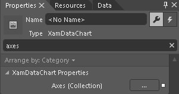
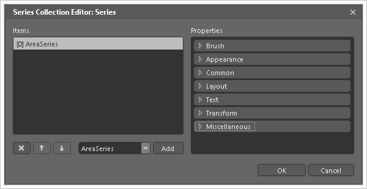

////

|metadata|
{
    "name": "datachart-creating-chart-in-ms-blend-xaml",
    "controlName": [],
    "tags": [],
    "guid": "1f70421a-83b4-409f-a7ce-4fac3b0323d6",  
    "buildFlags": ["wpf","win-universal"],
    "createdOn": "2014-09-22T08:55:32.3063396Z"
}
|metadata|
////

= MS Blend でチャートを作成

== トピックの概要

=== 目的

このトピックは、Microsoft® Blend で  _link:{DataChartLink}.{DataChartName}.html[{DataChartName}]™_   コントロールを作成する方法についての手順を提供します。

=== 前提条件

本トピックの理解を深めるために、以下のトピックを参照することをお勧めします。

[options="header", cols="a,a"]
|====
|トピック|目的

| link:datachart-datachart.html[*{DataChartName}* ]
|このトピックでは、 _{DataChartName}_ コントロールの概要を説明します。

| link:datachart-getting-started-with-datachart.html[データ チャートを使用した作業の開始]
|このトピックでは、{DataChartName} コントロールを使用して作業を開始する方法に関する情報を提供します。

| link:datachart-series-requirements.html[シリーズ要件]
|このトピックでは、{DataChartName} コントロールで利用可能な散布シリーズに関する情報を提供します。

|====

=== このトピックの内容

このトピックは、以下のセクションで構成されます。

* <<_Ref397371182, _概要_  >>

** <<_Ref397371188,プレビュー>>
** <<_Ref396219292,アプリケーションの要件>>
** <<_Ref397371278,チャート要件>>
** <<_Ref396236025,アプリケーションの作成>>
** <<_Ref396236029,データ ソースの作成>>
** <<_Ref396236037,チャートの作成>>
** <<_Ref396236032,軸の作成>>
** <<_Ref396236034,シリーズの作成>>

* <<_Ref388439099,関連コンテンツ>>

[[_Ref397371182]]
== _概要_

[[_Ref397371188]]

=== プレビュー

以下はこのトピックの最終結果のプレビューです。

image::images/DataChart_Creating_Chart_In_MS_Blend_1.png[]

[[_Ref396219292]]

=== アプリケーションの要件

以下の表では、 _{DataChartName}_   の作成の要件を簡単に説明します。

[options="header", cols="a,a"]
|====
|要件|説明

|Infragistics 製品をインストール
|チャート コントロールは Infragistics 製品に含まれます。

|データ ソース
|チャート コントロールにはデータ ソースが必要です。このトピックは link:resources-sample-energy-data.html[サンプル エネルギー データ]をデータ ソースとして提供します。エネルギー製造データのサンプル、またカスタムデータ ソースを追加することは可能です。チャート シリーズの要件に関して link:datachart-series-requirements.html[シリーズ要件]トピックを参照してください。

|====

[[_Ref397371278]]

=== チャート要件

チャート コントロールは シリーズと呼ばれ、さまざまなデータ視覚化をサポートします。このシリーズ オブジェクトは広範なデータ ソースを可視化できます。チャート コントロールにサポートされるシリーズの一覧は、 link:datachart-series-types.html[シリーズ タイプ] トピックを参照してください。各シリーズ タイプは一定の要件を満たす (データ列の数およびタイプなど) データおよびデータをサポートされる軸によって、そのデータがプロットできます。各シリーズの要件については、 link:datachart-series-requirements.html[シリーズ要件]トピックを参照してください。

このトピックは link:{DataChartLink}.areaseries.html[AreaSeries] 1 つと 2 つの軸 (CategoryXAxis および NumericYAxis)、そして link:resources-sample-energy-data.html[サンプル エネルギー データ]を使用します。

[[_Ref396236025]]

=== アプリケーションの作成

Microsoft® Blend で {PlatformName} アプリケーション プロジェクトを作成します。

.注:
[NOTE]
====
Infragistics DataChart コントロールをデザイナー サーフェイスにドラッグ アンド ドロップするとき、Infragistics コンポーネントへの参照は自動的に追加されます。
====

[[_Ref396236029]]

=== データ ソースの作成

サンプル データ コードを link:resources-sample-energy-data.html[サンプル エネルギー データ] リソースからコピーしてプロジェクトに追加します。

[[_Ref396236037]]

=== チャートの作成

[start=1]
. 「アセット」ツールボックス パネルで、XamDataChart コントロールを検索します。

[start=2]
. XamDataChart コントロールをデザイン サーフェイスにドラッグ アンド ドロップします。

[start=3]
. XamDataChart コントロールを選択し、そのプロパティ パネルを開きます。

image::images/DataChart_Creating_Chart_In_MS_Blend_2.png[]

以下の Infragistics ライブラリはプロジェクトに追加されます。

* {VersionedApiPlatform}.Controls.Charts.XamDataChart.v{ProductVersion}.dll
* {VersionedApiPlatform}.DataVisualization.v{ProductVersion}.dll
* {VersionedApiPlatform}.v{ProductVersion}.dll

[start=4]
. プロパティ パネルで、DataContext プロパティを検索します。

[start=5]
. [新規] ボタンをクリックします。

[start=6]
. CategorySampleData オブジェクトを選択して [OK] ボタンをクリックします。

image::images/DataChart_Creating_Chart_In_MS_Blend_3.png[]

[[_Ref396236032]]

=== 軸の作成

[start=1]
. プロパティ パネルで、データ チャート コントロールの Axes (コレクション) プロパティを検索します。

[start=2]
. Axes (コレクション) プロパティの省略記号 (…) ボタンをクリックします。

[start=3]
. ドロップダウン コントロールから CategoryXAxis を選択し、[追加] ボタンをクリックします。

[start=4]
. ドロップダウン コントロールから NumericYAxis を選択し、[追加] ボタンをクリックします。

image::images/DataChart_Creating_Chart_In_MS_Blend_5.png[]

[start=5]
. [OK] ボタンをクリックして軸コレクション エディターを閉じます。

[start=6]
. デザイン サーフェイスで、選択を CategoryXAxis オブジェクトに変更します。

* データ チャートの中央に右クリックします。
* [現在の選択の設定] メニュー項目を指定します
* CategoryXAxis メニュー項目を選択します。

[start=7]
. プロパティ パネルで、CategoryXAxis オブジェクトの以下のプロパティを設定します。

[options="header", cols="a,a,a,a"]
|====
|プロパティ名|プロパティ タイプ|プロパティ値|メモ

|Name
|文字列
|xAxis
|軸要素の識別名を設定します。

| link:{DataChartLink}.categoryaxisbase~{ApiDataSource}.html[{ApiDataSource}]
|文字列
|{Binding}
|カスタム式を使用して設定する...

|Label
|文字列
|{}{Country}
|カスタム式を使用して設定する...

|Title
|文字列
|X-Axis
|軸の表示名を設定します。

|====

[start=8]
. デザイン サーフェイスで、選択を NumericYAxis オブジェクトに変更します。

* データ チャートの中央に右クリックします。
* [現在の選択の設定] メニュー項目を指定します
* NumericYAxis メニュー項目を選択します。

[start=9]
. プロパティ パネルで、NumericYAxis オブジェクトの以下のプロパティを設定します。

[options="header", cols="a,a,a,a"]
|====
|プロパティ名|プロパティ タイプ|プロパティ値|メモ

|Name
|文字列
|yAxis
|軸要素の識別名を設定します。

|Title
|文字列
|Y-Axis
|軸の表示名を設定します。

|====

.注:
[NOTE]
====
NumericYAxis は、Series オブジェクトにバインドされるデータの範囲に基づいて MinimumValue および MaximumValue を自動的に計算します。このプロパティを設定する必要がありません。
====

[[_Ref396236034]]

=== シリーズの作成

[start=1]
. プロパティ パネルで、データ チャート コントロールの Series (コレクション) プロパティを検索します。

[start=2]
. Series (コレクション) プロパティの省略記号 (…) ボタンをクリックします。

image::images/DataChart_Creating_Chart_In_MS_Blend_6.png[]

[start=3]
. ドロップダウン コントロールから AreaSeries を選択し、[追加] ボタンをクリックします。

[start=4]
. [OK] ボタンをクリックしてシリーズ コレクション エディターを閉じます。

[start=5]
. デザイン サーフェイスで、選択を AreaSeries オブジェクトに変更します。

* データ チャートの中央に右クリックします。
* [現在の選択の設定] メニュー項目を指定します
* AreaSeries メニュー項目を選択します。

[start=6]
. プロパティ パネルで、AreaSeries オブジェクトの以下のプロパティを設定します。

[options="header", cols="a,a,a,a"]
|====
|プロパティ名|プロパティ タイプ|プロパティ値|メモ

|Name
|文字列
|AreaSeries
|

| link:{DataChartLink}.series~{ApiDataSource}.html[{ApiDataSource}]
|文字列
|{Binding}
|カスタム式を使用して設定する...

| link:{DataChartLink}.AnchoredCategorySeries{ApiProp}valuememberpath.html[ValueMemberPath]
|文字列
|Coal
|カスタム式を使用して設定する...

| link:{DataChartLink}.HorizontalAnchoredCategorySeries{ApiProp}xaxis.html[XAxis]
|文字列
|{Binding ElementName=xAxis}
|カスタム式を使用して設定する...

| link:{DataChartLink}.HorizontalAnchoredCategorySeries{ApiProp}yaxis.html[YAxis]
|文字列
|{Binding ElementName=yAxis}
|カスタム式を使用して設定する...

|====

.注:
[NOTE]
====
軸プロパティのバインディングの要素名は、以前のセクションで軸オブジェクトに設定された名前と一致する必要があります。
====

[[_Ref388439099]]
== 関連コンテンツ

[[_Ref386478106]]

=== トピック

このトピックの追加情報については、以下のトピックも合わせてご参照ください。

[options="header", cols="a,a"]
|====
|トピック|目的

| link:datachart-datachart.html[{DataChartName}] 

|このトピックでは、 _{DataChartName}_ コントロールの概要を説明します。

| link:datachart-getting-started-with-datachart.html[データ チャートを使用した作業の開始]
|このトピックでは、{DataChartName} コントロールを使用して作業を開始する方法に関する情報を提供します。

| link:datachart-series-requirements.html[シリーズ要件]
|このトピックでは、{DataChartName} コントロールで利用可能な散布シリーズに関する情報を提供します。

|====