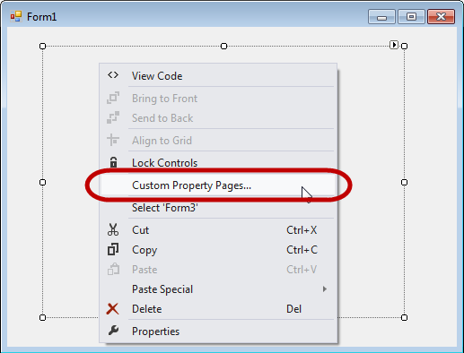
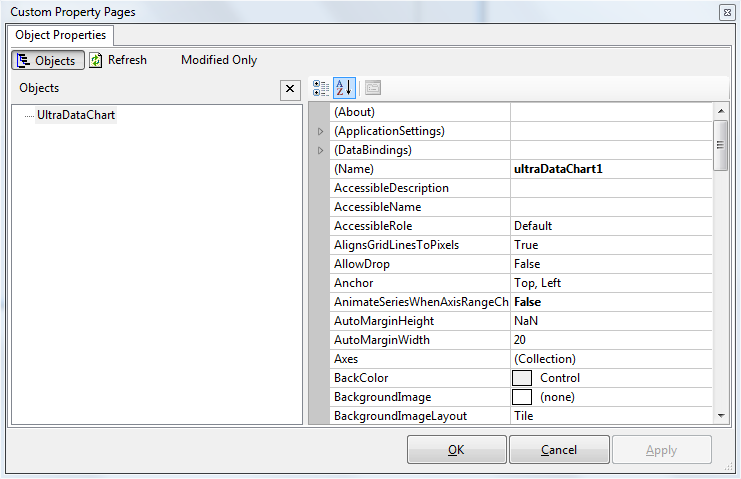
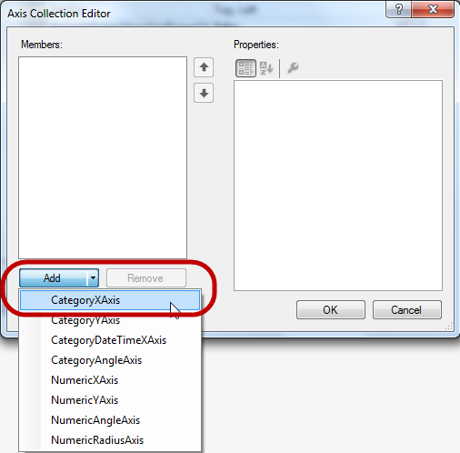

////

|metadata|
{
    "name": "datachart-creating-chart-in-vs-designer-winforms",
    "controlName": [],
    "tags": [],
    "guid": "07e9aeae-d8bc-43ae-ae1c-e29d9c61e2bd",  
    "buildFlags": ["WINFORMS"],
    "createdOn": "2014-09-22T09:18:01.3753495Z"
}
|metadata|
////

= VS デザイナーでチャートを作成

== トピックの概要

=== 目的

このトピックは、{PlatformIDE} デザイナー インターフェイスを使用した WinForms  _link:{DataChartLink}.{DataChartName}.html[{DataChartName}]™_   コントロールの作成について説明します。

=== 前提条件

本トピックの理解を深めるために、以下のトピックを参照することをお勧めします。

[options="header", cols="a,a"]
|====
|トピック|目的

| link:datachart-datachart.html[{DataChartName}]
|このトピックでは、 _{DataChartName}_ コントロールの概要を説明します。

| link:datachart-getting-started-with-datachart.html[データ チャートを使用した作業の開始]
|このトピックでは、{DataChartName} コントロールを使用して作業を開始する方法に関する情報を提供します。

| link:datachart-series-requirements.html[シリーズ要件]
|このトピックでは、{DataChartName} コントロールで利用可能な散布シリーズに関する情報を提供します。

|====

=== このトピックの内容

このトピックは、以下のセクションで構成されます。

* <<_Ref397498693,概要>>

* <<_Ref397435043,プレビュー>>
* <<_Ref397435047,アプリケーションの要件>>
* <<_Ref396236025,アプリケーションの作成>>
* <<_Ref397435052,チャート コントロールの追加>>
* <<_Ref397435056,スマート タグを使用>>
* <<_Ref397435059,カスタム プロパティ ページ>>
* <<_Ref397435062,軸の追加>>
* <<_Ref397435068,シリーズの追加>>
* <<_Ref396236029,データ ソースの作成>>
* <<_Ref397435090,データ ソースへのバインド>>

* <<_Ref381022312,関連コンテンツ>>

[[_Ref397498693]]
== 概要

[[_Ref397435043]]

=== プレビュー

以下はこのトピックの最終結果のプレビューです。

image::images/Create_DataChart_Using_the_Designer_1.png[]

[[_Ref397435047]]

=== アプリケーションの要件

以下の表では、 _{DataChartName}_   の作成の要件を簡単に説明します。

[options="header", cols="a,a"]
|====
|要件|説明

|Infragistics 製品をインストール
|チャート コントロールは Ultimate UI for Windows Forms _2014 Volume 2_ またはそれ以降のバージョンに含まれます。

|データ ソースの追加
|チャート コントロールにはデータ ソースが必要です。このトピックは link:resources-sample-energy-data.html[サンプル エネルギー データ]をデータ ソースとして提供します。エネルギー製造データのサンプル、またカスタムデータ ソースを使用することは可能です。チャート シリーズの要件に関して link:datachart-series-requirements.html[シリーズ要件]トピックを参照してください。

|====

[[_Ref396236025]]

=== アプリケーションの作成

{PlatformIDE} およびそれ以降のバージョンで WinForms アプリケーション プロジェクトを作成します。

プロジェクトにアセンブリを追加する必要がありません。それはフォームにチャート コントロールをドロップしたら、{PlatformIDE} は自動的に次のアセンブリを追加するからです:

* {ApiPlatform}Win.DataVisualization.Shared{ApiVersion}.dll
* {ApiPlatform}Win.DataVisualization.UltraDataChart{ApiVersion}.dll
* {ApiPlatform}Win.Portable.Core{ApiVersion}.dll

[[_Ref397435052]]

=== チャート コントロールの追加

{PlatformIDE} ツールボックス領域からフォーム上に {DataChartName} コントロールをドラッグ アンド ドロップします:

image::images/Create_DataChart_Using_the_Designer_2.png[]

[[_Ref397435056]]

=== スマート タグを使用

コントロールに右上にあるスマート タグが含まれます。

タスク リストを表示するにはスマート タグの矢印をクリックしてください。デザイン時にカスタマイズのため  _Name_   および  _Dock_   プロパティが含まれます。

image::images/Create_DataChart_Using_the_Designer_3.png[]

[[_Ref397435059]]

=== カスタム プロパティ ページ

{DataChartName} コントロールのプロパティは {PlatformIDE} のプロパティ グリッドまたはカスタム プロパティ ページで表示されます。チャート コントロールに右クリックして、「カスタム プロパティ ページ」のダイアログ ウィンドウを選択します。

このダイアログ ウィンドウでコントロールをカスタマイズして、更新して変更を表すことおよび変更されたプロパティのみ表示されることが可能です。

[[_Ref397435062]]

=== 軸の追加

ダイアログ エディターを開くには軸プロパティの隣の楕円 (`…`) をクリックしてください。軸コレクション エディターでチャートコントロールに軸オブジェクトを追加できます。

image::images/Create_DataChart_Using_the_Designer_6.png[]

軸コレクション エディターの「追加」ボタンでリストから軸のタイプを選択できます。水平軸のために link:{DataChartLink}.categoryxaxis.html[CategoryXAxis] を選択し、垂直軸のために link:{DataChartLink}.numericyaxis.html[NumericYAxis] を選択します。チャート コントロールの Axes コレクションに追加するには [OK] ボタンをクリックします。

[[_Ref397435068]]

=== シリーズの追加

ダイアログ エディターを開くには軸プロパティの隣にある楕円ボタン (`…`) をクリックしてください。シリーズコレクション エディターでチャート コントロールにシリーズ オブジェクトを追加できます。

シリーズコレクション エディターの「追加」ボタンでリストからシリーズ タイプを選択できます。データを可視化するには link:{DataChartLink}.areaseries.html[AreaSeries] を選択して、シリーズをシリーズコレクションに追加するには [OK] ボタンを押します。

image::images/Create_DataChart_Using_the_Designer_8.png[]

前に作成された軸の名前に link:{DataChartLink}.areaseries.html[AreaSeries] の XAxis および YAxis を設定します。

image::images/Create_DataChart_Using_the_Designer_9.png[]

[[_Ref396236029]]

=== データ ソースの作成

プロジェクトに link:resources-sample-energy-data.html[サンプル エネルギー データ] リソースのサンプル データ コードをコピーしてカテゴリ サンプル データのインスタンスを作成します:

ifdef::win-forms[]

*C# の場合:*

[source,csharp]
----
var data = new CategorySampleData();
----

endif::win-forms[]

ifdef::win-forms[]

*Visual Basic の場合:*

[source,vb]
----
Dim data As New CategorySampleData()
----

endif::win-forms[]

[[_Ref397435090]]

=== データ ソースへのバインド

データ バインディングには  _Series_   オブジェクトで公開された DataSource プロパティおよびカテゴリの種類の  _Axis_   タイプを設定する必要があります。数値軸オブジェクトは  _DataSource_   プロパティがありません。この軸のラベルはシリーズにバインドされたデータ範囲によって自動的に生成されます。

次のコード例は link:{DataChartLink}.categoryxaxis.html[CategoryXAxis]オブジェクトへのバインディングおよび Label データ列にラベルをマップする方法を紹介します。

ifdef::win-forms[]

*C# の場合:*

[source,csharp]
----
var xAxis = this.ultraDataChart1.Axes.OfType<CategoryXAxis>().FirstOrDefault();
xAxis.Label = "Country";  
xAxis.DataSource = data;
----

endif::win-forms[]

ifdef::win-forms[]

*Visual Basic の場合:*

[source,vb]
----
Dim xAxis = Me.ultraDataChart1.Axes.OfType(Of CategoryXAxis)().FirstOrDefault()
xAxis.Label = "Country"
xAxis.DataSource = data
----

endif::win-forms[]

次の例は link:{DataChartLink}.areaseries.html[AreaSeries]オブジェクトへのバインディングおよび Value データ列にシリーズの値をマップする方法を紹介します。

ifdef::win-forms[]

*C# の場合:*

[source,csharp]
----
var series = this.ultraDataChart1.Series.OfType<AreaSeries>().FirstOrDefault();
series.ValueMemberPath = "Coal";
series.DataSource = data;
----

endif::win-forms[]

ifdef::win-forms[]

*Visual Basic の場合:*

[source,vb]
----
 Dim series = Me.ultraDataChart1.Series.OfType(Of AreaSeries)().FirstOrDefault()
series.ValueMemberPath = "Coal"
series.DataSource = data
----

endif::win-forms[]

[[_Ref381022312]]
== 関連コンテンツ

=== トピック

このトピックの追加情報については、以下のトピックも合わせてご参照ください。

[options="header", cols="a,a"]
|====
|トピック|目的

| link:datachart-creating-chart-in-code-behind-winforms.html[コード ビハインドでチャートを作成]
|このトピックは、コード例を示して、WinForms の _UltraDataChart_ コントロールを作成する方法を説明します。

|====