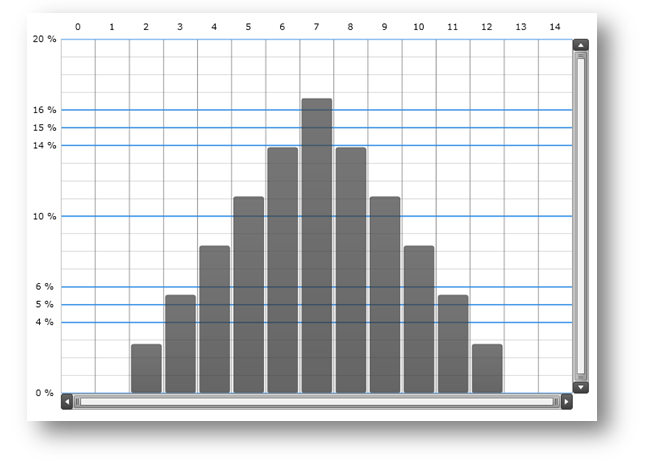

////
|metadata|
{
	"name":"datachart-creating-custom-axis-tickmark-values",
	"controlName":["xamDataChart"],
	"tags":["Charting","Data Presentation","Getting Started","How Do I"],
	"guid":"53c071d7-caf6-4c9c-8d59-4aedc8857f99",
	"buildFlags":["wpf"],
	"createdOn":"2014-06-05T19:39:00.5823511Z"}
|metadata|
////

= カスタム軸目盛値の作成

このトピックは、 link:{DataChartLink}.{DataChartName}.html[{DataChartName}]™ コントロールのカスタム軸目盛値機能を紹介し、コード例を示して、数値軸用カスタム目盛値の作成方法を説明します。

== 概要

トピックは以下のとおりです。

* <<Introduction,概要>>
* <<SupportedAxes,サポートされる軸>> 
* <<TickmarkValuesProperty,TickmarkValues プロパティ>> 
* <<TickmarkValuesClass,TickmarkValues クラス>> 
* <<Example,例>> 
 ** <<Preview,プレビュー>> 
 ** <<Implementation,実装>>
* <<RelatedContent,関連コンテンツ>>
 ** link:datachart-axes.html[チャート軸]
 ** link:datachart-creating-custom-axis-scalers.html[カスタム軸スケーラの作成]
 ** link:datachart-using-axis-scales.html[軸目盛の構成]

[[Introduction]]
== 概要

{DataChartName} コントロールは、カスタム軸目盛値をアプリケーション内で実装できるよう設計されています。これは、数値軸 (たとえば link:{DataChartLink}.numericyaxis.html[NumericYAxis]) の  link:{DataChartLink}.numericaxisbase{ApiProp}tickmarkvalues.html[TickmarkValues] プロパティを抽象クラス link:{DataChartLink}.tickmarkvalues.html[TickmarkValues] から継承するオブジェクトに設定して行うことができます。

[[SupportedAxes]]
== サポートされる軸

{DataChartName} コントロールの軸の詳細については、「link:datachart-axes.html[チャート軸]」トピックを参照してください。

表 1 - カスタム軸目盛値をサポートする軸タイプのリスト。

[options="header", cols="a,a"]
|====
|軸タイプ|説明

| link:{DataChartLink}.numericxaxis.html[NumericXAxis]
|数値がlink:datachart-scatter-series-overview.html[散布図シリーズ]を使用して {DataChartName} にプロットされる水平方向の X 軸を表します。

| link:{DataChartLink}.numericyaxis.html[NumericYAxis]
|数値が link:datachart-scatter-series-overview.html[散布図シリーズ]、link:datachart-series-financial-price-series-overview.html[財務シリーズ]、およびlink:datachart-category-series-overview.html[カテゴリ シリーズ]を使用して {DataChartName} にプロットされる垂直方向の Y 軸を表します。

| link:{DataChartLink}.numericradiusaxis.html[NumericRadiusAxis]
|数値がlink:datachart-polar-series-overview.html[極座標シリーズ]およびlink:datachart-radial-series-overview.html[ラジアル シリーズ]を使用して {DataChartName} にプロットされるラジアル軸を表します。

| link:{DataChartLink}.numericangleaxis.html[NumericAngleAxis]
|link:datachart-polar-series-overview.html[極座標シリーズ]を使用して {DataChartName} に数値がプロットされる水平方向の角度軸を表します。

|====

[[TickmarkValuesProperty]]
== TickmarkValues プロパティ

表 2 - 目盛値に関係する軸プロパティの API 概要

[options="header", cols="a,a,a"]
|====
|軸プロパティ|プロパティ タイプ|説明

| link:{DataChartLink}.numericaxisbase{ApiProp}tickmarkvalues.html[TickmarkValues]
| link:{DataChartLink}.tickmarkvalues.html[TickmarkValues]
|軸上の目盛位置を定義する値を取得または設定します。

|====

[[TickmarkValuesClass]]
== TickmarkValues クラス

TickmarkValues は、カスタム目盛値を定義するオーバーライド可能なメソッドを提供する抽象クラスです。

図 3 - TickmarkValues クラスのオーバーライド可能なメソッドの API 概要

[options="header", cols="a,a,a"]
|====
|メソッド|戻り値の型|説明

| link:{DataChartLink}.tickmarkvalues{ApiProp}majorvalues.html[MajorValues]
| IEnumerable<double>
|数値軸の主目盛値を返します

| link:{DataChartLink}.tickmarkvalues{ApiProp}minorvalues.html[MinorValues]
| IEnumerable<double>
|数値軸の副目盛値を返します

| Initialize
| void
|軸ラベル、ストリップライン、およびグリッドラインを描画する前に目盛値を初期化します。

|====

[[Example]]
== 例

カスタム目盛値を定義するオブジェクトの例に CustomTickmarkValues があります。このオブジェクトは、主目盛の位置 ( 0, 4, 5, 6, 10, 14, 15, 16, 20) を定義し、副目盛を 1 の間隔で配置します。

[[Preview]]
== プレビュー

図 1 - Y 軸に適用される CustomTickmarkValues のある XamDataChart コントロールのプレビュー

[[Implementation]]
== 実装

以下のコードは、主目盛および副目盛のカスタム位置を定義するカスタム CustomTickmarkValues を作成する方法を示します。

**Visual Basic の場合:**

[source,vb]
----
Imports {DataChartNamespace}

Namespace Infragistics.Samples.Common
    Public Class CustomTickmarkValues
        Inherits TickmarkValues
        Public Sub New()
            ' カスタム目盛値を定義します
            Me.Tickmarks = New DoubleCollection() From { 0.0, 4.0, 5.0, 6.0, 10.0, 14.0, 15.0, 16.0, 20.0 }
        End Sub

        Protected First As Double
        Protected Last As Double
        Protected Tickmarks As DoubleCollection

        ''' 

        ''' 軸ラベル、ストリップライン、およびグリッドラインを描画する前に目盛値を初期化します
        ''' 

        ''' <param name="initializationParameters"></param>
        Public Overrides Sub Initialize(initializationParameters As TickmarkValuesInitializationParameters)
            MyBase.Initialize(initializationParameters)
            ' 初期化は、最大値および最小値を保存するためにオーバーライドされます
            ' これらの値は後で MajorValues() および MinorValues() メソッドで使用されます。
            Me.First = initializationParameters.VisibleMinimum
            Me.Last = initializationParameters.VisibleMaximum
        End Sub

        ''' 

        ''' 主目盛値を返します
        ''' 

        ''' <returns></returns>
        Public Overrides Function MajorValues() As IEnumerable(Of Double)
            Dim values As IEnumerable(Of Double) = Tickmarks.Where(Function(value) value >= Me.First AndAlso value <= Me.Last)
            Return values
        End Function

        ''' 

        ''' 副目盛値を返します
        ''' 

        ''' <returns></returns>
        Public Overrides Function MinorValues() As IEnumerable(Of Double)
            Dim start As Double = Me.First
            Dim minorValue As Double = start
            While minorValue < Me.Last
                yield Return minorValue
                minorValue += 1.0
            End While
        End Function
    End Class
End Namespace
----

**C# の場合:**

[source,csharp]
----
using {DataChartNamespace}

namespace Infragistics.Samples.Common
{
    public class CustomTickmarkValues : TickmarkValues
    {
        public CustomTickmarkValues()
        {
            // カスタム目盛値を定義します
            this.Tickmarks = new DoubleCollection { 0.0, 4.0, 5.0, 6.0, 10.0, 14.0, 15.0, 16.0, 20.0 };
        }

        protected double First;
        protected double Last;
        protected DoubleCollection Tickmarks;
        
        /// 

        /// 軸ラベル、ストリップライン、およびグリッドラインを描画する前に目盛値を初期化します
        /// 

        /// <param name="initializationParameters"></param>
        public override void Initialize(TickmarkValuesInitializationParameters initializationParameters)
        {
            base.Initialize(initializationParameters);
            // 初期化は、最大値および最小値を保存するためにオーバーライドされます
            // これらの値は後で MajorValues() および MinorValues() メソッドで使用されます。
            this.First = initializationParameters.VisibleMinimum;
            this.Last = initializationParameters.VisibleMaximum;
        }
        
        /// 

        /// 主目盛値を返します
        /// 

        /// <returns></returns>
        public override IEnumerable<double> MajorValues()
        {
            IEnumerable<double> values = Tickmarks.Where((value) => value >= this.First && value <= this.Last);
            return values;
        }

        /// 

        /// 副目盛値を返します
        /// 

        /// <returns></returns>
        public override IEnumerable<double> MinorValues()
        {
            double start = this.First;  
            for (double minorValue = start; minorValue < this.Last; minorValue += 1.0)
            {
                yield return minorValue;
            }
        }
    }
}
----

以下のコード スニペットでは、{DataChartName} コントロールで Y 軸に CustomTickmarkValues を設定する方法を示します。

**XAML の場合:**

[source,xaml]
----
<ig:{DataChartName}.Axes>
    <ig:NumericYAxis Name="yAxis" Label="{}{} %" >
        <!-- ========================================================================== -->
        <ig:NumericYAxis.TickmarkValues>
            <common:CustomTickmarkValues />
        </ig:NumericYAxis.TickmarkValues>
        <!-- ========================================================================== -->
    </ig:NumericYAxis>
</ig:{DataChartName}.Axes>
----

[[RelatedContent]]
== 関連コンテンツ

* link:datachart-axes.html[チャート軸]
* link:datachart-creating-custom-axis-scalers.html[カスタム軸スケーラの作成]
* link:datachart-using-axis-scales.html[軸目盛の構成]