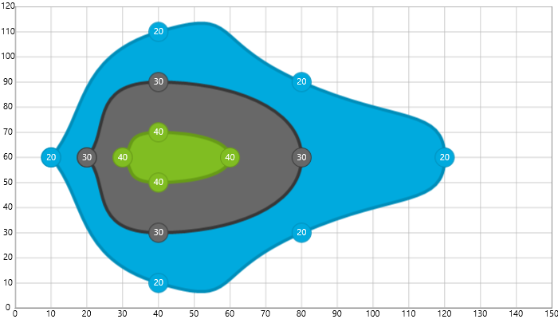
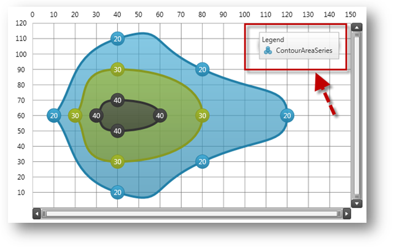
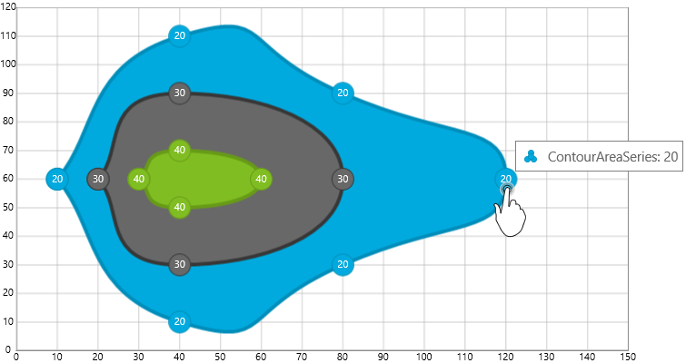

////

|metadata|
{
    "name": "datachart-creating-custom-series",
    "controlName": ["{DataChartName}"],
    "tags": ["Charting","Data Presentation","Getting Started","How Do I"],
    "guid": "01e94d58-aefe-4cdb-a050-cb94bedc467b",  
    "buildFlags": ["SL","WPF","win-rt"],
    "createdOn": "2014-06-05T19:39:00.6433745Z"
}
|metadata|
////

= カスタム シリーズの作成

このトピックは、 link:{DataChartLink}.{DataChartName}.html[{DataChartName}]™ コントロールのシリーズ継承機能を紹介し、コード例を示してカスタム シリーズ タイプの作成方法を説明します。

== 概要

トピックは以下のとおりです。

* <<Introduction,概要>>
* <<Example,例>>

** <<Preview,プレビュー>>
** <<Procedure,手順>>

*** シリーズの継承
*** デフォルト スタイルの作成
*** 軸の継承
*** シリーズ メソッドのオーバーライド
*** カスタム コードの提供
*** シリーズの描画

ifdef::sl,wpf,win-phone[]
*** 凡例の統合

endif::sl,wpf,win-phone[]

*** ツールチップの統合

* <<RelatedContent,関連コンテンツ>>

** link:datachart-axes.html[チャート軸]
** link:datachart-series.html[チャート シリーズ]

== 概要

{DataChartName} コントロールは、カスタム シリーズ タイプをアプリケーション内で実装できるよう設計されています。これは、 link:{DataChartLink}.series.html[Series] クラスを継承し、必要なプロパティを実装し、基本クラスのメソッドをオーバーライドすることにより行います。Series はすべての {DataChartName} シリーズの基本クラスです。プロパティを提供し、チャート コントロールと動作します。さらに、カスタム シリーズはシリーズの既存タイプ (link:{DataChartLink}.scatterseries.html[ScatterSeries] など) から継承しカスタム機能を実装することにより作成できますが、これはこのトピックの範囲を超えています。

== 例

カスタム シリーズ タイプの例は輪郭エリア シリーズで、Cartesian 座標システムでプロットされた値と同じ値でデータ ポイントに沿って塗りつぶされた輪郭のコレクションとして描画されます。ContourAreaSeries のすべての要素が実装されると、シリーズは以下のコード リストに示されるように定義されます。

[NOTE]
====
注: 以下のコード例では、 link:resources-contourdatasample.html[サンプル等高線データ]および link:resources-beziercurvebuilder.html[ベジエ曲線ビルダー]リソースをソース コード ファイルとしてプロジェクトに追加済みであることを前提としています。これらのリソースは、ContourAreaSeries の輪郭を生成するためのサンプル データ モデルおよびクラスを提供します。
====

ifdef::wpf[]

*XAML の場合:*
[source,xaml]
----
xmlns:ig="http://schemas.infragistics.com/xaml"
xmlns:local="clr-namespace:Infragistics.Samples.Common"
----

endif::wpf[]

ifdef::wpf,win-universal[]

*XAML の場合:*
[source,xaml]
----
<ig:{DataChartName}.Series>
    <custom:ContourAreaSeries x:Name="customSeries" 
                              ItemsSource="{StaticResource data}"
                              XAxis="{Binding ElementName=xAxis}" 
                              YAxis="{Binding ElementName=yAxis}">
    </custom:ContourAreaSeries>
</ig:{DataChartName}.Series>
----

endif::wpf,win-universal[]

ifdef::wpf[]

*Visual Basic の場合:*
[source,vb]
----
Imports Infragistics.Samples.Data    ' ContourData を提供します
Imports Infragistics.Samples.Common  ' ContourAreaSeries を提供します
...
Dim series As New ContourAreaSeries()
series.ItemsSource = New ContourDataSample()
series.XAxis = xAxis
series.YAxis = yAxis
...
Me.DataChart.Series.Add(series)
----

endif::wpf[]

ifdef::win-forms[]

*Visual Basic の場合:*
[source,vb]
----
Imports Infragistics.Samples.Data    ' ContourData を提供します
Imports Infragistics.Samples.Common  ' ContourAreaSeries を提供します
...
Dim series As New ContourAreaSeries()
series.ItemsSource = New ContourDataSample()
series.XAxis = xAxis
series.YAxis = yAxis
...
Me.DataChart.Series.Add(series)
----

endif::win-forms[]

ifdef::wpf[]

*C# の場合:*
[source,csharp]
----
using Infragistics.Samples.Data      // ContourData を提供します
using Infragistics.Samples.Common;   // ContourAreaSeries を提供します
...
ContourAreaSeries series = new ContourAreaSeries();
series.ItemsSource = new ContourDataSample();
series.XAxis = xAxis;
series.YAxis = yAxis;
...
this.DataChart.Series.Add(series);
----

endif::wpf[]

ifdef::win-forms[]

*C# の場合:*
[source,csharp]
----
using Infragistics.Samples.Data      // ContourData を提供します
using Infragistics.Samples.Common;   // ContourAreaSeries を提供します
...
ContourAreaSeries series = new ContourAreaSeries();
series.ItemsSource = new ContourDataSample();
series.XAxis = xAxis;
series.YAxis = yAxis;
...
this.DataChart.Series.Add(series);
----

endif::win-forms[]

ifdef::xamarin[]

*C# の場合:*
[source,csharp]
----
using Infragistics.Samples.Data      // ContourData を提供します
using Infragistics.Samples.Common;   // ContourAreaSeries を提供します
...
ContourAreaSeries series = new ContourAreaSeries();
series.ItemsSource = new ContourDataSample();
series.XAxis = xAxis;
series.YAxis = yAxis;
...
this.DataChart.Series.Add(series);
----

endif::xamarin[]

== プレビュー

ifdef::sl,wpf,win-phone[]
image::images/xamDataChart_Creating_Custom_Series_01.png[]
endif::sl,wpf,win-phone[]

ifdef::win-rt[]

endif::win-rt[]

図 1 - 同じ値でデータ ポイントに沿って塗りつぶされた輪郭のコレクションとして描画された ContourAreaSeries のプレビュー

== 手順

このセクションは、ContourAreaSeries を作成するためのステップごとの手順を提供し、完全なコード例がこのトピックの末尾に記載されます。

[start=1]
. シリーズの継承 - このコードは、ContourAreaSeries 用にクラスを作成し Series 基本クラスから継承する方法を示します。

ifdef::wpf[]

*Visual Basic の場合:*
[source,vb]
----
Imports {DataChartNamespace} ' {DataChartName} 要素を提供します
...
Namespace Infragistics.Samples.Common
    ''' 

    ''' {DataChartName} コントロール用 ContourAreaSeries のカスタム タイプを示します。
    ''' 

    Public Class ContourAreaSeries
        Inherits Series
        Public Sub New()
            ' 一般的なリソース ディクショナリからシリーズのデフォルト スタイルを作成します。
            ' generic.xaml に追加するか、アプリケーションのリソースと結合してください。
            Me.DefaultStyleKey = GetType(ContourAreaSeries)
        End Sub
    End Class
End Namespace
----

endif::wpf[]

ifdef::win-forms[]

*Visual Basic の場合:*
[source,vb]
----
Imports {DataChartNamespace} ' {DataChartName} 要素を提供します
...
Namespace Infragistics.Samples.Common
    ''' 

    ''' {DataChartName} コントロール用 ContourAreaSeries のカスタム タイプを示します。
    ''' 

    Public Class ContourAreaSeries
        Inherits Series
        Public Sub New()
            ' 一般的なリソース ディクショナリからシリーズのデフォルト スタイルを作成します。
            ' generic.xaml に追加するか、アプリケーションのリソースと結合してください。
            Me.DefaultStyleKey = GetType(ContourAreaSeries)
        End Sub
    End Class
End Namespace
----

endif::win-forms[]

ifdef::wpf[]

*C# の場合:*
[source,csharp]
----
using {DataChartNamespace}; // {DataChartName} 要素を提供します
...
namespace Infragistics.Samples.Common
{
  /// 

  /// {DataChartName} コントロール用 ContourAreaSeries のカスタム タイプを示します。
  /// 

  public class ContourAreaSeries : Series
  {
    public ContourAreaSeries()
    {
        // 一般的なリソース ディクショナリからシリーズのデフォルト スタイルを作成します
        // generic.xaml に追加するか、アプリケーションのリソースと結合してください
        this.DefaultStyleKey = typeof(ContourAreaSeries);
    }
  }
}
----

endif::wpf[]

ifdef::win-forms[]

*C# の場合:*
[source,csharp]
----
using {DataChartNamespace}; // {DataChartName} 要素を提供します
...
namespace Infragistics.Samples.Common
{
  /// 

  /// {DataChartName} コントロール用 ContourAreaSeries のカスタム タイプを示します。
  /// 

  public class ContourAreaSeries : Series
  {
    public ContourAreaSeries()
    {
        // 一般的なリソース ディクショナリからシリーズのデフォルト スタイルを作成します
        // generic.xaml に追加するか、アプリケーションのリソースと結合してください
        this.DefaultStyleKey = typeof(ContourAreaSeries);
    }
  }
}
----

endif::win-forms[]

ifdef::xamarin[]

*C# の場合:*
[source,csharp]
----
using {DataChartNamespace}; // {DataChartName} 要素を提供します
...
namespace Infragistics.Samples.Common
{
  /// 

  /// {DataChartName} コントロール用 ContourAreaSeries のカスタム タイプを示します。
  /// 

  public class ContourAreaSeries : Series
  {
    public ContourAreaSeries()
    {
        // 一般的なリソース ディクショナリからシリーズのデフォルト スタイルを作成します
        // generic.xaml に追加するか、アプリケーションのリソースと結合してください
        this.DefaultStyleKey = typeof(ContourAreaSeries);
    }
  }
}
----

endif::xamarin[]

[start=2]
. デフォルト スタイルの作成 - 各シリーズは、アプリケーションの generic.xaml または、アプリケーション リソースと結合されるリソース ディクショナリで定義されるデフォルト スタイルを有します。以下のコード例は、ContourAreaSeries のデフォルト スタイルを定義する方法を示します。

ifdef::wpf,win-universal[]

*XAML の場合:*
[source,xaml]
----
<ResourceDictionary
...>
    <!-- ContourAreaSeries シリーズ タイプ用一般スタイル -->
    
</ResourceDictionary>
----

endif::wpf,win-universal[]

[start=3]
. 軸の統合 - このコードは、カスタム シリーズを X 軸および Y 軸にバインドするために使用される 2 つの従属プロパティの作成方法を示します。また、新しい値がこれらのプロパティに割り当てられる時に発生するイベント ハンドラをラムダ式を使用して添付する方法も示します。

[NOTE]
====
注: このコードは X 軸および Y 軸のプロパティのタイプ用に NumericXAxis および NumericYAxis を使用しますが、軸の別のタイプを使用する場合にもこれらの軸を利用できます。{DataChartName} コントロールの軸の既存のタイプに関する詳細は、「軸」トピックを参照してください。
====

ifdef::wpf[]

*Visual Basic の場合:*
[source,vb]
----
#Region "Property - XAxis"
Public Const XAxisPropertyName As String = "XAxis"
Public Shared ReadOnly XAxisProperty As DependencyProperty = DependencyProperty.Register(XAxisPropertyName, GetType(NumericXAxis), GetType(ContourAreaSeries), New PropertyMetadata(Nothing, Function(sender, e) 
Dim series As ContourAreaSeries = DirectCast(sender, ContourAreaSeries)
series.RaisePropertyChanged(XAxisPropertyName, e.OldValue, e.NewValue)
End Function))
Public Property XAxis() As NumericXAxis
    Get
        Return TryCast(Me.GetValue(XAxisProperty), NumericXAxis)
    End Get
    Set
        Me.SetValue(XAxisProperty, value)
    End Set
End Property
#End Region
#Region "Property - YAxis"
Public Const YAxisPropertyName As String = "YAxis"
Public Shared ReadOnly YAxisProperty As DependencyProperty = DependencyProperty.Register(YAxisPropertyName, GetType(NumericYAxis), GetType(ContourAreaSeries), New PropertyMetadata(Nothing, Function(sender, e) 
Dim series As ContourAreaSeries = DirectCast(sender, ContourAreaSeries)
series.RaisePropertyChanged(YAxisPropertyName, e.OldValue, e.NewValue)
End Function))
Public Property YAxis() As NumericYAxis
    Get
        Return TryCast(Me.GetValue(YAxisProperty), NumericYAxis)
    End Get
    Set
        Me.SetValue(YAxisProperty, value)
    End Set
End Property
#End Region
----

endif::wpf[]

ifdef::win-forms[]

*Visual Basic の場合:*
[source,vb]
----
#Region "Property - XAxis"
Public Const XAxisPropertyName As String = "XAxis"
Public Shared ReadOnly XAxisProperty As DependencyProperty = DependencyProperty.Register(XAxisPropertyName, GetType(NumericXAxis), GetType(ContourAreaSeries), New PropertyMetadata(Nothing, Function(sender, e) 
Dim series As ContourAreaSeries = DirectCast(sender, ContourAreaSeries)
series.RaisePropertyChanged(XAxisPropertyName, e.OldValue, e.NewValue)
End Function))
Public Property XAxis() As NumericXAxis
    Get
        Return TryCast(Me.GetValue(XAxisProperty), NumericXAxis)
    End Get
    Set
        Me.SetValue(XAxisProperty, value)
    End Set
End Property
#End Region
#Region "Property - YAxis"
Public Const YAxisPropertyName As String = "YAxis"
Public Shared ReadOnly YAxisProperty As DependencyProperty = DependencyProperty.Register(YAxisPropertyName, GetType(NumericYAxis), GetType(ContourAreaSeries), New PropertyMetadata(Nothing, Function(sender, e) 
Dim series As ContourAreaSeries = DirectCast(sender, ContourAreaSeries)
series.RaisePropertyChanged(YAxisPropertyName, e.OldValue, e.NewValue)
End Function))
Public Property YAxis() As NumericYAxis
    Get
        Return TryCast(Me.GetValue(YAxisProperty), NumericYAxis)
    End Get
    Set
        Me.SetValue(YAxisProperty, value)
    End Set
End Property
#End Region
----

endif::win-forms[]

ifdef::wpf[]

*C# の場合:*
[source,csharp]
----
#region Property - XAxis
public const string XAxisPropertyName = "XAxis";
public static readonly DependencyProperty XAxisProperty =
    DependencyProperty.Register(XAxisPropertyName, typeof(NumericXAxis),
    typeof(ContourAreaSeries), new PropertyMetadata(null, (sender, e) =>
    {
        ContourAreaSeries series = (ContourAreaSeries)sender;
        series.RaisePropertyChanged(XAxisPropertyName, e.OldValue, e.NewValue);
    }));
public NumericXAxis XAxis
{
    get
    {
        return this.GetValue(XAxisProperty) as NumericXAxis;
    }
    set
    {
        this.SetValue(XAxisProperty, value);
    }
}
#endregion
#region Property - YAxis
public const string YAxisPropertyName = "YAxis";
public static readonly DependencyProperty YAxisProperty =
    DependencyProperty.Register(YAxisPropertyName, typeof(NumericYAxis),
    typeof(ContourAreaSeries), new PropertyMetadata(null, (sender, e) =>
    {
        ContourAreaSeries series = (ContourAreaSeries)sender;
        series.RaisePropertyChanged(YAxisPropertyName, e.OldValue, e.NewValue);
    }));
public NumericYAxis YAxis
{
    get
    {
        return this.GetValue(YAxisProperty) as NumericYAxis;
    }
    set
    {
        this.SetValue(YAxisProperty, value);
    }
}
#endregion
----

endif::wpf[]

ifdef::win-forms[]

*C# の場合:*
[source,csharp]
----
#region Property - XAxis
public const string XAxisPropertyName = "XAxis";
public static readonly DependencyProperty XAxisProperty =
    DependencyProperty.Register(XAxisPropertyName, typeof(NumericXAxis),
    typeof(ContourAreaSeries), new PropertyMetadata(null, (sender, e) =>
    {
        ContourAreaSeries series = (ContourAreaSeries)sender;
        series.RaisePropertyChanged(XAxisPropertyName, e.OldValue, e.NewValue);
    }));
public NumericXAxis XAxis
{
    get
    {
        return this.GetValue(XAxisProperty) as NumericXAxis;
    }
    set
    {
        this.SetValue(XAxisProperty, value);
    }
}
#endregion
#region Property - YAxis
public const string YAxisPropertyName = "YAxis";
public static readonly DependencyProperty YAxisProperty =
    DependencyProperty.Register(YAxisPropertyName, typeof(NumericYAxis),
    typeof(ContourAreaSeries), new PropertyMetadata(null, (sender, e) =>
    {
        ContourAreaSeries series = (ContourAreaSeries)sender;
        series.RaisePropertyChanged(YAxisPropertyName, e.OldValue, e.NewValue);
    }));
public NumericYAxis YAxis
{
    get
    {
        return this.GetValue(YAxisProperty) as NumericYAxis;
    }
    set
    {
        this.SetValue(YAxisProperty, value);
    }
}
#endregion
----

endif::win-forms[]

ifdef::xamarin[]

*C# の場合:*
[source,csharp]
----
#region Property - XAxis
public const string XAxisPropertyName = "XAxis";
public static readonly DependencyProperty XAxisProperty =
    DependencyProperty.Register(XAxisPropertyName, typeof(NumericXAxis),
    typeof(ContourAreaSeries), new PropertyMetadata(null, (sender, e) =>
    {
        ContourAreaSeries series = (ContourAreaSeries)sender;
        series.RaisePropertyChanged(XAxisPropertyName, e.OldValue, e.NewValue);
    }));
public NumericXAxis XAxis
{
    get
    {
        return this.GetValue(XAxisProperty) as NumericXAxis;
    }
    set
    {
        this.SetValue(XAxisProperty, value);
    }
}
#endregion
#region Property - YAxis
public const string YAxisPropertyName = "YAxis";
public static readonly DependencyProperty YAxisProperty =
    DependencyProperty.Register(YAxisPropertyName, typeof(NumericYAxis),
    typeof(ContourAreaSeries), new PropertyMetadata(null, (sender, e) =>
    {
        ContourAreaSeries series = (ContourAreaSeries)sender;
        series.RaisePropertyChanged(YAxisPropertyName, e.OldValue, e.NewValue);
    }));
public NumericYAxis YAxis
{
    get
    {
        return this.GetValue(YAxisProperty) as NumericYAxis;
    }
    set
    {
        this.SetValue(YAxisProperty, value);
    }
}
#endregion
----

endif::xamarin[]

[start=4]
. シリーズ メソッドのオーバーライド - このコードは、カスタム シリーズの特定のプロパティが変更された場合にシリーズを描画するため、オーバーライドしなければならないシリーズのメソッドを示します。

ifdef::wpf[]

*Visual Basic の場合:*
[source,vb]
----
''' 

''' Viewport 四角形の変更時には必ずこのシリーズの描画を呼び出します
''' 

Protected Overrides Sub ViewportRectChangedOverride(oldViewportRect As Rect, newViewportRect As Rect)
    MyBase.ViewportRectChangedOverride(oldViewportRect, newViewportRect)
    Me.RenderSeries(False)
End Sub
''' 

''' Window 四角形の変更時には必ずこのシリーズの描画を呼び出します
''' 

Protected Overrides Sub WindowRectChangedOverride(oldWindowRect As Rect, newWindowRect As Rect)
    MyBase.WindowRectChangedOverride(oldWindowRect, newWindowRect)
    Me.RenderSeries(False)
End Sub
''' 

''' シリーズのプロパティの変更時に必ずシリーズが再描画されるかどうかを確認します
''' 

Protected Overrides Sub PropertyUpdatedOverride(sender As Object, propertyName As String, oldValue As Object, newValue As Object)
    MyBase.PropertyUpdatedOverride(sender, propertyName, oldValue, newValue)
    Select Case propertyName
                      ' 項目ソースに対して行われた変更についてシリーズを描画します
        Case ItemsSourcePropertyName
            Me.RenderSeries(False)
            If Me.XAxis IsNot Nothing Then
                Me.XAxis.UpdateRange()
            End If
            If Me.YAxis IsNot Nothing Then
                Me.YAxis.UpdateRange()
            End If
            Exit Select
                      ' 新たに X 軸が割り当てられるとシリーズを描画します
        Cae XAxisPropertyName
            If oldValue IsNot Nothing Then
                DirectCast(oldValue, Axis).DeregisterSeries(Me)
            End If
            If newValue IsNot Nothing Then
                DirectCast(newValue, Axis).RegisterSeries(Me)
            End If
            If (XAxis IsNot Nothing AndAlso Not XAxis.UpdateRange()) OrElse (newValue Is Nothing AndAlso oldValue IsNot Nothing) Then
                RenderSeries(False)
            End If
            Exit Select
                      ' 新たに Y 軸が割り当てられるとシリーズを描画します
        Case YAxisPropertyName
            If oldValue IsNot Nothing Then
                DirectCast(oldValue, Axis).DeregisterSeries(Me)
            End If
            If newValue IsNot Nothing Then
                DirectCast(newValue, Axis).RegisterSeries(Me)
            End If
            If (YAxis IsNot Nothing AndAlso Not YAxis.UpdateRange()) OrElse (newValue Is Nothing AndAlso oldValue IsNot Nothing) Then
                RenderSeries(False)
            End If
            Exit Select
    End Select
End Sub
''' 

''' データ項目の X/Y 値に基づいて任意の軸の範囲を計算します
''' 

''' <param name="axis"></param>
''' <returns></returns>
Protected Overrides Function GetRange(axis As Axis) As AxisRange
    Dim myData As ContourData = TryCast(Me.ItemsSource, ContourData)
    If myData Is Nothing Then
        Return MyBase.GetRange(axis)
    End If
           ' X 軸範囲の場合は、データ ポイントの X 値を使用します
    If axis = Me.XAxis Then
        Dim min As Double = Double.MaxValue
        Dim max As Double = Double.MinValue
        For Each dataPoint As ContourDataPoint In myData
            min = System.Math.Min(min, dataPoint.X)
            max = System.Math.Max(max, dataPoint.X)
        Next
        Return New AxisRange(min, max)
           ' Y 軸範囲の場合は、データ ポイントの Y 値を使用します
    ElseIf axis = Me.YAxis Then
        Dim min As Double = Double.MaxValue
        Dim max As Double = Double.MinValue
        For Each dataPoint As ContourDataPoint In myData
            min = System.Math.Min(min, dataPoint.Y)
            max = System.Math.Max(max, dataPoint.Y)
        Next
        Return New AxisRange(min, max)
    Else
        Return MyBase.GetRange(axis)
    End If
End Function
----

endif::wpf[]

ifdef::win-forms[]

*Visual Basic の場合:*
[source,vb]
----
''' 

''' Viewport 四角形の変更時には必ずこのシリーズの描画を呼び出します
''' 

Protected Overrides Sub ViewportRectChangedOverride(oldViewportRect As Rect, newViewportRect As Rect)
    MyBase.ViewportRectChangedOverride(oldViewportRect, newViewportRect)
    Me.RenderSeries(False)
End Sub
''' 

''' Window 四角形の変更時には必ずこのシリーズの描画を呼び出します
''' 

Protected Overrides Sub WindowRectChangedOverride(oldWindowRect As Rect, newWindowRect As Rect)
    MyBase.WindowRectChangedOverride(oldWindowRect, newWindowRect)
    Me.RenderSeries(False)
End Sub
''' 

''' シリーズのプロパティの変更時に必ずシリーズが再描画されるかどうかを確認します
''' 

Protected Overrides Sub PropertyUpdatedOverride(sender As Object, propertyName As String, oldValue As Object, newValue As Object)
    MyBase.PropertyUpdatedOverride(sender, propertyName, oldValue, newValue)
    Select Case propertyName
                      ' 項目ソースに対して行われた変更についてシリーズを描画します
        Case ItemsSourcePropertyName
            Me.RenderSeries(False)
            If Me.XAxis IsNot Nothing Then
                Me.XAxis.UpdateRange()
            End If
            If Me.YAxis IsNot Nothing Then
                Me.YAxis.UpdateRange()
            End If
            Exit Select
                      ' 新たに X 軸が割り当てられるとシリーズを描画します
        Cae XAxisPropertyName
            If oldValue IsNot Nothing Then
                DirectCast(oldValue, Axis).DeregisterSeries(Me)
            End If
            If newValue IsNot Nothing Then
                DirectCast(newValue, Axis).RegisterSeries(Me)
            End If
            If (XAxis IsNot Nothing AndAlso Not XAxis.UpdateRange()) OrElse (newValue Is Nothing AndAlso oldValue IsNot Nothing) Then
                RenderSeries(False)
            End If
            Exit Select
                      ' 新たに Y 軸が割り当てられるとシリーズを描画します
        Case YAxisPropertyName
            If oldValue IsNot Nothing Then
                DirectCast(oldValue, Axis).DeregisterSeries(Me)
            End If
            If newValue IsNot Nothing Then
                DirectCast(newValue, Axis).RegisterSeries(Me)
            End If
            If (YAxis IsNot Nothing AndAlso Not YAxis.UpdateRange()) OrElse (newValue Is Nothing AndAlso oldValue IsNot Nothing) Then
                RenderSeries(False)
            End If
            Exit Select
    End Select
End Sub
''' 

''' データ項目の X/Y 値に基づいて任意の軸の範囲を計算します
''' 

''' <param name="axis"></param>
''' <returns></returns>
Protected Overrides Function GetRange(axis As Axis) As AxisRange
    Dim myData As ContourData = TryCast(Me.ItemsSource, ContourData)
    If myData Is Nothing Then
        Return MyBase.GetRange(axis)
    End If
           ' X 軸範囲の場合は、データ ポイントの X 値を使用します
    If axis = Me.XAxis Then
        Dim min As Double = Double.MaxValue
        Dim max As Double = Double.MinValue
        For Each dataPoint As ContourDataPoint In myData
            min = System.Math.Min(min, dataPoint.X)
            max = System.Math.Max(max, dataPoint.X)
        Next
        Return New AxisRange(min, max)
           ' Y 軸範囲の場合は、データ ポイントの Y 値を使用します
    ElseIf axis = Me.YAxis Then
        Dim min As Double = Double.MaxValue
        Dim max As Double = Double.MinValue
        For Each dataPoint As ContourDataPoint In myData
            min = System.Math.Min(min, dataPoint.Y)
            max = System.Math.Max(max, dataPoint.Y)
        Next
        Return New AxisRange(min, max)
    Else
        Return MyBase.GetRange(axis)
    End If
End Function
----

endif::win-forms[]

ifdef::wpf[]

*C# の場合:*
[source,csharp]
----
/// 

/// Viewport 四角形の変更時には必ずこのシリーズの描画を呼び出します
/// 

protected override void ViewportRectChangedOverride(Rect oldViewportRect, Rect newViewportRect)
{
    base.ViewportRectChangedOverride(oldViewportRect, newViewportRect);
    this.RenderSeries(false);
}
/// 

/// Window 四角形の変更時には必ずこのシリーズの描画を呼び出します
/// 

protected override void WindowRectChangedOverride(Rect oldWindowRect, Rect newWindowRect)
{
    base.WindowRectChangedOverride(oldWindowRect, newWindowRect);
    this.RenderSeries(false);
}
/// 

/// シリーズのプロパティの変更時に必ずシリーズが再描画されるかどうかを確認します
/// 

protected override void PropertyUpdatedOverride(object sender, string propertyName, object oldValue, object newValue)
{
    base.PropertyUpdatedOverride(sender, propertyName, oldValue, newValue);
    switch (propertyName)
    {
        // 項目ソースに対して行われた変更についてシリーズを描画します
        case ItemsSourcePropertyName:
            this.RenderSeries(false);
            if (this.XAxis != null)
            {
                this.XAxis.UpdateRange();
            }
            if (this.YAxis != null)
            {
                this.YAxis.UpdateRange();
            }
            break;
        // 新たに X 軸が割り当てられるとシリーズを描画します
        case XAxisPropertyName:
            if (oldValue != null)
            {
                ((Axis)oldValue).DeregisterSeries(this);
            }
            if (newValue != null)
            {
                ((Axis)newValue).RegisterSeries(this);
            }
            if ((XAxis != null && !XAxis.UpdateRange()) ||
                (newValue == null && oldValue != null))
            {
                RenderSeries(false);
            }
            break;
        // 新たに Y 軸が割り当てられるとシリーズを描画します
        case YAxisPropertyName:
            if (oldValue != null)
            {
                ((Axis)oldValue).DeregisterSeries(this);
            }
            if (newValue != null)
            {
                ((Axis)newValue).RegisterSeries(this);
            }
            if ((YAxis != null && !YAxis.UpdateRange()) ||
                (newValue == null && oldValue != null))
            {
                RenderSeries(false);
            }
            break;
    }
}
/// 

/// データ項目の X/Y 値に基づいて任意の軸の範囲を計算します
/// 

/// <returns></returns>
protected override AxisRange GetRange(Axis axis)
{
    ContourData myData = this.ItemsSource as ContourData;
    if (myData == null)
    {
        return base.GetRange(axis);
    }
    // X 軸範囲の場合は、データ ポイントの X 値を使用します
    if (axis == this.XAxis)
    {
        double min = double.MaxValue;
        double max = double.MinValue;
        foreach (ContourDataPoint dataPoint in myData)
        {
            min = System.Math.Min(min, dataPoint.X);
            max = System.Math.Max(max, dataPoint.X);
        }
        return new AxisRange(min, max);
    }
    // Y 軸範囲の場合は、データ ポイントの Y 値を使用します
    else if (axis == this.YAxis)
    {
        double min = double.MaxValue;
        double max = double.MinValue;
        foreach (ContourDataPoint dataPoint in myData)
        {
            min = System.Math.Min(min, dataPoint.Y);
            max = System.Math.Max(max, dataPoint.Y);
        }
        return new AxisRange(min, max);
    }
    else
    {
        return base.GetRange(axis);
    }
}
----

endif::wpf[]

ifdef::win-forms[]

*C# の場合:*
[source,csharp]
----
/// 

/// Viewport 四角形の変更時には必ずこのシリーズの描画を呼び出します
/// 

protected override void ViewportRectChangedOverride(Rect oldViewportRect, Rect newViewportRect)
{
    base.ViewportRectChangedOverride(oldViewportRect, newViewportRect);
    this.RenderSeries(false);
}
/// 

/// Window 四角形の変更時には必ずこのシリーズの描画を呼び出します
/// 

protected override void WindowRectChangedOverride(Rect oldWindowRect, Rect newWindowRect)
{
    base.WindowRectChangedOverride(oldWindowRect, newWindowRect);
    this.RenderSeries(false);
}
/// 

/// シリーズのプロパティの変更時に必ずシリーズが再描画されるかどうかを確認します
/// 

protected override void PropertyUpdatedOverride(object sender, string propertyName, object oldValue, object newValue)
{
    base.PropertyUpdatedOverride(sender, propertyName, oldValue, newValue);
    switch (propertyName)
    {
        // 項目ソースに対して行われた変更についてシリーズを描画します
        case ItemsSourcePropertyName:
            this.RenderSeries(false);
            if (this.XAxis != null)
            {
                this.XAxis.UpdateRange();
            }
            if (this.YAxis != null)
            {
                this.YAxis.UpdateRange();
            }
            break;
        // 新たに X 軸が割り当てられるとシリーズを描画します
        case XAxisPropertyName:
            if (oldValue != null)
            {
                ((Axis)oldValue).DeregisterSeries(this);
            }
            if (newValue != null)
            {
                ((Axis)newValue).RegisterSeries(this);
            }
            if ((XAxis != null && !XAxis.UpdateRange()) ||
                (newValue == null && oldValue != null))
            {
                RenderSeries(false);
            }
            break;
        // 新たに Y 軸が割り当てられるとシリーズを描画します
        case YAxisPropertyName:
            if (oldValue != null)
            {
                ((Axis)oldValue).DeregisterSeries(this);
            }
            if (newValue != null)
            {
                ((Axis)newValue).RegisterSeries(this);
            }
            if ((YAxis != null && !YAxis.UpdateRange()) ||
                (newValue == null && oldValue != null))
            {
                RenderSeries(false);
            }
            break;
    }
}
/// 

/// データ項目の X/Y 値に基づいて任意の軸の範囲を計算します
/// 

/// <returns></returns>
protected override AxisRange GetRange(Axis axis)
{
    ContourData myData = this.ItemsSource as ContourData;
    if (myData == null)
    {
        return base.GetRange(axis);
    }
    // X 軸範囲の場合は、データ ポイントの X 値を使用します
    if (axis == this.XAxis)
    {
        double min = double.MaxValue;
        double max = double.MinValue;
        foreach (ContourDataPoint dataPoint in myData)
        {
            min = System.Math.Min(min, dataPoint.X);
            max = System.Math.Max(max, dataPoint.X);
        }
        return new AxisRange(min, max);
    }
    // Y 軸範囲の場合は、データ ポイントの Y 値を使用します
    else if (axis == this.YAxis)
    {
        double min = double.MaxValue;
        double max = double.MinValue;
        foreach (ContourDataPoint dataPoint in myData)
        {
            min = System.Math.Min(min, dataPoint.Y);
            max = System.Math.Max(max, dataPoint.Y);
        }
        return new AxisRange(min, max);
    }
    else
    {
        return base.GetRange(axis);
    }
}
----

endif::win-forms[]

ifdef::xamarin[]

*C# の場合:*
[source,csharp]
----
/// 

/// Viewport 四角形の変更時には必ずこのシリーズの描画を呼び出します
/// 

protected override void ViewportRectChangedOverride(Rect oldViewportRect, Rect newViewportRect)
{
    base.ViewportRectChangedOverride(oldViewportRect, newViewportRect);
    this.RenderSeries(false);
}
/// 

/// Window 四角形の変更時には必ずこのシリーズの描画を呼び出します
/// 

protected override void WindowRectChangedOverride(Rect oldWindowRect, Rect newWindowRect)
{
    base.WindowRectChangedOverride(oldWindowRect, newWindowRect);
    this.RenderSeries(false);
}
/// 

/// シリーズのプロパティの変更時に必ずシリーズが再描画されるかどうかを確認します
/// 

protected override void PropertyUpdatedOverride(object sender, string propertyName, object oldValue, object newValue)
{
    base.PropertyUpdatedOverride(sender, propertyName, oldValue, newValue);
    switch (propertyName)
    {
        // 項目ソースに対して行われた変更についてシリーズを描画します
        case ItemsSourcePropertyName:
            this.RenderSeries(false);
            if (this.XAxis != null)
            {
                this.XAxis.UpdateRange();
            }
            if (this.YAxis != null)
            {
                this.YAxis.UpdateRange();
            }
            break;
        // 新たに X 軸が割り当てられるとシリーズを描画します
        case XAxisPropertyName:
            if (oldValue != null)
            {
                ((Axis)oldValue).DeregisterSeries(this);
            }
            if (newValue != null)
            {
                ((Axis)newValue).RegisterSeries(this);
            }
            if ((XAxis != null && !XAxis.UpdateRange()) ||
                (newValue == null && oldValue != null))
            {
                RenderSeries(false);
            }
            break;
        // 新たに Y 軸が割り当てられるとシリーズを描画します
        case YAxisPropertyName:
            if (oldValue != null)
            {
                ((Axis)oldValue).DeregisterSeries(this);
            }
            if (newValue != null)
            {
                ((Axis)newValue).RegisterSeries(this);
            }
            if ((YAxis != null && !YAxis.UpdateRange()) ||
                (newValue == null && oldValue != null))
            {
                RenderSeries(false);
            }
            break;
    }
}
/// 

/// データ項目の X/Y 値に基づいて任意の軸の範囲を計算します
/// 

/// <returns></returns>
protected override AxisRange GetRange(Axis axis)
{
    ContourData myData = this.ItemsSource as ContourData;
    if (myData == null)
    {
        return base.GetRange(axis);
    }
    // X 軸範囲の場合は、データ ポイントの X 値を使用します
    if (axis == this.XAxis)
    {
        double min = double.MaxValue;
        double max = double.MinValue;
        foreach (ContourDataPoint dataPoint in myData)
        {
            min = System.Math.Min(min, dataPoint.X);
            max = System.Math.Max(max, dataPoint.X);
        }
        return new AxisRange(min, max);
    }
    // Y 軸範囲の場合は、データ ポイントの Y 値を使用します
    else if (axis == this.YAxis)
    {
        double min = double.MaxValue;
        double max = double.MinValue;
        foreach (ContourDataPoint dataPoint in myData)
        {
            min = System.Math.Min(min, dataPoint.Y);
            max = System.Math.Max(max, dataPoint.Y);
        }
        return new AxisRange(min, max);
    }
    else
    {
        return base.GetRange(axis);
    }
}
----

endif::xamarin[]

[start=5]
. カスタム コードの提供 - このコードは、ContourAreaSeries の異なる要素を描画する際に使用されるブラシを取得するためのカスタム ロジックの実装方法を示します。

[NOTE]
====
注: シリーズを描画するための色パターンを決定し、カスタム シリーズの実装を簡単にするには、このように実装する必要はなく、独自のロジックを提供するか、 link:{DataChartLink}.brushscale.html[BrushScale] タイプのプロパティ (link:{DataChartLink}.bubbleseries.html[BubbleSeries] の link:{DataChartLink}.bubbleseries{ApiProp}fillscale.html[FillScale] プロパティを参照) を実装できます。
====

ifdef::wpf[]

*Visual Basic の場合:*
[source,vb]
----
Public Property ActualContourBrushes() As BrushCollection
    Get
        Return _actualContourBrushes
    End Get
    Private Set
        _actualContourBrushes = Value
    End Set
End Property
Private _actualContourBrushes As BrushCollection
Public Property ActualContourOutlines() As BrushCollection
    Get
        Return _actualContourOutlines
    End Get
    Private Set
        _actualContourOutlines = Value
    End Set
End Property
Private _actualContourOutlines As BrushCollection
Public Property ActualContourMarkerOutlines() As BrushCollection
    Get
        Return _actualContourMarkerOutlines
    End Get
    Private Set
        _actualContourMarkerOutlines = Value
    End Set
End Property
Private _actualContourMarkerOutlines As BrushCollection
Public Property ActualContourMarkerBrushes() As BrushCollection
    Get
        Return _actualContourMarkerBrushes
    End Get
    Private Set
        _actualContourMarkerBrushes = Value
    End Set
End Property
Private _actualContourMarkerBrushes As BrushCollection
#Region "Brush Methods"
Private Function GetContourPathFill(conturIndex As Integer) As Brush
    Return GetValidBrush(conturIndex, Me.ActualContourBrushes)
End Function
Private Function GetContourPathStroke(conturIndex As Integer) As Brush
    Return GetValidBrush(conturIndex, Me.ActualContourOutlines)
End Function
Private Function GetContourMarkerOutline(conturIndex As Integer) As Brush
    Return GetValidBrush(conturIndex, Me.ActualContourMarkerOutlines)
End Function
Private Function GetContourMarkerFill(conturIndex As Integer) As Brush
    Return GetValidBrush(conturIndex, Me.ActualContourMarkerBrushes)
End Function
Private Function GetValidBrush(conturIndex As Integer, brushes As BrushCollection) As Brush
    If brushes Is Nothing OrElse brushes.Count = 0 Then
        Return New SolidColorBrush(Colors.Black)
    End If
    If conturIndex >= 0 AndAlso conturIndex < brushes.Count Then
        Return brushes(conturIndex)
    End If
    conturIndex = conturIndex Mod brushes.Count
    Return brushes(conturIndex)
End Function
#End Region
----

endif::wpf[]

ifdef::win-forms[]

*Visual Basic の場合:*
[source,vb]
----
Public Property ActualContourBrushes() As BrushCollection
    Get
        Return _actualContourBrushes
    End Get
    Private Set
        _actualContourBrushes = Value
    End Set
End Property
Private _actualContourBrushes As BrushCollection
Public Property ActualContourOutlines() As BrushCollection
    Get
        Return _actualContourOutlines
    End Get
    Private Set
        _actualContourOutlines = Value
    End Set
End Property
Private _actualContourOutlines As BrushCollection
Public Property ActualContourMarkerOutlines() As BrushCollection
    Get
        Return _actualContourMarkerOutlines
    End Get
    Private Set
        _actualContourMarkerOutlines = Value
    End Set
End Property
Private _actualContourMarkerOutlines As BrushCollection
Public Property ActualContourMarkerBrushes() As BrushCollection
    Get
        Return _actualContourMarkerBrushes
    End Get
    Private Set
        _actualContourMarkerBrushes = Value
    End Set
End Property
Private _actualContourMarkerBrushes As BrushCollection
#Region "Brush Methods"
Private Function GetContourPathFill(conturIndex As Integer) As Brush
    Return GetValidBrush(conturIndex, Me.ActualContourBrushes)
End Function
Private Function GetContourPathStroke(conturIndex As Integer) As Brush
    Return GetValidBrush(conturIndex, Me.ActualContourOutlines)
End Function
Private Function GetContourMarkerOutline(conturIndex As Integer) As Brush
    Return GetValidBrush(conturIndex, Me.ActualContourMarkerOutlines)
End Function
Private Function GetContourMarkerFill(conturIndex As Integer) As Brush
    Return GetValidBrush(conturIndex, Me.ActualContourMarkerBrushes)
End Function
Private Function GetValidBrush(conturIndex As Integer, brushes As BrushCollection) As Brush
    If brushes Is Nothing OrElse brushes.Count = 0 Then
        Return New SolidColorBrush(Colors.Black)
    End If
    If conturIndex >= 0 AndAlso conturIndex < brushes.Count Then
        Return brushes(conturIndex)
    End If
    conturIndex = conturIndex Mod brushes.Count
    Return brushes(conturIndex)
End Function
#End Region
----

endif::win-forms[]

ifdef::wpf[]

*C# の場合:*
[source,csharp]
----
public BrushCollection ActualContourBrushes { get; private set; }
public BrushCollection ActualContourOutlines { get; private set; }
public BrushCollection ActualContourMarkerOutlines { get; private set; }
public BrushCollection ActualContourMarkerBrushes { get; private set; }
#region Brush Methods
private Brush GetContourPathFill(int conturIndex)
{
    return GetValidBrush(conturIndex, this.ActualContourBrushes);
}
private Brush GetContourPathStroke(int conturIndex)
{
    return GetValidBrush(conturIndex, this.ActualContourOutlines);
}
private Brush GetContourMarkerOutline(int conturIndex)
{
    return GetValidBrush(conturIndex, this.ActualContourMarkerOutlines);
}
private Brush GetContourMarkerFill(int conturIndex)
{
    return GetValidBrush(conturIndex, this.ActualContourMarkerBrushes);
}
private Brush GetValidBrush(int conturIndex, BrushCollection brushes)
{
    if (brushes == null || brushes.Count == 0)
    {
        return new SolidColorBrush(Colors.Black);
    }
    if (conturIndex >= 0 && conturIndex < brushes.Count)
    {
        return brushes[conturIndex];
    }
    conturIndex = conturIndex % brushes.Count;
    return brushes[conturIndex];
}
#endregion
----

endif::wpf[]

ifdef::win-forms[]

*C# の場合:*
[source,csharp]
----
public BrushCollection ActualContourBrushes { get; private set; }
public BrushCollection ActualContourOutlines { get; private set; }
public BrushCollection ActualContourMarkerOutlines { get; private set; }
public BrushCollection ActualContourMarkerBrushes { get; private set; }
#region Brush Methods
private Brush GetContourPathFill(int conturIndex)
{
    return GetValidBrush(conturIndex, this.ActualContourBrushes);
}
private Brush GetContourPathStroke(int conturIndex)
{
    return GetValidBrush(conturIndex, this.ActualContourOutlines);
}
private Brush GetContourMarkerOutline(int conturIndex)
{
    return GetValidBrush(conturIndex, this.ActualContourMarkerOutlines);
}
private Brush GetContourMarkerFill(int conturIndex)
{
    return GetValidBrush(conturIndex, this.ActualContourMarkerBrushes);
}
private Brush GetValidBrush(int conturIndex, BrushCollection brushes)
{
    if (brushes == null || brushes.Count == 0)
    {
        return new SolidColorBrush(Colors.Black);
    }
    if (conturIndex >= 0 && conturIndex < brushes.Count)
    {
        return brushes[conturIndex];
    }
    conturIndex = conturIndex % brushes.Count;
    return brushes[conturIndex];
}
#endregion
----

endif::win-forms[]

ifdef::xamarin[]

*C# の場合:*
[source,csharp]
----
public BrushCollection ActualContourBrushes { get; private set; }
public BrushCollection ActualContourOutlines { get; private set; }
public BrushCollection ActualContourMarkerOutlines { get; private set; }
public BrushCollection ActualContourMarkerBrushes { get; private set; }
#region Brush Methods
private Brush GetContourPathFill(int conturIndex)
{
    return GetValidBrush(conturIndex, this.ActualContourBrushes);
}
private Brush GetContourPathStroke(int conturIndex)
{
    return GetValidBrush(conturIndex, this.ActualContourOutlines);
}
private Brush GetContourMarkerOutline(int conturIndex)
{
    return GetValidBrush(conturIndex, this.ActualContourMarkerOutlines);
}
private Brush GetContourMarkerFill(int conturIndex)
{
    return GetValidBrush(conturIndex, this.ActualContourMarkerBrushes);
}
private Brush GetValidBrush(int conturIndex, BrushCollection brushes)
{
    if (brushes == null || brushes.Count == 0)
    {
        return new SolidColorBrush(Colors.Black);
    }
    if (conturIndex >= 0 && conturIndex < brushes.Count)
    {
        return brushes[conturIndex];
    }
    conturIndex = conturIndex % brushes.Count;
    return brushes[conturIndex];
}
#endregion
----

endif::xamarin[]

[start=6]
. シリーズの描画 - RenderSeriesOverride メソッドは、{DataChartName} コントロールでカスタム シリーズがどのように描画されるかを決定します。以下のコードは、データ ポイントに沿って同じ値で塗りつぶされた輪郭のコレクションとしてカスタム シリーズを描画するために、このメソッドを実装する方法を示します。

ifdef::wpf[]

*Visual Basic の場合:*
[source,vb]
----
''' 

''' バインドされたデータ ポイントを使用するカスタム輪郭エリア シリーズを描画します
''' 

Protected Overrides Sub RenderSeriesOverride(animate As Boolean)
    ' 遷移のあるシリーズ描画を無効にします (モーション フレームワーク)
    MyBase.RenderSeriesOverride(animate)
    ' シリーズを描画できるかどうかを確認します。
    ' - Viewport (シリーズのバインドされた四角形) は空ではありません。
    ' - RootCanvas (カスタム グラフィックス用のコンテナ) は Null ではありません。
    ' - 軸は Null ではありません。
    ' - ItemsSource は Null ではありません。
    If Me.Viewport.IsEmpty OrElse Me.RootCanvas Is Nothing OrElse _
       Me.XAxis Is Nothing OrElse Me.YAxis Is Nothing OrElse _
              Me.ItemsSource Is Nothing Then
        Return
    End If
    ' シリーズの描画ごとに RootCanvas をクリアします
    Me.RootCanvas.Children.Clear()
    ' このシリーズのソースにおいて項目の値に基づいて輪郭用データ構造を作成します
    Dim data As ContourData = DirectCast(Me.ItemsSource, ContourData)
    Dim dataContours As New Dictionary(Of Double, PointCollection)()
    For Each dataPoint As ContourDataPoint In data
        ' データ ポイントの位置 (X/Y) をシリーズのビューポートにスケールします
        Dim x As Double = Me.XAxis.GetScaledValue(dataPoint.X, Me.SeriesViewer.WindowRect, Me.Viewport)
        Dim y As Double = Me.YAxis.GetScaledValue(dataPoint.Y, Me.SeriesViewer.WindowRect, Me.Viewport)
        ' データ ポイントのスケール位置をデータ ポイントの Value プロパティに基づいて保存します
        Dim key As Double = dataPoint.Value
        If dataContours.ContainsKey(key) Then
            dataContours(key).Add(New Point(x, y))
        Else
            Dim dataPoints As New PointCollection() From { New Point(x, y) }
            dataContours.Add(key, dataPoints)
        End If
    Next
    ' 輪郭に基づいて輪郭データを並べ替えます
    Dim sortedContours = From item In dataContoursOrder By item.Key Ascendingitem
    ' 実際の輪郭のブラシおよびアウトライン用にチャートのブラシおよびアウトラインを再利用します
    Me.ActualContourBrushes = DirectCast(Me.SeriesViewer, {DataChartName}).Brushes
    Me.ActualContourOutlines = DirectCast(Me.SeriesViewer, {DataChartName}).MarkerOutlines
    Me.ActualContourMarkerBrushes = DirectCast(Me.SeriesViewer, {DataChartName}).MarkerBrushes
    Me.ActualContourMarkerOutlines = DirectCast(Me.SeriesViewer, {DataChartName}).MarkerOutlines
    ' 輪郭データ構造に基づいて輪郭の要素を作成します
    Dim conturIndex As Integer = 0
    For Each contour As KeyValuePair(Of Double, PointCollection) In sortedContours
        'dataContours)
        For Each point As Point In contour.Value
            ' 輪郭マーカーのパラメータを取得します
            Dim contourMarkerValue As Double = contour.Key
            Dim contourMarkerSize As Double = 25
            Dim contourMarkerLocationLeft As Double = point.X - contourMarkerSize / 2
            Dim contourMarkerLocationTop As Double = point.Y - contourMarkerSize / 2
            ' 輪郭マーカーの形状の要素を作成します
            Dim contourMarker As New Ellipse()
            contourMarker.Fill = GetContourMarkerFill(conturIndex)
            contourMarker.Stroke = GetContourMarkerOutline(conturIndex)
            contourMarker.StrokeThickness = 1.0
            contourMarker.Width = contourMarkerSize
            contourMarker.Height = contourMarkerSize
            ' 輪郭マーカーの値の要素を作成します
            Dim markerValueBlock As New TextBlock()
            markerValueBlock.Text = contourMarkerValue.ToString()
            markerValueBlock.Foreground = New SolidColorBrush(Colors.White)
            markerValueBlock.VerticalAlignment = VerticalAlignment.Center
            markerValueBlock.HorizontalAlignment = HorizontalAlignment.Center
            ' 輪郭マーカーの要素を保持する要素を作成します
            Dim markerGrid As New Grid()
            markerGrid.Children.Add(contourMarker)
            markerGrid.Children.Add(markerValueBlock)
            Canvas.SetLeft(markerGrid, contourMarkerLocationLeft)
            Canvas.SetTop(markerGrid, contourMarkerLocationTop)
            Canvas.SetZIndex(markerGrid, conturIndex + 11)
            ' このシリーズのキャンバス上に現在の輪郭のマーカーを描画します
            Me.RootCanvas.Children.Add(markerGrid)
        Next
        Dim contourPoints As PointCollection = contour.Value
        ' 輪郭のポイントから曲線を作成します
        Dim contourFigure As PathFigure = BezierCurveBuilder.GetBezierSegments(contourPoints, 1.0, True)
        contourFigure.IsClosed = True
        ' 輪郭の新しい PathGeometry を作成します
        Dim contourGeo As New PathGeometry()
        contourGeo.Figures.Add(contourFigure)
        ' 輪郭の新しい Path を作成します
        Dim contourShape As New Path()
        contourShape.Data = contourGeo
        contourShape.Stroke = GetContourPathStroke(conturIndex)
        contourShape.StrokeThickness = Me.Thickness
        contourShape.Fill = GetContourPathFill(conturIndex)
        Canvas.SetZIndex(contourShape, conturIndex + 10)
        ' このシリーズのキャンバス上に現在の輪郭の形状を描画します
        Me.RootCanvas.Children.Add(contourShape)
        conturIndex += 1
    Next
End Sub
----

endif::wpf[]

ifdef::win-forms[]

*Visual Basic の場合:*
[source,vb]
----
''' 

''' バインドされたデータ ポイントを使用するカスタム輪郭エリア シリーズを描画します
''' 

Protected Overrides Sub RenderSeriesOverride(animate As Boolean)
    ' 遷移のあるシリーズ描画を無効にします (モーション フレームワーク)
    MyBase.RenderSeriesOverride(animate)
    ' シリーズを描画できるかどうかを確認します。
    ' - Viewport (シリーズのバインドされた四角形) は空ではありません。
    ' - RootCanvas (カスタム グラフィックス用のコンテナ) は Null ではありません。
    ' - 軸は Null ではありません。
    ' - ItemsSource は Null ではありません。
    If Me.Viewport.IsEmpty OrElse Me.RootCanvas Is Nothing OrElse _
       Me.XAxis Is Nothing OrElse Me.YAxis Is Nothing OrElse _
              Me.ItemsSource Is Nothing Then
        Return
    End If
    ' シリーズの描画ごとに RootCanvas をクリアします
    Me.RootCanvas.Children.Clear()
    ' このシリーズのソースにおいて項目の値に基づいて輪郭用データ構造を作成します
    Dim data As ContourData = DirectCast(Me.ItemsSource, ContourData)
    Dim dataContours As New Dictionary(Of Double, PointCollection)()
    For Each dataPoint As ContourDataPoint In data
        ' データ ポイントの位置 (X/Y) をシリーズのビューポートにスケールします
        Dim x As Double = Me.XAxis.GetScaledValue(dataPoint.X, Me.SeriesViewer.WindowRect, Me.Viewport)
        Dim y As Double = Me.YAxis.GetScaledValue(dataPoint.Y, Me.SeriesViewer.WindowRect, Me.Viewport)
        ' データ ポイントのスケール位置をデータ ポイントの Value プロパティに基づいて保存します
        Dim key As Double = dataPoint.Value
        If dataContours.ContainsKey(key) Then
            dataContours(key).Add(New Point(x, y))
        Else
            Dim dataPoints As New PointCollection() From { New Point(x, y) }
            dataContours.Add(key, dataPoints)
        End If
    Next
    ' 輪郭に基づいて輪郭データを並べ替えます
    Dim sortedContours = From item In dataContoursOrder By item.Key Ascendingitem
    ' 実際の輪郭のブラシおよびアウトライン用にチャートのブラシおよびアウトラインを再利用します
    Me.ActualContourBrushes = DirectCast(Me.SeriesViewer, {DataChartName}).Brushes
    Me.ActualContourOutlines = DirectCast(Me.SeriesViewer, {DataChartName}).MarkerOutlines
    Me.ActualContourMarkerBrushes = DirectCast(Me.SeriesViewer, {DataChartName}).MarkerBrushes
    Me.ActualContourMarkerOutlines = DirectCast(Me.SeriesViewer, {DataChartName}).MarkerOutlines
    ' 輪郭データ構造に基づいて輪郭の要素を作成します
    Dim conturIndex As Integer = 0
    For Each contour As KeyValuePair(Of Double, PointCollection) In sortedContours
        'dataContours)
        For Each point As Point In contour.Value
            ' 輪郭マーカーのパラメータを取得します
            Dim contourMarkerValue As Double = contour.Key
            Dim contourMarkerSize As Double = 25
            Dim contourMarkerLocationLeft As Double = point.X - contourMarkerSize / 2
            Dim contourMarkerLocationTop As Double = point.Y - contourMarkerSize / 2
            ' 輪郭マーカーの形状の要素を作成します
            Dim contourMarker As New Ellipse()
            contourMarker.Fill = GetContourMarkerFill(conturIndex)
            contourMarker.Stroke = GetContourMarkerOutline(conturIndex)
            contourMarker.StrokeThickness = 1.0
            contourMarker.Width = contourMarkerSize
            contourMarker.Height = contourMarkerSize
            ' 輪郭マーカーの値の要素を作成します
            Dim markerValueBlock As New TextBlock()
            markerValueBlock.Text = contourMarkerValue.ToString()
            markerValueBlock.Foreground = New SolidColorBrush(Colors.White)
            markerValueBlock.VerticalAlignment = VerticalAlignment.Center
            markerValueBlock.HorizontalAlignment = HorizontalAlignment.Center
            ' 輪郭マーカーの要素を保持する要素を作成します
            Dim markerGrid As New Grid()
            markerGrid.Children.Add(contourMarker)
            markerGrid.Children.Add(markerValueBlock)
            Canvas.SetLeft(markerGrid, contourMarkerLocationLeft)
            Canvas.SetTop(markerGrid, contourMarkerLocationTop)
            Canvas.SetZIndex(markerGrid, conturIndex + 11)
            ' このシリーズのキャンバス上に現在の輪郭のマーカーを描画します
            Me.RootCanvas.Children.Add(markerGrid)
        Next
        Dim contourPoints As PointCollection = contour.Value
        ' 輪郭のポイントから曲線を作成します
        Dim contourFigure As PathFigure = BezierCurveBuilder.GetBezierSegments(contourPoints, 1.0, True)
        contourFigure.IsClosed = True
        ' 輪郭の新しい PathGeometry を作成します
        Dim contourGeo As New PathGeometry()
        contourGeo.Figures.Add(contourFigure)
        ' 輪郭の新しい Path を作成します
        Dim contourShape As New Path()
        contourShape.Data = contourGeo
        contourShape.Stroke = GetContourPathStroke(conturIndex)
        contourShape.StrokeThickness = Me.Thickness
        contourShape.Fill = GetContourPathFill(conturIndex)
        Canvas.SetZIndex(contourShape, conturIndex + 10)
        ' このシリーズのキャンバス上に現在の輪郭の形状を描画します
        Me.RootCanvas.Children.Add(contourShape)
        conturIndex += 1
    Next
End Sub
----

endif::win-forms[]

ifdef::wpf[]

*C# の場合:*
[source,csharp]
----
/// 

/// バインドされたデータ ポイントを使用するカスタム輪郭エリア シリーズを描画します
/// 

protected override void RenderSeriesOverride(bool animate)
{
    // 遷移のあるシリーズ描画を無効にします (モーション フレームワーク)
    base.RenderSeriesOverride(animate);
    // シリーズを描画できるかどうかを確認します
    // - Viewport (シリーズのバインドされた四角形) は空ではありません
    // - RootCanvas (カスタム グラフィックス用のコンテナ) は Null ではありません。
    // - 軸は Null ではありません
    // - ItemsSource は Null ではありません
    if (this.Viewport.IsEmpty || this.RootCanvas == null ||
        this.XAxis == null || this.YAxis == null ||
        this.ItemsSource == null)
    {
        return;
    }
    // シリーズの描画ごとに RootCanvas をクリアします
    this.RootCanvas.Children.Clear();
    // このシリーズのソースにおいて項目の値に基づいて輪郭用データ構造を作成します
    ContourData data = (ContourData)this.ItemsSource;
    Dictionary<double, PointCollection> dataContours = new Dictionary<double, PointCollection>();
    foreach (ContourDataPoint dataPoint in data)
    {
        // データ ポイントの位置 (X/Y) をシリーズのビューポートにスケールします
        double x = this.XAxis.GetScaledValue(dataPoint.X, this.SeriesViewer.WindowRect, this.Viewport);
        double y = this.YAxis.GetScaledValue(dataPoint.Y, this.SeriesViewer.WindowRect, this.Viewport);
        // データ ポイントのスケール位置をデータ ポイントの Value プロパティに基づいて保存します
        double key = dataPoint.Value;
        if (dataContours.ContainsKey(key))
        {
            dataContours[key].Add(new Point(x, y));
        }
        else
        {
            PointCollection dataPoints = new PointCollection { new Point(x, y) };
            dataContours.Add(key, dataPoints);
        }
    }
    // 輪郭に基づいて輪郭データを並べ替えます
    var sortedContours = from item in dataContours
                            orderby item.Key ascending
                            select item;
    //// 実際の輪郭のブラシおよびアウトライン用にチャートのブラシおよびアウトラインを再利用します
    this.ActualContourBrushes = (({DataChartName})this.SeriesViewer).Brushes;
    this.ActualContourOutlines = (({DataChartName})this.SeriesViewer).MarkerOutlines;
    this.ActualContourMarkerBrushes = (({DataChartName})this.SeriesViewer).MarkerBrushes;
    this.ActualContourMarkerOutlines = (({DataChartName})this.SeriesViewer).MarkerOutlines;
    // 輪郭データ構造に基づいて輪郭の要素を作成します
    int conturIndex = 0;
    foreach (KeyValuePair<double, PointCollection> contour in sortedContours) //dataContours)
    {
        foreach (Point point in contour.Value)
        {
            // 輪郭マーカーのパラメータを取得します
            double contourMarkerValue = contour.Key;
            double contourMarkerSize = 25;
            double contourMarkerLocationLeft = point.X - contourMarkerSize / 2;
            double contourMarkerLocationTop = point.Y - contourMarkerSize / 2;
            // 輪郭マーカーの形状の要素を作成します
            Ellipse contourMarker = new Ellipse();
            contourMarker.Fill = GetContourMarkerFill(conturIndex);
            contourMarker.Stroke = GetContourMarkerOutline(conturIndex);
            contourMarker.StrokeThickness = 1.0;
            contourMarker.Width = contourMarkerSize;
            contourMarker.Height = contourMarkerSize;
            // 輪郭マーカーの値の要素を作成します
            TextBlock markerValueBlock = new TextBlock();
            markerValueBlock.Text = contourMarkerValue.ToString();
            markerValueBlock.Foreground = new SolidColorBrush(Colors.White);
            markerValueBlock.VerticalAlignment = VerticalAlignment.Center;
            markerValueBlock.HorizontalAlignment = HorizontalAlignment.Center;
            // 輪郭マーカーの要素を保持する要素を作成します
            Grid markerGrid = new Grid();
            markerGrid.Children.Add(contourMarker);
            markerGrid.Children.Add(markerValueBlock);
            Canvas.SetLeft(markerGrid, contourMarkerLocationLeft);
            Canvas.SetTop(markerGrid, contourMarkerLocationTop);
            Canvas.SetZIndex(markerGrid, conturIndex + 11);
            // このシリーズのキャンバス上に現在の輪郭のマーカーを描画します
            this.RootCanvas.Children.Add(markerGrid);
        }
        PointCollection contourPoints = contour.Value;
        // 輪郭のポイントから曲線を作成します
        PathFigure contourFigure = BezierCurveBuilder.GetBezierSegments(contourPoints, 1.0, true);
        contourFigure.IsClosed = true;
        // 輪郭の新しい PathGeometry を作成します
        PathGeometry contourGeo = new PathGeometry();
        contourGeo.Figures.Add(contourFigure);
        // 輪郭の新しい Path を作成します
        Path contourShape = new Path();
        contourShape.Data = contourGeo;
        contourShape.Stroke = GetContourPathStroke(conturIndex);
        contourShape.StrokeThickness = this.Thickness;
        contourShape.Fill = GetContourPathFill(conturIndex);
        Canvas.SetZIndex(contourShape, conturIndex + 10);
        // このシリーズのキャンバス上に現在の輪郭の形状を描画します
        this.RootCanvas.Children.Add(contourShape);
        conturIndex++;
    }
}
----

endif::wpf[]

ifdef::win-forms[]

*C# の場合:*
[source,csharp]
----
/// 

/// バインドされたデータ ポイントを使用するカスタム輪郭エリア シリーズを描画します
/// 

protected override void RenderSeriesOverride(bool animate)
{
    // 遷移のあるシリーズ描画を無効にします (モーション フレームワーク)
    base.RenderSeriesOverride(animate);
    // シリーズを描画できるかどうかを確認します
    // - Viewport (シリーズのバインドされた四角形) は空ではありません
    // - RootCanvas (カスタム グラフィックス用のコンテナ) は Null ではありません。
    // - 軸は Null ではありません
    // - ItemsSource は Null ではありません
    if (this.Viewport.IsEmpty || this.RootCanvas == null ||
        this.XAxis == null || this.YAxis == null ||
        this.ItemsSource == null)
    {
        return;
    }
    // シリーズの描画ごとに RootCanvas をクリアします
    this.RootCanvas.Children.Clear();
    // このシリーズのソースにおいて項目の値に基づいて輪郭用データ構造を作成します
    ContourData data = (ContourData)this.ItemsSource;
    Dictionary<double, PointCollection> dataContours = new Dictionary<double, PointCollection>();
    foreach (ContourDataPoint dataPoint in data)
    {
        // データ ポイントの位置 (X/Y) をシリーズのビューポートにスケールします
        double x = this.XAxis.GetScaledValue(dataPoint.X, this.SeriesViewer.WindowRect, this.Viewport);
        double y = this.YAxis.GetScaledValue(dataPoint.Y, this.SeriesViewer.WindowRect, this.Viewport);
        // データ ポイントのスケール位置をデータ ポイントの Value プロパティに基づいて保存します
        double key = dataPoint.Value;
        if (dataContours.ContainsKey(key))
        {
            dataContours[key].Add(new Point(x, y));
        }
        else
        {
            PointCollection dataPoints = new PointCollection { new Point(x, y) };
            dataContours.Add(key, dataPoints);
        }
    }
    // 輪郭に基づいて輪郭データを並べ替えます
    var sortedContours = from item in dataContours
                            orderby item.Key ascending
                            select item;
    //// 実際の輪郭のブラシおよびアウトライン用にチャートのブラシおよびアウトラインを再利用します
    this.ActualContourBrushes = (({DataChartName})this.SeriesViewer).Brushes;
    this.ActualContourOutlines = (({DataChartName})this.SeriesViewer).MarkerOutlines;
    this.ActualContourMarkerBrushes = (({DataChartName})this.SeriesViewer).MarkerBrushes;
    this.ActualContourMarkerOutlines = (({DataChartName})this.SeriesViewer).MarkerOutlines;
    // 輪郭データ構造に基づいて輪郭の要素を作成します
    int conturIndex = 0;
    foreach (KeyValuePair<double, PointCollection> contour in sortedContours) //dataContours)
    {
        foreach (Point point in contour.Value)
        {
            // 輪郭マーカーのパラメータを取得します
            double contourMarkerValue = contour.Key;
            double contourMarkerSize = 25;
            double contourMarkerLocationLeft = point.X - contourMarkerSize / 2;
            double contourMarkerLocationTop = point.Y - contourMarkerSize / 2;
            // 輪郭マーカーの形状の要素を作成します
            Ellipse contourMarker = new Ellipse();
            contourMarker.Fill = GetContourMarkerFill(conturIndex);
            contourMarker.Stroke = GetContourMarkerOutline(conturIndex);
            contourMarker.StrokeThickness = 1.0;
            contourMarker.Width = contourMarkerSize;
            contourMarker.Height = contourMarkerSize;
            // 輪郭マーカーの値の要素を作成します
            TextBlock markerValueBlock = new TextBlock();
            markerValueBlock.Text = contourMarkerValue.ToString();
            markerValueBlock.Foreground = new SolidColorBrush(Colors.White);
            markerValueBlock.VerticalAlignment = VerticalAlignment.Center;
            markerValueBlock.HorizontalAlignment = HorizontalAlignment.Center;
            // 輪郭マーカーの要素を保持する要素を作成します
            Grid markerGrid = new Grid();
            markerGrid.Children.Add(contourMarker);
            markerGrid.Children.Add(markerValueBlock);
            Canvas.SetLeft(markerGrid, contourMarkerLocationLeft);
            Canvas.SetTop(markerGrid, contourMarkerLocationTop);
            Canvas.SetZIndex(markerGrid, conturIndex + 11);
            // このシリーズのキャンバス上に現在の輪郭のマーカーを描画します
            this.RootCanvas.Children.Add(markerGrid);
        }
        PointCollection contourPoints = contour.Value;
        // 輪郭のポイントから曲線を作成します
        PathFigure contourFigure = BezierCurveBuilder.GetBezierSegments(contourPoints, 1.0, true);
        contourFigure.IsClosed = true;
        // 輪郭の新しい PathGeometry を作成します
        PathGeometry contourGeo = new PathGeometry();
        contourGeo.Figures.Add(contourFigure);
        // 輪郭の新しい Path を作成します
        Path contourShape = new Path();
        contourShape.Data = contourGeo;
        contourShape.Stroke = GetContourPathStroke(conturIndex);
        contourShape.StrokeThickness = this.Thickness;
        contourShape.Fill = GetContourPathFill(conturIndex);
        Canvas.SetZIndex(contourShape, conturIndex + 10);
        // このシリーズのキャンバス上に現在の輪郭の形状を描画します
        this.RootCanvas.Children.Add(contourShape);
        conturIndex++;
    }
}
----

endif::win-forms[]

ifdef::xamarin[]

*C# の場合:*
[source,csharp]
----
/// 

/// バインドされたデータ ポイントを使用するカスタム輪郭エリア シリーズを描画します
/// 

protected override void RenderSeriesOverride(bool animate)
{
    // 遷移のあるシリーズ描画を無効にします (モーション フレームワーク)
    base.RenderSeriesOverride(animate);
    // シリーズを描画できるかどうかを確認します
    // - Viewport (シリーズのバインドされた四角形) は空ではありません
    // - RootCanvas (カスタム グラフィックス用のコンテナ) は Null ではありません。
    // - 軸は Null ではありません
    // - ItemsSource は Null ではありません
    if (this.Viewport.IsEmpty || this.RootCanvas == null ||
        this.XAxis == null || this.YAxis == null ||
        this.ItemsSource == null)
    {
        return;
    }
    // シリーズの描画ごとに RootCanvas をクリアします
    this.RootCanvas.Children.Clear();
    // このシリーズのソースにおいて項目の値に基づいて輪郭用データ構造を作成します
    ContourData data = (ContourData)this.ItemsSource;
    Dictionary<double, PointCollection> dataContours = new Dictionary<double, PointCollection>();
    foreach (ContourDataPoint dataPoint in data)
    {
        // データ ポイントの位置 (X/Y) をシリーズのビューポートにスケールします
        double x = this.XAxis.GetScaledValue(dataPoint.X, this.SeriesViewer.WindowRect, this.Viewport);
        double y = this.YAxis.GetScaledValue(dataPoint.Y, this.SeriesViewer.WindowRect, this.Viewport);
        // データ ポイントのスケール位置をデータ ポイントの Value プロパティに基づいて保存します
        double key = dataPoint.Value;
        if (dataContours.ContainsKey(key))
        {
            dataContours[key].Add(new Point(x, y));
        }
        else
        {
            PointCollection dataPoints = new PointCollection { new Point(x, y) };
            dataContours.Add(key, dataPoints);
        }
    }
    // 輪郭に基づいて輪郭データを並べ替えます
    var sortedContours = from item in dataContours
                            orderby item.Key ascending
                            select item;
    //// 実際の輪郭のブラシおよびアウトライン用にチャートのブラシおよびアウトラインを再利用します
    this.ActualContourBrushes = (({DataChartName})this.SeriesViewer).Brushes;
    this.ActualContourOutlines = (({DataChartName})this.SeriesViewer).MarkerOutlines;
    this.ActualContourMarkerBrushes = (({DataChartName})this.SeriesViewer).MarkerBrushes;
    this.ActualContourMarkerOutlines = (({DataChartName})this.SeriesViewer).MarkerOutlines;
    // 輪郭データ構造に基づいて輪郭の要素を作成します
    int conturIndex = 0;
    foreach (KeyValuePair<double, PointCollection> contour in sortedContours) //dataContours)
    {
        foreach (Point point in contour.Value)
        {
            // 輪郭マーカーのパラメータを取得します
            double contourMarkerValue = contour.Key;
            double contourMarkerSize = 25;
            double contourMarkerLocationLeft = point.X - contourMarkerSize / 2;
            double contourMarkerLocationTop = point.Y - contourMarkerSize / 2;
            // 輪郭マーカーの形状の要素を作成します
            Ellipse contourMarker = new Ellipse();
            contourMarker.Fill = GetContourMarkerFill(conturIndex);
            contourMarker.Stroke = GetContourMarkerOutline(conturIndex);
            contourMarker.StrokeThickness = 1.0;
            contourMarker.Width = contourMarkerSize;
            contourMarker.Height = contourMarkerSize;
            // 輪郭マーカーの値の要素を作成します
            TextBlock markerValueBlock = new TextBlock();
            markerValueBlock.Text = contourMarkerValue.ToString();
            markerValueBlock.Foreground = new SolidColorBrush(Colors.White);
            markerValueBlock.VerticalAlignment = VerticalAlignment.Center;
            markerValueBlock.HorizontalAlignment = HorizontalAlignment.Center;
            // 輪郭マーカーの要素を保持する要素を作成します
            Grid markerGrid = new Grid();
            markerGrid.Children.Add(contourMarker);
            markerGrid.Children.Add(markerValueBlock);
            Canvas.SetLeft(markerGrid, contourMarkerLocationLeft);
            Canvas.SetTop(markerGrid, contourMarkerLocationTop);
            Canvas.SetZIndex(markerGrid, conturIndex + 11);
            // このシリーズのキャンバス上に現在の輪郭のマーカーを描画します
            this.RootCanvas.Children.Add(markerGrid);
        }
        PointCollection contourPoints = contour.Value;
        // 輪郭のポイントから曲線を作成します
        PathFigure contourFigure = BezierCurveBuilder.GetBezierSegments(contourPoints, 1.0, true);
        contourFigure.IsClosed = true;
        // 輪郭の新しい PathGeometry を作成します
        PathGeometry contourGeo = new PathGeometry();
        contourGeo.Figures.Add(contourFigure);
        // 輪郭の新しい Path を作成します
        Path contourShape = new Path();
        contourShape.Data = contourGeo;
        contourShape.Stroke = GetContourPathStroke(conturIndex);
        contourShape.StrokeThickness = this.Thickness;
        contourShape.Fill = GetContourPathFill(conturIndex);
        Canvas.SetZIndex(contourShape, conturIndex + 10);
        // このシリーズのキャンバス上に現在の輪郭の形状を描画します
        this.RootCanvas.Children.Add(contourShape);
        conturIndex++;
    }
}
----

endif::xamarin[]

[start=7]
. このポイントで、カスタム シリーズはすべての要素が実装されており、xamChart コントロールに追加する準備が整っています。以下のコード例は、ContourAreaSeries を使用してデータを定義、表示する方法を示します。

ifdef::wpf,win-universal[]

*XAML の場合:*
[source,xaml]
----
<UserControl x:Class="Infragistics.Samples.CustomSeriesExample"
      xmlns="http://schemas.microsoft.com/winfx/2006/xaml/presentation"
	  xmlns:x="http://schemas.microsoft.com/winfx/2006/xaml" 
      xmlns:d="http://schemas.microsoft.com/expression/blend/2008"
      xmlns:mc="http://schemas.openxmlformats.org/markup-compatibility/2006"
      mc:Ignorable="d"
      ...>    <UserControl.Resources>
        <ResourceDictionary>
            <ResourceDictionary.MergedDictionaries>
            <!-- リソース ディクショナリからの ContourAreaSeries シリーズのデフォルト スタイルをロードします。 -->
                <ResourceDictionary Source="/ContourAreaSeries.xaml" />
            </ResourceDictionary.MergedDictionaries>
        </ResourceDictionary>
     </UserControl.Resources>
    <Grid x:Name="LayoutRoot">
        <Grid.Resources>
            <models:ContourDataSample x:Key="data" />
        </Grid.Resources>
        <ig:{DataChartName} x:Name="DataChart" Margin="0"
                         HorizontalZoomable="True" HorizontalZoombarVisibility="Visible"
                         VerticalZoomable="True" VerticalZoombarVisibility="Visible">
             <ig:{DataChartName}.Axes>
                <ig:NumericXAxis Name="xAxis" MinimumValue="0" MaximumValue="150" Interval="10"/>
                <ig:NumericYAxis Name="yAxis" MinimumValue="0" MaximumValue="120" Interval="10" />
            </ig:{DataChartName}.Axes>
            <!-- ========================================================================== -->
            <ig:{DataChartName}.Series>
                <custom:ContourAreaSeries x:Name="customSeries"
                                          ItemsSource="{StaticResource data}"
                                          XAxis="{Binding ElementName=xAxis}" 
                                          YAxis="{Binding ElementName=yAxis}">
                </custom:ContourAreaSeries>
            </ig:{DataChartName}.Series>
            <!-- ========================================================================== -->
        </ig:{DataChartName}>
    </Grid>
</UserControl>
----

endif::wpf,win-universal[]

ifdef::sl,wpf,win-phone[]
image::images/xamDataChart_Creating_Custom_Series_02.png[]
endif::sl,wpf,win-phone[]

ifdef::win-rt[]

endif::win-rt[]

図 2 - 同じ値でデータ ポイントに沿って輪郭が描画された ContourAreaSeries のプレビュー

ifdef::sl,wpf,win-phone[]
[start=8]
. 凡例の統合 - デフォルトでは LegendItemTemplate は Null であるため、デフォルトではカスタム シリーズは凡例に表示されません。ただし、以下のコードに示されるように、シリーズの LegendItemTemplate プロパティにデータ テンプレートを設定することで簡単に変更できます。

ifdef::wpf[]

*XAML の場合:*
[source,xaml]
----
...
<ig:{DataChartName}.Series>
    <custom:ContourAreaSeries Title="ContourAreaSeries">
        <custom:ContourAreaSeries.LegendItemTemplate>
             <DataTemplate >
                  <StackPanel Orientation="Horizontal" Margin="1" Visibility="{Binding Series.Visibility}">
                      <ContentPresenter Content="{Binding}" ContentTemplate="{Binding Series.LegendItemBadgeTemplate}" />
                      <ContentPresenter Content="{Binding Series.Title, TargetNullValue=Series Title}" />
                  </StackPanel>
             </DataTemplate>
        </custom:ContourAreaSeries.LegendItemTemplate>
        <custom:ContourAreaSeries.LegendItemBadgeTemplate>
             <DataTemplate >
                  <Grid Width="19" Height="14" Margin="0,0,5,0">
                       <Grid Width="14" Height="14">
                           <Ellipse Width="7" Height="7" Margin="0" Fill="{Binding Series.ActualBrush}" Stroke="{Binding Series.ActualOutline}" StrokeThickness="0.75" HorizontalAlignment="Center" VerticalAlignment="Top" />
                           <Ellipse Width="7" Height="7" Margin="0" Fill="{Binding Series.ActualBrush}" Stroke="{Binding Series.ActualOutline}" StrokeThickness="0.75" HorizontalAlignment="Left" VerticalAlignment="Bottom" />
                           <Ellipse Width="7" Height="7" Margin="0" Fill="{Binding Series.ActualBrush}" Stroke="{Binding Series.ActualOutline}" StrokeThickness="0.75" HorizontalAlignment="Right" VerticalAlignment="Bottom" />
                           <Ellipse Width="7" Height="7" Margin="0" Fill="{Binding Series.ActualBrush}" Stroke="{Binding Series.ActualOutline}" StrokeThickness="0.75" HorizontalAlignment="Center" VerticalAlignment="Center" />
                       </Grid>
                  </Grid>
             </DataTemplate>
        </custom:ContourAreaSeries.LegendItemBadgeTemplate>
    </custom:ContourAreaSeries>
</ig:{DataChartName}.Series>
----

endif::wpf[]

ifdef::sl[]

endif::sl[]

図 3 - シリーズを凡例項目として表示する凡例のある ContourAreaSeries のプレビュー

endif::sl,wpf,win-phone[]

[start=9]
. ツールチップの統合 - このコードは、カーソルがホバーするマーカーに対応するデータ ポイントを取得するため、GetItem メソッドをオーバーライドしロジックを実装することによりシリーズのマーカーについてツールチップの表示をサポートする方法を示します。

[NOTE]
====
注: デフォルトでは、シリーズにはツールチップは表示されません。カスタム シリーズにツールチップを実装するには、GetItem メソッドをオーバーライドし、非 Null 値を返す必要があります。そうでない場合、ツールチップは表示されません。
====

ifdef::wpf[]

*Visual Basic の場合:*
[source,vb]
----
''' 

''' 指定したワールド位置に関連付けられた項目を取得します。
''' ツールチップをシリーズのマーカー上に表示しなければならない場合
''' 

Protected Overrides Function GetItem(worldPoint As Point) As Object
 Dim cursorPoint As Point = New Point(((worldPoint.X - Me.SeriesViewer.ActualWindowRect.Left)  _
                 * (Me.Viewport.Width / Me.SeriesViewer.ActualWindowRect.Width)), ((worldPoint.Y - Me.SeriesViewer.ActualWindowRect.Top)  _
                 * (Me.Viewport.Height / Me.SeriesViewer.ActualWindowRect.Height)))
    Dim data As ContourData = DirectCast(Me.ItemsSource, ContourData)
    For Each dataPoint As ContourDataPoint In data
        ' データ ポイントの位置をシリーズのビューポートにスケールします。
        Dim x As Double = Me.XAxis.GetScaledValue(dataPoint.X, Me.SeriesViewer.ActualWindowRect, Me.Viewport)
        Dim y As Double = Me.YAxis.GetScaledValue(dataPoint.Y, Me.SeriesViewer.ActualWindowRect, Me.Viewport)
        Dim size As Double = 25
        Dim left As Double = x - size / 2
        Dim top As Double = y - size / 2
        Dim itemBounds As New Rect(left, top, size, size)
        If itemBounds.Contains(cursorPoint) Then
            Return dataPoint
        End If
    Next
    Return Nothing
End Function
----

endif::wpf[]

ifdef::win-forms[]

*Visual Basic の場合:*
[source,vb]
----
''' 

''' 指定したワールド位置に関連付けられた項目を取得します。
''' ツールチップをシリーズのマーカー上に表示しなければならない場合
''' 

Protected Overrides Function GetItem(worldPoint As Point) As Object
 Dim cursorPoint As Point = New Point(((worldPoint.X - Me.SeriesViewer.ActualWindowRect.Left)  _
                 * (Me.Viewport.Width / Me.SeriesViewer.ActualWindowRect.Width)), ((worldPoint.Y - Me.SeriesViewer.ActualWindowRect.Top)  _
                 * (Me.Viewport.Height / Me.SeriesViewer.ActualWindowRect.Height)))
    Dim data As ContourData = DirectCast(Me.ItemsSource, ContourData)
    For Each dataPoint As ContourDataPoint In data
        ' データ ポイントの位置をシリーズのビューポートにスケールします。
        Dim x As Double = Me.XAxis.GetScaledValue(dataPoint.X, Me.SeriesViewer.ActualWindowRect, Me.Viewport)
        Dim y As Double = Me.YAxis.GetScaledValue(dataPoint.Y, Me.SeriesViewer.ActualWindowRect, Me.Viewport)
        Dim size As Double = 25
        Dim left As Double = x - size / 2
        Dim top As Double = y - size / 2
        Dim itemBounds As New Rect(left, top, size, size)
        If itemBounds.Contains(cursorPoint) Then
            Return dataPoint
        End If
    Next
    Return Nothing
End Function
----

endif::win-forms[]

ifdef::wpf[]

*C# の場合:*
[source,csharp]
----
/// 

/// 指定したワールド位置に関連付けられた項目を取得します。
/// ツールチップをシリーズのマーカー上に表示しなければならない場合
/// 

protected override object GetItem(Point worldPoint)
{
    Point cursorPoint = new Point(
(worldPoint.X - this.SeriesViewer.ActualWindowRect.Left) * this.Viewport.Width / this.SeriesViewer.ActualWindowRect.Width,
(worldPoint.Y - this.SeriesViewer.ActualWindowRect.Top) * this.Viewport.Height / this.SeriesViewer.ActualWindowRect.Height);
ContourData data = (ContourData)this.ItemsSource;
    foreach (ContourDataPoint dataPoint in data)
    {
        // データ ポイントの位置をシリーズのビューポートにスケールします。
        double x = this.XAxis.GetScaledValue(dataPoint.X, this.SeriesViewer.ActualWindowRect, this.Viewport);
        double y = this.YAxis.GetScaledValue(dataPoint.Y, this.SeriesViewer.ActualWindowRect, this.Viewport);
        double size = 25;
        double left = x - size / 2;
        double top = y - size / 2;
        Rect itemBounds = new Rect(left, top, size, size);
        if (itemBounds.Contains(cursorPoint))
        {
            return dataPoint;
        }
    }
    return null;
}
----

endif::wpf[]

ifdef::win-forms[]

*C# の場合:*
[source,csharp]
----
/// 

/// 指定したワールド位置に関連付けられた項目を取得します。
/// ツールチップをシリーズのマーカー上に表示しなければならない場合
/// 

protected override object GetItem(Point worldPoint)
{
    Point cursorPoint = new Point(
(worldPoint.X - this.SeriesViewer.ActualWindowRect.Left) * this.Viewport.Width / this.SeriesViewer.ActualWindowRect.Width,
(worldPoint.Y - this.SeriesViewer.ActualWindowRect.Top) * this.Viewport.Height / this.SeriesViewer.ActualWindowRect.Height);
ContourData data = (ContourData)this.ItemsSource;
    foreach (ContourDataPoint dataPoint in data)
    {
        // データ ポイントの位置をシリーズのビューポートにスケールします。
        double x = this.XAxis.GetScaledValue(dataPoint.X, this.SeriesViewer.ActualWindowRect, this.Viewport);
        double y = this.YAxis.GetScaledValue(dataPoint.Y, this.SeriesViewer.ActualWindowRect, this.Viewport);
        double size = 25;
        double left = x - size / 2;
        double top = y - size / 2;
        Rect itemBounds = new Rect(left, top, size, size);
        if (itemBounds.Contains(cursorPoint))
        {
            return dataPoint;
        }
    }
    return null;
}
----

endif::win-forms[]

ifdef::xamarin[]

*C# の場合:*
[source,csharp]
----
/// 

/// 指定したワールド位置に関連付けられた項目を取得します。
/// ツールチップをシリーズのマーカー上に表示しなければならない場合
/// 

protected override object GetItem(Point worldPoint)
{
    Point cursorPoint = new Point(
(worldPoint.X - this.SeriesViewer.ActualWindowRect.Left) * this.Viewport.Width / this.SeriesViewer.ActualWindowRect.Width,
(worldPoint.Y - this.SeriesViewer.ActualWindowRect.Top) * this.Viewport.Height / this.SeriesViewer.ActualWindowRect.Height);
ContourData data = (ContourData)this.ItemsSource;
    foreach (ContourDataPoint dataPoint in data)
    {
        // データ ポイントの位置をシリーズのビューポートにスケールします。
        double x = this.XAxis.GetScaledValue(dataPoint.X, this.SeriesViewer.ActualWindowRect, this.Viewport);
        double y = this.YAxis.GetScaledValue(dataPoint.Y, this.SeriesViewer.ActualWindowRect, this.Viewport);
        double size = 25;
        double left = x - size / 2;
        double top = y - size / 2;
        Rect itemBounds = new Rect(left, top, size, size);
        if (itemBounds.Contains(cursorPoint))
        {
            return dataPoint;
        }
    }
    return null;
}
----

endif::xamarin[]

ツールチップの DataContext 内の「項目」は、GetItem メソッドの戻り値となります。以下のコードは、シリーズタイトル、およびデータ ポイントの Value プロパティの値を含むツールチップの定義方法を示します。

ifdef::wpf,win-universal[]

*XAML の場合:*
[source,xaml]
----
...
<ig:{DataChartName}.Series>
    <custom:ContourAreaSeries Title="ContourAreaSeries"
                              ToolTip="{}{Series.Title}: {Item.Value}">
    </custom:ContourAreaSeries>
</ig:{DataChartName}.Series>
----

endif::wpf,win-universal[]

ifdef::sl,wpf,win-phone[]
image::images/xamDataChart_Creating_Custom_Series_04.png[]
endif::sl,wpf,win-phone[]

ifdef::win-rt[]

endif::win-rt[]

図 4 - データ ポイントの値を示すツールチップのある ContourAreaSeries のプレビュー

== 関連コンテンツ

* link:datachart-axes.html[チャート軸]
* link:datachart-series.html[チャート シリーズ]