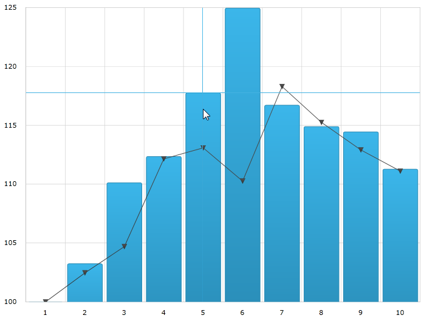

////

|metadata|
{
    "name": "datachart-crosshairlayer",
    "controlName": ["{DataChartName}"],
    "tags": ["Charting","Getting Started","How Do I"],
    "guid": "d20ed73f-d348-478e-bfab-4c4cbc5b3825",  
    "buildFlags": ["ANDROID","SL","WPF","WINFORMS"],
    "createdOn": "2014-06-05T19:39:00.631372Z"
}
|metadata|
////

= 十字線レイヤー

== トピックの概要

=== 目的

このトピックは、ホバー操作に使用される十字線レイヤーについての情報を提供します。十字線のプロパティについて説明し、実装例を示します。

=== 前提条件

本トピックの理解を深めるために、以下のトピックを参照することをお勧めします。

[options="header", cols="a,a"]
|====
|トピック|目的

| link:datachart-getting-started-with-datachart.html[データ チャートを使用した作業の開始]
|{DataChartName} コントロールは、コントロールの DataContext プロパティにマップされるデータ オブジェクト モデルを必要とします。ここでは、簡単なデータ オブジェクト モデルを提供しますが、自分自身で作成し、このサンプル コードの代わりに使用することができます。

| link:datachart-category-series-overview.html[カテゴリ シリーズ]
|このトピックは、{DataChartName} コントロールのカテゴリ シリーズのさまざまなタイプを説明します。

|====

=== このトピックの内容

このトピックは、以下のセクションで構成されます。

* <<Overview,概要>>
* <<Preview,プレビュー>>
* <<Properties,プロパティ>>
* <<Example,例>>
* <<RelatedContent,関連コンテンツ>>

[[Overview]]
== 概要

=== 十字線レイヤーの概要

link:{DataChartLink}.crosshairlayer_members.html[CrosshairLayer] は、対象とするよう構成される各シリーズの実際の値で異なるセットの線を描画する各シリーズと交差する十字線として描画されます。

レイヤーには、デフォルトで {DataChartName} コントロール上のすべてのシリーズを対象とする場合に 1 つの特別なシリーズのみを表示するように link:{DataChartLink}.crosshairlayer_members.html[CrosshairLayer] を構成できます。これを実行するには、 link:{DataChartLink}.crosshairlayer{ApiProp}targetseries.html[TargetSeries] プロパティを設定します。このプロパティの詳細は、以下の<<Properties,プロパティ>> セクションを参照してください。

デフォルトでは、十字線の色は交差するシリーズよりも軽い色になります。しかし、このデフォルト値は、十字線に使用される色を選択できるようにオーバーライドできます。これは、 link:{DataChartLink}.series{ApiProp}brush.html[Brush] プロパティを設定することによって行います。このプロパティの詳細は、以下の link:datachart-commonproperties.html[共通のプロパティ] セクションを参照してください。

[[Preview]]

=== プレビュー

以下の画像は、link:{DataChartLink}.crosshairlayer_members.html[CrosshairLayer] を追加して描画した {DataChartName} コントロールのプレビューです。

image::images/Crosshair_Layer_1.png[]

[[Properties]]
== プロパティ

=== 十字線レイヤーのプロパティ

以下の表で、十字線レイヤーのプロパティを簡単に説明します。

[options="header", cols="a,a,a"]
|====
|プロパティ名|プロパティ タイプ|説明

| pick:[xaml,win-forms="link:{DataChartLink}.crosshairlayer{ApiProp}horizontallinevisibility.html[HorizontalLineVisibility]"] pick:[android="link:{DataChartLink}.crosshairlayer{ApiProp}ishorizontallinevisible.html[setIsHorizontalLineVisible]"] 
|
ifdef::xaml,win-forms[] 

Visibility 

endif::xaml,win-forms[] 

ifdef::android[] 

bool 

endif::android[]
|このプロパティは、十字線レイヤーの水平線を表示するかかどうかを指定します。

| pick:[xaml,win-forms="link:{DataChartLink}.crosshairlayer{ApiProp}verticallinevisibility.html[VerticalLineVisibility]"] pick:[android="link:{DataChartLink}.crosshairlayer{ApiProp}isverticallinevisible.html[setIsVerticalLineVisible]"] 
|
ifdef::xaml,win-forms[] 

Visibility 

endif::xaml,win-forms[] 

ifdef::android[] 

bool 

endif::android[]
|このプロパティは、十字線レイヤーの垂直線を表示するかかどうかを指定します。

| link:{DataChartLink}.crosshairlayer{ApiProp}targetseries.html[TargetSeries]
|Series
|このプロパティは、どのシリーズに有効な十字線レイヤーを設定するかを指定します。 

各シリーズごとに別々に十字線レイヤーを作成して個別に構成できます。

| link:{DataChartLink}.crosshairlayer{ApiProp}useinterpolation.html[UseInterpolation]
|bool
|このプロパティは、垂直の十字線がデータ ポイント間の補間位置でシリーズと交差すべきかどうかを指定します。通常、十字線レイヤーはシリーズ内に最も近い点を見つけ、十字線がその点に一致するようにしますが、点がまばらである場合はこのプロパティを有効にします。

ifdef::xaml,win-forms[]

|link:{DataChartLink}.crosshairlayer{ApiProp}isaxisannotationenabled.html[IsAxisAnnotationEnabled]
|bool
|このプロパティは十字線と軸が交差する場所に注釈を描画するかどうかを指定します。

endif::xaml,win-forms[]

|====

[[Example]]
== 例

=== 例

以下のスクリーン ショットは、以下の設定を使用して作成される link:{DataChartLink}.crosshairlayer_members.html[CrosshairLayer] オブジェクト外観の link:{DataChartLink}.crosshairlayer{ApiProp}targetseries.html[TargetSeries] を {DataChartName} コントロールがどのように制御するかを示します。

[options="header", cols="a,a"]
|====
|プロパティ|値

| link:{DataChartLink}.crosshairlayer{ApiProp}targetseries.html[TargetSeries]
|series1

|====

以下のコードはこの実装で使用されます。

ifdef::wpf,win-universal[]

*XAML の場合:*

[source,xaml]
----
<ig:CrosshairLayer 
   TargetSeries="{Binding ElementName=series1}"
/>
----

endif::wpf,win-universal[]

ifdef::wpf,win-forms[]

*C# の場合:*

----
var crosshairLayerSeries = new CrossHairLightLayer();
crosshairLayerSeries.TargetSeries = series1;
chart.Series.Add(crosshairLayerSeries);
----

*Visual Basic の場合:*

----
Dim crosshairLayerSeries As new CrossHairLightLayer()
crosshairLayerSeries.TargetSeries = series1
chart.Series.Add(crosshairLayerSeries)
----

endif::wpf,win-forms[]

ifdef::xamarin[]

*C# の場合:*

----
var crosshairLayerSeries = new CrossHairLightLayer();
crosshairLayerSeries.TargetSeries = series1;
chart.Series.Add(crosshairLayerSeries);
----

endif::xamarin[]

[[_Ref345510469]]
== 関連コンテンツ

[options="header", cols="a,a"]
|====
|トピック|目的

| link:datachart-chartannotationlayers.html[チャート注釈レイヤー]
|このトピックは、利用可能な異なる型のホバー操作レイヤーなど、 link:{DataChartLink}.{DataChartName}.html[{DataChartName}™] コントロール上で利用できるホバー操作について概念的な情報を提供します。

| link:datachart-commonproperties.html[共通のプロパティ]
|このトピックは、ホバー操作機能が、 link:{DataChartLink}.series_members.html[Series] クラスから継承したツールチップの相互作用を強調表示、ホバリングおよび相互作用するために使用するプロパティおよびメソッドについての情報を提供します。

| link:datachart-categoryitemhighlightlayer.html[カテゴリ項目強調表示レイヤー]
|このトピックは、ホバー操作に使用されるカテゴリ項目強調表示レイヤーについての情報を提供します。カテゴリ項目強調表示レイヤーのプロパティについて説明し、実装例を示します。

| link:datachart-categorytooltiplayer.html[カテゴリ ツールチップ レイヤー]
|このトピックは、ホバー操作に使用されるカテゴリ ツールチップ レイヤーについての情報を提供します。カテゴリ ツールチップ レイヤーのプロパティについて説明し、実装例を提供します。

| link:datachart-itemtooltiplayer.html[項目ツールチップ レイヤー]
|このトピックは、ホバー操作に使用される項目ツールチップ レイヤーについての情報を提供します。項目ツールチップ レイヤーのプロパティについて説明し、実装例も提供します。

|====
