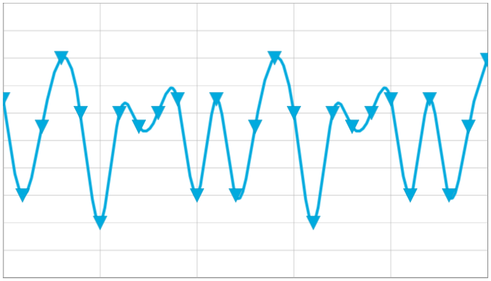

////

|metadata|
{
    "name": "datachart-customizing-markers",
    "controlName": ["{DataChartName}"],
    "tags": ["Charting","How Do I"],
    "guid": "45161040-0a9f-46c9-bf40-02b6f1aec96d",  
    "buildFlags": [],
    "createdOn": "2014-06-05T19:39:00.6823909Z"
}
|metadata|
////

= マーカーのカスタマイズ

link:{DataChartLink}.{DataChartName}.html[{DataChartName}] コントロールでは、シリーズの多くで様々なマーカーをサポートしています。マーカーの外観は、 link:{DataChartLink}.markerseries.html[MarkerSeries] クラスから継承する link:datachart-series.html[Chart シリーズ] のプロパティで管理されます。

[[MarkersAppearance]]
== マーカーの外観

以下の表は、マーカーの外観プロパティ link:{DataChartLink}.markerseries.html[MarkerSeries] オブジェクトの一覧です。

[options="header", cols="a,a,a"]
|====
|プロパティ名|プロパティ タイプ|説明

|MarkerSeries.link:{DataChartLink}.markerseries{ApiProp}markertype.html[MarkerType]
|
ifdef::wpf,win-universal,android[] 

link:{DataChartLink}.markertype.html[MarkerType] 

endif::wpf,win-universal,android[] 

ifdef::xamarin,win-forms[] 

link:{DataChartLinkBase}.markertype.html[MarkerType] 

endif::xamarin,win-forms[]
|現在のシリーズによって表示されるマーカーのタイプを決定します。

|MarkerSeries.link:{DataChartLink}.markerseries{ApiProp}markerbrush.html[MarkerBrush]
|Brush
|マーカーの塗りつぶし色を決定します。

|MarkerSeries.link:{DataChartLink}.markerseries{ApiProp}markeroutline.html[MarkerOutline]
|Brush
|マーカーのアウトライン色を決定します。

|MarkerSeries.link:{DataChartLink}.series{ApiProp}thickness.html[Thickness]
|double
|マーカーのアウトライン色を決定します。

|MarkerSeries. link:{DataChartLink}.series{ApiProp}thickness.html[Thickness]
|double
|マーカーのアウトラインの太さを決定します。

ifdef::wpf,win-universal[]
|MarkerSeries.link:{DataChartLink}.markerseries{ApiProp}markerstyle.html[MarkerStyle]
|Style
|マーカーで使用されるスタイルを決定します。
endif::wpf,win-universal[]

ifdef::wpf,win-universal[]
|MarkerSeries.link:{DataChartLink}.markerseries{ApiProp}markertemplate.html[MarkerTemplate]
|DataTemplate
|現在のシリーズのマーカーのテンプレートを決定します。
endif::wpf,win-universal[]

|====

以下のコードは、 link:{DataChartLink}.splineseries.html[SplineSeries] オブジェクトのマーカー タイプの変更方法を示します。link:{DataChartLink}.markerseries.html[MarkerSeries] クラスを継承する他のシリーズに、同じロジックを適用できます。

ifdef::xaml[]

*XAML の場合:*

----
<ig:{DataChartName} >
    <ig:{DataChartName}.Series>
        <ig:SplineSeries MarkerType="Triangle"/>
    </ig:{DataChartName}.Series>
</ig:{DataChartName}>
----

endif::xaml[]

ifdef::wpf[]

*C# の場合:*

[source]
----
series = new SplineSeries();
series.MarkerType = MarkerType.Triangle;
----

endif::wpf[]

ifdef::win-forms[]

*C# の場合:*

[source]
----
series = new SplineSeries();
series.MarkerType = MarkerType.Triangle;
----

endif::win-forms[]

ifdef::xamarin[]

*C# の場合:*

[source]
----
series = new SplineSeries();
series.MarkerType = MarkerType.Triangle;
----

endif::xamarin[]

ifdef::wpf[]

*Visual Basic の場合:*

----
Dim series As New SplineSeries()
series.MarkerType = MarkerType.Triangle 
----

endif::wpf[]

ifdef::win-forms[]

*Visual Basic の場合:*

----
Dim series As New SplineSeries()
series.MarkerType = MarkerType.Triangle 
----

endif::win-forms[]

ifdef::android[]

*Java の場合:*

[source,js]
----
SplineSeries series = new SplineSeries();
series.setMarkerType(MarkerType.DIAMOND);
----

endif::android[]

図 1: SplineSeries および Triangle マーカーを含む {DataChartName} コントロール。

ifdef::wpf,win-universal[]

[[MarkersTemplates]]
== マーカー テンプレート

endif::wpf,win-universal[]

ifdef::wpf,win-universal[]
以下の表のチャート コントロールのプロパティにデータ テンプレートをバインドすることで、マーカーの形状をカスタマイズすることもできます。
endif::wpf,win-universal[]

ifdef::wpf,win-universal[]

[options="header", cols="a,a,a"]
|====
|プロパティ名|プロパティ タイプ|説明

| link:{DataChartLinkBase}.{DataChartBase}{ApiProp}circlemarkertemplate.html[CircleMarkerTemplate]
|DataTemplate
|円形マーカー タイプのテンプレートを決定します。

| link:{DataChartLinkBase}.{DataChartBase}{ApiProp}diamondmarkertemplate.html[DiamondMarkerTemplate]
|DataTemplate
|ダイアモンド マーカー タイプのテンプレートを決定します。

| link:{DataChartLinkBase}.{DataChartBase}{ApiProp}hexagonmarkertemplate.html[HexagonMarkerTemplate]
|DataTemplate
|六角形マーカー タイプのテンプレートを決定します。

| link:{DataChartLinkBase}.{DataChartBase}{ApiProp}hexagrammarkertemplate.html[HexagramMarkerTemplate]
|DataTemplate
|六線星形マーカー タイプのテンプレートを決定します。

| link:{DataChartLinkBase}.{DataChartBase}{ApiProp}pentagrammarkertemplate.html[PentagramMarkerTemplate]
|DataTemplate
|星形五角形マーカー タイプのテンプレートを決定します。

| link:{DataChartLinkBase}.{DataChartBase}{ApiProp}pentagonmarkertemplate.html[PentagonMarkerTemplate]
|DataTemplate
|五角形マーカー タイプのテンプレートを決定します。

| link:{DataChartLinkBase}.{DataChartBase}{ApiProp}pyramidmarkertemplate.html[PyramidMarkerTemplate]
|DataTemplate
|ピラミッド マーカー タイプのテンプレートを決定します。

| link:{DataChartLinkBase}.{DataChartBase}{ApiProp}squaremarkertemplate.html[SquareMarkerTemplate]
|DataTemplate
|正方形マーカー タイプのテンプレートを決定します。

| link:{DataChartLinkBase}.{DataChartBase}{ApiProp}tetragrammarkertemplate.html[TetragramMarkerTemplate]
|DataTemplate
|四面マーカー タイプのテンプレートを決定します。

| link:{DataChartLinkBase}.{DataChartBase}{ApiProp}trianglemarkertemplate.html[TriangleMarkerTemplate]
|DataTemplate
|三角形マーカー タイプのテンプレートを決定します。

|====

endif::wpf,win-universal[]

ifdef::win-phone[]
.注:
[NOTE]
====
タッチ可能なマーカーを作成する場合は、 link:http://msdn.microsoft.com/ja-jp/library/hh202889(v=VS.92).aspx[Windows Phone のインタラクションとユーザビリティ] で Microsoft の推奨をレビューし、マーカーの最小サイズを大きくしてください。
====
endif::win-phone[]

ifdef::wpf,win-universal[]
以下のコードは、{DataChartName} コントロールでのマーカー用データテンプレートの作成方法を示します。
endif::wpf,win-universal[]

ifdef::wpf,win-universal[]

*XAML の場合:*

[source]
----
<UserControl.Resources>
    <DataTemplate x:Key="CircleMarkerTemplate">
        <Ellipse Stretch="Fill" 
                 HorizontalAlignment="Stretch" 
                 VerticalAlignment="Stretch" 
                 Fill="{Binding ActualItemBrush}" 
                 Stroke="{Binding Series.ActualMarkerOutline}" 
                 StrokeThickness="0.5" 
                 MinWidth="20" MinHeight="20" />
    </DataTemplate>
    <DataTemplate x:Key="DiamondMarkerTemplate">
        <Polygon Points="0 4 4 8 8 4 4 0" 
                 Stretch="Fill" HorizontalAlignment="Stretch" 
                 VerticalAlignment="Stretch" 
                 Fill="{Binding ActualItemBrush}" 
                 Stroke="{Binding Series.ActualMarkerOutline}" 
                 StrokeThickness="0.5" 
                 MinWidth="20" MinHeight="20" />
    </DataTemplate>
    <DataTemplate x:Key="HexagramMarkerTemplate">
        <Polygon Points="4 0 3 2.268 0.536 2 2 4 0.536 6 3 5.732 4 8 5 5.732 7.464 6 6 4 7.464 2 5 2.268" 
                 Stretch="Fill" Margin="-2" 
                 HorizontalAlignment="Stretch" 
                 VerticalAlignment="Stretch" 
                 Fill="{Binding ActualItemBrush}" 
                 Stroke="{Binding Series.ActualMarkerOutline}" 
                 StrokeThickness="0.5" 
                 MinWidth="20" MinHeight="20" />
    </DataTemplate>
    <DataTemplate x:Key="HexagonMarkerTemplate">
        <Polygon Points="4 0 0.536 2 0.536 6 4 8 7.464 6 7.464 2" 
                 Stretch="Fill" 
                 HorizontalAlignment="Stretch" 
                 VerticalAlignment="Stretch" 
                 Fill="{Binding ActualItemBrush}" 
                 Stroke="{Binding Series.ActualMarkerOutline}" 
                 StrokeThickness="0.5" 
                 MinWidth="20" MinHeight="20" />
    </DataTemplate>
    <DataTemplate x:Key="PentagramMarkerTemplate">
        <Polygon Points="4 0 2.8244 2.382 0.1956 2.764 2.098 4.618 1.6488 7.236 4 6 6.3512 7.236 5.902 4.618 7.8044 2.764 5.1756 2.382" 
                 Margin="-2" 
                 HorizontalAlignment="Stretch" 
                 VerticalAlignment="Stretch" 
                 Stretch="Fill" 
                 Fill="{Binding ActualItemBrush}" 
                 Stroke="{Binding Series.ActualMarkerOutline}" 
                 StrokeThickness="0.5" 
                 MinWidth="20" MinHeight="20" />
    </DataTemplate>
    <DataTemplate x:Key="PentagonMarkerTemplate">
        <Polygon Points="4 0 0.1956 2.764 1.65 7.236 6.35 7.236 7.8044 2.764" 
                 Stretch="Fill" 
                 HorizontalAlignment="Stretch" 
                 VerticalAlignment="Stretch" 
                 Fill="{Binding ActualItemBrush}" 
                 Stroke="{Binding Series.ActualMarkerOutline}" 
                 StrokeThickness="0.5" 
                 MinWidth="20" MinHeight="20" />
    </DataTemplate>
    <DataTemplate x:Key="PyramidMarkerTemplate">
        <Polygon Points="0, 8 4, 0 8, 8" 
                 Stretch="Fill" 
                 HorizontalAlignment="Stretch" 
                 VerticalAlignment="Stretch" 
                 Fill="{Binding ActualItemBrush}" 
                 Stroke="{Binding Series.ActualMarkerOutline}" 
                 StrokeThickness="0.5" 
                 MinWidth="20" MinHeight="20" />
    </DataTemplate>
    <DataTemplate x:Key="SquareMarkerTemplate">
        <Rectangle Stretch="Fill" 
                   HorizontalAlignment="Stretch" 
                   VerticalAlignment="Stretch" 
                   Fill="{Binding ActualItemBrush}" 
                   Stroke="{Binding Series.ActualMarkerOutline}" 
                   StrokeThickness="0.5" 
                   MinWidth="20" MinHeight="20" />
    </DataTemplate>
    <DataTemplate x:Key="TetragramMarkerTemplate">
        <Polygon Points="4 0 2.5856 2.5856 0 4 2.5856 5.4144 4 8 5.4144 5.4144 8 4 5.4144 2.5856" 
                 Stretch="Fill" 
                 HorizontalAlignment="Stretch" 
                 VerticalAlignment="Stretch" 
                 Fill="{Binding ActualItemBrush}" 
                 Stroke="{Binding Series.ActualMarkerOutline}" 
                 StrokeThickness="0.5" 
                 MinWidth="20" MinHeight="20" />
    </DataTemplate>
    <DataTemplate x:Key="TriangleMarkerTemplate">
        <Polygon Points="0, 0 4, 8 8, 0" 
                 Stretch="Fill" 
                 HorizontalAlignment="Stretch" 
                 VerticalAlignment="Stretch" 
                 Fill="{Binding ActualItemBrush}" 
                 Stroke="{Binding Series.ActualMarkerOutline}" 
                 StrokeThickness="0.5" 
                 MinWidth="20" MinHeight="20" />
    </DataTemplate>
</UserControl.Resources>
----

[source]
----
<ig:{DataChartName} x:Name="dataChart" 
                 CircleMarkerTemplate="{StaticResource CircleMarkerTemplate}" 
                 TriangleMarkerTemplate="{StaticResource TriangleMarkerTemplate}" 
                 PyramidMarkerTemplate="{StaticResource PyramidMarkerTemplate}" 
                 SquareMarkerTemplate="{StaticResource SquareMarkerTemplate}" 
                 DiamondMarkerTemplate="{StaticResource DiamondMarkerTemplate}" 
                 PentagonMarkerTemplate="{StaticResource PentagonMarkerTemplate}" 
                 HexagonMarkerTemplate="{StaticResource HexagonMarkerTemplate}" 
                 TetragramMarkerTemplate="{StaticResource TetragramMarkerTemplate}" 
                 PentagramMarkerTemplate="{StaticResource PentagramMarkerTemplate}" 
                 HexagramMarkerTemplate="{StaticResource HexagramMarkerTemplate}" >
            <!-- ...-->
</ig:{DataChartName}>
----

endif::wpf,win-universal[]

[[RelatedContent]]
== 関連コンテンツ

ifdef::wpf,win-universal[]
* link:datachart-displaying-marker-values.html[マーカー値の表示]

endif::wpf,win-universal[]

* link:datachart-series-types.html[シリーズ タイプ]
* link:datachart-series-requirements.html[シリーズ要件]