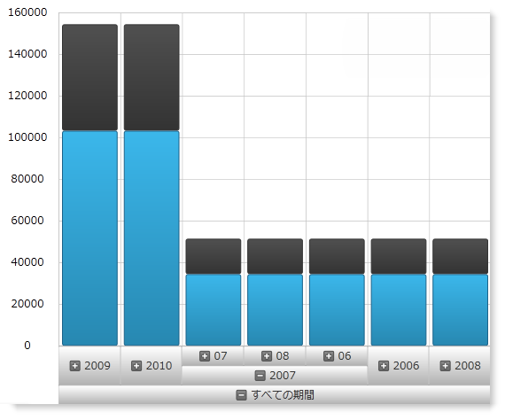

////

|metadata|
{
    "name": "datachart-customizing-series-when-used-with-multi-dimensional-data-(olap-data)-(xamdatachart)",
    "controlName": ["{DataChartName}"],
    "tags": ["Charting","Drilldown","How Do I","Tips and Tricks"],
    "guid": "30e13d6b-4a05-4e17-bee1-446e8f6e6402",  
    "buildFlags": ["SL","WPF"],
    "createdOn": "2014-06-05T19:39:00.5743474Z"
}
|metadata|
////

= 多次元データ (OLAP データ) と使用した時にシリーズをカスタマイズ

== トピックの概要

=== 目的

このトピックでは、{DataChartName}™ コントロールで 1 つのチャートに複数のシリーズ タイプを表示する、または多次元データ (OnLine Analytical Processing (OLAP) データ) で作業する時に積層シリーズを使用する方法について説明します。

=== 前提条件

以下の表は、このトピックを理解するための前提条件として必要なトピックを示しています。

[options="header", cols="a,a"]
|====
|トピック|目的

| link:datachart-visualizing-multi-dimensional-data-(olap-data)-({DataChartName}).html[多次元データ (OLAP データ) を視覚化 ({DataChartName})]
|このトピックでは、コード例とともに、{DataChartName} コントロールで多次元データ (OLAP) データ) を表示する方法について説明します。

| link:datachart-series.html[チャート シリーズ]
|このトピックでは、{DataChartName} コントロール シリーズの概要を説明します。

|====

=== このトピックの内容

このトピックは、以下のセクションで構成されます。

* <<_Ref333571021,OLAP データを使用する時にシリーズ タイプを構成>>
* <<_Ref333522856,複数のシリーズ タイプを表示>>

** <<_Ref327461264,概要>>
** <<_Ref327461267,プレビュー>>
** <<_Ref327461269,要件>>
** <<_Ref327461272,概要>>
** <<_Ref327461274,手順>>
** <<_Ref333522847,コード>>

* <<_Ref333571052,OlapXAxis と積層シリーズを使用>>

** <<_Ref327461280,概要>>
** <<_Ref327461286,プレビュー>>
** <<_Ref333571088,要件>>
** <<_Ref327461291,手順>>
** <<_Ref333571095,コード>>

* <<_Ref327461318,関連コンテンツ>>

[[_Ref333571021]]
== OLAP データを使用する時にシリーズ タイプを構成

[[_Ref333571025]]

=== OLAP データ サマリーを使用する時にシリーズ タイプを構成

データを表示するために  _{DataChartName}_   コントロールを使用する時、通常は描画したい軸とシリーズを選択します。これによって表示されるシリーズを完全に制御できます。他方では、OlapXAxis を使用すると、数値の Y 軸の使用に制限され、デフォルトで表示できる定義済みのシリーズのセットから選択できます。シリーズ タイプは、データの現在のスライスのすべての行または列に対して何が生成されるのかを指定する link:{ApiPlatform}controls.charts.olap{ApiVersion}{ApiProp}{DataChartNamespace}.olapxaxis{ApiProp}defaultseries.html[DefaultSeries] プロパティによって管理されます。

単一シリーズを表示するには、 link:{ApiPlatform}controls.charts.olap{ApiVersion}{ApiProp}{DataChartNamespace}.olapxaxis{ApiProp}defaultseries.html[DefaultSeries] プロパティを事前に定義したシリーズ タイプに設定します。プロパティが設定されていない場合、柱状シリーズが使用されます。OlapXAxis は x 軸であるため、バー シリーズなどのいかなる種類の垂直シリーズを使用できません。ただし、事前に定義したシリーズと異なるシリーズを使用する方法がいくつかあります。複数のシリーズ タイプを表示したい場合、または積層シリーズ (link:{ApiPlatform}controls.charts.olap{ApiVersion}{ApiProp}{DataChartNamespace}.olapxaxisdefaultseries.html[OlapXAxisDefaultSeries] 列挙体に含まれない) を使用したい場合は、 link:{ApiPlatform}controls.charts.olap{ApiVersion}{ApiProp}{DataChartNamespace}.olapaxis{ApiProp}seriesinitializing_ev.html[SeriesInitializing] および link:{ApiPlatform}controls.charts.olap{ApiVersion}{ApiProp}{DataChartNamespace}.olapaxis{ApiProp}seriescreating_ev.html[SeriesCreating] イベントを使用する必要があります。

[[_Ref333522856]]
== 複数のシリーズ タイプを表示

[[_Ref327461264]]

=== 概要

多次元データを使用する時、柱状、線、点シリーズを表示するために手順ごとに手順を説明します。

[[_Ref327461267]]

=== プレビュー

以下のスクリーンショットは最終結果のプレビューです。

image::images/xamDataChart_Customizing_Series_When_Used_With_Multi-Dimensional_Data_01.png[]

[[_Ref327461269]]

=== 要件

この手順を実行するには、以下が必要です。

* link:datachart-visualizing-multi-dimensional-data-(olap-data)-({DataChartName}).html[多次元データ (OLAP データ) を視覚化 ({DataChartName})] で説明したように OlapXAxis で構成された  _{DataChartName}_   を持つ {PlatformName} {PlatformIDE} アプリケーション プロジェクト。

[[_Ref327461272]]

=== 概要

以下はプロセスの概念的概要です。

*1.必須のイベントにサブスクライブします。*

*2.必要なヘルパー変数を追加します。*

*3.シリーズ作成イベントを使用してデフォルトのシリーズを置き換えます。*

[[_Ref327461274]]

=== 手順

=== 1.必須のイベントにサブスクライブします。

** link:{ApiPlatform}controls.charts.olap{ApiVersion}{ApiProp}{DataChartNamespace}.olapaxis{ApiProp}seriescreating_ev.html[SeriesCreating]  *イベントと*  link:{ApiPlatform}controls.charts.olap{ApiVersion}{ApiProp}{DataChartNamespace}.olapaxis{ApiProp}seriesinitializing_ev.html[SeriesInitializing]  *イベントにサブスクライブします。*

生成されたシリーズがデータ チャートに追加される前に毎回 `SeriesCreating` イベントが発生します。このイベントのイベント ハンドラーは選択したシリーズでデフォルトのシリーズを置き換える場所です。すべてのシリーズの作成が開始する前に `SeriesInitializing` イベントが発生します。これは、たとえばユーザーが軸ラベルを展開する時、または新しい階層がデータ ソースに追加される時です。その後で、必要なシリーズの数によって異なりますが、シリーズごとに `SeriesCreating` イベントが複数回発生します。

=== 2.必要なヘルパー変数を追加します。

*シリーズの現在の数を保持するために整数の変数を追加します。*

この手順のこの例では、現在作成されているシリーズの数を保持するために整数の変数が使用されます。これは `SeriesCreating` イベントの異なる発生を識別できるようにするために必要です。`SeriesInitializing` イベントが発生する場合、この変数をゼロに設定し、`SeriesCreating` で増分します。このフィールドの値に基づいて、異なるタイプのシリーズを作成します。

この手法は簡単であるため使用されますが、使用すべきシリーズのタイプを選択するためにより洗練されたロジック (たとえばシリーズが対応するデータ ソースでどのメジャーを使用するのかに基づく) を実装できます。

=== 3.シリーズ作成イベントを使用してデフォルトのシリーズを置き換えます。

希望するタイプのシリーズを表示するには、新しいシリーズを作成して、 link:{ApiPlatform}controls.charts.olap{ApiVersion}{ApiProp}{DataChartNamespace}.seriescreatingeventargs_members.html[SeriesCreatingEventArgs] の link:{ApiPlatform}controls.charts.olap{ApiVersion}{ApiProp}{DataChartNamespace}.seriescreatingeventargs{ApiProp}series.html[Series]  *プロパティの値として*  *このシリーズを設定する必要があります* 。使用されるシリーズが `SeriesCreating` イベントへの引数として提供されます。また、これらの引数には、新しいシリーズを作成するために必要なすべての情報を持つ link:{ApiPlatform}controls.charts.olap{ApiVersion}{ApiProp}{DataChartNamespace}.olapseriesinfo_members.html[OlapSeriesInfo] オブジェクトが含まれます。

新しいシリーズを作成して必要なプロパティを割り当てるには:

1.シリーズの pick:[wpf,win-universal="link:{ApiPlatform}controls.charts.olap{ApiVersion}{ApiProp}{DataChartNamespace}.olapseriesinfo{ApiProp}itemssource.html[ItemsSource]"]  pick:[win-forms="link:{DataChartLink}.series{ApiProp}datasource.html[DataSource]"] を `SeriesInfo` によって提供される `ItemsSource` に設定します 。

2.link:{DataChartLink}.anchoredcategoryseries{ApiProp}valuememberpath.html[ValueMemberPath] プロパティを設定します。

データ ソースは link:{ApiPlatform}controls.charts.olap{ApiVersion}{ApiProp}{DataChartNamespace}.olapaxiscell_members.html[OlapAxisCell] オブジェクトのリストです。バインドしなければならない値は `OlapAxisCell` オブジェクトと関連付けられた link:{ApiPlatform}controls.charts.olap{ApiVersion}{ApiProp}{DataChartNamespace}.olapaxiscell{ApiProp}cell.html[Cell] の link:{ApiPlatform}olap{ApiVersion}~infragistics.olap.data.base.cell{ApiProp}value.html[Value] プロパティにあります。

これは `ValueMemberPath` が `"Cell.Value"` でなければならないことを意味します。

3.link:{ApiPlatform}controls.charts.olap{ApiVersion}{ApiProp}{DataChartNamespace}.olapseriesinfo{ApiProp}name.html[Name] プロパティをシリーズ情報と提供される名前に設定します。

4. link:{ApiPlatform}controls.charts.olap{ApiVersion}{ApiProp}{DataChartNamespace}.olapseriesinfo{ApiProp}title.html[Title] をシリーズ情報からの 1 つに設定します。

[[_Ref333522847]]

=== コード

以下はこの手順の完全なコードです。

ifdef::wpf,win-universal[]

*XAML の場合:*

[source,xaml]
----
<UserControl    
…
      xmlns:ig="http://schemas.infragistics.com/xaml"
      xmlns:models="clr-namespace:Infragistics.Samples.Data.Models"
      xmlns:olap="http://schemas.infragistics.com/olap">
<UserControl.Resources>
        <ResourceDictionary>
            <models:SalesDataSample x:Key="DataSample"/>
            <olap:FlatDataSource
                x:Key="DataSource"
                Columns="[Date].[Date]"
                Measures="AmountOfSale, NumberOfUnits"
                MeasureListLocation="Rows"
                ItemsSource="{StaticResource DataSample}" />
        </ResourceDictionary>
    </UserControl.Resources>
    <Grid x:Name="LayoutRoot" Background="White">
        <Grid.ColumnDefinitions>
            <ColumnDefinition />
            <ColumnDefinition Width="Auto"/>
        </Grid.ColumnDefinitions>
        <ig:{DataChartName} x:Name="DataChart" HorizontalZoomable="True" VerticalZoomable="True" Width="700" >
            <ig:{DataChartName}.Axes>
                <ig:NumericYAxis x:Name="YAxis" MinimumValue="0"/>
                <ig:OlapXAxis
                    YAxis="{Binding ElementName=YAxis}"
                    DataSource="{StaticResource DataSource}"
                    OlapAxisSource="Columns"
                    DefaultSeries="ColumnSeries"
                    SeriesInitializing="OlapXAxis_SeriesInitializing"
                    SeriesCreating="OlapXAxis_SeriesCreating"/>
            </ig:{DataChartName}.Axes>
        </ig:{DataChartName}>
    </Grid>
</UserControl>
----

endif::wpf,win-universal[]

ifdef::wpf[]

*C# の場合:*

[source,csharp]
----
…
public partial class MainPage : UserControl
    {
        int seriesIndex = 0;
        public MainPage()
        {
            InitializeComponent();
        }
        private void OlapXAxis_SeriesCreating(object sender, Infragistics.Controls.Charts.SeriesCreatingEventArgs e)
        {
            switch (seriesIndex)
            {
                case 0:
                    e.Series = new ColumnSeries()
                    {
                        ItemsSource = e.SeriesInfo.ItemsSource,
                        ValueMemberPath = "Cell.Value",
                        Title = e.SeriesInfo.Title,
                        Name = e.SeriesInfo.Name
                    };
                    break;
                case 1:
                    e.Series = new LineSeries()
                    {
                        ItemsSource = e.SeriesInfo.ItemsSource,
                        ValueMemberPath = "Cell.Value",
                        Title = e.SeriesInfo.Title,
                        Name = e.SeriesInfo.Name
                    };
                    break;
                case 2:
                    e.Series = new PointSeries()
                    {
                        ItemsSource = e.SeriesInfo.ItemsSource,
                        ValueMemberPath = "Cell.Value",
                        Title = e.SeriesInfo.Title,
                        Name = e.SeriesInfo.Name
                    };
                    break;
            }
            seriesIndex++;
        }
        private void OlapXAxis_SeriesInitializing(object sender, Infragistics.Controls.Charts.SeriesInitializingEventArgs e)
        {
            seriesIndex = 0;
        }
----

endif::wpf[]

ifdef::win-forms[]

*C# の場合:*

[source,csharp]
----
…
public partial class MainPage : UserControl
    {
        int seriesIndex = 0;
        public MainPage()
        {
            InitializeComponent();
        }
        private void OlapXAxis_SeriesCreating(object sender, Infragistics.Controls.Charts.SeriesCreatingEventArgs e)
        {
            switch (seriesIndex)
            {
                case 0:
                    e.Series = new ColumnSeries()
                    {
                        ItemsSource = e.SeriesInfo.ItemsSource,
                        ValueMemberPath = "Cell.Value",
                        Title = e.SeriesInfo.Title,
                        Name = e.SeriesInfo.Name
                    };
                    break;
                case 1:
                    e.Series = new LineSeries()
                    {
                        ItemsSource = e.SeriesInfo.ItemsSource,
                        ValueMemberPath = "Cell.Value",
                        Title = e.SeriesInfo.Title,
                        Name = e.SeriesInfo.Name
                    };
                    break;
                case 2:
                    e.Series = new PointSeries()
                    {
                        ItemsSource = e.SeriesInfo.ItemsSource,
                        ValueMemberPath = "Cell.Value",
                        Title = e.SeriesInfo.Title,
                        Name = e.SeriesInfo.Name
                    };
                    break;
            }
            seriesIndex++;
        }
        private void OlapXAxis_SeriesInitializing(object sender, Infragistics.Controls.Charts.SeriesInitializingEventArgs e)
        {
            seriesIndex = 0;
        }
----

endif::win-forms[]

ifdef::xamarin[]

*C# の場合:*

[source,csharp]
----
…
public partial class MainPage : UserControl
    {
        int seriesIndex = 0;
        public MainPage()
        {
            InitializeComponent();
        }
        private void OlapXAxis_SeriesCreating(object sender, Infragistics.Controls.Charts.SeriesCreatingEventArgs e)
        {
            switch (seriesIndex)
            {
                case 0:
                    e.Series = new ColumnSeries()
                    {
                        ItemsSource = e.SeriesInfo.ItemsSource,
                        ValueMemberPath = "Cell.Value",
                        Title = e.SeriesInfo.Title,
                        Name = e.SeriesInfo.Name
                    };
                    break;
                case 1:
                    e.Series = new LineSeries()
                    {
                        ItemsSource = e.SeriesInfo.ItemsSource,
                        ValueMemberPath = "Cell.Value",
                        Title = e.SeriesInfo.Title,
                        Name = e.SeriesInfo.Name
                    };
                    break;
                case 2:
                    e.Series = new PointSeries()
                    {
                        ItemsSource = e.SeriesInfo.ItemsSource,
                        ValueMemberPath = "Cell.Value",
                        Title = e.SeriesInfo.Title,
                        Name = e.SeriesInfo.Name
                    };
                    break;
            }
            seriesIndex++;
        }
        private void OlapXAxis_SeriesInitializing(object sender, Infragistics.Controls.Charts.SeriesInitializingEventArgs e)
        {
            seriesIndex = 0;
        }
----

endif::xamarin[]

ifdef::wpf[]

*Visual Basic の場合:*

[source,vb]
----
Imports {DataChartNamespace}
Partial Public Class MainPage
    Inherits UserControl
    Private seriesIndex As Integer
    Public Sub New()
        InitializeComponent()
    End Sub
    Private Sub OlapXAxis_SeriesInitializing(sender As System.Object, e As SeriesInitializingEventArgs)
        seriesIndex = 0
    End Sub
    Private Sub OlapXAxis_SeriesCreating(sender As System.Object, e As SeriesCreatingEventArgs)
        Select Case seriesIndex
            Case 0
                e.Series = New ColumnSeries() With { _
                 .ItemsSource = e.SeriesInfo.ItemsSource, _
                 .ValueMemberPath = "Cell.Value", _
                 .Title = e.SeriesInfo.Title, _
                 .Name = e.SeriesInfo.Name _
                }
                Exit Select
            Case 1
                e.Series = New LineSeries() With { _
                 .ItemsSource = e.SeriesInfo.ItemsSource, _
                 .ValueMemberPath = "Cell.Value", _
                 .Title = e.SeriesInfo.Title, _
                 .Name = e.SeriesInfo.Name _
                }
                Exit Select
            Case 2
                e.Series = New PointSeries() With { _
                 .ItemsSource = e.SeriesInfo.ItemsSource, _
                 .ValueMemberPath = "Cell.Value", _
                 .Title = e.SeriesInfo.Title, _
                 .Name = e.SeriesInfo.Name _
                }
                Exit Select
        End Select        
        seriesIndex += 1
    End Sub
End Class
----

endif::wpf[]

ifdef::win-forms[]

*Visual Basic の場合:*

[source,vb]
----
Imports {DataChartNamespace}
Partial Public Class MainPage
    Inherits UserControl
    Private seriesIndex As Integer
    Public Sub New()
        InitializeComponent()
    End Sub
    Private Sub OlapXAxis_SeriesInitializing(sender As System.Object, e As SeriesInitializingEventArgs)
        seriesIndex = 0
    End Sub
    Private Sub OlapXAxis_SeriesCreating(sender As System.Object, e As SeriesCreatingEventArgs)
        Select Case seriesIndex
            Case 0
                e.Series = New ColumnSeries() With { _
                 .ItemsSource = e.SeriesInfo.ItemsSource, _
                 .ValueMemberPath = "Cell.Value", _
                 .Title = e.SeriesInfo.Title, _
                 .Name = e.SeriesInfo.Name _
                }
                Exit Select
            Case 1
                e.Series = New LineSeries() With { _
                 .ItemsSource = e.SeriesInfo.ItemsSource, _
                 .ValueMemberPath = "Cell.Value", _
                 .Title = e.SeriesInfo.Title, _
                 .Name = e.SeriesInfo.Name _
                }
                Exit Select
            Case 2
                e.Series = New PointSeries() With { _
                 .ItemsSource = e.SeriesInfo.ItemsSource, _
                 .ValueMemberPath = "Cell.Value", _
                 .Title = e.SeriesInfo.Title, _
                 .Name = e.SeriesInfo.Name _
                }
                Exit Select
        End Select        
        seriesIndex += 1
    End Sub
End Class
----

endif::win-forms[]

ifdef::xamarin[]

*Visual Basic の場合:*

[source,vb]
----
Imports {DataChartNamespace}
Partial Public Class MainPage
    Inherits UserControl
    Private seriesIndex As Integer
    Public Sub New()
        InitializeComponent()
    End Sub
    Private Sub OlapXAxis_SeriesInitializing(sender As System.Object, e As SeriesInitializingEventArgs)
        seriesIndex = 0
    End Sub
    Private Sub OlapXAxis_SeriesCreating(sender As System.Object, e As SeriesCreatingEventArgs)
        Select Case seriesIndex
            Case 0
                e.Series = New ColumnSeries() With { _
                 .ItemsSource = e.SeriesInfo.ItemsSource, _
                 .ValueMemberPath = "Cell.Value", _
                 .Title = e.SeriesInfo.Title, _
                 .Name = e.SeriesInfo.Name _
                }
                Exit Select
            Case 1
                e.Series = New LineSeries() With { _
                 .ItemsSource = e.SeriesInfo.ItemsSource, _
                 .ValueMemberPath = "Cell.Value", _
                 .Title = e.SeriesInfo.Title, _
                 .Name = e.SeriesInfo.Name _
                }
                Exit Select
            Case 2
                e.Series = New PointSeries() With { _
                 .ItemsSource = e.SeriesInfo.ItemsSource, _
                 .ValueMemberPath = "Cell.Value", _
                 .Title = e.SeriesInfo.Title, _
                 .Name = e.SeriesInfo.Name _
                }
                Exit Select
        End Select        
        seriesIndex += 1
    End Sub
End Class
----

endif::xamarin[]

[[_Ref333571052]]
== OlapXAxis と積層シリーズを使用

[[_Ref327461280]]

=== 概要

link:datachart-category-series-overview.html[積層シリーズ]を使用する場合、積層のピースとして表示したいすべての値を持つオブジェクトを含むデータ ソースが必要です。ただし、各シリーズに提供されるデータ ソースには 1 つのシリーズの値だけが含まれます。したがって、シリーズを表示するために必要とされる値を保存するにはカスタム クラスを作成する必要があります。このように 1 つの積層シリーズをチャートに追加して、共通のデータ ソースを持つ複数の link:{DataChartLink}.stackedfragmentseries_properties.html[StackedFragmentedSeries] で `Series` コレクションを生成します。

[[_Ref327461286]]

=== プレビュー

以下のスクリーンショットは最終結果のプレビューです。

[[_Ref333571088]]

=== 要件

この手順を実行するには、以下が必要です。

* link:datachart-visualizing-multi-dimensional-data-(olap-data)-({DataChartName}).html[多次元データ (OLAP データ) を視覚化 ({DataChartName})] で説明したように OlapXAxis で構成された  _{DataChartName}_   を持つ {PlatformName} {PlatformIDE} アプリケーション プロジェクト。
*  _{DataChartName}_   の積層シリーズ タイプを理解している。詳細については、 link:datachart-category-stacked-column-series.html[積層型柱状シリーズ]というトピックを参照してください。

[[_Ref327461288]]

=== 概要

このトピックは、StackedColumnSeries で OlapXAxis と使用されるデフォルト シリーズを置き換える手順を説明します。以下はプロセスの概念的概要です。 

1.必須のイベントにサブスクライブします。
2.必要なヘルパー変数を追加します。
3. シリーズのデータを保管するためのヘルパー クラスを追加します。
4.イベントを使用してデフォルトのシリーズを置き換えます。

[[_Ref327461291]]

=== 手順

=== 1.必須のイベントにサブスクライブします。

** link:{ApiPlatform}controls.charts.olap{ApiVersion}{ApiProp}{DataChartNamespace}.olapaxis{ApiProp}seriescreating_ev.html[SeriesCreating]  *イベントと*  link:{ApiPlatform}controls.charts.olap{ApiVersion}{ApiProp}{DataChartNamespace}.olapaxis{ApiProp}seriesinitializing_ev.html[SeriesInitializing]  *イベントにサブスクライブします。*

生成されたシリーズがデータ チャートに追加される前に毎回 `SeriesCreating` イベントが発生します。すべてのシリーズの作成が開始する前に `SeriesInitializing` イベントが発生します。これは、たとえばユーザーが軸ラベルを展開する時、または新しい階層がデータ ソースに追加される時です。その後で、必要なシリーズの数だけ `SeriesCreating` イベントが発生します。

=== 2.必要なヘルパー変数を追加します。

*1.シリーズの現在の数を保持するために整数の変数を追加します。*

たとえばこの手順で、作成された link:{DataChartLink}.stackedfragmentseries_properties.html[StackedFragmentedSeries] の現在の数を保存するために整数の変数が使用されます。これは `SeriesCreating` イベントの異なる発生を識別するために必要とされます。 ** `SeriesInitializing`  *イベントが発生する場合、*  *この変数を*   _0_    *に設定し、*  `SeriesCreating` で *増分します* 。

*2.チャートで使用するために _StackedColumnSeries_ 変数を追加します。*

整数フィールドに加えて、データ チャートで使用される積層型柱状シリーズへの参照を保管するために link:{DataChartLink}.stackedcolumnseries_members.html[StackedColumnSeries] フィールドが必要です。希望する場合には、これを link:{DataChartLink}.horizontalstackedseriesbase_members.html[HorizontalStackedSeriesBase] から派生する任意の種類の積層シリーズで置き換えることができます。残りのコードは実質的には同じになります。

=== 3.シリーズのデータを保管するためのヘルパー クラスを追加します。

積層シリーズに共通のデータ ソースを作成できるようにするには、 *double 値のリストを含むクラスを追加します。* このリストの目的は、シリーズのデータ ソースそれぞれの設定を保管することです。シリーズのすべてのデータ ソースがリストに追加される時は、 link:{DataChartLink}.stackedcolumnseries_members.html[StackedColumnSeries] の  pick:[wpf,win-universal="link:{DataChartLink}.series{ApiProp}itemssource.html[ItemsSource]"]  pick:[win-forms="link:{DataChartLink}.series{ApiProp}datasource.html[DataSource]"]  として使用されます。

ifdef::wpf[]

*C# の場合:*

[source,csharp]
----
private class StackedSeriesData
{
    public StackedSeriesData()
    {
        Data = new List<double>();
    }
    public List<double> Data { get; set; }
}
----

endif::wpf[]

ifdef::win-forms[]

*C# の場合:*

[source,csharp]
----
private class StackedSeriesData
{
    public StackedSeriesData()
    {
        Data = new List<double>();
    }
    public List<double> Data { get; set; }
}
----

endif::win-forms[]

ifdef::xamarin[]

*C# の場合:*

[source,csharp]
----
private class StackedSeriesData
{
    public StackedSeriesData()
    {
        Data = new List<double>();
    }
    public List<double> Data { get; set; }
}
----

endif::xamarin[]

ifdef::wpf[]

*Visual Basic の場合:*

[source,vb]
----
 Private Class StackedSeriesData
        Public Property Data As List(Of Double)
        Public Sub New()
            Data = New List(Of Double)
        End Sub
    End Class
----

endif::wpf[]

ifdef::win-forms[]

*Visual Basic の場合:*

[source,vb]
----
 Private Class StackedSeriesData
        Public Property Data As List(Of Double)
        Public Sub New()
            Data = New List(Of Double)
        End Sub
    End Class
----

endif::win-forms[]

ifdef::xamarin[]

*Visual Basic の場合:*

[source,vb]
----
 Private Class StackedSeriesData
        Public Property Data As List(Of Double)
        Public Sub New()
            Data = New List(Of Double)
        End Sub
    End Class
----

endif::xamarin[]

=== 4.イベントを使用してデフォルトのシリーズを置き換えます。

*1. `SeriesInitializing` イベント ハンドラーで、シリーズを初期化してカウンターを _0_ に設定します。*

これは手順 2 の `StackedColumnSeries` の新しいインスタンスで追加されたシリーズ変数を割り当てることを意味します。このように、`SeriesCreating` が発生するたびに、積層シリーズで自動的に生成されたシリーズを置き換えることができます。

ifdef::wpf[]

*C# の場合:*

[source,csharp]
----
private void OlapXAxis_SeriesInitializing(object sender, Infragistics.Controls.Charts.SeriesInitializingEventArgs e)
{
    series = new StackedColumnSeries();
    seriesIndex = 0;
}
----

endif::wpf[]

ifdef::win-forms[]

*C# の場合:*

[source,csharp]
----
private void OlapXAxis_SeriesInitializing(object sender, Infragistics.Controls.Charts.SeriesInitializingEventArgs e)
{
    series = new StackedColumnSeries();
    seriesIndex = 0;
}
----

endif::win-forms[]

ifdef::xamarin[]

*C# の場合:*

[source,csharp]
----
private void OlapXAxis_SeriesInitializing(object sender, Infragistics.Controls.Charts.SeriesInitializingEventArgs e)
{
    series = new StackedColumnSeries();
    seriesIndex = 0;
}
----

endif::xamarin[]

ifdef::wpf[]

*Visual Basic の場合:*

[source,vb]
----
Private Sub OlapXAxis_SeriesInitializing(sender As Object, e As Infragistics.Controls.Charts.SeriesInitializingEventArgs)
      series = New StackedColumnSeries()
      seriesIndex = 0
End Sub
----

endif::wpf[]

ifdef::win-forms[]

*Visual Basic の場合:*

[source,vb]
----
Private Sub OlapXAxis_SeriesInitializing(sender As Object, e As Infragistics.Controls.Charts.SeriesInitializingEventArgs)
      series = New StackedColumnSeries()
      seriesIndex = 0
End Sub
----

endif::win-forms[]

ifdef::xamarin[]

*Visual Basic の場合:*

[source,vb]
----
Private Sub OlapXAxis_SeriesInitializing(sender As Object, e As Infragistics.Controls.Charts.SeriesInitializingEventArgs)
      series = New StackedColumnSeries()
      seriesIndex = 0
End Sub
----

endif::xamarin[]

*2.`SeriesCreating` が初めて発生する時に共通のデータ ソースを作成します。*

`SeriesCreating` イベント ハンドラーで、シリーズ カウンターが  _0_   かどうかをチェックします。0 である場合、これはこれがデータ ソースの現在の状態に対してイベントが発生したのが初めてであり、すべての積層型の断片化されたシリーズに共通する新しいデータ ソースを作成する必要があることを意味します。

ifdef::wpf[]

*C# の場合:*

[source,csharp]
----
private void OlapXAxis_SeriesCreating(object sender, Infragistics.Controls.Charts.SeriesCreatingEventArgs e)
{
    if (seriesIndex == 0)
    {
        series.ItemsSource = Enumerable.Range(0, e.SeriesInfo.ItemsSource.Count).Select(i => new StackedSeriesData()).ToList();
    }
…
----

endif::wpf[]

ifdef::win-forms[]

*C# の場合:*

[source,csharp]
----
private void OlapXAxis_SeriesCreating(object sender, Infragistics.Controls.Charts.SeriesCreatingEventArgs e)
{
    if (seriesIndex == 0)
    {
        series.ItemsSource = Enumerable.Range(0, e.SeriesInfo.ItemsSource.Count).Select(i => new StackedSeriesData()).ToList();
    }
…
----

endif::win-forms[]

ifdef::xamarin[]

*C# の場合:*

[source,csharp]
----
private void OlapXAxis_SeriesCreating(object sender, Infragistics.Controls.Charts.SeriesCreatingEventArgs e)
{
    if (seriesIndex == 0)
    {
        series.ItemsSource = Enumerable.Range(0, e.SeriesInfo.ItemsSource.Count).Select(i => new StackedSeriesData()).ToList();
    }
…
----

endif::xamarin[]

ifdef::wpf[]

*Visual Basic の場合:*

[source,vb]
----
Private Sub OlapXAxis_SeriesCreating(sender As System.Object, e As SeriesCreatingEventArgs)
    If seriesIndex = 0 Then
        series.ItemsSource = Enumerable.Range(0, e.SeriesInfo.ItemsSource.Count).[Select](Function(i) New StackedSeriesData()).ToList()
    End If
----

endif::wpf[]

ifdef::win-forms[]

*Visual Basic の場合:*

[source,vb]
----
Private Sub OlapXAxis_SeriesCreating(sender As System.Object, e As SeriesCreatingEventArgs)
    If seriesIndex = 0 Then
        series.ItemsSource = Enumerable.Range(0, e.SeriesInfo.ItemsSource.Count).[Select](Function(i) New StackedSeriesData()).ToList()
    End If
----

endif::win-forms[]

ifdef::xamarin[]

*Visual Basic の場合:*

[source,vb]
----
Private Sub OlapXAxis_SeriesCreating(sender As System.Object, e As SeriesCreatingEventArgs)
    If seriesIndex = 0 Then
        series.ItemsSource = Enumerable.Range(0, e.SeriesInfo.ItemsSource.Count).[Select](Function(i) New StackedSeriesData()).ToList()
    End If
----

endif::xamarin[]

*3.共通のデータ ソースを生成して `StackedFragmentedSeries` を積層シリーズに追加します。*

SeriesCreating が初めて発生する時に `StackedColumnSeries` の  pick:[wpf,win-universal="link:{DataChartLink}.series{ApiProp}itemssource.html[ItemsSource]"]  pick:[win-forms="link:{DataChartLink}.series{ApiProp}datasource.html[DataSource]"]  を生成した後で、現在の `SeriesInfo.ItemsSource` で提供される項目を共通のデータ ソースに追加する必要があります。

ifdef::wpf[]

*C# の場合:*

[source,csharp]
----
…
for (int i = 0; i < e.SeriesInfo.ItemsSource.Count; i++)
{
    ((List<StackedSeriesData>)series.ItemsSource)[i].Data.Add(Convert.ToDouble(e.SeriesInfo.ItemsSource[i].Cell.Value));
}
…
----

endif::wpf[]

ifdef::win-forms[]

*C# の場合:*

[source,csharp]
----
…
for (int i = 0; i < e.SeriesInfo.ItemsSource.Count; i++)
{
    ((List<StackedSeriesData>)series.ItemsSource)[i].Data.Add(Convert.ToDouble(e.SeriesInfo.ItemsSource[i].Cell.Value));
}
…
----

endif::win-forms[]

ifdef::xamarin[]

*C# の場合:*

[source,csharp]
----
…
for (int i = 0; i < e.SeriesInfo.ItemsSource.Count; i++)
{
    ((List<StackedSeriesData>)series.ItemsSource)[i].Data.Add(Convert.ToDouble(e.SeriesInfo.ItemsSource[i].Cell.Value));
}
…
----

endif::xamarin[]

ifdef::wpf[]

*Visual Basic の場合:*

[source,vb]
----
…
For i = 0 To e.SeriesInfo.ItemsSource.Count - 1
    DirectCast(series.ItemsSource, List(Of StackedSeriesData))(i).Data.Add(Convert.ToDouble(e.SeriesInfo.ItemsSource(i).Cell.Value))
Next
…
----

endif::wpf[]

ifdef::win-forms[]

*Visual Basic の場合:*

[source,vb]
----
…
For i = 0 To e.SeriesInfo.ItemsSource.Count - 1
    DirectCast(series.ItemsSource, List(Of StackedSeriesData))(i).Data.Add(Convert.ToDouble(e.SeriesInfo.ItemsSource(i).Cell.Value))
Next
…
----

endif::win-forms[]

ifdef::xamarin[]

*Visual Basic の場合:*

[source,vb]
----
…
For i = 0 To e.SeriesInfo.ItemsSource.Count - 1
    DirectCast(series.ItemsSource, List(Of StackedSeriesData))(i).Data.Add(Convert.ToDouble(e.SeriesInfo.ItemsSource(i).Cell.Value))
Next
…
----

endif::xamarin[]

*4. link:{DataChartLink}.stackedfragmentseries_properties.html[StackedFragmentedSeries] を作成して構成します。*

A. link:{DataChartLink}.stackedfragmentseries_properties.html[StackedFragmentedSeries] を作成して、 それらを `StackedColumnSeries` に追加します。

B. シリーズ カウンターを増分します。

C. `StackedColumnSeries` をイベント引数の link:{ApiPlatform}controls.charts.olap{ApiVersion}{ApiProp}{DataChartNamespace}.seriescreatingeventargs{ApiProp}series.html[Series] プロパティの値として設定します。

ifdef::wpf[]

*C# の場合:*

[source,csharp]
----
…
    series.Series.Add(new StackedFragmentSeries() { ValueMemberPath = string.Format("Data[{0}]", seriesIndex), Title = e.SeriesInfo.Title });
    e.Series = series;
    seriesIndex++;
}
----

endif::wpf[]

ifdef::win-forms[]

*C# の場合:*

[source,csharp]
----
…
    series.Series.Add(new StackedFragmentSeries() { ValueMemberPath = string.Format("Data[{0}]", seriesIndex), Title = e.SeriesInfo.Title });
    e.Series = series;
    seriesIndex++;
}
----

endif::win-forms[]

ifdef::xamarin[]

*C# の場合:*

[source,csharp]
----
…
    series.Series.Add(new StackedFragmentSeries() { ValueMemberPath = string.Format("Data[{0}]", seriesIndex), Title = e.SeriesInfo.Title });
    e.Series = series;
    seriesIndex++;
}
----

endif::xamarin[]

ifdef::wpf[]

*Visual Basic の場合:*

[source,vb]
----
…
    series.Series.Add(New StackedFragmentSeries() With { _
     .ValueMemberPath = String.Format("Data[{0}]", seriesIndex), _
    .Title = e.SeriesInfo.Title
    })
    e.Series = series
    seriesIndex = seriesIndex + 1
End Sub
----

endif::wpf[]

ifdef::win-forms[]

*Visual Basic の場合:*

[source,vb]
----
…
    series.Series.Add(New StackedFragmentSeries() With { _
     .ValueMemberPath = String.Format("Data[{0}]", seriesIndex), _
    .Title = e.SeriesInfo.Title
    })
    e.Series = series
    seriesIndex = seriesIndex + 1
End Sub
----

endif::win-forms[]

ifdef::xamarin[]

*Visual Basic の場合:*

[source,vb]
----
…
    series.Series.Add(New StackedFragmentSeries() With { _
     .ValueMemberPath = String.Format("Data[{0}]", seriesIndex), _
    .Title = e.SeriesInfo.Title
    })
    e.Series = series
    seriesIndex = seriesIndex + 1
End Sub
----

endif::xamarin[]

.注:
[NOTE]
====
`SeriesCreating` イベントが発生するたびに手順 4.3 と 4.4 が実行されます。
====

[[_Ref333571095]]

=== コード

以下はこの手順の完全な C# および VB.NET コードです。XAML コードでは、<<_Ref333522856,複数シリーズ タイプの表示>>の <<_Ref333522847,Code>> ブロックにリストされるコード スニペットを使用します。

ifdef::wpf[]

*C# の場合:*

[source,csharp]
----
…    
public partial class MainPage : UserControl
    {
        int seriesIndex = 0;
        StackedColumnSeries series;
        public MainPage()
        {
            InitializeComponent();
        }
        private class StackedSeriesData
        {
            public StackedSeriesData()
            {
                Data = new List<double>();
            }
            public List<double> Data { get; set; }
        }
        private void OlapXAxis_SeriesCreating(object sender, Infragistics.Controls.Charts.SeriesCreatingEventArgs e)
        {
            if (seriesIndex == 0)
            {
                series.ItemsSource = Enumerable.Range(0, e.SeriesInfo.ItemsSource.Count).Select(i => new StackedSeriesData()).ToList();
            }
            for (int i = 0; i < e.SeriesInfo.ItemsSource.Count; i++)
            {
                ((List<StackedSeriesData>)series.ItemsSource)[i].Data.Add(Convert.ToDouble(e.SeriesInfo.ItemsSource[i].Cell.Value));
            }
            series.Series.Add(new StackedFragmentSeries() { ValueMemberPath = string.Format("Data[{0}]", seriesIndex), Title = e.SeriesInfo.Title });
            e.Series = series;
            seriesIndex++;
        }
        private void OlapXAxis_SeriesInitializing(object sender, Infragistics.Controls.Charts.SeriesInitializingEventArgs e)
        {
            series = new StackedColumnSeries();
            seriesIndex = 0;
        }
}
----

endif::wpf[]

ifdef::win-forms[]

*C# の場合:*

[source,csharp]
----
…    
public partial class MainPage : UserControl
    {
        int seriesIndex = 0;
        StackedColumnSeries series;
        public MainPage()
        {
            InitializeComponent();
        }
        private class StackedSeriesData
        {
            public StackedSeriesData()
            {
                Data = new List<double>();
            }
            public List<double> Data { get; set; }
        }
        private void OlapXAxis_SeriesCreating(object sender, Infragistics.Controls.Charts.SeriesCreatingEventArgs e)
        {
            if (seriesIndex == 0)
            {
                series.ItemsSource = Enumerable.Range(0, e.SeriesInfo.ItemsSource.Count).Select(i => new StackedSeriesData()).ToList();
            }
            for (int i = 0; i < e.SeriesInfo.ItemsSource.Count; i++)
            {
                ((List<StackedSeriesData>)series.ItemsSource)[i].Data.Add(Convert.ToDouble(e.SeriesInfo.ItemsSource[i].Cell.Value));
            }
            series.Series.Add(new StackedFragmentSeries() { ValueMemberPath = string.Format("Data[{0}]", seriesIndex), Title = e.SeriesInfo.Title });
            e.Series = series;
            seriesIndex++;
        }
        private void OlapXAxis_SeriesInitializing(object sender, Infragistics.Controls.Charts.SeriesInitializingEventArgs e)
        {
            series = new StackedColumnSeries();
            seriesIndex = 0;
        }
}
----

endif::win-forms[]

ifdef::xamarin[]

*C# の場合:*

[source,csharp]
----
…    
public partial class MainPage : UserControl
    {
        int seriesIndex = 0;
        StackedColumnSeries series;
        public MainPage()
        {
            InitializeComponent();
        }
        private class StackedSeriesData
        {
            public StackedSeriesData()
            {
                Data = new List<double>();
            }
            public List<double> Data { get; set; }
        }
        private void OlapXAxis_SeriesCreating(object sender, Infragistics.Controls.Charts.SeriesCreatingEventArgs e)
        {
            if (seriesIndex == 0)
            {
                series.ItemsSource = Enumerable.Range(0, e.SeriesInfo.ItemsSource.Count).Select(i => new StackedSeriesData()).ToList();
            }
            for (int i = 0; i < e.SeriesInfo.ItemsSource.Count; i++)
            {
                ((List<StackedSeriesData>)series.ItemsSource)[i].Data.Add(Convert.ToDouble(e.SeriesInfo.ItemsSource[i].Cell.Value));
            }
            series.Series.Add(new StackedFragmentSeries() { ValueMemberPath = string.Format("Data[{0}]", seriesIndex), Title = e.SeriesInfo.Title });
            e.Series = series;
            seriesIndex++;
        }
        private void OlapXAxis_SeriesInitializing(object sender, Infragistics.Controls.Charts.SeriesInitializingEventArgs e)
        {
            series = new StackedColumnSeries();
            seriesIndex = 0;
        }
}
----

endif::xamarin[]

ifdef::wpf[]

*Visual Basic の場合:*

[source,vb]
----
Imports {DataChartNamespace}
Partial Public Class MainPage
    Inherits UserControl
    Private Class StackedSeriesData
        Public Property Data As List(Of Double)
        Public Sub New()
            Data = New List(Of Double)
        End Sub
    End Class
    Private series As StackedColumnSeries
    Private seriesIndex As Integer
    Public Sub New()
        InitializeComponent()
    End Sub
    Private Sub OlapXAxis_SeriesInitializing(sender As System.Object, e As SeriesInitializingEventArgs)
        series = New StackedColumnSeries()
        seriesIndex = 0
    End Sub
    Private Sub OlapXAxis_SeriesCreating(sender As System.Object, e As SeriesCreatingEventArgs)
        If seriesIndex = 0 Then
            series.ItemsSource = Enumerable.Range(0, e.SeriesInfo.ItemsSource.Count).[Select](Function(f) New StackedSeriesData()).ToList()
        End If
        For i = 0 To e.SeriesInfo.ItemsSource.Count - 1
            DirectCast(series.ItemsSource, List(Of StackedSeriesData))(i).Data.Add(Convert.ToDouble(e.SeriesInfo.ItemsSource(i).Cell.Value))
        Next
        series.Series.Add(New StackedFragmentSeries() With { _
         .ValueMemberPath = String.Format("Data[{0}]", seriesIndex), _
        .Title = e.SeriesInfo.Title
        })
        e.Series = series
        seriesIndex += 1
    End Sub
End Class
----

endif::wpf[]

ifdef::win-forms[]

*Visual Basic の場合:*

[source,vb]
----
Imports {DataChartNamespace}
Partial Public Class MainPage
    Inherits UserControl
    Private Class StackedSeriesData
        Public Property Data As List(Of Double)
        Public Sub New()
            Data = New List(Of Double)
        End Sub
    End Class
    Private series As StackedColumnSeries
    Private seriesIndex As Integer
    Public Sub New()
        InitializeComponent()
    End Sub
    Private Sub OlapXAxis_SeriesInitializing(sender As System.Object, e As SeriesInitializingEventArgs)
        series = New StackedColumnSeries()
        seriesIndex = 0
    End Sub
    Private Sub OlapXAxis_SeriesCreating(sender As System.Object, e As SeriesCreatingEventArgs)
        If seriesIndex = 0 Then
            series.ItemsSource = Enumerable.Range(0, e.SeriesInfo.ItemsSource.Count).[Select](Function(f) New StackedSeriesData()).ToList()
        End If
        For i = 0 To e.SeriesInfo.ItemsSource.Count - 1
            DirectCast(series.ItemsSource, List(Of StackedSeriesData))(i).Data.Add(Convert.ToDouble(e.SeriesInfo.ItemsSource(i).Cell.Value))
        Next
        series.Series.Add(New StackedFragmentSeries() With { _
         .ValueMemberPath = String.Format("Data[{0}]", seriesIndex), _
        .Title = e.SeriesInfo.Title
        })
        e.Series = series
        seriesIndex += 1
    End Sub
End Class
----

endif::win-forms[]

ifdef::xamarin[]

*Visual Basic の場合:*

[source,vb]
----
Imports {DataChartNamespace}
Partial Public Class MainPage
    Inherits UserControl
    Private Class StackedSeriesData
        Public Property Data As List(Of Double)
        Public Sub New()
            Data = New List(Of Double)
        End Sub
    End Class
    Private series As StackedColumnSeries
    Private seriesIndex As Integer
    Public Sub New()
        InitializeComponent()
    End Sub
    Private Sub OlapXAxis_SeriesInitializing(sender As System.Object, e As SeriesInitializingEventArgs)
        series = New StackedColumnSeries()
        seriesIndex = 0
    End Sub
    Private Sub OlapXAxis_SeriesCreating(sender As System.Object, e As SeriesCreatingEventArgs)
        If seriesIndex = 0 Then
            series.ItemsSource = Enumerable.Range(0, e.SeriesInfo.ItemsSource.Count).[Select](Function(f) New StackedSeriesData()).ToList()
        End If
        For i = 0 To e.SeriesInfo.ItemsSource.Count - 1
            DirectCast(series.ItemsSource, List(Of StackedSeriesData))(i).Data.Add(Convert.ToDouble(e.SeriesInfo.ItemsSource(i).Cell.Value))
        Next
        series.Series.Add(New StackedFragmentSeries() With { _
         .ValueMemberPath = String.Format("Data[{0}]", seriesIndex), _
        .Title = e.SeriesInfo.Title
        })
        e.Series = series
        seriesIndex += 1
    End Sub
End Class
----

endif::xamarin[]

[[_Ref327461318]]
== 関連コンテンツ

このトピックの追加情報については、以下のトピックも合わせてご参照ください。

[options="header", cols="a,a"]
|====
|トピック|目的

| link:xampivotgrid-integration-with-chart.html[Data Chart との統合]
|このトピックは、 _xamPivotGrid_™ コントロールと _{DataChartName}_ コントロールの間のインタラクションの構築方法を説明します。

|====
