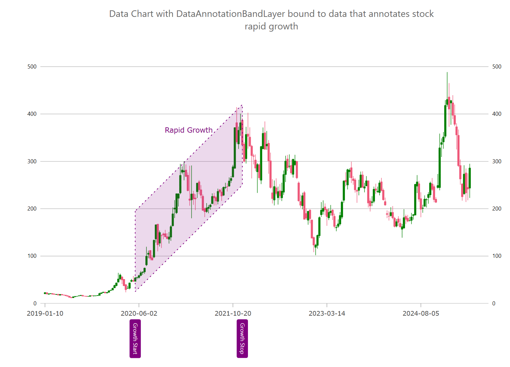

= チャート データ注釈バンド レイヤー (ベータ版)

{ProductName} では、link:{DataChartLink}.DataAnnotationBandLayer.html[DataAnnotationBandLayer] は、1 ～ 6 軸の注釈が付いた自由形式の平行四辺形です。これは多くの構成プロパティを提供し、link:{DataChartLink}.{DataChartName}.html[{DataChartName}] コンポーネントの財務シリーズで一般的に使用されます。

{ProductName} では、link:{DataChartLink}.DataAnnotationBandLayer.html[DataAnnotationBandLayer] は、link:{DataChartLink}.{DataChartName}.html[{DataChartName}] コンポーネントのプロット領域内の 2 つのポイント間に複数の傾斜した四角形を描画します。このデータ注釈レイヤーは、株価の上昇と下落の範囲を注釈するために使用できます。すべてのシリーズと同様に、DataAnnotationBandLayer も {ApiDataSource} プロパティによるデータ バインディングをサポートしています。このプロパティには、線の開始ポイントと終了ポイントの x/y 座標を表す、少なくとも 4 つの数値データ列を持つデータ項目のコレクションを設定します。開始ポイントは link:{DataChartLink}.dataannotationpointlayer{ApiProp}StartValueXMemberPath.html[StartValueXMemberPath] および link:{DataChartLink}.dataannotationpointlayer{ApiProp}StartValueYMemberPath.html[StartValueYMemberPath] プロパティを使用してマップする必要があり、終了ポイントは link:{DataChartLink}.dataannotationpointlayer{ApiProp}EndValueXMemberPath.html[EndValueXMemberPath] および link:{DataChartLink}.dataannotationpointlayer{ApiProp}EndValueYMemberPath.html[EndValueYMemberPath] プロパティを使用してマップする必要があります。

.注:
[NOTE]
====
これらの機能はデカルト軸をサポートするように設計されており、現在は半径または角度の軸には対応していません。
====

たとえば、DataAnnotationBandLayer を使用して株価の成長範囲に注釈を付けることができます。

 
== バンド注釈の描画

次のコード スニペットは、上の図に示すように、link:{DataChartLink}.DataAnnotationBandLayer.html[DataAnnotationBandLayer] を描画する方法を示しています。また、この例では、プロット内にカスタム オーバーレイ テキストを描画する方法を示します。詳細については、link:datachart-annotation-overlays.html[チャート オーバーレイ テキスト] トピックを参照してください。

ifdef::wpf[]

*XAML の場合*:

[source, xaml]
----
<ig:DataAnnotationBandLayer/>
----

endif::wpf[]

ifdef::wpf,win-forms[]

*C# の場合*:

[source, cs]
----
var xAxisBottom = new CategoryXAxis
{
    Label = "Index",
    DataSource = data,
    TickLength = 0,
    LabelLocation = AxisLabelsLocation.OutsideBottom,
    LabelFontSize = 12,
    LabelMargin = new Padding(0, 15, 0, 5),
    LabelExtent = 120,
    LabelAngle = 90,
    LabelTextColor = Color.Transparent,
};
chart.Axes.Add(xAxisBottom);

chart.Series.Add(CreateStockRapidGrowth(xAxisBottom));

public static Series CreateStockRapidGrowth(Axis targetAxis)
{
    var annoLayer = new DataAnnotationBandLayer();
    annoLayer.StartValueXMemberPath = "StartX";
    annoLayer.StartValueYMemberPath = "StartY";
    annoLayer.EndValueXMemberPath = "EndX";
    annoLayer.EndValueYMemberPath = "EndY";
    annoLayer.AnnotationBreadthMemberPath = "Value";
    annoLayer.TargetAxis = targetAxis;
    annoLayer.DataSource = new List<Annotation>
    {
        new Annotation() {
            StartLabel = "Growth Start",
            EndLabel = "Growth Stop",
            StartX = 48, StartY = 110,
            EndX = 105, EndY = 335,
            Value = 170,
            Label = "Rapid Growth" },
    };
    
    // setting optional annotation properties
    annoLayer.Brush = Brushes.Purple;
    annoLayer.Outline = Brushes.Purple;
    annoLayer.StartLabelXMemberPath = "StartLabel";
    annoLayer.StartLabelXDisplayMode = DataAnnotationDisplayMode.DataLabel;
    annoLayer.EndLabelXMemberPath = "EndLabel";
    annoLayer.EndLabelXDisplayMode = DataAnnotationDisplayMode.DataLabel;
    annoLayer.CenterLabelXDisplayMode = DataAnnotationDisplayMode.Hidden;

    // setting optional overlay text properties
    annoLayer.OverlayTextColor = Brushes.Purple;
    annoLayer.OverlayTextVerticalMargin = 20;
    annoLayer.OverlayTextHorizontalMargin = -50;
    annoLayer.OverlayTextLocation = OverlayTextLocation.InsideTopCenter;
    annoLayer.OverlayTextMemberPath = "Label";
    return annoLayer;
}

----

endif::wpf,win-forms[]

== バンド注釈のスタイル設定

次のコード例は、軸注釈の背景、境界線の色、境界線の太さなどのスタイル プロパティをオーバーレイ テキストのスタイル プロパティとして設定して、link:{DataChartLink}.DataAnnotationBandLayer.html[DataAnnotationBandLayer] をカスタマイズする方法を示しています。

ifdef::wpf,win-forms[]

*C# の場合*:

[source, cs]
----
chart.Series.Add(StylingDataAnnotationBandLayer(xAxisBottom)); 

public Series StylingDataAnnotationBandLayer(Axis targetAxis)
{
    var annoLayer = new DataAnnotationBandLayer();
    // NOTE see setup properties in the first examples

    // styling the starting point of annotation 
    annoLayer.StartLabelDisplayMode = DataAnnotationDisplayMode.AxisValue;
    annoLayer.StartLabelTextColor = Brushes.White;
    annoLayer.StartLabelBackground = Brushes.Orange;
    annoLayer.StartLabelBorderColor = Brushes.Black;
    annoLayer.StartLabelBorderThickness = 1;
    annoLayer.StartLabelBorderRadius = 4;
    annoLayer.StartLabelPadding = new Thickness(4);
    
    // styling the ending point of annotation 
    annoLayer.EndLabelDisplayMode = DataAnnotationDisplayMode.AxisValue;
    annoLayer.EndLabelTextColor = Brushes.White;
    annoLayer.EndLabelBackground = Brushes.Red;
    annoLayer.EndLabelBorderColor = Brushes.Black;
    annoLayer.EndLabelBorderThickness = 1;
    annoLayer.EndLabelBorderRadius = 4;
    annoLayer.EndLabelPadding = new Thickness(4);

    // styling optional label at center of annotations 
    annoLayer.CenterLabelDisplayMode = DataAnnotationDisplayMode.AxisValue;
    annoLayer.CenterTextColor = Brushes.White;
    annoLayer.CenterBackground = Brushes.Green;
    annoLayer.CenterBorderColor = Brushes.Black;
    annoLayer.CenterBorderThickness = 1;
    annoLayer.CenterBorderRadius = 4;
    annoLayer.CenterPadding = new Thickness(4);

    // styling optional overlay text 
    annoLayer.OverlayTextColor = Brushes.White;
    annoLayer.OverlayTextBackground = Brushes.Green;
    annoLayer.OverlayTextBorderColor = Brushes.Black;
    annoLayer.OverlayTextBorderThickness = 1;
    annoLayer.OverlayTextBorderRadius = 4;
    annoLayer.OverlayTextHorizontalMargin = 5;
    annoLayer.OverlayTextHorizontalPadding = 2;
    annoLayer.OverlayTextVerticalMargin = 5;
    annoLayer.OverlayTextVerticalPadding = 2;
    return annoLayer;
}

----

endif::wpf,win-forms[]

== API リファレンス

次の表は、link:{DataChartLink}.DataAnnotationBandLayer.html[DataAnnotationBandLayer] の最も重要なプロパティとその説明を示しています。

[options="header", cols="a,a,a"]
|====
|プロパティ名|プロパティ タイプ|説明

| link:{DataChartLink}.dataannotationaxislayer{ApiProp}targetaxis.html[TargetAxis]
|`Axis`
|このプロパティは、どの軸に有効な釈レイヤーを設定するかを指定します。

| link:{DataChartLink}.series{ApiProp}{ApiDataSource}.html[{ApiDataSource}]
|`IEnumerable`
|このプロパティは、データを注釈レイヤーにバインドして正確な形状を提供します。

| link:{DataChartLink}.dataannotationpointlayer{ApiProp}StartValueXMemberPath.html[StartValueXMemberPath]
|`string`
|このプロパティは、注釈の開始位置となる x 座標を含むデータ列の列名にマッピングします。

| link:{DataChartLink}.dataannotationpointlayer{ApiProp}StartValueYMemberPath.html[StartValueYMemberPath]
|`string`
|このプロパティは、注釈の開始位置となる y 座標を含むデータ列の列名にマッピングします。

| link:{DataChartLink}.dataannotationpointlayer{ApiProp}EndValueXMemberPath.html[EndValueXMemberPath]
|`string`
|このプロパティは、注釈の終了位置となる x 座標を含むデータ列にマッピングします。

| link:{DataChartLink}.dataannotationpointlayer{ApiProp}EndValueYMemberPath.html[EndValueYMemberPath]
|`string`
|このプロパティは、注釈の終了位置となる y 座標を含むデータ列にマッピングします。

| link:{DataChartLink}.dataannotationpointlayer{ApiProp}StartLabelXMemberPath.html[StartLabelXMemberPath]
|`string`
|このプロパティは、軸に沿った xAxis の開始位置のオーバーレイ ラベルを表すデータ列へのマッピングです。

| link:{DataChartLink}.dataannotationpointlayer{ApiProp}StartLabelYMemberPath.html[StartLabelYMemberPath]
|`string`
|このプロパティは、軸に沿った yAxis の開始位置のオーバーレイ ラベルを表すデータ列へのマッピングです。

| link:{DataChartLink}.dataannotationpointlayer{ApiProp}EndLabelXMemberPath.html[EndLabelXMemberPath]
|`string`
|このプロパティは、軸に沿った xAxis の終了位置のオーバーレイ ラベルを表すデータ列へのマッピングです。

| link:{DataChartLink}.dataannotationpointlayer{ApiProp}EndLabelYMemberPath.html[EndLabelYMemberPath]
|`string`
|このプロパティは、軸に沿った yAxis の終了位置のオーバーレイ ラベルを表すデータ列へのマッピングです。

| link:{DataChartLink}.dataannotationpointlayer{ApiProp}StartLabelXDisplayMode.html[StartLabelXDisplayMode StartLabelYDisplayMode EndLabelXDisplayMode EndLabelYDisplayMode CenterLabelXDisplayMode]
|`DataAnnotationDisplayMode`
|設定可能で、xAxis または yAxis に沿って表示される開始、終了、または中央のラベルのテキストを管理します。例: 'DataLabel' の場合、ラベルは LabelMemberPath を介してマッピングされた値を表示し、'AxisValue' の場合、データ値はシリーズに沿った特定のポイントから表示されます。

| link:{DataChartLink}.dataannotationshapelayer{ApiProp}OverlayTextMemberPath.html[OverlayTextMemberPath]
|`string`
|このプロパティは、注釈の横にオーバーレイ テキストとして表示されるデータ列の名前へのマッピングです。

| link:{DataChartLink}.dataannotationshapelayer{ApiProp}OverlayTextLocation.html[OverlayTextLocation]
|`string`
|このプロパティは、オーバーレイ テキストの配置位置を管理します。

|====

