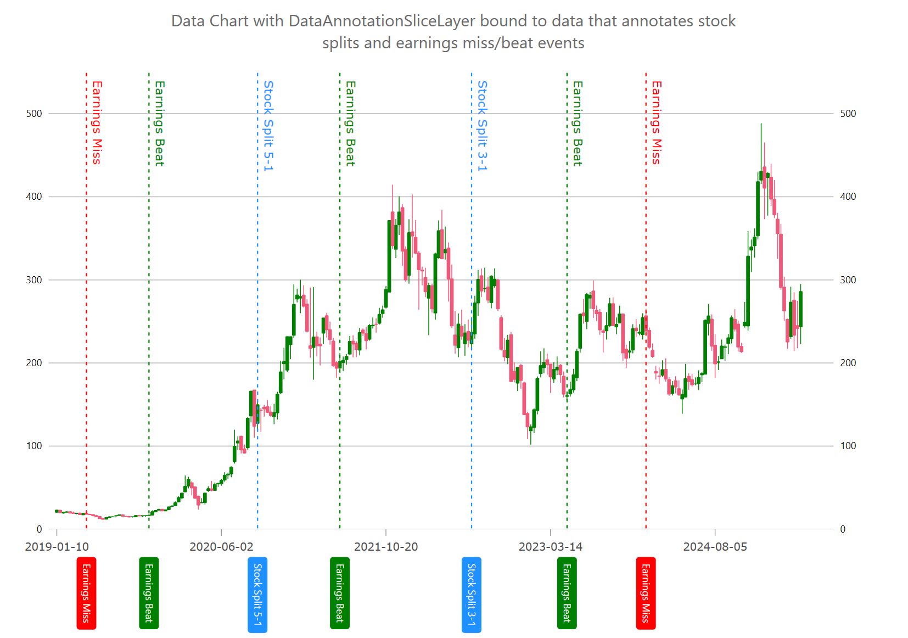

= チャート データ注釈スライス レイヤー (ベータ版)

{ProductName} では、link:{DataChartLink}.DataAnnotationSliceLayer.html[DataAnnotationSliceLayer] は、link:{DataChartLink}.{DataChartName}.html[{DataChartName}] コンポーネントの軸の複数の値でチャートをスライスする複数の垂直線または水平線を描画します。このデータ注釈レイヤーは、X 軸上の重要なイベント (例: 企業の四半期決算) または Y 軸上の重要な値に注釈を付けるためによく使用されます。TargetAxis プロパティを y 軸に設定すると、データ注釈レイヤーは水平スライスとして描画され、TargetAxis プロパティを x 軸に設定すると、データ注釈レイヤーは垂直スライスとして描画されます。すべてのシリーズと同様に、DataAnnotationSliceLayer も {ApiDataSource} プロパティを介したデータ バインディングをサポートします。このプロパティは、link:{DataChartLink}.dataannotationslicelayer{ApiProp}AnnotationValueMemberPath.html[AnnotationValueMemberPath] プロパティにマッピングされた少なくとも 1 つの数値データ列を持つデータ項目のコレクションに設定できます。

.注:
[NOTE]
====
これらの機能はデカルト軸をサポートするように設計されており、現在は半径または角度の軸には対応していません。
====

たとえば、DataAnnotationSliceLayer を使用して、株式分割や収益報告の結果などの重要なイベントを株価に注釈として付けることができます。

== スライス注釈の描画

次のコード スニペットは、上の図に示すように 3 つのスライス注釈レイヤーを描画する方法を示しています。また、この例では、プロットにカスタム オーバーレイ テキストを描画する方法を示します。詳細については、link:datachart-annotation-overlays.html[チャート オーバーレイ テキスト] トピックを参照してください。

ifdef::wpf[]

*XAML の場合*:

[source, xaml]
----
<ig:DataAnnotationSliceLayer 
AnnotationValueMemberPath="Value" 
AnnotationLabelMemberPath="Label" 
TargetAxis="{Binding ElementName=xAxisBottom}"
{ApiDataSource}="{Binding}"
/>
----

endif::wpf[]

ifdef::wpf,win-forms[]

*C# の場合*:

[source, cs]
----

var xAxisBottom = new CategoryXAxis
{
    Label = "Index",
    DataSource = DataPointsBoundToYourSeries,
    TickLength = 0,
    LabelLocation = AxisLabelsLocation.OutsideBottom,
    LabelFontSize = 12,
    LabelMargin = new Padding(0, 15, 0, 5),
    LabelExtent = 140,
    LabelAngle = 90,
    LabelTextColor = Color.Transparent,
};
chart.Axes.Add(xAxisBottom);

chart.Series.Add(CreateStockSplitAnnotations(xAxisBottom));
chart.Series.Add(CreateStockEarningsMissAnnotations(xAxisBottom));
chart.Series.Add(CreateStockEarningsBeatAnnotations(xAxisBottom));

public Series CreateStockSplitAnnotations(Axis targetAxis)
{
    var annoLayer = new DataAnnotationSliceLayer();
    annoLayer.Brush = Brushes.DodgerBlue;
    annoLayer.OverlayTextHorizontalMargin = 0;
    annoLayer.AnnotationLabelMemberPath = "Label";
    annoLayer.AnnotationValueMemberPath = "Value";
    annoLayer.AnnotationTextColor = Brushes.White;
    annoLayer.TargetAxis = targetAxis;
    annoLayer.DataSource = new List<Annotation>
    {
        new Annotation() { Value = 126, Label = "Stock Split 3-1" },
        new Annotation() { Value = 61, Label = "Stock Split 5-1" },
    };

    // adding optional overlay text
    annoLayer.OverlayTextMemberPath = "Label";
    annoLayer.OverlayTextLocation = OverlayTextLocation.OutsideTopRight;
    annoLayer.OverlayTextLocation = OverlayTextLocation.Hidden;
    annoLayer.OverlayTextAngle = 90;

    return annoLayer;
}

public Series CreateStockEarningsMissAnnotations(Axis targetAxis)
{
    var annoLayer = new DataAnnotationSliceLayer();
    annoLayer.Brush = Brushes.Red;
    annoLayer.AnnotationLabelMemberPath = "Label";
    annoLayer.AnnotationValueMemberPath = "Value";
    annoLayer.AnnotationTextColor = Brushes.White;
    annoLayer.TargetAxis = targetAxis;
    annoLayer.DataSource = new List<Annotation>
    {
        new Annotation() { Value = 9, Label = "Earnings Miss" },
        new Annotation() { Value = 179, Label = "Earnings Miss" },
    };
    
    // adding optional overlay text
    annoLayer.OverlayTextMemberPath = "Label";
    annoLayer.OverlayTextLocation = OverlayTextLocation.OutsideTopRight;
    annoLayer.OverlayTextAngle = 90;
    annoLayer.OverlayTextHorizontalMargin = 0;

    return annoLayer;
}

public Series CreateStockEarningsBeatAnnotations(Axis targetAxis)
{
    var annoLayer = new DataAnnotationSliceLayer();
    annoLayer.Brush = Brushes.Green;
    annoLayer.AnnotationLabelMemberPath = "Label";
    annoLayer.AnnotationValueMemberPath = "Value";
    annoLayer.AnnotationTextColor = Brushes.White;
    annoLayer.TargetAxis = targetAxis;
    annoLayer.DataSource = new List<Annotation>
    {
        new Annotation() { Value = 155, Label = "Earnings Beat" },
        new Annotation() { Value = 86, Label = "Earnings Beat" },
        new Annotation() { Value = 28, Label = "Earnings Beat" },
    };

    // adding optional overlay text
    annoLayer.OverlayTextMemberPath = "Label";
    annoLayer.OverlayTextLocation = OverlayTextLocation.OutsideTopRight;
    annoLayer.OverlayTextAngle = 90;
    annoLayer.OverlayTextHorizontalMargin = 0;
    return annoLayer;
}

----

endif::wpf,win-forms[]

== スライス注釈のスタイル設定

次のコード例は、軸注釈の背景、境界線の色、境界線の太さなどのスタイル プロパティをオーバーレイ テキストのスタイル プロパティとして設定して、link:{DataChartLink}.DataAnnotationSliceLayer.html[DataAnnotationSliceLayer] をカスタマイズする方法を示しています。

ifdef::wpf,win-forms[]

*C# の場合*:

[source, cs]
----
chart.Series.Add(StylingDataAnnotationSliceLayer(xAxisBottom)); 

public Series StylingDataAnnotationSliceLayer(Axis targetAxis)
{
    var annoLayer = new DataAnnotationSliceLayer();
    // NOTE see setup properties in the first examples

    // styling axis annotations 
    annoLayer.AnnotationLabelDisplayMode = DataAnnotationDisplayMode.AxisValue;
    annoLayer.AnnotationTextColor = Brushes.White;
    annoLayer.AnnotationBackground = Brushes.Orange;
    annoLayer.AnnotationBorderColor = Brushes.Black;
    annoLayer.AnnotationBorderThickness = 1;
    annoLayer.AnnotationBorderRadius = 4;
    annoLayer.AnnotationPadding = new Thickness(4);

    // styling optional overlay text 
    annoLayer.OverlayTextColor = Brushes.White;
    annoLayer.OverlayTextBackground = Brushes.Green;
    annoLayer.OverlayTextBorderColor = Brushes.Black;
    annoLayer.OverlayTextBorderThickness = 1;
    annoLayer.OverlayTextBorderRadius = 4;
    annoLayer.OverlayTextHorizontalMargin = 5;
    annoLayer.OverlayTextHorizontalPadding = 2;
    annoLayer.OverlayTextVerticalMargin = 5;
    annoLayer.OverlayTextVerticalPadding = 2;

    return annoLayer;
}

----

endif::wpf,win-forms[]

== API リファレンス

次の表は、link:{DataChartLink}.DataAnnotationSliceLayer.html[DataAnnotationSliceLayer] の最も重要なプロパティとその説明を示しています。
 
[options="header", cols="a,a,a"]
|====
|プロパティ名|プロパティ タイプ|説明

| link:{DataChartLink}.dataannotationaxislayer{ApiProp}targetaxis.html[TargetAxis]
|`Axis`
|このプロパティは、オーバーレイ テキストの配置位置を管理します。

| link:{DataChartLink}.series{ApiProp}{ApiDataSource}.html[{ApiDataSource}]
|`IEnumerable`
|このプロパティは、データを注釈レイヤーにバインドして正確な形状を提供します。

| link:{DataChartLink}.dataannotationslicelayer{ApiProp}AnnotationValueMemberPath.html[AnnotationValueMemberPath]
|`string`
|このプロパティは、注釈を配置するために使用される値を持つデータ列の名前にマッピングされます。

| link:{DataChartLink}.dataannotationaxislayer{ApiProp}AnnotationLabelDisplayMode.html[AnnotationLabelDisplayMode]
|`DataAnnotationDisplayMode`
|軸の注釈に表示されるラベルの表示モードは設定可能です。

| link:{DataChartLink}.dataannotationaxislayer{ApiProp}AnnotationTextColor.html[AnnotationTextColor]
|`object`
|注釈内のテキストの色を管理する設定項目です。

| link:{DataChartLink}.dataannotationaxislayer{ApiProp}AnnotationBackground.html[AnnotationBackground]
|`object`
|軸の注釈の背景に使用される色の設定項目です。

| link:{DataChartLink}.dataannotationaxislayer{ApiProp}AnnotationBorderColor.html[AnnotationBorderColor]
|`object`
|軸注釈の境界線に使用する色の設定項目です。

| link:{DataChartLink}.dataannotationshapelayer{ApiProp}OverlayTextMemberPath.html[OverlayTextMemberPath]
|`string`
|このプロパティは、注釈の横にオーバーレイ テキストとして表示されるデータ列の名前へのマッピングです。

| link:{DataChartLink}.dataannotationshapelayer{ApiProp}OverlayTextLocation.html[OverlayTextLocation]
|`string`
|このプロパティは、オーバーレイ テキストの配置位置を管理します。

|====