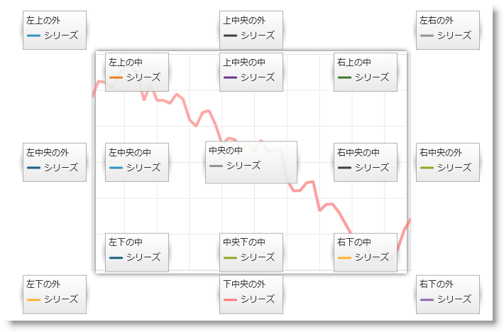
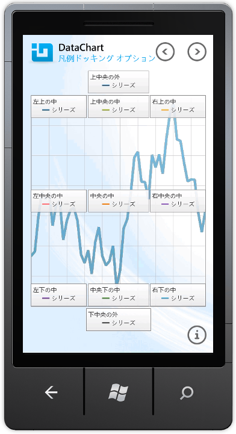

////

|metadata|
{
    "name": "datachart-docking-legends",
    "controlName": ["{DataChartName}"],
    "tags": ["Application Scenarios","Charting","How Do I"],
    "guid": "fb5bd3f3-d0a2-4e0b-8b61-8f80dee12ddf",  
    "buildFlags": ["wpf","win-universal"],
    "createdOn": "2014-06-05T19:39:00.678389Z"
}
|metadata|
////

= 凡例のドッキング

このトピックは、コード例を示して、凡例を link:{DataChartLink}.{DataChartName}.html[{DataChartName}] コントロールにドックする方法を説明します。

== 概要

凡例は、他のユーザー インターフェース (UI) コントロールのように、{DataChartName} コントロールのプロット エリアにドックすることができます。凡例は、まず {DataChartName} と link:{DataChartLink}.legend.html[凡例] コントロールを、 link:{ApiPlatform}datavisualization{ApiVersion}~infragistics.controls.xamdock.html[xamDock] コンテナを使ってラップしてから、それぞれのドッキング プロパティを設定することでドックします。(以下の図 1) あるいは、{DataChartName} や他のコントロールを、StackPanel、Grid などの {PlatformName} ホスト コントロールでラップすることができます。

ifdef::sl,wpf,win-rt[]

endif::sl,wpf,win-rt[]

ifdef::win-phone[]

endif::win-phone[]

図 1: チャート プロット エリアの様々なロケーションに凡例コントロールがドックされた {DataChartName} コントロール

== ドッキング プロパティ

テーブル 1 は、凡例オブジェクトを {DataChartName} コントロールにドッキングするために利用可能なプロパティを説明しています。

テーブル 1: xamDock コントロールの子コントロールをドッキングするためのプロパティ

[options="header", cols="a,a,a,a"]
|====
|プロパティ名|タイプ|説明|デフォルト値

|xamDock.Edge
| link:{ApiPlatform}datavisualization{ApiVersion}~infragistics.controls.dockedge.html[DockEdge]
|xamDock コンテナの子コントロールのドックの端を決定します。使用可能な値は以下のとおりです。 

* Central 

* InsideBottom 

* InsideLeft 

* InsideRight 

* InsideTop 

* OutsideBottom 

* OutsideLeft 

* OutsideRight 

* OutsideTop 

|InsideTop

|xamDock.VerticalDockAlignment
|VerticalAlignment
|xamDock コンテナの子コントロールの垂直ドックのアラインメントを決定します。使用可能な値は以下のとおりです。 

* 上 

* 中央 

* 下 

* 引き伸ばし 

|Top

|xamDock.HorizontalDockAlignment
|HorizontalAlignment
|xamDock コンテナの子コントロールの水平ドックのアラインメントを決定します。使用可能な値は以下のとおりです。 

* 左 

* 中央 

* 右 

* 引き伸ばし 

|Left

|====

== コード例

以下の例は、チャート プロット エリアに対する凡例のすべての可能なドッキング ロケーションを提供します。ただし、提供される凡例オブジェクトは1度に 1 つのみ使うことができ、また {DataChartName} コントロールの凡例プロパティとバインドすることができます。1 シリーズにつき複数の凡例を表示する場合、{DataChartName} コントロールではなく、シリーズ オブジェクトの凡例プロパティにその凡例をバインドする必要があります。詳細は、複数の凡例のトピックを参照してください。pick:[win-phone="Windows® Phone のチャートの視覚空間のカスタマイズ方法の情報については、 link:datachart-chart-orientation-and-layout.html[チャートの向きとレイアウト] のトピックを参照してください。"]

[NOTE]
====
*注:* この例は、xamDock と {DataChartName} コントロールにアプリケーションを設定して、データ コンテキストをチャートにバインドする方法をユーザーが理解していることを前提としています。これについての詳細は、 link:datachart-getting-started-with-datachart.html[データ チャートを使用した作業の開始] のトピックを参照してください。
====

ifdef::wpf[]

*XAML の場合:*

----
xmlns:ig="http://schemas.infragistics.com/xaml"
----

endif::wpf[]

ifdef::wpf,win-universal[]

*XAML の場合:*

ifdef::wpf[]
----
<ig:XamDock x:Name="dockContainer" >
    <ig:{DataChartName} x:Name="dataChart" 
                     ig:XamDock.Edge="Central" 
                     Legend="{Binding ElementName=LegendOTL}" >
    </ig:{DataChartName}>
    <ig:Legend x:Name="LegendOTC" Content="OutsideTopCenter" 
                ig:XamDock.Edge="OutsideTop"  
                ig:XamDock.HorizontalDockAlignment="Center"  >
    </ig:Legend>
    <!-- 注: 凡例の他のドッキングオプションがあります -->
    <ig:Legend x:Name="LegendOTL" Content="OutsideTopLeft" 
                ig:XamDock.Edge="OutsideTop" 
                ig:XamDock.VerticalDockAlignment="Top" 
                ig:XamDock.HorizontalDockAlignment="Left"  >    
    </ig:Legend>
    <ig:Legend x:Name="LegendOTR" Content="OutsideTopRight" 
                ig:XamDock.Edge="OutsideTop" 
                ig:XamDock.VerticalDockAlignment="Top" 
                ig:XamDock.HorizontalDockAlignment="Right"  >    
    </ig:Legend>
    <ig:Legend x:Name="LegendOLC" Content="OutsideMiddleLeft" 
                ig:XamDock.Edge="OutsideLeft" 
                ig:XamDock.VerticalDockAlignment="Center" 
                ig:XamDock.HorizontalDockAlignment="Center"  >
    </ig:Legend>
    <ig:Legend x:Name="LegendORC" Content="OutsideMiddleRight" 
                ig:XamDock.Edge="OutsideRight" 
                ig:XamDock.VerticalDockAlignment="Center" 
                ig:XamDock.HorizontalDockAlignment="Center" >
    </ig:Legend>
    <ig:Legend x:Name="LegendOBL" Content="OutsideBottomLeft" 
                ig:XamDock.Edge="OutsideBottom" 
                ig:XamDock.VerticalDockAlignment="Center" 
                ig:XamDock.HorizontalDockAlignment="Left"   >
    </ig:Legend>
    <ig:Legend x:Name="LegendOBR" Content="OutsideBottomRight" 
                ig:XamDock.Edge="OutsideBottom" 
                ig:XamDock.VerticalDockAlignment="Center" 
                ig:XamDock.HorizontalDockAlignment="Right"    >
    </ig:Legend>
     <ig:Legend x:Name="LegendOBC" Content="OutsideBottomCenter" 
                ig:XamDock.Edge="OutsideBottom" 
                ig:XamDock.VerticalDockAlignment="Center" 
                ig:XamDock.HorizontalDockAlignment="Center" >
    </ig:Legend>
    <ig:Legend x:Name="LegendITC" Content="InsideTopLeft"  
                ig:XamDock.Edge="InsideTop" 
                ig:XamDock.VerticalDockAlignment="Top" 
                ig:XamDock.HorizontalDockAlignment="Left"  >
    </ig:Legend>
    <ig:Legend x:Name="LegendITL" Content="InsideTopCenter"  
                ig:XamDock.Edge="InsideTop" 
                ig:XamDock.VerticalDockAlignment="Top" 
                ig:XamDock.HorizontalDockAlignment="Center" >
    </ig:Legend>
    <ig:Legend x:Name="LegendITR" Content="InsideTopRight"   
                ig:XamDock.Edge="InsideTop" 
                ig:XamDock.VerticalDockAlignment="Top" 
                ig:XamDock.HorizontalDockAlignment="Right" >
    </ig:Legend>
    <ig:Legend x:Name="LegendIC" Content="InsideCenter"  
                ig:XamDock.Edge="Central" 
                ig:XamDock.VerticalDockAlignment="Center" 
                ig:XamDock.HorizontalDockAlignment="Center" >
    </ig:Legend>
    <ig:Legend x:Name="LegendILC" Content="InsideCenterLeft"  
                ig:XamDock.Edge="InsideLeft" 
                ig:XamDock.VerticalDockAlignment="Center" 
                ig:XamDock.HorizontalDockAlignment="Center" >
    </ig:Legend>
    <ig:Legend x:Name="LegendIRC" Content="InsideCenterRight" 
                ig:XamDock.Edge="InsideRight" 
                ig:XamDock.VerticalDockAlignment="Center" 
                ig:XamDock.HorizontalDockAlignment="Center">
    </ig:Legend>
    <ig:Legend x:Name="LegendIBC" Content="InsideBottomLeft"   
                ig:XamDock.Edge="InsideBottom" 
                ig:XamDock.VerticalDockAlignment="Top" 
                ig:XamDock.HorizontalDockAlignment="Left" >
    </ig:Legend>
    <ig:Legend x:Name="LegendIBL" Content="InsideBottomCenter"  
                ig:XamDock.Edge="InsideBottom" 
                ig:XamDock.VerticalDockAlignment="Top" 
                ig:XamDock.HorizontalDockAlignment="Center" >
    </ig:Legend>
    <ig:Legend x:Name="LegendIBR" Content="InsideBottomRight"   
                ig:XamDock.Edge="InsideBottom" 
                ig:XamDock.VerticalDockAlignment="Top" 
                ig:XamDock.HorizontalDockAlignment="Right" >
    </ig:Legend>
</ig:XamDock>
----
endif::wpf[]

endif::wpf,win-universal[]

== 関連コンテンツ

* link:datachart-common-legend.html[共通凡例の追加]
* link:datachart-multiple-legends.html[複数凡例の追加]