////

|metadata|
{
    "name": "datachart-financial-indicators-overview",
    "controlName": ["{DataChartName}"],
    "tags": ["Charting","How Do I"],
    "guid": "65e70f8b-2dd7-429c-acfc-bef3e1a0220e",  
    "buildFlags": [],
    "createdOn": "2014-06-05T19:39:00.4613012Z"
}
|metadata|
////

= 財務指標

=== 目的

このトピックは、財務インジケーターの概要と link:{DataChartLink}.{DataChartName}.html[{DataChartName}] で作成する方法について説明します。

=== 前提条件

本トピックの理解を深めるために、以下のトピックを参照することをお勧めします。

[options="header", cols="a,a"]
|====
|トピック|目的

| link:datachart-datachart.html[{DataChartName}]
|このトピックでは、 _{DataChartName}_ コントロールの概要を説明します。

| link:datachart-getting-started-with-datachart.html[データ チャートを使用した作業の開始]
|このトピックでは、{DataChartName} コントロールを使用して作業を開始する方法に関する情報を提供します。

| link:datachart-series-requirements.html[シリーズ要件]
|このトピックでは、{DataChartName} コントロールで利用可能な散布シリーズに関する情報を提供します。

|====

=== このトピックの内容

このトピックは、以下のセクションで構成されます。

* <<_Introduction,概要>>
* <<_DataMapping,データ マッピング>>
* <<_FinancialIndicators,インジケーターのタイプ>>
* <<_CodeExample,コード例>>
* <<_RelatedContent,関連コンテンツ>>

[[_Introduction]]
== 概要

財務指標は、株価の動きの計測やトレンドを確認するためにトレーダーによって使用されます。これらのインジケーターは、同じ Y 軸を共有しないため通常link:datachart-series-financial-price-series-overview.html[財務物価シリーズ]の上または下に表示されます。対照的にlink:datachart-financial-overlays-overview.html[財務オーバーレイ]は `FinancialPriceSeries` で同じ Y 軸を共有できます。その結果、財務オーバーレイは通常 `FinancialPriceSeries` の前にプロットされます。ただし、チャート コントロールは同じプロット領域でオーバーレイとインジケーターをサポートします。複数軸の使用や軸を共有することもできます。詳細については、link:datachart-multiple-axes.html[複数軸の使用]およびlink:datachart-multiple-series.html[複数シリーズの追加]トピックを参照してください。

財務オーバーレイおよび財務指標の詳細については、以下のオンライン リソースを参照してください。

[[_DataMapping]]
== データ マッピング

財務指標は、すべての株価値 (開始値、高値、低値、終値) や株価ボリュームに特定のデータ マッピングが必要です。以下の表は、マッピング データ列のある財務指標のプロパティの一覧です。link:resources-sample-stocks-data.html[サンプル株データ] ソースのファイナンシャル株データの例です。

[options="header", cols="a,a,a"]
|====
|プロパティ名|プロパティ タイプ|データ列

| link:{DataChartLink}.financialseries{ApiProp}openmemberpath.html[OpenMemberPath]
|`string`
|Open

| link:{DataChartLink}.financialseries{ApiProp}closememberpath.html[CloseMemberPath]
|`string`
|Close

| link:{DataChartLink}.financialseries{ApiProp}highmemberpath.html[HighMemberPath]
|`string`
|High

| link:{DataChartLink}.financialseries{ApiProp}lowmemberpath.html[LowMemberPath]
|`string`
|Low

| link:{DataChartLink}.financialseries{ApiProp}volumememberpath.html[VolumeMemberPath]
|`string`
|Volume

|====

[[_FinancialIndicators]]
== 財務指標

{DataChartName} コントロールは 30 タイプ以上の財務指標をサポートします。以下の表はプレビューおよび財務指標の説明です。

*注:* 図は、比較を目的に第 2 Y-Axis を使用した財務物価シリーズとして同じチャートにプロットされるインジケーターを示します。

[cols="a"]
|====
|財務指標のタイプ

| link:{DataChartLink}.absolutevolumeoscillatorindicator.html[AbsoluteVolumeOscillatorIndicator] (AVO) は、2 つの平均出来高測定の差異を使用して計算されます。パーセンテージ ボリューム オシレーターに似ていますが、範囲が -100% から +100% まであります。インジケーターは、ボリューム トレンドの増加または減少を識別するために使用します。ユーザーは分析の期間を選択できます。 

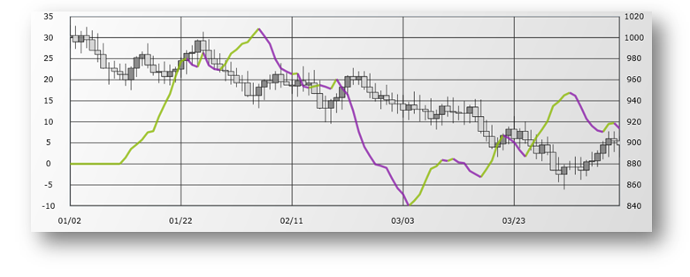

| link:{DataChartLink}.accumulationdistributionindicator.html[AccumulationDistributionIndicator] (ADI) は、一般的によく使用される出来高に関連する指標です。投資家が売買をするかどうかの差異を調べることによって、株式、証券、またはインデックスの時間上の需要と供給を評価します。 

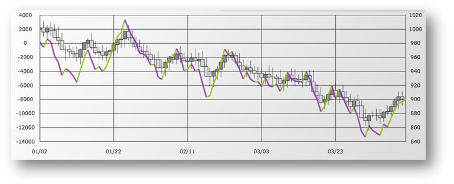

| link:{DataChartLink}.averagedirectionalindexindicator.html[AverageDirectionalIndexIndicator] (ADX) は、トレンドの方向に関係なくトレンドの強さを測定します。このインジケーターは、通常 Minus Directional インジケーター (-DI) と Plus Directional インジケーター (+DI) と一緒に使用され、株トレンドの強さと方向を決定します。 

image::images/xamDataChart_AverageDirectionalIndexIndicator.png[]

| link:{DataChartLink}.averagetruerangeindicator.html[AverageTrueRangeIndicator] (ATR) は、一定期間内に証券の価格移動の程度つまり乱高下を測定する財務指標です。このインジケーターは価格方向や期間ではなく、ただ価格移動の程度、つまり乱高下を測定しています。Average True Range (ATR) は、毎日、毎週、毎月など 14 日間で頻繁に計算されています。Average True Range というのは最近 14 期間の TR 値の指数移動平均のことです。使用される実際の期間は、ユーザー設定によって変わります。 

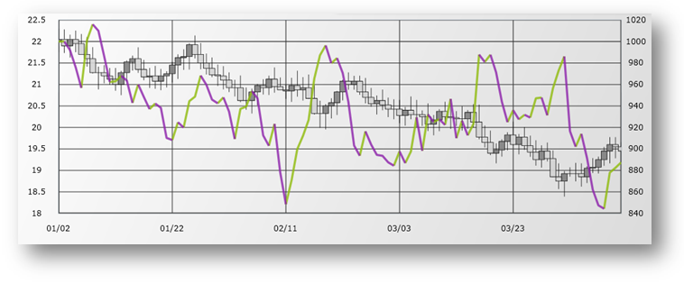

| link:{DataChartLink}.bollingerbandwidthindicator.html[BollingerBandWidthIndicator] (BBW) はボリンジャー バンド オーバーレイで使用されます。ボリンジャー バンド幅インジケーターは、指定したポイントのボリンジャー バンドの幅を表します。変動が大きいほどバンドの幅が大きくなります。帯域幅 (より小さい値) を狭くすると標準偏差の減少を示し、帯域幅 (より大きい値) を広くすると標準偏差の増加を示します。BollingerBandWidthIndicator は、 link:{DataChartLink}.bollingerbandsoverlay.html[BollingerBandsOverlay] のようなスケーリング係数をサポートするので、それらの値は一致させることができます。 

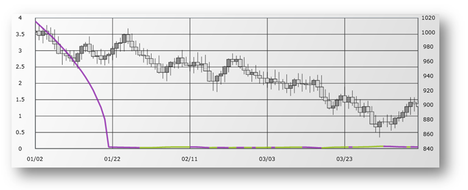

| link:{DataChartLink}.chaikinvolatilityindicator.html[ChaikinVolatilityIndicator] (CHV) は、指定された期間中の高値と安値の差異の指数移動平均の変化割合を表示することによって、証券の乱高下を反映する財務指標です。 

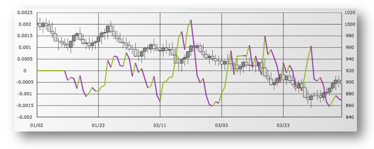

| link:{DataChartLink}.chaikinoscillatorindicator.html[ChaikinOscillatorIndicator] is (COI) は、蓄積/分配インジケーターでトレンドを識別するために使用されます。チャイキン オシレーターは、蓄積/分配インジケーターの 3 日間の指数移動平均 (EMA) から蓄積/分配インジケーターの 10 日間の EMA を引いたものです。 

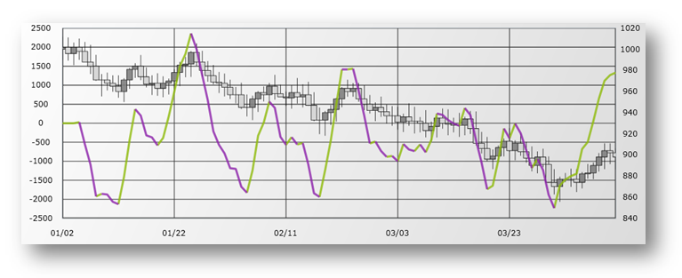

| link:{DataChartLink}.commoditychannelindexindicator.html[CommodityChannelIndexIndicator] (CCI) は、証券の周期トレンドを識別するために使用される財務指標です。このインジケーターは、サイクルで証券価格の変動が識別可能であるという前提に基づきます。これは、以前の期間の Typical Price (TP) と一定期間中の Simple Moving Average of the Typical Price (SMATP) の差異を Constant および Mean Absolute Deviation の積で割り算して計算されます。 

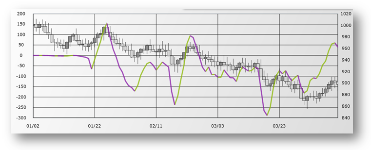

|CommodityChannelIndexIndicator (CCI) は、短期間のトレンドを識別するために、長期間の株価トレンドを制御するために設計された財務指標です。表示されるずらした移動平均に基づいており、モメンタム オシレーターではありません。 

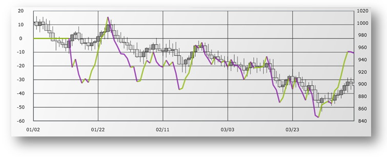

|CommodityChannelIndexIndicator (EOM) は、証券の価格を変更するために必要な出来高を識別するために使用さ。通常は移動平均で滑らかにされます。 

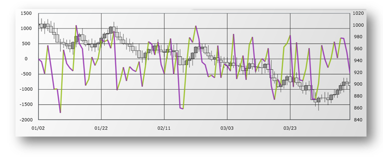

| link:{DataChartLink}.faststochasticoscillatorindicator.html[FastStochasticOscillatorIndicator] (FSO) は、一定期間に高/低範囲に関連する終値を表示するモメンタム財務指標です。 

Stochastic Oscillators には Fast、Slow、Full の 3 つのタイプがあります。Stochastic Oscillator は、0 から 100 の基準を使用した一定期間の高/低範囲に対する現在の終値の関係を示すモメンタム インジケーターです。高騰市場で価格が 100 近くで終了、あるいは下落市場で 0 近くで終了になることを前提にしています。 

ファスト ストキャスティクス オシレーター インジケーターは、買いまたは売りの差異の識別に使用されます。スロー ストキャスティクス オシレーターは 3 日の SMA を使用し、フル ストキャスティクス オシレーターは期間のカスタマイズを伴ったスロー ストキャスティクス オシレーターです。 

image::images/xamDataChart_FastStochasticOscillatorIndicator.png[]

| link:{DataChartLink}.forceindexindicator.html[ForceIndexIndicator] (FII) は、株の動向が上昇または下降のいずれかであるかを判断するために財務アナリストが使用する値と出来高のオシレーターです。勢力指数は、今日の終値から前日の終値を差し引き、今日の出来高との違いを掛けて計算されます。終値が前日よりも今日の方が低い場合、勢力指数は負になります。終値が昨日よりも今日が低い場合、強制は負になります。 

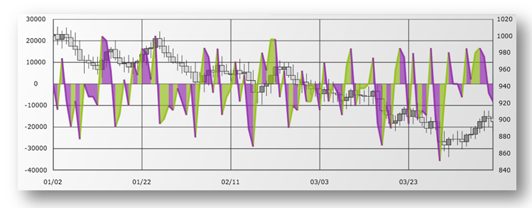

| link:{DataChartLink}.fullstochasticoscillatorindicator.html[FastStochasticOscillatorIndicator] (FSO) は、一定期間に高/低範囲に関連する終値を表示するモメンタム財務指標です。Stochastic Oscillators には Fast、Slow、Full の 3 つのタイプがあります。Stochastic Oscillator は、0 から 100 の基準を使用した一定期間の高/低範囲に対する現在の終値の関係を示すモメンタム インジケーターです。高騰市場で価格が 100 近くで終了、あるいは下落市場で 0 近くで終了になることを前提にしています。 

ファスト ストキャスティクス オシレーター インジケーターは、買いまたは売りの差異の識別に使用されます。スロー ストキャスティクス オシレーターは 3 日の SMA を使用し、フル ストキャスティクス オシレーターは期間のカスタマイズを伴ったスロー ストキャスティクス オシレーターです。 

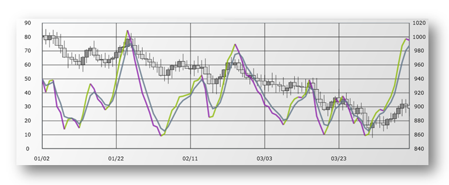

| link:{DataChartLink}.marketfacilitationindexindicator.html[MarketFacilitationIndexIndicator] (MFI) は、効率的に計測するために分析で株価と出来高を組み合わせます。安値と高値の差異を取得して計算し、それを出来高で割ります。 

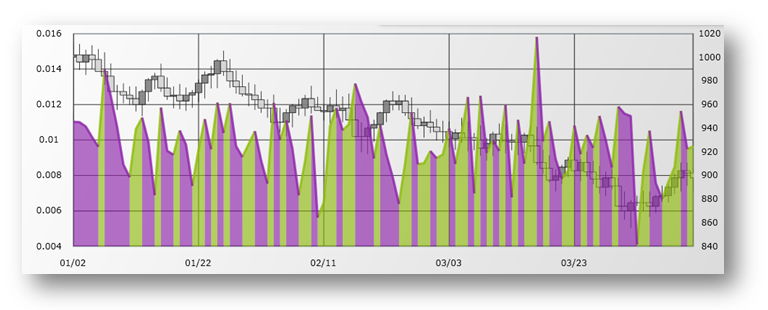

| link:{DataChartLink}.massindexindicator.html[MassIndexIndicator] (MII) は、トレンド反転を検出するために使用される財務指標です。価格帯が広くなると反落が発生するという前提に基づいています。この計算は、前の取引範囲と比較します (高値から低値を引く)。EMA はその目的に使用されます。大きな動きがある場合はマス インデックス インジケーターが増加し、小さい動きがある場合はマス インデックス インジケーターは減少します。 

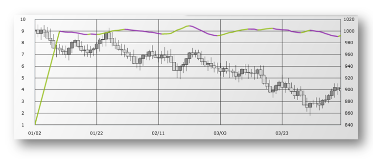

| link:{DataChartLink}.medianpriceindicator.html[MedianPriceIndicator] (MPI) は、高値と安値の間の中間点を表します。中間値は代表値です。中央値価格インジケーターは、中央値のチャートを表示します。 

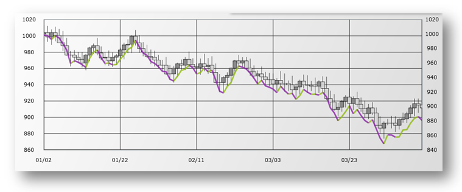

| link:{DataChartLink}.moneyflowindexindicator.html[MoneyFlowIndexIndicator] (MFI) はモメンタム インジケーターで、相対力指数 (RSI) に似ています。MFI は証券のマネー フローのインおよびアウトの基準として使用され、トレンドの反転を予測するために使用できます。MFI の範囲は 0 から 100 で RSI と同様に解釈されます。 

image::images/xamDataChart_MoneyFlowIndexIndicator.png[]

| link:{DataChartLink}.movingaverageconvergencedivergenceindicator.html[MovingAverageConvergenceDivergenceIndicator] (MACD) は、ファイナンシャル サービスで広く使用される指標の１ つです。株価の強さの変化、方向、勢い、トレンドの長さの識別に使用されます。MACD は、終値の 2 つの指数移動平均間の差を取ることにより計算されます。この差異は、差異の移動平均でチャート化されます。 

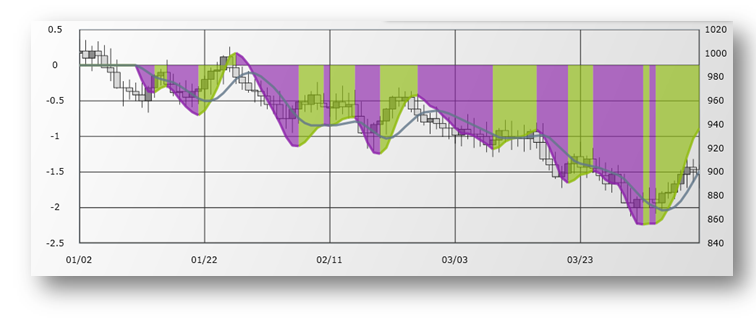

| link:{DataChartLink}.negativevolumeindexindicator.html[NegativeVolumeIndexIndicator] (NVI) は、 link:{DataChartLink}.positivevolumeindexindicator.html[PositiveVolumeIndexIndicator]とよく併用されます。この計算はビルド マーカーを識別するために使用できます。これらの 2 つのインジケーターは、賢明な投資家は小商いの日に取引し情報の少ない非常に楽観的な投資家は大商いの日に取引をするという前提に基づいています。 

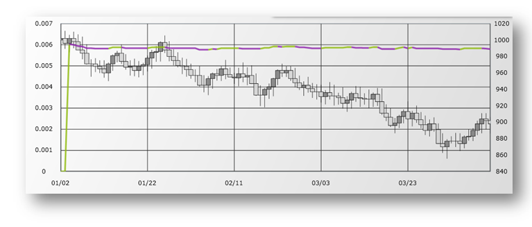

| link:{DataChartLink}.onbalancevolumeindicator.html[OnBalanceVolumeIndicator] (OBV) は、株式の売買出来高の総計を計算し、この出来高が指定された株式のフローイン (買い) であるのか、それともフローアウト (売り)であるのかを表示します。その日のすべての出来高は、価格が前の日よりも高いか低いかに基づいて正の値または負の値が与えられます。より高い終値は正の値になり、より安い終値は負の値になります。これらの値は総合計に加算されます。 

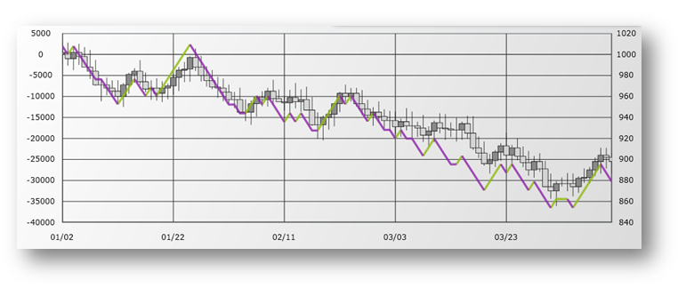

| link:{DataChartLink}.percentagepriceoscillatorindicator.html[PercentagePriceOscillatorIndicator] (PPO) は、2 つの移動平均の差を表します。違いは、より大きな移動平均のパーセンテージで表されます。エンドユーザーは分析の期間を選択します。 

image::images/xamDataChart_PercentagePriceOscillatorIndicator.png[]

| link:{DataChartLink}.percentagevolumeoscillatorindicator.html[PercentageVolumeOscillatorIndicator] (PVO) は、長期および短期で平滑化された出来高のパーセンテージ差異です。PVO インジケーターはゼロの周りをホバーします。ユーザーは、分析にさまざまな期間を選択できます。このインジケーターは、グラフィックスが表示される際に出来高のパターンを検出するのに便利です。PVO の増加は出来高レベルが増加することを示し、PVO の減少は出来高レベルの減少を示します。 

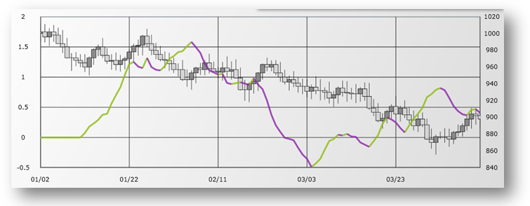

| link:{DataChartLink}.positivevolumeindexindicator.html[PositiveVolumeIndexIndicator] (PVI) は、Negative Volume Index と併用され、上げ相場を識別するために使用できます。これらの 2 つのインジケーターは、賢明な投資家は小商いの日に取引し情報の少ない非常に楽観的な投資家は大商いの日に取引をするという前提に基づいています。 

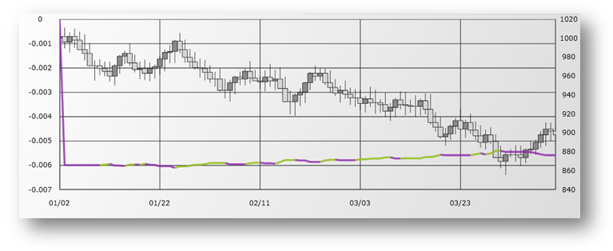

| link:{DataChartLink}.pricevolumetrendindicator.html[PriceVolumeTrendIndicator] (PVT) は、日々の出来高の部分を追加または減算することによってマネーフローの評価に使用されるインジケーターに基づいたモメンタムです。追加または減算された値は、前日の終値と比較した現在の日の価格の上昇または降下の量に基づきます。このインジケーターは、差が取引シグナルとなる主にトレンドとスポットの確認に使用されます。 

image::images/xamDataChart_PriceVolumeTrendIndicator.png[]

| link:{DataChartLink}.rateofchangeandmomentumindicator.html[RateOfChangeAndMomentumIndicator] (ROCM) は、1 つの終値と N 日前の終値の差を計算します。モメンタムは、絶対差で通常価格トレンドを参照します。上昇傾向が継続する場合、モメンタムおよび ROC インジケーターは正になります。下降傾向が継続する場合、モメンタムおよび ROC インジケーターは負になります。 

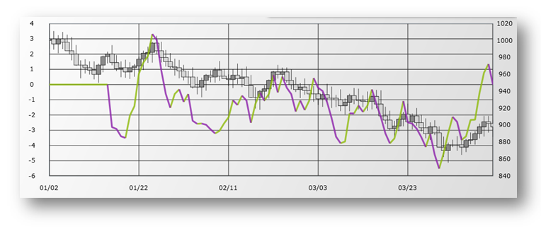

| link:{DataChartLink}.relativestrengthindexindicator.html[RelativeStrengthIndexIndicator] (RSI) は、指定された期間中の終値で計算された市場の強弱測定で一般的に使用されます。これは、上げ相場で終値が高く下げ相場で終値が低いという仮定に基づきます。RSI は高い終値の低い終値に対する比率です。範囲は 0 から 100 です。 

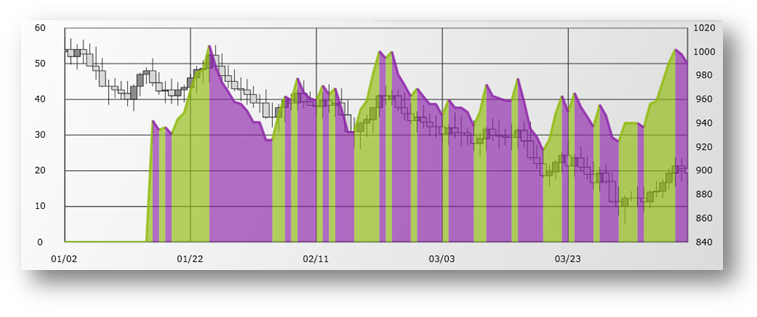

| link:{DataChartLink}.slowstochasticoscillatorindicator.html[SlowStochasticOscillatorIndicator] (SSO) は、一定期間の高/低範囲に関連する終値を表示します。Stochastic Oscillators には Fast、Slow、Full の 3 つのタイプがあります。Stochastic Oscillator は、0 から 100 の基準を使用した一定期間の高/低範囲に対する現在の終値の関係を示すモメンタム インジケーターです。高騰市場で価格が 100 近くで終了、あるいは下落市場で 0 近くで終了になることを前提にしています。 

ファスト ストキャスティクス オシレーター インジケーターは、買いまたは売りの差異の識別に使用されます。スロー ストキャスティクス オシレーターは 3 日の SMA を使用し、フル ストキャスティクス オシレーターは期間のカスタマイズを伴ったスロー ストキャスティクス オシレーターです。 

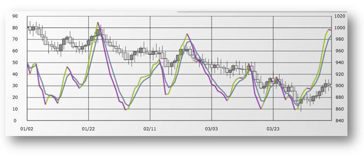

| link:{DataChartLink}.standarddeviationindicator.html[StandardDeviationIndicator] (SDI) は、株価または乱高下の統計的変動を測定します。証券の終値と平均の証券終値間の差は、分散と呼ばれます。より大きな差がより高い標準偏差になり、その結果として乱高下になります。分散が小さくなるほど (個々の終値と平均値の差異)、標準偏差は小さくなり、値の乱高下は小さくなります。 

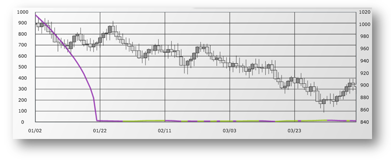

| link:{DataChartLink}.stochrsiindicator.html[StochRSIIndicator] または 相対力指数インジケーター (SRSI) は、指定された期間内で証券が過剰買いまたは過剰売りされた時に測定する財務指標です。値の範囲は 0 から 1 です。StochRSI インジケーターは、ストキャスティクス オシレーター数式を link:{DataChartLink}.relativestrengthindexindicator.html[RelativeStrengthIndexIndicator] (RSI) データに適用して計算されます。 

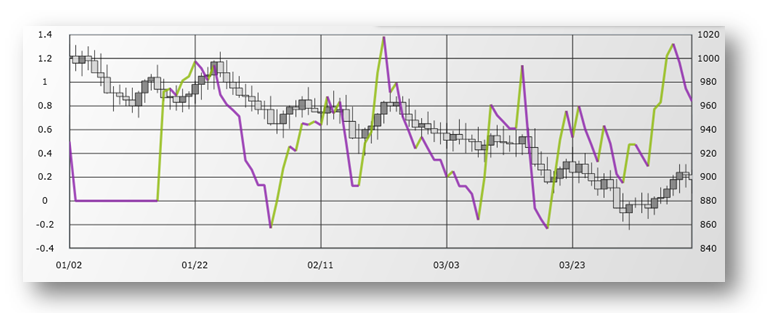

| link:{DataChartLink}.trixindicator.html[TRIXIndicator] (TRIX) は、証券の過剰買いまたは過剰売りを識別するために使用されるモメンタムの方法です。他のオシレーターのように、TRIX は 0 あたりでスコアします。正の値は証券の過剰買いを示し、負の値は過剰売りを示します。TRIX は、一定期間での株価の３ 倍指数の平滑化された移動平均を使用して計算されます。一本線は、証券の価格が今後どのようになるかを示すために頻繁に使用されます。 

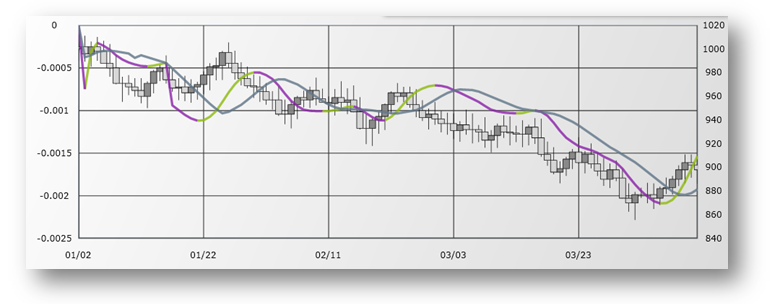

| link:{DataChartLink}.typicalpriceindicator.html[TypicalPriceIndicator] (TPI) は、指定された期間で証券の高値、安値、および終値の算術的な平均を表す一般的な財務指標 (ピボット ポイント) です。 

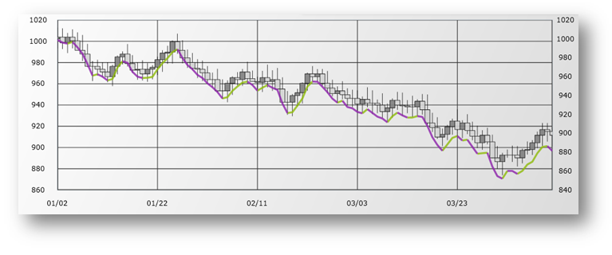

|TypicalPriceIndicator (TPI) は、単一期間に基づく他のインジケーターに関連する乱高下およびノイズを削減するために、3 つの異なる期間の重み付けされた平均を使用する財務指標です。これは、範囲インジケーターのため、スコアは 0 から 100 の間です。 

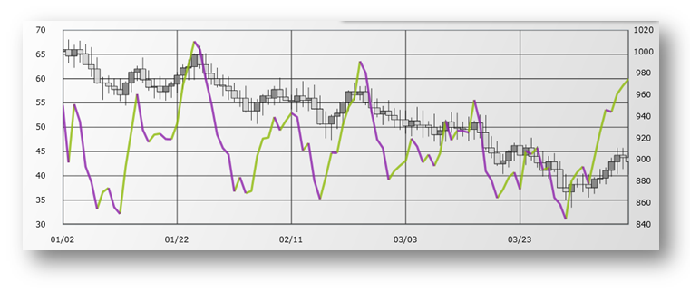

| link:{DataChartLink}.weightedcloseindicator.html[WeightedCloseIndicator] (WCI) は、高値、安値、一日の終値の平均を表す代表価格インジケーターに似ている財務指標です。ただし、重み付きクローズ インジケーターは終値をより重要視し、算術平均を計算する際に 2 回含まれます。 

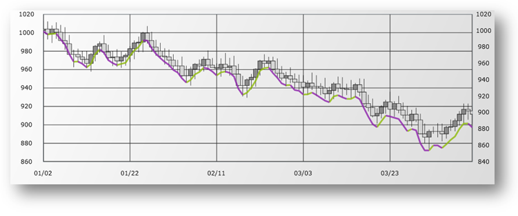

| link:{DataChartLink}.williamspercentrindicator.html[WilliamsPercentRIndicator] (WPRI) は、ストキャスティクス オシレーターに類似しています。ただしスケールの範囲は 0 から -100 です。過剰買いおよび過剰売りを識別するのに便利です。Williams パーセント範囲インジケーターは、期間中の最高値と直近の終値の差異を、期間中の最高値から最安値を引いた値で割り算して計算されます。 

image::images/xamDataChart_WilliamsPercentRIndicator.png[]

|====

[[_CodeExample]]
== コード例

以下のコード スニペットは、`PositiveVolumeIndexIndicator` を link:resources-sample-stocks-data.html[サンプル株価データ] ソースにバインドしてデータ チャート コントロールに追加する方法です。

.注:
[NOTE]
====
同じコードで `PositiveVolumeIndexIndicator` タイプを置き換えて財務指標の他のタイプのインスタンスを作成できます。
====

ifdef::wpf,win-universal[]

*XAML の場合:*
[source,xaml]
----
<ig:{DataChartName} x:Name="DataChart" >
	<ig:{DataChartName}.Resources>
        <local:StockPriceData x:Key="data" />
    </ig:{DataChartName}.Resources>
    <ig:{DataChartName}.Axes>
        <ig:NumericYAxis x:Name="yAxis"  />
        <ig:CategoryXAxis x:Name="xAxis" ItemsSource="{StaticResource data}" Label="{}{Date}" />
    </ig:{DataChartName}.Axes>
    <ig:{DataChartName}.Series>
        <ig:PositiveVolumeIndexIndicator 
                XAxis="{Binding ElementName=xAxis}" 
                YAxis="{Binding ElementName=yAxis}" 
                ItemsSource="{StaticResource data}" 
                OpenMemberPath="Open" 
                CloseMemberPath="Close" 
                HighMemberPath="High" 
                LowMemberPath="Low" 
                VolumeMemberPath="Volume">
        </ig:PositiveVolumeIndexIndicator>
    </ig:{DataChartName}.Series>
</ig:{DataChartName}>
----

endif::wpf,win-universal[]

ifdef::xamarin[]

*XAML の場合:*
[source,xaml]
----
<ig:XamDataChart x:Name="DataChart" >
	<ig:{DataChartName}.Resources>
		<ResourceDictionary>
			<local:StockPriceData x:Key="data" />
		</ResourceDictionary>
    </ig:{DataChartName}.Resources>
    <ig:XamDataChart.Axes>
        <ig:NumericYAxis x:Name="yAxis"  />
        <ig:CategoryXAxis x:Name="xAxis" ItemsSource="{StaticResource data}" Label="Date" />
    </ig:XamDataChart.Axes>
    <ig:XamDataChart.Series>
        <ig:PositiveVolumeIndexIndicator 
                XAxis="{x:Reference xAxis}" 
                YAxis="{x:Reference yAxis}" 
                ItemsSource="{StaticResource data}" 
                OpenMemberPath="Open" 
                CloseMemberPath="Close" 
                HighMemberPath="High" 
                LowMemberPath="Low" 
                VolumeMemberPath="Volume">
        </ig:PositiveVolumeIndexIndicator>
    </ig:XamDataChart.Series>
</ig:XamDataChart>
----

endif::xamarin[]

ifdef::wpf,win-universal,xamarin[]
*C# の場合:*
[source,csharp]
----
var data = new StockPriceData(); 
var yAxis = new NumericYAxis();
var xAxis = new CategoryXAxis();
xAxis.ItemsSource = data;
xAxis.Label = "{Date}";
var series = new PositiveVolumeIndexIndicator();
series.ItemsSource = data;
series.OpenMemberPath = "Open";
series.HighMemberPath = "High";
series.LowMemberPath = "Low";
series.CloseMemberPath = "Close";
series.VolumeMemberPath = "Volume";
series.XAxis = xAxis;
series.YAxis = yAxis;
this.DataChart.Axes.Add(xAxis);
this.DataChart.Axes.Add(yAxis);
this.DataChart.Series.Add(series);
----
endif::wpf,win-universal,xamarin[]

ifdef::win-forms[]
*C# の場合:*
[source,csharp]
----
var data = new StockPriceData(); 
var yAxis = new NumericYAxis();
var xAxis = new CategoryXAxis();
xAxis.DataSource = data;
xAxis.Label = "{Date}";
var series = new PositiveVolumeIndexIndicator();
series.DataSource = data;
series.OpenMemberPath = "Open";
series.HighMemberPath = "High";
series.LowMemberPath = "Low";
series.CloseMemberPath = "Close";
series.VolumeMemberPath = "Volume";
series.XAxis = xAxis;
series.YAxis = yAxis;
this.DataChart.Axes.Add(xAxis);
this.DataChart.Axes.Add(yAxis);
this.DataChart.Series.Add(series);
----
endif::win-forms[]

ifdef::wpf,win-universal[]

*Visual Basic の場合:*

[source,vb]
----
Dim data As New StockPriceData()
Dim yAxis As New NumericYAxis()
Dim xAxis As New CategoryXAxis()
xAxis.ItemsSource = data
xAxis.Label = "Date"
Dim series As New PositiveVolumeIndexIndicator()
series.ItemsSource = data
series.OpenMemberPath = "Open"
series.HighMemberPath = "High"
series.LowMemberPath = "Low"
series.CloseMemberPath = "Close"
series.VolumeMemberPath = "Volume"
series.XAxis = xAxis
series.YAxis = yAxis
Me.DataChart.Axes.Add(xAxis)
Me.DataChart.Axes.Add(yAxis)
Me.DataChart.Series.Add(series)
----
endif::wpf,win-universal[]

ifdef::win-forms[]
*Visual Basic の場合:*
[source,vb]
----
Dim data As New StockPriceData()
Dim yAxis As New NumericYAxis()
Dim xAxis As New CategoryXAxis()
xAxis.DataSource = data
xAxis.Label = "{Date}"
Dim series As New PositiveVolumeIndexIndicator()
series.DataSource = data
series.OpenMemberPath = "Open"
series.HighMemberPath = "High"
series.LowMemberPath = "Low"
series.CloseMemberPath = "Close"
series.VolumeMemberPath = "Volume"
series.XAxis = xAxis
series.YAxis = yAxis
Me.DataChart.Axes.Add(xAxis)
Me.DataChart.Axes.Add(yAxis)
Me.DataChart.Series.Add(series)
----
endif::win-forms[]

ifdef::android[]

*Java の場合:*

[source,js]
----
RelativeLayout rootView = (RelativeLayout) inflater.inflate (R.layout.fragment_main, container, false);
DataChartView chart = new DataChartView(rootView.getContext());
StockPriceData data = new StockPriceData();
NumericYAxis yAxis = new NumericYAxis();
CategoryXAxis xAxis = new CategoryXAxis();
xAxis.setDataSource(data);
xAxis.setLabel("Date");
PositiveVolumeIndexIndicator series = new PositiveVolumeIndexIndicator();
series.setDisplayType(IndicatorDisplayType.AREA);
series.setDataSource(data);
series.setOpenMemberPath("Open");
series.setHighMemberPath("High");
series.setLowMemberPath("Low");
series.setCloseMemberPath("Close");
series.setVolumeMemberPath("Volume");
series.setXAxis(xAxis);
series.setYAxis(yAxis);
chart.addAxis(xAxis);
chart.addAxis(yAxis);
chart.addSeries(series);
----

endif::android[]

[[_RelatedContent]]
== 関連コンテンツ

=== トピック

このトピックの追加情報については、以下のトピックも合わせてご参照ください。

[options="header", cols="a,a"]
|====
|トピック|目的

| link:datachart-datachart.html[{DataChartName}] 

|このトピックでは、 _{DataChartName}_ コントロールの概要を説明します。

| link:datachart-getting-started-with-datachart.html[データ チャートを使用した作業の開始]
|このトピックでは、{DataChartName} コントロールを使用して作業を開始する方法に関する情報を提供します。

| link:datachart-series-requirements.html[シリーズ要件]
|このトピックでは、{DataChartName} コントロールで利用可能な散布シリーズに関する情報を提供します。

|====