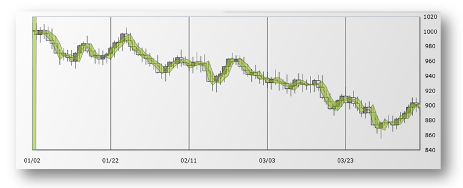
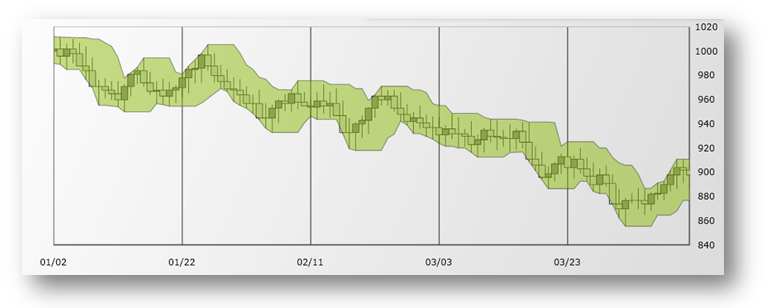

////
|metadata|
{
    "name": "datachart-financial-overlays-overview",
    "controlName": ["{DataChartName}"],
    "tags": ["Charting","How Do I"],
    "guid": "",
    "buildFlags": [],
    "createdOn": "2017-03-05T19:39:00.4613012Z"
}
|metadata|
////

= 財務オーバーレイ
 
=== 目的

このトピックは、財務オーバーレイの概要と link:{DataChartLink}.{DataChartName}.html[{DataChartName}]™ で 作成する方法について説明します。

=== 前提条件

本トピックの理解を深めるために、以下のトピックを参照することをお勧めします。

[options="header", cols="a,a"]
|====
|トピック|目的

| link:datachart-datachart.html[{DataChartName} ]
|このトピックでは、{DataChartName} コントロールの概要を説明します。

| link:datachart-getting-started-with-datachart.html[データ チャートを使用した作業の開始]
|このトピックでは、{DataChartName} コントロールを使用して作業を開始する方法に関する情報を提供します。

| link:datachart-series-requirements.html[シリーズ要件]
|このトピックでは、{DataChartName} コントロールで利用可能な散布シリーズに関する情報を提供します。

|====

=== このトピックの内容

このトピックは、以下のセクションで構成されます。

* <<_Introduction,概要>>
* <<_DataMapping,データ マッピング>>
* <<_OverlaysTypes,オーバーレイ タイプ>>
* <<_CodeExample,コード例>>
* <<_RelatedContent,関連コンテンツ>>

[[_Introduction]]
== 概要

財務オーバーレイは、株価の動きの計測やトレンドを確認するためにトレーダーによって使用されます。これらのオーバーレイは、同じ Y 軸を共有するlink:datachart-series-financial-price-series-overview.html[財務物価シリーズ]の前に通常表示されます。対照的に財務指標は FinancialPriceSeriesで同じ Y 軸を共有できます。その結果、link:datachart-financial-indicators-overview.html[財務指標]は `FinancialPriceSeries` または 財務オーバーレイの下または上に通常プロットされます。ただし、チャート コントロールは同じプロット領域でオーバーレイとインジケーターをサポートします。複数軸の使用や軸を共有することもできます。詳細については、link:datachart-multiple-axes.html[複数軸の使用]およびlink:datachart-multiple-series.html[複数シリーズの追加]トピックを参照してください。

財務オーバーレイおよび財務指標の詳細については、以下のオンライン リソースを参照してください。

* link:http://en.wikipedia.org/wiki/Technical_analysis#Price-based_indicators[テクニカル解析]
* link:http://help.yahoo.com/l/us/yahoo/finance/charts/chart-12.html[テクニカル指標の詳細]

[[_DataMapping]]
== データ マッピング

すべての財務オーバーレイは、すべての株価値 (開始値、高値、低値、終値) や株価ボリュームに特定のデータ マッピングが必要です。以下の表は、マッピング データ列のある財務オーバーレイのプロパティの一覧です。link:resources-sample-stocks-data.html[株価データソース]のファイナンシャル株データの例です。

[options="header", cols="a,a,a"]
|====
|プロパティ名|プロパティ タイプ|データ列

| link:{DataChartLink}.FinancialSeries{ApiProp}OpenMemberPath.html[OpenMemberPath]
|`string`
|Open

| link:{DataChartLink}.FinancialSeries{ApiProp}CloseMemberPath.html[CloseMemberPath]
|`string`
|Close

| link:{DataChartLink}.FinancialSeries{ApiProp}HighMemberPath.html[HighMemberPath]
|`string`
|High

| link:{DataChartLink}.FinancialSeries{ApiProp}LowMemberPath.html[LowMemberPath]
|`string`
|Low

| link:{DataChartLink}.FinancialSeries{ApiProp}VolumeMemberPath.html[VolumeMemberPath]
|`string`
|Volume

|====

[[_OverlaysTypes]]
== 財務オーバーレイのタイプ

{DataChartName} コントロールは 2 タイプ以上の財務オーバーレイをサポートします。以下の表はプレビューおよび財務オーバーレイの説明です。

[cols="a"]
|====
|オーバーレイ タイプ

| link:{DataChartLink}.bollingerbandsoverlay.html[BollingerBandsOverlay] (BBO) は、株価シリーズの上下にプロットする視覚的なバンド セットである財務オーバーレイです。ボリンジャー バンドは、価格の標準偏差に基づきます。そのため価格変動を幅に取り入れます。バンドは標準偏差が増加すると幅が広くなり、標準偏差が減少すると幅が狭くなります。また、バンドは移動平均で平滑化されます。標準偏差およびユーザーが調整可能な平滑化期間は別にして、BollingerBandsOverlay 幅のスケールに影響を及ぼすユーザーが調整可能な乗数もあります。

| link:{DataChartLink}.pricechanneloverlay.html[PriceChannelOverlay] (PCO) は価格乱高下を表示します。株価の経時による変化が 2 つの平行線の間に表示されます。下の線はトレンド ラインで低い価格に描画されます。上の線はチャネル ラインで高値に基づきます。チャネルは任意の期間のトレンド方向を示します。価格チャネルまたはトレンドは、上、下または横が可能です。

|====

[[_CodeExample]]
== コード例

以下のコード スニペットは、`BollingerBandsOverlay` をlink:resources-sample-stocks-data.html[株価データソース]にバインドしてデータ チャート コントロールに追加する方法を示します。 

.注:
[NOTE]
====
同じコードで `BollingerBandsOverlay` タイプを PriceChannelOverlay で置き換えて財務オーバーレイの他のタイプのインスタンスを作成できます。
====

ifdef::wpf,win-universal[]
*XAML の場合:*
[source,xaml]
----
<ig:{DataChartName} x:Name="DataChart" >
    <ig:{DataChartName}.Resources>
        <local:StockPriceData x:Key="data" />
    </ig:{DataChartName}.Resources>
    <ig:{DataChartName}.Axes>
        <ig:NumericYAxis x:Name="yAxis"  />
        <ig:CategoryXAxis x:Name="xAxis" ItemsSource="{StaticResource data}" Label="{}{Date}" />
    </ig:{DataChartName}.Axes>
    <ig:{DataChartName}.Series>
        <ig:BollingerBandsOverlay 
                XAxis="{Binding ElementName=xAxis}" 
                YAxis="{Binding ElementName=yAxis}" 
                ItemsSource="{StaticResource data}" 
                OpenMemberPath="Open" 
                CloseMemberPath="Close" 
                HighMemberPath="High" 
                LowMemberPath="Low" 
                VolumeMemberPath="Volume">
        </ig:BollingerBandsOverlay>
    </ig:{DataChartName}.Series>
</ig:{DataChartName}>
----
endif::wpf,win-universal[]
 
ifdef::xamarin[]
*XAML の場合:*
[source,xaml]
----
<ig:{DataChartName} x:Name="DataChart" >
    <ig:{DataChartName}.Resources>
		<ResourceDictionary>
			<local:StockPriceData x:Key="data" />
		</ResourceDictionary>
    </ig:{DataChartName}.Resources>
    <ig:{DataChartName}.Axes>
        <ig:NumericYAxis x:Name="yAxis"  />
        <ig:CategoryXAxis x:Name="xAxis" ItemsSource="{StaticResource data}" Label="Date" />
    </ig:{DataChartName}.Axes>
    <ig:{DataChartName}.Series>
        <ig:BollingerBandsOverlay 
                XAxis="{x:Reference xAxis}" 
                YAxis="{x:Reference yAxis}" 
                ItemsSource="{StaticResource data}" 
                OpenMemberPath="Open" 
                CloseMemberPath="Close" 
                HighMemberPath="High" 
                LowMemberPath="Low" 
                VolumeMemberPath="Volume">
        </ig:BollingerBandsOverlay>
    </ig:{DataChartName}.Series>
</ig:{DataChartName}>
----
endif::xamarin[]
 

ifdef::wpf,win-universal,xamarin[]
*C# の場合:*
[source,csharp]
----
var data = new StockPriceData(); 
var yAxis = new NumericYAxis();
var xAxis = new CategoryXAxis();
xAxis.ItemsSource = data;
xAxis.Label = "{Date}";
var overlay = new BollingerBandsOverlay();
overlay.ItemsSource = data;
overlay.OpenMemberPath = "Open";
overlay.HighMemberPath = "High";
overlay.LowMemberPath = "Low";
overlay.CloseMemberPath = "Close";
overlay.VolumeMemberPath = "Volume";
overlay.XAxis = xAxis;
overlay.YAxis = yAxis;
this.DataChart.Axes.Add(xAxis);
this.DataChart.Axes.Add(yAxis);
this.DataChart.Series.Add(overlay);
----
endif::wpf,win-universal,xamarin[]

ifdef::win-forms[]
*C# の場合:*
[source,csharp]
----
var data = new StockPriceData(); 
var yAxis = new NumericYAxis();
var xAxis = new CategoryXAxis();
xAxis.DataSource = data;
xAxis.Label = "{Date}";
var overlay = new BollingerBandsOverlay();
overlay.DataSource = data;
overlay.OpenMemberPath = "Open";
overlay.HighMemberPath = "High";
overlay.LowMemberPath = "Low";
overlay.CloseMemberPath = "Close";
overlay.VolumeMemberPath = "Volume";
overlay.XAxis = xAxis;
overlay.YAxis = yAxis;
this.DataChart.Axes.Add(xAxis);
this.DataChart.Axes.Add(yAxis);
this.DataChart.Series.Add(overlay);
----
endif::win-forms[]

ifdef::wpf,win-universal[]
*Visual Basic の場合:*
[source,vb]
----
Dim data As New StockPriceData()
Dim yAxis As New NumericYAxis()
Dim xAxis As New CategoryXAxis() 
xAxis.ItemsSource = data 
xAxis.Label = "Date"
Dim overlay As New BollingerBandsOverlay() 
overlay.ItemsSource = data
overlay.OpenMemberPath = "Open"
overlay.HighMemberPath = "High"
overlay.LowMemberPath = "Low"
overlay.CloseMemberPath = "Close"
overlay.VolumeMemberPath = "Volume"
overlay.XAxis = xAxis
overlay.YAxis = yAxis
Me.DataChart.Axes.Add(xAxis)
Me.DataChart.Axes.Add(yAxis)
Me.DataChart.Series.Add(overlay)
----
endif::wpf,win-universal[]

ifdef::win-forms[]
*Visual Basic の場合:*
[source,vb]
----
Dim data As New StockPriceData()
Dim yAxis As New NumericYAxis()
Dim xAxis As New CategoryXAxis()
xAxis.DataSource = data
xAxis.Label = "{Date}"
Dim overlay As New BollingerBandsOverlay()
overlay.DataSource = data
overlay.OpenMemberPath = "Open"
overlay.HighMemberPath = "High"
overlay.LowMemberPath = "Low"
overlay.CloseMemberPath = "Close"
overlay.VolumeMemberPath = "Volume"
overlay.XAxis = xAxis
overlay.YAxis = yAxis
Me.DataChart.Axes.Add(xAxis)
Me.DataChart.Axes.Add(yAxis)
Me.DataChart.Series.Add(overlay)
----
endif::win-forms[]

[[_RelatedContent]]
== 関連コンテンツ

=== トピック

このトピックに関連する追加情報については、以下のトピックを参照してください。

[options="header", cols="a,a"]
|====
|トピック|目的

| link:datachart-datachart.html[{DataChartName}] 

|このトピックでは、{DataChartName} コントロールの概要を説明します。

| link:datachart-getting-started-with-datachart.html[データ チャートを使用した作業の開始]
|このトピックでは、{DataChartName} コントロールを使用して作業を開始する方法に関する情報を提供します。

| link:datachart-series-requirements.html[シリーズ要件]
|このトピックでは、{DataChartName} コントロールで利用可能な散布シリーズに関する情報を提供します。

|====