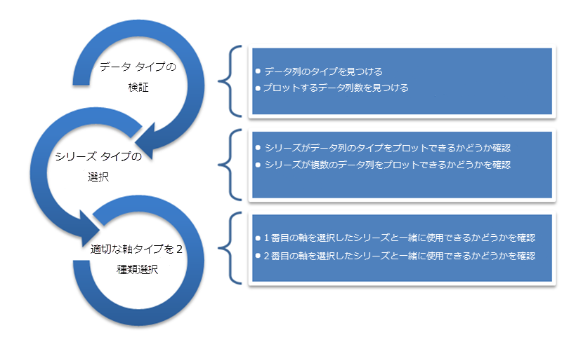

////

|metadata|
{
    "name": "datachart-getting-started-with-datachart",
    "controlName": ["{DataChartName}"],
    "tags": ["Charting","Getting Started"],
    "guid": "5f39946e-59dc-43f0-bd49-91714053bfbb",  
    "buildFlags": [],
    "createdOn": "2014-06-05T19:39:00.7013987Z"
}
|metadata|
////

= データ チャートを使用した作業の開始

== トピックの概要

=== 目的

このトピックでは、 _link:{DataChartLink}.{DataChartName}.html[{DataChartName}]™_   コントロールを使用して作業を開始する方法に関する情報を提供します。

=== 前提条件

本トピックの理解を深めるために、以下のトピックを参照することをお勧めします。

[options="header", cols="a,a"]
|====
|トピック|目的

ifdef::xamarin[]
| link:xamarin-project-with-infragistics-controls.html[Infragistics コントロールでプロジェクトを作成]
|このトピックでは、Ultimate UI for Xamarin コントロールと使用するアプリケーション プロジェクトを作成する方法を説明します。
endif::xamarin[]

| link:datachart-datachart.html[{DataChartName}]
|このトピックでは、 _{DataChartName}_ コントロールの概要を説明します。

|====

=== このトピックの内容

このトピックは、以下のセクションで構成されます。

* <<Ref397366350,チャートの理解>>
* <<Ref397366354,チャートの選択>>
* <<Ref386478106,チャートの作成>>

[[Ref397366350]]

=== チャートの理解

このトピックでは、データをプロットするために必要なチャート コントロールの要素について説明します。

[options="header", cols="a,a"]
|====
|チャートの要素|説明

| link:{DataChartLink}.{DataChartName}.html[{DataChartName}]
|_{DataChartName}_ はシリーズ オブジェクトと呼ばれるさまざまなデータ ビジュアライゼーションのタイプをサポートするコントロールです。チャート コントロールは同じプロット エリアでデータの複数のビジュアライゼーションを含むことが可能です。

| link:{DataChartLink}.series.html[シリーズ]
|シリーズ オブジェクトは実際のデータのビジュアライゼーションを提供します。チャートはさまざまなシリーズのタイプをサポートします。全てのタイプは link:datachart-series-types.html[シリーズ タイプ] トピックにリストされています。各シリーズ タイプは一定のデータ要件を満たすデータ (例えばデータ列の数およびタイプ) およびデータでサポートされる軸のタイプによって、そのデータがプロットできます。各シリーズの要件については、 link:datachart-series-requirements.html[シリーズ要件]トピックを参照してください。

| link:{DataChartLink}.axis.html[軸]
|軸オブジェクトはラベル、数値、目盛り、グリッド線、ストリップやタイトルというデータ タイプについてコンテキストおよび情報を提供します。チャートは、特定のシリーズのタイプで使用できるさまざまなタイプの軸オブジェクトをサポートします。チャート コントロールにサポートされる軸タイプの詳細については、 link:datachart-axes.html[チャート軸] トピックを参照してください。

|====

[[Ref397366354]]

=== チャートの選択

データのタイプによってチャート コントロールで使用するシリーズのタイプを選択します。シリーズのタイプによってはサポートされない軸タイプがあります。したがって、選択済みのシリーズで使用できる有効な軸を選択する必要があります。

以下のフロー チャートは、チャート コントロールにプロットするデータによってシリーズおよび軸を選択する手順を説明します。

[[Ref386478106]]

=== チャートの作成

シリーズのタイプおよび 2 つの有効な軸を選択後、アプリケーションに {DataChartName} コントロールのインスタンスを作成できます。以下のトピックは、さまざまなメソッドを使用してデータ チャート コントロールを作成する方法を説明します。

[options="header", cols="a,a"]
|====
|トピック|目的

ifdef::xaml,android[]
| link:datachart-creating-chart-in-code-behind-xaml.html[コード ビハインドでチャートを作成]
|このトピックでは、コード ビハインドで {DataChartName} コントロールを作成する方法を紹介します。
endif::xaml,android[]

ifdef::xaml[]
| link:datachart-creating-chart-in-xaml-code.html[XAML コードでチャートを作成]
|このトピックでは、XAML コードで {DataChartName} コントロールを作成する方法を紹介します。
endif::xaml[]

ifdef::wpf,win-universal[]
| link:datachart-creating-chart-in-ms-blend-xaml.html[MS Blend でチャートを作成]
|このトピックでは、MS Blend で {DataChartName} コントロールを作成する方法を紹介します。
endif::wpf,win-universal[]

ifdef::win-forms[]
| link:datachart-creating-chart-in-vs-designer-winforms.html[VS デザイナーでチャートを作成]
|このトピックでは、MS Blend で {PlatformIDE} コントロールを作成する方法を紹介します。
endif::win-forms[]

ifdef::win-forms[]
| link:datachart-creating-chart-in-code-behind-winforms.html[コード ビハインドでチャートを作成]
|このトピックでは、コード ビハインドで {DataChartName} コントロールを作成する方法を紹介します。
endif::win-forms[]

|====