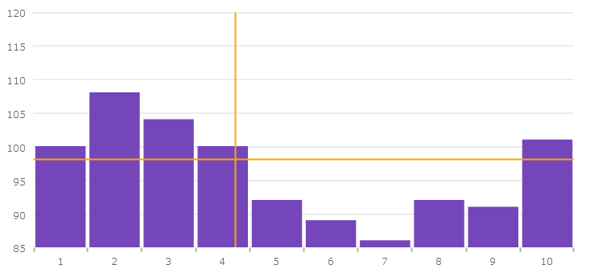
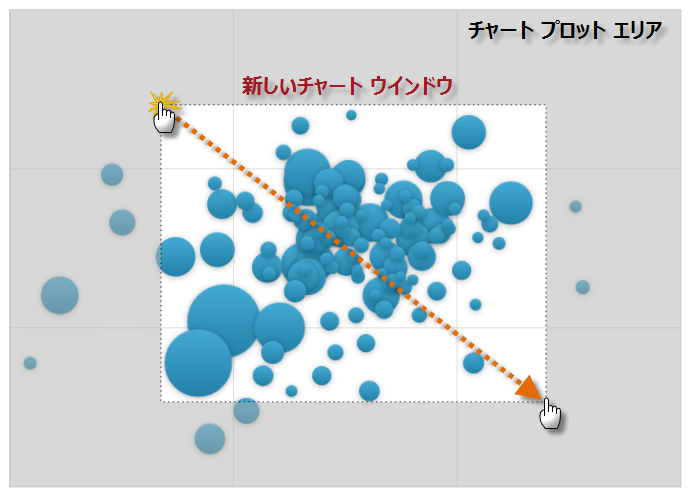
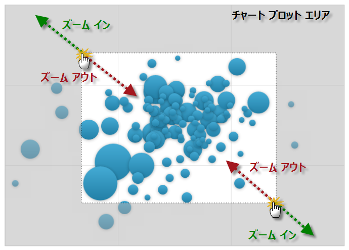
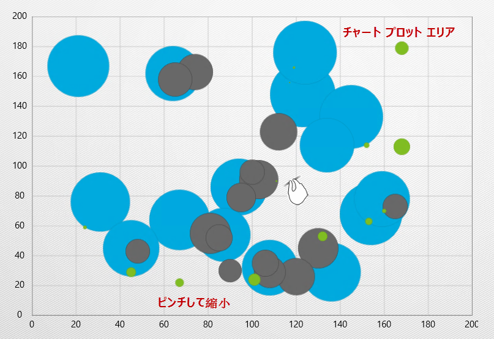
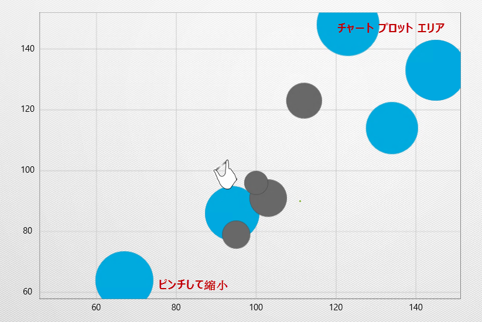
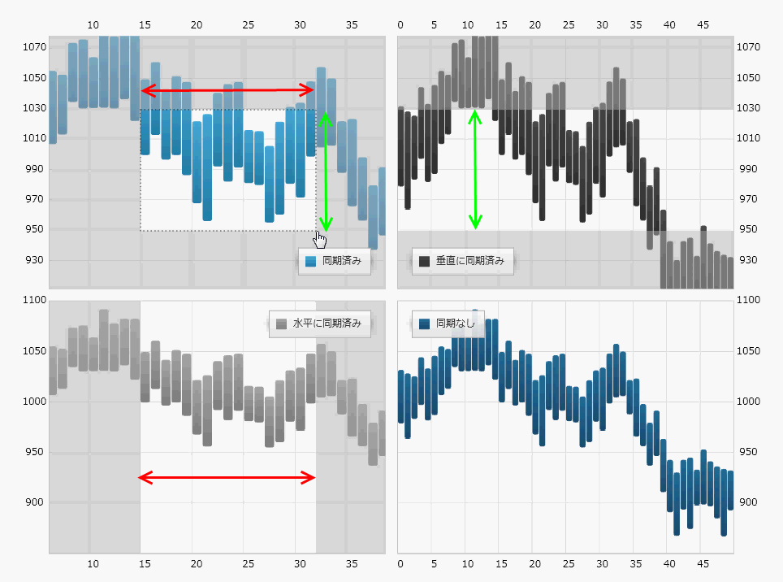
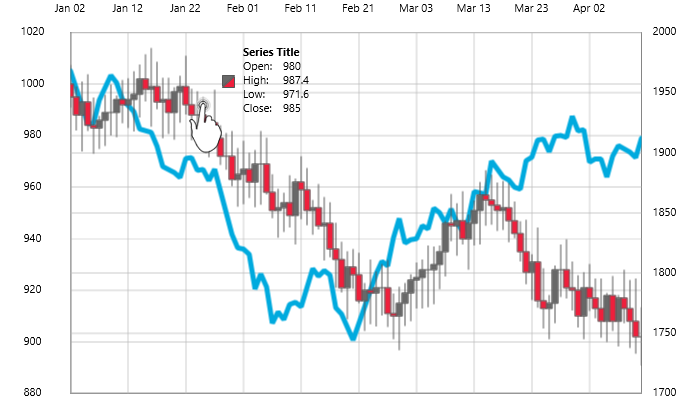

////

|metadata|
{
    "name": "datachart-interactions",
    "controlName": ["{DataChartName}"],
    "tags": ["Charting","How Do I"],
    "guid": "a5ba37a7-ffc7-4c55-9661-67a4d0659d1a",  
    "buildFlags": [],
    "createdOn": "2014-06-05T19:39:00.6573809Z"
}
|metadata|
////

= チャートの操作

link:{DataChartLink}.{DataChartName}.html[{DataChartName}]™ コントロールによってユーザーがデータ ポイントを詳細に見ることが簡単になります。多数のデータ ポイントを表示できる時に、完全にズームアウトすると個々のポイントは固有性を失います。キーボード、ズームバー、マウス ホイールを使用する、またはマウスで任意の矩形の領域をドラッグして選択し、より詳細にズームインして、矢印キーを使用してチャート領域をパンニングします。さらに、チャートの十字ポインターは、同じ軸値上またはその近くに配列されるチャート上のポイント間の関係を示すために使用できます。また、チャートのツールチップはデータ ポイントに関する詳細情報を表示するためにカスタマイズできます。

このセクションは、{DataChartName} コントロールでユーザー操作を処理するための情報を提供します。

* link:datachart-chart-crosshair.html[チャートの十字線]
* link:datachart-chart-navigation.html[チャート ナビゲーション]

ifdef::wpf,win-universal[]
* link:datachart-chart-synchronization.html[チャートの同期]

endif::wpf,win-universal[]

ifdef::wpf,win-universal[]
* link:datachart-chart-tooltips.html[チャート ツールチップ]

endif::wpf,win-universal[]

ifdef::wpf,win-universal,sl,win-phone[]
image::images/xamDataChart_RT_Chart_Crosshair_01.png[]
endif::wpf,win-universal,sl,win-phone[]

ifdef::win-forms[]

endif::win-forms[]

十字線ライン用のカスタム スタイルを含む {DataChartName} コントロール

ifdef::sl,wpf,win-rt[]

マウスのドラッグを使って特定の領域にズームする {DataChartName} コントロール
endif::sl,wpf,win-rt[]

ifdef::win-phone[]

endif::win-phone[]

ifdef::win-rt[]

endif::win-rt[]

ifdef::win-rt[]

endif::win-rt[]

ifdef::win-phone[]
フィンガー ストレッチとピンチを使ったチャートのズームを示す、{DataChartName} コントロール
endif::win-phone[]

ifdef::sl,wpf,win-phone[]

endif::sl,wpf,win-phone[]

ifdef::win-rt[]
image::images/xamDataChart_RT_Chart_Synchronization_01.png[]
endif::win-rt[]

ifdef::sl,wpf,win-phone,win-universal[]
様々な同期モードが設定された {DataChartName} コントロール
endif::sl,wpf,win-phone,win-universal[]

ifdef::sl,wpf,win-phone,win-forms[]
image::images/xamDataChart_Chart_Tooltips_01.png[]
endif::sl,wpf,win-phone,win-forms[]

ifdef::win-rt[]

endif::win-rt[]

財務物価シリーズの値を示すカスタム ツールチップを含む {DataChartName} コントロール