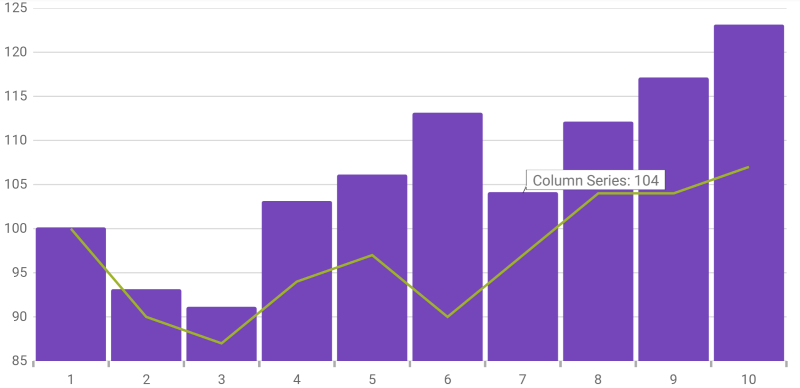

////

|metadata|
{
    "name": "datachart-itemtooltiplayer",
    "controlName": ["{DataChartName}"],
    "tags": ["Charting","Getting Started","How Do I"],
    "guid": "090c1df8-54f3-4d15-a5bb-838702753837",  
    "buildFlags": ["ANDROID","SL","WPF","WINFORMS"],
    "createdOn": "2014-06-05T19:39:00.6353742Z"
}
|metadata|
////

= 項目ツールチップ レイヤー

== トピックの概要

=== 目的

このトピックは、link:datachart-category-series-overview.html[カテゴリ シリーズ]でホバー操作に使用される項目ツールチップ レイヤーについての情報を提供します。項目ツールチップ レイヤーのプロパティについて説明し、実装例も提供します。

=== 前提条件

本トピックの理解を深めるために、以下のトピックを参照することをお勧めします。

[options="header", cols="a,a"]
|====
|トピック|目的

| link:datachart-getting-started-with-datachart.html[データ チャートを使用した作業の開始]
|{DataChartName} コントロールは、コントロールの DataContext プロパティにマップされるデータ オブジェクト モデルを必要とします。ここでは、簡単なデータ オブジェクト モデルを提供しますが、自分自身で作成し、このサンプル コードの代わりに使用することができます。

| link:datachart-category-series-overview.html[カテゴリ シリーズ]
|このトピックは、{DataChartName} コントロールのカテゴリ シリーズのさまざまなタイプを説明します。

|====

=== このトピックの内容

このトピックは、以下のセクションで構成されます。

* <<Overview,概要>>
* <<Properties,プロパティ>>
* <<Example,例>>
* <<RelatedContent,関連コンテンツ>>

[[Overview]]
== 概要

=== 項目ツールチップ レイヤーの概要

link:{DataChartLink}.itemtooltiplayer_members.html[ItemToolTipLayer] は、特定のシリーズにpick:[wpf,win-universal="マウスがホバーする"]pick:[xamarin="タップしてホールドする"]場合に _{DataChartName}_ コントロール上のすべてのシリーズに関するヒントを個別に表示します。

ツールチップのスタイルはチャートから継承しますpick:[wpf,sl,win-universal="が、このデフォルトのビヘイビアーは link:{DataChartLink}.itemtooltiplayer{ApiProp}tooltipstyle.html[ToolTipStyle] プロパティを設定することにより上書きできます。"]pick:[xamarin,win-forms,android="。"]pick:[xaml="このプロパティの詳細は、以下の<<Properties,プロパティ>>セクションを参照してください。"]

[[Preview]]

=== プレビュー

以下の画像は、link:{DataChartLink}.itemtooltiplayer_members.html[ItemToolTipLayer] を追加して描画した {DataChartName} コントロールのプレビューです。

ifdef::wpf,win-universal,win-forms[]
image::images/Item_Tooltip_Layer_1.png[]
endif::wpf,win-universal,win-forms[]

ifdef::xamarin[]
image::images/Item_Tooltip_Layer_3.png[]
endif::xamarin[]

[[Properties]]
== プロパティ

=== 項目ツールチップ レイヤーについて

以下の表で、 link:{DataChartLink}.itemtooltiplayer_members.html[ItemToolTipLayer] レイヤーのプロパティを簡単に説明します。

[options="header", cols="a,a,a"]
|====
|プロパティ名|プロパティ タイプ|説明

| link:{DataChartLink}.itemtooltiplayer{ApiProp}targetseries.html[TargetSeries]
|`Series`
|このプロパティは、どのシリーズに有効な項目ツールチップ レイヤーを設定するかを指定します。 

各シリーズごとに別々の項目ツールチップ レイヤーを作成して個別に構成できます。

ifdef::wpf,win-universal[]
| link:{DataChartLink}.itemtooltiplayer{ApiProp}tooltipstyle.html[ToolTipStyle]
|`Style`
|このプロパティは、表示されるヒントに適用するスタイルを指定します。デフォルトではツールチップはチャートからスタイルを継承しますが、このプロパティを設定するとこのデフォルト設定を上書きできます。

| link:{DataChartLink}.itemtooltiplayer{ApiProp}pointertooltipstyle.html[PointerToolTipStyle]
|`Style`
|このプロパティは、ヒントのポインター エリアに適用するスタイルを指定します。
endif::wpf,win-universal[]

| link:{DataChartLink}.itemtooltiplayer{ApiProp}useinterpolation.html[UseInterpolation]
|`bool`
|このプロパティは、ツールチップの x 位置がグリッド ラインや中央スペースにスナップするのでなく補間されるべきであるかどうかを指定します。

|====

[[Example]]
== 例

=== 例

以下のスクリーン ショットは、以下の設定の結果として、 link:{DataChartLink}.itemtooltiplayer_members.html[ItemToolTipLayer] オブジェクトの link:{DataChartLink}.itemtooltiplayer{ApiProp}targetseries.html[TargetSeries] プロパティを持つ {DataChartName} コントロールがどのように表示されるのかを示します。

[options="header", cols="a,a"]
|====
|プロパティ|値

| link:{DataChartLink}.itemtooltiplayer{ApiProp}targetseries.html[TargetSeries]
|series1

|====

ifdef::wpf,win-universal,win-forms[]
image::images/Item_Tooltip_Layer_2.png[]
endif::wpf,win-universal,win-forms[]

ifdef::xamarin[]

endif::xamarin[]

以下のコードはこの実装で使用されます。

ifdef::wpf,win-universal[]

*XAML の場合:*

[source,xaml]
----
<ig:{DataChartName} x:Name="theChart" Margin="5,0,5,0" >
   <ig:{DataChartName}.Axes>
      <ig:CategoryXAxis x:Name="xmCategoryXAxis"
                        ItemsSource="{StaticResource CategoryData1}"
                        Label="{}{Category}">
        <ig:CategoryXAxis.LabelSettings>
           <ig:AxisLabelSettings x:Name="xmCategoryXAxisLabel" Extent="25" VerticalAlignment="Bottom" FontSize="11" />
           </ig:CategoryXAxis.LabelSettings>
        </ig:CategoryXAxis>
        <ig:NumericYAxis x:Name="xmNumericYAxis1">
           <ig:NumericYAxis.LabelSettings>
              <ig:AxisLabelSettings x:Name="xmNumericYAxisLabel" Extent="50" Location="OutsideLeft" />
              </ig:NumericYAxis.LabelSettings>
           </ig:NumericYAxis>
        </ig:{DataChartName}.Axes>
        <ig:{DataChartName}.Series>
           <ig:ColumnSeries x:Name="series1" 
                            ItemsSource="{StaticResource CategoryData1}"
                            ValueMemberPath="Value" 
                            XAxis="{Binding ElementName=xmCategoryXAxis}" 
                            YAxis="{Binding ElementName=xmNumericYAxis1}">
              <ig:ColumnSeries.ToolTip>
                 <TextBlock Text="{Binding Item.Value}" />
              </ig:ColumnSeries.ToolTip>
           </ig:ColumnSeries>
           <ig:LineSeries ItemsSource="{StaticResource CategoryData2}" 
                          ValueMemberPath="Value" 
                          XAxis="{Binding ElementName=xmCategoryXAxis}" 
                          YAxis="{Binding ElementName=xmNumericYAxis1}">
            <ig:LineSeries.ToolTip>
               <TextBlock Text="{Binding Item.Value}" />
            </ig:LineSeries.ToolTip>
         </ig:LineSeries>
         <ig:ItemToolTipLayer 
                 TargetSeries="{Binding ElementName=series1}"
         />
   </ig:{DataChartName}.Series>
</ig:{DataChartName}>
----

endif::wpf,win-universal[]

ifdef::xamarin[]

[source,xaml]
----
<ig:{DataChartName} x:Name="theChart">
    <ig:{DataChartName}.Axes>
        <ig:CategoryXAxis x:Name="xAxis"
                          ItemsSource="{Binding CategoryData1}"
                          Label="Category"/>
        <ig:NumericYAxis x:Name="yAxis"/>
    </ig:{DataChartName}.Axes>
    <ig:{DataChartName}.Series>
        <ig:ColumnSeries x:Name="series1"
                         ItemsSource="{Binding CategoryData1}"
                         ValueMemberPath="Value"
                         XAxis="{x:Reference xAxis}"
                         YAxis="{x:Reference yAxis}">
            <ig:ColumnSeries.ToolTipTemplate>
                <DataTemplate>
                    <Label Text="{Binding Item.Value}" FontSize="12" />
                </DataTemplate>
            </ig:ColumnSeries.ToolTipTemplate>
        </ig:ColumnSeries>
        <ig:LineSeries ItemsSource="{Binding CategoryData2}"
                       ValueMemberPath="Value"
                       XAxis="{x:Reference xAxis}"
                       YAxis="{x:Reference yAxis}">
            <ig:LineSeries.ToolTipTemplate>
                <DataTemplate>
                    <Label Text="{Binding Item.Value}" FontSize="12" />
                </DataTemplate>
            </ig:LineSeries.ToolTipTemplate>
        </ig:Lineseries>
        
        <ig:ItemToolTipLayer TargetSeries="{x:Reference series1}"/>
    </ig:{DataChartName}.Series>
</ig:{DataChartName}>
----

endif::xamarin[]

ifdef::wpf[]

*C# の場合:*

----
var itemToolTipLayerSeries = new ItemToolTipLayer();
itemToolTipLayerSeries.TargetSeries = series1;
chart.Series.Add(itemToolTipLayerSeries);
----

endif::wpf[]

ifdef::win-forms[]

*C# の場合:*

----
var itemToolTipLayerSeries = new ItemToolTipLayer();
itemToolTipLayerSeries.TargetSeries = series1;
chart.Series.Add(itemToolTipLayerSeries);
----

endif::win-forms[]

ifdef::xamarin[]

*C# の場合:*

----
var itemToolTipLayerSeries = new ItemToolTipLayer();
itemToolTipLayerSeries.TargetSeries = series1;
chart.Series.Add(itemToolTipLayerSeries);
----

endif::xamarin[]

[[RelatedContent]]
== 関連コンテンツ

[options="header", cols="a,a"]
|====
|トピック|目的

ifdef::wpf[]
| link:datachart-commonproperties.html[共通のプロパティ]
|このトピックは、ホバー操作機能が、 link:{DataChartLink}.series_members.html[Series] クラスから継承したツールチップの相互作用を強調表示、ホバリングおよび相互作用するために使用するプロパティおよびメソッドについての情報を提供します。
endif::wpf[]

| link:datachart-crosshairlayer.html[十字線レイヤー]
|このトピックは、ホバー操作に使用される十字線レイヤーについての情報を提供します。十字線のプロパティについて説明し、実装例を示します。

| link:datachart-categoryhighlightlayer.html[カテゴリ強調表示レイヤー]
|このトピックは、ホバー操作に使用されるカテゴリ強調表示レイヤーについての情報を提供します。カテゴリ強調表示レイヤーのプロパティについて説明し、実装例を示します。

| link:datachart-categoryitemhighlightlayer.html[カテゴリ項目強調表示レイヤー]
|このトピックは、ホバー操作に使用されるカテゴリ項目強調表示レイヤーについての情報を提供します。カテゴリ項目強調表示レイヤーのプロパティについて説明し、実装例を示します。

| link:datachart-categorytooltiplayer.html[カテゴリ ツールチップ レイヤー]
|このトピックは、ホバー操作に使用されるカテゴリ ツールチップ レイヤーについての情報を提供します。カテゴリ ツールチップ レイヤーのプロパティについて説明し、実装例を提供します。

|====
