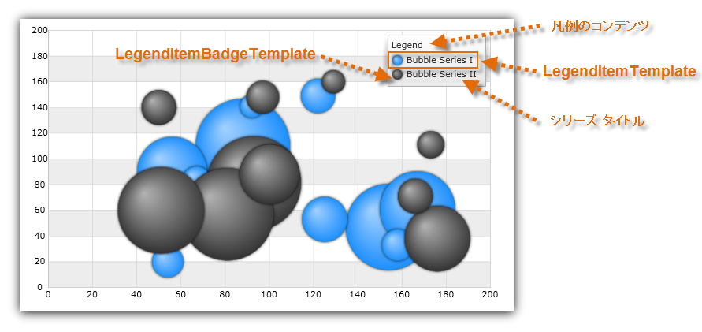
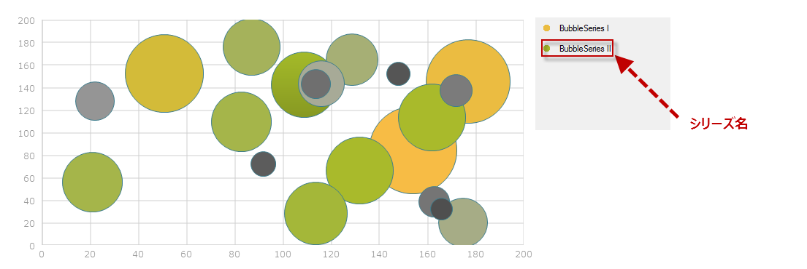
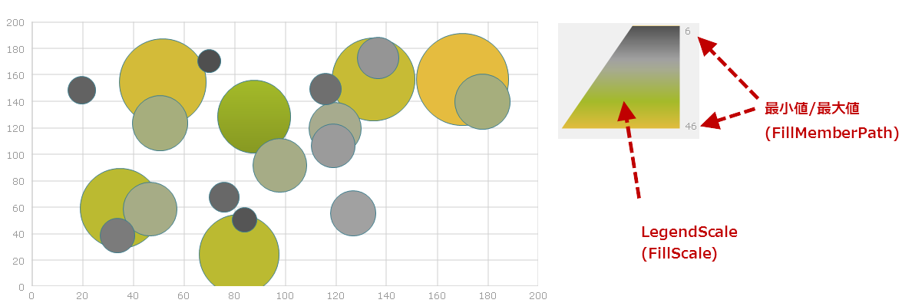

////

|metadata|
{
    "name": "datachart-legends",
    "controlName": ["{DataChartName}"],
    "tags": ["Charting"],
    "guid": "5e4aa82c-8645-490e-b0d0-dd733c4bec20",  
    "buildFlags": [],
    "createdOn": "2014-06-05T19:39:00.6743876Z"
}
|metadata|
////

= チャート凡例

このトピックは、凡例の概要と link:{DataChartLink}.{DataChartName}.html[{DataChartName}] コントロールの link:datachart-series.html[チャート シリーズ]でサポートされる凡例タイプについて説明します。トピックは以下のとおりです。

* <<Introduction,概要>>
* <<Legends,凡例のタイプ>>

** <<LegendType,基本凡例>>
ifdef::wpf,win-universal,xamarin[]
** <<ScaleLegendType,スケール凡例>>
endif::wpf,win-universal,xamarin[]
** <<ItemLegendType,項目凡例>>
** <<BasicLegend,凡例のタイプ>>

ifdef::android,wpf,win-universal[]
* <<Properties,共通のプロパティ>>

endif::android,wpf,win-universal[]

* <<RelatedContent,関連コンテンツ>>

[[Introduction]]
== 概要

凡例は、チャート コントロールにプロットされるデータに関連する情報によってエンドユーザーがチャート シリーズを識別するのをサポートします。ほとんどのチャートは、チャートプロット領域に表示されたデータを理解するために少なくとも 1 凡例あるとよいでしょう。ただし、凡例は必須ではなく、凡例なししでもチャートは描画できます。ほとんどの凡例はとても小さいため、チャートコントロール上に描くかチャートの外側に描くかを選択できます。

[[Legends]]
== 凡例のタイプ

{DataChartName} コントロールはさまざまなタイプの凡例をサポートしますが、すべての凡例が任意のタイプのシリーズで使用できるわけではありません。以下の図は、シリーズのグループでサポートされる凡例タイプを示します。

[[BasicLegend]]
* 基本 link:{LegendLink}.{LegendName}.html[{LegendName}]

ifdef::xamarin,wpf,win-universal,android,xamarin[] 
 
endif::xamarin,wpf,win-universal,android,xamarin[] 
ifdef::win-forms[] 
 
endif::win-forms[] 

サポートされるシリーズ:

** link:datachart-category-series-overview.html[カテゴリ シリーズ] 
** link:datachart-series-financial-price-series-overview.html[財務シリーズ] 
** link:datachart-financial-indicators-overview.html[財務指標] 
** link:datachart-financial-overlays-overview.html[財務オーバーレイ] 
** link:datachart-polar-series-overview.html[極座標シリーズ] 
** link:datachart-radial-series-overview.html[ラジアル シリーズ] 
** link:datachart-scatter-series-overview.html[散布図シリーズ] 

* link:{ItemLegendLink}.{ItemLegendName}.html[{ItemLegendName}]

ifdef::xamarin,wpf,win-universal,android[] 
image::images/xamDataChart_Legends_04.png[] 
endif::xamarin,wpf,win-universal,android[] 
ifdef::win-forms[] 
image::images/baseItemLegendAnnotations.png[] 
endif::win-forms[] 

サポートされるシリーズ:

** link:datachart-bubble-series.html[散布バブル シリーズ]

[[ScaleLegend]]
* link:{ScaleLegendLink}.{ScaleLegendName}.html[{ScaleLegendName}]

ifdef::wpf,win-universal,xamarin[] 
image::images/xamDataChart_Legends_03.png[] 
endif::wpf,win-universal,xamarin[] 
ifdef::win-forms[] 
 
endif::win-forms[] 

サポートされるシリーズ:

** link:datachart-bubble-series.html[散布バブル シリーズ]

[[Properties]]

ifdef::android,wpf,win-universal[]
== 共通のプロパティ

すべてのチャート凡例を同じ基本クラスから継承し、お互いに共通プロパティを共有します。以下の表は、共通プロパティを示します。以下の表は、これらのプロパティをすべて示します。

[options="header", cols="a,a,a"]
|====
|プロパティ名|プロパティ タイプ|説明

ifdef::wpf,win-universal[]
| link:{DataChartLink}.legendbase{ApiProp}itemsfontfamily.html[ItemsFontFamily]
|FontFamily
|凡例項目のフォント ファミリを決定します。
endif::wpf,win-universal[]

ifdef::wpf,win-universal[]
| link:{DataChartLink}.legendbase{ApiProp}itemsfontsize.html[ItemsFontSize]
|double
|凡例項目のフォント サイズを決定します。
endif::wpf,win-universal[]

ifdef::wpf,win-universal[]
| link:{DataChartLink}.legendbase{ApiProp}itemsfontstretch.html[ItemsFontStretch]
|FontStretch
|凡例項目の伸縮を決定します。
endif::wpf,win-universal[]

ifdef::wpf,win-universal[]
| link:{DataChartLink}.legendbase{ApiProp}itemsfontstyle.html[ItemsFontStyle]
|FontStyle
|凡例項目のスタイルを決定します。
endif::wpf,win-universal[]

ifdef::wpf,win-universal[]
| link:{DataChartLink}.legendbase{ApiProp}itemsfontweight.html[ItemsFontWeight]
|FontWeight
|凡例項目のウェイトを決定します。
endif::wpf,win-universal[]

ifdef::wpf,win-universal[]
| link:{DataChartLink}.legendbase{ApiProp}itemsforeground.html[ItemsForeground]
|Brush
|凡例項目の前景ブラシを決定します。
endif::wpf,win-universal[]

ifdef::wpf,win-universal[]
| link:{DataChartLink}.legendbase{ApiProp}itemshorizontalalignment.html[ItemsHorizontalAlignment]
|HorizontalAlignment
|凡例の凡例項目の水平配置を決定します。
endif::wpf,win-universal[]

ifdef::wpf,win-universal[]
| link:{DataChartLink}.legendbase{ApiProp}itemsverticalalignment.html[ItemsVerticalAlignment]
|VerticalAlignment
|凡例の凡例項目の垂直配置を決定します。
endif::wpf,win-universal[]

ifdef::wpf,win-universal[]
| link:{DataChartLink}.legendbase{ApiProp}titlefontfamily.html[TitleFontFamily]
|FontFamily
|凡例タイトルのフォント ファミリを決定します。
endif::wpf,win-universal[]

ifdef::wpf,win-universal[]
| link:{DataChartLink}.legendbase{ApiProp}titlefontsize.html[TitleFontSize]
|double
|凡例タイトルのフォント サイズを決定します。
endif::wpf,win-universal[]

ifdef::wpf,win-universal[]
| link:{DataChartLink}.legendbase{ApiProp}titlefontstretch.html[TitleFontStretch]
|FontStretch
|凡例タイトルのフォント伸縮を決定します。
endif::wpf,win-universal[]

ifdef::wpf,win-universal[]
| link:{DataChartLink}.legendbase{ApiProp}titlefontstyle.html[TitleFontStyle]
|FontStyle
|凡例タイトルのフォント スタイルを決定します。
endif::wpf,win-universal[]

ifdef::wpf,win-universal[]
| link:{DataChartLink}.legendbase{ApiProp}titlefontweight.html[TitleFontWeight]
|FontWeight
|凡例タイトルのフォント ウェイトを決定します。
endif::wpf,win-universal[]

ifdef::wpf,win-universal[]
| link:{DataChartLink}.legendbase{ApiProp}titleforeground.html[TitleForeground]
|Brush
|凡例タイトルの前景ブラシを決定します。
endif::wpf,win-universal[]

ifdef::wpf,win-universal[]
| link:{DataChartLink}.legendbase{ApiProp}titlehorizontalalignment.html[TitleHorizontalAlignment]
|HorizontalAlignment
|凡例の凡例タイトルの水平配置を決定します。
endif::wpf,win-universal[]

ifdef::wpf,win-universal[]
| link:{DataChartLink}.legendbase{ApiProp}titleverticalalignment.html[titleVerticalAlignment]
|VerticalAlignment
|凡例の凡例タイトルの垂直配置を決定します。
endif::wpf,win-universal[]

ifdef::android[]
| link:{DataChartLink}.legendviewbase{ApiProp}ishorizontal.html[IsHorizontal]
|Boolean
|凡例での凡例項目の垂直/水平方向を決定します。
endif::android[]

ifdef::android[]
| link:{DataChartLink}.legendviewbase{ApiProp}fontstyle.html[FontStyle]
|int
|凡例のテキストの色を決定します。
endif::android[]

ifdef::android[]
| link:{DataChartLink}.legendviewbase{ApiProp}fontfamily.html[FontFamily]
|string
|凡例のテキストの色を決定します。
endif::android[]

ifdef::android[]
| link:{DataChartLink}.legendviewbase{ApiProp}textsize.html[TextSize]
|double
|凡例のテキスト サイズを決定します。
endif::android[]

ifdef::android[]
| link:{DataChartLink}.legendviewbase{ApiProp}textcolor.html[TextColor]
|int
|凡例のテキストの色を決定します。
endif::android[]

ifdef::android[]
| link:{DataChartLink}.legendviewbase{ApiProp}typeface.html[Typeface]
|Typeface
|凡例で使用するタイプフェースを決定します。FontFamily と FontStyle の設定をオーバーライドします。
endif::android[]

ifdef::wpf,win-universal[]
| link:http://msdn.microsoft.com/ja-jp/library/system.windows.controls.contentcontrol.content.aspx[Content]
|object
|凡例項目上の凡例ヘッダーとして表示するテキストを決定します。
endif::wpf,win-universal[]

ifdef::wpf,win-universal[]
| link:http://msdn.microsoft.com/ja-jp/library/system.windows.controls.control.template.aspx[Template]
|object
|凡例ヘッダーと凡例項目のスタイル設定を許可する凡例テンプレートを決定します。
endif::wpf,win-universal[]

ifdef::wpf,win-universal[]
|Series. pick:[wpf,win-universal="link:{DataChartLink}.series{ApiProp}legenditemtemplate.html[LegendItemTemplate]"]
|DataTemplate
|指定したチャート シリーズの凡例項目のためのテンプレートを決定します。
endif::wpf,win-universal[]

ifdef::wpf,win-universal[]
|Series.link:{DataChartLink}.series{ApiProp}legend.html[Legend]
|LegendBase (Legend、ItemLegend、または ScaleLegend)
|チャートの単一のシリーズで一意の凡例を決定します。
endif::wpf,win-universal[]

ifdef::wpf,win-universal[]
|

{DataChartName}.link:{DataChartLinkBase}.{DataChartBase}{ApiProp}legend.html[Legend] 

ifdef::android,xamarin[] 

{DataChartName}.link:{DataChartLink}.series{ApiProp}legend.html[Legend] 

endif::android,xamarin[]
|LegendBase (Legend、ItemLegend、または ScaleLegend)
|チャートのすべてのシリーズで共有凡例を決定します。
endif::wpf,win-universal[]

|====

endif::android,wpf,win-universal[]

[[RelatedContent]]
== 関連コンテンツ

* link:datachart-configuring-basiclegend.html[基本凡例の構成]

ifdef::wpf,win-universal,win-forms,xamarin,android[]
* link:datachart-configuring-itemlegend.html[項目凡例の構成]
endif::wpf,win-universal,win-forms,xamarin,android[]

ifdef::wpf,win-universal,win-forms,xamarin[]
* link:datachart-configuring-scalelegend.html[スケール凡例の構成]
endif::wpf,win-universal,win-forms,xamarin[]

ifdef::wpf,win-universal,xamarin[]
* link:datachart-common-legend.html[共通凡例の追加]
endif::wpf,win-universal,xamarin[]

ifdef::wpf,win-universal,xamarin[]
* link:datachart-multiple-legends.html[複数凡例の追加]
endif::wpf,win-universal,xamarin[]

ifdef::wpf,win-universal[]
* link:datachart-docking-legends.html[凡例のドッキング]
endif::wpf,win-universal[]