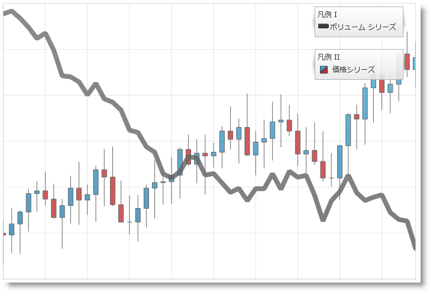

////

|metadata|
{
    "name": "datachart-multiple-legends",
    "controlName": ["{DataChartName}"],
    "tags": ["Application Scenarios","Charting","How Do I"],
    "guid": "177a0735-6ef5-40f6-af24-16d8d5c4b4d4",  
    "buildFlags": ["wpf","win-universal"],
    "createdOn": "2014-06-05T19:39:00.6803898Z"
}
|metadata|
////

= 複数凡例の追加

デフォルトでは、 link:{DataChartLink}.{DataChartName}.html[{DataChartName}] はチャート コントロールのシリーズに link:{DataChartLink}.series{ApiProp}legend.html[Legend] を表示しません。シリーズごとに個々の凡例を表示したい場合、{DataChartName} コントロールのコンテナーに多数の Legend オブジェクトを追加して、各凡例を対応する link:{DataChartLink}.series.html[Series] オブジェクトの link:{DataChartLink}.series{ApiProp}legend.html[Legend] プロパティにバインドする必要があります。さらに、各 Series オブジェクトの link:{DataChartLink}.series{ApiProp}title.html[Title] プロパティを設定する必要があります。設定しない場合、対応する凡例項目はデフォルトのシリーズ タイトルを使用します。

ifdef::wpf[]
{DataChartName} コントロールのプロット エリアと関連付けながら凡例の位置を指定できます。詳細については、 link:datachart-docking-legends.html[軸ドッキング設定]を参照してください。
endif::wpf[]

以下のコード例は {DataChartName} コントロールに定義された客シリーズの個々凡例を追加する方法を紹介します。

ifdef::wpf,win-universal[]

*XAML の場合:*
[source,xaml]
----
<Grid>
    <Grid.RowDefinitions>
        <RowDefinition Height="Auto" />
        <RowDefinition Height="Auto" />
        <RowDefinition Height="*" /> 
    </Grid.RowDefinitions>
    <Grid.ColumnDefinitions>
        <ColumnDefinition Width="*" />
        <ColumnDefinition Width="Auto" />
    </Grid.ColumnDefinitions>
     
    <ig:{DataChartName} Grid.ColumnSpan="2" Grid.RowSpan="3">
        ...
        <ig:{DataChartName}.Series>
            <ig:LineSeries Title="Volume Series"
                           Legend="{Binding ElementName=Legend1}">
            </ig:LineSeries>
            <ig:FinancialPriceSeries Title="Price Series"
                                     Legend="{Binding ElementName=Legend2}">
            </ig:FinancialPriceSeries>
        </ig:{DataChartName}.Series>
    </ig:{DataChartName}>
	<ig:Legend x:Name="Legend1" 
               Content="Legend I" 
               Margin="10" 
               Grid.Row="0" Grid.Column="1">
    </ig:Legend>
    <ig:Legend x:Name="Legend2"
               Content="Legend II" 
               Margin="10" 
               Grid.Row="1" Grid.Column="1">
    </ig:Legend> 
</Grid>
----

endif::wpf,win-universal[]

ifdef::xamarin[]
*XAML の場合:*
[source,xaml]
----
<Grid>
    <Grid.RowDefinitions>
        <RowDefinition Height="Auto" />
        <RowDefinition Height="Auto" />
        <RowDefinition Height="*" /> 
    </Grid.RowDefinitions>
    <Grid.ColumnDefinitions>
        <ColumnDefinition Width="*" />
        <ColumnDefinition Width="Auto" />
    </Grid.ColumnDefinitions>
     
    <ig:{DataChartName} Grid.ColumnSpan="2" Grid.RowSpan="3">
        ...
        <ig:{DataChartName}.Series>
            <ig:LineSeries Title="Volume Series" 
                           Legend="{x:Reference Legend1}">
            </ig:LineSeries>
            <ig:FinancialPriceSeries Title="Price Series"
                                     Legend="{x:Reference Legend2}">
            </ig:FinancialPriceSeries>
        </ig:{DataChartName}.Series>
    </ig:{DataChartName}> 
    <ig:Legend x:Name="Legend1"  
               Margin="10" 
               Grid.Row="0" Grid.Column="1">
    </ig:Legend>
    <ig:Legend x:Name="Legend2" 
               Margin="10" 
               Grid.Row="1" Grid.Column="1">
    </ig:Legend> 
</Grid>
----
endif::xamarin[]

以下の画像は、{DataChartName} コントロールが複数の凡例でどのように見えるかを示しています。

== 関連コンテンツ

* link:datachart-common-legend.html[共通凡例の追加]

ifdef::wpf,win-universal[]
* link:datachart-docking-legends.html[凡例のドッキング]
endif::wpf,win-universal[]