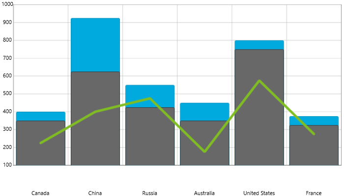
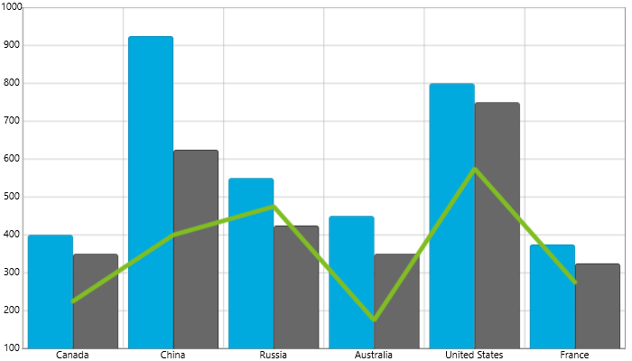

////

|metadata|
{
    "name": "datachart-multiple-series",
    "controlName": ["{DataChartName}"],
    "tags": ["Application Scenarios","Charting","How Do I"],
    "guid": "a3dde4c0-c34f-4561-90fa-0f9f010ca3e4",  
    "buildFlags": [],
    "createdOn": "2014-06-05T19:39:00.6933954Z"
}
|metadata|
////

= 複数シリーズの追加

このトピックでは、コード例と共に、{DataChartName}™ コントロールの同じプロット領域に複数のタイプの link:datachart-series-types.html[Series] をプロットして合成チャートを作る方法について説明します。

== 概要

トピックは以下のとおりです。

* <<Introduction,概要>>
* <<Examples,コード例>>

** シリーズの混在グループからの複数シリーズ
** 複数オーバーレイ シリーズ
** 複数クラスター化シリーズ

* <<RelatedContent,関連コンテンツ>>

[[Introduction]]
== 概要

{DataChartName} は、同じチャート プロット領域でシリーズをいくつでも無制限にサポートします。これは、さまざまなタイプの Series オブジェクトを {DataChartName} コントロールの Series コレクションに追加することによって達成されます。チャートに追加される各シリーズは適切なタイプの一対の軸とデータ メンバー マッピングを持つ必要があります。この詳細は、link:datachart-series-requirements.html[シリーズ要件]トピックを参照してください。複数のシリーズを任意の組み合わせでプロットできることに加え、いくつかの軸のタイプはさまざまなシリーズ (表 1 参照) の間で共有でき、合成チャートの作成プロセスが非常に容易になります。

別のデータ ソースを持つ複数のシリーズをプロットする場合、CategoryDateTimeXAxis または TimeXAxis を使用してチャートにシリーズのプロットで複数のデータ ソースの項目を配置しません。結果として、データ ソースに対応する項目がない場合、null 項目を挿入してデータ項目を整列する必要があります。

次の表はさまざまなシリーズでサポートされる軸のタイプとどの軸がデータ チャートの異なるシリーズ間で共有できるかを示しています。軸の共有方法についての詳細は、このトピックの<<Examples,例>>のセクションおよびlink:datachart-multiple-axes.html[複数軸ト]ピックを参照してください。

[options="header", cols="a,a,a,a,a"]
|====
|範囲シリーズのタイプ|有効な X 軸|有効な Y 軸|有効な半径軸|有効な角度軸

| link:datachart-category-range-area-series.html[範囲エリア シリーズ]
|CategoryXAxis, CategoryDateTimeXAxispick:[wpf,win-forms=", TimeXAxis"]
|NumericYAxis
|N/A
|N/A

| link:datachart-category-range-column-series.html[範囲柱状シリーズ]
|CategoryXAxis, CategoryDateTimeXAxispick:[wpf,win-forms=", TimeXAxis"]
|NumericYAxis
|N/A
|N/A
 
|====

[options="header", cols="a,a,a,a,a"]
|====
|カテゴリ シリーズのタイプ|有効な X 軸|有効な Y 軸|有効な半径軸|有効な角度軸

|BarSeries
|NumericXAxis
|CategoryYAxis
|なし
|なし

|AreaSeries
|CategoryXAxis、CategoryDateTimeXAxispick:[wpf,win-forms="、TimeXAxis"]
|NumericYAxis
|なし
|なし

|ColumnSeries
|CategoryXAxis、CategoryDateTimeXAxispick:[wpf,win-forms="、TimeXAxis"]
|NumericYAxis
|なし
|なし

|LineSeries
|CategoryXAxis、CategoryDateTimeXAxispick:[wpf,win-forms="、TimeXAxis"]
|NumericYAxis
|なし
|なし

|PointSeries
|CategoryXAxis、CategoryDateTimeXAxispick:[wpf,win-forms="、TimeXAxis"]
|NumericYAxis
|なし
|なし

|SplineSeries
|CategoryXAxis、CategoryDateTimeXAxispick:[wpf,win-forms="、TimeXAxis"]
|NumericYAxis
|なし
|なし

|SplineAreaSeries
|CategoryXAxis、CategoryDateTimeXAxispick:[wpf,win-forms="、TimeXAxis"]
|NumericYAxis
|なし
|なし

|StepAreaSeries
|CategoryXAxis、CategoryDateTimeXAxispick:[wpf,win-forms="、TimeXAxis"]
|NumericYAxis
|なし
|なし

|StepLineSeries
|CategoryXAxis、CategoryDateTimeXAxispick:[wpf,win-forms="、TimeXAxis"]
|NumericYAxis
|なし
|なし

|WaterfallSeries
|CategoryXAxis、CategoryDateTimeXAxispick:[wpf,win-forms="、TimeXAxis"]
|NumericYAxis
|なし
|なし

|====

ifdef::wpf,win-universal,win-forms[]
[options="header", cols="a,a,a,a,a"]
|====
|積層シリーズのタイプ|有効な X 軸|有効な Y 軸|有効な半径軸|有効な角度軸
 
|StackedAreaSeries
|CategoryXAxis、CategoryDateTimeXAxispick:[wpf,win-forms="、TimeXAxis"]
|NumericYAxis
|なし
|なし

|StackedColumnSeries
|CategoryXAxis、CategoryDateTimeXAxispick:[wpf,win-forms="、TimeXAxis"]
|NumericYAxis
|なし
|なし

|StackedLineSeries
|CategoryXAxis、CategoryDateTimeXAxispick:[wpf,win-forms="、TimeXAxis"]
|NumericYAxis
|なし
|なし

|StackedSplineSeries
|CategoryXAxis、CategoryDateTimeXAxispick:[wpf,win-forms="、TimeXAxis"]
|NumericYAxis
|なし
|なし

|StackedSplineAreaSeries
|CategoryXAxis、CategoryDateTimeXAxispick:[wpf,win-forms="、TimeXAxis"]
|NumericYAxis
|なし
|なし

|Stacked100AreaSeries
|CategoryXAxis、CategoryDateTimeXAxispick:[wpf,win-forms="、TimeXAxis"]
|NumericYAxis
|なし
|なし

|Stacked100ColumnSeries
|CategoryXAxis、CategoryDateTimeXAxispick:[wpf,win-forms="、TimeXAxis"]
|NumericYAxis
|なし
|なし

|Stacked100LineSeries
|CategoryXAxis、CategoryDateTimeXAxispick:[wpf,win-forms="、TimeXAxis"]
|NumericYAxis
|なし
|なし

|Stacked100SplineSeries
|CategoryXAxis、CategoryDateTimeXAxispick:[wpf,win-forms="、TimeXAxis"]
|NumericYAxis
|なし
|なし

|Stacked100SplineAreaSeries
|CategoryXAxis、CategoryDateTimeXAxispick:[wpf,win-forms="、TimeXAxis"]
|NumericYAxis
|なし
|なし

|StackedBarSeries
|NumericXAxis
|CategoryYAxis
|なし
|なし

|Stacked100BarSeries
|NumericXAxis
|CategoryYAxis
|なし
|なし

|====
endif::wpf,win-universal,win-forms[]

[options="header", cols="a,a,a,a,a"]
|====
|財務シリーズのタイプ|有効な X 軸|有効な Y 軸|有効な半径軸|有効な角度軸

|FinancialPriceSeries
|CategoryXAxis、CategoryDateTimeXAxispick:[wpf,win-forms="、TimeXAxis"]
|NumericYAxis
|なし
|なし

|AbsoluteVolumeOscillatorIndicator
|CategoryXAxis、CategoryDateTimeXAxispick:[wpf,win-forms="、TimeXAxis"]
|NumericYAxis
|なし
|なし

|AccumulationDistributionIndicator
|CategoryXAxis、CategoryDateTimeXAxispick:[wpf,win-forms="、TimeXAxis"]
|NumericYAxis
|なし
|なし

|AverageDirectionalIndexIndicator
|CategoryXAxis、CategoryDateTimeXAxispick:[wpf,win-forms="、TimeXAxis"]
|NumericYAxis
|なし
|なし

|AverageTrueRangeIndicator
|CategoryXAxis、CategoryDateTimeXAxispick:[wpf,win-forms="、TimeXAxis"]
|NumericYAxis
|なし
|なし

|BollingerBandsOverlay
|CategoryXAxis、CategoryDateTimeXAxispick:[wpf,win-forms="、TimeXAxis"]
|NumericYAxis
|なし
|なし

|BollingerBandWidthIndicator
|CategoryXAxis、CategoryDateTimeXAxispick:[wpf,win-forms="、TimeXAxis"]
|NumericYAxis
|なし
|なし

|ChaikinOscillatorIndicator
|CategoryXAxis、CategoryDateTimeXAxispick:[wpf,win-forms="、TimeXAxis"]
|NumericYAxis
|なし
|なし

|ChaikinVolatilityIndicator
|CategoryXAxis、CategoryDateTimeXAxispick:[wpf,win-forms="、TimeXAxis"]
|NumericYAxis
|なし
|なし

|CommodityChannelIndexIndicator
|CategoryXAxis、CategoryDateTimeXAxispick:[wpf,win-forms="、TimeXAxis"]
|NumericYAxis
|なし
|なし

|DetrendedPriceOscillatorIndicator
|CategoryXAxis、CategoryDateTimeXAxispick:[wpf,win-forms="、TimeXAxis"]
|NumericYAxis
|なし
|なし

|EaseOfMovementIndicator
|CategoryXAxis、CategoryDateTimeXAxispick:[wpf,win-forms="、TimeXAxis"]
|NumericYAxis
|なし
|なし

|FastStochasticOscillatorIndicator
|CategoryXAxis、CategoryDateTimeXAxispick:[wpf,win-forms="、TimeXAxis"]
|NumericYAxis
|なし
|なし

|ForceIndexIndicator
|CategoryXAxis、CategoryDateTimeXAxispick:[wpf,win-forms="、TimeXAxis"]
|NumericYAxis
|なし
|なし

|FullStochasticOscillatorIndicator
|CategoryXAxis、CategoryDateTimeXAxispick:[wpf,win-forms="、TimeXAxis"]
|NumericYAxis
|なし
|なし

|MarkerFacilitationIndexIndicator
|CategoryXAxis、CategoryDateTimeXAxispick:[wpf,win-forms="、TimeXAxis"]
|NumericYAxis
|なし
|なし

|MassIndexIndicator
|CategoryXAxis、CategoryDateTimeXAxispick:[wpf,win-forms="、TimeXAxis"]
|NumericYAxis
|なし
|なし

|MedianPriceIndicator
|CategoryXAxis、CategoryDateTimeXAxispick:[wpf,win-forms="、TimeXAxis"]
|NumericYAxis
|なし
|なし

|MoneyFlowIndexIndicator
|CategoryXAxis、CategoryDateTimeXAxispick:[wpf,win-forms="、TimeXAxis"]
|NumericYAxis
|なし
|なし

|MovingAverageConvergenceDivergenceIndicator
|CategoryXAxis、CategoryDateTimeXAxispick:[wpf,win-forms="、TimeXAxis"]
|NumericYAxis
|なし
|なし

|NegativeVolumeIndexIndicator
|CategoryXAxis、CategoryDateTimeXAxispick:[wpf,win-forms="、TimeXAxis"]
|NumericYAxis
|なし
|なし

|OnBalanceVolumeIndicator
|CategoryXAxis、CategoryDateTimeXAxispick:[wpf,win-forms="、TimeXAxis"]
|NumericYAxis
|なし
|なし

|PercentagePriceOscillatorIndicator
|CategoryXAxis、CategoryDateTimeXAxispick:[wpf,win-forms="、TimeXAxis"]
|NumericYAxis
|なし
|なし

|PercentageVolumeOscillatorIndicator
|CategoryXAxis、CategoryDateTimeXAxispick:[wpf,win-forms="、TimeXAxis"]
|NumericYAxis
|なし
|なし

|PositiveVolumeIndexIndicator
|CategoryXAxis、CategoryDateTimeXAxispick:[wpf,win-forms="、TimeXAxis"]
|NumericYAxis
|なし
|なし

|PriceVolumeTrendIndicator
|CategoryXAxis、CategoryDateTimeXAxispick:[wpf,win-forms="、TimeXAxis"]
|NumericYAxis
|なし
|なし

|PriceChannelOverlay
|CategoryXAxis、CategoryDateTimeXAxispick:[wpf,win-forms="、TimeXAxis"]
|NumericYAxis
|なし
|なし

|RateOfChangeAndMomentumIndicator
|CategoryXAxis、CategoryDateTimeXAxispick:[wpf,win-forms="、TimeXAxis"]
|NumericYAxis
|なし
|なし

|RelativeStrengthIndexIndicator
|CategoryXAxis、CategoryDateTimeXAxispick:[wpf,win-forms="、TimeXAxis"]
|NumericYAxis
|なし
|なし

|SlowStochasticOscillatorIndicator
|CategoryXAxis、CategoryDateTimeXAxispick:[wpf,win-forms="、TimeXAxis"]
|NumericYAxis
|なし
|なし

|StandardDeviationIndicator
|CategoryXAxis、CategoryDateTimeXAxispick:[wpf,win-forms="、TimeXAxis"]
|NumericYAxis
|なし
|なし

|StochRSIIndicator
|CategoryXAxis、CategoryDateTimeXAxispick:[wpf,win-forms="、TimeXAxis"]
|NumericYAxis
|なし
|なし

|TRIXIndicator
|CategoryXAxis、CategoryDateTimeXAxispick:[wpf,win-forms="、TimeXAxis"]
|NumericYAxis
|なし
|なし

|TypicalPriceIndicator
|CategoryXAxis、CategoryDateTimeXAxispick:[wpf,win-forms="、TimeXAxis"]
|NumericYAxis
|なし
|なし

|UltimateOscillatorIndicator
|CategoryXAxis、CategoryDateTimeXAxispick:[wpf,win-forms="、TimeXAxis"]
|NumericYAxis
|なし
|なし

|WeightedCloseIndicator
|CategoryXAxis、CategoryDateTimeXAxispick:[wpf,win-forms="、TimeXAxis"]
|NumericYAxis
|なし
|なし

|WilliamsPercentRIndicator
|CategoryXAxis、CategoryDateTimeXAxispick:[wpf,win-forms="、TimeXAxis"]
|NumericYAxis
|なし
|なし

|====

[options="header", cols="a,a,a,a,a"]
|====
|散布シリーズのタイプ|有効な X 軸|有効な Y 軸|有効な半径軸|有効な角度軸

|ScatterPointSeries
|NumericXAxis
|NumericYAxis
|N/A
|N/A
|ScatterLineSeries
|NumericXAxis
|NumericYAxis
|N/A
|N/A
|ScatterSplineSeries
|NumericXAxis
|NumericYAxis
|なし
|なし

ifdef::wpf,win-universal[]
|HighDensityScatterSeries
|NumericXAxis
|NumericYAxis
|なし
|なし
endif::wpf,win-universal[]

|ScatterBubbleSeries
|NumericXAxis
|NumericYAxis
|なし
|なし

|====

[options="header", cols="a,a,a,a,a"]
|====
|極座標シリーズのタイプ|有効な X 軸|有効な Y 軸|有効な半径軸|有効な角度軸

|PolarAreaSeries
|なし
|なし
|NumericRadiusAxis
|NumericAngleAxis

|PolarLineSeries
|なし
|なし
|NumericRadiusAxis
|NumericAngleAxis

|PolarScatterSeries
|なし
|なし
|NumericRadiusAxis
|NumericAngleAxis

|PolarSplineSeries
|なし
|なし
|NumericRadiusAxis
|NumericAngleAxis

|PolarSplineAreaSeries
|なし
|なし
|NumericRadiusAxis
|NumericAngleAxis

|====

[options="header", cols="a,a,a,a,a"]
|====
|ラジアル シリーズのタイプ|有効な X 軸|有効な Y 軸|有効な半径軸|有効な角度軸

|RadialAreaSeries
|なし
|なし
|NumericRadiusAxis
|CategoryAngleAxis

|RadialLineSeries
|なし
|なし
|NumericRadiusAxis
|CategoryAngleAxis

|RadialColumnSeries
|なし
|なし
|NumericRadiusAxis
|CategoryAngleAxis

|RadialPieSeries
|なし
|なし
|NumericRadiusAxis
|CategoryAngleAxis

|====

.注:
[NOTE]
====
いくつかの財務指標シリーズ (たとえば、BollingerBandsOverlay や ChaikinOscillatorIndicator) は、y 軸の値の範囲が異なり、 別々のチャートにプロットするかまたは同じチャートで独自の y 軸をもちます。詳細は、 link:datachart-multiple-axes.html[複数軸の使用]のトピックを参照してください。
====

[[Examples]]
== コード例

このセクションでは {DataChartName} コントロールで複数シリーズを使用した例をいくつか提供します。データ描画規則に関する詳細は個別のタイプのシリーズを参照してください。

== シリーズの混在グループからの複数シリーズ

前のセクションで、シリーズが異なるシリーズのグループから混在することができることを説明しました。カテゴリ シリーズ グループからのLineSeries タイプと財務シリーズ グループからの FinancialPriceSeries タイプの使用はその一例です。この例では、同じチャート プロット領域で LineSeries は株式市場の出来高をプロットし、FinancialPriceSeries タイプは株価 (始まり値、安値、高値、終わり値) をプロットします。さらにこれらの 2 つのシリーズはデータ ポイントを水平に揃えるために ｘ 軸を共有します。他のタイプのシリーズもlink:datachart-series-requirements.html[シリーズ要件]を満足する限りどのような組み合わせでもプロットのために同じロジックを適用できます。

image::images/xamDataChart_RT_Multiple_Series.docx_01.png[]

図 1 – LineSeries と FinancialPriceSeries が同じ ｘ 軸を共有する実装の例

ifdef::wpf[]

*XAML の場合:*

[source,xaml]
----
xmlns:ig="http://schemas.infragistics.com/xaml"
----

endif::wpf[]

ifdef::xamarin[]
*XAML の場合:*
[source,xaml]
----
xmlns:ig="clr-namespace:Infragistics.XamarinForms.Controls.Charts;assembly=Infragistics.XF.Charts"
----
endif::xamarin[]

ifdef::wpf,win-universal[]

*XAML の場合:*

[source,xaml]
----
<ig:{DataChartName} x:Name="DataChart" >
    <ig:{DataChartName}.Axes>
        <ig:CategoryXAxis x:Name="sharedXAxis" ItemsSource="{Binding}" Label="{}{Date:hh:mm:ss}">
            <ig:CategoryXAxis.LabelSettings>
                <ig:AxisLabelSettings Location="OutsideBottom" />
            </ig:CategoryXAxis.LabelSettings>
        </ig:CategoryXAxis>
        <ig:NumericYAxis x:Name="volumeYAxis" >
            <ig:NumericYAxis.LabelSettings>
                <ig:AxisLabelSettings Location="OutsideRight" />
            </ig:NumericYAxis.LabelSettings>
        </ig:NumericYAxis>
        <ig:NumericYAxis x:Name="priceYAxis">
            <ig:NumericYAxis.LabelSettings>
                <ig:AxisLabelSettings Location="OutsideLeft" />
            </ig:NumericYAxis.LabelSettings>
        </ig:NumericYAxis>
    </ig:{DataChartName}.Axes>
    <!-- ========================================================================== -->
    <ig:{DataChartName}.Series>
        <ig:FinancialPriceSeries x:Name="priceSeries" Title="Stock Price"
                                 DisplayType="Candlestick"
                                 ItemsSource="{Binding}"
                                 OpenMemberPath="Open"
                                 CloseMemberPath="Close"
                                 HighMemberPath="High"
                                 LowMemberPath="Low"
                                 XAxis="{Binding ElementName=sharedXAxis}"
                                 YAxis="{Binding ElementName=priceYAxis}">
        </ig:FinancialPriceSeries>
        <ig:LineSeries x:Name="volumeSeries"  
                       Title="Stock Volume" 
                       ValueMemberPath="Volume" ItemsSource="{Binding}" 
                       XAxis="{Binding ElementName=sharedXAxis}" 
                       YAxis="{Binding ElementName=volumeYAxis}" 
                       MarkerType="None"
                       Thickness="5" />
    </ig:{DataChartName}.Series>
    <!-- ========================================================================== -->
</ig:{DataChartName}>
----

endif::wpf,win-universal[]

ifdef::xamarin[]
*XAML の場合:*
[source,xaml]
----
<ig:{DataChartName} x:Name="DataChart" >
    <ig:{DataChartName}.Axes>
        <ig:CategoryXAxis x:Name="sharedXAxis" ItemsSource="{Binding}" Label="Date" LabelLocation="OutsideBottom" />
        <ig:NumericYAxis x:Name="volumeYAxis" LabelLocation="OutsideRight" />
        <ig:NumericYAxis x:Name="priceYAxis" LabelLocation="OutsideLeft" />
    </ig:{DataChartName}.Axes>
    <!-- ========================================================================== -->
    <ig:{DataChartName}.Series>
        <ig:FinancialPriceSeries x:Name="priceSeries" Title="Stock Price"
                                 DisplayType="Candlestick"
                                 ItemsSource="{Binding}"
                                 OpenMemberPath="Open"
                                 CloseMemberPath="Close"
                                 HighMemberPath="High"
                                 LowMemberPath="Low"
                                 XAxis="{x:Reference sharedXAxis}"
                                 YAxis="{x:Reference priceYAxis}">
        </ig:FinancialPriceSeries>
        <ig:LineSeries x:Name="volumeSeries"  
                       Title="Stock Volume" 
                       ValueMemberPath="Volume" ItemsSource="{Binding}" 
                       XAxis="{x:Reference sharedXAxis}" 
                       YAxis="{x:Reference volumeYAxis}"                      
                       MarkerType="None"                       
                       Thickness="5" />
    </ig:{DataChartName}.Series>
    <!-- ========================================================================== -->
</ig:{DataChartName}>
----
endif::xamarin[]

ifdef::wpf[]

*Visual Basic の場合:*

[source,vb]
----
Imports {DataChartNamespace}
...
Dim volumeYAxis As New NumericYAxis()
Dim priceYAxis As New NumericYAxis()
Dim sharedXAxis As New CategoryXAxis()

' 軸のための位置を設定
sharedXAxis.LabelSettings = New AxisLabelSettings() With { .Location = AxisLabelsLocation.OutsideBottom }
volumeYAxis.LabelSettings = New AxisLabelSettings() With { .Location = AxisLabelsLocation.OutsideRight }
priceYAxis.LabelSettings = New AxisLabelSettings() With { .Location = AxisLabelsLocation.OutsideLeft }
' add created axes to the chart
Me.DataChart.Axes.Add(volumeYAxis)
Me.DataChart.Axes.Add(priceYAxis)
Me.DataChart.Axes.Add(sharedXAxis)
' create a series for displaying stock volume
Dim volumeSeries As New LineSeries()
volumeSeries.ValueMemberPath = "Volume"
volumeSeries.XAxis = sharedXAxis
volumeSeries.YAxis = volumeYAxis
' create a series for displaying stock price values
Dim priceSeries As New FinancialPriceSeries()
priceSeries.HighMemberPath = "High"
priceSeries.LowMemberPath = "Low"
priceSeries.OpenMemberPath = "Open"
priceSeries.CloseMemberPath = "Close"
priceSeries.XAxis = sharedXAxis
priceSeries.YAxis = priceYAxis
' add created series to the chart
Me.DataChart.Series.Add(priceSeries)
Me.DataChart.Series.Add(volumeSeries)
----
endif::wpf[]

ifdef::win-forms[]
[source,vb]
----
Imports {DataChartNamespace}
...
Dim volumeYAxis As New NumericYAxis()
Dim priceYAxis As New NumericYAxis()
Dim sharedXAxis As New CategoryXAxis()
' set location for the axes
sharedXAxis.LabelLocation = AxisLabelsLocation.OutsideBottom
volumeYAxis.LabelLocation = AxisLabelsLocation.OutsideRight 
priceYAxis.LabelLocation = AxisLabelsLocation.OutsideLeft
' add created axes to the chart
Me.DataChart.Axes.Add(volumeYAxis)
Me.DataChart.Axes.Add(priceYAxis)
Me.DataChart.Axes.Add(sharedXAxis)
' create a series for displaying stock volume
Dim volumeSeries As New LineSeries()
volumeSeries.ValueMemberPath = "Volume"
volumeSeries.XAxis = sharedXAxis
volumeSeries.YAxis = volumeYAxis
' create a series for displaying stock price values
Dim priceSeries As New FinancialPriceSeries()
priceSeries.HighMemberPath = "High"
priceSeries.LowMemberPath = "Low"
priceSeries.OpenMemberPath = "Open"
priceSeries.CloseMemberPath = "Close"
priceSeries.XAxis = sharedXAxis
priceSeries.YAxis = priceYAxis
' add created series to the chart
Me.DataChart.Series.Add(priceSeries)
Me.DataChart.Series.Add(volumeSeries)
----
endif::win-forms[]

ifdef::android[]

*Java の場合:*

[source,js]
----
NumericYAxis volumeYAxis = new NumericYAxis();
NumericYAxis priceYAxis = new NumericYAxis();
CategoryXAxis sharedXAxis = new CategoryXAxis();

// 軸のための位置を設定
sharedXAxis.setLabelLocation(AxisLabelsLocation.OUTSIDEBOTTOM);
volumeYAxis.setLabelLocation(AxisLabelsLocation.OUTSIDERIGHT);
priceYAxis.setLabelLocation(AxisLabelsLocation.OUTSIDELEFT);

// 作成された軸をチャートに追加
chart.addAxis(volumeYAxis);
chart.addAxis(priceYAxis);
chart.addAxis(sharedXAxis);

// 株式出来高を表示するためのシリーズの作成
LineSeries volumeSeries = new LineSeries();
volumeSeries.setValueMemberPath("Volume");
volumeSeries.setXAxis(sharedXAxis);
volumeSeries.setYAxis(volumeYAxis);

// 株価値を表示するためのシリーズの作成
FinancialPriceSeries priceSeries = new FinancialPriceSeries();
priceSeries.setHighMemberPath("High");
priceSeries.setLowMemberPath("Low");
priceSeries.setOpenMemberPath("Open");
priceSeries.setCloseMemberPath("Close");
priceSeries.setXAxis(sharedXAxis);
priceSeries.setYAxis(priceYAxis);

// 作成したシリーズをチャートに追加
chart.addSeries(priceSeries);
chart.addSeries(volumeSeries);
----

endif::android[]

ifdef::wpf,win-forms[]

*C# の場合:*

ifdef::wpf,win-universal[]
[source,csharp]
----
using {DataChartNamespace};
// ...
var volumeYAxis = new NumericYAxis();
var priceYAxis = new NumericYAxis();
var sharedXAxis = new CategoryXAxis();

// 軸のための位置を設定
sharedXAxis.LabelSettings = new AxisLabelSettings { Location = AxisLabelsLocation.OutsideBottom};
volumeYAxis.LabelSettings = new AxisLabelSettings { Location = AxisLabelsLocation.OutsideRight};
priceYAxis.LabelSettings = new AxisLabelSettings { Location = AxisLabelsLocation.OutsideLeft};
sharedXAxis.LabelLocation = AxisLabelsLocation.OutsideBottom; 
volumeYAxis.LabelLocation = AxisLabelsLocation.OutsideRight; 
priceYAxis.LabelLocation = AxisLabelsLocation.OutsideLeft; 

// add created axes to the chart
this.DataChart.Axes.Add(volumeYAxis);
this.DataChart.Axes.Add(priceYAxis);
this.DataChart.Axes.Add(sharedXAxis);

// 株式出来高を表示するためのシリーズの作成
var volumeSeries = new LineSeries();
volumeSeries.ValueMemberPath = "Volume";
volumeSeries.XAxis = sharedXAxis;
volumeSeries.YAxis = volumeYAxis;

// 株価値を表示するためのシリーズの作成
var priceSeries = new FinancialPriceSeries();
priceSeries.HighMemberPath = "High";
priceSeries.LowMemberPath = "Low";
priceSeries.OpenMemberPath = "Open";
priceSeries.CloseMemberPath = "Close";
priceSeries.XAxis = sharedXAxis;
priceSeries.YAxis = priceYAxis;

// 作成されたシリーズをチャートに追加
this.DataChart.Series.Add(priceSeries);
this.DataChart.Series.Add(volumeSeries);
----
endif::wpf,win-universal[]

ifdef::win-forms,xamarin[]
[source,csharp]
----
using {DataChartNamespace};
// ...
var volumeYAxis = new NumericYAxis();
var priceYAxis = new NumericYAxis();
var sharedXAxis = new CategoryXAxis();

// 軸のための位置を設定
sharedXAxis.LabelLocation = AxisLabelsLocation.OutsideBottom;
volumeYAxis.LabelLocation = AxisLabelsLocation.OutsideRight; 
priceYAxis.LabelLocation = AxisLabelsLocation.OutsideLeft; 

// add created axes to the chart
this.DataChart.Axes.Add(volumeYAxis);
this.DataChart.Axes.Add(priceYAxis);
this.DataChart.Axes.Add(sharedXAxis);

// 株式出来高を表示するためのシリーズの作成
var volumeSeries = new LineSeries();
volumeSeries.ValueMemberPath = "Volume";
volumeSeries.XAxis = sharedXAxis;
volumeSeries.YAxis = volumeYAxis;

// 株価値を表示するためのシリーズの作成
var priceSeries = new FinancialPriceSeries();
priceSeries.HighMemberPath = "High";
priceSeries.LowMemberPath = "Low";
priceSeries.OpenMemberPath = "Open";
priceSeries.CloseMemberPath = "Close";
priceSeries.XAxis = sharedXAxis;
priceSeries.YAxis = priceYAxis;

// 作成されたシリーズをチャートに追加
this.DataChart.Series.Add(priceSeries);
this.DataChart.Series.Add(volumeSeries);
----
endif::win-forms,xamarin[]

== 複数オーバーレイ シリーズ

{DataChartName} において、同じ ｘ 軸を共有していない複数のシリーズはそれぞれの上に描画されます (図 2)。{DataChartName} コントロールの Series コレクションでの最初のシリーズが最初に描画され、連続するすべてのシリーズは前のシリーズに重なります。そのため、それらのシリーズに対しては半透明のブラシを使うか、同じ x 軸を共有して柱状シリーズをクラスター化する、またはそれぞれ別のチャートにプロットすることを推奨します。さらに、LineSeries をすでに ColumnSeries をもっているチャートに追加すると、LineSeries のデータ ポイントが ColumnSeries の柱の中央に描画されます (図 3)。シリーズの他の非列タイプすべて (たとえば、AreaSeries、SplineSeries など) にも、それらが {DataChartName} コントロール内に ColumnSeries と共にプロットされる場合にはこの描画規則が適用されます。

image::images/xamDataChart_RT_Multiple_Series.docx_02.png[]

図 2 – 2 つのオーバーレイ ColumnSeries オブジェクト

図 3 – 3 つのオーバーレイ ColumnSeries オブジェクトと 1 つの LineSeries オブジェクト。

次のコード例は LineSeries をもつ複数オーバーレイ ColumnSeries のプロットを示します。

ifdef::wpf,win-universal[]

*XAML の場合:*

[source,xaml]
----
<ig:{DataChartName} x:Name="DataChart" >
    <ig:{DataChartName}.Axes>
        <ig:CategoryXAxis x:Name="categoryXAxis1" ItemsSource="{Binding EnergySampleData}" Label="{}{Country}"/>
        <ig:CategoryXAxis x:Name="categoryXAxis2" ItemsSource="{Binding EnergySampleData}" Label="{}{Country}" Visibility="Collapsed"/>
        <ig:NumericYAxis x:Name="sharedYAxis"/>
    </ig:{DataChartName}.Axes>
    <!-- ========================================================================== -->
    <ig:{DataChartName}.Series>
        <ig:ColumnSeries x:Name="columnSeries1"  
                       ItemsSource="{Binding EnergySampleData}" ValueMemberPath="Coal" 
                       Title="Column Series 1"   
                       XAxis="{Binding ElementName=categoryXAxis1}" 
                       YAxis="{Binding ElementName=sharedYAxis}">
        </ig:ColumnSeries>
        <ig:ColumnSeries x:Name="columnSeries2"  
                       ItemsSource="{Binding EnergySampleData}" ValueMemberPath="Hydro" 
                       Title="Column Series 2"   
                       XAxis="{Binding ElementName=categoryXAxis2}" 
                       YAxis="{Binding ElementName=sharedYAxis}">
        </ig:ColumnSeries>
        <ig:LineSeries x:Name="lineSeries"  
                       Title="Line Series" 
                       ValueMemberPath="Nuclear" ItemsSource="{Binding EnergySampleData}" 
                       XAxis="{Binding ElementName=categoryXAxis1}" 
                       YAxis="{Binding ElementName=sharedYAxis}"
                       MarkerType="None"
                       Thickness="5" />
    </ig:{DataChartName}.Series>
    <!-- ========================================================================== -->
</ig:{DataChartName}>
----

endif::wpf,win-universal[]

ifdef::xamarin[]
*XAML の場合:*
[source,xaml]
----
<ig:{DataChartName} x:Name="DataChart" >
    <ig:{DataChartName}.Axes>
        <ig:CategoryXAxis x:Name="categoryXAxis1" ItemsSource="{Binding Data}" Label="Country"/>
        <ig:CategoryXAxis x:Name="categoryXAxis2" ItemsSource="{Binding Data}" Label="Country" LabelVisibility="Collapsed"/>
        <ig:NumericYAxis x:Name="sharedYAxis"/>
    </ig:{DataChartName}.Axes>
    <!-- ========================================================================== -->
    <ig:{DataChartName}.Series>
        <ig:ColumnSeries x:Name="columnSeries1"  
                       ItemsSource="{Binding Data}" 
                       ValueMemberPath="Coal" 
                       Title="Column Series 1"   
                       XAxis="{x:Reference categoryXAxis1}" 
                       YAxis="{x:Reference sharedYAxis}">
        </ig:ColumnSeries>
        <ig:ColumnSeries x:Name="columnSeries2"  
                       ItemsSource="{Binding Data}" 
                       ValueMemberPath="Hydro" 
                       Title="Column Series 2"   
                       XAxis="{x:Reference categoryXAxis2}" 
                       YAxis="{x:Reference sharedYAxis}">
        </ig:ColumnSeries>
        <ig:LineSeries x:Name="lineSeries"  
                       Title="Line Series" 
                       ValueMemberPath="Nuclear" 
                       ItemsSource="{Binding Data}" 
                       XAxis="{x:Reference categoryXAxis1}" 
                       YAxis="{x:Reference sharedYAxis}"                       
                       MarkerType="None"                       
                       Thickness="5" />
    </ig:{DataChartName}.Series>
    <!-- ========================================================================== -->
</ig:{DataChartName}>
----
endif::xamarin[]

ifdef::wpf[]

*Visual Basic の場合:*

[source,vb]
----
Imports {DataChartNamespace}
' ...
Dim sharedYAxis As New NumericYAxis()
Dim categoryXAxis1 As New CategoryXAxis()
Dim categoryXAxis2 As New CategoryXAxis()

' 作成された軸をチャートに追加
Me.DataChart.Axes.Add(categoryXAxis1)
Me.DataChart.Axes.Add(categoryXAxis2)
Me.DataChart.Axes.Add(sharedYAxis)

' オーバーレイ柱状シリーズを作成
Dim columnSeries1 As New ColumnSeries()
columnSeries1.ValueMemberPath = "Coal"
columnSeries1.XAxis = categoryXAxis1
columnSeries1.YAxis = sharedYAxis
Dim columnSeries2 As New ColumnSeries()
ColumnSeries2.ValueMemberPath = "Hydro"
ColumnSeries2.XAxis = categoryXAxis2
columnSeries2.YAxis = sharedYAxis

' 折れ線シリーズを作成
Dim lineSeries As New LineSeries()
lineSeries.ValueMemberPath = "Nuclear"
lineSeries.XAxis = categoryXAxis1
lineSeries.YAxis = sharedYAxis

' 作成されたシリーズをチャートに追加
Me.DataChart.Series.Add(columnSeries1)
Me.DataChart.Series.Add(columnSeries2)
Me.DataChart.Series.Add(lineSeries)
----

endif::wpf[]

ifdef::win-forms[]

*Visual Basic の場合:*

[source,vb]
----
Imports {DataChartNamespace}
' ...
Dim sharedYAxis As New NumericYAxis()
Dim categoryXAxis1 As New CategoryXAxis()
Dim categoryXAxis2 As New CategoryXAxis()

' 作成された軸をチャートに追加
Me.DataChart.Axes.Add(categoryXAxis1)
Me.DataChart.Axes.Add(categoryXAxis2)
Me.DataChart.Axes.Add(sharedYAxis)

' オーバーレイ柱状シリーズを作成
Dim columnSeries1 As New ColumnSeries()
columnSeries1.ValueMemberPath = "Coal"
columnSeries1.XAxis = categoryXAxis1
columnSeries1.YAxis = sharedYAxis
Dim columnSeries2 As New ColumnSeries()
ColumnSeries2.ValueMemberPath = "Hydro"
ColumnSeries2.XAxis = categoryXAxis2
columnSeries2.YAxis = sharedYAxis

' 折れ線シリーズを作成
Dim lineSeries As New LineSeries()
lineSeries.ValueMemberPath = "Nuclear"
lineSeries.XAxis = categoryXAxis1
lineSeries.YAxis = sharedYAxis

' 作成されたシリーズをチャートに追加
Me.DataChart.Series.Add(columnSeries1)
Me.DataChart.Series.Add(columnSeries2)
Me.DataChart.Series.Add(lineSeries)
----

endif::win-forms[]

ifdef::wpf[]

*C# の場合:*

[source,csharp]
----
using {DataChartNamespace};
// ...
var sharedYAxis = new NumericYAxis();
var categoryXAxis1 = new CategoryXAxis();
var categoryXAxis2 = new CategoryXAxis();

// 作成された軸をチャートに追加
this.DataChart.Axes.Add(categoryXAxis1);
this.DataChart.Axes.Add(categoryXAxis2);
this.DataChart.Axes.Add(sharedYAxis);

// オーバーレイ柱状シリーズ作成
var columnSeries1 = new ColumnSeries();
columnSeries1.ValueMemberPath = "Coal";
columnSeries1.XAxis = categoryXAxis1;
columnSeries1.YAxis = sharedYAxis;
ColumnSeries columnSeries2 = new ColumnSeries();
columnSeries2.ValueMemberPath = "Hydro";
columnSeries2.XAxis = categoryXAxis2;
columnSeries2.YAxis = sharedYAxis;

// 折れ線シリーズを作成
var lineSeries  = new LineSeries();
lineSeries.ValueMemberPath = "Nuclear";
lineSeries.XAxis = categoryXAxis1;
lineSeries.YAxis = sharedYAxis;

// 作成されたシリーズをチャートに追加
this.DataChart.Series.Add(columnSeries1);
this.DataChart.Series.Add(columnSeries2);
this.DataChart.Series.Add(lineSeries);
----

endif::wpf[]

ifdef::win-forms[]

*C# の場合:*

[source,csharp]
----
using {DataChartNamespace};
// ...
var sharedYAxis = new NumericYAxis();
var categoryXAxis1 = new CategoryXAxis();
var categoryXAxis2 = new CategoryXAxis();

// 作成された軸をチャートに追加
this.DataChart.Axes.Add(categoryXAxis1);
this.DataChart.Axes.Add(categoryXAxis2);
this.DataChart.Axes.Add(sharedYAxis);

// オーバーレイ柱状シリーズ作成
var columnSeries1 = new ColumnSeries();
columnSeries1.ValueMemberPath = "Coal";
columnSeries1.XAxis = categoryXAxis1;
columnSeries1.YAxis = sharedYAxis;
var columnSeries2 = new ColumnSeries();
columnSeries2.ValueMemberPath = "Hydro";
columnSeries2.XAxis = categoryXAxis2;
columnSeries2.YAxis = sharedYAxis;

// 折れ線シリーズを作成
var lineSeries  = new LineSeries();
lineSeries.ValueMemberPath = "Nuclear";
lineSeries.XAxis = categoryXAxis1;
lineSeries.YAxis = sharedYAxis;

// 作成されたシリーズをチャートに追加
this.DataChart.Series.Add(columnSeries1);
this.DataChart.Series.Add(columnSeries2);
this.DataChart.Series.Add(lineSeries);
----

endif::win-forms[]

ifdef::xamarin[]

*C# の場合:*

[source,csharp]
----
using {DataChartNamespace};
// ...
var sharedYAxis = new NumericYAxis();
var categoryXAxis1 = new CategoryXAxis();
var categoryXAxis2 = new CategoryXAxis();

// 作成された軸をチャートに追加
this.DataChart.Axes.Add(categoryXAxis1);
this.DataChart.Axes.Add(categoryXAxis2);
this.DataChart.Axes.Add(sharedYAxis);

// オーバーレイ柱状シリーズ作成
var columnSeries1 = new ColumnSeries();
columnSeries1.ValueMemberPath = "Coal";
columnSeries1.XAxis = categoryXAxis1;
columnSeries1.YAxis = sharedYAxis;
var columnSeries2 = new ColumnSeries();
columnSeries2.ValueMemberPath = "Hydro";
columnSeries2.XAxis = categoryXAxis2;
columnSeries2.YAxis = sharedYAxis;

// 折れ線シリーズを作成
var lineSeries  = new LineSeries();
lineSeries.ValueMemberPath = "Nuclear";
lineSeries.XAxis = categoryXAxis1;
lineSeries.YAxis = sharedYAxis;

// 作成されたシリーズをチャートに追加
this.DataChart.Series.Add(columnSeries1);
this.DataChart.Series.Add(columnSeries2);
this.DataChart.Series.Add(lineSeries);
----

endif::xamarin[]

== 複数クラスター化シリーズ

同じ x 軸を共有する複数柱状シリーズはクラスターで描画され、各クラスターが 1 つのデータ ポイントを表します (図 4)。{DataChartName} コントロールの Series コレクションの最初のシリーズは、クラスターの左に柱状として描画されます。各連続するシリーズは、前のシリーズの右側に描画されます。しかし、シリーズの LineSeries タイプをクラスター化された柱状シリーズに追加すると、クラスターの中央にある LineSeries シリーズのデータ ポイントが描画されます (図 5)。

image::images/xamDataChart_RT_Multiple_Series.docx_04.png[]

図 4 – 2 つのクラスター ColumnSeries オブジェクト

図 5 – 2 つの クラスター ColumnSeries オブジェクトと 1 つの LineSeries オブジェクト。

次のコード例は LineSeries をもつ複数クラスター化 ColumnSeries のプロットを示します。

ifdef::wpf,win-universal[]

*XAML の場合:*

[source,xaml]
----
<ig:{DataChartName} x:Name="DataChart" >
    <ig:{DataChartName}.Axes>
        <ig:CategoryXAxis x:Name="sharedXAxis" ItemsSource="{Binding Data}" Label="{}{Country}"/>
        <ig:NumericYAxis x:Name="sharedYAxis"/>
    </ig:{DataChartName}.Axes>
    <!-- ========================================================================== -->
    <ig:{DataChartName}.Series>
        <ig:ColumnSeries x:Name="columnSeries1"  
                       ItemsSource="{Binding Data}" 
                       ValueMemberPath="Coal" 
                       Title="Column Series 1"   
                       XAxis="{Binding ElementName=sharedXAxis}" 
                       YAxis="{Binding ElementName=sharedYAxis}">
        </ig:ColumnSeries>
        <ig:ColumnSeries x:Name="columnSeries2"  
                       ItemsSource="{Binding Data}" 
                       ValueMemberPath="Hydro" 
                       Title="Column Series 2"   
                       XAxis="{Binding ElementName=sharedXAxis}" 
                       YAxis="{Binding ElementName=sharedYAxis}">
        </ig:ColumnSeries>
        <ig:LineSeries x:Name="lineSeries"  
                       Title="Line Series" 
                       ValueMemberPath="Nuclear" 
                       ItemsSource="{Binding Data}" 
                       XAxis="{Binding ElementName=sharedXAxis}" 
                       YAxis="{Binding ElementName=sharedYAxis}"
                       MarkerType="None"
                       Thickness="5" />
    </ig:{DataChartName}.Series>
    <!-- ========================================================================== -->
</ig:{DataChartName}>
----

endif::wpf,win-universal[]

ifdef::xamarin[]
*XAML の場合:*
[source,xaml]
----
<ig:{DataChartName} x:Name="DataChart" >
    <ig:{DataChartName}.Axes>
        <ig:CategoryXAxis x:Name="sharedXAxis" ItemsSource="{Binding Data}" Label="Country"/>
        <ig:NumericYAxis x:Name="sharedYAxis"/>
    </ig:{DataChartName}.Axes>
    <!-- ========================================================================== -->
    <ig:{DataChartName}.Series>
        <ig:ColumnSeries x:Name="columnSeries1"  
                       ItemsSource="{Binding Data}" 
                       ValueMemberPath="Coal" 
                       Title="Column Series 1"   
                       XAxis="{x:Reference sharedXAxis}" 
                       YAxis="{x:Reference sharedYAxis}">
        </ig:ColumnSeries>
        <ig:ColumnSeries x:Name="columnSeries2"  
                       ItemsSource="{Binding Data}" 
                       ValueMemberPath="Hydro" 
                       Title="Column Series 2"   
                       XAxis="{x:Reference sharedXAxis}" 
                       YAxis="{x:Reference sharedYAxis}">
        </ig:ColumnSeries>
        <ig:LineSeries x:Name="lineSeries"  
                       Title="Line Series" 
                       ValueMemberPath="Nuclear" 
                       ItemsSource="{Binding Data}" 
                       XAxis="{x:Reference sharedXAxis}" 
                       YAxis="{x:Reference sharedYAxis}"                        
                       MarkerType="None"                       
                       Thickness="5" />
    </ig:{DataChartName}.Series>
    <!-- ========================================================================== -->
</ig:{DataChartName}>
----
endif::xamarin[]

ifdef::wpf[]

*Visual Basic の場合:*

[source,vb]
----
Imports {DataChartNamespace}
' ...
Dim sharedYAxis As New NumericYAxis()
Dim sharedXAxis As New CategoryXAxis()

' 作成された軸をチャートに追加
Me.DataChart.Axes.Add(sharedXAxis)
Me.DataChart.Axes.Add(sharedYAxis)

' クラスター化柱状シリーズを作成
Dim columnSeries1 As New ColumnSeries()
columnSeries1.ValueMemberPath = "Coal"
columnSeries1.XAxis = sharedXAxis
columnSeries1.YAxis = sharedYAxis
Dim columnSeries2 As New ColumnSeries()
ColumnSeries2.ValueMemberPath = "Hydro"
ColumnSeries2.XAxis = sharedXAxis
columnSeries2.YAxis = sharedYAxis

' 折れ線シリーズを作成
Dim lineSeries As New LineSeries()
lineSeries.ValueMemberPath = "Nuclear"
lineSeries.XAxis = sharedXAxis
lineSeries.YAxis = sharedYAxis

' 作成されたシリーズをチャートに追加
Me.DataChart.Series.Add(columnSeries1)
Me.DataChart.Series.Add(columnSeries2)
Me.DataChart.Series.Add(lineSeries)
----

endif::wpf[]

ifdef::win-forms[]

*Visual Basic の場合:*

[source,vb]
----
Imports {DataChartNamespace}
' ...
Dim sharedYAxis As New NumericYAxis()
Dim sharedXAxis As New CategoryXAxis()

' 作成された軸をチャートに追加
Me.DataChart.Axes.Add(sharedXAxis)
Me.DataChart.Axes.Add(sharedYAxis)

' クラスター化柱状シリーズを作成
Dim columnSeries1 As New ColumnSeries()
columnSeries1.ValueMemberPath = "Coal"
columnSeries1.XAxis = sharedXAxis
columnSeries1.YAxis = sharedYAxis
Dim columnSeries2 As New ColumnSeries()
ColumnSeries2.ValueMemberPath = "Hydro"
ColumnSeries2.XAxis = sharedXAxis
columnSeries2.YAxis = sharedYAxis

' 折れ線シリーズを作成
Dim lineSeries As New LineSeries()
lineSeries.ValueMemberPath = "Nuclear"
lineSeries.XAxis = sharedXAxis
lineSeries.YAxis = sharedYAxis

' 作成されたシリーズをチャートに追加
Me.DataChart.Series.Add(columnSeries1)
Me.DataChart.Series.Add(columnSeries2)
Me.DataChart.Series.Add(lineSeries)
----

endif::win-forms[]

ifdef::android[]

*Java の場合:*

[source,js]
----
NumericYAxis sharedYAxis = new NumericYAxis();
CategoryXAxis categoryXAxis1 = new CategoryXAxis();
CategoryXAxis categoryXAxis2 = new CategoryXAxis();

// 作成された軸をチャートに追加
chart.addAxis(categoryXAxis1);
chart.addAxis(categoryXAxis2);
chart.addAxis(sharedYAxis);

// オーバーレイ柱状シリーズを作成
ColumnSeries columnSeries1 = new ColumnSeries();
columnSeries1.setValueMemberPath("Coal");
columnSeries1.setXAxis(categoryXAxis1);
columnSeries1.setYAxis(sharedYAxis);
ColumnSeries columnSeries2 = new ColumnSeries();
columnSeries2.setValueMemberPath("Hydro");
columnSeries2.setXAxis(categoryXAxis2);
columnSeries2.setYAxis(sharedYAxis);

// 折れ線シリーズを作成
LineSeries lineSeries = new LineSeries();
lineSeries.setValueMemberPath("Nuclear");
lineSeries.setXAxis(categoryXAxis1);
lineSeries.setYAxis(sharedYAxis);

// 作成されたシリーズをチャートに追加
chart.addSeries(columnSeries1);
chart.addSeries(columnSeries2);
chart.addSeries(lineSeries);
----

endif::android[]

ifdef::wpf[]

*C# の場合:*

[source,csharp]
----
using {DataChartNamespace};
// ...
var sharedYAxis = new NumericYAxis();
var sharedXAxis = new CategoryXAxis();

// 作成された軸をチャートに追加
this.DataChart.Axes.Add(sharedYAxis);
this.DataChart.Axes.Add(sharedXAxis);

// クラスター化柱状シリーズを作成
var columnSeries1 = new ColumnSeries();
columnSeries1.ValueMemberPath = "Coal";
columnSeries1.XAxis = sharedXAxis;
columnSeries1.YAxis = sharedYAxis;
var columnSeries2 = new ColumnSeries();
columnSeries2.ValueMemberPath = "Hydro";
columnSeries2.XAxis = sharedXAxis;
columnSeries2.YAxis = sharedYAxis;

// 折れ線シリーズを作成
var lineSeries  = new LineSeries();
lineSeries.ValueMemberPath = "Nuclear";
lineSeries.XAxis = sharedXAxis;
lineSeries.YAxis = sharedYAxis;

// 作成されたシリーズをチャートに追加
this.DataChart.Series.Add(columnSeries1);
this.DataChart.Series.Add(columnSeries2);
this.DataChart.Series.Add(lineSeries);
----

endif::wpf[]

ifdef::win-forms[]

*C# の場合:*

[source,csharp]
----
using {DataChartNamespace};
// ...
var sharedYAxis = new NumericYAxis();
var sharedXAxis = new CategoryXAxis();

// 作成された軸をチャートに追加
this.DataChart.Axes.Add(sharedYAxis);
this.DataChart.Axes.Add(sharedXAxis);

// クラスター化柱状シリーズを作成
var columnSeries1 = new ColumnSeries();
columnSeries1.ValueMemberPath = "Coal";
columnSeries1.XAxis = sharedXAxis;
columnSeries1.YAxis = sharedYAxis;
var columnSeries2 = new ColumnSeries();
columnSeries2.ValueMemberPath = "Hydro";
columnSeries2.XAxis = sharedXAxis;
columnSeries2.YAxis = sharedYAxis;

// 折れ線シリーズを作成
var lineSeries  = new LineSeries();
lineSeries.ValueMemberPath = "Nuclear";
lineSeries.XAxis = sharedXAxis;
lineSeries.YAxis = sharedYAxis;

// 作成されたシリーズをチャートに追加
this.DataChart.Series.Add(columnSeries1);
this.DataChart.Series.Add(columnSeries2);
this.DataChart.Series.Add(lineSeries);
----

endif::win-forms[]

ifdef::xamarin[]

*C# の場合:*

[source,csharp]
----
using {DataChartNamespace};
// ...
var sharedYAxis = new NumericYAxis();
var sharedXAxis = new CategoryXAxis();

// 作成された軸をチャートに追加
this.DataChart.Axes.Add(sharedYAxis);
this.DataChart.Axes.Add(sharedXAxis);

// クラスター化柱状シリーズを作成
var columnSeries1 = new ColumnSeries();
columnSeries1.ValueMemberPath = "Coal";
columnSeries1.XAxis = sharedXAxis;
columnSeries1.YAxis = sharedYAxis;
var columnSeries2 = new ColumnSeries();
columnSeries2.ValueMemberPath = "Hydro";
columnSeries2.XAxis = sharedXAxis;
columnSeries2.YAxis = sharedYAxis;

// 折れ線シリーズを作成
var lineSeries  = new LineSeries();
lineSeries.ValueMemberPath = "Nuclear";
lineSeries.XAxis = sharedXAxis;
lineSeries.YAxis = sharedYAxis;

// 作成されたシリーズをチャートに追加
this.DataChart.Series.Add(columnSeries1);
this.DataChart.Series.Add(columnSeries2);
this.DataChart.Series.Add(lineSeries);
----

endif::xamarin[]

[[RelatedContent]]
== 関連コンテンツ

link:datachart-axis-range.html[軸範囲の構成]

link:datachart-category-series-overview.html[カテゴリ シリーズ]

link:datachart-series-financial-price-series-overview.html[財務シリーズ]

link:datachart-financial-indicators-overview.html[財務指標]

link:datachart-polar-series-overview.html[極座標シリーズ]

link:datachart-radial-series-overview.html[ラジアル シリーズ]

link:datachart-scatter-series-overview.html[散布シリーズ]

link:datachart-series-requirements.html[シリーズ要件]