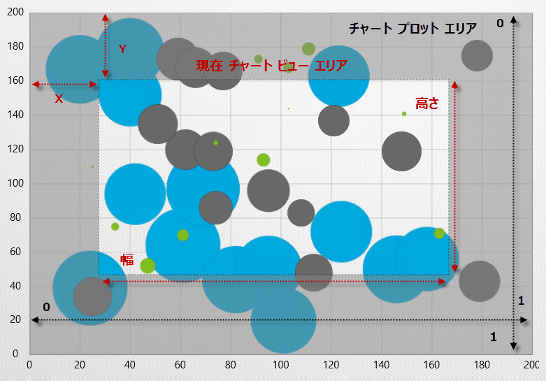

////

|metadata|
{
    "name": "datachart-navigating-chart-using-code",
    "controlName": [],
    "tags": [],
    "guid": "1255e096-e063-484b-8078-442482722843",  
    "buildFlags": [],
    "createdOn": "2014-09-25T16:46:53.2302702Z"
}
|metadata|
////

= コードを使用してチャートをナビゲート

== トピックの概要

=== 目的

このトピックは、 link:{DataChartLink}.{DataChartName}.html[{DataChartName}] コントロールでコンテンツをナビゲートする方法を提供します。

=== 前提条件

以下の表は、このトピックを理解するための前提条件として必要なトピックを示しています。

[options="header", cols="a,a"]
|====
|トピック|目的

| link:datachart-datachart.html[{DataChartName}]
|このトピックでは、 _{DataChartName}_ コントロールの主な機能の概要を提供します。

| link:datachart-chart-navigation.html[チャート ナビゲーション]
|このトピックでは、 _{DataChartName}_ コントロールでナビゲーションを使用する上での情報を提供します。

|====

=== このトピックの内容

このトピックは、以下のセクションで構成されます。

* <<NavigationProperties,ナビゲーション プロパティ>>
* <<CodeExample,コード例>>

ifdef::sl,wpf,win-rt,win-forms[]
* <<RelatedContent,関連コンテンツ>>

endif::sl,wpf,win-rt,win-forms[]

[[NavigationProperties]]
== ナビゲーション プロパティ

{DataChartName} コントロールはチャートでパンまたはズームのアクションが実行されるたびに更新される複数のナビゲーション プロパティを提供します。以下の表では、チャート コントロールでのビゲーション プロパティを示しています。

[options="header", cols="a,a,a,a"]
|====
|プロパティ|タイプ|説明|デフォルト値

|
* link:{DataChartLinkBase}.{DataChartBase}{ApiProp}windowpositionhorizontal.html[WindowPositionHorizontal] 

|double
|{DataChartName} コントロールによって表示されるコンテンツ表示長方形の X 部分。
|NaN 

X 軸の左側に配置されたチャート コンテンツを表示します。

|
* link:{DataChartLinkBase}.{DataChartBase}{ApiProp}windowpositionvertical.html[WindowPositionVertical] 

|double
|{DataChartName} コントロールによって表示されるコンテンツ表示長方形の Y 部分。
|NaN 

Y 軸の上に配置されたチャート コンテンツを表示します。

|
* link:{DataChartLinkBase}.{DataChartBase}{ApiProp}windowrect.html[WindowRect] 

|Rect
|{DataChartName} の現在表示されている部分
|0, 0, 1, 1 

チャート コンテンツ全体を表示します。

|
* link:{DataChartLink}.{DataChartName}{ApiProp}windowscalehorizontal.html[WindowScaleHorizontal] 

|double
|{DataChartName} コントロールによって表示されるコンテンツ表示長方形の幅部分。
|NaN 

X 軸に沿って配置されたチャート コンテンツを表示します。

|
* link:{DataChartLink}.{DataChartName}{ApiProp}windowscalevertical.html[WindowScaleVertical] 

|double
|{DataChartName} コントロールによって表示されるコンテンツ表示長方形の高さ部分。
|NaN 

Y 軸に沿ってチャート コンテンツを表示します。

|====

図 1: ナビゲーション プロパティの値が可視に設定されている {DataChartName} コントロール

[[CodeExample]]
== コード例

{DataChartName} コントロールのナビゲーションは、表 2 に示されたプロパティ値を変更することで、コード ビハインドから管理できます。以下のコードは、コード ビハインドからチャートのズームおよびパンを行う方法を示します。

ifdef::wpf[]

*Visual Basic の場合:*

----
'  0.05 の係数でズーム イン
Me.DataChart.WindowScaleHorizontal -= 0.05
Me.DataChart.WindowScaleVertical -= 0.05
' 0.05 の係数でズーム アウト
Me.DataChart.WindowScaleHorizontal += 0.05
Me.DataChart.WindowScaleVertical += 0.05
' 0.05 の係数でパンアップ (北方向) します
Me.DataChart.WindowPositionVertical -= 0.05
' 0.05 の係数でパンダウン (南方向) します
Me.DataChart.WindowPositionVertical += 0.05
' 0.05 の係数でパンレフト (西方向) します
Me.DataChart.WindowPositionHorizontal -= 0.05
' 0.05 の係数でパンライト (東方向) します
Me.DataChart.WindowPositionHorizontal += 0.05
----

endif::wpf[]

ifdef::win-forms[]

*Visual Basic の場合:*

----
'  0.05 の係数でズーム イン
Me.DataChart.WindowScaleHorizontal -= 0.05
Me.DataChart.WindowScaleVertical -= 0.05
' 0.05 の係数でズーム アウト
Me.DataChart.WindowScaleHorizontal += 0.05
Me.DataChart.WindowScaleVertical += 0.05
' 0.05 の係数でパンアップ (北方向) します
Me.DataChart.WindowPositionVertical -= 0.05
' 0.05 の係数でパンダウン (南方向) します
Me.DataChart.WindowPositionVertical += 0.05
' 0.05 の係数でパンレフト (西方向) します
Me.DataChart.WindowPositionHorizontal -= 0.05
' 0.05 の係数でパンライト (東方向) します
Me.DataChart.WindowPositionHorizontal += 0.05
----

endif::win-forms[]

ifdef::wpf[]

*C# の場合:*

----
// 0.05 の係数でズーム イン
this.DataChart.WindowScaleHorizontal -= 0.05;
this.DataChart.WindowScaleVertical -= 0.05;
// 0.05 の係数でズーム アウト
this.DataChart.WindowScaleHorizontal += 0.05;
this.DataChart.WindowScaleVertical += 0.05;
// 0.05 の係数でパンアップ (北方向) します
this.DataChart.WindowPositionVertical -= 0.05;
// 0.05 の係数でパンダウン (南方向) します
this.DataChart.WindowPositionVertical += 0.05;
// 0.05 の係数でパンレフト (西方向) します
this.DataChart.WindowPositionHorizontal -= 0.05;
// 0.05 の係数でパンライト (東方向) します
this.DataChart.WindowPositionHorizontal += 0.05;
----

endif::wpf[]

ifdef::win-forms[]

*C# の場合:*

----
// 0.05 の係数でズーム イン
this.DataChart.WindowScaleHorizontal -= 0.05;
this.DataChart.WindowScaleVertical -= 0.05;
// 0.05 の係数でズーム アウト
this.DataChart.WindowScaleHorizontal += 0.05;
this.DataChart.WindowScaleVertical += 0.05;
// 0.05 の係数でパンアップ (北方向) します
this.DataChart.WindowPositionVertical -= 0.05;
// 0.05 の係数でパンダウン (南方向) します
this.DataChart.WindowPositionVertical += 0.05;
// 0.05 の係数でパンレフト (西方向) します
this.DataChart.WindowPositionHorizontal -= 0.05;
// 0.05 の係数でパンライト (東方向) します
this.DataChart.WindowPositionHorizontal += 0.05;
----

endif::win-forms[]

ifdef::xamarin[]

*C# の場合:*

----
// 0.05 の係数でズーム イン
this.DataChart.WindowScaleHorizontal -= 0.05;
this.DataChart.WindowScaleVertical -= 0.05;
// 0.05 の係数でズーム アウト
this.DataChart.WindowScaleHorizontal += 0.05;
this.DataChart.WindowScaleVertical += 0.05;
// 0.05 の係数でパンアップ (北方向) します
this.DataChart.WindowPositionVertical -= 0.05;
// 0.05 の係数でパンダウン (南方向) します
this.DataChart.WindowPositionVertical += 0.05;
// 0.05 の係数でパンレフト (西方向) します
this.DataChart.WindowPositionHorizontal -= 0.05;
// 0.05 の係数でパンライト (東方向) します
this.DataChart.WindowPositionHorizontal += 0.05;
----

endif::xamarin[]

ifdef::android[]

*Java の場合:*

[source,js]
----
// 0.05 の係数でズーム イン
chart.setWindowScaleHorizontal(chart.getWindowScaleHorizontal() - 0.05);
chart.setWindowScaleVertical(chart.getWindowScaleVertical() - 0.05);
// 0.05 の係数でズーム アウト
chart.setWindowScaleHorizontal(chart.getWindowScaleHorizontal() + 0.05);
chart.setWindowScaleVertical(chart.getWindowScaleVertical() + 0.05);
// 0.05 の係数でパンアップ (北方向) します
chart.setWindowPositionVertical(chart.getWindowPositionVertical() - 0.05);
// 0.05 の係数でパンダウン (南方向) します
chart.setWindowPositionVertical(chart.getWindowPositionVertical() + 0.05);
// 0.05 の係数でパンレフト (西方向) します
chart.setWindowPositionHorizontal(chart.getWindowPositionHorizontal() - 0.05);
// 0.05 の係数でパンライト (東方向) します
chart.setWindowPositionHorizontal(chart.getWindowPositionHorizontal() + 0.05);
----

endif::android[]

[[NavigationProperties]]
== ナビゲーション メソッド

カテゴリ軸および数値軸に 2 つのメソッドがあり、コードによって指定した項目または範囲へ移動するために呼び出すことができます。このメソッドは ScrollIntoView および ScrollRangeIntoView と呼ばれます。指定した項目または範囲を中央に表示するためにチャートの link:{DataChartLinkBase}.{DataChartBase}{ApiProp}windowrect.html[WindowRect] を自動的に更新します。

CategoryXAxis および CategoryYAxis の場合、link:{DataChartLink}.CategoryXAxis{ApiProp}ScrollIntoView.html[ScrollIntoView] は表示するカテゴリのデータ項目を取得します。link:{DataChartLink}.CategoryXAxis{ApiProp}ScrollRangeIntoView.html[ScrollRangeIntoView] は、表示する最小および最大のカテゴリ インデックスを取得します。インデックスは、ItemsSource 内の項目と関連します。

CategoryDateTimeXAxis の場合、link:{DataChartLink}.CategoryDateTimeXAxis{ApiProp}ScrollIntoView.html[ScrollIntoView] メソッドのみが利用可能ですが、表示する日付の最大および最小の範囲を使用できます。 

NumericXAxis および NumericYAxis の場合、link:{DataChartLink}.NumericXAxis{ApiProp}ScrollRangeIntoView.html[ScrollRangeIntoView] のみ利用可能です。このメソッドは、表示する軸の最大値および最小値を取得します。

ifdef::sl,wpf,win-rt,win-forms,xamarin[]

[[RelatedContent]]
== 関連コンテンツ

=== トピック

このトピックの追加情報については、以下のトピックも合わせてご参照ください。

[options="header", cols="a,a"]
|====
| *トピック* | *目的* 

ifdef::sl,wpf,win-rt,win-forms[]
| link:datachart-navigating-chart-using-moue-and-keyboard.html[マウスおよびキーボードでチャートをナビゲート]
|このトピックは情報を提供します
endif::sl,wpf,win-rt,win-forms[]

ifdef::wpf,win-phone,win-rt,xamarin[]
| link:datachart-navigating-chart-using-touch-gestures.html[タッチ ジェスチャを使用してチャートをナビゲート]
|このトピックは情報を提供します
endif::wpf,win-phone,win-rt,xamarin[]

ifdef::sl,wpf[]
| link:datachart-navigating-chart-using-overview-plus-detail-pane.html[概要と詳細ペインを使用してチャートをナビゲート]
|このトピックは情報を提供します
endif::sl,wpf[]

|====

endif::sl,wpf,win-rt,win-forms,xamarin[]