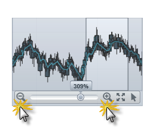
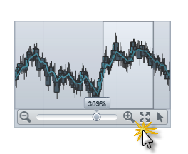
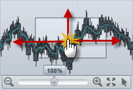
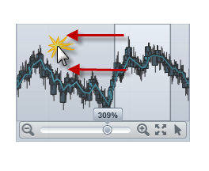

////

|metadata|
{
    "name": "datachart-navigating-chart-using-overview-plus-detail-pane",
    "controlName": ["{DataChartName}"],
    "tags": ["Charting","Tips and Tricks"],
    "guid": "9a69e44c-e6c7-4c18-8cea-271aed9a5d73",  
    "buildFlags": ["WPF","SL"],
    "createdOn": "2014-06-05T19:39:00.7094021Z"
}
|metadata|
////

= 概要と詳細ペインを使用してチャートをナビゲート

== トピックの概要

=== 目的

このトピックは、 link:{DataChartLink}.{DataChartName}.html[{DataChartName}]™ コントロールでコンテンツをナビゲートするために link:{ApiPlatform}datavisualization{ApiVersion}~infragistics.controls.xamoverviewplusdetailpane_members.html[xamOverviewPlusDetailPane]™ コントロールを使用する方法を示します。

=== 前提条件

以下の表は、このトピックを理解するための前提条件として必要なトピックを示しています。

[options="header", cols="a,a"]
|====
|トピック|目的

| link:datachart-datachart.html[{DataChartName}]
|このトピックでは、 _{DataChartName}_ コントロールの主な機能の概要を提供します。

| link:datachart-chart-navigation.html[チャート ナビゲーション]
|このトピックでは、 _{DataChartName}_ コントロールでナビゲーションを使用する上での情報を提供します。

|====

=== このトピックの内容

このトピックは、以下のセクションで構成されます。

* <<_Ref321140025, チャートの概要ペイン >>

** <<_Ref320185129,概要>>
** <<_Ref321140031,プレビュー>>
** <<_Ref321140034,例>>

* <<_Ref321140037, ユーザー相互作用と操作性 >>

** <<_Ref321140041,ユーザー インタラクションの概要>>
** <<_Ref321140043,チャートを増分でズーム>>
** <<_Ref321140046,チャートを特定のレベルにズーム>>
** <<_Ref321140051,チャートを 100% のズーム レベルにリセット>>
** <<_Ref321140055,すべての方向にチャートをパン>>
** <<_Ref321140058,チャートの特定領域にパン>>
** <<_Ref321140062,チャートでマウス ドラッグ相互作用を変更>>

* <<_Ref320185294, 関連コンテンツ >>

[[_Ref321140025]]
== チャートの概要ペイン

[[_Ref320185129]]

=== 概要

_{DataChartName}_   コントロールでは、チャート コンテンツの概要は xamOverviewPlusDetailPane コントロールによって表されます。このコントロールは、サポートされるシリーズのすべてのタイプおよびナビゲーション機能のプレビューを提供します。

[[_Ref321140031]]

=== プレビュー

以下は、 link:{DataChartLink}.financialpriceseries_members.html[FinancialPriceSeries] を使用して財務データを表示する  _{DataChartName}_   コントロールの概要が含まれる  _xamOverviewPlusDetailPane_   コントロールのプレビューです。

image::images/xamDataChart_Navigating_Chart_Using_Overview_Plus_Detail_Pane_1.png[]

[[_Ref321140034]]

=== 例

以下のコードは、 _{DataChartName}_   コントロールの右上角に xamOverviewPlusDetailPane コントロールを表示する方法を示します。

ifdef::wpf,win-universal[]

*XAML の場合:*

[source,xaml]
----
<ig:{DataChartName} x:Name="DataChart" 
      OverviewPlusDetailPaneVisibility="Visible"
      OverviewPlusDetailPaneHorizontalAlignment="Right"
      OverviewPlusDetailPaneVerticalAlignment="Top">
</ig:{DataChartName}>
----

endif::wpf,win-universal[]

ifdef::wpf[]

*Visual Basic の場合:*

[source,vb]
----
Dim DataChart As New {DataChartName}()
DataChart.OverviewPlusDetailPaneHorizontalAlignment = HorizontalAlignment.Right
DataChart.OverviewPlusDetailPaneVerticalAlignment = VerticalAlignment.Top
DataChart.OverviewPlusDetailPaneVisibility = Visibility.Visible
----

endif::wpf[]

ifdef::win-forms[]

*Visual Basic の場合:*

[source,vb]
----
Dim DataChart As New {DataChartName}()
DataChart.OverviewPlusDetailPaneHorizontalAlignment = HorizontalAlignment.Right
DataChart.OverviewPlusDetailPaneVerticalAlignment = VerticalAlignment.Top
DataChart.OverviewPlusDetailPaneVisibility = Visibility.Visible
----

endif::win-forms[]

ifdef::xamarin[]

*Visual Basic の場合:*

[source,vb]
----
Dim DataChart As New {DataChartName}()
DataChart.OverviewPlusDetailPaneHorizontalAlignment = HorizontalAlignment.Right
DataChart.OverviewPlusDetailPaneVerticalAlignment = VerticalAlignment.Top
DataChart.OverviewPlusDetailPaneVisibility = Visibility.Visible
----

endif::xamarin[]

ifdef::wpf[]

*C# の場合:*

[source,csharp]
----
var DataChart = new {DataChartName}();
DataChart.OverviewPlusDetailPaneHorizontalAlignment = HorizontalAlignment.Right;
DataChart.OverviewPlusDetailPaneVerticalAlignment = VerticalAlignment.Top;
DataChart.OverviewPlusDetailPaneVisibility = Visibility.Visible;
----

endif::wpf[]

ifdef::win-forms[]

*C# の場合:*

[source,csharp]
----
var DataChart = new {DataChartName}();
DataChart.OverviewPlusDetailPaneHorizontalAlignment = HorizontalAlignment.Right;
DataChart.OverviewPlusDetailPaneVerticalAlignment = VerticalAlignment.Top;
DataChart.OverviewPlusDetailPaneVisibility = Visibility.Visible;
----

endif::win-forms[]

ifdef::xamarin[]

*C# の場合:*

[source,csharp]
----
var DataChart = new {DataChartName}();
DataChart.OverviewPlusDetailPaneHorizontalAlignment = HorizontalAlignment.Right;
DataChart.OverviewPlusDetailPaneVerticalAlignment = VerticalAlignment.Top;
DataChart.OverviewPlusDetailPaneVisibility = Visibility.Visible;
----

endif::xamarin[]

[[_Ref321140037]]
== ユーザー相互作用と操作性

[[_Ref321140041]]

=== ユーザー インタラクションの概要

以下の表で、xamOverviewPlusDetailPane コントロールのユーザー相互作用機能を簡単に説明します。

[options="header", cols="a,a,a"]
|====
|目的|方法|詳細

|チャートを増分でズームします
|マウスのスクロール ホイールまたは xamOverviewPlusDetailPane コントロールの拡大/縮小ボタン。
|xamOverviewPlusDetailPane コントロールの拡大/縮小ボタンをクリックするか、プレビュー領域上でマウス ホイールをスクロールして、チャート コンテンツを拡大/縮小します。

|チャートを特定のレベルに拡大
|xamOverviewPlusDetailPane コントロールのズーム スライダー。
|_xamOverviewPlusDetailPane_ コントロールのズーム スライダーを変更して、特定のズーム レベルにチャート コンテンツを拡大/縮小します。

|チャートを 100% のズーム レベルにリセット
|xamOverviewPlusDetailPane コントロールのズーム リセット ボタン。
|_xamOverviewPlusDetailPane_ コントロールのズーム リセット ボタンをクリックし、チャートを 100% のズーム レベルにリセットします。

|すべての方向にチャートをパン
|xamOverviewPlusDetailPane コントロールのウィンドウ四角形。
|_xamOverviewPlusDetailPane_ コントロールのプレビュー領域でウィンドウ四角形をドラッグすると、指定した方向にチャート コンテンツがパンされます。

|チャートの特定領域にパン
|xamOverviewPlusDetailPane コントロールのプレビュー領域。
|_xamOverviewPlusDetailPane_ コントロールのプレビュー領域でウィンドウ四角形の外側をクリックすると、マウス カーソルがクリックされたチャート領域にチャート コンテンツがパンされます。

|チャートでマウス ドラッグ相互作用を変更
|xamOverviewPlusDetailPane コントロールのカーソル ボタン。
|_xamOverviewPlusDetailPane_ コントロールのカーソル ボタンをクリックすると、マウスのドラッグでパンするかマウスのドラッグ相互作用でズームするために、チャートでのマウス ドラッグ相互作用を変更します。

|====

[[_Ref321140043]]

=== チャートを増分で拡大

以下の写真は、 _xamOverviewPlusDetailPane_   コントロールのマウスの拡大/縮小ボタンを使用して、チャートを増分でズームする方法を説明します。

[[_Ref321140046]]

=== チャートを特定のレベルに拡大

以下の写真は、 _xamOverviewPlusDetailPane_   コントロールのズーム スライダーを使用して、チャートを特定のレベルでズームする方法を説明します。

image::images/xamDataChart_Navigating_Chart_Using_Overview_Plus_Detail_Pane_3.png[]

[[_Ref321140051]]

=== チャートを 100% のズーム レベルにリセット

以下の写真は、 _xamOverviewPlusDetailPane_   コントロールのズーム リセット ボタンを使用して、チャートを 100% のズーム レベルにする方法を説明します。

[[_Ref321140055]]

=== すべての方向にチャートをパン

以下の写真は、 _xamOverviewPlusDetailPane_   コントロールのウィンドウ四角形を使用して、すべての方向にチャートをパンする方法を説明します。

[[_Ref321140058]]

=== チャートの特定領域をパン

以下の写真は、 _xamOverviewPlusDetailPane_   コントロールのウィンドウ四角形を使用して、チャートの特定領域にチャートをパンする方法を説明します。

[[_Ref321140062]]

=== チャートでマウス ドラッグ相互作用を変更

以下の写真は、 _xamOverviewPlusDetailPane_   コントロールのカーソル ボタンを使用して、チャートでのマウス ドラッグ相互作用を変更する方法を説明します。

image::images/xamDataChart_Navigating_Chart_Using_Overview_Plus_Detail_Pane_7.png[]

[[_Ref320185294]]
== 関連コンテンツ

=== トピック

このトピックの追加情報については、以下のトピックも合わせてご参照ください。

[options="header", cols="a,a"]
|====
| *トピック* | *目的* 

| link:datachart-navigating-chart-using-code.html[コードを使用してチャートをナビゲート]
|このトピックは情報を提供します

ifdef::sl,wpf,win-rt,win-forms[]
| link:datachart-navigating-chart-using-moue-and-keyboard.html[マウスおよびキーボードでチャートをナビゲート]
|このトピックは情報を提供します
endif::sl,wpf,win-rt,win-forms[]

ifdef::wpf,win-phone,win-rt[]
| link:datachart-navigating-chart-using-touch-gestures.html[タッチ ジェスチャを使用してチャートをナビゲート]
|このトピックは情報を提供します
endif::wpf,win-phone,win-rt[]

|====