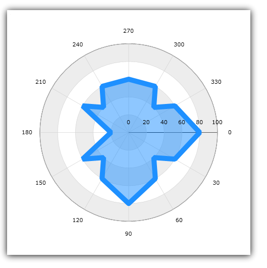
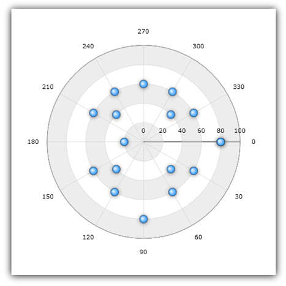
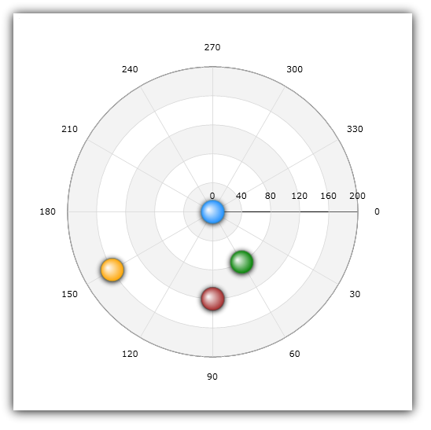
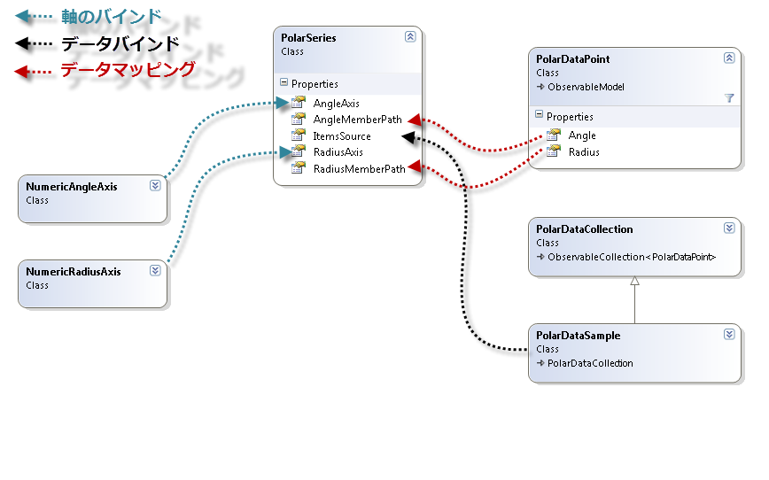
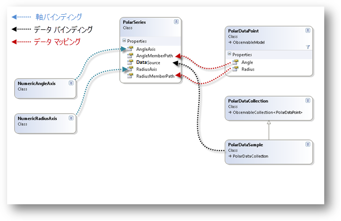

////

|metadata|
{
    "name": "datachart-polar-series-overview",
    "controlName": ["{DataChartName}"],
    "tags": ["Charting","Getting Started"],
    "guid": "86568801-db3c-4336-9f89-04c8942853d9",  
    "buildFlags": [],
    "createdOn": "2014-06-05T19:39:00.5493377Z"
}
|metadata|
////

= 極座標シリーズ

このトピックは、link:{DataChartLink}.{DataChartName}.html[{DataChartName}]™ コントロールの極座標シリーズでサポートされているすべてのタイプについて情報を提供します。

=== このトピックの内容

このトピックは、以下のセクションで構成されます。

* <<_Introduction,概要>>
* <<_Types,極座標シリーズのタイプ>>
* <<_Preview,極座標シリーズのプレビュー>>
* <<_SimilarSeries,同様のシリーズ>>
* <<_SupportedAxes,サポートされる軸>>
* <<_Coordinate,極座標系>>
* <<_DataBinding,データ バインディング>>
** <<_DataRequirements,データ要件>>
** <<_DataSample,データの例>>
** <<_BindingDiagram,バインディング ダイアグラム>>
* <<_RelatedTopics,関連トピック>>

[[Introduction]]
== 概要

`{DataChartName}` コントロールで、極座標シリーズは、チャートにデータをプロットするためにデカルト座標系 (x, y) の代わりに、極座標 (角度、半径) 系を使用するシリーズのグループです。言い換えれば、極座標シリーズは link:datachart-scatter-series-overview.html[散布図シリーズ]の概念を使用していますが、横の線に沿って伸びるのではなく、円の周りでデータ ポイントをラップします。このシリーズのグループは、極座標系を使用して複数の異なるデータのシリーズ内の項目間の関係を示すために使用されます。

極座標シリーズでは、データの不均等な散らばり方やデータの塊に注意が向けられます。これらは、科学データのプロットによく用いられ (たとえば風向きや風速、地場の方向と強さ、ソーラー システムの機材の場所など)、予測結果からの収集データの偏差を強調表示できます。

[[_Types]]
== 極座標シリーズのタイプ

{DataChartName} コントロールは、以下のタイプの極座標シリーズをサポートし、それぞれについては個別のトピックで説明します:

* link:datachart-polar-area-series.html[極座標エリア シリーズ]
* link:datachart-polar-line-series.html[極座標ライン シリーズ]
* link:datachart-polar-scatter-series.html[極座標散布図シリーズ]
* link:datachart-polar-spline-series.html[極座標スプライン シリーズ]
* link:datachart-polar-spline-area-series.html[極座標スプライン エリア シリーズ]

以上のトピックは、特定のタイプの極座標シリーズの作成方法とデータをバインドする方法を示します。

[[_Preview]]
== 極座標シリーズのプレビュー

このセクションは、極座標シリーズのすべてのタイプのプレビューを提供します。

図 1: 極座標エリア シリーズの例

image::images/xamDataChart_Polar_Series_02.png[]

図 2: 極座標ライン シリーズの例

図 3: 極座標散布図シリーズの例

image::images/xamDataChart_Polar_Series_04.png[]

図 4: 極座標スプライン シリーズの例

image::images/xamDataChart_Polar_Series_05.png[]

図 5: 極座標スプライン エリア シリーズの例

[[_SimilarSeries]]
== 同様のシリーズ

いくつかの極座標シリーズは散布シリーズとほぼ同じです。以下の表は、極座標シリーズ タイプを散布シリーズ タイプにマッピングしてシリーズ タイプ間の類似点を示します。

[options="header", cols="a,a"]
|====
|ラジアル シリーズ タイプ|散布図シリーズ タイプ

| link:{DataChartLink}.polarareaseries.html[PolarAreaSeries]
|なし

| link:{DataChartLink}.polarlineseries.html[PolarLineSeries]
| link:{DataChartLink}.scatterlineseries.html[ScatterLineSeries]

| link:{DataChartLink}.polarscatterseries.html[PolarScatterSeries]
| link:{DataChartLink}.scatterseries.html[ScatterSeries]

| link:{DataChartLink}.polarsplineareaseries.html[PolarSplineAreaSeries]
|なし

| link:{DataChartLink}.polarsplineseries.html[PolarSplineSeries]
| link:{DataChartLink}.scattersplineseries.html[ScatterSplineSeries]

|====

[[_SupportedAxes]]
== サポートされる軸

{DataChartName} コントロールは、さまざまな軸タイプを提供しますが、以下の2 つの軸タイプのみすべての極座標シリーズで使用できます。以下の表に、サポートされる軸を示します。

[options="header", cols="a,a,a"]
|====
|シリーズ タイプ| 半径軸タイプ | 角度軸タイプ
|`PolarAreaSeries` 
|link:{DataChartLink}.NumericRadiusAxis.html[NumericRadiusAxis]
|link:{DataChartLink}.NumericAngleAxis.html[NumericAngleAxis]
 
|`PolarLineSeries` 
|link:{DataChartLink}.NumericRadiusAxis.html[NumericRadiusAxis]
|link:{DataChartLink}.NumericAngleAxis.html[NumericAngleAxis]
 
|`PolarScatterSeries` 
|link:{DataChartLink}.NumericRadiusAxis.html[NumericRadiusAxis]
|link:{DataChartLink}.NumericAngleAxis.html[NumericAngleAxis]
 
|`PolarSplineAreaSeries` 
|link:{DataChartLink}.NumericRadiusAxis.html[NumericRadiusAxis]
|link:{DataChartLink}.NumericAngleAxis.html[NumericAngleAxis]
 
|`PolarSplineSeries`  
|link:{DataChartLink}.NumericRadiusAxis.html[NumericRadiusAxis]
|link:{DataChartLink}.NumericAngleAxis.html[NumericAngleAxis]
|====

.注:
[NOTE]
====
極座標シリーズは link:{DataChartLink}.CategoryAngleAxis.html[CategoryAngleAxis] タイプをサポートしません。`NumericRadiusAxis` と `CategoryAngleAxis` で 1 つの数値データ列をプロットする場合はlink:datachart-radial-series-overview.html[ラジアル シリーズ]のトピックを参照してください。
====

さらに、各極座標シリーズは link:{DataChartLink}.PolarBase{ApiProp}AngleAxis.html[AngleAxis] プロパティを使用する 1 つの角度軸と link:{DataChartLink}.PolarBase{ApiProp}RadiusAxis.html[RadiusAxis] プロパティを使用する 1 つの半径軸にバインドを設定する必要があります。軸についての詳細は、次のトピックを参照してください。

* link:datachart-using-numeric-angle-axis.html[数値角度軸の使用] 
* link:datachart-using-numeric-radius-axis.html[数値半径軸の使用] 
* link:datachart-axes.html[チャート軸]

[[_Coordinate]]
== 極座標系

極座標系では、データ ポイントの位置は固定された方向からの角度 (角度座標) と、極と呼ばれる固定点 (デカルト座標の基点に似ている) からの距離 (半径座標) によって決定されます。極から始まって外側を指す線は角度軸 (NumericAngleAxis) のグリッド線で、極を囲む同心円状の輪は半径軸 (NumericRadiusAxis) のグリッド線です。軸の使用方法については、 link:datachart-axes.html[「チャート軸」]トピックを参照してください。

図 6 は、極座標系のさまざまなな場所で 4 つのデータ ポイントがある link:{DataChartLink}.polarscatterseries.html[PolarScatterSeries] を示しています:

* 青のポイントは極座標チャートの中央に置かれます (0,0 は極座標系の極) 
* 赤のポイントは、120 のラジアル座標と 90 の角度座標です (120, 90) 
* 緑のポイントは、80 のラジアル座標と 60 の角度座標です (80, 60) 
* オレンジのポイントは、160 のラジアル座標と 150 の角度座標です (160, 150) 

図 6: {DataChartName} コントロールの極座標でのデータ プロットの概略図

[[_DataBinding]]
== データ バインディング

このセクションではデータ要件からデータ例、バインディング ダイアグラムまでのすべてのタイプの極座標シリーズに対するバインディング データについての情報を提供します。

[[_DataRequirements]]
==== データ要件

{DataChartName} コントロールの他のシリーズ タイプと同様、極座標シリーズも link:{DataChartLink}.Series~{ApiDataSource}.html[{ApiDataSource}] プロパティを使用してデータをバインドします。以下は、極座標シリーズのデータ要件のリストです。

* データ モデルは、極座標シリーズ (link:{DataChartLink}.PolarLineSeries.html[PolarLineSeries]) の link:{DataChartLink}.PolarBase{ApiProp}AngleMemberPath.html[AngleMemberPath] プロパティを使用してマップする数値データ列 (Angle など) を少なくとも 1 列含む必要があります。 
* データ モデルは、極座標シリーズ (link:{DataChartLink}.PolarLineSeries.html[PolarLineSeries]) の link:{DataChartLink}.PolarBase{ApiProp}RadiusMemberPath.html[RadiusMemberPath] プロパティを使用してマップする数値データ列を少なくとも 2 列含む必要があります。
* データソースはデータ項目を少なくとも 1 つ含む必要があります。含まない場合はチャートはカテゴリ シリーズを描画しません。
* データ ソースは link:http://msdn.microsoft.com/ja-jp/library/system.collections.ienumerable.aspx[IEnumerable] インターフェイス (link:http://msdn.microsoft.com/ja-jp/library/6sh2ey19.aspx[List], link:http://msdn.microsoft.com/ja-jp/library/ms132397.aspx[Collection], link:http://msdn.microsoft.com/ja-jp/library/7977ey2c.aspx[Queue], link:http://msdn.microsoft.com/ja-jp/library/system.collections.stack.aspx[Stack] など) を実装しなければなりません。
 
特定のシリーズ タイプの要件については、link:datachart-series-requirements.html[シリーズ要件]トピックを参照してください。

[[_DataSample]]
==== データの例

上記の基準を満たすオブジェクトに link:resources-sample-polar-data.html[PolarDataSource] があり、ダウンロードしてプロジェクトで使用できます。

[[_BindingDiagram]]
==== バインディング ダイアグラム

以下の図は、{DataChartName} コントロールで動作する極座標シリーズにデータをバインドする方法を示します。

ifdef::xaml,xamarin[]

endif::xaml,xamarin[]

ifdef::win-forms,android[]

endif::win-forms,android[]

[[_RelatedTopics]]
== 関連コンテンツ

* link:datachart-series-requirements.html[シリーズ要件]
* link:datachart-using-numeric-angle-axis.html[数値角度軸の使用]
* link:datachart-using-numeric-radius-axis.html[数値半径軸の使用]
* link:datachart-polar-area-series.html[極座標エリア シリーズ]
* link:datachart-polar-line-series.html[極座標ライン シリーズ]
* link:datachart-polar-scatter-series.html[極座標散布図シリーズ]
* link:datachart-polar-spline-series.html[極座標スプライン シリーズ]
* link:datachart-polar-spline-area-series.html[極座標スプライン エリア シリーズ]