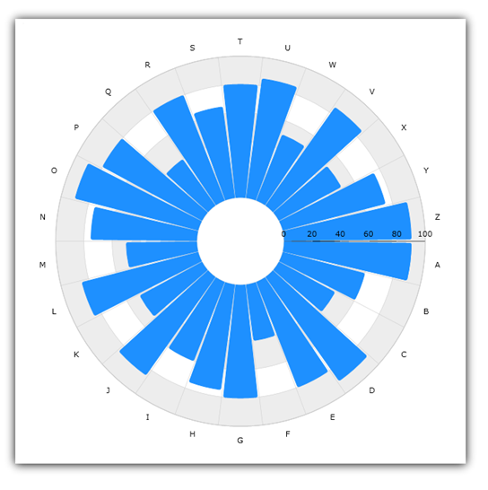
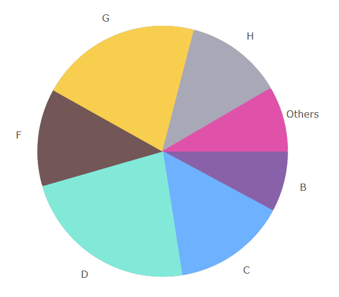

////

|metadata|
{
    "name": "datachart-radial-pie-series",
    "controlName": ["{DataChartName}"],
    "tags": ["Charting","Data Binding","Data Presentation","Sample Data Source"],
    "guid": "bf906ebd-3585-41b1-8783-c3a32b6fb642",  
    "buildFlags": [],
    "createdOn": "2014-06-05T19:39:00.547337Z"
}
|metadata|
////

= ラジアル円シリーズ

このトピックは、コード例を示してラジアル円シリーズを link:{DataChartLink}.{DataChartName}.html[{DataChartName}] コントロールで使用する方法を説明します。

== 概要

ラジアル円シリーズは、チャートの中心からデータ ポイントの位置に向けて広がる円スライスを使用します。link:{DataChartLink}.radialpieseries.html[RadialPieSeries] は、データポイントの複数シリーズを分類する概念を使用していますが、横の線に沿って伸びるのではなく、円の周りでデータ ポイントをラップします。このシリーズのグループの詳細については、 link:datachart-radial-series-overview.html[ラジアル シリーズ]を参照してください。

== プレビュー

図 1 は、{DataChartName} コントロールにプロットされた時にラジアル円シリーズがどのように表示されるのかを示します。

図 1: RadialPieSeries の実装例

== データ バインディング

以下のコードは、サンプルのラジアル データ (link:resources-sample-category-data.html[サンプル カテゴリ データ]リソースからダウンロードで入手可能) を RadialPieSeries にバインドする方法を示します。この例は {DataChartName} コントロール用のプロジェクトを設定済みであることを前提としています。

ifdef::sl,wpf,win-universal[]

*XAML の場合:*

[source,xaml]
----
xmlns:local="clr-namespace:Infragistics.Models;assembly=YourAppName"
...
<ig:{DataChartName} x:Name="DataChart">
    <ig:{DataChartName}.Resources>
        <models:CategoryDataSource x:Key="data" />
        <SolidColorBrush x:Key="AxisStripBrush" Color="LightGray" Opacity=".4" />
    </ig:{DataChartName}.Resources>
    <ig:{DataChartName}.Axes>
        <ig:CategoryAngleAxis x:Name="angleAxis"
                              Interval="1"
                              Label="{}{Category}" 
                              ItemsSource="{StaticResource data}">
        </ig:CategoryAngleAxis>
        <ig:NumericRadiusAxis x:Name="radiusAxis" 
                              Strip="{StaticResource AxisStripBrush}"                                      
                              MinimumValue="0"
                              MaximumValue="150"
                              Interval="50"
                              RadiusExtentScale="0.8"
                              InnerRadiusExtentScale="0.2">
        </ig:NumericRadiusAxis>
    </ig:{DataChartName}.Axes>
    <ig:{DataChartName}.Series>
        <ig:RadialPieSeries AngleAxis="{Binding ElementName=angleAxis}"
                             ValueAxis="{Binding ElementName=radiusAxis}"
                             ValueMemberPath="Value"
                             Brush="#7F58A6C7"
                             MarkerType="None"
                             Outline="#FF58A6C7"
                             Thickness="5"
                             ItemsSource="{StaticResource data}">
        </ig:RadialPieSeries>
    </ig:{DataChartName}.Series>
</ig:{DataChartName}>
----
endif::sl,wpf,win-universal[]

ifdef::xamarin[]
*XAML の場合:*
[source,xaml]
----
xmlns:local="clr-namespace:Infragistics.Models;assembly=YourAppName"
...
<ig:{DataChartName} x:Name="DataChart">
    <ig:{DataChartName}.Resources>
		<ResourceDictionary>
			<local:CategoryDataSource x:Name="data" />
		</ResourceDictionary>	
    </ig:{DataChartName}.Resources>
    <ig:{DataChartName}.Axes>
        <ig:CategoryAngleAxis x:Name="angleAxis"
                              Interval="1"
                              Label="Category" 
                              ItemsSource="{StaticResource data}">
        </ig:CategoryAngleAxis>
        <ig:NumericRadiusAxis x:Name="radiusAxis"                                    
                              MinimumValue="0"
                              MaximumValue="150"
                              Interval="50"
                              RadiusExtentScale="0.8"
                              InnerRadiusExtentScale="0.2">
        </ig:NumericRadiusAxis>
    </ig:{DataChartName}.Axes>
    <ig:{DataChartName}.Series>
        <ig:RadialPieSeries AngleAxis="{x:Reference angleAxis}"
                             ValueAxis="{x:Reference radiusAxis}"
                             ValueMemberPath="Value"
                             Brush="#7F58A6C7"
                             MarkerType="None"
                             Outline="#FF58A6C7"
                             Thickness="5"
                             ItemsSource="{StaticResource data}">
        </ig:RadialPieSeries>
    </ig:{DataChartName}.Series>
</ig:{DataChartName}>
----
endif::xamarin[]

ifdef::wpf,win-universal,win-forms,xamarin[]
*C# の場合:*
[source,csharp]
---- 
var data = new CategoryDataSource();

var angleAxis = new CategoryAngleAxis();
angleAxis.{ApiDataSource} = data;
angleAxis.Label = "{Category}";
angleAxis.Interval = 1;

var radiusAxis = new NumericRadiusAxis();
radiusAxis.MinimumValue = 0;
radiusAxis.MaximumValue = 150;
radiusAxis.Interval = 50;
radiusAxis.RadiusExtentScale = 0.8;
radiusAxis.InnerRadiusExtentScale = 0.2;

var series = new RadialPieSeries();
series.{ApiDataSource} = data; 
series.ValueMemberPath = "Value";
series.AngleAxis = angleAxis;
series.ValueAxis = radiusAxis; 
series.MarkerType = MarkerType.None;
series.Thickness = 5;

var chart = new {DataChartName}();
chart.Axes.Add(angleAxis);
chart.Axes.Add(radiusAxis);  
chart.Series.Add(series);
----
endif::wpf,win-universal,win-forms,xamarin[]

ifdef::wpf,win-universal,win-forms[]
*Visual Basic の場合:*
[source,vb]
----
Dim data As New CategoryDataSource()
Dim angleAxis As New CategoryAngleAxis()
angleAxis.{ApiDataSource} = data
angleAxis.Label = "{Category}"
angleAxis.Interval = 1

Dim radiusAxis As New NumericRadiusAxis()
radiusAxis.MinimumValue = 0
radiusAxis.MaximumValue = 150
radiusAxis.Interval = 50
radiusAxis.RadiusExtentScale = 0.8
radiusAxis.InnerRadiusExtentScale = 0.2

Dim series As New RadialPieSeries()
series.{ApiDataSource} = data 
series.ValueMemberPath = "Value"
series.AngleAxis = angleAxis
series.ValueAxis = radiusAxis
series.MarkerType = MarkerType.None
series.Thickness = 5

Dim chart As New {DataChartName}()
chart.Axes.Add(angleAxis)
chart.Axes.Add(radiusAxis)
chart.Series.Add(series)
----
endif::wpf,win-universal,win-forms[]

ifdef::android[]
*Java の場合:*
[source,java]
----
CategoryDataSource data = new CategoryDataSource();
CategoryAngleAxis angleAxis = new CategoryAngleAxis();
angleAxis.setDataSource(data);
angleAxis.setLabel("Category");
angleAxis.setInterval(1);

NumericRadiusAxis radiusAxis = new NumericRadiusAxis();
radiusAxis.setMinimumValue(0);
radiusAxis.setMaximumValue(150);
radiusAxis.setInterval(50);
radiusAxis.setRadiusExtentScale(0.8);
radiusAxis.setInnerRadiusExtentScale(0.2);

RadialPieSeries series = new RadialPieSeries();
series.setDataSource(data);
series.setValueMemberPath("Value");
series.setAngleAxis(angleAxis);
series.setValueAxis(radiusAxis);
series.setMarkerType(MarkerType.NONE);
series.setThickness(5); 

DataChartView chart = new DataChartView(root.getContext());
chart.addAxis(angleAxis);
chart.addAxis(radiusAxis);
chart.addSeries(series);
----
endif::android[]

== ProportionalCategoryAngleAxis

この軸により、チャートを円チャートのように視覚化できます。スライス間にスペースがないようにするには、gap プロパティを 0 に設定できます。この軸により、チャートを円チャートのように視覚化できます。この場合、`ValueMemberPath` にバインドされた value プロパティによってスライスの幅が決まります。スライス間にスペースがないようにするには、`Gap` プロパティを 0 に設定できます。

ifdef::sl,wpf,win-universal[]
*XAML の場合:*
[source,xaml]
----
xmlns:local="clr-namespace:Infragistics.Models;assembly=YourAppName"
...
<ig:{DataChartName} x:Name="DataChart">
<ig:XamDataChart.Axes>
    <ig:ProportionalCategoryAngleAxis x:Name="pAxis" Label="{}{Label}"
   ValueMemberPath="Value" ItemsSource="{Binding Items}"
       Gap="0" OthersCategoryType="Number"
        OthersCategoryThreshold="55"
        OthersCategoryText="Others">
    </ig:ProportionalCategoryAngleAxis>
    <!-- Supress the Numeric Radius Axis Labels for typical pie 
         where all slices have same radius -->
    <ig:NumericRadiusAxis x:Name="rAxis" MinimumValue="0"
                          MaximumValue="100">
        <ig:NumericRadiusAxis.LabelSettings>
            <ig:AxisLabelSettings Visibility="Collapsed"/>
        </ig:NumericRadiusAxis.LabelSettings>
    </ig:NumericRadiusAxis>
</ig:XamDataChart.Axes>
<ig:XamDataChart.Series>
    <ig:RadialPieSeries x:Name="series1"
            LegendRadialLabelMode="LabelAndPercentage"                     
            ItemsSource="{Binding Items}"
            ValueMemberPath="Radius"                                    
            UseItemWiseColors="True"
            AngleAxis="{Binding ElementName=pAxis}"
            ValueAxis="{Binding ElementName=rAxis}" >
    </ig:RadialPieSeries>
</ig:XamDataChart.Series>
</ig:{DataChartName}>
----
endif::sl,wpf,win-universal[]

== 関連コンテンツ

* link:datachart-series-requirements.html[シリーズ要件]
* link:datachart-using-category-angle-axis.html[カテゴリ角度軸の使用]
* link:datachart-using-numeric-radius-axis.html[数値半径軸の使用]