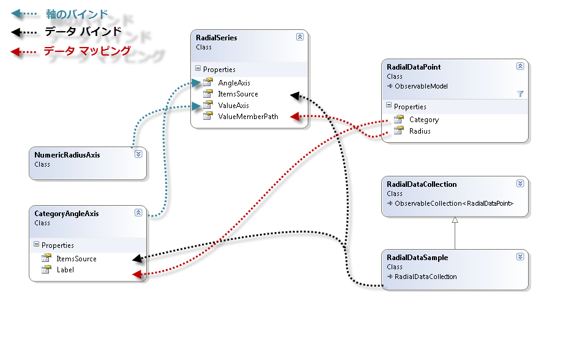
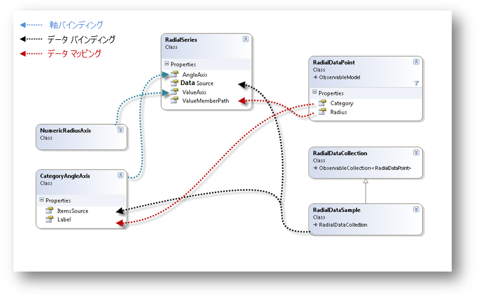

////

|metadata|
{
    "name": "datachart-radial-series-overview",
    "controlName": ["{DataChartName}"],
    "tags": ["Charting","Data Binding","Data Presentation","Sample Data Source"],
    "guid": "98311847-9620-482c-9df3-75a4736d46d1",  
    "buildFlags": [],
    "createdOn": "2014-06-05T19:39:00.5353321Z"
}
|metadata|
////

= ラジアル シリーズ

このトピックは、 link:{DataChartLink}.{DataChartName}.html[{DataChartName}] コントロールのラジアル シリーズの一般的なプロパティを説明します。

=== このトピックの内容

このトピックは、以下のセクションで構成されます。

* <<_Introduction,概要>>
* <<_Types,ラジアル シリーズのタイプ>>
* <<_Preview,ラジアル シリーズのプレビュー>> 
* <<_SimilarSeries,同様のシリーズ>>
* <<_SupportedAxes,サポートされる軸>> 
* <<DataBinding,データ バインディング>>
** <<DataRequirements,データ要件>>
** <<DataSample,データの例>>
** <<BindingDiagram,バインディング ダイアグラム>>
* <<RelatedContent,関連コンテンツ>>

[[_Introduction]]
== 概要

ラジアル シリーズは、データを取得し、円の周囲でラップされるデータ ポイントのコレクションとしてデータを描画するシリーズのグループです (link:datachart-category-series-overview.html[カテゴリ シリーズ]が行うように水平方向の線に沿って拡大するのではなく)。カテゴリ シリーズと同様、ラジアル シリーズはチャートの範囲の最小から最大までのカテゴリのリストもマッピングし、カテゴリ シリーズの同じカテゴリ グループ化メカニズムをサポートします。さらに、ラベルはチャートの近くまたは広い位置に表示されるように設定できます。これは、|link:{DataChartLink}.CategoryAngleAxis.html[CategoryAngleAxis] `LabelMode` プロパティで設定できます。

[[_Types]]
== ラジアル シリーズのタイプ

{DataChartName} コントロールは、以下のタイプのラジアル シリーズをサポートし、それぞれについては個別のトピックで説明します:

* link:datachart-radial-area-series.html[ラジアル エリア シリーズ]
* link:datachart-radial-line-series.html[ラジアル折れ線シリーズ]
* link:datachart-radial-column-series.html[ラジアル柱状シリーズ]
* link:datachart-radial-pie-series.html[ラジアル円シリーズ]

以上のトピックは、特定のタイプのラジアル シリーズの作成方法とデータをバインドする方法を示します。

[[_Preview]]
== ラジアル シリーズのプレビュー

このセクションは、ラジアル シリーズのすべてのタイプのプレビューを提供します。

image::images/xamDataChart_Radial_Series_01.png[]

図 1: ラジアル円シリーズの例

image::images/xamDataChart_Radial_Series_02.png[]

図 2: ラジアル柱状シリーズの例

image::images/xamDataChart_Radial_Series_03.png[]

図 3: ラジアル折れ線シリーズの例

image::images/xamDataChart_Radial_Series_04.png[]

図 4: ラジアル エリア シリーズの例

[[_SimilarSeries]]
== 同様のシリーズ
 
すべてのラジアル シリーズは、カテゴリ シリーズに相当するタイプがあります。以下の表は、ラジアル シリーズ タイプをカテゴリ シリーズ タイプにマッピングしてシリーズ タイプ間の類似点を示します。

[options="header", cols="a,a"]
|====
|ラジアル シリーズ タイプ|カテゴリ シリーズ タイプ

| link:{DataChartLink}.radialareaseries.html[RadialAreaSeries]
| link:{DataChartLink}.areaseries.html[AreaSeries]

| link:{DataChartLink}.radiallineseries.html[RadialLineSeries]
| link:{DataChartLink}.lineseries.html[LineSeries]

| link:{DataChartLink}.radialcolumnseries.html[RadialColumnSeries]
| link:{DataChartLink}.columnseries.html[ColumnSeries]

| link:{DataChartLink}.radialpieseries.html[RadialPieSeries]
| link:{DataChartLink}.columnseries.html[ColumnSeries]

|====

[[_SupportedAxes]] 
== サポートされる軸

{DataChartName} コントロールは、さまざまな軸タイプを提供しますが、以下の2 つの軸タイプのみすべてのラジアル シリーズで使用できます。以下の表に、サポートされる軸を示します。

[options="header", cols="a,a,a"]
|====
|シリーズ タイプ| 半径軸タイプ | 角度軸タイプ 
|`RadialAreaSeries` 
|link:{DataChartLink}.NumericRadiusAxis.html[NumericRadiusAxis]
|link:{DataChartLink}.CategoryAngleAxis.html[CategoryAngleAxis]
 
|`RadialLineSeries` 
|link:{DataChartLink}.NumericRadiusAxis.html[NumericRadiusAxis]
|link:{DataChartLink}.CategoryAngleAxis.html[CategoryAngleAxis]
 
|`RadialColumnSeries` 
|link:{DataChartLink}.NumericRadiusAxis.html[NumericRadiusAxis]
|link:{DataChartLink}.CategoryAngleAxis.html[CategoryAngleAxis]
 
|`RadialPieSeries` 
|link:{DataChartLink}.NumericRadiusAxis.html[NumericRadiusAxis]
|link:{DataChartLink}.CategoryAngleAxis.html[CategoryAngleAxis] & link:{DataChartLink}.ProportionalCategoryAngleAxis.html[ProportionalCategoryAngleAxis]
|====

.注:
[NOTE]
====
ラジアル シリーズは link:{DataChartLink}.NumericAngleAxis.html[NumericAngleAxis] タイプをサポートしません。`NumericRadiusAxis` と `NumericAngleAxis` で 1 つの数値データ列をプロットする場合はlink:datachart-polar-series-overview.html[極座標シリーズ]のトピックを参照してください。
====

さらに、ラジアルシリーズは link:{DataChartLink}.RadialBase{ApiProp}AngleAxis.html[AngleAxis] プロパティを使用する 1 つの角度軸と link:{DataChartLink}.RadialBase{ApiProp}ValueAxis.html[ValueAxis] プロパティを使用する 1 つの半径軸にバインドを設定する必要があります。軸についての詳細は、次のトピックを参照してください。

* link:datachart-using-category-angle-axis.html[カテゴリ角度軸の使用] 
* link:datachart-using-numeric-radius-axis.html[数値半径軸の使用] 
* link:datachart-axes.html[チャート軸] 

[[DataBinding]]
== データ バインディング

このセクションではデータ要件からデータ例、バインディング ダイアグラムまでのすべてのタイプのラジアル シリーズに対するバインディング データについての情報を提供します。

[[DataRequirements]]
==== データ要件

{DataChartName} コントロールの他のシリーズ タイプと同様、ラジアル シリーズも link:{DataChartLink}.Series~{ApiDataSource}.html[{ApiDataSource}] プロパティを使用してデータをバインドします。以下は、ラジアル シリーズのデータ要件のリストです。

* データ モデルは、link:{DataChartLink}.CategoryAngleAxis.html[CategoryAngleAxis]  の link:{DataChartLink}.axis{ApiProp}label.html[Label] プロパティにマップするカテゴリ データ列を少なくとも 1 列含む必要があります。 
* データ モデルは、ラジアル シリーズ (link:{DataChartLink}.PolarLineSeries.html[PolarLineSeries]) の link:{DataChartLink}.PolarBase{ApiProp}RadiusMemberPath.html[RadiusMemberPath] プロパティを使用してマップする数値データ列 (Radius など) を少なくとも 1 列含む必要があります。
* データソースはデータ項目を少なくとも 1 つ含む必要があります。含まない場合はチャートはラジアル シリーズを描画しません。
* データ ソースは link:http://msdn.microsoft.com/ja-jp/library/system.collections.ienumerable.aspx[IEnumerable] インターフェイス (link:http://msdn.microsoft.com/ja-jp/library/6sh2ey19.aspx[List], link:http://msdn.microsoft.com/ja-jp/library/ms132397.aspx[Collection], link:http://msdn.microsoft.com/ja-jp/library/7977ey2c.aspx[Queue], link:http://msdn.microsoft.com/ja-jp/library/system.collections.stack.aspx[Stack] など) を実装しなければなりません。

特定のシリーズ タイプの要件については、link:datachart-series-requirements.html[シリーズ要件]トピックを参照してください。

[[DataSample]]
==== データの例

上記の基準を満たすオブジェクトにlink:resources-sample-category-data.html[サンプル カテゴリ データ]があり、ダウンロードしてプロジェクトで使用できます。

[[BindingDiagrams]]
==== バインディング ダイアグラム

以下の図は、{DataChartName} コントロールで動作するラジアル シリーズにデータをバインドする方法を示します。

ifdef::xaml[]

endif::xaml[]

ifdef::win-forms,android[]

endif::win-forms,android[]

[[RelatedContent]]
== 関連コンテンツ

* link:datachart-series-requirements.html[シリーズ要件]
* link:datachart-radial-area-series.html[ラジアル エリア シリーズ]
* link:datachart-radial-line-series.html[ラジアル折れ線シリーズ]
* link:datachart-radial-column-series.html[ラジアル柱状シリーズ]
* link:datachart-radial-pie-series.html[ラジアル円シリーズ]
* link:datachart-using-category-angle-axis.html[カテゴリ角度軸の使用]
* link:datachart-using-numeric-radius-axis.html[数値半径軸の使用]