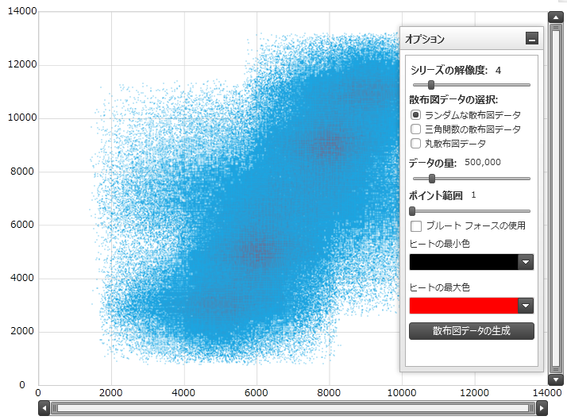
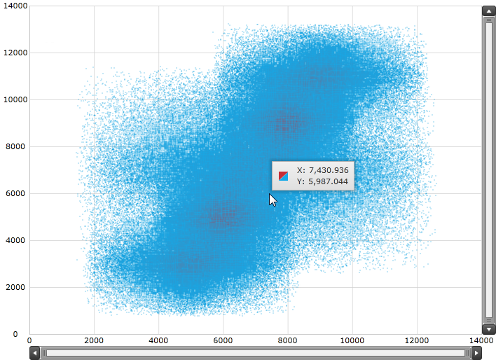
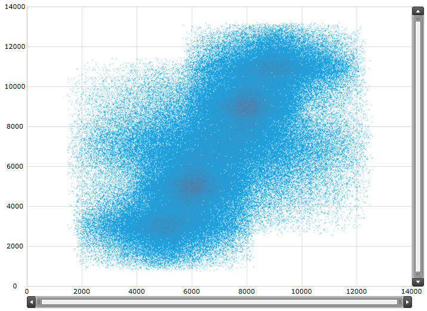

////

|metadata|
{
    "name": "datachart-scatter-high-density-scatter-series",
    "controlName": ["{DataChartName}"],
    "tags": ["Data Binding","Getting Started","How Do I","Performance"],
    "guid": "128868e3-9616-4bfc-a660-fe8cdfa19293",  
    "buildFlags": [],
    "createdOn": "2014-06-05T19:39:00.7114028Z"
}
|metadata|
////

= ギャラリー - 高密度散布シリーズ

== トピックの概要

=== 目的

このトピックは、 link:{DataChartLink}.{DataChartName}.html[{DataChartName}™] コントロールでシリーズの link:{DataChartLink}.highdensityscatterseries_members.html[HighDensityScatterSeries] タイプを使用する情報を提供します。

=== 前提条件

本トピックの理解を深めるために、以下のトピックを参照することをお勧めします。

[options="header", cols="a,a"]
|====
|トピック|目的

| link:datachart-getting-started-with-datachart.html[データ チャートを使用した作業の開始]
|このトピックでは、 _{DataChartName}_ コントロールの追加方法について説明します。

| link:datachart-scatter-series-overview.html[散布図シリーズ]
|このトピックは、 link:{DataChartLink}.scatterseries_members.html[ScatterSeries] を _{DataChartName}_ に追加する方法について説明します。

|====

=== このトピックの内容

このトピックは、以下のセクションで構成されます。

* <<HighDensityScatterSeries,ギャラリー - 高密度散布シリーズ>>

** <<Overview,概要>>
** <<Preview,プレビュー>>
** <<DataRequirements,データ要件>>
** <<DataBinding,データ バインディング>>
** <<HeatColorScale,熱色スケール>>
** <<HeatColorScaleExample,熱色スケールの例>>

* <<Performance,パフォーマンス>>

** <<PerformanceOverview,概要>>
** <<SeriesResolution,シリーズの解像度>>
** <<SeriesResolutionExample,シリーズの解像度の例>>
** <<ProgressiveLoading,プログレッシブ ローディング>>
** <<ProgressiveLoadingExample,プログレッシブ ローディングの例>>
** <<MouseOverSupport,マウス オーバーのサポート>>
** <<MouseOverSupportExample,マウス オーバーのサポート例>>
** <<BruteForceMode,ブルート フォース モード>>
** <<BruteForceModeExample,ブルート フォース モードの例>>
** <<PointSize,ポイント サイズ>>
** <<PointSizeExample,ポイント サイズの例>>

* <<RelatedContent,関連コンテンツ>>

[[HighDensityScatterSeries]]
== ギャラリー - 高密度散布シリーズ

[[Overview]]

=== 概要

_{DataChartName}_ コントロールの link:{DataChartLink}.highdensityscatterseries_members.html[HighDensityScatterSeries] シリーズを使用すると、数百から数百万のデータ ポイントから広がる散布図データを非常に短いローディング時間でバインドして表示できます。相当数のデータ ポイントがあるため、シリーズではフルサイズのマーカーに対して散布データを小さな点として表示し、領域にはデータ ポイントの集合を表す高い色密度を使用した大半のデータを表示します。

[[Preview]]

=== プレビュー

以下のスクリーンショットは、500,000 データ ポイントにバインドされる _{DataChartName}_ コントロール内の link:{DataChartLink}.highdensityscatterseries_members.html[HighDensityScatterSeries] シリーズのプレビューです。明るい赤色のエリアは、データ ポイントが最も集中しているエリアです。

image::images/High_Density_Scatter_Series_1_1.png[]

[[DataRequirements]]

=== データ要件

_{DataChartName}_ コントロールの散布シリーズの他のタイプと同様、 link:{DataChartLink}.highdensityscatterseries_members.html[HighDensityScatterSeries] には、データ バインディングのための  link:{DataChartLink}.Series~{ApiDataSource}.html[{ApiDataSource}] プロパティがあります。このプロパティは、 link:http://msdn.microsoft.com/ja-jp/library/system.collections.ienumerable.aspx[IEnumerable] インターフェイスを実装するオブジェクトにバインドできます。

さらに、項目ソース内の各項目には、デカルト座標システムでデータ ポイントを配置するための X 値と Y 値のために 2 つのデータ列があり、これらのデータ列をマッピングするために link:{DataChartLink}.highdensityscatterseries{ApiProp}xmemberpath.html[XMemberPath] と link:{DataChartLink}.highdensityscatterseries{ApiProp}ymemberpath.html[YMemberPath] の Path プロパティを使用します。

[[DataBinding]]

=== データ バインディング

以下の表に、データ バインドに使用される link:{DataChartLink}.highdensityscatterseries_members.html[HighDensityScatterSeries] シリーズのプロパティをまとめています。

[options="header", cols="a,a,a"]
|====
|*プロパティ名*|*プロパティ タイプ*|*説明*

| link:{DataChartLink}.series~{ApiDataSource}.html[{ApiDataSource}]
|`IEnumerable`
|項目ソースを取得または設定します。

| link:{DataChartLink}.highdensityscatterseries{ApiProp}xmemberpath.html[XMemberPath]
|`string`
|X 値が割り当てられた項目上のどこに位置するのかを決定するには link:{DataChartLink}.Series~{ApiDataSource}.html[{ApiDataSource}] プロパティを使用します。

| link:{DataChartLink}.highdensityscatterseries{ApiProp}ymemberpath.html[YMemberPath]
|`string`
|Y 値が割り当てられた項目上のどこに位置するのかを決定するには link:{DataChartLink}.Series~{ApiDataSource}.html[{ApiDataSource}] プロパティを使用します。

|====

[[HeatColorScale]]

=== 熱色スケール

熱色スケールは、シリーズ内のカラー パターンを決定するオプションの機能です。以下の表は、カラー スケールを決定するために使用するプロパティをまとめたものです。

[options="header", cols="a,a,a"]
|====
|*プロパティ名*|*プロパティ タイプ*|*説明*

| link:{DataChartLink}.highdensityscatterseries{ApiProp}heatminimum.html[HeatMinimum]
|`double`
|カラー スケールの最小端を表す double 値を定義します。

| link:{DataChartLink}.highdensityscatterseries{ApiProp}heatmaximum.html[HeatMaximum]
|`double`
|カラー スケールの最大端を表す double 値を定義します。

| link:{DataChartLink}.highdensityscatterseries{ApiProp}heatminimumcolor.html[HeatMinimumColor]
|`Color`
|カラー スケールの下端で使用するポイント密度カラーを定義します。

| link:{DataChartLink}.highdensityscatterseries{ApiProp}heatmaximumcolor.html[HeatMaximumColor]
|`Color`
|カラー スケールの上端で使用するポイント密度カラーを定義します。

|====

[[HeatColorScaleExample]]

=== 例

表の次にあるスクリーンショットは、 link:{DataChartLink}.highdensityscatterseries_members.html[HighDensityScatterSeries] の link:{DataChartLink}.highdensityscatterseries{ApiProp}heatminimumcolor.html[HeatMinimumColor] と link:{DataChartLink}.highdensityscatterseries{ApiProp}heatmaximumcolor.html[HeatMaximumColor] のプロパティを持つ _{DataChartName}_ が以下の設定後どのように見えるかを示しています。

[options="header", cols="a,a"]
|====
|プロパティ|値

| link:{DataChartLink}.highdensityscatterseries{ApiProp}heatminimumcolor.html[HeatMinimumColor]
|Green

| link:{DataChartLink}.highdensityscatterseries{ApiProp}heatmaximumcolor.html[HeatMaximumColor]
|Orange

|====

image::images/High_Density_Scatter_Series_1_2.png[]

以下のコードはこの例を実装します。

ifdef::wpf,win-universal[]

*XAML の場合:*

[source,xaml]
----
<ig:{DataChartName}.Series>
   <ig:HighDensityScatterSeries
      XAxis="{Binding ElementName=numericXAxis}"
      YAxis="{Binding ElementName=numericYAxis}"
      ItemsSource="{Binding}"
      XMemberPath="XValue"
      YMemberPath="YValue"
      HeatMaximumColor="Orange"
      HeatMinimumColor="Green">
   </ig:HighDensityScatterSeries>
</ig:{DataChartName}.Series>
----

endif::wpf,win-universal[]

[[Performance]]
== パフォーマンス

[[PerformanceOverview]]

=== 概要

`{DataChartName}` の link:{DataChartLink}.highdensityscatterseries_members.html[HighDensityScatterSeries] シリーズはパフォーマンスが最適化されています。_{DataChartName}_ の パフォーマンスを最適化するための数万のプロパティおよびメソッドがあります。

[[SeriesResolution]]

=== シリーズの解像度

link:{DataChartLink}.highdensityscatterseries_members.html[HighDensityScatterSeries] シリーズの link:{DataChartLink}.series{ApiProp}resolution.html[Resolution] プロパティは、シリーズがどの程度積極的に表示データを統合するかを決定します。値が大きいと、より積極的にデータが統合され、シリーズのパフォーマンスが大きくなります。より低い値を使用していると表示解像度が強化され、それに応じてパフォーマンスも下がります。

[[SeriesResolutionExample]]

=== 例

表の下のスクリーンショットは、 link:{DataChartLink}.highdensityscatterseries_members.html[HighDensityScatterSeries] 設定の以下の link:{DataChartLink}.series{ApiProp}resolution.html[Resolution] プロパティで _{DataChartName}_ が描画する方法を示します。

[options="header", cols="a,a"]
|====
|プロパティ|値 (1 – 10)

| link:{DataChartLink}.series{ApiProp}resolution.html[解像度]
|10

|====

image::images/High_Density_Scatter_Series_1_3.png[]

以下はこの例における実装コードです。

ifdef::wpf,win-universal[]

*XAML の場合:*

[source,xaml]
----
<ig:{DataChartName}.Series>
   <ig:HighDensityScatterSeries
      XAxis="{Binding ElementName=numericXAxis}"
      YAxis="{Binding ElementName=numericYAxis}"
      ItemsSource="{Binding}"
      XMemberPath="XValue"
      YMemberPath="YValue"
      Resolution="10">
   </ig:HighDensityScatterSeries>
</ig:{DataChartName}.Series>
----

endif::wpf,win-universal[]

[[ProgressiveLoading]]

=== プログレッシブ ローディング

_{DataChartName}_ コントロールは、_{DataChartName}_ をロードする間中の UI の応答性を保つようデータをばらばらに読み込む link:{DataChartLink}.highdensityscatterseries_members.html[HighDensityScatterSeries] シリーズを段階的に描画します。デフォルトで、 link:{DataChartLink}.highdensityscatterseries{ApiProp}progressiveload.html[ProgressiveLoad] プロパティは True に設定されています。link:{DataChartLink}.highdensityscatterseries_members.html[HighDensityScatterSeries] シリーズは、 _{DataChartName}_   のレンダリング中にローディング状態を表示できる 2 通りの方法を提供します。

* ローディング状態を表示できる link:{DataChartLink}.highdensityscatterseries{ApiProp}progressiveloadstatuschanged_ev.html[ProgressiveLoadStatusChanged] イベントをリッスンします。
* link:{DataChartLink}.highdensityscatterseries{ApiProp}progressivestatus.html[ProgressiveStatus] プロパティは、値が 0 から 100 まで (完全なロードは 100) のプログレッシブ ロード シリーズの状態を表します。このプロパティは、プログレスバーなどのローディング状態を示すコントロールにバインドします。

[[ProgressiveLoadingExample]]

=== 例

この表の下のスクリーン ショットは、 link:{DataChartLink}.highdensityscatterseries_members.html[HighDensityScatterSeries] シリーズの構成された link:{DataChartLink}.highdensityscatterseries{ApiProp}progressiveloadstatuschanged_ev.html[ProgressiveLoadStatusChanged] イベントでどのように _{DataChartName}_ を描画するかを示します。

[options="header", cols="a,a"]
|====
|プロパティ|値

| link:{DataChartLink}.highdensityscatterseries{ApiProp}progressiveload.html[ProgressiveLoad]
|`True`

| link:{DataChartLink}.highdensityscatterseries{ApiProp}progressiveloadstatuschanged_ev.html[ProgressiveLoadStatusChanged]
|`OnSeriesProgressiveLoadStatusChanged`

|====

以下は、先行例を実装するために使用するコードです。

ifdef::wpf,win-universal[]

*XAML の場合:*

[source,xaml]
----
<ig:{DataChartName}.Series>
   <ig:HighDensityScatterSeries
      XAxis="{Binding ElementName=numericXAxis}"
      YAxis="{Binding ElementName=numericYAxis}"
      ItemsSource="{Binding}"
      XMemberPath="XValue"
      YMemberPath="YValue"
      Resolution="3"
      ProgressiveLoad="True"
      ProgressiveLoadStatusChanged="OnSeriesProgressiveLoadStatusChanged">
   </ig:HighDensityScatterSeries>
</ig:{DataChartName}.Series>
----

endif::wpf,win-universal[]

ifdef::wpf[]

*C# の場合:*

[source,csharp]
----
private void OnSeriesProgressiveLoadStatusChanged(object sender,   
                                   ProgressiveLoadStatusEventArgs e)
{
   this.SeriesLoadingProgressBar.Value = e.CurrentStatus;
   if (e.CurrentStatus == 100)
   {
      SeriesLoadingPanel.Visibility = Visibility.Collapsed;
   }
}
----

endif::wpf[]

ifdef::win-forms[]

*C# の場合:*

[source,csharp]
----
private void OnSeriesProgressiveLoadStatusChanged(object sender,   
                                   ProgressiveLoadStatusEventArgs e)
{
   this.SeriesLoadingProgressBar.Value = e.CurrentStatus;
   if (e.CurrentStatus == 100)
   {
      SeriesLoadingPanel.Visibility = Visibility.Collapsed;
   }
}
----

endif::win-forms[]

ifdef::xamarin[]

*C# の場合:*

[source,csharp]
----
private void OnSeriesProgressiveLoadStatusChanged(object sender,   
                                   ProgressiveLoadStatusEventArgs e)
{
   this.SeriesLoadingProgressBar.Value = e.CurrentStatus;
   if (e.CurrentStatus == 100)
   {
      SeriesLoadingPanel.Visibility = Visibility.Collapsed;
   }
}
----

endif::xamarin[]

ifdef::wpf[]

*Visual Basic の場合:*

[source,vb]
----
Private Sub OnSeriesProgressiveLoadStatusChanged(ByVal sender As Object, ByVal e As ProgressiveLoadStatusEventArgs)   Me.SeriesLoadingProgressBar.Value = e.CurrentStatus   If (e.CurrentStatus = 100) Then      SeriesLoadingPanel.Visibility = Visibility.Collapsed   End IfEnd Sub
----

endif::wpf[]

ifdef::win-forms[]

*Visual Basic の場合:*

[source,vb]
----
Private Sub OnSeriesProgressiveLoadStatusChanged(ByVal sender As Object, ByVal e As ProgressiveLoadStatusEventArgs)   Me.SeriesLoadingProgressBar.Value = e.CurrentStatus   If (e.CurrentStatus = 100) Then      SeriesLoadingPanel.Visibility = Visibility.Collapsed   End IfEnd Sub
----

endif::win-forms[]

ifdef::xamarin[]

*Visual Basic の場合:*

[source,vb]
----
Private Sub OnSeriesProgressiveLoadStatusChanged(ByVal sender As Object, ByVal e As ProgressiveLoadStatusEventArgs)   Me.SeriesLoadingProgressBar.Value = e.CurrentStatus   If (e.CurrentStatus = 100) Then      SeriesLoadingPanel.Visibility = Visibility.Collapsed   End IfEnd Sub
----

endif::xamarin[]

[[MouseOverSupport]]

=== マウス オーバーのサポート

link:{DataChartLink}.highdensityscatterseries_members.html[HighDensityScatterSeries] シリーズの  pick:[sl,wpf,win-phone="link:{DataChartLink}.series{ApiProp}mouseoverenabled.html[MouseOverEnabled]"]  pick:[win-rt="link:{DataChartLink}.highdensityscatterseries{ApiProp}pointeroverenabled.html[PointerOverEnabled]"]  プロパティは、`MouseOver` イベントが発生するかどうかを指定します。このプロパティのデフォルト設定は `False` です。このシリーズのマウス オーバーのサポートは、メモリとパフォーマンスについて言うと高い経費を要する場合があります。この値を False に設定することの主なデメリットは、ツールチップを描画できないことです。

[[MouseOverSupportExample]]

=== 例

この表の下のスクリーンショットは、 link:{DataChartLink}.highdensityscatterseries_members.html[HighDensityScatterSeries] シリーズの  pick:[sl,wpf,win-phone="link:{DataChartLink}.series{ApiProp}mouseoverenabled.html[MouseOverEnabled]"]  pick:[win-rt="link:{DataChartLink}.highdensityscatterseries{ApiProp}pointeroverenabled.html[PointerOverEnabled]"]  プロパティを以下のように設定したカスタム ツールチップのある _{DataChartName}_ の描画を示しています。

[options="header", cols="a,a"]
|====
|プロパティ|値

|pick:[sl,wpf,win-phone="link:{DataChartLink}.series{ApiProp}mouseoverenabled.html[MouseOverEnabled]"] pick:[win-rt="link:{DataChartLink}.highdensityscatterseries{ApiProp}pointeroverenabled.html[PointerOverEnabled]"]
|`True`

|====

以下は、先行例を実装するために使用するコードです。

ifdef::wpf,win-universal[]

*XAML の場合:*

[source,xaml]
----
<ig:{DataChartName}.Series>
   <ig:HighDensityScatterSeries
      XAxis="{Binding ElementName=numericXAxis}"
      YAxis="{Binding ElementName=numericYAxis}"
      ItemsSource="{Binding}"
      XMemberPath="XValue"
      YMemberPath="YValue"
      MouseOverEnabled="True"   >
      <ig:HighDensityScatterSeries.ToolTip>
         <StackPanel>
            <StackPanel Orientation="Horizontal">
               <TextBlock Text="X: " />
               <TextBlock Text="{Binding Item.XValue, StringFormat='#,##0.000'}" />
            </StackPanel>
            <StackPanel Orientation="Horizontal">
               <TextBlock Text="Y: " />
               <TextBlock Text="{Binding Item.YValue, StringFormat='#,##0.000'}" />
            </StackPanel>
         </StackPanel>
      </ig:HighDensityScatterSeries.ToolTip>
   </ig:HighDensityScatterSeries>
</ig:{DataChartName}.Series>
----

endif::wpf,win-universal[]

[[BruteForceMode]]

=== ブルート フォース モード

link:{DataChartLink}.highdensityscatterseries_members.html[HighDensityScatterSeries] シリーズの link:{DataChartLink}.highdensityscatterseries{ApiProp}usebruteforce.html[UseBruteForce] プロパティによって、シリーズの描画方法が決まります。このプロパティを True に設定すると、内部データ構造を描画用にビルドせず、すべてのデータ ポイントを毎回描画します。これにより、最初のロード時間が短くなりメモリの使用も少なくなります。しかし、データを通したその後のナビゲートが顕著に遅くなります。

[[BruteForceModeExample]]

=== 例

この表の下のスクリーンショットは、 link:{DataChartLink}.highdensityscatterseries_members.html[HighDensityScatterSeries] シリーズの link:{DataChartLink}.highdensityscatterseries{ApiProp}usebruteforce.html[UseBruteForce] プロパティを以下のように設定した _{DataChartName}_ の描画を示しています。

[options="header", cols="a,a"]
|====
|プロパティ|値

| link:{DataChartLink}.highdensityscatterseries{ApiProp}usebruteforce.html[UseBruteForce]
|`True`

|====

以下は、先行例を実装するために使用するコードです。

ifdef::wpf,win-universal[]

*XAML の場合:*

[source,xaml]
----
<ig:{DataChartName}.Series>
   <ig:HighDensityScatterSeries
       XAxis="{Binding ElementName=numericXAxis}"
       YAxis="{Binding ElementName=numericYAxis}"
       ItemsSource="{Binding}"
       XMemberPath="XValue"
       YMemberPath="YValue"
       ProgressiveLoadStatusChanged="OnSeriesProgressiveLoadStatusChanged"
       UseBruteForce="True">
   </ig:HighDensityScatterSeries>
</ig:{DataChartName}.Series>
----

endif::wpf,win-universal[]

[[PointSize]]

=== ポイント サイズ

link:{DataChartLink}.highdensityscatterseries_members.html[HighDensityScatterSeries] シリーズの link:{DataChartLink}.highdensityscatterseries{ApiProp}pointextent.html[PointExtent] プロパティは、高密度の散布シリーズのポイントを描画するために使用する最小ポイントサイズを上げます。ポイントサイズは、シリーズのパフォーマンスに直接影響します。link:{DataChartLink}.highdensityscatterseries{ApiProp}pointextent.html[PointExtent] プロパティの値が大きいとパフォーマンスは下がります。

[[PointSizeExample]]

=== 例

この表の下のスクリーンショットは、 link:{DataChartLink}.highdensityscatterseries_members.html[HighDensityScatterSeries] シリーズの構成された link:{DataChartLink}.highdensityscatterseries{ApiProp}pointextent.html[PointExtent] プロパティでどのように _{DataChartName}_ を描画するかを示します。

[options="header", cols="a,a"]
|====
|プロパティ|値

| link:{DataChartLink}.highdensityscatterseries{ApiProp}pointextent.html[PointExtent]
| __7__ 

|====

image::images/High_Density_Scatter_Series_1_7.png[]

以下は、先行例を実装するために使用するコードです。

ifdef::wpf,win-universal[]

*XAML の場合:*

[source,xaml]
----
<ig:{DataChartName}.Series>
   <ig:HighDensityScatterSeries
      XAxis="{Binding ElementName=numericXAxis}"
      YAxis="{Binding ElementName=numericYAxis}"
      ItemsSource="{Binding}"
      XMemberPath="XValue"
      YMemberPath="YValue"
      PointExtent="7">
   </ig:HighDensityScatterSeries>
</ig:{DataChartName}.Series>
----

endif::wpf,win-universal[]

[[RelatedContent]]
== 関連コンテンツ

このトピックの追加情報については、以下のトピックも合わせてご参照ください。

[options="header", cols="a,a"]
|====
|トピック|目的

| link:datachart-getting-started-with-datachart.html[データ チャートを使用した作業の開始]
|このトピックは、`{DataChartName}` コントロールをアプリケーション ページに追加する方法を示します。

| link:datachart-scatter-series-overview.html[散布図シリーズ]
|このトピックでは、`{DataChartName}` コントロールで利用可能な散布シリーズに関する情報を提供します。

|====
