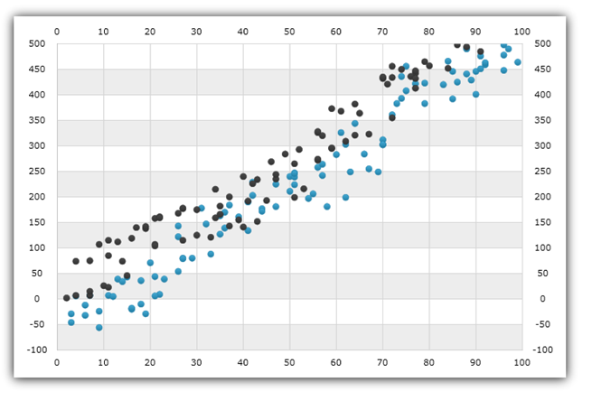

////
|metadata|
{
    "name": "datachart-scatter-point-series",
    "controlName": ["{DataChartName}"],
    "tags": ["Charting","Data Binding","Data Presentation","Sample Data Source"],
    "guid": "",
    "buildFlags": [],
    "createdOn": "2017-04-05T19:39:00.5613429Z"
}
|metadata|
////

= 散布点シリーズ

このトピックは、コード例を示して、link:{DataChartLink}.ScatterSeries.html[ScatterSeries] を link:{DataChartLink}.{DataChartName}.html[{DataChartName}]™ コントロールで使用する方法を説明します。いくつかの重要な概念的情報も提供します。

=== このトピックの内容

このトピックは、以下のセクションで構成されます。

* <<Introduction,概要>>
* <<SeriesPreview,シリーズ プレビュー>>
* <<Appearance,シリーズの外観>>
* <<DataBinding,データ バインディング>> 
* <<RelatedContent,関連コンテンツ>>

[[Introduction]]
== 概要

`ScatterSeries` は、データをプロットにデカルト座標 (x, y) システムを使用するlink:datachart-scatter-series-overview.html[散布シリーズ]のファミリに属します。このシリーズは、マーカー コレクションとしてデータを表示し、それぞれにデカルト座標システムの位置を決定する 1 組の数値 X/Y 値を持ちます。

散布シリーズでは、データの不均等な散らばりやデータの塊に注意が向けられます。予測結果の収集データの標準偏差を強調表示し、科学データや統計データをプロットするためによく使用されます。`ScatterSeries` はデータを X-Axis および Y-Axis で時系列に管理およびプロットします (バインドする前はデータが時系列でない場合も)。以下のセクションは、`ScatterSeries` とその機能を使用する方法で重要なコンセプトやタスクベースの情報を示します。
 
[[SeriesPreview]]
== シリーズ プレビュー   

図 1: `ScatterLineSeries` 実装例

[[SeriesAppearance]]
== シリーズの外観

`ScatterLineSeries` は外観のカスタマイズに使用できる以下のプロパティがあります。
 
[options="header", cols="a,a,a"]
|====
|プロパティ名|プロパティ タイプ|説明

| link:{DataChartLink}.Series{ApiProp}Thickness.html[Thickness]
|`double`
|このプロパティは、マーカーのアウトラインの太さを指定します。
  
| link:{DataChartLink}.MarkerSeries{ApiProp}MarkerType.html[MarkerType]
| link:{DataChartLink}.MarkerType.html[MarkerType] 
|このプロパティは、データ ポイント位置のマーカーの図形を指定します。デフォルトを `Automatic` にするとに {DataChartName} のシリーズのインデックスに基づいた `MarkerType` enum の値の 1 つに解決します。たとえば、第 1 シリーズの `Circle` マーカー、第 2 シリーズの `Diamond` マーカーと続きます。
  
| link:{DataChartLink}.MarkerSeries{ApiProp}MarkerOutline.html[MarkerOutline]
|`Brush`
|このプロパティは、マーカーのアウトラインの色を指定します。
  
| link:{DataChartLink}.MarkerSeries{ApiProp}MarkerBrush.html[MarkerBrush]
|`Brush`
|このプロパティは、マーカーの塗りつぶしの色を指定します。
|====

[[DataBinding]]
== データ バインディング  

`ScatterSeries` は link:{DataChartLink}.series~{ApiDataSource}.html[{ApiDataSource}] プロパティを使用し、IEnumerable インターフェイス (List、Collection、Queue、Stack など) を実装するデータ オブジェクトへバインドします。ただし、このオブジェクトの各データ項目には、2 つの数値データ列 (デカルト座標系でバブルを配置する X および Y 値用) が必要です。データ列は link:{DataChartLink}.ScatterBase{ApiProp}XMemberPath.html[XMemberPath] および link:{DataChartLink}.ScatterBase{ApiProp}YMemberPath.html[YMemberPath] プロパティを使用してマップされます。

上記の基準を満たすオブジェクトに link:resources-sample-bubble-data.html[BubbleDataSource] があり、ダウンロードしてプロジェクトで使用できます。

==== コード例
このコード スニペットは、サンプル バブル データを `ScatterSeries` にバインドする方法を説明します。

ifdef::wpf,win-universal[]
*XAML の場合:*
[source,xaml]
----
xmlns:local="clr-namespace:Infragistics.Models;assembly=YourAppName"
...
<ig:{DataChartName} >
    <ig:{DataChartName}.Resources>
        <local:BubbleDataSource x:Key="data"/> 
    </ig:{DataChartName}.Resources>
    <ig:{DataChartName}.Axes>
        <ig:NumericXAxis x:Name="XAxis" />
        <ig:NumericYAxis x:Name="YAxis" />
    </ig:{DataChartName}.Axes>
    <ig:{DataChartName}.Series> 
        <ig:ScatterSeries ItemsSource="{StaticResource data}"
                          XAxis="{Binding ElementName=XAxis}"
                          YAxis="{Binding ElementName=YAxis}"
                          XMemberPath="X" 
                          YMemberPath="Y" >
        </ig:ScatterSeries> 
    </ig:{DataChartName}.Series>
</ig:{DataChartName}>
----
endif::wpf,win-universal[]
 
ifdef::xamarin[]
*XAML の場合:*
[source,xaml]
----
xmlns:local="clr-namespace:Infragistics.Models;assembly=YourAppName"
...
<ig:{DataChartName} x:Name="DataChart" >
    <ig:{DataChartName}.Resources>
		<ResourceDictionary>
			<local:EnergyDataSource x:Key="data" />
		</ResourceDictionary>
    </ig:{DataChartName}.Resources>
    <ig:{DataChartName}.Axes>
        <ig:NumericXAxis x:Name="XAxis" />
        <ig:NumericYAxis x:Name="YAxis" />
    </ig:{DataChartName}.Axes>
    <ig:{DataChartName}.Series>
        <ig:ScatterSeries ItemsSource="{StaticResource data}"
                          XAxis="{x:Reference XAxis}"
                          YAxis="{x:Reference YAxis}"
                          XMemberPath="X" 
                          YMemberPath="Y" > 
        </ig:ScatterSeries> 
    </ig:{DataChartName}.Series>
</ig:{DataChartName}>
----
endif::xamarin[]

ifdef::wpf,win-universal,xamarin[]
*C# の場合:*
[source,csharp]
----
var bubbleDataSample = new BubbleDataSource();
var xAxis = new NumericXAxis();
var yAxis = new NumericYAxis();

var series = new ScatterSeries();
series.XAxis = xAxis;
series.YAxis = yAxis;
series.XMemberPath = "X";
series.YMemberPath = "Y"; 
series.ItemsSource = bubbleDataSample; 
DataChart.Axes.Add(xAxis);
DataChart.Axes.Add(yAxis);
DataChart.Series.Add(series);
----
endif::wpf,win-universal,xamarin[]
 
ifdef::win-forms[]
*C# の場合:*
[source,csharp]
----
var bubbleDataSample = new BubbleDataSource();
var xAxis = new NumericXAxis();
var yAxis = new NumericYAxis();

var series = new ScatterSeries();
series.XAxis = xAxis;
series.YAxis = yAxis;
series.XMemberPath = "X";
series.YMemberPath = "Y"; 
series.DataSource = bubbleDataSample; 
DataChart.Axes.Add(xAxis);
DataChart.Axes.Add(yAxis);
DataChart.Series.Add(series);
----
endif::win-forms[]
 
ifdef::wpf,win-universal[]
*Visual Basic の場合:*
[source,vb]
----
Dim data As New BubbleDataSource()
Dim xAxis As New NumericXAxis() 
Dim yAxis As New NumericYAxis() 

Dim series As New ScatterSeries()
series.ItemsSource = data
series.XMemberPath = "X"
series.YMemberPath = "Y" 
series.XAxis = xAxis
series.YAxis = yAxis
Dim chart As New {DataChartName}()
chart.Axes.Add(xAxis)
chart.Axes.Add(yAxis)
chart.Series.Add(series)
----
endif::wpf,win-universal[]

ifdef::win-forms[]
*Visual Basic の場合:*
[source,vb]
----
Dim data As New BubbleDataSource()
Dim xAxis As New NumericXAxis()  
Dim yAxis As New NumericYAxis()  

Dim series As New ScatterSeries()
series.DataSource = data
series.XMemberPath = "X"
series.YMemberPath = "Y" 
series.XAxis = xAxis
series.YAxis = yAxis
Dim chart As New {DataChartName}()
chart.Axes.Add(xAxis)
chart.Axes.Add(yAxis)
chart.Series.Add(series)
----
endif::win-forms[]

ifdef::android[]
*Java の場合:*
[source,java]
----
BubbleDataSource data = new BubbleDataSource();
NumericYAxis yAxis = new NumericYAxis();
NumericXAxis xAxis = new NumericXAxis();

ScatterSeries series = new ScatterSeries();
series.setXAxis(xAxis);
series.setYAxis(yAxis);
series.setXMemberPath("X");
series.setYMemberPath("Y"); 
series.setDataSource(data);
chart.addAxis(xAxis);
chart.addAxis(yAxis);
chart.addSeries(series);
----
endif::android[]

[[RelatedContent]]
== 関連コンテンツ

** link:datachart-axes.html[チャート軸] 
** link:datachart-series-requirements.html[シリーズ要件]
** link:datachart-scatter-series-overview.html[散布シリーズ]