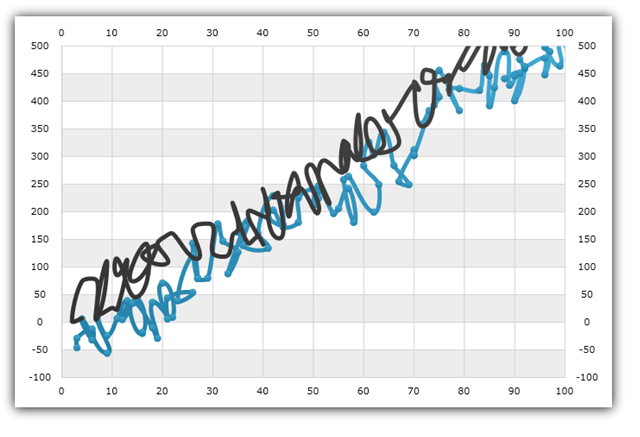
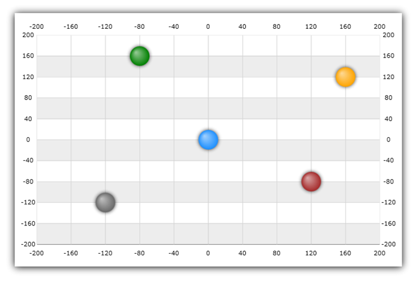

////
|metadata|
{
    "name": "datachart-scatter-series-overview",
    "controlName": ["{DataChartName}"],
    "tags": ["Application Scenarios","Charting","How Do I"],
    "guid": "ae71f00e-36ce-4cda-8960-c7a0f6cab9d1",
    "buildFlags": [],
    "createdOn": "2014-06-05T19:39:00.5633433Z"
}
|metadata|
////

= 散布図シリーズ

このトピックは、link:{DataChartLink}.{DataChartName}.html[{DataChartName}]™ コントロールの散布シリーズでサポートされるすべてのタイプについての情報を提供します。

=== このトピックの内容

このトピックは、以下のセクションで構成されます。

* <<_Introduction,概要>>
* <<_Types,散布図シリーズのタイプ>>
* <<_Preview,散布シリーズのプレビュー>> 
* <<_SupportedAxes,サポートされる軸>>
* <<_Coordinate,座標系>>
* <<_DataBinding,データ バインディング>>
** <<_DataRequirements,データ要件>>
** <<_DataSample,データの例>>
* <<_RelatedTopics,関連トピック>>

[[_Introduction]]
== 概要

`{DataChartName}` コントロールで、散布シリーズは、複数の異なるデータのシリーズの項目間の関係を示すマーカーを表示、または x および y 座標を使用してデータ項目をプロットするために使用されるシリーズのグループです。データ ポイントの x 座標および y 座標は、2 つの数値データ列で決定されます。散布シリーズは、データの不均等な散らばりやデータの塊に注意が向けられます。これらのタイプのシリーズは、科学データのプロットによく用いられ、予測結果からの収集データの偏差を強調表示できます。散布シリーズは、データを時シリーズに (データが時系列でない場合であっても) 構成するためにも使用できます。

[[_Types]]
== 散布図シリーズのタイプ

{DataChartName} コントロールは、以下のタイプの散布シリーズをサポートし、それぞれについては個別のトピックで説明します:
  
* link:datachart-scatter-point-series.html[散布点シリーズ] 
* link:datachart-scatter-line-series.html[散布図 - 折れ線シリーズ] 
* link:datachart-scatter-spline-series.html[散布図 - スプライン シリーズ] 
* link:datachart-bubble-series.html[散布バブル シリーズ] 
ifdef::wpf,win-universal[]
* link:datachart-scatter-high-density-scatter-series.html[ギャラリー - 高密度散布シリーズ] 
* link:datachart-scatter-area-series.html[散布エリア シリーズ]
* link:datachart-scatter-contour-series.html[散布等高線シリーズ]
* link:datachart-scatter-polygon-series.html[散布多角形シリーズ]
* link:datachart-scatter-polyline-series.html[散布ポリライン シリーズ]
endif::wpf,win-universal[]

特定のタイプの散布シリーズの作成やデータ バインドの方法は上記のトピックを参照してください。

[[_Preview]]
== 散布シリーズのプレビュー

image::images/xamDataChart_Scatter_Series_02.png[]
図 1: 散布ポイント シリーズの実装例

image::images/xamDataChart_Scatter_Series_03.png[]
図 2: 散布折れ線シリーズの実装例

図 3: 散布スプライン シリーズの実装例
 
image::images/xamDataChart_Scatter_Bubble_Series_02.png[]
図 4: 散布バブル シリーズの実装例
 
ifdef::wpf,win-universal[]
image::images/High_Density_Scatter_Series_1_1.png[]
図 5: 高密度散布シリーズの実装例
endif::wpf,win-universal[]
 
[[_SupportedAxes]] 
== サポートされる軸

{DataChartName} コントロールは、さまざまな軸タイプを提供しますが、以下の2 つの軸タイプのみすべての散布シリーズで使用できます。以下の表に、サポートされる軸を示します。

[options="header", cols="a,a,a"]
|====
|シリーズ タイプ| X 軸タイプ | Y 軸タイプ 
|`ScatterSeries` 
|link:{DataChartLink}.NumericXAxis.html[NumericXAxis]
|link:{DataChartLink}.NumericYAxis.html[NumericYAxis] +
ifdef::wpf,win-forms[]
link:{DataChartLink}.PercentChangeYAxis.html[PercentChangeYAxis]
endif::wpf,win-forms[]
 
|`ScatterLineSeries` 
|link:{DataChartLink}.NumericXAxis.html[NumericXAxis]
|link:{DataChartLink}.NumericYAxis.html[NumericYAxis] +
ifdef::wpf,win-forms[]
link:{DataChartLink}.PercentChangeYAxis.html[PercentChangeYAxis]
endif::wpf,win-forms[]
 
|`ScatterSplineSeries` 
|link:{DataChartLink}.NumericXAxis.html[NumericXAxis]
|link:{DataChartLink}.NumericYAxis.html[NumericYAxis] +
ifdef::wpf,win-forms[]
link:{DataChartLink}.PercentChangeYAxis.html[PercentChangeYAxis]
endif::wpf,win-forms[]
 
|`ScatterBubbleSeries` 
|link:{DataChartLink}.NumericXAxis.html[NumericXAxis]
|link:{DataChartLink}.NumericYAxis.html[NumericYAxis] +
ifdef::wpf,win-forms[]
link:{DataChartLink}.PercentChangeYAxis.html[PercentChangeYAxis]
endif::wpf,win-forms[]
 
ifdef::wpf,win-universal[]
|`HighDensityScatterSeries`  
|link:{DataChartLink}.NumericXAxis.html[NumericXAxis]
|link:{DataChartLink}.NumericYAxis.html[NumericYAxis]

|`ScatterAreaSeries`  
|link:{DataChartLink}.NumericXAxis.html[NumericXAxis]
|link:{DataChartLink}.NumericYAxis.html[NumericYAxis]

|`ScatterContourSeries`  
|link:{DataChartLink}.NumericXAxis.html[NumericXAxis]
|link:{DataChartLink}.NumericYAxis.html[NumericYAxis]

|`ScatterPolygonSeries`  
|link:{DataChartLink}.NumericXAxis.html[NumericXAxis]
|link:{DataChartLink}.NumericYAxis.html[NumericYAxis]

|`ScatterPolylineSeries`  
|link:{DataChartLink}.NumericXAxis.html[NumericXAxis]
|link:{DataChartLink}.NumericYAxis.html[NumericYAxis]
endif::wpf,win-universal[]
|====

さらに、各散布シリーズは link:{DataChartLink}.ScatterBase{ApiProp}XAxis.html[XAxis] プロパティを使用する 1 つの ｘ 軸と link:{DataChartLink}.ScatterBase{ApiProp}XAxis.html[YAxis] プロパティを使用する 1 つの y 軸にバインドを設定する必要があります。軸についての詳細は、link:datachart-axes.html[「軸」]トピックを参照してください。 

[[_Coordinate]]
== 座標系

デカルト座標系でデータ ポイントの位置は、`NumericXAxis` の X 座標の数値と `NumericYAxis` の Y 座標の数値によって決定されます。座標は同じ長さの単位で計測されます。範囲は負の無限大から正の無限大です。更にデカルト座標系の原点または水平軸が垂直軸と交差する位置は `CrossingAxis` および `CrossingValue` プロパティを使用して変更できます。このプロパティを使用に関するより詳細な情報については、link:datachart-axis-crossing.html[軸の交差]のトピックをご覧ください。

以下の画像は、デカルト座標系でさまざまな位置にある 5 つのデータ ポイントで ScatterSeries を示します。

* 青のポイントはチャートの中央に位置します (0,0 は極座標系の原点)。
* 赤のポイントは、120 の X 座標と -80 の Y 座標です (120, -80)。
* 緑のポイントは、-80 の X 座標と 160 の Y 座標です (-80, -80)。
* オレンジのポイントは、160 の X 座標と 120 の Y 座標です (160, -80)。
* グレーのポイントは、120 の X 座標と -120 の Y 座標です (-120, -120)。

[[_DataBinding]]
== データ バインディング

このセクションではデータ要件からデータ例、バインディング ダイアグラムまでのすべてのタイプの散布シリーズに対するバインディング データについての情報を提供します。

[[_DataRequirements]]
==== データ要件

{DataChartName} コントロールの他のシリーズ タイプと同様、散布シリーズも link:{DataChartLink}.Series~{ApiDataSource}.html[{ApiDataSource}] プロパティを使用してデータをバインドします。以下は、散布シリーズのデータ要件のリストです。

* データ モデルは、散布シリーズの link:{DataChartLink}.ScatterBase{ApiProp}XMemberPath.html[XMemberPath] プロパティを使用してマップする数値データ列 (XValue など) を少なくとも 1 列含む必要があります。pick:[wpf="link:{DataChartLink}.ScatterPolygonSeries.html[ScatterPolygonSeries] および link:{DataChartLink}.ScatterPolygonSeries.html[ScatterPolylineSeries] は例外です。link:{DataChartLink}.ShapeSeriesBase{ApiProp}ShapeMemberPath.html[ShapeMemberPath] に List<List<Point>> が必要です。このため、シリーズに X 値が既に設定されます。"]
* データ モデルは、散布シリーズの link:{DataChartLink}.ScatterBase{ApiProp}YMemberPath.html[YMemberPath] プロパティを使用してマップする数値データ列 (YValue など) を少なくとも 2 列含む必要があります。pick:[wpf="link:{DataChartLink}.ScatterPolygonSeries.html[ScatterPolygonSeries] および link:{DataChartLink}.ScatterPolygonSeries.html[ScatterPolylineSeries] は例外です。link:{DataChartLink}.ShapeSeriesBase{ApiProp}ShapeMemberPath.html[ShapeMemberPath] に List<List<Point>> が必要です。このため、シリーズに Y 値が既に設定されます。"]
* データソースはデータ項目を少なくとも 1 つ含む必要があります。含まない場合はチャートは散布シリーズを描画しません。
* データ ソースは link:http://msdn.microsoft.com/ja-jp/library/system.collections.ienumerable.aspx[IEnumerable] インターフェイス (link:http://msdn.microsoft.com/ja-jp/library/6sh2ey19.aspx[List], link:http://msdn.microsoft.com/ja-jp/library/ms132397.aspx[Collection], link:http://msdn.microsoft.com/ja-jp/library/7977ey2c.aspx[Queue], link:http://msdn.microsoft.com/ja-jp/library/system.collections.stack.aspx[Stack] など) を実装しなければなりません。

特定のシリーズ タイプの要件については、link:datachart-series-requirements.html[シリーズ要件]トピックを参照してください。

[[_DataSample]]
==== データの例

上記の基準を満たすオブジェクトに link:resources-sample-polar-data.html[PolarDataSource] があり、ダウンロードしてプロジェクトで使用できます。

[[_RelatedTopics]] 
== 関連コンテンツ
 
* link:datachart-series-types.html[シリーズ タイプ]
* link:datachart-multiple-series.html[複数シリーズの追加]
* link:datachart-series-requirements.html[シリーズ要件]
* link:datachart-scatter-point-series.html[散布点シリーズ] 
* link:datachart-scatter-line-series.html[散布図 - 折れ線シリーズ] 
* link:datachart-scatter-spline-series.html[散布図 - スプライン シリーズ] 
* link:datachart-bubble-series.html[散布バブル シリーズ] 
ifdef::wpf,win-universal[]
* link:datachart-scatter-high-density-scatter-series.html[ギャラリー - 高密度散布シリーズ] 
endif::wpf,win-universal[]