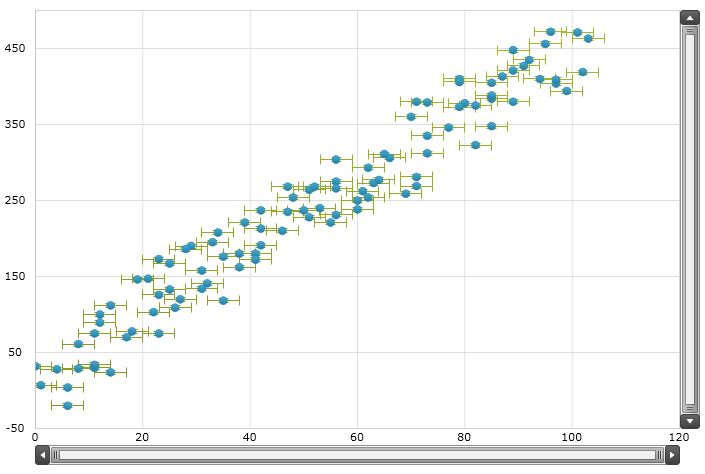
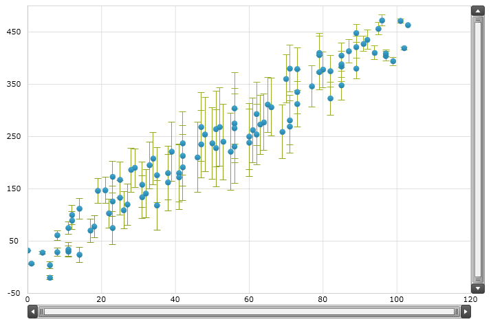

////

|metadata|
{
    "name": "datachart-series-error-bars",
    "controlName": ["{DataChartName}"],
    "tags": ["Charting","Data Presentation","Getting Started","How Do I"],
    "guid": "c86ab3e4-5fac-4e71-994a-cb3fa4c13123",  
    "buildFlags": ["wpf","win-universal"],
    "createdOn": "2014-06-05T19:39:00.647376Z"
}
|metadata|
////

= シリーズ誤差範囲

このトピックは、 link:{DataChartLink}.{DataChartName}.html[{DataChartName}]™ コントロールの値オーバーレイ機能を紹介し、コード例を示して、値のオーバーレイの表示方法を説明します。

== 概要

トピックは以下のとおりです。

* <<Introduction,概要>>
* <<Requirements,要件>>
* <<SupportedTypesofSeries,サポートされるシリーズのタイプ>>

** カテゴリ シリーズ
** 散布図シリーズ

* <<TypesofErrorBars,誤差範囲のタイプ>>

** 固定値の誤差範囲
** パーセンテージ誤差範囲
** 標準の誤差範囲
** 標準偏差の誤差範囲
** カスタムデータの誤差範囲

* <<ErrorBarsProperties,誤差範囲のプロパティ>>

** カテゴリ誤差範囲のプロパティ
** 散布誤差範囲のプロパティ

* <<Examples,コード例>>

** 固定値誤差範囲のあるカテゴリ シリーズ
** パーセント誤差範囲のあるカテゴリ シリーズ
** 標準誤差範囲のあるカテゴリ シリーズ
** 標準偏差誤差範囲のあるカテゴリ シリーズ
** カスタムデータ誤差範囲のあるカテゴリ シリーズ
** 固定値誤差範囲のある散布シリーズ
** パーセント誤差範囲のある散布シリーズ
** 標準誤差範囲のある散布シリーズ
** 標準偏差誤差範囲のある散布シリーズ
** カスタムデータ誤差範囲のある散布シリーズ

* <<RelatedContent,関連コンテンツ>>

** link:datachart-series-types.html[シリーズ タイプ]
** link:datachart-series-requirements.html[シリーズ要件]
** link:ig-math-calculators.html[Infragistics 数学計算式]

== 概要

誤差範囲は、シリーズ オブジェクトを使用してデータ チャートにプロットするデータのばらつきを視覚的に表現したものです。データ内の誤差や不確実性を示すためにチャート上で使用されます。一般に、データ測定値がどのように正確なのか、または真の値が測定値からどの程度離れているかを視覚的に表します。

== 要件

ifdef::win-forms[]

{DataChartName} では、誤差範囲の長さは Infragistics Math Calculators™ を使用して計算し、以下のアセンブリは、誤差範囲をデータ ポイント上に表示する前に {PlatformName} プロジェクトに追加しなければなりません。

[options="header", cols="a,a"]
|====
|アセンブリ|説明

|{ApiPlatform}Math.Calculators.v{ProductVersion}.dll
|誤差範囲、相関、平均、中央値、バリアンスなど多くの数値を計算するための Math Calculators を含む {ProductName} アセンブリ。

|{ApiPlatform}Math.v{ProductVersion}.dll
|標準的な数学定数と多様な数学的なオブジェクトで機能するように設計された汎用的な数学関数を含む {ProductName} アセンブリ。

|{ApiPlatform}{DataChartAssembly}.v{ProductVersion}.dll
|データをプロットするための {DataChartName} コントロールとさまざまなタイプのシリーズと軸を含む {ProductName} アセンブリ。

|{ApiPlatform}v{ProductVersion}.dll
|Infragistics アセンブリによって使用される共有機能を含む {ProductName} アセンブリ。

|====

endif::win-forms[]

ifdef::wpf[]

{DataChartName} では、誤差範囲の長さは Infragistics Math Calculators™ を使用して計算するため、誤差範囲をデータ ポイント上に表示するには、{PlatformName} プロジェクトに以下の NuGet パッケージを追加しなければなりません。

[options="header", cols="a,a"]
|====
|NuGet パッケージ|説明

|Infragistics.WPF.Math.Calculators
|誤差範囲、相関、平均、中央値、バリアンスなど多くの数値を計算するための Math Calculators を含む {ProductName} NuGet パッケージ。

|Infragistics.WPF.Math
|標準的な数学定数およびさまざまな数学的なオブジェクトで使用するように設計された汎用的な数学関数を含む {ProductName} NuGet パッケージ。

|Infragistics.WPF.Charts
|データをプロットするための {DataChartName} コントロールおよびさまざまなタイプのシリーズと軸を含む {ProductName} NuGet パッケージ。

|====

endif::wpf[]

== サポートされるシリーズのタイプ

このセクションは、Data Chart コントロール内の誤差範囲をサポートするシリーズ タイプのリストを示します。

表 1 - サポートされるシリーズのタイプ

[options="header", cols="a,a,a"]
|====
|シリーズのタイプ|サポートされる誤差範囲|プレビュー

| link:datachart-category-series-overview.html[カテゴリ シリーズ]: 

* AreaSeries 

* ColumnSeries 

* LineSeries 

* SplineSeries 

* SplineAreaSeries 

* StepAreaSeries 

* StepLineSeries 

|垂直方向の誤差範囲
|image::images/xamDataChart_Series_Error_Bars__01.png[] 

図 1 - 誤差範囲のある link:datachart-category-series-overview.html[カテゴリ シリーズ]

| link:datachart-scatter-series-overview.html[散布図シリーズ]: 

* ScatterSeries 

* ScatterLineSeries 

* ScatterSplineSeries 

|水平方向の誤差範囲 

垂直方向の誤差範囲
|image::images/xamDataChart_Series_Error_Bars__02.png[] 

図 2 - 誤差範囲のある link:datachart-scatter-series-overview.html[散布シリーズ]

|====

[NOTE]
====
注: 誤差範囲は、 link:datachart-category-series-overview.html[カテゴリ シリーズ] グループ内の積層シリーズ タイプまたは範囲型シリーズ タイプではサポートされません。
====

== 誤差範囲のタイプ

データ チャートは、以下の表 2 にリストされる数多くの誤差範囲のタイプをサポートします。誤差範囲の長さは、 link:{ApiPlatform}datavisualization{ApiVersion}~infragistics.ierrorbarcalculator.html[IErrorBarCalculator] インターフェイスを実装する link:ig-math-calculators.html[Infragistics 数学計算式]を使用して計算されます。

表 2 - 誤差範囲のタイプ

[options="header", cols="a,a"]
|====
|誤差範囲のタイプ|説明

|固定値の誤差範囲
|これらの誤差範囲の長さは、 link:ig-calculators-fixed-value-calculator.html[Infragistics 固定値計算式]の Value プロパティにバインドされる固定値に等しくなります。

|パーセンテージ誤差範囲
|これらの誤差範囲の長さは、 link:ig-calculators-percentage-calculator.html[Infragistics パーセンテージ計算式]の Value プロパティにバインドされるパーセント値に等しくなります。

|標準の誤差範囲
|これらの誤差範囲の長さは、 link:ig-calculators-standard-error-calculator.html[Infragistics 標準エラー計算式]の ItemsSource プロパティにバインドされるデータ セットの標準誤差を使用して計算されます。

|標準偏差の誤差範囲
|これらの誤差範囲の長さは、 link:ig-calculators-standard-deviation-calculator.html[Infragistics 標準偏差計算式]の ItemsSource プロパティにバインドされるデータ セットの標準偏差を使用して計算されます。

|カスタムデータの誤差範囲
|これらの誤差範囲の長さは、 link:ig-calculators-data-calculator.html[Infragistics データ計算式]の ItemsSource プロパティにバインドされるデータ セット内の任意の値またはカスタム値を使用して提供されます。

|====

== 誤差範囲のプロパティ

== カテゴリ誤差範囲のプロパティ

以下の表は、 link:datachart-category-series-overview.html[カテゴリ シリーズ]グループ内のすべてのシリーズに対する誤差範囲に関係するプロパティの概要を提供します。

[options="header", cols="a,a,a"]
|====
|プロパティ名|プロパティ タイプ|説明

|CategorySeries. link:{DataChartLink}.categoryseries{ApiProp}errorbarsettings.html[ErrorBarSettings]
| link:{DataChartLink}.categoryerrorbarsettings.html[CategoryErrorBarSettings]
|カテゴリ シリーズ上の誤差範囲の設定を取得または設定します。

|CategoryErrorBarSettings. link:{DataChartLink}.categoryerrorbarsettings{ApiProp}enableerrorbars.html[EnableErrorBars]
| link:{DataChartLink}.enableerrorbars.html[EnableErrorBars]
|誤差範囲の表示タイプを指定する列挙値を取得または設定します。 

両方 - 正負両方の誤差範囲を表示します。 

正 - 正の誤差範囲 (データ ポイントの上) のみを表示します。 

負 - 負の誤差範囲 (データ ポイントの下) のみを表示します。 

無し - すべての誤差範囲を表示しません。

|CategoryErrorBarSettings. link:{DataChartLink}.categoryerrorbarsettings{ApiProp}errorbarcaplength.html[ErrorBarCapLength]
|int
|誤差範囲のキャップ長を取得または設定します。

|CategoryErrorBarSettings. link:{DataChartLink}.categoryerrorbarsettings{ApiProp}strokethickness.html[StrokeThickness]
|Double
|誤差範囲の目盛を取得または設定します。

|CategoryErrorBarSettings. link:{DataChartLink}.categoryerrorbarsettings{ApiProp}stroke.html[Stroke]
|Brush
|誤差範囲のストローク ブラシを取得または設定します。

|CategoryErrorBarSettings. link:{DataChartLink}.categoryerrorbarsettings{ApiProp}calculator.html[Calculator]
| link:{ApiPlatform}datavisualization{ApiVersion}~infragistics.ierrorbarcalculator.html[IErrorBarCalculator]
|誤差範囲の値を計算するために使用する計算式を取得または設定します。 

DataCalculator – 誤差範囲の任意の値またはカスタム値を提供します。 

FixedValueCalculator – 計算式の Value プロパティにバインドされる固定値に等しい長さで誤差範囲を生成します。 

PercentageCalculator – 計算式の Value プロパティにバインドされるパーセント値に等しい長さで誤差範囲を生成します。 

StandardDeviationCalculator – 計算式の ItemsSource プロパティにバインドされるすべてのデータ項目の標準誤差に基づいて誤差範囲を計算します。 

StandardErrorCalculator – 計算式の ItemsSource プロパティにバインドされるデータ セットの標準誤差に基づいて誤差範囲を計算します。

|====

== 散布誤差範囲のプロパティ

以下の表は、 link:datachart-scatter-series-overview.html[散布シリーズ]グループ内のすべてのシリーズに対する誤差範囲に関係するプロパティの概要を提供します。

[options="header", cols="a,a,a"]
|====
|プロパティ名|プロパティ タイプ|説明

|ScatterBase. link:{DataChartLink}.scatterbase{ApiProp}errorbarsettings.html[ErrorBarSettings]
| link:{DataChartLink}.scattererrorbarsettings.html[ScatterErrorBarSettings]
|散布シリーズ上の水平方向の誤差範囲の設定を取得または設定します。

|ScatterErrorBarSettings. link:{DataChartLink}.scattererrorbarsettings{ApiProp}enableerrorbarshorizontal.html[EnableErrorBarsHorizontal]
| link:{DataChartLink}.enableerrorbars.html[EnableErrorBars]
|水平方向の誤差範囲の表示タイプを指定する列挙値を取得または設定します。 

両方 - 正負両方の誤差範囲を表示します。 

負 - 負の誤差範囲 (データ ポイントの左側) のみを表示します。 

正 - 正の誤差範囲 (データ ポイントの右側) のみを表示します。 

無し - すべての誤差範囲を表示しません。

|ScatterErrorBarSettings. link:{DataChartLink}.scattererrorbarsettings{ApiProp}horizontalerrorbarcaplength.html[HorizontalErrorBarCapLength]
|int
|水平方向の誤差範囲のキャップ長を取得または設定します。

|ScatterErrorBarSettings. link:{DataChartLink}.scattererrorbarsettings{ApiProp}horizontalstrokethickness.html[HorizontalStrokeThickness]
|Double
|水平方向の誤差範囲の目盛を取得または設定します。

|ScatterErrorBarSettings. link:{DataChartLink}.scattererrorbarsettings{ApiProp}horizontalstroke.html[HorizontalStroke]
|Brush
|水平方向の誤差範囲のストローク ブラシを取得または設定します。

|ScatterErrorBarSettings. link:{DataChartLink}.scattererrorbarsettings{ApiProp}horizontalcalculator.html[HorizontalCalculator]
| link:{ApiPlatform}datavisualization{ApiVersion}~infragistics.ierrorbarcalculator.html[IErrorBarCalculator]
|水平方向の誤差範囲の値を計算するために使用する計算式を取得または設定します。 

DataCalculator – 誤差範囲の任意の値またはカスタム値を提供します。 

FixedValueCalculator – 計算式の Value プロパティにバインドされる固定値に等しい長さで誤差範囲を生成します。 

PercentageCalculator – 計算式の Value プロパティにバインドされるパーセント値に等しい長さで誤差範囲を生成します。 

StandardDeviationCalculator – 計算式の ItemsSource プロパティにバインドされるすべてのデータ項目の標準誤差に基づいて誤差範囲を計算します。 

StandardErrorCalculator – 計算式の ItemsSource プロパティにバインドされるデータ セットの標準誤差に基づいて誤差範囲を計算します。

|ScatterErrorBarSettings. link:{DataChartLink}.scattererrorbarsettings{ApiProp}horizontalcalculatorreference.html[HorizontalCalculatorReference]
| link:{ApiPlatform}datavisualization{ApiVersion}~infragistics.errorbarcalculatorreference.html[ErrorBarCalculatorReference]
|HorizontalCalculator プロパティにバインドされる PercentageCalculator の参照値を指定する列挙値を取得または設定します。 

X - 水平方向の誤差範囲を計算するための参照値として X メンバーを指定します。 

Y - 水平方向の誤差範囲を計算するための参照値として Y メンバーを指定します。

|ScatterErrorBarSettings. link:{DataChartLink}.scattererrorbarsettings{ApiProp}horizontalerrorbarstyle.html[HorizontalErrorBarStyle]
|Style
|水平方向の誤差範囲のスタイルを取得または設定します。

|ScatterErrorBarSettings. link:{DataChartLink}.scattererrorbarsettings{ApiProp}enableerrorbarsvertical.html[EnableErrorBarsVertical]
| link:{DataChartLink}.enableerrorbars.html[EnableErrorBars]
|垂直方向の誤差範囲の表示タイプを指定する列挙値を取得または設定します。 

両方 - 正負両方の誤差範囲を表示します。 

正 - 正の誤差範囲 (データ ポイントの上) のみを表示します。 

負 - 負の誤差範囲 (データ ポイントの下) のみを表示します。 

無し - すべての誤差範囲を表示しません。

|ScatterErrorBarSettings. link:{DataChartLink}.scattererrorbarsettings{ApiProp}verticalerrorbarcaplength.html[VerticalErrorBarCapLength]
|int
|垂直方向の誤差範囲のキャップ長を取得または設定します。

|ScatterErrorBarSettings. link:{DataChartLink}.scattererrorbarsettings{ApiProp}verticalstrokethickness.html[VerticalStrokeThickness]
|Double
|垂直方向の誤差範囲の目盛を取得または設定します。

|ScatterErrorBarSettings. link:{DataChartLink}.scattererrorbarsettings{ApiProp}verticalstroke.html[VerticalStroke]
|Brush
|垂直方向の誤差範囲のストローク ブラシを取得または設定します。

|ScatterErrorBarSettings. link:{DataChartLink}.scattererrorbarsettings{ApiProp}verticalcalculator.html[VerticalCalculator]
| link:{ApiPlatform}datavisualization{ApiVersion}~infragistics.ierrorbarcalculator.html[IErrorBarCalculator]
|垂直方向の誤差範囲の値を計算するために使用する計算式を取得または設定します。 

DataCalculator – 誤差範囲の任意の値またはカスタム値を提供します。 

FixedValueCalculator – 計算式の Value プロパティにバインドされる固定値に等しい長さで誤差範囲を生成します。 

PercentageCalculator – 計算式の Value プロパティにバインドされるパーセント値に等しい長さで誤差範囲を生成します。 

StandardDeviationCalculator – 計算式の ItemsSource プロパティにバインドされるすべてのデータ項目の標準誤差に基づいて誤差範囲を計算します。 

StandardErrorCalculator – 計算式の ItemsSource プロパティにバインドされるデータ セットの標準誤差に基づいて誤差範囲を計算します。

|ScatterErrorBarSettings. link:{DataChartLink}.scattererrorbarsettings{ApiProp}verticalcalculatorreference.html[VerticalCalculatorReference]
| link:{ApiPlatform}datavisualization{ApiVersion}~infragistics.errorbarcalculatorreference.html[ErrorBarCalculatorReference]
|VerticalCalculator プロパティにバインドされる PercentageCalculator の参照値を指定する列挙値を取得または設定します。 

X - 垂直方向の誤差範囲を計算するための参照値として X メンバーを指定します。 

Y - 垂直方向の誤差範囲を計算するための参照値として Y メンバーを指定します。

|ScatterErrorBarSettings. link:{DataChartLink}.scattererrorbarsettings{ApiProp}verticalerrorbarstyle.html[VerticalErrorBarStyle]
|Style
|垂直方向の誤差範囲のスタイルを取得または設定します。

|====

== コード例

このセクションは、Data Chart コントロールでシリーズ上の誤差範囲の各種タイプを表示するためのコード例を示します。

== 固定値誤差範囲のあるカテゴリ シリーズ

以下のコード リストは、LineSeries 上の固定値誤差範囲を表示する方法を示します。

ifdef::win-universal[]

*XAML の場合:*

[source,xaml]
----
xmlns:ig="using:Infragistics.Controls.Charts"
xmlns:igCalc="using:Infragistics.Math.Calculators"
----

endif::win-universal[]

ifdef::wpf[]

*XAML の場合:*

----
xmlns:ig="http://schemas.infragistics.com/xaml"
xmlns:igCalc=http://schemas.infragistics.com/xaml
----

endif::wpf[]

ifdef::wpf,win-universal[]

*XAML の場合:*

----
<ig:LineSeries.ErrorBarSettings>
    <ig:ScatterErrorBarSettings EnableErrorBars="Both" >
        <ig:CategoryErrorBarSettings.Calculator>
            <igCalc:FixedValueCalculator Value="10" />
        </ig:CategoryErrorBarSettings.Calculator>
    </ig:ScatterErrorBarSettings>
</ig:LineSeries.ErrorBarSettings>
----

endif::wpf,win-universal[]

ifdef::wpf[]

*Visual Basic の場合:*

----
Imports {DataChartNamespace}
Imports Infragistics.Math.Calculators
'...
Dim barsSettings As New CategoryErrorBarSettings()
barsSettings.EnableErrorBars = EnableErrorBars.Both
barsSettings.Calculator = New FixedValueCalculator()  
barsSettings.Calculator.Value = 10.0  
'...
Dim series As New LineSeries()
'...
series.ErrorBarSettings = barsSettings
----

endif::wpf[]

ifdef::win-forms[]

*Visual Basic の場合:*

----
Imports {DataChartNamespace}
Imports Infragistics.Math.Calculators
'...
Dim barsSettings As New CategoryErrorBarSettings()
barsSettings.EnableErrorBars = EnableErrorBars.Both
barsSettings.Calculator = New FixedValueCalculator()  
barsSettings.Calculator.Value = 10.0  
'...
Dim series As New LineSeries()
'...
series.ErrorBarSettings = barsSettings
----

endif::win-forms[]

ifdef::xamarin[]

*Visual Basic の場合:*

----
Imports {DataChartNamespace}
Imports Infragistics.Math.Calculators
'...
Dim barsSettings As New CategoryErrorBarSettings()
barsSettings.EnableErrorBars = EnableErrorBars.Both
barsSettings.Calculator = New FixedValueCalculator()  
barsSettings.Calculator.Value = 10.0  
'...
Dim series As New LineSeries()
'...
series.ErrorBarSettings = barsSettings
----

endif::xamarin[]

ifdef::wpf[]

*C# の場合:*

----
using {DataChartNamespace}
using Infragistics.Math.Calculators;
//...
CategoryErrorBarSettings barsSettings = new CategoryErrorBarSettings();
barsSettings.EnableErrorBars = EnableErrorBars.Both;
barsSettings.Calculator = new FixedValueCalculator();
barsSettings.Calculator.Value = 10.0;  
//...
LineSeries series = new LineSeries();
//...
series.ErrorBarSettings = barsSettings;
----

endif::wpf[]

ifdef::win-forms[]

*C# の場合:*

----
using {DataChartNamespace};
using Infragistics.Math.Calculators;
//...
CategoryErrorBarSettings barsSettings = new CategoryErrorBarSettings();
barsSettings.EnableErrorBars = EnableErrorBars.Both;
barsSettings.Calculator = new FixedValueCalculator();
barsSettings.Calculator.Value = 10.0;  
//...
LineSeries series = new LineSeries();
//...
series.ErrorBarSettings = barsSettings;
----

endif::win-forms[]

ifdef::xamarin[]

*C# の場合:*

----
using {DataChartNamespace};
using Infragistics.Math.Calculators;
//...
CategoryErrorBarSettings barsSettings = new CategoryErrorBarSettings();
barsSettings.EnableErrorBars = EnableErrorBars.Both;
barsSettings.Calculator = new FixedValueCalculator();
barsSettings.Calculator.Value = 10.0;  
//...
LineSeries series = new LineSeries();
//...
series.ErrorBarSettings = barsSettings;
----

endif::xamarin[]

ifdef::sl,wpf,win-phone,win-universal[]
image::images/xamDataChart_Series_Error_Bars__03.png[]
endif::sl,wpf,win-phone,win-universal[]

図 3 - 固定値誤差範囲のあるライン シリーズ

== パーセント誤差範囲のあるカテゴリ シリーズ

以下のコード リストは、LineSeries 上のパーセント誤差範囲を表示する方法を示します。

ifdef::wpf,win-universal[]

*XAML の場合:*

----
<ig:LineSeries.ErrorBarSettings>
    <ig:ScatterErrorBarSettings EnableErrorBars="Both" >
        <ig:CategoryErrorBarSettings.Calculator>
            <igCalc:PercentageCalculator Value="10" />
        </ig:CategoryErrorBarSettings.Calculator>
    </ig:ScatterErrorBarSettings>
</ig:LineSeries.ErrorBarSettings>
----

endif::wpf,win-universal[]

ifdef::wpf[]

*Visual Basic の場合:*

----
Imports {DataChartNamespace}
Imports Infragistics.Math.Calculators
'...
Dim barsSettings As New CategoryErrorBarSettings()
barsSettings.EnableErrorBars = EnableErrorBars.Both
barsSettings.Calculator = New PercentageCalculator()
barsSettings.Calculator.Value = 10.0
'...
Dim series As New LineSeries()
'...
series.ErrorBarSettings = barsSettings
----

endif::wpf[]

ifdef::win-forms[]

*Visual Basic の場合:*

----
Imports {DataChartNamespace}
Imports Infragistics.Math.Calculators
'...
Dim barsSettings As New CategoryErrorBarSettings()
barsSettings.EnableErrorBars = EnableErrorBars.Both
barsSettings.Calculator = New PercentageCalculator()
barsSettings.Calculator.Value = 10.0
'...
Dim series As New LineSeries()
'...
series.ErrorBarSettings = barsSettings
----

endif::win-forms[]

ifdef::xamarin[]

*Visual Basic の場合:*

----
Imports {DataChartNamespace}
Imports Infragistics.Math.Calculators
'...
Dim barsSettings As New CategoryErrorBarSettings()
barsSettings.EnableErrorBars = EnableErrorBars.Both
barsSettings.Calculator = New PercentageCalculator()
barsSettings.Calculator.Value = 10.0
'...
Dim series As New LineSeries()
'...
series.ErrorBarSettings = barsSettings
----

endif::xamarin[]

ifdef::wpf[]

*C# の場合:*

----
using {DataChartNamespace};
using Infragistics.Math.Calculators;
//...
CategoryErrorBarSettings barsSettings = new CategoryErrorBarSettings();
barsSettings.EnableErrorBars = EnableErrorBars.Both;
barsSettings.Calculator = new PercentageCalculator();
barsSettings.Calculator.Value = 10.0;
//...
LineSeries series = new LineSeries();
//...
series.ErrorBarSettings = barsSettings;
----

endif::wpf[]

ifdef::win-forms[]

*C# の場合:*

----
using {DataChartNamespace};
using Infragistics.Math.Calculators;
//...
CategoryErrorBarSettings barsSettings = new CategoryErrorBarSettings();
barsSettings.EnableErrorBars = EnableErrorBars.Both;
barsSettings.Calculator = new PercentageCalculator();
barsSettings.Calculator.Value = 10.0;
//...
LineSeries series = new LineSeries();
//...
series.ErrorBarSettings = barsSettings;
----

endif::win-forms[]

ifdef::xamarin[]

*C# の場合:*

----
using {DataChartNamespace};
using Infragistics.Math.Calculators;
//...
CategoryErrorBarSettings barsSettings = new CategoryErrorBarSettings();
barsSettings.EnableErrorBars = EnableErrorBars.Both;
barsSettings.Calculator = new PercentageCalculator();
barsSettings.Calculator.Value = 10.0;
//...
LineSeries series = new LineSeries();
//...
series.ErrorBarSettings = barsSettings;
----

endif::xamarin[]

ifdef::sl,wpf,win-phone,win-universal[]
image::images/xamDataChart_Series_Error_Bars__04.png[]
endif::sl,wpf,win-phone,win-universal[]

図 3 - パーセント誤差範囲のあるライン シリーズ

== 標準誤差範囲のあるカテゴリ シリーズ

以下のコード リストは、LineSeries 上の標準誤差範囲を表示する方法を示します。

[NOTE]
====
注: すべてのデータ ポイントに対する誤差範囲を計算するには、 ItemsSource プロパティを使用してシリーズ オブジェクトおよび StandardErrorCalculator に対して同じデータ セットをバインドしてください。サンプルのデータ セットをカテゴリ データ サンプル リソースからダウンロードできます。
====

ifdef::wpf,win-universal[]

*XAML の場合:*

----
<ig:LineSeries.ErrorBarSettings>
    <ig:ScatterErrorBarSettings EnableErrorBars="Both" >
        <ig:CategoryErrorBarSettings.Calculator>
            <igCalc:StandardErrorCalculator ItemsSource="{StaticResource CategoryData}" ValueMemberPath="Value" />
        </ig:CategoryErrorBarSettings.Calculator>
    </ig:ScatterErrorBarSettings>
</ig:LineSeries.ErrorBarSettings>
----

endif::wpf,win-universal[]

ifdef::wpf[]

*Visual Basic の場合:*

----
Imports {DataChartNamespace}
Imports Infragistics.Math.Calculators
'...
Dim series As New LineSeries()
'...
Dim barsSettings As New CategoryErrorBarSettings()
barsSettings.EnableErrorBars = EnableErrorBars.Both
barsSettings.Calculator = New StandardErrorCalculator()
barsSettings.Calculator.ItemsSource = series.ItemsSource
barsSettings.Calculator.ValueMemberPath = "Value"  
'...
series.ErrorBarSettings = barsSettings
----

endif::wpf[]

ifdef::win-forms[]

*Visual Basic の場合:*

----
Imports {DataChartNamespace}
Imports Infragistics.Math.Calculators
'...
Dim series As New LineSeries()
'...
Dim barsSettings As New CategoryErrorBarSettings()
barsSettings.EnableErrorBars = EnableErrorBars.Both
barsSettings.Calculator = New StandardErrorCalculator()
barsSettings.Calculator.ItemsSource = series.ItemsSource
barsSettings.Calculator.ValueMemberPath = "Value"  
'...
series.ErrorBarSettings = barsSettings
----

endif::win-forms[]

ifdef::xamarin[]

*Visual Basic の場合:*

----
Imports {DataChartNamespace}
Imports Infragistics.Math.Calculators
'...
Dim series As New LineSeries()
'...
Dim barsSettings As New CategoryErrorBarSettings()
barsSettings.EnableErrorBars = EnableErrorBars.Both
barsSettings.Calculator = New StandardErrorCalculator()
barsSettings.Calculator.ItemsSource = series.ItemsSource
barsSettings.Calculator.ValueMemberPath = "Value"  
'...
series.ErrorBarSettings = barsSettings
----

endif::xamarin[]

ifdef::wpf[]

*C# の場合:*

----
using {DataChartNamespace};
using Infragistics.Math.Calculators;
//...
LineSeries series = new LineSeries();
//...
CategoryErrorBarSettings barsSettings = new CategoryErrorBarSettings();
barsSettings.EnableErrorBars = EnableErrorBars.Both;
barsSettings.Calculator = new StandardErrorCalculator();
barsSettings.Calculator.ItemsSource = series.ItemsSource;
barsSettings.Calculator.ValueMemberPath = "Value";  
//...
series.ErrorBarSettings = barsSettings;
----

endif::wpf[]

ifdef::win-forms[]

*C# の場合:*

----
using {DataChartNamespace};
using Infragistics.Math.Calculators;
//...
LineSeries series = new LineSeries();
//...
CategoryErrorBarSettings barsSettings = new CategoryErrorBarSettings();
barsSettings.EnableErrorBars = EnableErrorBars.Both;
barsSettings.Calculator = new StandardErrorCalculator();
barsSettings.Calculator.ItemsSource = series.ItemsSource;
barsSettings.Calculator.ValueMemberPath = "Value";  
//...
series.ErrorBarSettings = barsSettings;
----

endif::win-forms[]

ifdef::xamarin[]

*C# の場合:*

----
using {DataChartNamespace};
using Infragistics.Math.Calculators;
//...
LineSeries series = new LineSeries();
//...
CategoryErrorBarSettings barsSettings = new CategoryErrorBarSettings();
barsSettings.EnableErrorBars = EnableErrorBars.Both;
barsSettings.Calculator = new StandardErrorCalculator();
barsSettings.Calculator.ItemsSource = series.ItemsSource;
barsSettings.Calculator.ValueMemberPath = "Value";  
//...
series.ErrorBarSettings = barsSettings;
----

endif::xamarin[]

ifdef::sl,wpf,win-phone,win-universal[]
image::images/xamDataChart_Series_Error_Bars__05.png[]
endif::sl,wpf,win-phone,win-universal[]

図 3 - 標準誤差範囲のあるライン シリーズ

== 標準偏差誤差範囲のあるカテゴリ シリーズ

以下のコード リストは、LineSeries 上のパーセント標準偏差誤差範囲を表示する方法を示します。

[NOTE]
====
注: すべてのデータ ポイントに対する誤差範囲を計算するには、 ItemsSource プロパティを使用してシリーズ オブジェクトおよび StandardDeviationCalculator に対して同じデータ セットをバインドしてください。サンプルのデータ セットをカテゴリ データ サンプル リソースからダウンロードできます。
====

ifdef::wpf,win-universal[]

*XAML の場合:*

----
<ig:LineSeries.ErrorBarSettings>
    <ig:ScatterErrorBarSettings EnableErrorBars="Both" >
        <ig:CategoryErrorBarSettings.Calculator>
            <igCalc:StandardDeviationCalculator ItemsSource="{StaticResource CategoryData}" ValueMemberPath="Value" />
        </ig:CategoryErrorBarSettings.Calculator>
    </ig:ScatterErrorBarSettings>
</ig:LineSeries.ErrorBarSettings>
----

endif::wpf,win-universal[]

ifdef::wpf[]

*Visual Basic の場合:*

----
Imports {DataChartNamespace}
Imports Infragistics.Math.Calculators
'...
Dim series As New LineSeries()
'...
Dim barsSettings As New CategoryErrorBarSettings()
barsSettings.EnableErrorBars = EnableErrorBars.Both
barsSettings.Calculator = New StandardDeviationCalculator() 
barsSettings.Calculator.ItemsSource = series.ItemsSource
barsSettings.Calculator.ValueMemberPath = "Value"  
'...
series.ErrorBarSettings = barsSettings
----

endif::wpf[]

ifdef::win-forms[]

*Visual Basic の場合:*

----
Imports {DataChartNamespace}
Imports Infragistics.Math.Calculators
'...
Dim series As New LineSeries()
'...
Dim barsSettings As New CategoryErrorBarSettings()
barsSettings.EnableErrorBars = EnableErrorBars.Both
barsSettings.Calculator = New StandardDeviationCalculator() 
barsSettings.Calculator.ItemsSource = series.ItemsSource
barsSettings.Calculator.ValueMemberPath = "Value"  
'...
series.ErrorBarSettings = barsSettings
----

endif::win-forms[]

ifdef::xamarin[]

*Visual Basic の場合:*

----
Imports {DataChartNamespace}
Imports Infragistics.Math.Calculators
'...
Dim series As New LineSeries()
'...
Dim barsSettings As New CategoryErrorBarSettings()
barsSettings.EnableErrorBars = EnableErrorBars.Both
barsSettings.Calculator = New StandardDeviationCalculator() 
barsSettings.Calculator.ItemsSource = series.ItemsSource
barsSettings.Calculator.ValueMemberPath = "Value"  
'...
series.ErrorBarSettings = barsSettings
----

endif::xamarin[]

ifdef::wpf[]

*C# の場合:*

----
using {DataChartNamespace};
using Infragistics.Math.Calculators;
//...
LineSeries series = new LineSeries();
//...
CategoryErrorBarSettings barsSettings = new CategoryErrorBarSettings();
barsSettings.EnableErrorBars = EnableErrorBars.Both;
barsSettings.Calculator = new StandardDeviationCalculator();
barsSettings.Calculator.ItemsSource = series.ItemsSource;
barsSettings.Calculator.ValueMemberPath = "Value";  
//...
series.ErrorBarSettings = barsSettings;
----

endif::wpf[]

ifdef::win-forms[]

*C# の場合:*

----
using {DataChartNamespace};
using Infragistics.Math.Calculators;
//...
LineSeries series = new LineSeries();
//...
CategoryErrorBarSettings barsSettings = new CategoryErrorBarSettings();
barsSettings.EnableErrorBars = EnableErrorBars.Both;
barsSettings.Calculator = new StandardDeviationCalculator();
barsSettings.Calculator.ItemsSource = series.ItemsSource;
barsSettings.Calculator.ValueMemberPath = "Value";  
//...
series.ErrorBarSettings = barsSettings;
----

endif::win-forms[]

ifdef::xamarin[]

*C# の場合:*

----
using {DataChartNamespace};
using Infragistics.Math.Calculators;
//...
LineSeries series = new LineSeries();
//...
CategoryErrorBarSettings barsSettings = new CategoryErrorBarSettings();
barsSettings.EnableErrorBars = EnableErrorBars.Both;
barsSettings.Calculator = new StandardDeviationCalculator();
barsSettings.Calculator.ItemsSource = series.ItemsSource;
barsSettings.Calculator.ValueMemberPath = "Value";  
//...
series.ErrorBarSettings = barsSettings;
----

endif::xamarin[]

ifdef::sl,wpf,win-phone,win-universal[]
image::images/xamDataChart_Series_Error_Bars__06.png[]
endif::sl,wpf,win-phone,win-universal[]

図 3 - 標準偏差誤差範囲のあるライン シリーズ

== カスタムデータ誤差範囲のあるカテゴリ シリーズ

以下のコード リストは、LineSeries 上のカスタム データ誤差範囲を表示する方法を示します。カスタム データ誤差範囲の値は、DataCalculator の ItemsSource プロパティにバインドされるデータ セットによって提供されます。

[NOTE]
====
注: 以下のコードは、カスタム データ誤差範囲の値を生成するためのサンプル ロジックを提供します。プロジェクトに追加するか、データ誤差範囲に独自の値を提供する必要があります。
====

ifdef::wpf[]

*Visual Basic の場合:*

----
Imports System.Collections.ObjectModel 
'...
Public Class ErrorBarDataSample
    Inherits ErrorBarDataCollection
    Public Sub New()
        Me.New(0.1, 100)
    End Sub
    Public Sub New(variable As Double, items As Integer)
        Dim value As Double = 0
        For i As Integer = 0 To items - 2
            Dim dataPoint As New ErrorBarDataPoint()
            dataPoint.Value = value
            Me.Add(dataPoint)
            If i < (items / 2) Then
                value += variable
            Else
                value -= variable
            End If
        Next
    End Sub
End Class
Public Class ErrorBarDataCollection
    Inherits ObservableCollection(Of ErrorBarDataPoint)
End Class
Public Class ErrorBarDataPoint
    Public Property Value() As Double
        Get
            Return value
        End Get
        Set
            _value = Value
        End Set
    End Property
    Private value As Double
End Class
----

endif::wpf[]

ifdef::win-forms[]

*Visual Basic の場合:*

----
Imports System.Collections.ObjectModel 
'...
Public Class ErrorBarDataSample
    Inherits ErrorBarDataCollection
    Public Sub New()
        Me.New(0.1, 100)
    End Sub
    Public Sub New(variable As Double, items As Integer)
        Dim value As Double = 0
        For i As Integer = 0 To items - 2
            Dim dataPoint As New ErrorBarDataPoint()
            dataPoint.Value = value
            Me.Add(dataPoint)
            If i < (items / 2) Then
                value += variable
            Else
                value -= variable
            End If
        Next
    End Sub
End Class
Public Class ErrorBarDataCollection
    Inherits ObservableCollection(Of ErrorBarDataPoint)
End Class
Public Class ErrorBarDataPoint
    Public Property Value() As Double
        Get
            Return value
        End Get
        Set
            _value = Value
        End Set
    End Property
    Private value As Double
End Class
----

endif::win-forms[]

ifdef::xamarin[]

*Visual Basic の場合:*

----
Imports System.Collections.ObjectModel 
'...
Public Class ErrorBarDataSample
    Inherits ErrorBarDataCollection
    Public Sub New()
        Me.New(0.1, 100)
    End Sub
    Public Sub New(variable As Double, items As Integer)
        Dim value As Double = 0
        For i As Integer = 0 To items - 2
            Dim dataPoint As New ErrorBarDataPoint()
            dataPoint.Value = value
            Me.Add(dataPoint)
            If i < (items / 2) Then
                value += variable
            Else
                value -= variable
            End If
        Next
    End Sub
End Class
Public Class ErrorBarDataCollection
    Inherits ObservableCollection(Of ErrorBarDataPoint)
End Class
Public Class ErrorBarDataPoint
    Public Property Value() As Double
        Get
            Return value
        End Get
        Set
            _value = Value
        End Set
    End Property
    Private value As Double
End Class
----

endif::xamarin[]

ifdef::wpf[]

*C# の場合:*

----
using System.Collections.ObjectModel;
//...
public class ErrorBarDataSample : ErrorBarDataCollection
{
    public ErrorBarDataSample(): this(0.1, 100)
    { }
    public ErrorBarDataSample(double variable, int items)
    {
        double value = 0;
        for (int i = 0; i < items - 1; i++)
        {
            ErrorBarDataPoint dataPoint = new ErrorBarDataPoint();
            dataPoint.Value = value;
              this.Add(dataPoint);
              if (i < (items / 2)) value += variable; else value -= variable;
        }
    }
}
public class ErrorBarDataCollection : ObservableCollection<ErrorBarDataPoint>
{ }
public class ErrorBarDataPoint
{
    public double Value { get; set; }
}
----

endif::wpf[]

ifdef::win-forms[]

*C# の場合:*

----
using System.Collections.ObjectModel;
//...
public class ErrorBarDataSample : ErrorBarDataCollection
{
    public ErrorBarDataSample(): this(0.1, 100)
    { }
    public ErrorBarDataSample(double variable, int items)
    {
        double value = 0;
        for (int i = 0; i < items - 1; i++)
        {
            ErrorBarDataPoint dataPoint = new ErrorBarDataPoint();
            dataPoint.Value = value;
              this.Add(dataPoint);
              if (i < (items / 2)) value += variable; else value -= variable;
        }
    }
}
public class ErrorBarDataCollection : ObservableCollection<ErrorBarDataPoint>
{ }
public class ErrorBarDataPoint
{
    public double Value { get; set; }
}
----

endif::win-forms[]

ifdef::xamarin[]

*C# の場合:*

----
using System.Collections.ObjectModel;
//...
public class ErrorBarDataSample : ErrorBarDataCollection
{
    public ErrorBarDataSample(): this(0.1, 100)
    { }
    public ErrorBarDataSample(double variable, int items)
    {
        double value = 0;
        for (int i = 0; i < items - 1; i++)
        {
            ErrorBarDataPoint dataPoint = new ErrorBarDataPoint();
            dataPoint.Value = value;
              this.Add(dataPoint);
              if (i < (items / 2)) value += variable; else value -= variable;
        }
    }
}
public class ErrorBarDataCollection : ObservableCollection<ErrorBarDataPoint>
{ }
public class ErrorBarDataPoint
{
    public double Value { get; set; }
}
----

endif::xamarin[]

ifdef::wpf,win-universal[]

*XAML の場合:*

----
<ig:LineSeries.ErrorBarSettings>
    <ig:ScatterErrorBarSettings EnableErrorBars="Both" >
        <ig:CategoryErrorBarSettings.Calculator>
            <igCalc:DataCalculator ItemsSource="{StaticResource ErrorBarData}" ValueMemberPath="Value" />
        </ig:CategoryErrorBarSettings.Calculator>
    </ig:ScatterErrorBarSettings>
</ig:LineSeries.ErrorBarSettings>
----

endif::wpf,win-universal[]

ifdef::wpf[]

*Visual Basic の場合:*

----
Imports {DataChartNamespace}
Imports Infragistics.Math.Calculators
'...
Dim series As New LineSeries()
'...
Dim errorBarsData As New ErrorBarDataSample()
Dim barsSettings As New CategoryErrorBarSettings()
barsSettings.EnableErrorBars = EnableErrorBars.Both
barsSettings.Calculator = New DataCalculator()
barsSettings.Calculator.ItemsSource = errorBarsData
barsSettings.Calculator.ValueMemberPath = "Value"  
'...
series.ErrorBarSettings = barsSettings
----

endif::wpf[]

ifdef::win-forms[]

*Visual Basic の場合:*

----
Imports {DataChartNamespace}
Imports Infragistics.Math.Calculators
'...
Dim series As New LineSeries()
'...
Dim errorBarsData As New ErrorBarDataSample()
Dim barsSettings As New CategoryErrorBarSettings()
barsSettings.EnableErrorBars = EnableErrorBars.Both
barsSettings.Calculator = New DataCalculator()
barsSettings.Calculator.ItemsSource = errorBarsData
barsSettings.Calculator.ValueMemberPath = "Value"  
'...
series.ErrorBarSettings = barsSettings
----

endif::win-forms[]

ifdef::xamarin[]

*Visual Basic の場合:*

----
Imports {DataChartNamespace}
Imports Infragistics.Math.Calculators
'...
Dim series As New LineSeries()
'...
Dim errorBarsData As New ErrorBarDataSample()
Dim barsSettings As New CategoryErrorBarSettings()
barsSettings.EnableErrorBars = EnableErrorBars.Both
barsSettings.Calculator = New DataCalculator()
barsSettings.Calculator.ItemsSource = errorBarsData
barsSettings.Calculator.ValueMemberPath = "Value"  
'...
series.ErrorBarSettings = barsSettings
----

endif::xamarin[]

ifdef::wpf[]

*C# の場合:*

----
using {DataChartNamespace};
using Infragistics.Math.Calculators;
//...
LineSeries series = new LineSeries();
//...
ErrorBarDataSample errorBarsData = new ErrorBarDataSample();
CategoryErrorBarSettings barsSettings = new CategoryErrorBarSettings();
barsSettings.EnableErrorBars = EnableErrorBars.Both;
barsSettings.Calculator = new DataCalculator();
barsSettings.Calculator.ItemsSource = errorBarsData
barsSettings.Calculator.ValueMemberPath = "Value"  
//...
series.ErrorBarSettings = barsSettings;
----

endif::wpf[]

ifdef::win-forms[]

*C# の場合:*

----
using {DataChartNamespace};
using Infragistics.Math.Calculators;
//...
LineSeries series = new LineSeries();
//...
ErrorBarDataSample errorBarsData = new ErrorBarDataSample();
CategoryErrorBarSettings barsSettings = new CategoryErrorBarSettings();
barsSettings.EnableErrorBars = EnableErrorBars.Both;
barsSettings.Calculator = new DataCalculator();
barsSettings.Calculator.ItemsSource = errorBarsData
barsSettings.Calculator.ValueMemberPath = "Value"  
//...
series.ErrorBarSettings = barsSettings;
----

endif::win-forms[]

ifdef::xamarin[]

*C# の場合:*

----
using {DataChartNamespace};
using Infragistics.Math.Calculators;
//...
LineSeries series = new LineSeries();
//...
ErrorBarDataSample errorBarsData = new ErrorBarDataSample();
CategoryErrorBarSettings barsSettings = new CategoryErrorBarSettings();
barsSettings.EnableErrorBars = EnableErrorBars.Both;
barsSettings.Calculator = new DataCalculator();
barsSettings.Calculator.ItemsSource = errorBarsData
barsSettings.Calculator.ValueMemberPath = "Value"  
//...
series.ErrorBarSettings = barsSettings;
----

endif::xamarin[]

ifdef::sl,wpf,win-phone,win-universal[]
image::images/xamDataChart_Series_Error_Bars__07.png[]
endif::sl,wpf,win-phone,win-universal[]

図 3 - カスタム データ誤差範囲のあるライン シリーズ

== 固定値誤差範囲のある散布シリーズ

以下のコード リストは、ScatterSeries 上の固定値誤差範囲を表示する方法を示します。

ifdef::wpf,win-universal[]

*XAML の場合:*

----
<ig:ScatterSeries.ErrorBarSettings>
    <ig:ScatterErrorBarSettings EnableErrorBarsHorizontal="Both" 
                                EnableErrorBarsVertical="Both" >
        <ig:ScatterErrorBarSettings.HorizontalCalculator>
            <igCalc:FixedValueCalculator Value="2" />
        </ig:ScatterErrorBarSettings.HorizontalCalculator>
        <ig:ScatterErrorBarSettings.VerticalCalculator>
            <igCalc:FixedValueCalculator Value="20" />
        </ig:ScatterErrorBarSettings.VerticalCalculator>
    </ig:ScatterErrorBarSettings>
</ig:ScatterSeries.ErrorBarSettings>
----

endif::wpf,win-universal[]

ifdef::wpf[]

*Visual Basic の場合:*

----
Imports {DataChartNamespace}
Imports Infragistics.Math.Calculators
'...
Dim barsSettings As New ScatterErrorBarSettings()
barsSettings.EnableErrorBarsHorizontal = EnableErrorBars.Both
barsSettings.HorizontalCalculator = New FixedValueCalculator()  
barsSettings.HorizontalCalculator.Value = 2.0
'...
barsSettings.EnableErrorBarsVertical = EnableErrorBars.Both
barsSettings.VerticalCalculator = New FixedValueCalculator()  
barsSettings.VerticalCalculator.Value = 20.0
'...
Dim series As New ScatterSeries()
'...
series.ErrorBarSettings = barsSettings
----

endif::wpf[]

ifdef::win-forms[]

*Visual Basic の場合:*

----
Imports {DataChartNamespace}
Imports Infragistics.Math.Calculators
'...
Dim barsSettings As New ScatterErrorBarSettings()
barsSettings.EnableErrorBarsHorizontal = EnableErrorBars.Both
barsSettings.HorizontalCalculator = New FixedValueCalculator()  
barsSettings.HorizontalCalculator.Value = 2.0
'...
barsSettings.EnableErrorBarsVertical = EnableErrorBars.Both
barsSettings.VerticalCalculator = New FixedValueCalculator()  
barsSettings.VerticalCalculator.Value = 20.0
'...
Dim series As New ScatterSeries()
'...
series.ErrorBarSettings = barsSettings
----

endif::win-forms[]

ifdef::xamarin[]

*Visual Basic の場合:*

----
Imports {DataChartNamespace}
Imports Infragistics.Math.Calculators
'...
Dim barsSettings As New ScatterErrorBarSettings()
barsSettings.EnableErrorBarsHorizontal = EnableErrorBars.Both
barsSettings.HorizontalCalculator = New FixedValueCalculator()  
barsSettings.HorizontalCalculator.Value = 2.0
'...
barsSettings.EnableErrorBarsVertical = EnableErrorBars.Both
barsSettings.VerticalCalculator = New FixedValueCalculator()  
barsSettings.VerticalCalculator.Value = 20.0
'...
Dim series As New ScatterSeries()
'...
series.ErrorBarSettings = barsSettings
----

endif::xamarin[]

ifdef::wpf[]

*C# の場合:*

----
using {DataChartNamespace};
using Infragistics.Math.Calculators;
//...
ScatterErrorBarSettings barsSettings = new ScatterErrorBarSettings();
barsSettings.EnableErrorBarsHorizontal = EnableErrorBars.Both;
barsSettings.HorizontalCalculator = new FixedValueCalculator();
barsSettings.HorizontalCalculator.Value = 2.0;
//...
barsSettings.EnableErrorBarsVertical = EnableErrorBars.Both;
barsSettings.VerticalCalculator = new FixedValueCalculator();
barsSettings.VerticalCalculator.Value = 20.0;
//...
ScatterSeries series = new ScatterSeries();
//...
series.ErrorBarSettings = barsSettings;
----

endif::wpf[]

ifdef::win-forms[]

*C# の場合:*

----
using {DataChartNamespace};
using Infragistics.Math.Calculators;
//...
ScatterErrorBarSettings barsSettings = new ScatterErrorBarSettings();
barsSettings.EnableErrorBarsHorizontal = EnableErrorBars.Both;
barsSettings.HorizontalCalculator = new FixedValueCalculator();
barsSettings.HorizontalCalculator.Value = 2.0;
//...
barsSettings.EnableErrorBarsVertical = EnableErrorBars.Both;
barsSettings.VerticalCalculator = new FixedValueCalculator();
barsSettings.VerticalCalculator.Value = 20.0;
//...
ScatterSeries series = new ScatterSeries();
//...
series.ErrorBarSettings = barsSettings;
----

endif::win-forms[]

ifdef::xamarin[]

*C# の場合:*

----
using {DataChartNamespace};
using Infragistics.Math.Calculators;
//...
ScatterErrorBarSettings barsSettings = new ScatterErrorBarSettings();
barsSettings.EnableErrorBarsHorizontal = EnableErrorBars.Both;
barsSettings.HorizontalCalculator = new FixedValueCalculator();
barsSettings.HorizontalCalculator.Value = 2.0;
//...
barsSettings.EnableErrorBarsVertical = EnableErrorBars.Both;
barsSettings.VerticalCalculator = new FixedValueCalculator();
barsSettings.VerticalCalculator.Value = 20.0;
//...
ScatterSeries series = new ScatterSeries();
//...
series.ErrorBarSettings = barsSettings;
----

endif::xamarin[]

ifdef::sl,wpf,win-phone,win-universal[]
image::images/xamDataChart_Series_Error_Bars__08.png[]
endif::sl,wpf,win-phone,win-universal[]

図 3 - 固定値誤差範囲のある散布シリーズ

== パーセント誤差範囲のある散布シリーズ

以下のコード リストは、ScatterSeries 上のパーセント誤差範囲を表示する方法を示します。

ifdef::wpf,win-universal[]

*XAML の場合:*

----
<ig:ScatterSeries.ErrorBarSettings>
    <ig:ScatterErrorBarSettings EnableErrorBarsHorizontal="Both" 
                                EnableErrorBarsVertical="Both" >
        <ig:ScatterErrorBarSettings.HorizontalCalculator>
            <igCalc:PercentageCalculator Value="5" />
        </ig:ScatterErrorBarSettings.HorizontalCalculator>
        <ig:ScatterErrorBarSettings.VerticalCalculator>
            <igCalc:PercentageCalculator Value="10" />
        </ig:ScatterErrorBarSettings.VerticalCalculator>
    </ig:ScatterErrorBarSettings>
</ig:ScatterSeries.ErrorBarSettings>
----

endif::wpf,win-universal[]

ifdef::wpf[]

*Visual Basic の場合:*

----
Imports {DataChartNamespace}
Imports Infragistics.Math.Calculators
'...
Dim barsSettings As New ScatterErrorBarSettings()
barsSettings.EnableErrorBarsHorizontal = EnableErrorBars.Both
barsSettings.HorizontalCalculatorReference = ErrorBarCalculatorReference.X
barsSettings.HorizontalCalculator = New PercentageCalculator()
barsSettings.HorizontalCalculator.Value = 5.0
'...
barsSettings.EnableErrorBarsVertical = EnableErrorBars.Both
barsSettings.VerticalCalculatorReference = ErrorBarCalculatorReference.Y
barsSettings.VerticalCalculator = New PercentageCalculator()
barsSettings.HorizontalCalculator.Value = 10.0
'...
Dim series As New ScatterSeries()
'...
series.ErrorBarSettings = barsSettings
----

endif::wpf[]

ifdef::win-forms[]

*Visual Basic の場合:*

----
Imports {DataChartNamespace}
Imports Infragistics.Math.Calculators
'...
Dim barsSettings As New ScatterErrorBarSettings()
barsSettings.EnableErrorBarsHorizontal = EnableErrorBars.Both
barsSettings.HorizontalCalculatorReference = ErrorBarCalculatorReference.X
barsSettings.HorizontalCalculator = New PercentageCalculator()
barsSettings.HorizontalCalculator.Value = 5.0
'...
barsSettings.EnableErrorBarsVertical = EnableErrorBars.Both
barsSettings.VerticalCalculatorReference = ErrorBarCalculatorReference.Y
barsSettings.VerticalCalculator = New PercentageCalculator()
barsSettings.HorizontalCalculator.Value = 10.0
'...
Dim series As New ScatterSeries()
'...
series.ErrorBarSettings = barsSettings
----

endif::win-forms[]

ifdef::xamarin[]

*Visual Basic の場合:*

----
Imports {DataChartNamespace}
Imports Infragistics.Math.Calculators
'...
Dim barsSettings As New ScatterErrorBarSettings()
barsSettings.EnableErrorBarsHorizontal = EnableErrorBars.Both
barsSettings.HorizontalCalculatorReference = ErrorBarCalculatorReference.X
barsSettings.HorizontalCalculator = New PercentageCalculator()
barsSettings.HorizontalCalculator.Value = 5.0
'...
barsSettings.EnableErrorBarsVertical = EnableErrorBars.Both
barsSettings.VerticalCalculatorReference = ErrorBarCalculatorReference.Y
barsSettings.VerticalCalculator = New PercentageCalculator()
barsSettings.HorizontalCalculator.Value = 10.0
'...
Dim series As New ScatterSeries()
'...
series.ErrorBarSettings = barsSettings
----

endif::xamarin[]

ifdef::wpf[]

*C# の場合:*

----
using {DataChartNamespace};
using Infragistics.Math.Calculators;
//...
ScatterErrorBarSettings barsSettings = new ScatterErrorBarSettings();
barsSettings.EnableErrorBarsHorizontal = EnableErrorBars.Both;
barsSettings.HorizontalCalculatorReference = ErrorBarCalculatorReference.X;
barsSettings.HorizontalCalculator = new PercentageCalculator();
barsSettings.HorizontalCalculator.Value = 5.0;
//...
barsSettings.EnableErrorBarsVertical = EnableErrorBars.Both;
barsSettings.VerticalCalculatorReference = ErrorBarCalculatorReference.Y;
barsSettings.VerticalCalculator = new PercentageCalculator();
barsSettings.HorizontalCalculator.Value = 10.0;
//...
ScatterSeries series = new ScatterSeries();
//...
series.ErrorBarSettings = barsSettings;
----

endif::wpf[]

ifdef::win-forms[]

*C# の場合:*

----
using {DataChartNamespace};
using Infragistics.Math.Calculators;
//...
ScatterErrorBarSettings barsSettings = new ScatterErrorBarSettings();
barsSettings.EnableErrorBarsHorizontal = EnableErrorBars.Both;
barsSettings.HorizontalCalculatorReference = ErrorBarCalculatorReference.X;
barsSettings.HorizontalCalculator = new PercentageCalculator();
barsSettings.HorizontalCalculator.Value = 5.0;
//...
barsSettings.EnableErrorBarsVertical = EnableErrorBars.Both;
barsSettings.VerticalCalculatorReference = ErrorBarCalculatorReference.Y;
barsSettings.VerticalCalculator = new PercentageCalculator();
barsSettings.HorizontalCalculator.Value = 10.0;
//...
ScatterSeries series = new ScatterSeries();
//...
series.ErrorBarSettings = barsSettings;
----

endif::win-forms[]

ifdef::xamarin[]

*C# の場合:*

----
using {DataChartNamespace};
using Infragistics.Math.Calculators;
//...
ScatterErrorBarSettings barsSettings = new ScatterErrorBarSettings();
barsSettings.EnableErrorBarsHorizontal = EnableErrorBars.Both;
barsSettings.HorizontalCalculatorReference = ErrorBarCalculatorReference.X;
barsSettings.HorizontalCalculator = new PercentageCalculator();
barsSettings.HorizontalCalculator.Value = 5.0;
//...
barsSettings.EnableErrorBarsVertical = EnableErrorBars.Both;
barsSettings.VerticalCalculatorReference = ErrorBarCalculatorReference.Y;
barsSettings.VerticalCalculator = new PercentageCalculator();
barsSettings.HorizontalCalculator.Value = 10.0;
//...
ScatterSeries series = new ScatterSeries();
//...
series.ErrorBarSettings = barsSettings;
----

endif::xamarin[]

ifdef::sl,wpf,win-phone,win-universal[]
image::images/xamDataChart_Series_Error_Bars__09.png[]
endif::sl,wpf,win-phone,win-universal[]

図 4 - パーセント誤差範囲のある散布シリーズ

== 標準誤差範囲のある散布シリーズ

以下のコード リストは、ScatterSeries 上の標準誤差範囲を表示する方法を示します。

[NOTE]
====
注: すべてのデータ ポイントに対する誤差範囲を計算するには、 ItemsSource プロパティを使用してシリーズ および StandardErrorCalculator に対して同じデータ セットをバインドしてください。サンプルのデータ セットを散布データ サンプル リソースからダウンロードできます。
====

ifdef::wpf,win-universal[]

*XAML の場合:*

----
<ig:ScatterSeries.ErrorBarSettings>
    <ig:ScatterErrorBarSettings EnableErrorBarsHorizontal="Both" >
        <ig:ScatterErrorBarSettings.HorizontalCalculator>
            <igCalc:StandardErrorCalculator ItemsSource="{StaticResource ScatterData}" ValueMemberPath="X" />
        </ig:ScatterErrorBarSettings.HorizontalCalculator>
    </ig:ScatterErrorBarSettings>
</ig:ScatterSeries.ErrorBarSettings>
----

endif::wpf,win-universal[]

ifdef::wpf[]

*Visual Basic の場合:*

----
Imports {DataChartNamespace}
Imports Infragistics.Math.Calculators
'...
Dim series As New ScatterSeries()
'...
Dim barsSettings As New ScatterErrorBarSettings()
barsSettings.EnableErrorBarsHorizontal = EnableErrorBars.Both
barsSettings.HorizontalCalculator = New StandardErrorCalculator() 
barsSettings.HorizontalCalculator.ItemsSource = series.ItemsSource
barsSettings.HorizontalCalculator.ValueMemberPath = "X"  
'...
series.ErrorBarSettings = barsSettings
----

endif::wpf[]

ifdef::win-forms[]

*Visual Basic の場合:*

----
Imports {DataChartNamespace}
Imports Infragistics.Math.Calculators
'...
Dim series As New ScatterSeries()
'...
Dim barsSettings As New ScatterErrorBarSettings()
barsSettings.EnableErrorBarsHorizontal = EnableErrorBars.Both
barsSettings.HorizontalCalculator = New StandardErrorCalculator() 
barsSettings.HorizontalCalculator.ItemsSource = series.ItemsSource
barsSettings.HorizontalCalculator.ValueMemberPath = "X"  
'...
series.ErrorBarSettings = barsSettings
----

endif::win-forms[]

ifdef::xamarin[]

*Visual Basic の場合:*

----
Imports {DataChartNamespace}
Imports Infragistics.Math.Calculators
'...
Dim series As New ScatterSeries()
'...
Dim barsSettings As New ScatterErrorBarSettings()
barsSettings.EnableErrorBarsHorizontal = EnableErrorBars.Both
barsSettings.HorizontalCalculator = New StandardErrorCalculator() 
barsSettings.HorizontalCalculator.ItemsSource = series.ItemsSource
barsSettings.HorizontalCalculator.ValueMemberPath = "X"  
'...
series.ErrorBarSettings = barsSettings
----

endif::xamarin[]

ifdef::wpf[]

*C# の場合:*

----
using {DataChartNamespace};
using Infragistics.Math.Calculators;
//...
ScatterSeries series = new ScatterSeries();
//...
ScatterErrorBarSettings barsSettings = new ScatterErrorBarSettings();
barsSettings.EnableErrorBarsHorizontal = EnableErrorBars.Both;
barsSettings.HorizontalCalculator = new StandardErrorCalculator();
barsSettings.HorizontalCalculator.ItemsSource = series.ItemsSource;
barsSettings.HorizontalCalculator.ValueMemberPath = "X";  
 //...
series.ErrorBarSettings = barsSettings;
----

endif::wpf[]

ifdef::win-forms[]

*C# の場合:*

----
using {DataChartNamespace};
using Infragistics.Math.Calculators;
//...
ScatterSeries series = new ScatterSeries();
//...
ScatterErrorBarSettings barsSettings = new ScatterErrorBarSettings();
barsSettings.EnableErrorBarsHorizontal = EnableErrorBars.Both;
barsSettings.HorizontalCalculator = new StandardErrorCalculator();
barsSettings.HorizontalCalculator.ItemsSource = series.ItemsSource;
barsSettings.HorizontalCalculator.ValueMemberPath = "X";  
 //...
series.ErrorBarSettings = barsSettings;
----

endif::win-forms[]

ifdef::xamarin[]

*C# の場合:*

----
using {DataChartNamespace};
using Infragistics.Math.Calculators;
//...
ScatterSeries series = new ScatterSeries();
//...
ScatterErrorBarSettings barsSettings = new ScatterErrorBarSettings();
barsSettings.EnableErrorBarsHorizontal = EnableErrorBars.Both;
barsSettings.HorizontalCalculator = new StandardErrorCalculator();
barsSettings.HorizontalCalculator.ItemsSource = series.ItemsSource;
barsSettings.HorizontalCalculator.ValueMemberPath = "X";  
 //...
series.ErrorBarSettings = barsSettings;
----

endif::xamarin[]

ifdef::sl,wpf,win-phone,win-universal[]

endif::sl,wpf,win-phone,win-universal[]

図 4 - 標準誤差範囲のある散布シリーズ

== 標準偏差誤差範囲のある散布シリーズ

以下のコード リストは、ScatterSeries 上の標準偏差誤差範囲を表示する方法を示します。

[NOTE]
====
注: すべてのデータ ポイントに対する誤差範囲を計算するには、 ItemsSource プロパティを使用してシリーズ および StandardDeviationCalculator に対して同じデータ セットをバインドしてください。サンプルのデータ セットを散布データ サンプル リソースからダウンロードできます。
====

ifdef::wpf,win-universal[]

*XAML の場合:*

----
<ig:ScatterSeries.ErrorBarSettings>
    <ig:ScatterErrorBarSettings EnableErrorBarsVertical="Both" >
        <ig:ScatterErrorBarSettings.VerticalCalculator>
            <igCalc:StandardDeviationCalculator ItemsSource="{StaticResource ScatterData}" ValueMemberPath="Y" />
        </ig:ScatterErrorBarSettings.VerticalCalculator>
    </ig:ScatterErrorBarSettings>
</ig:ScatterSeries.ErrorBarSettings>
----

endif::wpf,win-universal[]

ifdef::wpf[]

*Visual Basic の場合:*

----
Imports {DataChartNamespace}
Imports Infragistics.Math.Calculators
'...
Dim series As New ScatterSeries()
'...
Dim barsSettings As New ScatterErrorBarSettings()
barsSettings.EnableErrorBarsVertical = EnableErrorBars.Both
barsSettings.VerticalCalculator = New StandardDeviationCalculator()
barsSettings.VerticalCalculator.ItemsSource = series.ItemsSource
barsSettings.VerticalCalculator.ValueMemberPath = "Y"  
'...
series.ErrorBarSettings = barsSettings
----

endif::wpf[]

ifdef::win-forms[]

*Visual Basic の場合:*

----
Imports {DataChartNamespace}
Imports Infragistics.Math.Calculators
'...
Dim series As New ScatterSeries()
'...
Dim barsSettings As New ScatterErrorBarSettings()
barsSettings.EnableErrorBarsVertical = EnableErrorBars.Both
barsSettings.VerticalCalculator = New StandardDeviationCalculator()
barsSettings.VerticalCalculator.ItemsSource = series.ItemsSource
barsSettings.VerticalCalculator.ValueMemberPath = "Y"  
'...
series.ErrorBarSettings = barsSettings
----

endif::win-forms[]

ifdef::xamarin[]

*Visual Basic の場合:*

----
Imports {DataChartNamespace}
Imports Infragistics.Math.Calculators
'...
Dim series As New ScatterSeries()
'...
Dim barsSettings As New ScatterErrorBarSettings()
barsSettings.EnableErrorBarsVertical = EnableErrorBars.Both
barsSettings.VerticalCalculator = New StandardDeviationCalculator()
barsSettings.VerticalCalculator.ItemsSource = series.ItemsSource
barsSettings.VerticalCalculator.ValueMemberPath = "Y"  
'...
series.ErrorBarSettings = barsSettings
----

endif::xamarin[]

ifdef::wpf[]

*C# の場合:*

----
using {DataChartNamespace};
using Infragistics.Math.Calculators;
//...
ScatterSeries series = new ScatterSeries();
//...
ScatterErrorBarSettings barsSettings = new ScatterErrorBarSettings();
barsSettings.EnableErrorBarsVertical = EnableErrorBars.Both;
barsSettings.VerticalCalculator = new StandardDeviationCalculator(); 
barsSettings.VerticalCalculator.ItemsSource = series.ItemsSource;
barsSettings.VerticalCalculator.ValueMemberPath = "Y";  
//...
series.ErrorBarSettings = barsSettings;
----

endif::wpf[]

ifdef::win-forms[]

*C# の場合:*

----
using {DataChartNamespace};
using Infragistics.Math.Calculators;
//...
ScatterSeries series = new ScatterSeries();
//...
ScatterErrorBarSettings barsSettings = new ScatterErrorBarSettings();
barsSettings.EnableErrorBarsVertical = EnableErrorBars.Both;
barsSettings.VerticalCalculator = new StandardDeviationCalculator(); 
barsSettings.VerticalCalculator.ItemsSource = series.ItemsSource;
barsSettings.VerticalCalculator.ValueMemberPath = "Y";  
//...
series.ErrorBarSettings = barsSettings;
----

endif::win-forms[]

ifdef::xamarin[]

*C# の場合:*

----
using {DataChartNamespace};
using Infragistics.Math.Calculators;
//...
ScatterSeries series = new ScatterSeries();
//...
ScatterErrorBarSettings barsSettings = new ScatterErrorBarSettings();
barsSettings.EnableErrorBarsVertical = EnableErrorBars.Both;
barsSettings.VerticalCalculator = new StandardDeviationCalculator(); 
barsSettings.VerticalCalculator.ItemsSource = series.ItemsSource;
barsSettings.VerticalCalculator.ValueMemberPath = "Y";  
//...
series.ErrorBarSettings = barsSettings;
----

endif::xamarin[]

ifdef::sl,wpf,win-phone,win-universal[]
image::images/xamDataChart_Series_Error_Bars__11.png[]
endif::sl,wpf,win-phone,win-universal[]

図 5 - 標準偏差誤差範囲のある散布シリーズ

== カスタムデータ誤差範囲のある散布シリーズ

以下のコード リストは、ScatterSeries 上のカスタム データ誤差範囲を表示する方法を示します。カスタム データ誤差範囲の値は、DataCalculator の ItemsSource プロパティにバインドされるデータ セットによって提供されます。

[NOTE]
====
注: 以下のコードは、カスタム データ誤差範囲の値を生成するためのサンプル ロジックを提供します。プロジェクトに追加するか、データ誤差範囲に独自の値を提供する必要があります。
====

ifdef::wpf[]

*Visual Basic の場合:*

----
Imports System.Collections.ObjectModel 
'...
Public Class ErrorBarDataSample
    Inherits ErrorBarDataCollection
    Public Sub New()
        Me.New(0.1, 100)
    End Sub
    Public Sub New(variable As Double, items As Integer)
        Dim value As Double = 0
        For i As Integer = 0 To items – 2
            Dim dataPoint As New ErrorBarDataPoint()
            dataPoint.Value = value
            Me.Add(dataPoint)
            If i < (items / 2) Then
                value += variable
            Else
                value -= variable
            End If
        Next
    End Sub
End Class
Public Class ErrorBarDataCollection
    Inherits ObservableCollection(Of ErrorBarDataPoint)
End Class
Public Class ErrorBarDataPoint
    Public Property Value() As Double
        Get
            Return value
        End Get
        Set
            _value = Value
        End Set
    End Property
    Private value As Double
End Class
----

endif::wpf[]

ifdef::win-forms[]

*Visual Basic の場合:*

----
Imports System.Collections.ObjectModel 
'...
Public Class ErrorBarDataSample
    Inherits ErrorBarDataCollection
    Public Sub New()
        Me.New(0.1, 100)
    End Sub
    Public Sub New(variable As Double, items As Integer)
        Dim value As Double = 0
        For i As Integer = 0 To items – 2
            Dim dataPoint As New ErrorBarDataPoint()
            dataPoint.Value = value
            Me.Add(dataPoint)
            If i < (items / 2) Then
                value += variable
            Else
                value -= variable
            End If
        Next
    End Sub
End Class
Public Class ErrorBarDataCollection
    Inherits ObservableCollection(Of ErrorBarDataPoint)
End Class
Public Class ErrorBarDataPoint
    Public Property Value() As Double
        Get
            Return value
        End Get
        Set
            _value = Value
        End Set
    End Property
    Private value As Double
End Class
----

endif::win-forms[]

ifdef::xamarin[]

*Visual Basic の場合:*

----
Imports System.Collections.ObjectModel 
'...
Public Class ErrorBarDataSample
    Inherits ErrorBarDataCollection
    Public Sub New()
        Me.New(0.1, 100)
    End Sub
    Public Sub New(variable As Double, items As Integer)
        Dim value As Double = 0
        For i As Integer = 0 To items – 2
            Dim dataPoint As New ErrorBarDataPoint()
            dataPoint.Value = value
            Me.Add(dataPoint)
            If i < (items / 2) Then
                value += variable
            Else
                value -= variable
            End If
        Next
    End Sub
End Class
Public Class ErrorBarDataCollection
    Inherits ObservableCollection(Of ErrorBarDataPoint)
End Class
Public Class ErrorBarDataPoint
    Public Property Value() As Double
        Get
            Return value
        End Get
        Set
            _value = Value
        End Set
    End Property
    Private value As Double
End Class
----

endif::xamarin[]

ifdef::wpf[]

*C# の場合:*

----
using System.Collections.ObjectModel;
//...
public class ErrorBarDataSample : ErrorBarDataCollection
{
    public ErrorBarDataSample(): this(0.1, 100)
    { }
    public ErrorBarDataSample(double variable, int items)
    {
        double value = 0;
        for (int i = 0; i < items - 1; i++)
        {
            ErrorBarDataPoint dataPoint = new ErrorBarDataPoint();
            dataPoint.Value = value;
              this.Add(dataPoint);
            if (i < (items / 2)) value += variable; else value -= variable;
        }
    }
}
public class ErrorBarDataCollection : ObservableCollection<ErrorBarDataPoint>
{ }
public class ErrorBarDataPoint
{
    public double Value { get; set; }
}
----

endif::wpf[]

ifdef::win-forms[]

*C# の場合:*

----
using System.Collections.ObjectModel;
//...
public class ErrorBarDataSample : ErrorBarDataCollection
{
    public ErrorBarDataSample(): this(0.1, 100)
    { }
    public ErrorBarDataSample(double variable, int items)
    {
        double value = 0;
        for (int i = 0; i < items - 1; i++)
        {
            ErrorBarDataPoint dataPoint = new ErrorBarDataPoint();
            dataPoint.Value = value;
              this.Add(dataPoint);
            if (i < (items / 2)) value += variable; else value -= variable;
        }
    }
}
public class ErrorBarDataCollection : ObservableCollection<ErrorBarDataPoint>
{ }
public class ErrorBarDataPoint
{
    public double Value { get; set; }
}
----

endif::win-forms[]

ifdef::xamarin[]

*C# の場合:*

----
using System.Collections.ObjectModel;
//...
public class ErrorBarDataSample : ErrorBarDataCollection
{
    public ErrorBarDataSample(): this(0.1, 100)
    { }
    public ErrorBarDataSample(double variable, int items)
    {
        double value = 0;
        for (int i = 0; i < items - 1; i++)
        {
            ErrorBarDataPoint dataPoint = new ErrorBarDataPoint();
            dataPoint.Value = value;
              this.Add(dataPoint);
            if (i < (items / 2)) value += variable; else value -= variable;
        }
    }
}
public class ErrorBarDataCollection : ObservableCollection<ErrorBarDataPoint>
{ }
public class ErrorBarDataPoint
{
    public double Value { get; set; }
}
----

endif::xamarin[]

ifdef::wpf,win-universal[]

*XAML の場合:*

----
<ig:ScatterSeries.ErrorBarSettings>
    <ig:ScatterErrorBarSettings EnableErrorBarsVertical="Both" >
        <ig:ScatterErrorBarSettings.VerticalCalculator>
            <igCalc:DataCalculator ItemsSource="{StaticResource ErrorBarData}" ValueMemberPath="Value" />
        </ig:ScatterErrorBarSettings.VerticalCalculator>
    </ig:ScatterErrorBarSettings>
</ig:ScatterSeries.ErrorBarSettings>
----

endif::wpf,win-universal[]

ifdef::wpf[]

*Visual Basic の場合:*

----
Imports {DataChartNamespace}
Imports Infragistics.Math.Calculators
'...
Dim series As New ScatterSeries()
'...
Dim errorBarsData As New ErrorBarDataSample(1.5, 100)
Dim barsSettings As New ScatterErrorBarSettings()
barsSettings.EnableErrorBarsVertical = EnableErrorBars.Both
barsSettings.VerticalCalculator = New DataCalculator()  
barsSettings.VerticalCalculator.ItemsSource = errorBarsData
barsSettings.VerticalCalculator.ValueMemberPath = "Value"  
'...
series.ErrorBarSettings = barsSettings
----

endif::wpf[]

ifdef::win-forms[]

*Visual Basic の場合:*

----
Imports {DataChartNamespace}
Imports Infragistics.Math.Calculators
'...
Dim series As New ScatterSeries()
'...
Dim errorBarsData As New ErrorBarDataSample(1.5, 100)
Dim barsSettings As New ScatterErrorBarSettings()
barsSettings.EnableErrorBarsVertical = EnableErrorBars.Both
barsSettings.VerticalCalculator = New DataCalculator()  
barsSettings.VerticalCalculator.ItemsSource = errorBarsData
barsSettings.VerticalCalculator.ValueMemberPath = "Value"  
'...
series.ErrorBarSettings = barsSettings
----

endif::win-forms[]

ifdef::xamarin[]

*Visual Basic の場合:*

----
Imports {DataChartNamespace}
Imports Infragistics.Math.Calculators
'...
Dim series As New ScatterSeries()
'...
Dim errorBarsData As New ErrorBarDataSample(1.5, 100)
Dim barsSettings As New ScatterErrorBarSettings()
barsSettings.EnableErrorBarsVertical = EnableErrorBars.Both
barsSettings.VerticalCalculator = New DataCalculator()  
barsSettings.VerticalCalculator.ItemsSource = errorBarsData
barsSettings.VerticalCalculator.ValueMemberPath = "Value"  
'...
series.ErrorBarSettings = barsSettings
----

endif::xamarin[]

ifdef::wpf[]

*C# の場合:*

----
using {DataChartNamespace};
using Infragistics.Math.Calculators;
//...
ScatterSeries series = new ScatterSeries();
//...
ErrorBarDataSample errorBarsData = new ErrorBarDataSample(1.5, 100);
ScatterErrorBarSettings barsSettings = new ScatterErrorBarSettings();
barsSettings.EnableErrorBarsVertical = EnableErrorBars.Both;
barsSettings.VerticalCalculator = new DataCalculator(); 
barsSettings.VerticalCalculator.ItemsSource = errorBarsData;
barsSettings.VerticalCalculator.ValueMemberPath = "Value";  
//...
series.ErrorBarSettings = barsSettings;
----

endif::wpf[]

ifdef::win-forms[]

*C# の場合:*

----
using {DataChartNamespace};
using Infragistics.Math.Calculators;
//...
ScatterSeries series = new ScatterSeries();
//...
ErrorBarDataSample errorBarsData = new ErrorBarDataSample(1.5, 100);
ScatterErrorBarSettings barsSettings = new ScatterErrorBarSettings();
barsSettings.EnableErrorBarsVertical = EnableErrorBars.Both;
barsSettings.VerticalCalculator = new DataCalculator(); 
barsSettings.VerticalCalculator.ItemsSource = errorBarsData;
barsSettings.VerticalCalculator.ValueMemberPath = "Value";  
//...
series.ErrorBarSettings = barsSettings;
----

endif::win-forms[]

ifdef::xamarin[]

*C# の場合:*

----
using {DataChartNamespace};
using Infragistics.Math.Calculators;
//...
ScatterSeries series = new ScatterSeries();
//...
ErrorBarDataSample errorBarsData = new ErrorBarDataSample(1.5, 100);
ScatterErrorBarSettings barsSettings = new ScatterErrorBarSettings();
barsSettings.EnableErrorBarsVertical = EnableErrorBars.Both;
barsSettings.VerticalCalculator = new DataCalculator(); 
barsSettings.VerticalCalculator.ItemsSource = errorBarsData;
barsSettings.VerticalCalculator.ValueMemberPath = "Value";  
//...
series.ErrorBarSettings = barsSettings;
----

endif::xamarin[]

ifdef::sl,wpf,win-phone,win-universal[]

endif::sl,wpf,win-phone,win-universal[]

図 6 - カスタム データ誤差範囲のある散布シリーズ

== 関連コンテンツ

link:datachart-series-types.html[シリーズ タイプ]

link:datachart-series-requirements.html[シリーズ要件]

link:ig-math-calculators.html[Infragistics 数学計算式]