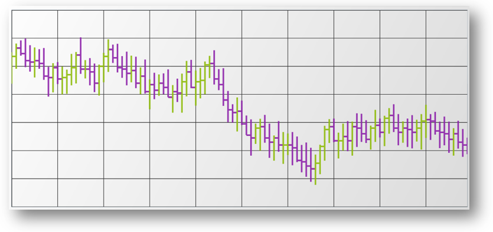

////

|metadata|
{
    "name": "datachart-series-financial-price-series-overview",
    "controlName": ["{DataChartName}"],
    "tags": ["Charting"],
    "guid": "93330a7e-2699-4311-b9c2-1d3df418bf27",  
    "buildFlags": [],
    "createdOn": "2014-06-05T19:39:00.4542971Z"
}
|metadata|
////

= 財務シリーズ

link:{DataChartLink}.{DataChartName}.html[{DataChartName}] コントロールの link:{DataChartLink}.financialpriceseries.html[FinancialPriceSeries] は、株価をプロットして各日の株の高値、安値、始値、終値を示すためによく使用されます。さらに、株価トレンドラインも表示できます。財務物価シリーズは、物価トレンドの変化の測定や検証のために多数のその他の link:datachart-financial-indicators-overview.html[財務指標]と組み合わせて使用される場合が多くあります。

== 表示モード

財務物価シリーズは、 link:{DataChartLink}.financialpriceseries{ApiProp}displaytype.html[DisplayType] プロパティに列挙値を設定することにより構成可能な 2 つの表示モードがあります。

=== ロウソク足チャート

link:{DataChartLink}.financialpriceseries.html[FinancialPriceSeries] ( pick:[wpf,win-universal,android="link:{DataChartLink}.pricedisplaytype.html[Candlestick]"]  モード) は、株価をプロットして各日の株の高値、安値、始値、終値を示すためによく使用されます。各データ ポイントは、上下の両方に垂直線で垂直列としてプロットされます。垂直の線は投資の高値と安値の間の範囲を示します。垂直線の一番上はセッション中の高値を示し、垂直線の一番下はセッション中の低値を示します。垂直柱は、投資の始値と終値の間の期間を示します。開始値と終了値の間で正の値がある場合は Series の Brush を使用して列が満たされ、負の値がある場合は Series の NegativeBrush を使用して列が満たされます。

image::images/xamDataChart_Financial_Price_Series_in_Candlestick_Mode_01.png[]

=== OHLC チャート

link:{DataChartLink}.financialpriceseries.html[FinancialPriceSeries] ( pick:[wpf,win-universal,android="link:{DataChartLink}.pricedisplaytype.html[Candlestick]"]  pick:[xamarin,win-forms="link:{DataChartLinkBase}.pricedisplaytype.html[OHLC]"]  モード) は、株価をプロットして各日の株の高値、安値、始値、終値を示すためによく使用されます。各データ ポイントは、左と右の両側に水平の垂直線を伴った縦の線としてプロットされます。垂直の線は投資の高値と安値の間の範囲を示します。垂直線の一番上はセッション中の高値を示し、垂直線の一番下はセッション中の低値を示します。水平の線は投資の始値と終値の間の範囲を示します。垂直線の左側の水平の線はセッションの開始値を示します。垂直の線の右側の水平の線は取引期間の終値を示します。

== コード例

以下のコード例は、`Candlestick` モードの `FinancialPriceSeries` を `{DataChartName}` コントロールに追加し、 link:resources-sample-stocks-data.html[サンプル株データ] ソースへバインドする方法を示します。

ifdef::xaml[]
*XAML の場合:*
[source,xaml]
----
xmlns:local="clr-namespace:Infragistics.Models;assembly=YourAppName"
----
endif::xaml[]

ifdef::wpf,win-universal[]

*XAML の場合:*
[source,xaml]
----
<ig:{DataChartName} x:Name="chart" >
    <ig:{DataChartName}.Resources>
        <local:StockPriceData x:Key="data" />
    </ig:{DataChartName}.Resources>
    <ig:{DataChartName}.Axes>
        <ig:NumericYAxis x:Name="yAxis"  />
        <ig:CategoryXAxis x:Name="xAxis" ItemsSource="{StaticResource data}" Label="{}{Date}" />
    </ig:{DataChartName}.Axes>
    <ig:{DataChartName}.Series>
        <ig:FinancialPriceSeries 
                DisplayType="Candlestick"  
                ItemsSource="{StaticResource data}" 
                OpenMemberPath="Open" 
                CloseMemberPath="Close" 
                HighMemberPath="High" 
                LowMemberPath="Low" 
                VolumeMemberPath="Volume" 
                XAxis="{Binding ElementName=xAxis}" 
                YAxis="{Binding ElementName=yAxis}">
        </ig:FinancialPriceSeries>       
    </ig:{DataChartName}.Series>
</ig:{DataChartName}>
----

endif::wpf,win-universal[]

ifdef::xamarin[]

*XAML の場合:*
[source,xaml]
----
<ig:XamDataChart x:Name="chart" >
    <ig:{DataChartName}.Resources>
		<ResourceDictionary>
			<local:StockPriceData x:Key="data" />
		</ResourceDictionary>
    </ig:{DataChartName}.Resources>
    <ig:XamDataChart.Axes>
        <ig:NumericYAxis x:Name="yAxis"  />
        <ig:CategoryXAxis x:Name="xAxis" ItemsSource="{StaticResource data}" Label="Date" />
    </ig:XamDataChart.Axes>
    <ig:XamDataChart.Series>
        <ig:FinancialPriceSeries 
                DisplayType="Candlestick"  
                ItemsSource="{StaticResource data}" 
                OpenMemberPath="Open" 
                CloseMemberPath="Close" 
                HighMemberPath="High" 
                LowMemberPath="Low" 
                VolumeMemberPath="Volume" 
                XAxis="{x:Reference xAxis}" 
                YAxis="{x:Reference yAxis}">
        </ig:FinancialPriceSeries>       
    </ig:XamDataChart.Series>
</ig:XamDataChart>
----

endif::xamarin[]

ifdef::wpf,win-universal,xamarin[]
*C# の場合:*
[source,csharp]
----
var data = new StockPriceData(); 
var yAxis = new NumericYAxis();
var xAxis = new CategoryXAxis();
xAxis.ItemsSource = data;
xAxis.Label = "Date";
var series = new FinancialPriceSeries();
series.DisplayType = PriceDisplayType.Candlestick; 
series.ItemsSource = data;
series.OpenMemberPath = "Open";
series.HighMemberPath = "High";
series.LowMemberPath = "Low";
series.CloseMemberPath = "Close";
series.VolumeMemberPath = "Volume";
series.XAxis = xAxis;
series.YAxis = yAxis;
chart.Axes.Add(xAxis);
chart.Axes.Add(yAxis);
chart.Series.Add(series);
----
endif::wpf,win-universal,xamarin[]

ifdef::win-forms[]
*C# の場合:*
[source,csharp]
----
var data = new StockPriceData(); 
var yAxis = new NumericYAxis();
var xAxis = new CategoryXAxis();
xAxis.DataSource = data;
xAxis.Label = "{Date}";
var series = new FinancialPriceSeries();
series.DisplayType = PriceDisplayType.Candlestick; 
series.DataSource = data;
series.OpenMemberPath = "Open";
series.HighMemberPath = "High";
series.LowMemberPath = "Low";
series.CloseMemberPath = "Close";
series.VolumeMemberPath = "Volume";
series.XAxis = xAxis;
series.YAxis = yAxis;
chart.Axes.Add(xAxis);
chart.Axes.Add(yAxis);
chart.Series.Add(series);
----
endif::win-forms[]

ifdef::wpf,win-universal[]

*Visual Basic の場合:*

[source,vb]
----
Dim data As New StockPriceData()
Dim yAxis As New NumericYAxis()
Dim xAxis As New CategoryXAxis()
xAxis.ItemsSource = data
xAxis.Label = "Date"
Dim series As New FinancialPriceSeries()
series.DisplayType = PriceDisplayType.Candlestick
series.ItemsSource = data
series.OpenMemberPath = "Open"
series.HighMemberPath = "High"
series.LowMemberPath = "Low"
series.CloseMemberPath = "Close"
series.VolumeMemberPath = "Volume"
series.XAxis = xAxis
series.YAxis = yAxis
chart.Axes.Add(xAxis)
chart.Axes.Add(yAxis)
chart.Series.Add(series)
----
endif::wpf,win-universal[]

ifdef::win-forms[]

*Visual Basic の場合:*
[source,vb]
----
Dim data As New StockPriceData()
Dim yAxis As New NumericYAxis()
Dim xAxis As New CategoryXAxis()
xAxis.DataSource = data
xAxis.Label = "{Date}"
Dim series As New FinancialPriceSeries()
series.DisplayType = PriceDisplayType.Candlestick
series.DataSource = data
series.OpenMemberPath = "Open"
series.HighMemberPath = "High"
series.LowMemberPath = "Low"
series.CloseMemberPath = "Close"
series.VolumeMemberPath = "Volume"
series.XAxis = xAxis
series.YAxis = yAxis
chart.Axes.Add(xAxis)
chart.Axes.Add(yAxis)
chart.Series.Add(series)
----
endif::win-forms[]

ifdef::android[]

*Java の場合:*

[source,js]
----
StockPriceData data = new StockPriceData();
NumericYAxis yAxis = new NumericYAxis();
CategoryXAxis xAxis = new CategoryXAxis();
xAxis.setDataSource(data);
xAxis.setLabel("Date");
FinancialPriceSeries series = new FinancialPriceSeries();
series.setDisplayType(PriceDisplayType.CANDLESTICK);
series.setDataSource(data);
series.setOpenMemberPath("Open");
series.setHighMemberPath("High");
series.setLowMemberPath("Low");
series.setCloseMemberPath("Close");
series.setVolumeMemberPath("Volume");
series.setXAxis(xAxis);
series.setYAxis(yAxis);
DataChartView chart = new DataChartView(rootView.getContext());
chart.addAxis(xAxis);
chart.addAxis(yAxis);
chart.addSeries(series);
----

endif::android[]