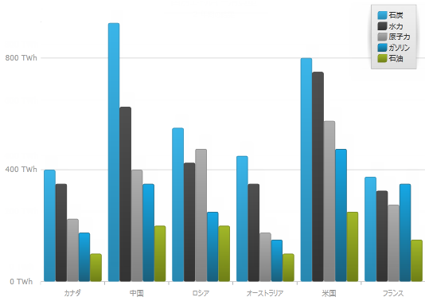
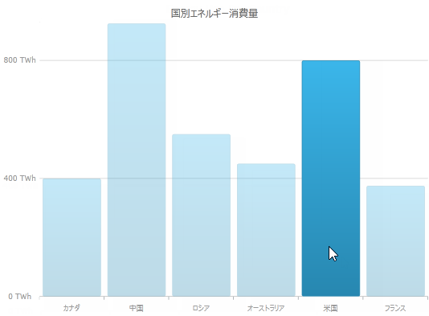

////

|metadata|
{
    "name": "datachart-series-highlighting",
    "tags": ["Getting Started","How Do I"],
    "controlName": ["{DataChartName}"],
    "guid": "e4b3c0e6-4377-45de-91df-9bbd8cb6b932",  
    "buildFlags": ["SL","WPF","win-rt"],
    "createdOn": "2014-06-05T19:39:00.7154047Z"
}
|metadata|
////

= シリーズの強調表示

== トピックの概要

=== 目的

このトピックは、サポートされるシリーズのリストに従って、シリーズの強調表示機能の有効化についての情報を提供します。このトピックでは、利用可能なイベントを使用してシリーズの協調表示を構成する方法についても説明します。

=== 前提条件

このトピックを理解するためには、以下のトピックを理解しておく必要があります:

[options="header", cols="a,a"]
|====
|トピック|目的

| link:datachart-getting-started-with-datachart.html[データ チャートを使用した作業の開始]
|_{DataChartName}_ は、コントロールの `DataContext` プロパティにマップされるデータ オブジェクト モデルを必要とします。ここでは、簡単なデータ オブジェクト モデルを提供しますが、自分自身で作成し、このサンプル コードの代わりに使用することができます。

|====

=== このトピックの内容

このトピックは、以下のセクションで構成されます。

* <<SeriesHighlighting,シリーズの強調表示>>

** <<Overview,概要>>
** <<Preview,プレビュー>>
** <<Properties,プロパティ>>
** <<Example,例>>

* <<Events,イベント>>

** <<Overview1,概要>>
** <<EventArgumentsProperties,イベント引数のプロパティ>>
** <<Example1,例>>

* <<RelatedContent,関連コンテンツ>>

[[SeriesHighlighting]]
== シリーズの強調表示

[[Overview]]

=== 概要

この機能は、シリーズ全体またはシリーズ内の個別の項目を強調表示します。たとえば、 link:{DataChartLink}.lineseries_members.html[LineSeries] などのシリーズ内の線全体を 1 つの図形として強調表示します。また、 link:{DataChartLink}.columnseries_members.html[ColumnSeries] などのシリーズの各列を個別に強調表示することもできます。サポートされるすべてのシリーズで、各マーカーを強調表示できます。

現在は、マウスによる強調表示のみがサポートされています。

シリーズの強調表示機能は、以下のシリーズで使用可能です。

* link:datachart-category-series-overview.html[カテゴリ シリーズ]
* link:datachart-category-range-area-series.html[範囲カテゴリ シリーズ]
* link:datachart-series-financial-price-series-overview.html[財務シリーズ]
* link:datachart-financial-indicators-overview.html[財務指標]

[[Preview]]

=== プレビュー

以下のスクリーンショットは、シリーズの強調表示機能が有効な link:{DataChartLink}.columnseries_members.html[ColumnSeries] の  _xam_  _DataChart_  コントロールのプレビューです。

[[Properties]]

=== プロパティ

以下の表で、シリーズの強調表示で使用されるプロパティを簡単に説明します。これらのプロパティはサポートされるシリーズに設定されています。

[options="header", cols="a,a,a"]
|====
|*プロパティ名*|*プロパティ タイプ*|*説明*

| link:{DataChartLink}.series{ApiProp}ishighlightingenabled.html[IsHighlightingEnabled]
|`Boolean`
|シリーズの強調表示機能を有効にします。デフォルトは False に設定されています。

| link:{DataChartLinkBase}.{DataChartBase}{ApiProp}highlightingtransitionduration.html[HighlightingTransitionDuration]
|`TimeSpan`
|強調表示になるまでの時間を指定します。

|====

[[Example]]

=== 例

表の下のスクリーンショットは、以下の設定の結果、 link:{DataChartLink}.columnseries_members.html[ColumnSeries] の link:{DataChartLink}.series{ApiProp}ishighlightingenabled.html[IsHighlightingEnabled] と link:{DataChartLinkBase}.{DataChartBase}{ApiProp}highlightingtransitionduration.html[HighlightingTransitionDuration] プロパティで設定されたチャートの外観がどのようになるか示しています。

[options="header", cols="a,a"]
|====
|プロパティ|値

| link:{DataChartLink}.series{ApiProp}ishighlightingenabled.html[IsHighlightingEnabled]
|True

| link:{DataChartLinkBase}.{DataChartBase}{ApiProp}highlightingtransitionduration.html[HighlightingTransitionDuration]
|0:00:10

|====

以下のコードはこの例を実装します。

ifdef::wpf,win-universal[]

*XAML の場合:*

[source,xaml]
----
<ig:{DataChartName} x:Name="xamColumnChart" 
                 HighlightingTransitionDuration="00:00:10"
 <ig:{DataChartName}.Series>
 <ig:ColumnSeries ItemsSource="{Binding EnergySampleData}"
                       ValueMemberPath="Coal"
                       Source="{StaticResource DataViewModel}"
                       XAxis="{Binding ElementName=ColumnXAxis}"
                       YAxis="{Binding ElementName=ColumnYAxis}"
                       IsHighlightingEnabled="True">
 </ig:ColumnSeries>
 </ig:{DataChartName}.Series>
</ig:{DataChartName}>
----

endif::wpf,win-universal[]

[[Events]]
== イベント

[[Overview1]]

=== 概要

特に、シリーズの強調表示機能と関連があるイベントは 2 つあります。

* link:{DataChartLink}.categoryseries{ApiProp}assigningcategorystyle_ev.html[AssigningCategoryStyle]
* link:{DataChartLink}.categoryseries{ApiProp}assigningcategorymarkerstyle_ev.html[AssigningCategoryMarkerStyle]

シリーズの強調表示機能は、以下のシリーズで使用可能です。

* link:datachart-category-series-overview.html[カテゴリ シリーズ]
* link:datachart-category-range-area-series.html[範囲カテゴリ シリーズ]
* link:datachart-series-financial-price-series-overview.html[財務シリーズ]
* link:datachart-financial-indicators-overview.html[財務指標]

これらのイベントは次の目的で構成することができます。

* 強調表示の指定方法の変更
* link:{DataChartLink}.lineseries_members.html[LineSeries] などのシリーズ全体に割り当てられた外観プロパティや、 link:{DataChartLink}.columnseries_members.html[ColumnSeries] のように個別の項目を持つシリーズの各項目の外観プロパティを変更します。

前述のイベントを使用してシリーズの強調表示を設定した場合、特定のシリーズで有効なプロパティのみが使用できます。たとえば link:{DataChartLink}.lineseries_members.html[LineSeries] の Fill または RadiusX プロパティのオーバーライドは、それらのプロパティが link:{DataChartLink}.lineseries_members.html[LineSeries] に作用しないため何も影響がありません。

[[EventArgumentsProperties]]

=== イベント引数のプロパティ

以下の表に、 link:{DataChartLink}.assigningcategorystyleeventargsbase_members.html[AssigningCategoryStyleEventArgsBase] のプロパティを簡単に説明します。

[options="header", cols="a,a,a"]
|====
|*プロパティ名*|*プロパティ タイプ*|* 説明*

| link:{DataChartLink}.assigningcategorystyleeventargsbase{ApiProp}startindex.html[StartIndex]
|`int`
|現在、強調表示されているデータの範囲の開始インデックスです。

| link:{DataChartLink}.assigningcategorystyleeventargsbase{ApiProp}endindex.html[EndIndex]
|`int`
|現在、強調表示されているデータの範囲の終了インデックスです。

| link:{DataChartLink}.assigningcategorystyleeventargsbase{ApiProp}startdate.html[StartDate]
|`DateTime`
|現在、強調表示されているデータの範囲の開始日付です。

| link:{DataChartLink}.assigningcategorystyleeventargsbase{ApiProp}enddate.html[EndDate]
|`DateTime`
|現在、強調表示されているデータの範囲の終了日付です。

| link:{DataChartLink}.assigningcategorystyleeventargsbase{ApiProp}getitems.html[GetItems]
|`GetCategoryItemsEventHandler`
|強調表示されているデータ ソースの実際の項目です。非常に多くのデータが対象の場合にイベントが発生するたびに呼び出すと、パフォーマンスが低下します。

| link:{DataChartLink}.assigningcategorystyleeventargsbase{ApiProp}fill.html[Fill]
|`Brush`
|シリーズのデフォルトの link:{DataChartLink}.assigningcategorystyleeventargsbase{ApiProp}fill.html[Fill] プロパティをオーバーライドします。Fill プロパティが特定のシリーズに影響を与える場合のみ、このプロパティが作用します。

| link:{DataChartLink}.assigningcategorystyleeventargsbase{ApiProp}stroke.html[Stroke]
|`Brush`
|シリーズのデフォルトの link:{DataChartLink}.assigningcategorystyleeventargsbase{ApiProp}stroke.html[Stroke] プロパティをオーバーライドします。

| link:{DataChartLink}.assigningcategorystyleeventargsbase{ApiProp}opacity.html[Opacity]
|`Double`
|シリーズのデフォルトの link:{DataChartLink}.assigningcategorystyleeventargsbase{ApiProp}opacity.html[Opacity] プロパティをオーバーライドします。

| link:{DataChartLink}.assigningcategorystyleeventargsbase{ApiProp}highlightinginfo.html[HighlightingInfo]
|`HiglightingInfo`
|強調表示されたシリーズのスタイル設定を指定します。

| link:{DataChartLink}.assigningcategorystyleeventargsbase{ApiProp}maxallserieshighlightingprogress.html[MaxAllSeriesHighlightingProgress]
|`Double`
|シリーズの強調表示の進捗状況です。0 から 1 の値です。

| link:{DataChartLink}.assigningcategorystyleeventargsbase{ApiProp}sumallserieshighlightingprogress.html[SumAllSeriesHighlightingProgress]
|`Double`
|シリーズの強調表示の進捗状況です。0 から 1 の値です。

| link:{DataChartLink}.assigningcategorystyleeventargsbase{ApiProp}highlightinghandled.html[HighlightingHandled]
|`Bool`
|True に設定すると、デフォルトの強調表示が適用されません。

| link:{DataChartLink}.assigningcategorystyleeventargsbase{ApiProp}hasdaterange.html[HasDateRange]
|`Bool`
|このイベントが有効な日付範囲かどうかを決定します。

|====

link:{DataChartLink}.assigningcategorymarkerstyleeventargs_members.html[AssigningCategoryMarkerStyleEventArgs] は、上記の表に示すように link:{DataChartLink}.assigningcategorystyleeventargsbase_members.html[AssigningCategoryStyleEventArgsBase] と同じプロパティをすべて継承します。

[[Example1]]

=== 例

以下のスクリーンショットは、強調表示された列を変更する代わりに、強調表示されていない列をフェードするために、 link:{DataChartLink}.categoryseries{ApiProp}assigningcategorystyle_ev.html[AssigningCategoryStyle] イベントを使用して強調表示機能を変更する例を示しています。

以下はこの例における実装コードです。

ifdef::wpf[]

*C# の場合:*

[source,csharp]
----
private void CategorySeries_OnAssigningCategoryStyle(object sender, AssigningCategoryStyleEventArgs args)
{
 double minOpacity = .3, opacity = 1.0;
   if (args.SumAllSeriesHighlightingProgress > 0.0)
   {
      var progress = 0.0;
      if (args.HighlightingInfo != null)
      {
         progress = args.HighlightingInfo.Progress;
      }
      progress = progress - args.SumAllSeriesHighlightingProgress;
      opacity = minOpacity + (1.0 + progress) * (1.0 - minOpacity);
      args.Opacity = opacity;
      args.HighlightingHandled = true;
      for (var i = 0; i < this.DataChart.Series.Count; i++)
      {
         var curr = this.DataChart.Series[i];
         var series = sender as Infragistics.Controls.Charts.Series;
         if (series != null && series.Name != curr.Name)
         {
            curr.NotifyVisualPropertiesChanged();
         }
      }
   }
}
----

endif::wpf[]

ifdef::win-forms[]

*C# の場合:*

[source,csharp]
----
private void CategorySeries_OnAssigningCategoryStyle(object sender, AssigningCategoryStyleEventArgs args)
{
 double minOpacity = .3, opacity = 1.0;
   if (args.SumAllSeriesHighlightingProgress > 0.0)
   {
      var progress = 0.0;
      if (args.HighlightingInfo != null)
      {
         progress = args.HighlightingInfo.Progress;
      }
      progress = progress - args.SumAllSeriesHighlightingProgress;
      opacity = minOpacity + (1.0 + progress) * (1.0 - minOpacity);
      args.Opacity = opacity;
      args.HighlightingHandled = true;
      for (var i = 0; i < this.DataChart.Series.Count; i++)
      {
         var curr = this.DataChart.Series[i];
         var series = sender as Infragistics.Controls.Charts.Series;
         if (series != null && series.Name != curr.Name)
         {
            curr.NotifyVisualPropertiesChanged();
         }
      }
   }
}
----

endif::win-forms[]

ifdef::xamarin[]

*C# の場合:*

[source,csharp]
----
private void CategorySeries_OnAssigningCategoryStyle(object sender, AssigningCategoryStyleEventArgs args)
{
 double minOpacity = .3, opacity = 1.0;
   if (args.SumAllSeriesHighlightingProgress > 0.0)
   {
      var progress = 0.0;
      if (args.HighlightingInfo != null)
      {
         progress = args.HighlightingInfo.Progress;
      }
      progress = progress - args.SumAllSeriesHighlightingProgress;
      opacity = minOpacity + (1.0 + progress) * (1.0 - minOpacity);
      args.Opacity = opacity;
      args.HighlightingHandled = true;
      for (var i = 0; i < this.DataChart.Series.Count; i++)
      {
         var curr = this.DataChart.Series[i];
         var series = sender as Infragistics.Controls.Charts.Series;
         if (series != null && series.Name != curr.Name)
         {
            curr.NotifyVisualPropertiesChanged();
         }
      }
   }
}
----

endif::xamarin[]

ifdef::wpf[]

*Visual Basic の場合:*

[source,vb]
----
Private Sub CategorySeries_OnAssigningCategoryStyle(ByVal sender As Object, ByVal args As AssigningCategoryStyleEventArgs) 
Dim minOpacity As Double 3 
Dim opacity As Double 1 
If (args.SumAllSeriesHighlightingProgress > 0) Then 
 Dim progress As var = 0 
 If (Not (args.HighlightingInfo) Is Nothing) Then 
 progress = args.HighlightingInfo.Progress 
 End If 
 progress = (progress - args.SumAllSeriesHighlightingProgress) 
 opacity = (minOpacity + ((1 + progress) * (1 - minOpacity))) 
 args.Opacity = opacity 
 args.HighlightingHandled = true 
 Dim i As var = 0 
 Do While (i < Me.DataChart.Series.Count) 
 Dim curr As var = Me.DataChart.Series(i) 
 Dim series As var = CType(sender,Infragistics.Controls.Charts.Series) 
 If ((Not (series) Is Nothing) 
 AndAlso (series.Name <> curr.Name)) Then 
 curr.NotifyVisualPropertiesChanged 
 End If 
 i = (i + 1) 
 Loop 
 End If
End Sub
----

endif::wpf[]

ifdef::win-forms[]

*Visual Basic の場合:*

[source,vb]
----
Private Sub CategorySeries_OnAssigningCategoryStyle(ByVal sender As Object, ByVal args As AssigningCategoryStyleEventArgs) 
Dim minOpacity As Double 3 
Dim opacity As Double 1 
If (args.SumAllSeriesHighlightingProgress > 0) Then 
 Dim progress As var = 0 
 If (Not (args.HighlightingInfo) Is Nothing) Then 
 progress = args.HighlightingInfo.Progress 
 End If 
 progress = (progress - args.SumAllSeriesHighlightingProgress) 
 opacity = (minOpacity + ((1 + progress) * (1 - minOpacity))) 
 args.Opacity = opacity 
 args.HighlightingHandled = true 
 Dim i As var = 0 
 Do While (i < Me.DataChart.Series.Count) 
 Dim curr As var = Me.DataChart.Series(i) 
 Dim series As var = CType(sender,Infragistics.Controls.Charts.Series) 
 If ((Not (series) Is Nothing) 
 AndAlso (series.Name <> curr.Name)) Then 
 curr.NotifyVisualPropertiesChanged 
 End If 
 i = (i + 1) 
 Loop 
 End If
End Sub
----

endif::win-forms[]

ifdef::xamarin[]

*Visual Basic の場合:*

[source,vb]
----
Private Sub CategorySeries_OnAssigningCategoryStyle(ByVal sender As Object, ByVal args As AssigningCategoryStyleEventArgs) 
Dim minOpacity As Double 3 
Dim opacity As Double 1 
If (args.SumAllSeriesHighlightingProgress > 0) Then 
 Dim progress As var = 0 
 If (Not (args.HighlightingInfo) Is Nothing) Then 
 progress = args.HighlightingInfo.Progress 
 End If 
 progress = (progress - args.SumAllSeriesHighlightingProgress) 
 opacity = (minOpacity + ((1 + progress) * (1 - minOpacity))) 
 args.Opacity = opacity 
 args.HighlightingHandled = true 
 Dim i As var = 0 
 Do While (i < Me.DataChart.Series.Count) 
 Dim curr As var = Me.DataChart.Series(i) 
 Dim series As var = CType(sender,Infragistics.Controls.Charts.Series) 
 If ((Not (series) Is Nothing) 
 AndAlso (series.Name <> curr.Name)) Then 
 curr.NotifyVisualPropertiesChanged 
 End If 
 i = (i + 1) 
 Loop 
 End If
End Sub
----

endif::xamarin[]

[[RelatedContent]]
== 関連コンテンツ

このトピックの追加情報については、以下のトピックも合わせてご参照ください。

[options="header", cols="a,a"]
|====
|トピック|目的

| link:datachart-getting-started-with-datachart.html[データ チャートを使用した作業の開始]
|{DataChartName} は、コントロールの DataContext プロパティにマップされるデータ オブジェクト モデルを必要とします。ここでは、簡単なデータ オブジェクト モデルを提供しますが、自分自身で作成し、このサンプル コードの代わりに使用することができます。

| link:datachart-using-datachart.html[{DataChartName} の構成]
|このセクションでは、{DataChartName} コントロールのさまざまな機能を使用するために役立つ、重要な概念やタスク ベースの情報について説明します。

|====