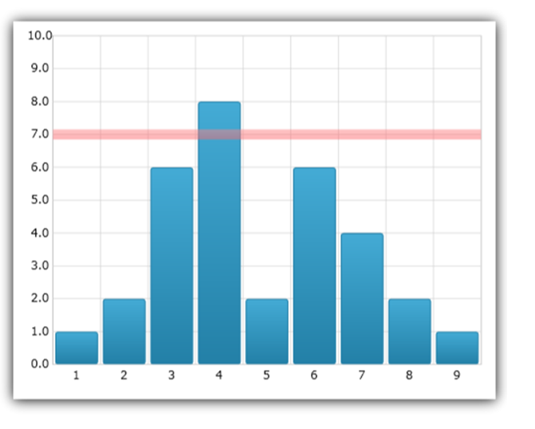
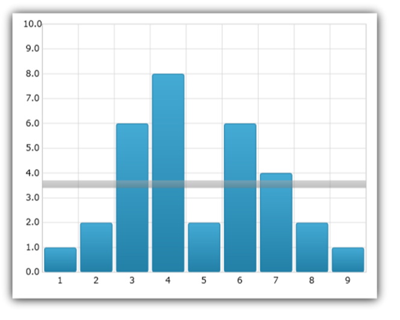
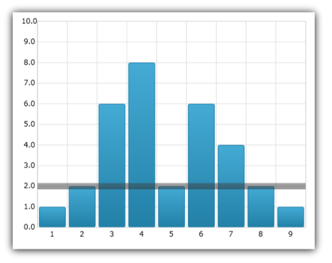
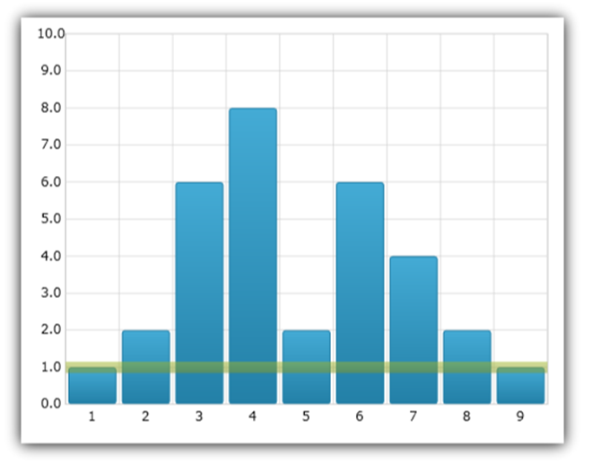

////
|metadata|
{
    "name": "datachart-series-value-overlay",
    "controlName": ["{DataChartName}"],
    "tags": ["Charting","Data Binding","Data Presentation","How Do I"],
    "guid": "94652e25-df0a-49e8-9bb6-16fa8def811f",
    "buildFlags": ["wpf","win-universal","WINFORMS"],
    "createdOn": "2014-06-05T19:39:00.6373746Z"
}
|metadata|
////

= 値オーバーレイ

このトピックは、 link:{DataChartLink}.{DataChartName}.html[{DataChartName}]™ コントロールの値オーバーレイ機能を紹介し、コード例を示して、値のオーバーレイの表示方法を説明します。

== 概要

トピックは以下のとおりです。

* <<Introduction,概要>>
* <<AxisAnnotations,軸の注釈>>
* <<BindingFixedValue,固定値のバインド>>

ifdef::wpf,win-universal[]
* <<BindingValueSlider,スライダーの値のバインド>>

endif::wpf,win-universal[]

ifdef::wpf,win-universal[]
* <<BindingMathCalculators,数学計算式のバインド>>

endif::wpf,win-universal[]

ifdef::wpf,win-universal[]
* <<BindingMeanCalculator,平均値計算機のバインド>>

endif::wpf,win-universal[]

ifdef::wpf,win-universal[]
* <<BindingMedianCalculator,中央値計算機のバインド>>

endif::wpf,win-universal[]

ifdef::wpf,win-universal[]
* <<BindingVarianceCalculator,バリアンス計算式のバインド>>

endif::wpf,win-universal[]

ifdef::wpf,win-universal[]
* <<BindingCustomCalculator,カスタム計算機のバインド>>

endif::wpf,win-universal[]

* <<RelatedContent,関連コンテンツ>>

** link:datachart-multiple-axes.html[複数軸の使用]
** link:datachart-multiple-series.html[複数シリーズの追加]
** link:datachart-series-types.html[シリーズ タイプ]

[[Introduction]]
== 概要

link:{DataChartLink}.{DataChartName}.html[{DataChartName}]™ コントロールで、 link:{DataChartLink}.valueoverlay.html[ValueOverlay] を使用して、データ セットの平均/中央値などの重要な値を示すために、その他のタイプのシリーズ上の線としてひとつの数値をオーバーレイします。データ バインドに link:{DataChartLink}.series~{ApiDataSource}.html[{ApiDataSource}]  プロパティを使用するその他のタイプのシリーズと異なり、ValueOverlay は link:{DataChartLink}.valueoverlay{ApiProp}value.html[Value] プロパティを使用して数値をバインドします。さらに、ValueOverlay が参照として使用する軸はひとつだけです。ValueOverlay は、 link:{DataChartLink}.numericxaxis.html[NumericXAxis] と link:{DataChartLink}.numericyaxis.html[NumericYAxis] にそれぞれバインドされると水平線/垂直線になり、 link:{DataChartLink}.numericangleaxis.html[NumericAngleAxis] にバインドされるとチャートの中心から開始する線となり、 link:{DataChartLink}.numericradiusaxis.html[NumericRadiusAxis] にバインドされると円になります。

image::images/xamDataChart_Series_Value_Overlay_01.png[]

ValueOverlay の外観プロパティは、 link:{DataChartLink}.series.html[Series] 基本クラスから継承されるため、link:{DataChartLink}.series{ApiProp}brush.html[Brush] pick:[win-forms,xamarin="および "]pick:[win-universal,wpf="、"]link:{DataChartLink}.series{ApiProp}thickness.html[Thickness] pick:[wpf,win-universal="および"] pick:[wpf,win-universal=" link:{DataChartLink}.series{ApiProp}dasharray.html[DashArray]"] を使用でき、その他のタイプのシリーズと同じ方法で使用されます。

[[AxisAnnotations]]
== 軸の注釈

{DataChartName} では、軸に注釈を追加して、その軸上のさまざまな点に特定の値を表示することができます。これによって最終的なシリーズ値、オーバーレイ値、チャート内の十字線に対応する値などを可視化するのに役立ちます。

軸の注釈を有効にするには、対応オーバーレイの IsAxisAnnotationEnabled プロパティを true に設定します。これにより、対応する所有軸または軸上に特定のオーバーレイまたはレイヤーのある現在のポイントで表す値を持つボックスを配置します。

背景、値の精度、アウトライン、パディング、ストローク (アウトライン) の太さ、およびテキストの色で軸の注釈をカスタマイズできます。これらは、それぞれ link:{DataChartLink}.valueoverlay{ApiProp}axisannotationbackground.html[AxisAnnotationBackground]、link:{DataChartLink}.valueoverlay{ApiProp}axisannotationinterpolatedvalueprecision.html[AxisAnnotationInterpolatedValuePrecision]、 link:{DataChartLink}.valueoverlay{ApiProp}axisannotationoutline.html[AxisAnnotationOutline]、link:{DataChartLink}.valueoverlay{ApiProp}axisannotationpadding.html[AxisAnnotationPadding],link:{DataChartLink}.valueoverlay{ApiProp}axisannotationstrokethickness.html[AxisAnnotationStrokeThickness]、および link:{DataChartLink}.valueoverlay{ApiProp}axisannotationtextcolor.html[AxisAnnotationTextColor] プロパティを使用して設定できます。これらのプロパティに加えて、 link:{DataChartLink}.valueoverlay{ApiProp}axisannotationformatlabel_ev.html[AxisAnnotationFormatLabel] イベントもあります。これを使用して、軸注釈に表示されるコンテンツを完全にカスタマイズできます。

このコードは、データ チャート コントロールの ValueOverlay に軸注釈を追加する方法を示します。

ifdef::wpf[]

*XAML の場合:*

----
xmlns:ig="http://schemas.infragistics.com/xaml"
xmlns:local="clr-namespace:[DATA_MODEL_NAMESPACE]"
----

endif::wpf[]

ifdef::win-universal[]

*XAML の場合:*

----
xmlns:ig="using:Infragistics.Controls.Charts"xmlns:local="using:[DATA_MODEL_NAMESPACE]"
----

endif::win-universal[]

ifdef::wpf,win-universal[]

*XAML の場合:*

[source]
----
<ig:{DataChartName} x:Name="DataChart" >
    <ig:{DataChartName}.Resources>
        <models:NumericDataSample x:Key="data" />
    </ig:{DataChartName}.Resources>
    <ig:{DataChartName}.Axes>
        <ig:CategoryXAxis x:Name="categoryXAxis" Interval="1"
                          ItemsSource="{StaticResource data}" Label="{}{X}"/>
        <ig:NumericYAxis x:Name="numericYAxis" MinimumValue="0" MaximumValue="10"
                         Interval="1" Label="{}{:N1}" />
    </ig:{DataChartName}.Axes>
    <ig:{DataChartName}.Series>
        <ig:ColumnSeries ItemsSource="{StaticResource data}" 
                         ValueMemberPath="Y"  
                         XAxis="{Binding ElementName=categoryXAxis}" 
                         YAxis="{Binding ElementName=numericYAxis}">
        </ig:ColumnSeries>
        <ig:ValueOverlay IsAxisAnnotationEnabled="True" Axis="{Binding ElementName=numericYAxis}" 
                         Value="7.0" Thickness="5" />
    </ig:{DataChartName}.Series>
----

[source]
----
</ig:{DataChartName}>
----

endif::wpf,win-universal[]

ifdef::wpf[]

*Visual Basic の場合:*

----
Dim overlay As New ValueOverlay()
overlay.Axis = Me.numericYAxis
overlay.Value = 7.0
overlay.IsAxisAnnotationEnabled = true
Me.DataChart.Series.Add(overlay)
----

endif::wpf[]

ifdef::win-forms[]

*Visual Basic の場合:*

----
Dim overlay As New ValueOverlay()
overlay.Axis = Me.numericYAxis
overlay.Value = 7.0
overlay.IsAxisAnnotationEnabled = true
Me.DataChart.Series.Add(overlay)
----

endif::win-forms[]

ifdef::xamarin[]

*Visual Basic の場合:*

----
Dim overlay As New ValueOverlay()
overlay.Axis = Me.numericYAxis
overlay.Value = 7.0
overlay.IsAxisAnnotationEnabled = true
Me.DataChart.Series.Add(overlay)
----

endif::xamarin[]

ifdef::wpf[]

*C# の場合:*

----
var overlay = new ValueOverlay();
overlay.Axis = this.numericYAxis;
overlay.Value = 7.0;
overlay.IsAxisAnnotationEnabled = true;
this.DataChart.Series.Add(overlay);
----

endif::wpf[]

ifdef::win-forms[]

*C# の場合:*

----
var overlay = new ValueOverlay();
overlay.Axis = this.numericYAxis;
overlay.Value = 7.0;
overlay.IsAxisAnnotationEnabled = true;
this.DataChart.Series.Add(overlay);
----

endif::win-forms[]

ifdef::xamarin[]

*C# の場合:*

----
var overlay = new ValueOverlay();
overlay.Axis = this.numericYAxis;
overlay.Value = 7.0;
overlay.IsAxisAnnotationEnabled = true;
this.DataChart.Series.Add(overlay);
----

endif::xamarin[]

以下のセクションは、さまざまな項目を ValueOverlay にバインドする方法を示します。

[[BindingFixedValue]]
== 固定値のバインド

このコードは、データ チャート コントロールで固定値を ValueOverlay にバインドする方法を示します。

ifdef::wpf[]

*XAML の場合:*

----
xmlns:ig="http://schemas.infragistics.com/xaml"
xmlns:local="clr-namespace:[DATA_MODEL_NAMESPACE]"
----

endif::wpf[]

ifdef::win-universal[]

*XAML の場合:*

----
xmlns:ig="using:Infragistics.Controls.Charts"xmlns:local="using:[DATA_MODEL_NAMESPACE]"
----

endif::win-universal[]

ifdef::wpf,win-universal[]

*XAML の場合:*

[source]
----
<ig:{DataChartName} x:Name="DataChart" >
    <ig:{DataChartName}.Resources>
        <models:NumericDataSample x:Key="data" />
    </ig:{DataChartName}.Resources>
    <ig:{DataChartName}.Axes>
        <ig:CategoryXAxis x:Name="categoryXAxis" Interval="1"
                          ItemsSource="{StaticResource data}" Label="{}{X}"/>
        <ig:NumericYAxis x:Name="numericYAxis" MinimumValue="0" MaximumValue="10"
                         Interval="1" Label="{}{:N1}" />
    </ig:{DataChartName}.Axes>
    <ig:{DataChartName}.Series>
        <ig:ColumnSeries ItemsSource="{StaticResource data}" 
                         ValueMemberPath="Y"  
                         XAxis="{Binding ElementName=categoryXAxis}" 
                         YAxis="{Binding ElementName=numericYAxis}">
        </ig:ColumnSeries>
        <ig:ValueOverlay Axis="{Binding ElementName=numericYAxis}" 
                         Value="7.0" Thickness="5" />
    </ig:{DataChartName}.Series>
----

[source]
----
</ig:{DataChartName}>
----

endif::wpf,win-universal[]

ifdef::wpf[]

*Visual Basic の場合:*

----
Dim overlay As New ValueOverlay()
overlay.Axis = Me.numericYAxis
overlay.Value = 7.0
Me.DataChart.Series.Add(overlay)
----

endif::wpf[]

ifdef::win-forms[]

*Visual Basic の場合:*

----
Dim overlay As New ValueOverlay()
overlay.Axis = Me.numericYAxis
overlay.Value = 7.0
Me.DataChart.Series.Add(overlay)
----

endif::win-forms[]

ifdef::xamarin[]

*Visual Basic の場合:*

----
Dim overlay As New ValueOverlay()
overlay.Axis = Me.numericYAxis
overlay.Value = 7.0
Me.DataChart.Series.Add(overlay)
----

endif::xamarin[]

ifdef::wpf[]

*C# の場合:*

----
var overlay = new ValueOverlay();
overlay.Axis = this.numericYAxis;
overlay.Value = 7.0;
this.DataChart.Series.Add(overlay);
----

endif::wpf[]

ifdef::win-forms[]

*C# の場合:*

----
var overlay = new ValueOverlay();
overlay.Axis = this.numericYAxis;
overlay.Value = 7.0;
this.DataChart.Series.Add(overlay);
----

endif::win-forms[]

ifdef::xamarin[]

*C# の場合:*

----
var overlay = new ValueOverlay();
overlay.Axis = this.numericYAxis;
overlay.Value = 7.0;
this.DataChart.Series.Add(overlay);
----

endif::xamarin[]

以下の画像は、値 7 にバインドし、データ チャートの柱状シリーズ上にオーバーレイされた ValueOverlay を示します。

ifdef::wpf,win-universal[]

[[BindingValueSlider]]
== スライダーの値のバインド
endif::wpf,win-universal[]

ifdef::wpf,win-universal[]
このコードは、データ チャート コントロールで Slider コントロールの値を ValueOverlay にバインドする方法を示します。
endif::wpf,win-universal[]

ifdef::wpf[]

*XAML の場合:*

----
xmlns:ig="http://schemas.infragistics.com/xaml"
xmlns:local="clr-namespace:[DATA_MODEL_NAMESPACE]"
----

endif::wpf[]

ifdef::win-universal[]

*XAML の場合:*

----
xmlns:ig="using:Infragistics.Controls.Charts"xmlns:local="using:[DATA_MODEL_NAMESPACE]"
----

endif::win-universal[]

ifdef::wpf,win-universal[]

*XAML の場合:*

[source]
----
<ig:{DataChartName}>
----

[source]
----
    <ig:{DataChartName}.Resources>        <models:NumericDataSample x:Key="data" />    </ig:{DataChartName}.Resources>
    <ig:{DataChartName}.Axes>
        <ig:CategoryXAxis x:Name="categoryXAxis" Interval="1"                         ItemsSource="{StaticResource data}" Label="{}{X}"/>
        <ig:NumericYAxis x:Name="numericYAxis" MinimumValue="0" MaximumValue="10"                         Interval="1" Label="{}{:N1}" />
    </ig:{DataChartName}.Axes>
    <ig:{DataChartName}.Series>
        <ig:ColumnSeries ItemsSource="{StaticResource data}" 
                        ValueMemberPath="Y" 
                        XAxis="{Binding ElementName=categoryXAxis}" 
                        YAxis="{Binding ElementName=numericYAxis}">
        </ig:ColumnSeries>
        <ig:ValueOverlay Axis="{Binding ElementName=numericYAxis}" Thickness="5" 
                        Value="{Binding Value, ElementName=ValueSlider}" />
    </ig:{DataChartName}.Series> </ig:{DataChartName}>
<Slider x:Name="ValueSlider" Value="5" Minimum="0" Maximum="10" />
---- 

endif::wpf,win-universal[]

ifdef::wpf,win-universal[]

*Visual Basic の場合:*

----
Dim overlay As New ValueOverlay()
overlay.Axis = Me.numericYAxis
overlay.Value = Me.ValueSlider.Value
Me.DataChart.Series.Add(overlay)
----

endif::wpf,win-universal[]

ifdef::wpf,win-universal[]

*C# の場合:*

----
var overlay = new ValueOverlay();
overlay.Axis = this.numericYAxis;
overlay.Value = this.ValueSlider.Value;
this.DataChart.Series.Add(overlay);
----

endif::wpf,win-universal[]

ifdef::wpf,win-universal[]
以下の画像は、Slider コントロールの値にバインドし、データ チャートの柱状シリーズ上にオーバーレイされた ValueOverlay を示します。
endif::wpf,win-universal[]

ifdef::wpf,win-universal[]

image::images/xamDataChart_Series_Value_Overlay_03.png[]

endif::wpf,win-universal[]

ifdef::wpf,win-universal[]

[[BindingMathCalculators]]
== 数学計算式のバインド
endif::wpf,win-universal[]

ifdef::wpf,win-universal[]
以下のセクションは、Infragistics Math Calculators アセンブリによって提供される Math Calculator と ValueOverlay を使用する方法を示します。As result you need to add the Infragistics.WPF.Math.Calculators NuGet package as reference to your project before you start using these code snippets.
endif::wpf,win-universal[]

ifdef::wpf,win-universal[]
すべての Math Calculator は、タイプ IEnumerable の link:{DataChartLink}.series~{ApiDataSource}.html[{ApiDataSource}] と数値プロパティをポイントしなければならない link:{ApiPlatform}math.calculators{ApiVersion}~infragistics.math.calculators.itemssourcecalculator{ApiProp}valuememberpath.html[ValueMemberPath] を受け付けます。ItemsSource のオブジェクトが数値プリミティブの場合、ValueMemberPath を空の文字列に設定する必要があります。
endif::wpf,win-universal[]

ifdef::wpf,win-universal[]

*Visual Basic の場合:*

----
Public Class ListOfDouble
    Inherits System.Collections.Generic.List(Of Double)
End Class
----

endif::wpf,win-universal[]

ifdef::wpf,win-universal[]

*C# の場合:*

----
public class ListOfDouble : System.Collections.Generic.List<double>
{
}
----

endif::wpf,win-universal[]

ifdef::wpf[]

*XAML の場合:*

[source]
----
xmlns:ig="http://schemas.infragistics.com/xaml"
----

xmlns:igMath="http://schemas.infragistics.com/xaml"

[source]
----
xmlns:system="clr-namespace:System;assembly=mscorlib"xmlns:generic="clr-namespace:[DATA_MODEL_NAMESPACE]"
---- 

endif::wpf[]

ifdef::win-universal[]

*XAML の場合:*

[source]
----
xmlns:ig="using:Infragistics.Controls.Charts"
----

[source]
----
xmlns:igMath="using:Infragistics.Math.Calculators"
----

[source]
----
xmlns:generic="using:[DATA_MODEL_NAMESPACE]"xmlns:system="http://schemas.microsoft.com/winfx/2006/xaml"
---- 

endif::win-universal[]

ifdef::wpf,win-universal[]

*XAML の場合:*

----
<generic:ListOfDouble x:Key="NumericPrimitives">
    <system:Double>1.0</system:Double>
    <system:Double>2.0</system:Double>
    <system:Double>6.0</system:Double>
    <system:Double>8.0</system:Double>
    <system:Double>2.0</system:Double>
    <system:Double>6.0</system:Double>
    <system:Double>4.0</system:Double>
    <system:Double>2.0</system:Double>
    <system:Double>1.0</system:Double>
</generic:ListOfDouble>
<!--...-->
<igMath:MeanCalculator x:Key="MeanCalculator" ValueMemberPath=""                        ItemsSource="{StaticResource NumericPrimitives}" />
----

endif::wpf,win-universal[]

ifdef::wpf,win-universal[]

*Visual Basic の場合:*

----
Dim meanCalculator As New MeanCalculator()
meanCalculator.ValueMemberPath = String.Empty
meanCalculator.ItemsSource = New List(Of Double)() From { 1, 2, 6, 8, 2, 6, 4, 2, 1 }
----

endif::wpf,win-universal[]

ifdef::wpf,win-universal[]

*C# の場合:*

----
var meanCalculator = new MeanCalculator();
meanCalculator.ValueMemberPath = string.Empty;
meanCalculator.ItemsSource = new List<double> { 1, 2, 6, 8, 2, 6, 4, 2, 1 };
----

endif::wpf,win-universal[]

ifdef::wpf,win-universal[]
.注:
[NOTE]
====
このセクションのすべてのコードは Math Calculators のデータ ソースとして link:resources-numeric-data-sample-1.html[Sample Numeric Data] と基本の link:{DataChartLink}.columnseries.html[ColumnSeries] を使用しますが、代わりに開発者固有のデータを提供することもできます。
====
endif::wpf,win-universal[]

ifdef::wpf,win-universal[]

[[BindingMeanCalculator]]
== 平均値計算機のバインド
endif::wpf,win-universal[]

ifdef::wpf,win-universal[]
link:{ApiPlatform}math.calculators{ApiVersion}~infragistics.math.calculators.meancalculator.html[MeanCalculator] は数字のシリーズの「一般的な」値または「平均」値を決定するために使用される算術計算です。平均は、シリーズの数字の合計をシリーズの数字の数で割って計算されます。平均は代表値のひとつで、その他はモードと中央値です。
endif::wpf,win-universal[]

ifdef::wpf,win-universal[]
このコードは、データ チャート コントロールで MeanCalculator の値を ValueOverlay にバインドする方法を示します。
endif::wpf,win-universal[]

ifdef::wpf[]

*XAML の場合:*

----
xmlns:ig="http://schemas.infragistics.com/xaml"xmlns:igMath="http://schemas.infragistics.com/xaml"
xmlns:models="clr-namespace:[DATA_MODEL_NAMESPACE]"
----

endif::wpf[]

ifdef::win-universal[]

*XAML の場合:*

----
xmlns:ig="using:Infragistics.Controls.Charts"xmlns:igMath="using:Infragistics.Math.Calculators"xmlns:models="using:[DATA_MODEL_NAMESPACE]"
----

endif::win-universal[]

ifdef::wpf,win-universal[]

*XAML の場合:*

[source]
----
<ig:{DataChartName}>
----

[source]
----
    <ig:{DataChartName}.Resources>        <models:NumericDataSample x:Key="data" />
        <igMath:MeanCalculator x:Key="MeanCalculator" ValueMemberPath="Y"                                ItemsSource="{StaticResource data}" />
    </ig:{DataChartName}.Resources>
    <ig:{DataChartName}.Axes>
        <ig:CategoryXAxis x:Name="categoryXAxis" Interval="1"
----

[source]
----
                        ItemsSource="{StaticResource data}" Label="{}{X}" />
        <ig:NumericYAxis x:Name="numericYAxis" MinimumValue="0" MaximumValue="10"
----

[source]
----
                         Interval="1" Label="{}{:N1}" />
    </ig:{DataChartName}.Axes>
    <ig:{DataChartName}.Series>
        <ig:ColumnSeries ItemsSource="{StaticResource data}" 
                         ValueMemberPath="Y" 
                         XAxis="{Binding ElementName=categoryXAxis}" 
                         YAxis="{Binding ElementName=numericYAxis}" />
        <ig:ValueOverlay Axis="{Binding ElementName=numericYAxis}" Thickness="5" 
                     Value="{Binding Value, Source={StaticResource MeanCalculator}}" />
    </ig:{DataChartName}.Series>
----

[source]
----
</ig:{DataChartName}>
---- 

endif::wpf,win-universal[]

ifdef::wpf,win-universal[]

*Visual Basic の場合:*

----
Dim meanCalculator As New MeanCalculator()
meanCalculator.ValueMemberPath = "Y"
meanCalculator.ItemsSource = New NumericDataSample()
Dim overlay As New ValueOverlay()
overlay.Axis = numericYAxis
overlay.Value = meanCalculator.Value
DataChart.Series.Add(overlay)
----

endif::wpf,win-universal[]

ifdef::wpf[]

*C# の場合:*

----
var meanCalculator = new MeanCalculator();
meanCalculator.ValueMemberPath = "Y";
meanCalculator.ItemsSource = new NumericDataSample();
var overlay = new ValueOverlay();
overlay.Axis = numericYAxis;
overlay.Value = meanCalculator.Value;
DataChart.Series.Add(overlay);
----

endif::wpf[]

ifdef::win-forms[]

*C# の場合:*

----
var meanCalculator = new MeanCalculator();
meanCalculator.ValueMemberPath = "Y";
meanCalculator.ItemsSource = new NumericDataSample();
var overlay = new ValueOverlay();
overlay.Axis = numericYAxis;
overlay.Value = meanCalculator.Value;
DataChart.Series.Add(overlay);
----

endif::win-forms[]

ifdef::xamarin[]

*C# の場合:*

----
var meanCalculator = new MeanCalculator();
meanCalculator.ValueMemberPath = "Y";
meanCalculator.ItemsSource = new NumericDataSample();
var overlay = new ValueOverlay();
overlay.Axis = numericYAxis;
overlay.Value = meanCalculator.Value;
DataChart.Series.Add(overlay);
----

endif::xamarin[]

ifdef::wpf,win-universal[]
以下の画像は、MeanCalculator の値にバインドし、データ チャートの柱状シリーズ上にオーバーレイされた ValueOverlay を示します。
endif::wpf,win-universal[]

ifdef::wpf,win-universal[]

endif::wpf,win-universal[]

ifdef::wpf,win-universal[]

[[BindingMedianCalculator]]
== 中央値計算機のバインド
endif::wpf,win-universal[]

ifdef::wpf,win-universal[]
link:{ApiPlatform}math.calculators{ApiVersion}~infragistics.math.calculators.mediancalculator.html[MedianCalculator] は、データ セットの「中点」を表す代表値である中央値の計算を提供しますが、平均計算ほど外れ値に影響を受けません。つまり、データセットのいくつかの非常に高い値または非常に低い値にあまり影響されません。シリーズの値の半分は、中央値よりも上に分類され、半分は下に分類されます。シリーズに偶数のデータ ポイントがある場合、並べ替えた時に (昇順または降順で) 中央値は 2 つの中間ケースの平均です。
endif::wpf,win-universal[]

ifdef::wpf,win-universal[]
このコードは、データ チャート コントロールで MedianCalculator の値を ValueOverlay にバインドする方法を示します。
endif::wpf,win-universal[]

ifdef::wpf[]

*XAML の場合:*

----
xmlns:ig="http://schemas.infragistics.com/xaml"xmlns:igMath="http://schemas.infragistics.com/xaml"
xmlns:models="clr-namespace:[DATA_MODEL_NAMESPACE]"
----

endif::wpf[]

ifdef::win-universal[]

*XAML の場合:*

----
xmlns:ig="using:Infragistics.Controls.Charts"xmlns:igMath="using:Infragistics.Math.Calculators"xmlns:models="using:[DATA_MODEL_NAMESPACE]"
----

endif::win-universal[]

ifdef::wpf,win-universal[]

*XAML の場合:*

----
<ig:{DataChartName}>
    <ig:{DataChartName}.Resources>
        <models:NumericDataSample x:Key="data" />
        <igMath:MedianCalculator x:Key="MedianCalculator" ValueMemberPath="Y"                               ItemsSource="{StaticResource data}" />
    </ig:{DataChartName}.Resources>
    <ig:{DataChartName}.Axes>
        <ig:CategoryXAxis x:Name="categoryXAxis" Interval="1"                           ItemsSource="{StaticResource data}" Label="{}{X}" />
        <ig:NumericYAxis x:Name="numericYAxis" MinimumValue="0" MaximumValue="10"                          Interval="1" Label="{}{:N1}" />
    </ig:{DataChartName}.Axes>
    <ig:{DataChartName}.Series>
        <ig:ColumnSeries ItemsSource="{StaticResource data}" 
                         ValueMemberPath="Y" 
                         XAxis="{Binding ElementName=categoryXAxis}" 
                         YAxis="{Binding ElementName=numericYAxis}" />
        <ig:ValueOverlay Axis="{Binding ElementName=numericYAxis}" Thickness="5" 
                     Value="{Binding Value, Source={StaticResource MedianCalculator}}" />
    </ig:{DataChartName}.Series>
</ig:{DataChartName}>
----

endif::wpf,win-universal[]

ifdef::wpf,win-universal[]

*Visual Basic の場合:*

----
Dim medianCalculator As New Infragistics.Math.Calculators.MedianCalculator()
medianCalculator.ValueMemberPath = "Y"
medianCalculator.ItemsSource = New NumericDataSample()
Dim overlay As New Infragistics.Controls.Charts.ValueOverlay()
overlay.Axis = Me.numericYAxis
overlay.Value = medianCalculator.Value
Me.DataChart.Series.Add(overlay)
----

endif::wpf,win-universal[]

ifdef::wpf,win-universal[]

*C# の場合:*

----
var medianCalculator = new Infragistics.Math.Calculators.MedianCalculator();
medianCalculator.ValueMemberPath = "Y";
medianCalculator.ItemsSource = new NumericDataSample();
var overlay = new Infragistics.Controls.Charts.ValueOverlay();
overlay.Axis = this.numericYAxis;
overlay.Value = medianCalculator.Value;
this.DataChart.Series.Add(overlay);
----

endif::wpf,win-universal[]

ifdef::wpf,win-universal[]
以下の画像は、MedianCalculator の値にバインドし、データ チャートの柱状シリーズ上にオーバーレイされた ValueOverlay を示します。
endif::wpf,win-universal[]

ifdef::wpf,win-universal[]

endif::wpf,win-universal[]

ifdef::wpf,win-universal[]

[[BindingVarianceCalculator]]
== バリアンス計算式のバインド
endif::wpf,win-universal[]

ifdef::wpf,win-universal[]
link:{ApiPlatform}math.calculators{ApiVersion}~infragistics.math.calculators.variancecalculator.html[VarianceCalculator] は平均の周囲のデータ セットの分散を測定するバリアンスの計算を提供します。number of cases から 1 をひいたもの (N-1) で割った平均からの偏差平方和から計算されます。バリアンスは、変数自体のそれらの平方である単位で計測されます。その結果、バリアンスが大きすぎてデータ セット範囲の範囲値に収まらない場合があります。そのような場合には、バリアンスをテキストブロックまたはその他のシリーズと軸を共有しない ValueOverlay の Value プロパティにバインドする必要があります。詳細は、link:datachart-multiple-axes.html[「複数軸」]トピックを参照してください。
endif::wpf,win-universal[]

ifdef::wpf,win-universal[]
このコードは、データ チャート コントロールで VarianceCalculator の値を ValueOverlay にバインドする方法を示します。
endif::wpf,win-universal[]

ifdef::wpf[]

*XAML の場合:*

----
xmlns:ig="http://schemas.infragistics.com/xaml"xmlns:igMath="http://schemas.infragistics.com/xaml"
xmlns:models="clr-namespace:[DATA_MODEL_NAMESPACE]"
----

endif::wpf[]

ifdef::win-universal[]

*XAML の場合:*

----
xmlns:ig="using:Infragistics.Controls.Charts"xmlns:igMath="using:Infragistics.Math.Calculators"xmlns:models="using:[DATA_MODEL_NAMESPACE]"
----

endif::win-universal[]

ifdef::wpf,win-universal[]

*XAML の場合:*

----
<ig:{DataChartName}>
    <ig:{DataChartName}.Resources>
        <models:NumericDataSample x:Key="data" />
        <igMath:VarianceCalculator x:Key="VarianceCalculator" ValueMemberPath="Y"                                    ItemsSource="{StaticResource data}" />
    </ig:{DataChartName}.Resources>
    <ig:{DataChartName}.Axes>
        <ig:CategoryXAxis x:Name="categoryXAxis" Interval="1"                           ItemsSource="{StaticResource data}" Label="{}{X}" />
        <ig:NumericYAxis x:Name="numericYAxis" MinimumValue="0" MaximumValue="10"                          Interval="1" Label="{}{:N1}" />
    </ig:{DataChartName}.Axes>
    <ig:{DataChartName}.Series>
        <ig:ColumnSeries ItemsSource="{StaticResource data}" 
                         ValueMemberPath="Y" 
                         XAxis="{Binding ElementName=categoryXAxis}" 
                         YAxis="{Binding ElementName=numericYAxis}" />
        <ig:ValueOverlay Axis="{Binding ElementName=numericYAxis}" Thickness="5" 
                     Value="{Binding Value, Source={StaticResource VarianceCalculator}}" />
    </ig:{DataChartName}.Series>
</ig:{DataChartName}>
----

endif::wpf,win-universal[]

ifdef::wpf,win-universal[]

*Visual Basic の場合:*

----
Dim varianceCalculator As New Infragistics.Math.Calculators.VarianceCalculator()
varianceCalculator.ValueMemberPath = "Y"
varianceCalculator.ItemsSource = New NumericDataSample()
Dim overlay As New Infragistics.Controls.Charts.ValueOverlay()
overlay.Axis = Me.numericYAxis
overlay.Value = varianceCalculator.Value
Me.DataChart.Series.Add(overlay)
----

endif::wpf,win-universal[]

ifdef::wpf,win-universal[]

*C# の場合:*

----
var varianceCalculator = new Infragistics.Math.Calculators.VarianceCalculator();
varianceCalculator.ValueMemberPath = "Y";
varianceCalculator.ItemsSource = new NumericDataSample();
var overlay = new Infragistics.Controls.Charts.ValueOverlay();
overlay.Axis = this.numericYAxis;
overlay.Value = varianceCalculator.Value;
this.DataChart.Series.Add(overlay);
----

endif::wpf,win-universal[]

ifdef::wpf,win-universal[]
以下の画像は、VarianceCalculator の値にバインドし、データ チャートの柱状シリーズ上にオーバーレイされた ValueOverlay を示します。
endif::wpf,win-universal[]

ifdef::wpf,win-universal[]

image::images/xamDataChart_Series_Value_Overlay_06.png[]

endif::wpf,win-universal[]

ifdef::wpf,win-universal[]

[[BindingCustomCalculator]]
== カスタム計算機のバインド
endif::wpf,win-universal[]

ifdef::wpf,win-universal[]
以下のコードは、カスタム計算式を作成して、 link:{ApiPlatform}math.calculators{ApiVersion}~infragistics.math.calculators.valuecalculator.html[ValueCalculator] クラスから継承してオーバーライドされた link:{ApiPlatform}math.calculators{ApiVersion}~infragistics.math.calculators.valuecalculator{ApiProp}calculate.html[Calculate] メソッドで最小値を検出するためのロジックを提供することによって、データ セットの最小値を計算する方法を示します。
endif::wpf,win-universal[]

ifdef::wpf,win-universal[]

*Visual Basic の場合:*

----
Imports System.Collections.Generic
Imports Infragistics.Math.Calculators
Namespace Infragistics.Samples.Common.Calculators
    Public Class LowestCalculator
        Inherits ValueCalculator
            ''' 

            ''' 指定した入力で最小値を計算します
            ''' 

            ''' <param name="input">double 値の入力リスト</param>
            ''' <returns></returns>
            Public Overrides Function Calculate(input As IList(Of Double)) As Double
                If input Is Nothing OrElse input.Count = 0 Then
                Return Double.NaN
                End If
                Dim lowest As Double = Double.PositiveInfinity
                For Each value As Double In input
                    lowest = System.Math.Min(lowest, value)
                Next
                Return lowest
            End Function
    End Class
End Namespace
----

endif::wpf,win-universal[]

ifdef::wpf,win-universal[]

*C# の場合:*

----
using System.Collections.Generic;
using Infragistics.Math.Calculators;
namespace Infragistics.Samples.Common.Calculators
{
    public class LowestCalculator : ValueCalculator
    {
        /// 

        /// 指定した入力で最小値を計算します
        /// 

        /// <param name="input">double 値の入力リスト</param>
        /// <returns></returns>
        public override double Calculate(IList<double> input)
        {
            if (input == null || input.Count == 0)
            {
                return double.NaN;
            }
            double lowest = double.PositiveInfinity;
            foreach (double value in input)
            {
                lowest = System.Math.Min(lowest, value);
            }
            return lowest;
        }
    }
}
----

endif::wpf,win-universal[]

ifdef::wpf,win-universal[]
このコードは、データ チャート コントロールで上記のカスタム計算式の値を ValueOverlay にバインドする方法を示します。
endif::wpf,win-universal[]

ifdef::wpf[]

*XAML の場合:*

----
xmlns:ig="http://schemas.infragistics.com/xaml"xmlns:igMath="http://schemas.infragistics.com/xaml"
xmlns:models="clr-namespace:[DATA_MODEL_NAMESPACE]" xmlns:common="clr-namespace:Infragistics.Samples.Common.Calculators"
----

endif::wpf[]

ifdef::win-universal[]

*XAML の場合:*

----
xmlns:ig="using:Infragistics.Controls.Charts"xmlns:igMath="using:Infragistics.Math.Calculators"xmlns:models="using:[DATA_MODEL_NAMESPACE]" 
xmlns:common="using:Infragistics.Samples.Common.Calculators"
----

endif::win-universal[]

ifdef::wpf,win-universal[]

*XAML の場合:*

----
<ig:{DataChartName}>
    <ig:{DataChartName}.Resources>
        <models:NumericDataSample x:Key="data" />
        <common:LowestCalculator x:Key="LowestCalculator" ValueMemberPath="Y"                                  ItemsSource="{StaticResource data}" />
    </ig:{DataChartName}.Resources>
    <ig:{DataChartName}.Axes>
        <ig:CategoryXAxis x:Name="categoryXAxis" Interval="1"                           ItemsSource="{StaticResource data}" Label="{}{X}" />
        <ig:NumericYAxis x:Name="numericYAxis" MinimumValue="0" MaximumValue="10"                          Interval="1" Label="{}{:N1}" />
    </ig:{DataChartName}.Axes>
    <ig:{DataChartName}.Series>
        <ig:ColumnSeries ItemsSource="{StaticResource data}" 
                         ValueMemberPath="Y" 
                         XAxis="{Binding ElementName=categoryXAxis}" 
                         YAxis="{Binding ElementName=numericYAxis}" />
        <ig:ValueOverlay Axis="{Binding ElementName=numericYAxis}" Thickness="5" 
                         Value="{Binding Value, Source={StaticResource LowestCalculator}}" />    </ig:{DataChartName}.Series>
</ig:{DataChartName}>
----

endif::wpf,win-universal[]

ifdef::wpf,win-universal[]

*Visual Basic の場合:*

----
Dim customCalculator As New Infragistics.Samples.Common.Calculators.LowestCalculator()
customCalculator.ValueMemberPath = "Y"
customCalculator.ItemsSource = New NumericDataSample()
Dim overlay As New Infragistics.Controls.Charts.ValueOverlay()
overlay.Axis = Me.numericYAxis
overlay.Value = customCalculator.Value
Me.DataChart.Series.Add(overlay)
----

endif::wpf,win-universal[]

ifdef::wpf,win-universal[]

*C# の場合:*

----
var customCalculator = new Infragistics.Samples.Common.Calculators.LowestCalculator();
customCalculator.ValueMemberPath = "Y";
customCalculator.ItemsSource = new NumericDataSample();
var overlay = new Infragistics.Controls.Charts.ValueOverlay();
overlay.Axis = this.numericYAxis;
overlay.Value = customCalculator.Value;
this.DataChart.Series.Add(overlay);
----

endif::wpf,win-universal[]

ifdef::wpf,win-universal[]
以下の画像は、LowestCalculator と呼ばれるカスタム計算式の値にバインドし、データ チャートの柱状シリーズ上にオーバーレイされた ValueOverlay を示します。
endif::wpf,win-universal[]

ifdef::wpf,win-universal[]

endif::wpf,win-universal[]

[[RelatedContent]]
== 関連コンテンツ

* link:datachart-multiple-axes.html[複数軸の使用]
* link:datachart-multiple-series.html[複数シリーズの追加]
* link:datachart-series-types.html[シリーズ タイプ]