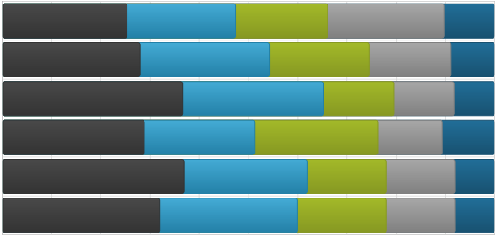
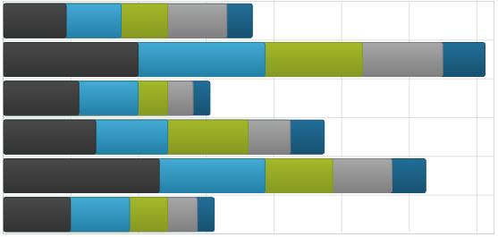

////
|metadata|
{
    "name": "datachart-stacked-series-overview",
    "controlName": ["{DataChartName}"],
    "tags": ["Charting"],
    "guid": "",
    "buildFlags": [],
    "createdOn": "2017-03-05T19:39:00.3992752Z"
}
|metadata|
////

= 積層型シリーズ

このトピックでは、link:{DataChartLink}.{DataChartName}.html[{DataChartName}]™ コントロールの積層シリーズのさまざまなタイプを説明します。

=== このトピックの構成

このトピックは、以下のセクションで構成されます。

* <<_Introduction,概要>>
* <<_Types,積層シリーズのタイプ>>
* <<_SupportedAxes,サポートされる軸>>
* <<_DataBinding,データ バインディング>>
** <<DataRequirements,データ要件>>
** <<DataSample,データの例>>
* <<_RelatedTopics,関連トピック>>

[[_Introduction]]
== 概要

積層シリーズは、データを取り入れてそれを水平線 (柱状シリーズなど) または垂直線 (棒シリーズなど) に沿って延ばしたデータ ポイントのコレクションとして描画するチャート シリーズの中でも、もっとも簡単で一般的な形のグループです。

[[_Types]]
== 積層シリーズのタイプ

{DataChartName} コントロールは、以下の積層シリーズのタイプをサポートします。それぞれについては個別のトピックで説明します:
 
* link:datachart-category-stacked-100-area-series.html[積層型 100 エリア シリーズ]
* link:datachart-category-stacked-100-bar-series.html[積層型 100 棒シリーズ]
* link:datachart-category-stacked-100-column-series.html[積層型 100 柱状シリーズ]
* link:datachart-category-stacked-100-line-series.html[積層型 100 折れ線シリーズ]
* link:datachart-category-stacked-100-spline-area-series.html[積層型 100 スプライン エリア シリーズ]
* link:datachart-category-stacked-100-spline-series.html[積層型 100 スプライン シリーズ]
* link:datachart-category-stacked-area-series.html[積層型エリア シリーズ]
* link:datachart-category-stacked-bar-series.html[積層型棒シリーズ]
* link:datachart-category-stacked-column-series.html[積層型柱状シリーズ]
* link:datachart-category-stacked-line-series.html[積層型折れ線シリーズ]
* link:datachart-category-stacked-spline-area-series.html[積層型スプライン エリア シリーズ]
* link:datachart-category-stacked-spline-series.html[積層型スプライン シリーズ]

このトピックは、特定のタイプの積層シリーズを作成してデータをこのシリーズにバインドする方法にについての有用な情報を提供します。
  

[[_Preview]]
== 積層シリーズのプレビュー

このセクションでは、すべてのタイプの積層シリーズのプレビュー画像を提供します。

[options="header", cols="a,a"]
|====
|シリーズ タイプ|説明

| link:datachart-category-stacked-100-area-series.html[積層型 100 エリア シリーズ]

image::images/Stacked_100-Area_Series_01.png[]
|積層型 100 エリア シリーズは、Y 軸上の値の処理を除くあらゆる面で StackedAreaSeries と同じです。データを直接的に表す代わりに、Stacked100AreaSeries は、データ ポイント内のすべての値の合計の割合でデータを表示します。

| link:datachart-category-stacked-100-bar-series.html[積層型 100 棒シリーズ]

|積層型棒シリーズと同様で、追加機能としてデータの直接的表現をする代わりにカテゴリのすべての値のパーセントに関するデータを表します。

| link:datachart-category-stacked-100-column-series.html[積層型 100 柱状シリーズ]

image::images/Using_xamDataChart_Category_Series_10.png[]
|積層型柱状シリーズと同様で、追加機能としてデータの直接的表現をする代わりにカテゴリのすべての値のパーセントに関するデータを表します。

| link:datachart-category-stacked-100-line-series.html[積層型 100 折れ線シリーズ]

image::images/Stacked_100-Line_Series__01.png[]
|積層型 100 折れ線シリーズは、Y 軸上の値の処理を除くすべての面で StackedLineSeries と同じです。データを直接的に表す代わりに、Stacked100LineSeries は、データ ポイント内のすべての値の合計の割合でデータを表示します。

| link:datachart-category-stacked-100-spline-area-series.html[積層型 100 スプライン エリア シリーズ]

image::images/Stacked_100-Spline_Area_Series__01.png[]
|積層型 100 スプライン エリア シリーズは、Y 軸上の値の処理を除くすべての面で StackedSplineAreaSeries と同じです。データを直接的に表す代わりに、Stacked100SplineAreaSeries は、データ ポイント内のすべての値の合計の割合でデータを表示します。

| link:datachart-category-stacked-100-spline-series.html[積層型 100 スプライン シリーズ]

image::images/Using_xamDataChart_Stacked_100-Spline_Series__01.png[]
|積層型 100 スプライン シリーズは、Y 軸上の値の処理を除くすべての面で StackedSplineSeries と同じです。データを直接的に表す代わりに、Stacked100SplineSeries は、データ ポイント内のすべての値の合計の割合でデータを表示します。

| link:datachart-category-stacked-area-series.html[積層型エリア シリーズ]

image::images/Stacked_Area_Series__01.png[]
|積層型エリア シリーズは、互いの上に積層され、線の下の領域が塗りつぶされた線分 (StackedFragmentSeries) によって接続されたポイントのコレクションを使用して描写されます。コレクションのそれぞれの積層フラグメントは各積層の視覚的な要素を表します。各積層は正の値と負の値の両方を含みます。正の値はいずれも y 軸の正の側にグループ化され、負の値は y 軸の負の側にグループ化されます。

| link:datachart-category-stacked-bar-series.html[積層型棒シリーズ]

|個々のデータを互いに積層された棒に表示します。カテゴリは垂直方向に配置され、値は水平方向に積層されます。

データ シリーズの経時的な変化を表示、または複数の項目を比較するために使用します。

| link:datachart-category-stacked-column-series.html[積層型柱状シリーズ]

image::images/Using_xamDataChart_Category_Series_09.png[]
|個々のデータをそれぞれ上に積層された列に表示します。カテゴリは水平方向、値は垂直方向に積層されます。

データ シリーズの経時的な変化を表示、または複数の項目を比較するために使用します。

| link:datachart-category-stacked-line-series.html[積層型折れ線シリーズ]

image::images/Using_xamDataChart_Stacked_Line_Series__01.png[]
|積層型折れ線シリーズは、それぞれの上に積層された線分によって結ばれたポイントのコレクション (StackedFragmentSeries) を用いて描画されます。コレクションのそれぞれの積層フラグメントは各積層の視覚的な要素を表します。各積層は正の値と負の値の両方を含みます。正の値はいずれも y 軸の正の側にグループ化され、負の値は y 軸の負の側にグループ化されます。

| link:datachart-category-stacked-spline-area-series.html[積層型スプライン エリア シリーズ]

image::images/Using_xamDataChart_Stacked_Spline_Area_Series__01.png[]
|積層型スプライン エリア シリーズは、スプライン セグメント (StackedFragmentSeries) の滑らかな曲線によって結ばれるポイントのコレクションを使用して描画され、スプラインの下の領域は塗りつぶされ、垂直方向に積み重ねられます。コレクションのそれぞれの積層フラグメントは各積層の視覚的な要素を表します。各積層は正の値と負の値の両方を含みます。正の値はいずれも y 軸の正の側にグループ化され、負の値は y 軸の負の側にグループ化されます。

| link:datachart-category-stacked-spline-series.html[積層型スプライン シリーズ]

image::images/Usin_xamDataChart_Stacked_Spline_Series__01.png[]
|積層型スプライン シリーズは、それぞれの上に積層されたスプライン セグメントのスムーズなカーブによって結ばれたポイントのコレクション (StackedFragmentSeries) を用いて描画されます。コレクションのそれぞれの積層フラグメントは各積層の視覚的な要素を表します。各積層は正の値と負の値の両方を含みます。正の値はいずれも y 軸の正の側にグループ化され、負の値は y 軸の負の側にグループ化されます。

|====
 
[[_SupportedAxes]] 
== サポートされる軸

{DataChartName} コントロールは、さまざまな軸タイプを提供しますが、積層シリーズの特定のタイプでは以下の軸タイプのみ使用できます。以下の表に、サポートされる軸を示します。

[options="header", cols="a,a,a"]
|====
|シリーズ タイプ| XAxis タイプ | YAxis タイプ

| `StackedBarSeries` 

`Stacked100BarSeries`
|link:{DataChartLink}.NumericXAxis.html[NumericXAxis]
|link:{DataChartLink}.CategoryYAxis.html[CategoryYAxis]
| 
`StackedColumnSeries` 

`Stacked100ColumnSeries`

`StackedAreaSeries` 

`Stacked100AreaSeries` 

`StackedLineSeries` 

`Stacked100LineSeries` 

`StackedSplineSeries` 

`Stacked100SplineSeries` 
 
`StackedSplineAreaSeries` 

`Stacked100SplineAreaSeries` 

|link:{DataChartLink}.CategoryXAxis.html[CategoryXAxis]

link:{DataChartLink}.CategoryDateTimeXAxis.html[CategoryDateTimeXAxis]

link:{DataChartLink}.TimeXAxis.html[TimeXAxis]
|link:{DataChartLink}.NumericYAxis.html[NumericYAxis]
 
|====

さらに、積層シリーズのそれぞれはシリーズ オブジェクトの link:{DataChartLink}.HorizontalAnchoredCategorySeries{ApiProp}XAxis.html[XAxis] プロパティと link:{DataChartLink}.HorizontalAnchoredCategorySeries{ApiProp}XAxis.html[YAxis] プロパティを用いた 1 つの ｘ 軸と 1 つの y 軸に設定されたバインドを持つ必要があります。F軸についての詳細は、link:datachart-axes.html[「軸」]トピックを参照してください。

[[_DataBinding]]
== データ バインディング

このセクションではデータ要件からデータ例、バインディング ダイアグラムまで、積層シリーズに対するデータ バインディング についての情報を提供します。

[[_DataRequirements]]
=== データ要件

{DataChartName} コントロールの他のシリーズ タイプと同様、積層型シリーズも link:{DataChartLink}.Series~{ApiDataSource}.html[{ApiDataSource}] プロパティを使用してデータをバインドします。シリーズは、link:http://msdn.microsoft.com/ja-jp/library/system.collections.ienumerable.aspx[IEnumerable] インターフェイス (link:http://msdn.microsoft.com/ja-jp/library/6sh2ey19.aspx[List]、 link:http://msdn.microsoft.com/ja-jp/library/ms132397.aspx[Collection]、 link:http://msdn.microsoft.com/ja-jp/library/7977ey2c.aspx[Queue]、 link:http://msdn.microsoft.com/ja-jp/library/system.collections.stack.aspx[Stack]) を実装するオブジェクトにバインドできます。ただし、積層型シリーズの場合、このオブジェクトの各項目は少なくとも 1 つの数値データ列と 1 つのデータ列が必要で、前者はシリーズの ValueMemberPath プロパティを使用してマップされ、後者はカテゴリ軸 (link:{DataChartLink}.CategoryXAxis.html[CategoryXAxis] など) の link:{DataChartLink}.Axis{ApiProp}Label.html[Label] プロパティまたは link:{DataChartLink}.TimeXAxis.html[TimeXAxis] の場合に link:{DataChartLink}.TimeAxisBase{ApiProp}DateTimeMemberPath.html[DateTimeMemberPath] にマップされます。特定のシリーズ タイプの要件については、link:datachart-series-requirements.html[シリーズ要件トピック]を参照してください。)

[[_DataSample]]
=== データの例

上記の基準を満たすオブジェクトにカテゴリ データ サンプルがあり、link:resources-sample-energy-data.html[サンプル エネルギー データ] リソースからダウンロードしてプロジェクトで使用できます。

[[_RelatedTopics]]
== 関連コンテンツ

* link:datachart-axes.html[軸]
* link:datachart-series-requirements.html[シリーズ要件]