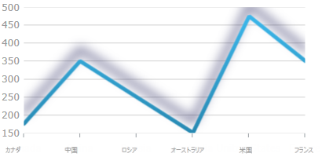

////

|metadata|
{
    "name": "datachart-styling-the-chart-series",
    "tags": ["Charting","Styling"],
    "controlName": ["{DataChartName}"],
    "guid": "6a2a782c-fdc8-430b-8b2b-b7e308aab690",  
    "buildFlags": ["SL","WPF"],
    "createdOn": "2014-06-05T19:39:00.6173668Z"
}
|metadata|
////

= チャート シリーズのスタイル設定 ({DataChartName})

== トピックの概要

=== 目的

このトピックは、 _{DataChartName}_™ コントロールのシリーズのスタイル設定方法の概要について紹介し、例として影付きの効果をシリーズに適用する方法を紹介します。

=== 前提条件

本トピックの理解を深めるために、以下のトピックを参照することをお勧めします。

[options="header", cols="a,a"]
|====
|トピック|目的

| link:datachart-getting-started-with-datachart.html[データ チャートを使用した作業の開始]
|このトピックでは、{DataChartName} コントロールのインスタンスを設定しデータ バインディングを作成する方法を紹介します。

| link:datachart-series.html[チャート シリーズ]
|このトピックは、チャート シリーズの概念を紹介し、シリーズのタイプ、シリーズ データの結合、およびシリーズの凡例についての手順を説明します。

|====

=== このトピックの内容

このトピックは、以下のセクションで構成されます。

* <<_Ref368413764,概要>>

** <<_Ref368413773,チャート シリーズのスタイル設定の概要>>
** <<_Ref368413786,チャート シリーズへの効果の適用>>

* <<_Ref368413794,影付きの効果を適用したチャート シリーズのスタイル設定>>

** <<_Ref367456519,概要>>
** <<_Ref367456522,プロパティ設定>>
** <<_Ref367456525,例>>

* <<_Ref367456536,関連コンテンツ>>

[[_Ref368413764]]
== 概要

[[_Ref368413773]]

=== チャート シリーズのスタイル設定の概要

シリーズ  _{DataChartName}_  は、複数の要素でスタイル設定できますが、異なるフィールとアウトライン ブラシをシリーズに適用することが重要な点です。これはシリーズの link:{DataChartLink}.series{ApiProp}brush.html[Brush] と link:{DataChartLink}.series{ApiProp}outline.html[Outline] プロパティで処理されます。シリーズのルック アンド フィールのその他の要素、たとえばアウトラインの太さやシリーズの不透明度なども、シリーズの link:{DataChartLink}.series{ApiProp}thickness.html[Thickness] および link:{DataChartLink}.series_members.html[Opacity] のプロパティで構成できます。

[[_Ref368413786]]

=== チャート シリーズへの効果の適用

_{DataChartName}_   の link:{DataChartLinkBase}.{DataChartBase}{ApiProp}series.html[{DataChartName}.Series] コレクションに使用される link:{DataChartLink}.series_members.html[Series] クラスも、`Control` クラスから継承されるため、`Effect` プロパティを適用します。このプロパティは、シリーズの表示に視覚効果を適用します。以下の表は、サポートされている視覚効果と視覚効果を構成する `Effect` プロパティ設定をマップします。

[options="header", cols="a,a,a"]
|====
|効果の名前|外観:|`Effect` プロパティの設定

|効果なし
|image::images/xamDataChart_Styling_the_Chart_Series_1.png[]
|設定なし

|ぼかし
|image::images/xamDataChart_Styling_the_Chart_Series_2.png[]
| _BlurEffect_ 

|ドロップ シャドウ
|image::images/xamDataChart_Styling_the_Chart_Series_3.png[]
| _DropShadowEffect_ 

|====

各効果は、効果のプロパティ設定を変更して構成できます。ぼかし効果は、ぼかしの半径およびぼかしの計算に使用する曲線で構成できます。影付きの効果は、影の色、その不透明度、方向、オフセット、およびぼかしを変更することによりカスタマイズできます。

[[_Ref368413794]]
== 影付きの効果を適用したチャート シリーズのスタイル設定

[[_Ref367456519]]

=== 概要

影付きの効果をシリーズに適用するには、以下の 2 つの方法があります。

* link:{DataChartLink}.series_members.html[Series] クラスの `Effect` プロパティを使用する
* シリーズの link:{DataChartLink}.series{ApiProp}isdropshadowenabled.html[IsDropShadowEnabled] プロパティを使用する

==== `Series` クラスの `Effect` プロパティで、影付きの効果を適用する場合

`Series` クラスの `Effect` プロパティを、`DropShadowEffect` インスタンスに設定します。影付きの効果がボックスの外側に適用されます。`DropShadowEffect` インスタンスを更にカスタマイズすることができます。

[[_Applying_drop-shadow_through]]
==== シリーズの `IsDropShadowEnabled` プロパティで、影付きを適用する場合

シリーズの `IsDropShadowEnabled` プロパティを、"true" に設定します。ぼかしの半径、色、方向、深さ、および不透明度の変更が、効果のカスタマイズとして link:{DataChartLink}.series_members.html[Series] の影に関連するプロパティでサポートされています (詳細は、<<_Ref367456522,プロパティの設定>> と例を参照してください)。

.注:
[NOTE]
====
`Effect` プロパティの設定は、`IsDropShadowEnabled` プロパティおよびシリーズの影に関連するプロパティより優先度が高く、これらプロパティによる描画は無効になります。
====

デフォルト設定の影付きの効果は、シリーズのタイプによって異なります。

[[_Ref367456522]]

=== プロパティ設定

以下の表は、各プロパティ設定による影付きの効果 (シリーズの`IsDropShadowEnabled` プロパティが適用された場合) で構成できる要素を示しています。この表に示す設定内容を使用する場合は、シリーズの `Effect` プロパティを設定しないでください。

[options="header", cols="a,a,a"]
|====
|構成の目的:|使用するプロパティ:|設定の選択肢:

|シリーズに対する影付きの効果
| link:{DataChartLink}.series{ApiProp}isdropshadowenabled.html[IsDropShadowEnabled]
| "true"

|影の色
| link:{DataChartLink}.series{ApiProp}shadowcolor.html[ShadowColor]
|任意の色

|シリーズ表示の影のオフセット
| link:{DataChartLink}.series{ApiProp}shadowdepth.html[ShadowDepth]
|オフセットを示すピクセルで指定した double 値

|影の方向
| link:{DataChartLink}.series{ApiProp}shadowdirection.html[ShadowDirection]
|任意の方向の角度は、シリーズの表示からの角度が0の場合、影はまっすぐ右に、90で上端に、180でまっすぐ左にキャストされます。

|影の不透明度
| link:{DataChartLink}.series{ApiProp}shadowopacity.html[ShadowOpacity]
|任意の double 値は 0～1 の範囲で、 _0_ は影が透明で、 _1_ は影が完全に不透明になります。

|影の端の定義レベル (シャープ / ぼかし)
| link:{DataChartLink}.series{ApiProp}shadowblur.html[ShadowBlur]
|ぼかしのレベルを表す、任意のピクセルの double 値。ぼかしのレベルは、等高線の広がりやフェード アウトの全体のピクセル数で定義されます。値が大きいと、影のぼかしが強くなります。

|====

[[_Example]]

=== 例

この例では、シリーズの link:{DataChartLink}.series{ApiProp}isdropshadowenabled.html[IsDropShadowEnabled] プロパティによる影付きの効果を示します。以下のスクリーンショットは、以下の影の設定の結果、 _{DataChartName}_   コントロールの外観がどのようになるか示しています。

[options="header", cols="a,a"]
|====
|プロパティ|値

| link:{DataChartLink}.series{ApiProp}isdropshadowenabled.html[IsDropShadowEnabled]
|"true"

| link:{DataChartLink}.series{ApiProp}shadowblur.html[ShadowBlur]
| _20_ 

| link:{DataChartLink}.series{ApiProp}shadowcolor.html[ShadowColor]
| _DarkBlue_ 

| link:{DataChartLink}.series{ApiProp}shadowdepth.html[ShadowDepth]
| _15_ 

| link:{DataChartLink}.series{ApiProp}shadowdirection.html[ShadowDirection]
| _90_ 

| link:{DataChartLink}.series{ApiProp}shadowopacity.html[ShadowOpacity]
| _0.8_ 

|====

以下は、折れ線チャート シリーズの影に関連するプロパティを設定する場合のコード スニペットです。

*XAML の場合:*

[source,xaml]
----
…
<ig:LineSeries IsDropShadowEnabled="True"
               ShadowBlur="20"
               ShadowColor="DarkBlue"
               ShadowDepth="15"
               ShadowDirection="90"
               ShadowOpacity="0.8"
               Thickness="5"
               …
>
…
----

*Visual Basic の場合:*

----
…
Dim lineSeries = New LineSeries()
lineSeries.IsDropShadowEnabled = True
lineSeries.ShadowBlur = 20
lineSeries.ShadowColor = new SolidColorBrush("DarkBlue")
lineSeries.ShadowDepth = 15
lineSeries.ShadowDirection = 90
lineSeries.ShadowOpacity = 0.8
lineSeries.Thickness = 5
…
----

*C# の場合:*

----
…
LineSeries lineSeries = New LineSeries();
lineSeries.IsDropShadowEnabled = True;
lineSeries.ShadowBlur = 20;
lineSeries.ShadowColor = new SolidColorBrush("DarkBlue");
lineSeries.ShadowDepth = 15;
lineSeries.ShadowDirection = 90;
lineSeries.ShadowOpacity = 0.8;
lineSeries.Thickness = 5;
…
----

[[_Ref367456536]]
== 関連コンテンツ

以下の資料 (Infragistics のコンテンツ ファミリー以外でもご利用いただけます) は、このトピックに関連する追加情報を提供します。

[options="header", cols="a,a"]
|====
|リソース|目的

|
ifdef::wpf[] 

link:http://msdn.microsoft.com/ja-jp/library/system.windows.media.effects.dropshadoweffect.aspx[DropShadowEffect クラス] 

endif::wpf[] 

ifdef::sl[] 

link:http://msdn.microsoft.com/ja-jp/library/system.windows.media.effects.dropshadoweffect(v=vs.95).aspx[DropShadowEffect クラス] 

endif::sl[]
|目標のテクスチャの周囲にドロップ シャドウを描画するビットマップの効果

|====