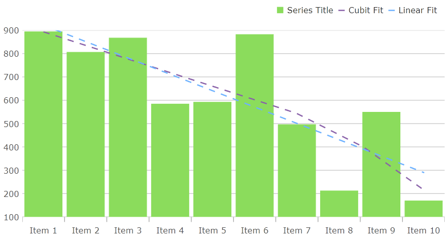

= トレンドライン レイヤー

{ProductName} では、link:{DataChartLink}.TrendlineLayer.html[TrendLineLayer] は、ターゲット シリーズに対して単一のトレンドライン タイプを表示するように設計された新しいシリーズ タイプです。これと既存のシリーズ タイプの既存のトレンド ライン機能との違いは、link:{DataChartLink}.TrendlineLayer.html[TrendLineLayer] はシリーズ タイプであるため、チャートの `Series` コレクションに複数のトレンド ラインを追加して、同じシリーズに複数のトレンド ラインを添付できることです。また、これまでできなかったトレンドラインを凡例に表示する ことも可能です。

次の画像は、単一の `ColumnSeries` をターゲットとする複数の link:{DataChartLink}.TrendlineLayer.html[TrendLineLayer] 要素の使用方法を示しています。

== トレンドライン レイヤーの使用

正しく動作させるには、link:{DataChartLink}.TrendlineLayer.html[TrendLineLayer] に link:{DataChartLink}.trendlinelayer{ApiProp}targetseries.html[TargetSeries] と link:{DataChartLink}.trendlinelayer{ApiProp}trendlinetype.html[TrendLineType] を指定する必要があります。使用できるさまざまなトレンドラインのタイプは、シリーズで使用できたトレンドラインと同じです。これについては、link:datachart-trend-lines.html[このトピック]で説明されています。

`Legend` に link:{DataChartLink}.TrendlineLayer.html[TrendLineLayer] を表示する場合は、link:{DataChartLink}.annotationlayer{ApiProp}uselegend.html[UseLegend] プロパティを `true` に設定します。

次のコード スニペットを使用すると、上記のスクリーンショットと同じチャートを再現できます。

ifdef::wpf[]

**XAML の場合:**

[source, xaml]
----
<Grid x:Name="layoutRoot">
    <ig:XamDataChart Legend="{Binding ElementName=legend}">
        <ig:XamDataChart.Axes>
            <ig:CategoryXAxis x:Name="xAxis" ItemsSource="{Binding Data}" Label="{}{Label}" />
            <ig:NumericYAxis x:Name="yAxis" MinimumValue="0" MaximumValue="1000"/>
        </ig:XamDataChart.Axes>
        <ig:XamDataChart.Series>
            <ig:ColumnSeries x:Name="series1" XAxis="{Binding ElementName=xAxis}"
                             YAxis="{Binding ElementName=yAxis}"
                             ItemsSource="{Binding Data}"
                             ValueMemberPath="Value" />
            <ig:TrendLineLayer TargetSeries="{Binding ElementName=series1}"
                   TrendLineType="CubicFit"
                   UseIndex="True"
                   UseLegend="True"
                   Title="Cubit Fit"/>
            <ig:TrendLineLayer TargetSeries="{Binding ElementName=series1}"
                   TrendLineType="LinearFit"
                   UseIndex="True"
                   UseLegend="True" 
                   Title="Linear Fit" />
        </ig:XamDataChart.Series>
    </ig:XamDataChart>

    <ig:Legend x:Name="legend" Orientation="Horizontal" />
</Grid>
----

**C# の場合:**

[source, csharp]
----
Legend legend = new Legend() { Orientation = Orientation.Horizontal };
{DataChartName} chart = new {DataChartName}() { Legend = legend };

CategoryXAxis xAxis = new CategoryXAxis()
{
    ItemsSource = data,
    Label = "{Label}"
};

NumericYAxis yAxis = new NumericYAxis()
{
    MinimumValue = 0,
    MaximumValue = 1000
};

ColumnSeries series1 = new ColumnSeries()
{
    XAxis = xAxis,
    YAxis = yAxis,
    ItemsSource = data,
    ValueMemberPath = "Value"
};

TrendLineLayer linearLayer = new TrendLineLayer()
{
    TargetSeries = series1,
    TrendLineType = TrendLineType.LinearFit,
    UseIndex = true,
    UseLegend = true,
    Title = "Linear Fit"
};

TrendLineLayer cubicLayer = new TrendLineLayer()
{
    TargetSeries = series1,
    TrendLineType = TrendLineType.CubicFit,
    UseIndex = true,
    UseLegend = true,
    Title = "Cubic Fit"
};

chart.Axes.Add(xAxis);
chart.Axes.Add(yAxis);

chart.Series.Add(series);
chart.Series.Add(linearLayer);
chart.Series.Add(cubicLayer);

layoutRoot.Children.Add(chart);
layoutRoot.Children.Add(legend);
----

endif::wpf[]

ifdef::win-forms[]

**C# の場合:**:

[source, csharp]
----
Legend legend = new Legend() { Orientation = Orientation.Horizontal };
{DataChartName} chart = new {DataChartName}() { Legend = legend };

CategoryXAxis xAxis = new CategoryXAxis()
{
    DataSource = data,
    Label = "Label"
};

NumericYAxis yAxis = new NumericYAxis()
{
    MinimumValue = 0,
    MaximumValue = 1000
};

ColumnSeries series1 = new ColumnSeries()
{
    XAxis = xAxis,
    YAxis = yAxis,
    DataSource = data,
    ValueMemberPath = "Value"
};

TrendLineLayer linearLayer = new TrendLineLayer()
{
    TargetSeries = series1,
    TrendLineType = TrendLineType.LinearFit,
    UseIndex = true,
    UseLegend = true,
    Title = "Linear Fit"
};

TrendLineLayer cubicLayer = new TrendLineLayer()
{
    TargetSeries = series1,
    TrendLineType = TrendLineType.CubicFit,
    UseIndex = true,
    UseLegend = true,
    Title = "Cubic Fit"
};

chart.Axes.Add(xAxis);
chart.Axes.Add(yAxis);

chart.Series.Add(series);
chart.Series.Add(linearLayer);
chart.Series.Add(cubicLayer);
----

endif::win-forms[]

== トレンドライン レイヤーのスタイル設定

デフォルトでは、link:{DataChartLink}.TrendlineLayer.html[TrendLineLayer] は、link:{DataChartLink}.trendlinelayer{ApiProp}targetseries.html[TargetSeries] と同じ色の破線で描画されます。これは、link:{DataChartLink}.TrendlineLayer.html[TrendLineLayer] のさまざまなスタイル設定プロパティを使用して構成できます。

描画されるトレンドラインの色を変更するには、`Brush` プロパティを設定します。あるいは、link:{DataChartLink}.annotationlayer{ApiProp}useindex.html[UseIndex] プロパティを `true` に設定することもできます。これにより、link:{DataChartLink}.TrendlineLayer.html[TrendLineLayer] がチャートの `Series` コレクションに配置されているインデックスに基づいて、チャートの `Brushes` パレットからブラシが取得されます。

link:{DataChartLink}.TrendlineLayer.html[TrendLineLayer] の表示方法は、link:{DataChartLink}.annotationlayer{ApiProp}appearancemode.html[AppearanceMode] プロパティと link:{DataChartLink}.annotationlayer{ApiProp}shiftamount.html[ShiftAmount] プロパティを使用して変更することもできます。link:{DataChartLink}.annotationlayer{ApiProp}shiftamount.html[ShiftAmount] は、-1.0 から 1.0 の範囲の `double` を受け取り、「Shift」 で終わる列挙体オプションに適用する 「シフト」 の量を決定します。

link:{DataChartLink}.annotationlayer{ApiProp}appearancemode.html[AppearanceMode] 列挙体のオプションは次のとおりです。

- `Auto`: デフォルトでは `DashPattern` 列挙体になります。
- `BrightnessShift`: トレンドラインは、link:{DataChartLink}.trendlinelayer{ApiProp}targetseries.html[TargetSeries] ブラシを取得し、提供された link:{DataChartLink}.annotationlayer{ApiProp}shiftamount.html[ShiftAmount] に基づいて明るさを変更します。
- `DashPattern`: トレンドラインは破線として表示されます。ダッシュの頻度は、`TrendLineLayer` の `DashArray` プロパティを使用して変更できます。
- `OpacityShift`: トレンドラインは、link:{DataChartLink}.trendlinelayer{ApiProp}targetseries.html[TargetSeries] ブラシを取得し、提供された link:{DataChartLink}.annotationlayer{ApiProp}shiftamount.html[ShiftAmount] に基づいて不透明度を変更します。
- `SaturationShift`: トレンドラインは、link:{DataChartLink}.trendlinelayer{ApiProp}targetseries.html[TargetSeries] ブラシを取得し、提供された link:{DataChartLink}.annotationlayer{ApiProp}shiftamount.html[ShiftAmount] に基づいて彩度を変更します。

== 関連コンテンツ

- link:datachart-trend-lines.html[シリーズ トレンドライン]