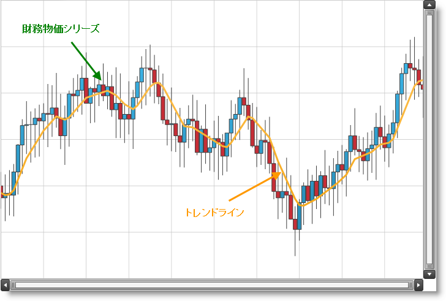
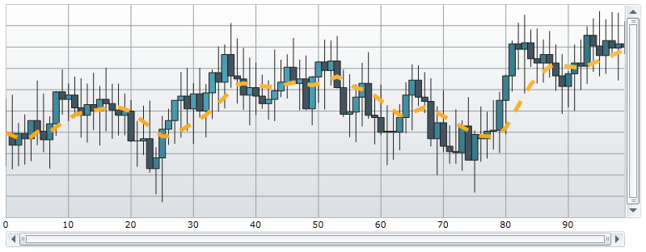

////

|metadata|
{
    "name": "datachart-trend-lines",
    "controlName": ["{DataChartName}"],
    "tags": ["Charting","Getting Started","How Do I"],
    "guid": "04277570-1fb3-4dc9-9058-beed22f9ac3c",  
    "buildFlags": [],
    "createdOn": "2014-06-05T19:39:00.6493768Z"
}
|metadata|
////

= シリーズ トレンドライン

このトピックは、コード例を示して、トレンドラインを link:{DataChartLink}.{DataChartName}.html[{DataChartName}] コントロールで使用する方法を説明します。

== 概要

トピックは以下のとおりです。

* <<Introduction,概要>>
* <<Preview,プレビュー>>
* <<SupportedSeries,サポートされるシリーズ>>
* <<TypesofTrendLines,トレンドラインのタイプ>>
* <<TrendLinesProperties,トレンドライン プロパティ>>
* <<Examples,コード例>>

** トレンドラインの表示
** トレンドライン スタイル

* <<RelatedContent,関連コンテンツ>>

** link:datachart-multiple-series.html[複数シリーズの追加]
** link:datachart-series-requirements.html[シリーズ要件]
** link:datachart-series-types.html[シリーズ タイプ]

[[Introduction]]
== 概要

{DataChartName} コントロールにおいて、トレンドラインはその link:{DataChartLink}.series~{ApiDataSource}.html[{ApiDataSource}] プロパティを通して Series にバインドするデータのトレンドを識別するのに役立つラインです。

[[Preview]]
== プレビュー

図 1 – Data Chart のトレンドラインの実装例

[[SupportedSeries]]
== サポートされるシリーズ

シリーズの大半のタイプはチャート コントロールのトレンドラインをプロットでき、それらのシリーズは次の表にリストされています。

表 1 – トレンドラインをサポートするシリーズ

[options="header", cols="a,a,a,a,a"]
|====
|カテゴリ シリーズ|財務シリーズ|散布図シリーズ|極座標シリーズ|ラジアル シリーズ

|AreaSeries 

BarSeries 

ColumnSeries 

LineSeries 

PointSeries 

SplineSeries 

SplineAreaSeries 

StepAreaSeries 

StepLineSeries 

WaterfallSeries
|AbsoluteVolumeOscillatorIndicator 

AccumulationDistributionIndicator 

AverageDirectionalIndexIndicator 

AverageTrueRangeIndicator 

BollingerBandWidthIndicator 

ChaikinOscillatorIndicator 

ChaikinVolatilityIndicator 

CommodityChannelIndexIndicator 

DetrendedPriceOscillatorIndicator 

EaseOfMovementIndicator 

FastStochasticOscillatorIndicator 

ForceIndexIndicator 

FinancialPriceSeries 

FullStochasticOscillatorIndicator 

MarkerFacilitationIndexIndicator 

MassIndexIndicator 

MedianPriceIndicator 

MoneyFlowIndexIndicator 

MovingAverageConvergenceDivergenceIndicator 

NegativeVolumeIndexIndicator 

OnBalanceVolumeIndicator 

PercentagePriceOscillatorIndicator 

PercentageVolumeOscillatorIndicator 

PositiveVolumeIndexIndicator 

PriceVolumeTrendIndicator 

RateOfChangeAndMomentumIndicator 

RelativeStrengthIndexIndicator 

SlowStochasticOscillatorIndicator 

StandardDeviationIndicator 

StochRSIIndicator 

TRIXIndicator 

TypicalPriceIndicator 

UltimateOscillatorIndicator 

WeightedCloseIndicator 

WilliamsPercentRIndicator
|BubbleSeries 

ScatterSeries 

ScatterLineSeries 

ScatterSplineSeries
|PolarAreaSeries 

PolarLineSeries 

PolarScatterSeries 

PolarSplineSeries 

PolarSplineAreaSeries
|RadialAreaSeries 

RadialLineSeries 

RadialColumnSeries 

RadialPieSeries

|====

.注:
[NOTE]
====
カテゴリ シリーズ グループの積層型および範囲シリーズはサポートされないため、いずれも上の表には含まれません。
====

[[TypesofTrendLines]]
== トレンドラインのタイプ

Data Chart は Series オブジェクトの TrendLineType プロパティを通して次のタイプのトレンドラインをサポートします。

表 2 – トレンドラインのシリーズ

[options="header", cols="a,a"]
|====
|トレンドラインのタイプ|説明

|None
|シリーズにトレンドラインを指定しない。

|CubicFit
|シリーズに三次多項式フィット トレンドラインを指定する。

|CumulativeAverage
|シリーズに累積移動平均トレンドラインを指定する。

|ExponentialAverage
|シリーズに指数移動平均トレンドラインを指定する。

|ExponentialFit
|シリーズに指数フィット トレンドラインを指定する。

|LinearFit
|シリーズにリニア フィット トレンドラインを指定する。

|LogarithmicFit
|シリーズに対数 フィット トレンドラインを指定する。

|ModifiedAverage
|シリーズに変更された移動平均トレンドラインを指定する。

|PowerLawFit
|シリーズにべき乗フィット トレンドラインを指定する。

|QuadraticFit
|シリーズに二次多項式フィット トレンドラインを指定する。

|QuarticFit
|シリーズに四次多項式フィット トレンドラインを指定する。

|QuinticFit
|シリーズに五次多項式フィット トレンドラインを指定する。

|SimpleAverage
|シリーズに単純移動平均トレンドラインを指定する。

|WeightedAverage
|シリーズに重み付けされた移動平均トレンドラインを指定する。

|====

[[TrendLinesProperties]]
== トレンドライン プロパティ

トレンドラインの全プロパティは "TrendLine" 文字列で始まり、各 Series オブジェクトによって提供されます。

表 3 – トレンドライン プロパティ

[options="header", cols="a,a,a"]
|====
|プロパティ名|プロパティ タイプ|説明

| link:{DataChartLink}.anchoredcategoryseries{ApiProp}trendlinebrush.html[TrendLineBrush]
|Brush
|トレンドラインを描画するために使用するブラシを取得または設定します。

|link:{DataChartLink}.anchoredcategoryseries{ApiProp}trendlinetype.html[TrendLineType]
|TrendLineType
|現在のシリーズに沿ってどのタイプのトレンドラインを表示するかを指定する TrendLineType 列挙値を取得または設定します。

| link:{DataChartLink}.anchoredcategoryseries{ApiProp}trendlineperiod.html[TrendLinePeriod]
|int
|現在のシリーズ オブジェクトの移動平均期間を取得または設定します。このプロパティは次のタイプのトレンドラインによってのみ使用されます。 

ExponentialAverage 

ModifiedAverage 

SimpleAverage 

WeightedAverage

| link:{DataChartLink}.anchoredcategoryseries{ApiProp}trendlinethickness.html[TrendLineThickness]
|double
|現在のシリーズ オブジェクトのトレンドラインの太さを取得または設定します。

ifdef::wpf,win-universal,android[]
| link:{DataChartLink}.anchoredcategoryseries{ApiProp}trendlinezindex.html[TrendLineZIndex]
|int
|トレンドラインの Z-Index を取得または設定します。1000 よりも大きい値ではトレンドラインがシリーズ データの前に描画され、それより小さい値ではトレンドラインがシリーズ データの後に描画されることになります。
endif::wpf,win-universal,android[]

ifdef::wpf,win-universal,android[]
| link:{DataChartLink}.anchoredcategoryseries{ApiProp}trendlinedasharray.html[TrendLineDashArray]
|DoubleCollection
|現在のシリーズ オブジェクトのトレンドラインを描画するために使用される点線や間隔のパターンを示す Double 値のコレクションを取得または設定します。
endif::wpf,win-universal,android[]

ifdef::wpf,win-universal,android[]
| link:{DataChartLink}.anchoredcategoryseries{ApiProp}trendlinedashcap.html[TrendLineDashCap]
|PenLineCap
|現在のシリーズ オブジェクトのトレンドラインの点線の最後をどのように描写するかを指定する PenLineCap 列挙値を取得または設定します。
endif::wpf,win-universal,android[]

|====

[[Examples]]
== コード例

このセクションでは財務物価シリーズとのみ使用されるトレンドラインを使用するコード例を提供します。しかし、FinancialPriceSeries オブジェクトを他のシリーズのタイプに換えることでトレンドラインをサポートする他のシリーズにも同じロジックが適用できます。

.注:
[NOTE]
====
これらのコード例は財務物価シリーズの使用とそれへのバインディングについてよく理解していることを前提としています。このタイプのシリーズとデータバインディングに対するデータ要件についての詳細は link:datachart-series-financial-price-series-overview.html[財務シリーズ]のトピックを参照してください。
====

== トレンドラインの表示

このコードは財務物価シリーズの重み付けされた移動平均トレンドラインをその TrendLineType プロパティを使用して表示する方法を説明します。このプロパティに異なる TrendLineType 列挙値を割り当てると、シリーズに表示されるトレンドラインが変化します。

ifdef::wpf,win-universal[]

*XAML の場合:*

[source,xaml]
----
<ig:{DataChartName} x:Name="DataChart">
    <ig:{DataChartName}.Series>
        <ig:FinancialPriceSeries 
            TrendLineType="WeightedAverage"
            TrendLinePeriod="10" >
        </ig:FinancialPriceSeries>
    </ig:{DataChartName}.Series>
</ig:{DataChartName}>
----

endif::wpf,win-universal[]

ifdef::wpf[]

*Visual Basic の場合:*

[source,vb]
----
' トレンドラインをもつ財務物価シリーズを作成
Dim series As New FinancialPriceSeries()
' ...
series.TrendLineType = TrendLineType.WeightedAverage
series.TrendLinePeriod = 10
' シリーズをチャートに追加DataChart.Series.Add(series)
----

endif::wpf[]

ifdef::win-forms[]

*Visual Basic の場合:*

[source,vb]
----
' トレンドラインをもつ財務物価シリーズを作成
Dim series As New FinancialPriceSeries()
' ...
series.TrendLineType = TrendLineType.WeightedAverage
series.TrendLinePeriod = 10
' シリーズをチャートに追加DataChart.Series.Add(series)
----

endif::win-forms[]

ifdef::wpf[]

*C# の場合:*

[source,csharp]
----
// トレンドラインをもつ財務物価シリーズを作成
var series = new FinancialPriceSeries();
// ...
series.TrendLineType = TrendLineType.WeightedAverage;
series.TrendLinePeriod = 10;
// シリーズをチャートに追加
DataChart.Series.Add(series);
----

endif::wpf[]

ifdef::win-forms[]

*C# の場合:*

[source,csharp]
----
// トレンドラインをもつ財務物価シリーズを作成
var series = new FinancialPriceSeries();
// ...
series.TrendLineType = TrendLineType.WeightedAverage;
series.TrendLinePeriod = 10;
// シリーズをチャートに追加
DataChart.Series.Add(series);
----

endif::win-forms[]

ifdef::xamarin[]

*C# の場合:*

[source,csharp]
----
// トレンドラインをもつ財務物価シリーズを作成
var series = new FinancialPriceSeries();
// ...
series.TrendLineType = TrendLineType.WeightedAverage;
series.TrendLinePeriod = 10;
// シリーズをチャートに追加
DataChart.Series.Add(series);
----

endif::xamarin[]

図 2 – Chart コントロールの移動平均近似曲線のある財務物価シリーズ。

== トレンドライン スタイル

このコードはトレンドラインのスタイルの設定方法を説明します。

ifdef::wpf,win-universal[]

*XAML の場合:*

[source,xaml]
----
<ig:{DataChartName} x:Name="DataChart">
    <ig:{DataChartName}.Series>
        <ig:FinancialPriceSeries 
            TrendLineBrush="Orange" 
            TrendLineDashArray="3 3"
            TrendLineDashCap="Flat"
            TrendLineThickness="5" >
        </ig:FinancialPriceSeries>
    </ig:{DataChartName}.Series>
</ig:{DataChartName}>
----

endif::wpf,win-universal[]

ifdef::wpf[]

*Visual Basic の場合:*

[source,vb]
----
' 財務物価シリーズを作成し、そのトレンドラインをスタイル
Dim series As New FinancialPriceSeries()
' ...
series.TrendLineBrush = New SolidColorBrush(Colors.Orange)
series.TrendLineDashArray = New DoubleCollection() From { 3.0, 3.0 }
series.TrendLineDashCap = PenLineCap.Flat
series.TrendLineThickness = 5.0
' シリーズをチャートに追加
DataChart.Series.Add(series)
----

endif::wpf[]

ifdef::win-forms[]

*Visual Basic の場合:*

[source,vb]
----
' 財務物価シリーズを作成し、そのトレンドラインをスタイル
Dim series As New FinancialPriceSeries()
' ...
series.TrendLineBrush = New SolidColorBrush(Colors.Orange)
series.TrendLineDashArray = New DoubleCollection() From { 3.0, 3.0 }
series.TrendLineDashCap = PenLineCap.Flat
series.TrendLineThickness = 5.0
' シリーズをチャートに追加
DataChart.Series.Add(series)
----

endif::win-forms[]

ifdef::wpf[]

*C# の場合:*

[source,csharp]
----
// 財務物価シリーズを作成し、そのトレンドラインをスタイル
var series = new FinancialPriceSeries();
// ...
series.TrendLineBrush = new SolidColorBrush(Colors.Orange);
series.TrendLineDashArray = new DoubleCollection { 3.0, 3.0 };
series.TrendLineDashCap = PenLineCap.Flat;
series.TrendLineThickness = 5.0;
// シリーズをチャートに追加
DataChart.Series.Add(series);
----

endif::wpf[]

ifdef::win-forms[]

*C# の場合:*

[source,csharp]
----
// 財務物価シリーズを作成し、そのトレンドラインをスタイル
var series = new FinancialPriceSeries();
// ...
series.TrendLineBrush = new SolidColorBrush(Colors.Orange);
series.TrendLineDashArray = new DoubleCollection { 3.0, 3.0 };
series.TrendLineDashCap = PenLineCap.Flat;
series.TrendLineThickness = 5.0;
// シリーズをチャートに追加
DataChart.Series.Add(series);
----

endif::win-forms[]

ifdef::xamarin[]

*C# の場合:*

[source,csharp]
----
// 財務物価シリーズを作成し、そのトレンドラインをスタイル
var series = new FinancialPriceSeries();
// ...
series.TrendLineBrush = new SolidColorBrush(Colors.Orange);
series.TrendLineThickness = 5.0;
// シリーズをチャートに追加
DataChart.Series.Add(series);
----

endif::xamarin[]

図 3 – Data Chart のスタイル設定されたトレンドラインをもつ財務物価シリーズ

[[RelatedContent]]
== 関連コンテンツ

* link:datachart-multiple-series.html[複数シリーズの追加]
* link:datachart-series-requirements.html[シリーズ要件]
* link:datachart-series-types.html[シリーズ タイプ]