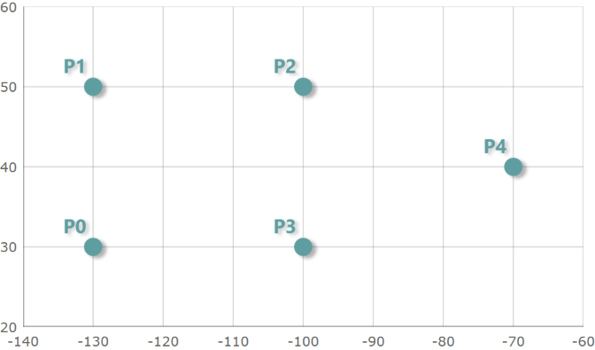
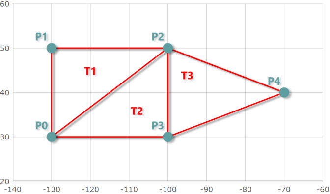

////
|metadata|
{
    "controlName": ["{GeoMapName}"],
    "tags": []
}
|metadata|
////

= データを三角測量

=== 目的

このトピックでは、データ ポイントの三角測量がどのように機能するか、またlink:datachart-scatter-area-series.html[散布エリア シリーズ]またはlink:datachart-scatter-contour-series.html[散布等高線シリーズ]を使用する場合に link:{DataChartLink}.{DataChartName}_members.html[{DataChartName}]™ コントロールでデータ描画のパフォーマンスをいかに改善できるのかを説明します。

=== このトピックの内容

このトピックには、以下のセクションがあります。

* <<_Ref335170748, 三角測量の理解 >>
** <<_Ref320185129,概要>>
** <<_Ref335170769,三角測量のソース>>
** <<_Ref335170772,三角測量ファイル>>
** <<_Ref335170776,三角測量メソッド>>
** <<_Ref335170779,事前三角測量プロセス>>

* <<_Ref335170156, シェープ ファイルから三角測量を作成 >>
** <<_Ref335170799,概要>>
** <<_Ref335170804,例>>

* <<_Ref335170185, 三角測量を ITF ファイルに保存 >>
** <<_Ref335170830,概要>>
** <<_Ref335170832,例>>

* <<_Ref335170196, 三角測量を ITF ファイルから読み込む >>
** <<_Ref335170868,概要>>
** <<_Ref335170871,例>>

* <<_Ref320185294, 関連コンテンツ >>

[[_Ref335170748]]
== 三角測量の理解

[[_Ref320185129]]

=== 概要

三角測量は X と Y の位置に基づいて同じ値によりデータ ポイントを三角測量するプロセスです。データを三角測量する、次の単純なシナリオを検討します。

以下は、link:{DataChartLink}.ScatterAreaSeries_members.html[ScatterAreaSeries] を使用してプロットされた (-130, 30)、(-130, 50)、(-100, 50)、(-100, 30)、(-70, 40) の位置のスクリーンショットです。

上記の 5 つのポイントでは、3 つの三角形があり、それらの三角形の頂点のインデックスは (0, 1, 2)、(0, 2, 3)、(2, 3, 4) です。

次の画像はこれらの三角形と頂点のインデックスを示します。

[[_Ref335170769]]

=== 三角測量のソース

{DataChartName} コントロールで、link:{DataVizChartsLink}.triangulationsource_members.html[TriangulationSource] クラスは三角測量を作成、読み込み、保存するためのデータ ソースを表します。link:{DataVizChartsLink}.triangulationsource_members.html[TriangulationSource] の完全なデータ構造は次の表にリストされる 2 つのプロパティで構成されます。

[options="header", cols="a,a,a"]
|====
|プロパティ名|プロパティ タイプ|説明

|link:{DataVizChartsLink}.triangulationsource~points.html[Points]
|ObservableCollection<link:{DataVizChartsLink}.triangulationsourcepointrecord_members.html[TriangulationSourcePointRecord]>
|三角測量が作成される数値と組み合わされたポイントを保管する link:{DataVizChartsLink}.triangulationsourcepointrecord_members.html[TriangulationSourcePointRecord] オブジェクトのコレクションを取得または設定します。

|link:{DataVizChartsLink}.triangulationsource~triangles.html[Triangles]
|ObservableCollection<Triangle>
|link:{DataVizChartsLink}.triangulationsource~points.html[Points] コレクションのポイントにそれぞれが対応する 3 つのインデックスを保管するTriangle オブジェクトのコレクションを取得または設定します。

|====

link:{DataVizChartsLink}.triangulationsourcepointrecord_members.html[TriangulationSourcePointRecord] クラスは三角測量の三角形のポイントの 1 つを表します。以下の表に、link:{DataVizChartsLink}.triangulationsourcepointrecord_members.html[TriangulationSourcePointRecord] クラスの重要なプロパティをリストします。

[options="header", cols="a,a,a"]
|====
|プロパティ名|プロパティ タイプ|説明

|link:{DataVizChartsLink}.triangulationsourcepointrecord~point.html[Point]
|Point
|三角形のポイントの 1 つの 2 次元 (2-D) の位置を表すポイントを取得または設定します。

|Value
|float
|三角形のポイントの 1 つと関連付けられた値を取得または設定します。

|====

Triangle クラスは 3 つの整数値または三角形の頂点のインデックスでレコードを表します。各整数は link:{DataVizChartsLink}.triangulationsource~points.html[Points] コレクションのポイントに対応するインデックスです。以下の表に、Triangle クラスの重要なプロパティをリストします。

[options="header", cols="a,a,a"]
|====
|プロパティ名|プロパティ タイプ|説明

| V1
|integer
|三角形の最初の頂点のインデックスを取得または設定します。

| V2
|integer
|三角形の ２ 番目の頂点のインデックスを取得または設定します。

| V3
|integer
|三角形の 3 番目の頂点のインデックスを取得または設定します。

|====

[[_Ref335170772]]

=== 三角測量ファイル

三角測量データは Intermediate Triangular Irregular Network Format (または略して ITF) を使用する三角測量ファイルに保管することも可能です。このファイル形式と仕様の詳細については、この link:http://vterrain.org/Implementation/Formats/ITF.html[Web サイト]をご覧下さい。

[[_Ref335170776]]

=== 三角測量メソッド

link:{DataVizChartsLink}.triangulationsource_members.html[TriangulationSource] クラスは三角測量を作成し、三角測量データを ITF ファイルに保存および ITF から読み込むためのメソッドを提供します。

以下の表に、三角測量データで作業をするための link:{DataVizChartsLink}.triangulationsource_members.html[TriangulationSource] クラスにおける重要なメソッドをリストします。

[options="header", cols="a,a"]
|====
|メソッド名|説明

|link:{DataVizChartsLink}.triangulationsource~create.html[Create]
|データの三角測量を作成するためのメソッド。

|link:{DataVizChartsLink}.triangulationsource~saveitf.html[SaveItf]
|データの三角測量をバイナリ ITF ファイルに保存するためのメソッド。

|link:{DataVizChartsLink}.triangulationsource~loaditf.html[LoadItf]
|データの三角測量をバイナリ ITF ファイルから読み込むためのメソッド。

|====

.注:
[NOTE]
====
このトピックの最後にコード例とともにこれらのメソッドそれぞれの詳細な説明を提供します。
====

[[_Ref335170779]]

=== 事前三角測量プロセス

{DataChartName} コントロールで、以下のシリーズ タイプが事前に三角測量したデータを使用するか、三角測量ソースが指定されていない場合にランタイムにデータの三角測量を実行できます。

[options="header", cols="a,a"]
|====
|シリーズのタイプ|説明

| link:{DataChartLink}.ScatterAreaSeries_members.html[ScatterAreaSeries]
|このシリーズは、各ポイントに割り当てられた数値を使用して、ポイント データ (X と Y 位置) の三角測量に基づいて、色付きのサーフェスを描画します。このシリーズの詳細については、link:datachart-scatter-area-series.html[「散布エリア シリーズ」]トピックを参照してください。

| link:{DataChartLink}.ScatterContourSeries_members.html[ScatterContourSeries]
|このシリーズは、各ポイントに割り当てられた数値を使用して、ポイント データ (X と Y 位置) の三角測量に基づいて、色付きの等高線を描画します。
このシリーズの詳細については、link:datachart-scatter-contour-series.html[「散布等高線シリーズ」]トピックを参照してください。

|====

これらのタイプのシリーズは、三角測量が link:{DataChartLink}.ScatterTriangulationSeries~TrianglesSource.html[TrianglesSource] プロパティに設定されていない場合、 {ApiDataSource} の項目で自動的に実行される定義済みのデータ三角測量を提供します。ただし、三角測量の計算は非常に時間のかかるプロセスであるため、このプロパティのために link:{DataVizChartsLink}.triangulationsource_members.html[TriangulationSource] を指定すると、ランタイム パフォーマンスがよくなります。特にデータ項目が多数ある場合には顕著です。したがって、データを事前に三角測量し三角測量を提供することによってランタイムにはこの計算を回避すべきです。

以下の表は、事前の三角測量の主な手順をリストします。

[options="header", cols="a,a"]
|====
|三角測量プロセス|説明

| <<_Ref335170156, シェープ ファイルから三角測量を作成 >>
| link:{DataVizMapsLink}.shapefileconverter_members.html[ShapefileConverter] クラスを使用してシェープ ファイルから link:{DataVizChartsLink}.triangulationsource_members.html[TriangulationSource] オブジェクトとして三角測量データを作成します。

| <<_Ref335170185, 三角測量を ITF ファイルに保存 >>
| アプリケーションで配備可能な ITF ファイルに三角測量データを保存します。

| <<_Ref335170196, 三角測量を ITF ファイルから読み込む >>
| 三角測量データを ITF から読み込んで link:{DataVizChartsLink}.triangulationsource_members.html[TriangulationSource] オブジェクトとして保管します。

|====

link:{DataVizChartsLink}.triangulationsource_members.html[TriangulationSource] を作成して事前三角測量を完了した後、link:{DataChartLink}.ScatterTriangulationSeries~TrianglesSource.html[TrianglesSource] プロパティを使用して link:{DataChartLink}.ScatterAreaSeries_members.html[ScatterAreaSeries] または link:{DataChartLink}.ScatterContourSeries_members.html[ScatterContourSeries] にバインドできます。以下のようになります。 

ifdef::xaml[]
*XAML の場合:*
[source,xaml]
----
<ig:ScatterAreaSeries ItemsSource="{Binding Path=Source.Points}"
                      TrianglesSource="{Binding Path=Source.Triangles}"
                      .../>
----
endif::xaml[]

*C# の場合:*
[source,csharp]
----
public TriangulationSource Source { get; set; }

// After TriangulationSource is created pass it to the series.
var scatterAreaSeries = new ScatterAreaSeries();
scatterAreaSeries.ItemsSource = Source.Points;
scatterAreaSeries.TrianglesSource = Source.Triangles;
----

*Visual Basic の場合:*
[source,vb]
----
Private Dim _source As TriangulationSource
Public Property TriangulationSource Source
    Get
        Return _source
    End Get
    Set
        _source = value
    End Set
End Property

' After TriangulationSource is created pass it to the series.
Dim scatterAreaSeries As New ScatterAreaSeries()
scatterAreaSeries.ItemsSource = Source.Points
scatterAreaSeries.TrianglesSource = Source.Triangles
----

[[_Ref335170156]]
== シェープ ファイルから三角測量を作成

[[_Ref335170799]]

=== 概要

link:{DataVizChartsLink}.triangulationsource_members.html[TriangulationSource] クラスはデータの三角測量を作成するための link:{DataVizChartsLink}.triangulationsource~create.html[Create] メソッドを提供します。
この静的メソッドは、link:{DataVizChartsLink}.triangulationsource~points.html[Points] と Triangles を取得して三角測量を作成するためにデリゲートを使用して TriangulationSource を作成します。

[[_Ref335170804]]

=== 例

以下のコードは、link:{DataVizMapsLink}.shapefileconverter_members.html[ShapefileConverter] クラスの link:{DataVizMapsLink}.shapefileconverter~importcompleted_ev.html[ImportCompleted] イベントのためのハンドラーを実装して、Points および link:{DataVizMapsLink}.shapefilerecord~fields.html[Fields] コレクションを取得するためのデリゲートを link:{DataVizChartsLink}.triangulationsource_members.html[TriangulationSource] クラスの link:{DataVizChartsLink}.triangulationsource~create.html[Create] メソッドに渡すことによって、シェープ ファイルから三角測量を作成する方法を示します。

.注:
[NOTE]
====
このコード例は、link:http://water.weather.gov/precip/download.php[NOAA Web サイト]からの降水量データを含むシェープ ファイルを使用しており、シェープ ファイルをプロジェクトに追加し link:{DataVizMapsLink}.shapefileconverter_members.html[ShapefileConverter] と使用する方法をすでに知っていることを前提としています。また、データベース (DBF) ファイルの “Globvalue” データ列のデータ ポイントに関連付けられた値を保存しますが、値を含むデータ列の名前はシェープ ファイルで異なります。この場合、link:{DataVizMapsLink}.shapefileconverter_members.html[ShapefileConverter] の link:{DataVizMapsLink}.shapefilerecord~fields.html[Fields] コレクションに渡されたキーを更新する必要があります。
====

*C# の場合:*

[source,csharp]
----
ifdef::wpf[]
using Infragistics.Controls.Charts;
using Infragistics.Controls.Maps;
endif::wpf[]
ifdef::win-forms[]
using Infragistics.Win.DataVisualization;
endif::win-forms[]
using System.ComponentModel;

var converter = new ShapefileConverter();
converter.ImportCompleted += OnShapeFileConverterImportCompleted;
converter.ShapefileSource= new Uri("nws_precip_1day_observed_20110419.shp", System.UriKind.Relative);
converter.DatabaseSource = new Uri("nws_precip_1day_observed_20110419.dbf", System.UriKind.Relative);

void OnShapeFileConverterImportCompleted(object sender, AsyncCompletedEventArgs e)
{
    TriangulationSource triangulationSource = TriangulationSource.Create(converter.Count, 
        (i) => converter[i].Points[0][0], 
        (i) => Convert.ToSingle(converter[i].Fields["Globvalue"]));
}
----

*Visual Basic の場合:*

[source,vb]
----
ifdef::wpf[]
Imports Infragistics.Controls.Charts
Imports Infragistics.Controls.Maps
endif::wpf[]
ifdef::win-forms[]
Imports Infragistics.Win.DataVisualization
endif::win-forms[]
Imports System.ComponentModel

Private WithEvents converter As New ShapefileConverter()

converter.ShapefileSource = New Uri("nws_precip_1day_observed_20110419.shp", System.UriKind.RelativeOrAbsolute)
converter.DatabaseSource = New Uri("nws_precip_1day_observed_20110419.dbf", System.UriKind.RelativeOrAbsolute)

Private Sub OnShapeFileConverterImportCompleted(sender As Object, e As AsyncCompletedEventArgs) Handles converter.ImportCompleted
      Dim triangulationSource As TriangulationSource = TriangulationSource.Create(converter.Count, 
                    Function(i) converter(i).Points(0)(0), 
                    Function(i) Convert.ToSingle(converter(i).Fields("Globvalue")))
End Sub
----

[[_Ref335170185]]
== 三角測量を ITF ファイルに保存

[[_Ref335170830]]

=== 概要

link:{DataVizChartsLink}.triangulationsource_members.html[TriangulationSource] クラスはデータの三角測量を保存するための link:{DataVizChartsLink}.triangulationsource~saveitf.html[SaveItf] メソッドを提供します。この静的メソッドは三角測量をアプリケーションと配備できるバイナリ ITF ファイルに保存して三角測量データを読み込むために後で使用します。

[[_Ref335170832]]

=== 例

以下のコードは、link:http://msdn.microsoft.com/en-us/library/system.io.isolatedstorage.isolatedstoragefilestream.aspx[IsolatedStorageFileStream] を link:{DataVizChartsLink}.triangulationsource_members.html[TriangulationSource] クラスの link:{DataVizChartsLink}.triangulationsource~saveitf.html[SaveItf] メソッドに提供することによって ITF ファイルに三角測量データを保存する方法を示します。

.注:
[NOTE]
====
このコード例は、分離したストレージに ITF ファイルのサイズに適切なスペースを割り当てるための承認済みリクエストを前提としています。
====

*C# の場合:*

[source,csharp]
----
using (IsolatedStorageFile iso = IsolatedStorageProvider.GetIsolatedStorageFile())
{
    string filePath = "TriangulatedFile.itf";
    using (var stream = new IsolatedStorageFileStream(filePath, FileMode.Create, iso))
    {
        triangulationSource.SaveItf(stream);
        stream.Close();
    }
}
----

*Visual Basic の場合:*

[source,vb]
----
Using iso As IsolatedStorageFile = IsolatedStorageProvider.GetIsolatedStorageFile()
      Dim filePath As String = "TriangulatedFile.itf"
      Using stream = New IsolatedStorageFileStream(filePath, FileMode.Create, iso)
            triangulationSource.SaveItf(stream)
            stream.Close()
      End Using
End Using
----

[[_Ref335170196]]
== 三角測量を ITF ファイルから読み込む

[[_Ref335170868]]

=== 概要

三角測量メソッドの保存と同様に、link:{DataVizChartsLink}.triangulationsource_members.html[TriangulationSource] クラスはデータの三角測量を読み込むための link:{DataVizChartsLink}.triangulationsource~loaditf.html[LoadItf] メソッドも提供します。この静的メソッドはバイナリ ITF ファイルから三角測量データを読み込みます。

[[_Ref335170871]]

=== 例

以下のコードは、ITF の link:http://msdn.microsoft.com/en-us/library/system.io.isolatedstorage.isolatedstoragefilestream.aspx[IsolatedStorageFileStream] を提供して link:{DataVizChartsLink}.triangulationsource_members.html[TriangulationSource] クラスの link:{DataVizChartsLink}.triangulationsource~loaditf.html[LoadItf] メソッドにそれを渡すことによって、ITF ファイルから三角測量を読み込む方法を示します。

.注:
[NOTE]
====
このコード例は、ITF ファイルがすでに存在し分離したストレージでアクセス可能であることを前提としています。
====

*C# の場合:*

[source,csharp]
----
TriangulationSource triangulationSource;
using (IsolatedStorageFile iso = IsolatedStorageFile.GetUserStoreForAssembly();
{
    string filePath = "TriangulatedFile.itf";
    if (iso.FileExists(filePath))
    {
        using (var stream = new IsolatedStorageFileStream(filePath, FileMode.Open, iso))
        {
            triangulationSource = TriangulationSource.LoadItf(stream);
            stream.Close();
        }
    }    
}
----

*Visual Basic の場合:*

[source,vb]
----
Dim triangulationSource As TriangulationSource
Using iso As IsolatedStorageFile = IsolatedStorageFile.GetUserStoreForAssembly()
      Dim filePath As String = "TriangulatedFile.itf"  
      If iso.FileExists(filePath) Then
            Using stream = New IsolatedStorageFileStream(filePath, FileMode.Open, iso)
                  triangulationSource = TriangulationSource.LoadItf(stream)
                  stream.Close()
            End Using
      End If
End Using
----

link:{DataVizMapsLink}.itfconverter_members.html[ItfConverter] メソッドの使用は、以下のコードに示すように、ITF ファイルから三角測量データを読み込むための代替え策です。

ifdef::wpf[]
*XAML の場合:*

[source,xaml]
----
<ig:ItfConverter x:Key="itfConverter"
                 Source="TriangulatedFile.itf" >
</ig:ItfConverter>
----
endif::wpf[]

*C# の場合:*

[source,csharp]
----
var itfConverter = new ItfConverter();
itfConverter.Source = new Uri("TriangulatedFile.itf", UriKind.RelativeOrAbsolute);
TriangulationSource triangulationSource = itfConverter.TriangulationSource;
----

*Visual Basic の場合:*

[source,vb]
----
Dim itfConverter = New ItfConverter()
itfConverter.Source = New Uri("TriangulatedFile.itf", UriKind.RelativeOrAbsolute)
Dim triangulationSource As TriangulationSource = itfConverter.TriangulationSource
----

[[_Ref320185294]]
== 関連コンテンツ

このトピックに関連する追加情報については、以下のトピックを参照してください。

[options="header", cols="a,a"]
|====
| *トピック* | *目的* 

| link:datachart-scatter-area-series.html[散布エリア シリーズの使用]
|このトピックでは、{DataChartName} コントロールで link:{DataChartLink}.ScatterAreaSeries_members.html[ScatterAreaSeries] 要素を使用する方法を提供します。

| link:datachart-scatter-contour-series.html[散布等高線シリーズの使用]
|このトピックでは、{DataChartName} コントロールで link:{DataChartLink}.ScatterContourSeries_members.html[ScatterContourSeries] 要素を使用する方法を提供します。

|====