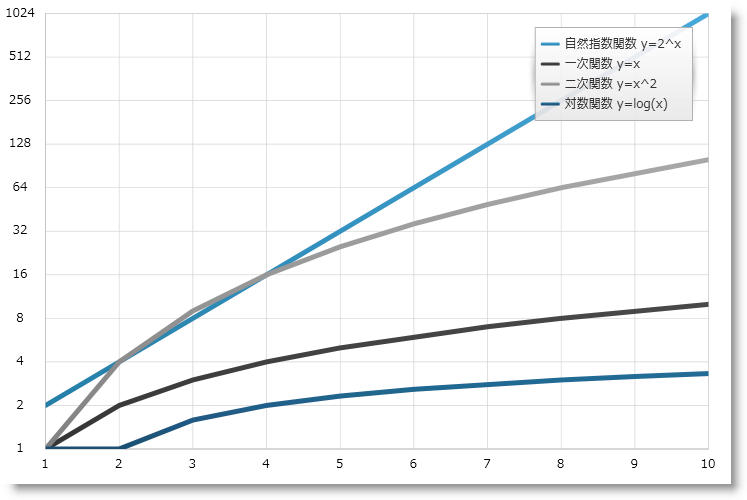

////

|metadata|
{
    "name": "datachart-using-axis-scales",
    "controlName": ["{DataChartName}"],
    "tags": ["Charting","Data Presentation","Getting Started","How Do I"],
    "guid": "4e5dece9-3873-4f38-b195-f9089b68f04a",  
    "buildFlags": ["wpf","win-universal"],
    "createdOn": "2014-06-05T19:39:00.5823511Z"
}
|metadata|
////

= 軸目盛の構成

このトピックは、 link:{DataChartLink}.{DataChartName}.html[{DataChartName}] コントロールのカスタム軸スケール機能を紹介し、コード例を示して、サポートされる軸スケールの使用方法を説明します。

== 概要

トピックは以下のとおりです。

* <<Introduction,概要>>
* <<Properties,プロパティ>>
* <<Example,例>>
* <<RelatedContent,関連コンテンツ>>

== 概要

{DataChartName} コントロールでは、数値軸により組み込みスケーラを使用してデータ値をスケールできます。これは、 link:{DataChartLink}.straightnumericaxisbase{ApiProp}scalemode.html[ScaleMode] タイプの列挙値を数値軸上の ScaleMode プロパティに設定して行います。このプロパティを設定することにより、軸スケーラーをリニアまたは対数 NumericScaler オブジェクトに効果的に設定します。動作は、 link:{DataChartLink}.numericaxisbase.html[NumericAxisBase]. link:{DataChartLink}.straightnumericaxisbase{ApiProp}scaler.html[Scaler] プロパティの設定と同じです。ただし、列挙可能なプロパティの方が便利な場合が多いです。カスタム軸スケーラーを数値軸の link:{DataChartLink}.straightnumericaxisbase{ApiProp}scaler.html[Scaler] プロパティに適用する方法については、「 link:datachart-creating-custom-axis-scalers.html[カスタム軸スケーラーの作成]」トピックを参照してください。

ifdef::wpf[]
動作は、link:{DataChartLink}.numericaxisbase.html[NumericAxisBase].link:{DataChartLink}.straightnumericaxisbase{ApiProp}scaler.html[Scaler] プロパティの設定と同じです。ただし、列挙可能なプロパティの方が便利な場合が多くなります。カスタム軸スケーラーを数値軸の link:{DataChartLink}.straightnumericaxisbase{ApiProp}scaler.html[Scaler] プロパティに適用する方法については、link:datachart-creating-custom-axis-scalers.html[「カスタム軸スケーラーの作成」]トピックを参照してください。
endif::wpf[]

== プロパティ

以下の表は、数値軸のスケールに影響するプロパティのリスト

[options="header", cols="a,a,a"]
|====
|軸プロパティ|プロパティ タイプ|説明

| link:{DataChartLink}.straightnumericaxisbase{ApiProp}scalemode.html[ScaleMode]
| link:{DataChartLink}.numericscalemode.html[NumericScaleMode]
|数値軸のスケールモードを取得または設定します。 

* link:{DataChartLink}.numericscalemode.html[リニア] 

* link:{DataChartLink}.numericscalemode.html[対数] 

| link:{DataChartLink}.numericaxisbase{ApiProp}LogarithmBase.html[LogarithmBase]
| int
|`Logarithmic` スケール モードの数値軸の場合に対数ベースを取得または設定します。

ifdef::wpf[]
| link:{DataChartLink}.straightnumericaxisbase{ApiProp}scaler.html[Scaler]
| link:{DataChartLink}.numericscaler.html[NumericScaler]
|数値軸をスケールするために使用する数値スケーラを取得または設定します。このプロパティはいずれかのオブジェクトに設定してください。 

数値 x-axis の場合: 

* link:{DataChartLink}.horizontallinearscaler.html[HorizontalLinearScaler] 

* link:{DataChartLink}.horizontallogarithmicscaler.html[HorizontalLogarithmicScaler] 

数値 y-axis の場合: 

* link:{DataChartLink}.verticallinearscaler.html[VerticalLinearScaler] 

* link:{DataChartLink}.verticallogarithmicscaler.html[VerticalLogarithmicScaler] 
endif::wpf[]

|====

ifdef::wpf[]
[NOTE]
====
注: 2011 Volume 2 リリースの前に 2 つの軸スケーリング機能がありました。リニアと対数です。2 つのモードは link:{DataChartLink}.numericaxisbase.html[NumericAxisBase]. link:{DataChartLink}.numericaxisbase{ApiProp}islogarithmic.html[IsLogarithmic] プロパティを使用して切り替えられました。対数の底が link:{DataChartLink}.numericaxisbase.html[NumericAxisBase]. link:{DataChartLink}.numericaxisbase{ApiProp}logarithmbase.html[LogarithmBase] プロパティを使用して編集できました。これらのプロパティはまだサポートされていますが、ScaleMode プロパティまたは Scaler プロパティを IsLogarithmic の代わりに使用することをお勧めします。
====
endif::wpf[]

== 例

以下のコードは、{DataChartName} コントロールでプロットされたスケール データ値に組み込み軸スケーラを使用する方法を示します。

ifdef::xaml[]

*XAML の場合:*
[source,xaml]
----
<ig:XamDataChart.Axes>
    <ig:NumericXAxis x:Name="xAxis" Name="Linear"  />
    <ig:NumericYAxis x:Name="yAxis" Name="Logarithmic" ScaleMode="Logarithmic" LogarithmBase="2" />
</ig:{DataChartName}.Axes>
----

endif::xaml[]

ifdef::wpf,win-universal,win-forms,xamarin[]

*C# の場合:*

[source,csharp]
----
var xAxis = new NumericXAxis();
 xAxis.ScaleMode = NumericScaleMode.Linear;
var yAxis = new NumericYAxis();
yAxis.ScaleMode = NumericScaleMode.Logarithmic;
yAxis.LogarithmBase = 2;
----

endif::wpf,win-universal,win-forms,xamarin[]

ifdef::wpf,win-universal,win-forms[]
*Visual Basic の場合:*
[source,vb]
----
Dim xAxis As New NumericXAxis() 
xAxis.ScaleMode = NumericScaleMode.Linear
Dim xAxis As New NumericYAxis() 
yAxis.ScaleMode = NumericScaleMode.Logarithmic
yAxis.LogarithmBase = 2
----
endif::wpf,win-universal,win-forms[]

図 1 - Y 軸に適用される対数スケール付きの {DataChartName} のプレビュー。

== 関連コンテンツ

* link:datachart-creating-custom-axis-scalers.html[カスタム軸スケーラの作成]