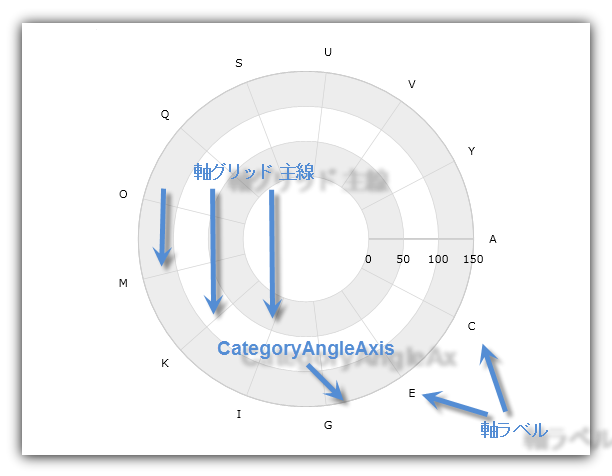
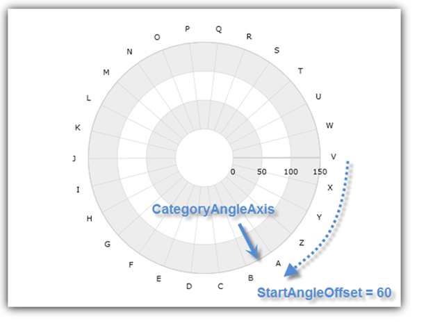

////

|metadata|
{
    "name": "datachart-using-category-angle-axis",
    "controlName": ["{DataChartName}"],
    "tags": ["Charting","Data Presentation"],
    "guid": "3ba809ed-d15a-4596-9543-940560ef615f",  
    "buildFlags": [],
    "createdOn": "2014-06-05T19:39:00.6083619Z"
}
|metadata|
////

= カテゴリ角度軸の使用

このトピックは、コード例を示して、カテゴリ角度軸を link:{DataChartLink}.{DataChartName}.html[{DataChartName}] コントロールで使用する方法を説明します。

トピックは以下のとおりです。

* <<Introduction,概要>>
* <<AxisCrossingProperties,軸交差プロパティ>>
* <<AxisRangeProperties,軸範囲プロパティ>>
* <<AxisOffset,軸オフセット>>
* <<RelatedContent,関連コンテンツ>>

[[Introduction]]
== 概要

link:{DataChartLink}.categoryangleaxis.html[CategoryAngleAxis] は、チャートの中央から外側をポイントする放射状の線のように表示する主グリッド線と、チャートの中央を囲む円の形状をしています(図 1)

図 1: サンプル link:{DataChartLink}.categoryangleaxis.html[CategoryAngleAxis] 図形の実装例

link:{DataChartLink}.categoryangleaxis.html[CategoryAngleAxis] は、link:{DataChartLink}.numericangleaxis.html[NumericAngleAxis] (link:datachart-polar-series-overview.html[極座標シリーズ]とのみ使用) の代わりに、link:datachart-radial-series-overview.html[ラジアル シリーズ] (link:{DataChartLink}.numericradiusaxis.html[NumericRadiusAxis] と組み合わせる) とのみ使用されます。特定のシリーズで必要となる軸タイプの詳細については、link:datachart-series-requirements.html[「シリーズ要件」]のトピックを参照してください。

.注:
[NOTE]
====
軸線にラベル表示するには、すべてのカテゴリ軸にデータ バインディングおよびデータ マッピングが必要です。カテゴリにデータをバインドする方法については、  link:datachart-getting-started-with-datachart.html[データ チャートを使用した作業の開始]  トピックのコード例を参照してください。
====

[[AxisCrossingProperties]]
== 軸交差プロパティ

CategoryAngleAxis には以下の軸交差プロパティがあります。

link:{DataChartLink}.axis{ApiProp}crossingvalue.html[CrossingValue] – 半径、つまり NumericRadiusAxis の先頭からの距離。つまり、この値は、NumericRadiusAxis で CategoryAngleAxis の交差の位置を決定します。CrossingValue プロパティの値が大きくなると、CategoryAngleAxis をチャートの中心から遠くに移動し、値が小さくなると、角度軸を半径軸に沿って中心近くに移動します。たとえば、NumericRadiusAxis に 0 から 100 の値範囲があり、値 50 が CategoryAngleAxis の CrossingValue プロパティに設定されている場合には、角度軸は値 50 で半径軸を交差します。デフォルトで、角度の交差値は半径軸の最大値に設定されます。つまり、角度軸はチャートの外側の輪に描画されます。

link:{DataChartLink}.axis{ApiProp}crossingaxis.html[CrossingAxis] – CategoryAngleAxis を交差する {DataChartName} コントロールの  pick:[wpf,win-universal,win-forms="link:{DataChartLink}.{DataChartName}{ApiProp}axes.html[Axes]"]  コレクションの軸。{DataChartName} コントロールの Axes コレクションに CategoryAngleAxis が複数あり、NumericRadiusAxis が 1 つある場合、このプロパティを NumericRadiusAxis にバインドするまたはその逆にバインドする必要があります。交差軸を指定しない場合、角度軸は、チャートの軸コレクションの NumericRadiusAxis タイプの最初の軸が正しい交差軸であると想定します。

以下のコードは、{DataChartName} コントロールで CategoryAngleAxis の CrossingAxis プロパティと CrossingValue プロパティを使用する方法を示します。NumericRadiusAxis の先頭から半径 150 のところで NumericAngleAxis が CategoryAngleAxis と交差するように設定します。この結果は、以下の図 2 に示されます。

ifdef::wpf,win-universal[]

*XAML の場合:*

----
<ig:{DataChartName} x:Name="DataChart" >
    <ig:{DataChartName}.Axes>
        <ig:NumericRadiusAxis x:Name="RadiusAxis"  
                              CrossingAxis="{Binding ElementName=categoryAngleAxis}"
                              CrossingValue="0" >
        </ig:NumericRadiusAxis>
        <ig:CategoryAngleAxis x:Name="categoryAngleAxis"
                             CrossingAxis="{Binding ElementName=RadiusAxis}"
                             CrossingValue="150" >
        </ig:CategoryAngleAxis>
    </ig:{DataChartName}.Axes>
</ig:{DataChartName}>
----

endif::wpf,win-universal[]

ifdef::xamarin[]

*XAML の場合:*

----
<ig:{DataChartName} x:Name="DataChart" >
    <ig:{DataChartName}.Axes>
        <ig:NumericRadiusAxis x:Name="RadiusAxis"  
                              CrossingAxis="{x:Reference categoryAngleAxis}"
                              CrossingValue="0" >
        </ig:NumericRadiusAxis>
        <ig:CategoryAngleAxis x:Name="categoryAngleAxis"
                             CrossingAxis="{x:Reference RadiusAxis}"
                             CrossingValue="150" >
        </ig:CategoryAngleAxis>
    </ig:{DataChartName}.Axes>
</ig:{DataChartName}>
----

endif::xamarin[]

ifdef::wpf[]

*Visual Basic の場合:*

----
Dim DataChart As New {DataChartName}()
Dim categoryAngleAxis As New CategoryAngleAxis()
Dim RadiusAxis As New NumericRadiusAxis()
RadiusAxis.CrossingAxis = categoryAngleAxis
RadiusAxis.CrossingValue = 0
categoryAngleAxis.CrossingAxis = RadiusAxis
categoryAngleAxis.CrossingValue = 150
DataChart.Axes.Add(categoryAngleAxis)
DataChart.Axes.Add(RadiusAxis)
----

endif::wpf[]

ifdef::win-forms[]

*Visual Basic の場合:*

----
Dim DataChart As New {DataChartName}()
Dim categoryAngleAxis As New CategoryAngleAxis()
Dim RadiusAxis As New NumericRadiusAxis()
RadiusAxis.CrossingAxis = categoryAngleAxis
RadiusAxis.CrossingValue = 0
categoryAngleAxis.CrossingAxis = RadiusAxis
categoryAngleAxis.CrossingValue = 150
DataChart.Axes.Add(categoryAngleAxis)
DataChart.Axes.Add(RadiusAxis)
----

endif::win-forms[]

ifdef::wpf[]

*C# の場合:*

----
var DataChart = new {DataChartName}();
var categoryAngleAxis = new CategoryAngleAxis();
var RadiusAxis = new NumericRadiusAxis();
RadiusAxis.CrossingAxis = categoryAngleAxis;
RadiusAxis.CrossingValue = 0;
categoryAngleAxis.CrossingAxis = RadiusAxis;
categoryAngleAxis.CrossingValue = 150;
DataChart.Axes.Add(categoryAngleAxis);
DataChart.Axes.Add(RadiusAxis);
----

endif::wpf[]

ifdef::win-forms[]

*C# の場合:*

----
var DataChart = new {DataChartName}();
var categoryAngleAxis = new CategoryAngleAxis();
var RadiusAxis = new NumericRadiusAxis();
RadiusAxis.CrossingAxis = categoryAngleAxis;
RadiusAxis.CrossingValue = 0;
categoryAngleAxis.CrossingAxis = RadiusAxis;
categoryAngleAxis.CrossingValue = 150;
DataChart.Axes.Add(categoryAngleAxis);
DataChart.Axes.Add(RadiusAxis);
----

endif::win-forms[]

ifdef::xamarin[]

*C# の場合:*

----
var DataChart = new {DataChartName}();
var categoryAngleAxis = new CategoryAngleAxis();
var RadiusAxis = new NumericRadiusAxis();
RadiusAxis.CrossingAxis = categoryAngleAxis;
RadiusAxis.CrossingValue = 0;
categoryAngleAxis.CrossingAxis = RadiusAxis;
categoryAngleAxis.CrossingValue = 150;
DataChart.Axes.Add(categoryAngleAxis);
DataChart.Axes.Add(RadiusAxis);
----

endif::xamarin[]

ifdef::android[]

*Java の場合:*

[source,js]
----
DataChartView dataChart = new DataChartView(root.getContext());
CategoryAngleAxis categoryAngleAxis = new CategoryAngleAxis();
NumericRadiusAxis RadiusAxis = new NumericRadiusAxis();
RadiusAxis.setCrossingAxis(categoryAngleAxis);
RadiusAxis.setCrossingValue(0.0);
categoryAngleAxis.setCrossingAxis(RadiusAxis);
categoryAngleAxis.setCrossingValue(150);
dataChart.addAxis(categoryAngleAxis);
dataChart.addAxis(RadiusAxis);
----

endif::android[]

image::images/xamDataChart_Using_Category_Angle_Axis_02.png[]

図 2: NumericRadiusAxis の半径値 150 のところで {DataChartName} コントロールと CategoryAngleAxis が交差

[[AxisRangeProperties]]
== 軸範囲プロパティ

IGCategoryAngleAxis に link:{DataChartLink}.numericaxisbase{ApiProp}minimumvalue.html[MinimumValue] および link:{DataChartLink}.numericaxisbase{ApiProp}maximumvalue.html[MaximumValue] プロパティはありません。従って、常にバインド先のデータ セットの最初の項目から開始し、 link:{DataChartLink}.numericaxisbase{ApiProp}interval.html[interval] プロパティの値に等しい間隔で残りの項目の軸ラベルと主グリッド線を表示します。

以下のコードは、CategoryAngleAxis で間隔を設定し、{DataChartName} コントロールでその他のあらゆる軸ラベルを表示する方法を示します。この結果は、以下の図 3 に示されます。

ifdef::xaml[]

*XAML の場合:*

----
<ig:{DataChartName} x:Name="DataChart" >
    <ig:{DataChartName}.Axes>
        <ig:CategoryAngleAxis x:Name="categoryAngleAxis"  
                              Interval="2">
        </ig:CategoryAngleAxis>
    </ig:{DataChartName}.Axes>
</ig:{DataChartName}>
----

endif::xaml[]

ifdef::wpf[]

*Visual Basic の場合:*

----
Dim DataChart As New {DataChartName}()
Dim categoryAngleAxis As New CategoryAngleAxis()
categoryAngleAxis.Interval = 2
DataChart.Axes.Add(categoryAngleAxis)
----

endif::wpf[]

ifdef::win-forms[]

*Visual Basic の場合:*

----
Dim DataChart As New {DataChartName}()
Dim categoryAngleAxis As New CategoryAngleAxis()
categoryAngleAxis.Interval = 2
DataChart.Axes.Add(categoryAngleAxis)
----

endif::win-forms[]

ifdef::wpf[]

*C# の場合:*

----
var DataChart = new {DataChartName}();
var categoryAngleAxis = new CategoryAngleAxis();
categoryAngleAxis.Interval = 2;
DataChart.Axes.Add(categoryAngleAxis);
----

endif::wpf[]

ifdef::win-forms[]

*C# の場合:*

----
var DataChart = new {DataChartName}();
var categoryAngleAxis = new CategoryAngleAxis();
categoryAngleAxis.Interval = 2;
DataChart.Axes.Add(categoryAngleAxis);
----

endif::win-forms[]

ifdef::xamarin[]

*C# の場合:*

----
var DataChart = new {DataChartName}();
var categoryAngleAxis = new CategoryAngleAxis();
categoryAngleAxis.Interval = 2;
DataChart.Axes.Add(categoryAngleAxis);
----

endif::xamarin[]

ifdef::android[]

*Java の場合:*

[source,js]
----
DataChartView dataChart = new DataChartView(root.getContext());
CategoryAngleAxis categoryAngleAxis = new CategoryAngleAxis();
categoryAngleAxis.setInterval(1);
dataChart.addAxis(categoryAngleAxis);
----

endif::android[]

image::images/xamDataChart_Using_Category_Angle_Axis_03.png[]

図 3: {DataChartName} でその他のあらゆる軸ラベルを表示する CategoryAngleAxis

[[AxisOffset]]
== 軸オフセット

CategoryAngleAxis は常に 3 時の位置から開始します (チャートの右側)。ただし、時計方向に開始軸の位置をオフセットするために使用される角度に CategoryAngleAxis オブジェクトの link:{DataChartLink}.categoryangleaxis{ApiProp}startangleoffset.html[StartAngleOffset] プロパティを設定することによってこれを変更できます。たとえば、StartAngleOffset プロパティで値 90 を設定すると、6 時の位置 (チャートの一番下) に NumericAngleAxis の開始ポイントが配置されます。値 270 は、12 時の位置 (チャートの一番上) から軸を開始します。軸インデックスは常に時計回りに増えますが、CategoryAngleAxis で IsInvertedを true に設定して、軸のインデックスが反時計回りに増えるようにすることができます。

以下のコードは、{DataChartName} コントロールで CategoryAngleAxis の開始ポイントを 60 度ずつオフセットする方法を示します。この結果は、以下の図 4 に示されます。

ifdef::xaml[]

*XAML の場合:*

----
<ig:{DataChartName} x:Name="DataChart" >
    <ig:{DataChartName}.Axes>
        <ig:CategoryAngleAxis x:Name="categoryAngleAxis"  
                             StartAngleOffset="60">
        </ig:CategoryAngleAxis>
    </ig:{DataChartName}.Axes>
</ig:{DataChartName}>
----

endif::xaml[]

ifdef::wpf[]

*Visual Basic の場合:*

----
Dim DataChart As New {DataChartName}()
Dim categoryAngleAxis As New CategoryAngleAxis()
categoryAngleAxis.StartAngleOffset = 60
DataChart.Axes.Add(categoryAngleAxis)
----

endif::wpf[]

ifdef::win-forms[]

*Visual Basic の場合:*

----
Dim DataChart As New {DataChartName}()
Dim categoryAngleAxis As New CategoryAngleAxis()
categoryAngleAxis.StartAngleOffset = 60
DataChart.Axes.Add(categoryAngleAxis)
----

endif::win-forms[]

ifdef::wpf[]

*C# の場合:*

----
var DataChart = new {DataChartName}();
var categoryAngleAxis = new CategoryAngleAxis();
categoryAngleAxis.StartAngleOffset = 60;
DataChart.Axes.Add(categoryAngleAxis);
----

endif::wpf[]

ifdef::win-forms[]

*C# の場合:*

----
var DataChart = new {DataChartName}();
var categoryAngleAxis = new CategoryAngleAxis();
categoryAngleAxis.StartAngleOffset = 60;
DataChart.Axes.Add(categoryAngleAxis);
----

endif::win-forms[]

ifdef::xamarin[]

*C# の場合:*

----
var DataChart = new {DataChartName}();
var categoryAngleAxis = new CategoryAngleAxis();
categoryAngleAxis.StartAngleOffset = 60;
DataChart.Axes.Add(categoryAngleAxis);
----

endif::xamarin[]

ifdef::android[]

*Java の場合:*

[source,js]
----
DataChartView dataChart = new DataChartView(root.getContext());
CategoryAngleAxis categoryAngleAxis = new CategoryAngleAxis();
categoryAngleAxis.setStartAngleOffset(60);
dataChart.addAxis(categoryAngleAxis);
----

endif::android[]

図 4: 開始角度値を 60 度オフセットした CategoryAngleAxis

[[RelatedContent]]
== 関連コンテンツ

* link:datachart-series-requirements.html[シリーズ要件]
* link:datachart-radial-series-overview.html[ラジアル シリーズ]