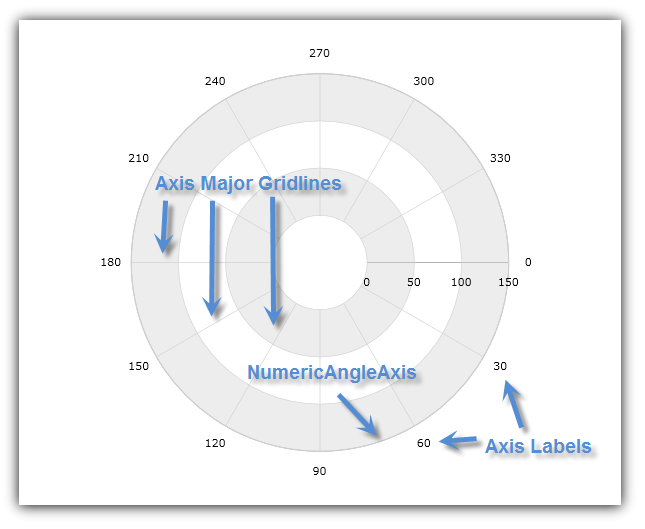
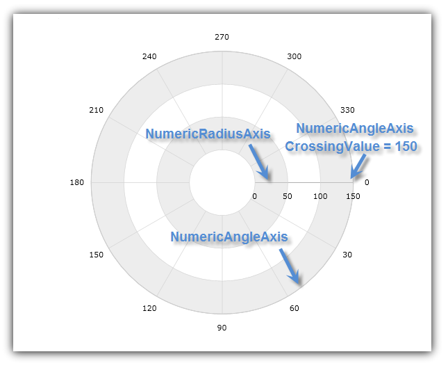
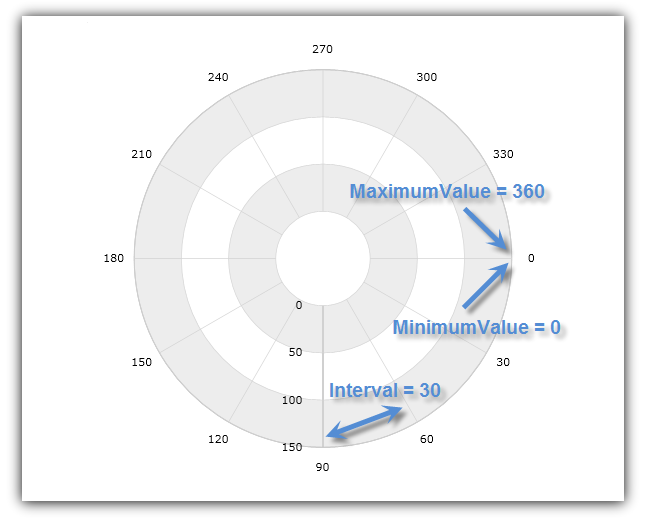
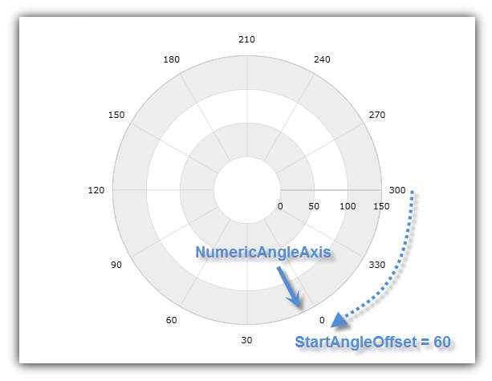

////

|metadata|
{
    "name": "datachart-using-numeric-angle-axis",
    "controlName": ["{DataChartName}"],
    "tags": ["Charting","How Do I"],
    "guid": "c9676734-3439-422f-b396-661f6455b3a5",  
    "buildFlags": [],
    "createdOn": "2014-06-05T19:39:00.60436Z"
}
|metadata|
////

= 数値角度軸の使用

このトピックは、コード例を示して、数値角度軸を link:{DataChartLink}.{DataChartName}.html[{DataChartName}]™ コントロールで使用する方法を説明します。

トピックは以下のとおりです。

* <<Introduction,概要>>
* <<AxisCrossingProperties,軸交差プロパティ>>
* <<AxisRangeProperties,軸範囲プロパティ>>
* <<AxisOffset,軸オフセット>>
* <<RelatedContent,関連コンテンツ>>

[[Introduction]]
== 概要

link:{DataChartLink}.numericangleaxis.html[NumericAngleAxis] は、チャートの中央から外側をポイントする放射状の線のように表示する主グリッド線と、チャートの中央を囲む円の形状をしています(図 1)

図 1: NumericAngleAxis の形状の実装例

このタイプの軸は、link:{DataChartLink}.categoryangleaxis.html[CategoryAngleAxis] (link:datachart-radial-series-overview.html[ラジアル シリーズ]のみ使用) の代わりに、 link:datachart-polar-series-overview.html[極座標シリーズ] (link:{DataChartLink}.numericradiusaxis.html[NumericRadiusAxis] と組み合わせる) とのみ使用されます。特定のシリーズで必要となる軸タイプの詳細については、link:datachart-series-requirements.html[「シリーズ要件」]のトピックを参照してください。

[[AxisCrossingProperties]]
== 軸交差プロパティ

NumericAngleAxis には以下の軸交差プロパティがあります。

link:{DataChartLink}.axis{ApiProp}crossingvalue.html[CrossingValue] – 半径、つまり NumericRadiusAxis の先頭からの距離。この値は、NumericRadiusAxis で NumericAngleAxis の交差の位置を決定します。CrossingValue プロパティの値が大きくなると、NumericAngleAxis をチャートの中心から遠くに移動し、値が小さくなると、角度軸を半径軸に沿って中心近くに移動します。たとえば、NumericRadiusAxis に 0 から 100 の値範囲があり、値 50 が NumericAngleAxis の CrossingValue プロパティに設定されている場合には、角度軸は値 50 で半径軸を交差します。デフォルトで、角度の交差値は半径軸の最大値に設定されます。つまり、角度軸はチャートの外側の輪に描画されます。

link:{DataChartLink}.axis{ApiProp}crossingaxis.html[CrossingAxis] – NumericAngleAxis を交差する {DataChartName} コントロールの Axes コレクションの軸。{DataChartName} コントロールの Axes コレクションに NumericAngleAxis が複数あり、NumericRadiusAxis が 1 つある場合、このプロパティを NumericRadiusAxis にバインドする必要があります。交差軸を指定しない場合、角度軸は、チャートの  pick:[wpf,win-universal,win-forms="link:{DataChartLink}.{DataChartName}{ApiProp}axes.html[Axes]"]  pick:[android="link:{DataChartLink}.{DataChartName}~addaxis.html[Axes]"]  コレクションの NumericRadiusAxis タイプの最初の軸が正しい交差軸であると想定します。

以下のコードは、{DataChartName} コントロールで NumericAngleAxis の CrossingAxis プロパティと CrossingValue プロパティを使用する方法を示します。NumericRadiusAxis の先頭から半径 150 のところで NumericAngleAxis が NumericRadiusAxis と交差するように設定します。この結果は、以下の図 2 に示されます。

ifdef::wpf,win-universal[]

*XAML の場合:*

----
<ig:{DataChartName} x:Name="DataChart" >
    <ig:{DataChartName}.Axes>
        <ig:NumericRadiusAxis x:Name="RadiusAxis"  
                              CrossingAxis="{Binding ElementName=AngleAxis}"
                              CrossingValue="0" >
        </ig:NumericRadiusAxis>
        <ig:NumericAngleAxis x:Name="AngleAxis"
                             CrossingAxis="{Binding ElementName=RadiusAxis}"
                             CrossingValue="150" >
        </ig:NumericAngleAxis>
    </ig:{DataChartName}.Axes>
</ig:{DataChartName}>
----

endif::wpf,win-universal[]

ifdef::xamarin[]

*XAML の場合:*

----
<ig:{DataChartName} x:Name="DataChart" >
    <ig:{DataChartName}.Axes>
        <ig:NumericRadiusAxis x:Name="RadiusAxis"  
                              CrossingAxis="{x:Reference AngleAxis}"
                              CrossingValue="0" >
        </ig:NumericRadiusAxis>
        <ig:NumericAngleAxis x:Name="AngleAxis"
                             CrossingAxis="{x:Reference RadiusAxis}"
                             CrossingValue="150" >
        </ig:NumericAngleAxis>
    </ig:{DataChartName}.Axes>
</ig:{DataChartName}>
----

endif::xamarin[]

ifdef::wpf[]

*Visual Basic の場合:*

----
Dim DataChart As New {DataChartName}()
Dim AngleAxis As New NumericAngleAxis()
Dim RadiusAxis As New NumericRadiusAxis()
RadiusAxis.CrossingAxis = AngleAxis
RadiusAxis.CrossingValue = 0
AngleAxis.CrossingAxis = RadiusAxis
AngleAxis.CrossingValue = 150
DataChart.Axes.Add(AngleAxis)
DataChart.Axes.Add(RadiusAxis)
----

endif::wpf[]

ifdef::win-forms[]

*Visual Basic の場合:*

----
Dim DataChart As New {DataChartName}()
Dim AngleAxis As New NumericAngleAxis()
Dim RadiusAxis As New NumericRadiusAxis()
RadiusAxis.CrossingAxis = AngleAxis
RadiusAxis.CrossingValue = 0
AngleAxis.CrossingAxis = RadiusAxis
AngleAxis.CrossingValue = 150
DataChart.Axes.Add(AngleAxis)
DataChart.Axes.Add(RadiusAxis)
----

endif::win-forms[]

ifdef::wpf[]

*C# の場合:*

----
var DataChart = new {DataChartName}();
var AngleAxis = new NumericAngleAxis();
var RadiusAxis = new NumericRadiusAxis();
RadiusAxis.CrossingAxis = AngleAxis;
RadiusAxis.CrossingValue = 0;
AngleAxis.CrossingAxis = RadiusAxis;
AngleAxis.CrossingValue = 150;
DataChart.Axes.Add(AngleAxis);
DataChart.Axes.Add(RadiusAxis);
----

endif::wpf[]

ifdef::win-forms[]

*C# の場合:*

----
var DataChart = new {DataChartName}();
var AngleAxis = new NumericAngleAxis();
var RadiusAxis = new NumericRadiusAxis();
RadiusAxis.CrossingAxis = AngleAxis;
RadiusAxis.CrossingValue = 0;
AngleAxis.CrossingAxis = RadiusAxis;
AngleAxis.CrossingValue = 150;
DataChart.Axes.Add(AngleAxis);
DataChart.Axes.Add(RadiusAxis);
----

endif::win-forms[]

ifdef::xamarin[]

*C# の場合:*

----
var DataChart = new {DataChartName}();
var AngleAxis = new NumericAngleAxis();
var RadiusAxis = new NumericRadiusAxis();
RadiusAxis.CrossingAxis = AngleAxis;
RadiusAxis.CrossingValue = 0;
AngleAxis.CrossingAxis = RadiusAxis;
AngleAxis.CrossingValue = 150;
DataChart.Axes.Add(AngleAxis);
DataChart.Axes.Add(RadiusAxis);
----

endif::xamarin[]

ifdef::android[]

*Java の場合:*

[source,js]
----
DataChartView dataChart = new DataChartView(root.getContext());
NumericAngleAxis AngleAxis = new NumericAngleAxis();
NumericRadiusAxis RadiusAxis = new NumericRadiusAxis();
RadiusAxis.setCrossingAxis(AngleAxis);
RadiusAxis.setCrossingValue(0.0);
AngleAxis.setCrossingAxis(RadiusAxis);
AngleAxis.setCrossingValue(150);
dataChart.addAxis(AngleAxis);
dataChart.addAxis(RadiusAxis);
----

endif::android[]

図 2: NumericRadiusAxis の半径値 150 で {DataChartName} コントロールと NumericAngleAxis が交差

[[AxisRangeProperties]]
== 軸範囲プロパティ

NumericAngleAxis には以下の範囲プロパティがあります。

link:{DataChartLink}.numericaxisbase{ApiProp}minimumvalue.html[MinimumValue] – 軸が開始する位置

link:{DataChartLink}.numericaxisbase{ApiProp}maximumvalue.html[MinimumValue] – 軸が終了する位置

link:{DataChartLink}.numericaxisbase{ApiProp}interval.html[Interval] – 連続する主グリッド線またはチャートの中心から開始する放射状の線の間の角度分離間の間隔

デフォルトで、{DataChartName} は自動範囲を使用します。これにより、MinimumValue プロパティが最小の角度データ列を持つデータ ポイントに設定され、MaximumValue プロパティが最大の角度データ列を持つデータ ポイントに設定されます。ただし、NumericAngleAxis で値範囲を手動で設定すると、この範囲外の角度データ列を持つすべてのデータ ポイントは非表示になります。たとえば、0 から 360 までの角度データ列を持つデータ ポイントのコレクションがシリーズと 50 (MinimumValue) と100 (MaximumValue) の値範囲にバインドされており、NumericAngleAxis で設定されると、チャートは、角度データ列が 50 から 100 のデータ ポイントのみを表示します。

以下のコードは、{DataChartName} コントロールで NumericAngleAxis と範囲値を使用する方法を示します。角度範囲を 0 と 360 の間に、主グリッド線の間隔を 30 度ごとに設定します。この結果は、以下の図 3 に示されます。

ifdef::xaml[]

*XAML の場合:*

----
<ig:{DataChartName} x:Name="DataChart" >
    <ig:{DataChartName}.Axes>
        <ig:NumericAngleAxis x:Name="AngleAxis"  
                             MinimumValue="0"
                             MaximumValue="360"
                             Interval="30">
        </ig:NumericAngleAxis>
    </ig:{DataChartName}.Axes>
</ig:{DataChartName}>
----

endif::xaml[]

ifdef::wpf[]

*Visual Basic の場合:*

----
Dim DataChart As New {DataChartName}()
Dim AngleAxis As New NumericAngleAxis()
AngleAxis.MinimumValue = 0
AngleAxis.MaximumValue = 360
AngleAxis.Interval = 50
DataChart.Axes.Add(AngleAxis)
----

endif::wpf[]

ifdef::win-forms[]

*Visual Basic の場合:*

----
Dim DataChart As New {DataChartName}()
Dim AngleAxis As New NumericAngleAxis()
AngleAxis.MinimumValue = 0
AngleAxis.MaximumValue = 360
AngleAxis.Interval = 50
DataChart.Axes.Add(AngleAxis)
----

endif::win-forms[]

ifdef::wpf[]

*C# の場合:*

----
var DataChart = new {DataChartName}();
var AngleAxis = new NumericRadiusAxis();
AngleAxis.MinimumValue = 0;
AngleAxis.MaximumValue = 360;
AngleAxis.Interval = 30;
DataChart.Axes.Add(AngleAxis);
----

endif::wpf[]

ifdef::win-forms[]

*C# の場合:*

----
var DataChart = new {DataChartName}();
var AngleAxis = new NumericRadiusAxis();
AngleAxis.MinimumValue = 0;
AngleAxis.MaximumValue = 360;
AngleAxis.Interval = 30;
DataChart.Axes.Add(AngleAxis);
----

endif::win-forms[]

ifdef::xamarin[]

*C# の場合:*

----
var DataChart = new {DataChartName}();
var AngleAxis = new NumericRadiusAxis();
AngleAxis.MinimumValue = 0;
AngleAxis.MaximumValue = 360;
AngleAxis.Interval = 30;
DataChart.Axes.Add(AngleAxis);
----

endif::xamarin[]

ifdef::android[]

*Java の場合:*

[source,js]
----
DataChartView dataChart = new DataChartView(rootView.getContext());
AngleAxis AngleAxis = new NumericAngleAxis();
AngleAxis.setMinimumValue(0.0);
AngleAxis.setMaximumValue(360);
AngleAxis.setInterval(50);
dataChart.addAxis(AngleAxis);
----

endif::android[]

図 3: 軸範囲を 0 から 260 の間に、間隔を 30 に設定した NumericAngleAxis

[[AxisOffset]]
== 軸オフセット

NumericAngleAxis は常に 3 時の位置から開始します (チャートの右側)。ただし、時計方向に開始軸の位置をオフセットするために使用される角度に NumericAngleAxis オブジェクトの link:{DataChartLink}.numericangleaxis{ApiProp}startangleoffset.html[StartAngleOffset] プロパティを設定することによってこれを変更できます。たとえば、StartAngleOffset プロパティで値 90 を設定すると、6 時の位置 (チャートの一番下) に NumericAngleAxis の開始ポイントが配置されます。値 270 は、12 時の位置 (チャートの一番上) から軸を開始します。軸インデックスは常に時計回りに増えますが、NumericAngleAxis で link:{DataChartLink}.axis{ApiProp}isinverted.html[IsInverted]を true に設定して、軸のインデックスが反時計回りに増えるようにすることができます。

以下のコードは、{DataChartName} コントロールで NumericAngleAxis の開始ポイントを 60 度ずつオフセットする方法を示します。この結果は、以下の図 4 に示されます。

ifdef::xaml[]

*XAML の場合:*

----
<ig:NumericAngleAxis x:Name="AngleAxis"  
                   StartAngleOffset="60">
</ig:NumericAngleAxis>
----

endif::xaml[]

ifdef::wpf[]

*Visual Basic の場合:*

----
Dim AngleAxis As New NumericAngleAxis()
AngleAxis.StartAngleOffset = 60
----

endif::wpf[]

ifdef::win-forms[]

*Visual Basic の場合:*

----
Dim AngleAxis As New NumericAngleAxis()
AngleAxis.StartAngleOffset = 60
----

endif::win-forms[]

ifdef::wpf[]

*C# の場合:*

----
var AngleAxis = new NumericAngleAxis();
AngleAxis.StartAngleOffset = 60;
----

endif::wpf[]

ifdef::win-forms[]

*C# の場合:*

----
var AngleAxis = new NumericAngleAxis();
AngleAxis.StartAngleOffset = 60;
----

endif::win-forms[]

ifdef::xamarin[]

*C# の場合:*

----
var AngleAxis = new NumericAngleAxis();
AngleAxis.StartAngleOffset = 60;
----

endif::xamarin[]

ifdef::android[]

*Java の場合:*

[source,js]
----
DataChartView dataChart = new DataChartView(rootView.getContext());
AngleAxis AngleAxis = new NumericAngleAxis();
AngleAxis.setStartAngleOffset(60);
dataChart.addAxis(AngleAxis);
----

endif::android[]

図 4: 開始角度値を 60 度オフセットした NumericAngleAxis

[[RelatedContent]]
== 関連コンテンツ

* link:datachart-series-requirements.html[シリーズ要件]
* link:datachart-polar-series-overview.html[極座標シリーズ]