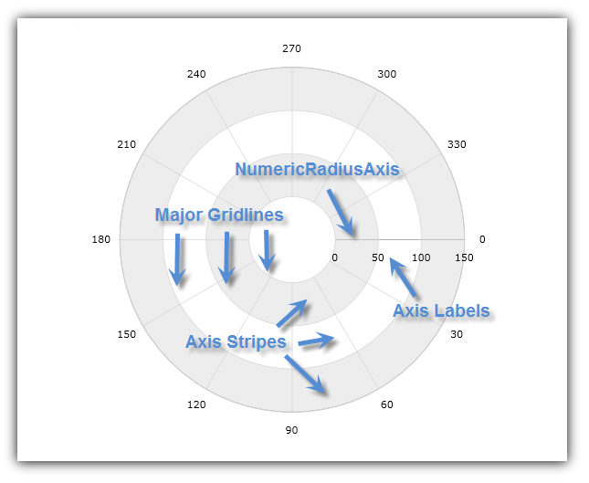
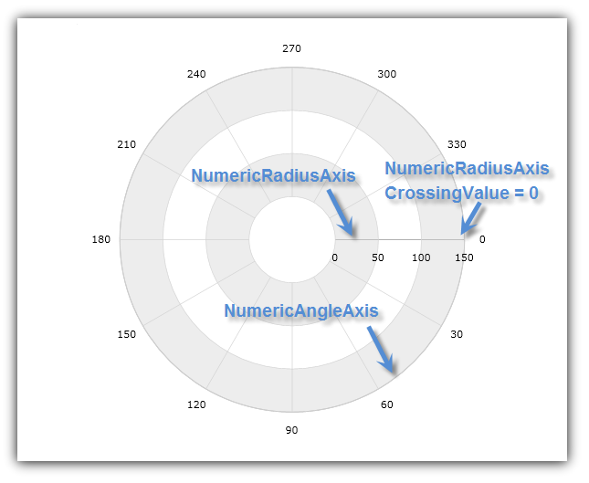
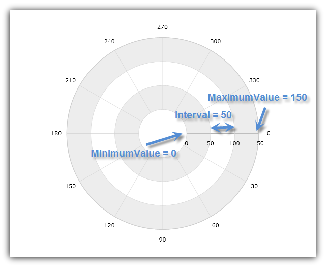
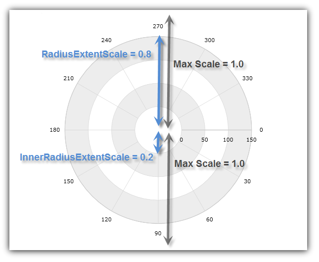

////

|metadata|
{
    "name": "datachart-using-numeric-radius-axis",
    "controlName": ["{DataChartName}"],
    "tags": ["Application Scenarios","Charting"],
    "guid": "e8841c1a-ff2e-4ffd-b0cc-9e5afcbbaa72",  
    "buildFlags": [],
    "createdOn": "2014-06-05T19:39:00.6063608Z"
}
|metadata|
////

= 数値半径軸の使用

このトピックは、コード例を示して、数値半径軸を link:{DataChartLink}.{DataChartName}.html[{DataChartName}]™ コントロールで使用する方法を説明します。

トピックは以下のとおりです。

* <<Introduction,概要>>
* <<AxisCrossingProperties,軸交差プロパティ>>
* <<AxisRangeProperties,軸範囲プロパティ>>
* <<AxisExtentScales,軸範囲スケール>>
* <<RelatedContent,関連コンテンツ>>

[[Introduction]]
== 概要

{DataChartName} コントロールの link:{DataChartLink}.numericradiusaxis.html[NumericRadiusAxis] 図形は、チャートの中心を基点としてチャート プロット領域の境界の外側を指す直線の形をしています。この軸の主グリッド線は半径の値が増えるに従い円のようになります(図 1)

図 1: `NumericRadiusAxis` の形状の実装例

このタイプの軸は、link:datachart-polar-series-overview.html[極座標シリーズ] (link:{DataChartLink}.numericangleaxis.html[NumericAngleAxis] と組み合わせて) のみと、または link:datachart-radial-series-overview.html[ラジアル シリーズ] (link:{DataChartLink}.categoryangleaxis.html[CategoryAngleAxis] と組み合わせて) と使用できます。特定のシリーズで必要となる軸タイプの詳細については、link:datachart-series-requirements.html[「シリーズ要件」]のトピックを参照してください。

[[AxisCrossingProperties]]
== 軸交差プロパティ

`NumericRadiusAxis` には以下の軸交差プロパティがあります。

link:{DataChartLink}.axis{ApiProp}crossingvalue.html[CrossingValue] – `NumericRadiusAxis` が指される方向。有効範囲は 0 から 360 の範囲です。デフォルトで、この値は CategoryAngleAxis または NumericAngleAxis で 3 時の位置に対応するゼロに設定されています。`CrossingValue` プロパティの値は、`NumericRadiusAxis` を 3 時の位置から時計回りに移動する度数を示します。たとえば、`CrossingValue` プロパティで 90 という値を設定すると、`NumericRadiusAxis` は 6 時の位置に移動し、270 という値を設定すると、12 時の位置に移動します。

link:{DataChartLink}.axis{ApiProp}crossingaxis.html[CrossingAxis] – NumericRadiusAxis を交差する `{DataChartName}` コントロールの pick:[wpf,win-universal,win-forms,xamarin="link:{DataChartLink}.{DataChartName}{ApiProp}axes.html[Axes]"]  pick:[android="link:{DataChartLink}.{DataChartName}{ApiProp}addaxis.html[Axes]"]  コレクションの軸。複数の `NumericRadiusAxis` とひとつの NumericAngleAxis または `CategoryAngleAxis` が {DataChartName} コントロールの Axes コレクションにある場合、このプロパティは `NumericAngleAxis` (極座標シリーズ) または `CategoryAngleAxis` (ラジアル シリーズ) およびその逆にバインドする必要があります。

表 1: `CrossingAxis` プロパティにバインドできる軸タイプ

[options="header", cols="a,a,a"]
|====
|シリーズ タイプ|軸タイプ|CrossingAxis タイプ

| link:datachart-polar-series-overview.html[Polar Series] 
| 
link:{DataChartLink}.NumericRadiusAxis.html[NumericRadiusAxis]

link:{DataChartLink}.NumericAngleAxis.html[NumericAngleAxis]
| 
link:{DataChartLink}.NumericAngleAxis.html[NumericAngleAxis]  

link:{DataChartLink}.NumericRadiusAxis.html[NumericRadiusAxis]

| link:datachart-radial-series-overview.html[Radial Series]
| 
link:{DataChartLink}.NumericRadiusAxis.html[NumericRadiusAxis]

link:{DataChartLink}.CategoryAngleAxis.html[CategoryAngleAxis]
| 
link:{DataChartLink}.CategoryAngleAxis.html[CategoryAngleAxis]  

link:{DataChartLink}.NumericRadiusAxis.html[NumericRadiusAxis]
|====

以下のコードは、{DataChartName} コントロールで `NumericRadiusAxis` と `CrossingAxis` プロパティおよび `CrossingValue` プロパティを使用する方法を示します。`NumericAngleAxis` の先頭からゼロ度の角度で `NumericRadiusAxis` が `NumericAngleAxis` と交差するように設定します。この結果は、以下の図 2 に示されます。

ifdef::wpf[]

*XAML の場合:*
[source,xaml]
----
<ig:{DataChartName} x:Name="DataChart" >
    <ig:{DataChartName}.Axes>
        <ig:NumericRadiusAxis x:Name="RadiusAxis"  
                              CrossingAxis="{Binding ElementName=AngleAxis}"
                              CrossingValue="0" >
        </ig:NumericRadiusAxis>
        <ig:NumericAngleAxis x:Name="AngleAxis"
                             CrossingAxis="{Binding ElementName=RadiusAxis}"
                             CrossingValue="150" >
        </ig:NumericAngleAxis>
    </ig:{DataChartName}.Axes>
</ig:{DataChartName}>
----

endif::wpf[]

ifdef::xamarin[]
*XAML の場合:*
[source,xaml]
----
<ig:{DataChartName} x:Name="DataChart" >
    <ig:{DataChartName}.Axes>
        <ig:NumericRadiusAxis x:Name="RadiusAxis"  
                              CrossingAxis="{x:Reference AngleAxis}"
                              CrossingValue="0" >
        </ig:NumericRadiusAxis>
        <ig:NumericAngleAxis x:Name="AngleAxis"
                             CrossingAxis="{x:Reference RadiusAxis}"
                             CrossingValue="150" >
        </ig:NumericAngleAxis>
    </ig:{DataChartName}.Axes>
</ig:{DataChartName}>
----
endif::xamarin[]

ifdef::wpf,win-universal,win-forms[]

*Visual Basic の場合:*

----
Dim DataChart As New {DataChartName}()
Dim AngleAxis As New NumericAngleAxis()
Dim RadiusAxis As New NumericRadiusAxis()
RadiusAxis.CrossingAxis = AngleAxis
RadiusAxis.CrossingValue = 0
AngleAxis.CrossingAxis = RadiusAxis
AngleAxis.CrossingValue = 150
DataChart.Axes.Add(AngleAxis)
DataChart.Axes.Add(RadiusAxis)
----

endif::wpf,win-universal,win-forms[]

ifdef::wpf,win-universal,win-forms,xamarin[]

*C# の場合:*

----
var DataChart = new {DataChartName}();
var AngleAxis = new NumericAngleAxis();
var RadiusAxis = new NumericRadiusAxis();
RadiusAxis.CrossingAxis = AngleAxis;
RadiusAxis.CrossingValue = 0;
AngleAxis.CrossingAxis = RadiusAxis;
AngleAxis.CrossingValue = 150;
DataChart.Axes.Add(AngleAxis);
DataChart.Axes.Add(RadiusAxis);
----

endif::wpf,win-universal,win-forms,xamarin[]

ifdef::android[]

*Java の場合:*

[source,js]
----
DataChartView dataChart = new DataChartView(root.getContext());
NumericAngleAxis AngleAxis = new NumericAngleAxis();
NumericRadiusAxis RadiusAxis = new NumericRadiusAxis();
RadiusAxis.setCrossingAxis(AngleAxis);
RadiusAxis.setCrossingValue(0.0);
AngleAxis.setCrossingAxis(RadiusAxis);
AngleAxis.setCrossingValue(150);
dataChart.addAxis(RadiusAxis);
dataChart.addAxis(AngleAxis);
----

endif::android[]

図 2: `NumericAngleAxis` の 3 時の位置で {DataChartName} コントロールと `NumericRadiusAxis` が交差

[[AxisRangeProperties]]
== 軸範囲プロパティ

`NumericRadiusAxis` には以下の範囲プロパティがあります。

link:{DataChartLink}.numericaxisbase{ApiProp}minimumvalue.html[MinimumValue] – 軸が開始する位置

link:{DataChartLink}.numericaxisbase{ApiProp}maximumvalue.html[MinimumValue] – 軸が終了する位置

link:{DataChartLink}.numericaxisbase{ApiProp}interval.html[Interval] – `NumericRadiusAxis` の連続する主グリッド線または半径の輪の間の間隔

デフォルトで、`{DataChartName}` コントロールは自動範囲を使用します。これにより、`MinimumValue` プロパティが最小の半径データ列を持つデータ ポイントに設定され、`MaximumValue` プロパティが最大の半径データ列を持つデータ ポイントに設定されます。ただし、`NumericRadiusAxis` で値範囲を手動で設定すると、この範囲外の半径データ列を持つすべてのデータ ポイントは非表示になります。たとえば、0 から 200 までの半径データ列を持つデータ ポイントのコレクションがシリーズと 50 (`MinimumValue`) と 100 (`MaximumValue`) の値範囲にバインドされており、`NumericRadiusAxis` で設定されると、チャートは、半径データ列が 50 から 100 のデータ ポイントのみを表示します。

以下のコードは、`{DataChartName}` コントロールで `NumericRadiusAxis` と範囲値を使用する方法を示します。半径軸範囲を 0 から 150 の間に、主グリッド線の間隔を 50 に設定します。この結果は、以下の図 3 に示されます。

ifdef::xaml[]

*XAML の場合:*
[source,xaml]
----
<ig:{DataChartName} x:Name="DataChart" >
    <ig:{DataChartName}.Axes>
        <ig:NumericRadiusAxis x:Name="RadiusAxis"  
                              MinimumValue="0"
                              MaximumValue="150"
                              Interval="50">
        </ig:NumericRadiusAxis>
    </ig:{DataChartName}.Axes>
</ig:{DataChartName}>
----

endif::xaml[]

ifdef::wpf,win-universal,win-forms[]

*Visual Basic の場合:*
[source,vb]
----
Dim DataChart As New {DataChartName}()
Dim RadiusAxis As New NumericRadiusAxis()
RadiusAxis.MinimumValue = 0
RadiusAxis.MaximumValue = 150
RadiusAxis.Interval = 50
DataChart.Axes.Add(RadiusAxis)
----

endif::wpf,win-universal,win-forms[]

ifdef::wpf,win-universal,win-forms,xamarin[]

*C# の場合:*

----
var DataChart = new {DataChartName}();
var RadiusAxis = new NumericRadiusAxis();
RadiusAxis.MinimumValue = 0;
RadiusAxis.MaximumValue = 150;
RadiusAxis.Interval = 50;
DataChart.Axes.Add(RadiusAxis);
----

endif::wpf,win-universal,win-forms,xamarin[]

ifdef::android[]

*Java の場合:*

[source,js]
----
DataChartView dataChart = new DataChartView(root.getContext());
NumericRadiusAxis RadiusAxis = new NumericRadiusAxis();
RadiusAxis.setMinimumValue(0);
RadiusAxis.setMaximumValue(150);
RadiusAxis.setInterval(50);
dataChart.addAxis(RadiusAxis);
----

endif::android[]

図 3: 軸範囲を 0 から 150 の間に、間隔を 50 に設定した `NumericRadiusAxis`

[[AxisExtentScales]]
== 軸範囲スケール

NumericRadiusAxis には、軸スケールを構成するための 2 つの固有のプロパティがあります。

link:{DataChartLink}.numericradiusaxis{ApiProp}radiusextentscale.html[RadiusExtentScale] – 最大半径として使用する外側の半径範囲のパーセンテージ、つまりチャートの中心から最大半径をどの位の範囲にするのかを定義します。有効範囲は 0.0 から 1.0 の範囲です。

link:{DataChartLink}.numericradiusaxis{ApiProp}innerradiusextentscale.html[InnerRadiusExtentScale] – 最小半径として使用する内側の半径範囲のパーセンテージ、つまりチャートの中心の空白スペースの大きさをどの程度にするのかを定義します。たとえば、`InnerRadiusExtentScale` プロパティで値 0 を設定すると、チャートの中心には空白スペースができません。有効範囲は 0.0 から 1.0 の範囲です。

チャートで半径線と軸ラベルを正しく描画するためには、`RadiusExtentScale` プロパティの値は常に `InnerRadiusExtentScale` プロパティよりも大きくする必要があります。

以下のコードは、`{DataChartName}` コントロールで `NumericRadiusAxis` と半径範囲スケールを使用する方法を示します。内側の半径範囲をチャートの半径 20% に増やし、外側の半径範囲をチャートの半径の 80% に減らします。これにより、チャートの中心に空白スペースができ、数値角度軸の外側にラベル用のスペースができます。この結果は、以下の図 4 に示されます。

ifdef::xaml[]

*XAML の場合:*
[source,xaml]
----
<ig:{DataChartName} x:Name="DataChart" >
    <ig:{DataChartName}.Axes>
        <ig:NumericRadiusAxis x:Name="RadiusAxis"  
                              RadiusExtentScale="0.8"
                              InnerRadiusExtentScale="0.2" >
        </ig:NumericRadiusAxis>
    </ig:{DataChartName}.Axes>
</ig:{DataChartName}>
----

endif::xaml[]

ifdef::wpf,win-universal,win-forms[]

*Visual Basic の場合:*
[source,vb]
----
Dim DataChart As New {DataChartName}()
Dim RadiusAxis As New NumericRadiusAxis()
RadiusAxis.RadiusExtentScale = 0.8
RadiusAxis.InnerRadiusExtentScale = 0.2
DataChart.Axes.Add(RadiusAxis)
----

endif::wpf,win-universal,win-forms[]

ifdef::wpf,win-universal,win-forms,xamarin[]

*C# の場合:*
[source,csharp]
----
var DataChart = new {DataChartName}();
var RadiusAxis = new NumericRadiusAxis();
RadiusAxis.RadiusExtentScale = 0.8;
RadiusAxis.InnerRadiusExtentScale = 0.2;
DataChart.Axes.Add(RadiusAxis);
----

endif::wpf,win-universal,win-forms,xamarin[]

ifdef::android[]

*Java の場合:*

[source,js]
----
DataChartView dataChart = new DataChartView(root.getContext());
NumericRadiusAxis RadiusAxis = new NumericRadiusAxis();
RadiusAxis.setRadiusExtentScale(0.8);
RadiusAxis.setInnerRadiusExtentScale(0.2);
dataChart.addAxis(RadiusAxis);
----

endif::android[]

図 4: 半径範囲スケールをチャートの半径 20% と 80% に指定した `NumericRadiusAxis`

[[RelatedContent]]
== 関連コンテンツ

* link:datachart-series-requirements.html[シリーズ要件]
* link:datachart-polar-series-overview.html[極座標シリーズ]
* link:datachart-radial-series-overview.html[ラジアル シリーズ]