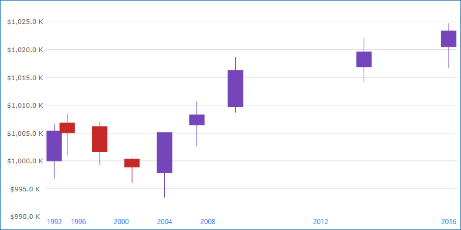
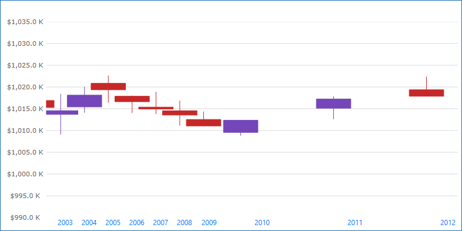
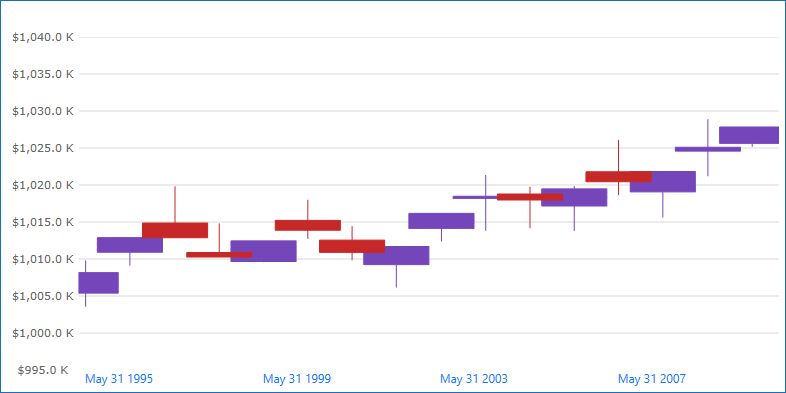
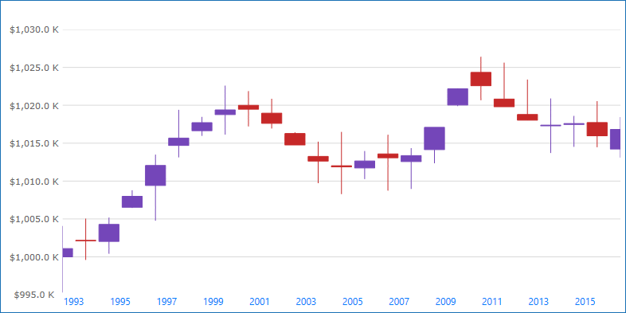

= TimeXAxis の使用

このトピックは、コード例を示して、TimeXAxis を link:{DataChartLink}.{DataChartName}.html[{DataChartName}]™ コントロールで使用する方法を説明します。TimeXAxis を使用する利点は、データのズームで動的にラベル書式設定を変更できることです。また、軸ブレークを構成すると、範囲内の日付を除外できます。たとえば、週末を非表示できます。

トピックは以下のとおりです。

* <<Introduction,概要>>
* <<AxisBreakProperties,軸ブレークのプロパティ>>

注: 次のセクションは、デフォルトのラベル (書式設定および間隔) を変更する場合のみ必須です。

* <<AxisLabelFormatProperties,軸ラベル書式のプロパティ>>
* <<AxisIntervalProperties,軸間隔のプロパティ>>
* <<RelatedContent,関連コンテンツ>>

[[Introduction]]
== 概要

link:{DataChartLink}.timexaxis.html[TimeXAxis] を以下のシリーズと使用できます。

* link:datachart-category-series-overview.html[カテゴリ シリーズ]

* link:datachart-financial-indicators-overview.html[財務指標]

* link:datachart-series-financial-price-series-overview.html[財務シリーズ]  

特定のシリーズで必要となる軸タイプの詳細については、「link:datachart-series-requirements.html[シリーズ要件]」のトピックを参照してください。

.注:
[NOTE]
====
軸線にラベル表示するには、すべてのカテゴリ軸にデータ バインディングおよびデータ マッピングが必要です。カテゴリにデータをバインドする方法については、「link:datachart-getting-started-with-datachart.html[データ チャートを使用した作業の開始]」トピックのコード例を参照してください。
====

図 1: link:{DataChartLink}.timexaxis.html[TimeXAxis] の実装例

[[AxisBreakProperties]]
== 軸ブレーク

link:{DataChartLink}.timexaxis.html[TimeXAxis] で link:{DataChartLink}.timexaxis{ApiProp}breaks.html[Breaks] を使用してデータの間隔を除外するオプションがあります。その結果として、ラベルは除外された間隔で表示されません。たとえば、稼動日/非稼動日、休日、または週末。

link:{DataChartLink}.timeaxisbreak.html[TimeAxisBreak] のインスタンスを link:{DataChartLink}.timexaxis{ApiProp}breaks.html[Breaks] プロパティに追加し、一意の link:{DataChartLink}.timeaxisbreak{ApiProp}Start.html[Start]、link:{DataChartLink}.timeaxisbreak{ApiProp}End.html[End]、 および  link:{DataChartLink}.timeaxisbreak{ApiProp}Interval.html[Interval] プロパティを使用して構成できます。

以下のコード スニペットは、{DataChartName} で link:{DataChartLink}.timexaxis.html[TimeXAxis] に年範囲のラベルをスキップする方法を紹介します。間隔は不均一に表示されます。この結果は、以下の図 2 に示されます。

図 2: 2010 年の月曜日～金曜日のデータを表示する link:{DataChartLink}.timexaxis.html[TimeXAxis]。

ifdef::xaml[]

*XAML の場合:*
[source,xaml]
----
<ig:XamDataChart x:Name="DataChart" >
    <ig:XamDataChart.Axes>
        <ig:TimeXAxis x:Name="xAxis" ItemsSource="{StaticResource data}" DateTimeMemberPath="Date" >
            <ig:TimeXAxis.Breaks>
                <ig:TimeAxisBreak 
                        Start="2009-12-26T00:00:00"
                        End="2009-12-27T23:59:59.99"
                        Interval="7:00:00:00.00"/>
            </ig:TimeXAxis.Breaks>    
        </ig:TimeXAxis>
    </ig:XamDataChart.Axes>
</ig:XamDataChart>
----

endif::xaml[]

ifdef::wpf,win-forms[]

*Visual Basic の場合:*

----
Dim axisBreaks = xAxis.Breaks

axisBreaks.Add(New TimeAxisBreak() With { _
	.Start = New DateTime(2009, 12, 26, 0, 0, 0), _
	.End = New DateTime(2009, 12, 27, 23, 59, 59), _
	.Interval = New TimeSpan(7, 0, 0, 0, 0)
})
----

*C# の場合:*
[source,csharp]
----
var axisBreaks = xAxis.Breaks;

axisBreaks.Add(new TimeAxisBreak 
{ 
    Start = new DateTime(2009, 12, 26, 00, 00, 00), 
    End = new DateTime(2009, 07, 12, 27, 59, 59),
	Interval = new TimeSpan(7, 0, 0, 0, 0)
});
----

endif::wpf,win-forms[]

[[AxisLabelFormatProperties]]
== 軸ラベル書式のプロパティ

link:{DataChartLink}.timexaxis.html[TimeXAxis] の link:{DataChartLink}.timexaxis{ApiProp}labelformats.html[LabelFormats] プロパティは link:{DataChartLink}.timeaxislabelformat.html[TimeAxisLabelFormat] 型のコレクションです。コレクションに追加された各 link:{DataChartLink}.timeaxislabelformat.html[TimeAxisLabelFormat] は一意の link:{DataChartLink}.timeaxislabelformat{ApiProp}format.html[Format] および link:{DataChartLink}.timeaxislabelformat{ApiProp}range.html[Range] を割り当てます。データを年からミリ秒にドリルダウンする際にチャートで表示される時間範囲に基づいてラベルが更新されます。

[options="header", cols="a,a,a"]
|====
|名前
|タイプ
|説明

|link:{DataChartLink}.timeaxislabelformat{ApiProp}format.html[TimeAxisLabelFormat.Format]
|`string`
|表示範囲に使用する書式を指定します。

|link:{DataChartLink}.timeaxislabelformat{ApiProp}range.html[TimeAxisLabelFormat.Range]
|`TimeSpan`
|軸ラベル書式を他の書式へ変更するための表示範囲を指定します。たとえば、範囲が 10 日間および 5 時間に設定された 2 つの link:{DataChartLink}.timeaxislabelformat.html[TimeAxisLabelFormat] がある場合、軸の表示範囲が 10 日間より短くなると 5 時間書式に変更されます。
|====

.注:
[NOTE]
====
表示範囲は軸ブレークによって削除される日付を除外して軸で表示されている日付に基づいて決定されます。
====

以下はビューで時間の範囲に基づいたラベル書式の一般的な例です。

1. 1825 日以上 (5 年間) の書式設定は "yyyy" になります。
2. 365 日以上 (1 年間) の書式設定は "MMM yy" になります。
3. 1 日以上の書式設定は "MMM dd" になります。
4. 5 時間以上の書式設定は "hh:mm" になります。
5. 5 時間以下の書式は "hh:mm:ss" になります。

図 3: "hh:mm:ss" のカスタム link:{DataChartLink}.timeaxislabelformat.html[TimeAxisLabelFormat] を持つ {DataChartName} コントロール

ifdef::wpf[]

*XAML の場合:*
[source,xaml]
----
<ig:{DataChartName} x:Name="DataChart" >
    <ig:{DataChartName}.Axes>
       <ig:TimeXAxis x:Name="xAxis" ItemsSource="{StaticResource data}" DateTimeMemberPath="Date" >
            <ig:TimeXAxis.LabelFormats>
                    <ig:TimeAxisLabelFormat     
                        Format="hh:mm:ss" 
                        Range="0.00:00:00"/>
                    <ig:TimeAxisLabelFormat
                        Format="hh:mm"
                        Range="0.05:00:00"/>
                    <ig:TimeAxisLabelFormat
                        Format="MMM dd"
                        Range="1.00:00:00" />
                    <ig:TimeAxisLabelFormat
                        Format="MMM yy"
                        Range="365.0:00:00" />
                    <ig:TimeAxisLabelFormat
                        Format="yyyy"
                        Range="1825.0:00:00" />
            </ig:TimeXAxis.LabelFormats>
        </ig:TimeXAxis>
    </ig:{DataChartName}.Axes>
</ig:{DataChartName}>
----
endif::wpf[]

ifdef::wpf,win-forms[]
*Visual Basic の場合:*
[source,vb]
----
Dim DataChart = New {DataChartName}()
Dim timeXAxis = New TimeXAxis()
DataChart.Axes.Add(timeXAxis)

Dim axisFormat = xAxis.LabelFormats
axisFormat.Add(New TimeAxisLabelFormat() With { _
	.Format = "hh:mm:ss", _
	.Range = New TimeSpan(0, 0, 0, 0, 0) _
})

axisFormat.Add(New TimeAxisLabelFormat() With { _
	.Format = "hh:mm", _
	.Range = New TimeSpan(0, 5, 0, 0, 0) _
})

axisFormat.Add(New TimeAxisLabelFormat() With { _
	.Format = "MMM dd", _
	.Range = New TimeSpan(1, 0, 0, 0, 0) _
})

axisFormat.Add(New TimeAxisLabelFormat() With { _
	.Format = "MMM yy", _
	.Range = New TimeSpan(365, 0, 0, 0, 0) _
})

axisFormat.Add(New TimeAxisLabelFormat() With { _
	.Format = "yyyy", _
	.Range = New TimeSpan(1825, 0, 0, 0, 0) _
})

----

*C# の場合:*
[source,csharp]
----
var DataChart = new {DataChartName}();
var timeXAxis = new TimeXAxis();
DataChart.Axes.Add(timeXAxis);

var axisFormat = xAxis.LabelFormats;

axisFormat.Add(new TimeAxisLabelFormat 
{ 
    Format = "hh:mm:ss", 
    Range = new TimeSpan(0, 0, 0, 0, 0)  
});

axisFormat.Add(new TimeAxisLabelFormat 
{ 
    Format = "hh:mm", 
    Range = new TimeSpan(0, 5, 0, 0, 0) 
});

axisFormat.Add(new TimeAxisLabelFormat 
{ 
    Format = "MMM dd", 
    Range = new TimeSpan(1, 0, 0, 0, 0) 
});

axisFormat.Add(new TimeAxisLabelFormat 
{ 
    Format = "MMM yy", 
    Range = new TimeSpan(365, 0, 0, 0, 0) 
});

axisFormat.Add(new TimeAxisLabelFormat 
{ 
    Format = "yyyy",
    Range = new TimeSpan(1825, 0, 0, 0, 0) 
});
----

endif::wpf,win-forms[]

[[AxisIntervalProperties]]
== 軸間隔のプロパティ

link:{DataChartLink}.timexaxis.html[TimeXAxis] は、規格の link:{DataChartLink}.numericaxisbase{ApiProp}interval.html[Interval] プロパティを link:{DataChartLink}.timeaxisinterval.html[TimeAxisInterval] 型の link:{DataChartLink}.numericaxisbase{ApiProp}interval.html[Intervals] コレクションと変換します。コレクションに追加された各 link:{DataChartLink}.timeaxisinterval.html[TimeAxisInterval] は一意の link:{DataChartLink}.TimeAxisInterval{ApiProp}Interval.html[Interval]、link:{DataChartLink}.TimeAxisInterval{ApiProp}Range.html[Range]、 および link:{DataChartLink}.TimeAxisInterval{ApiProp}Range.html[IntervalType] を割り当てます。データを年からミリ秒にドリルダウンする際にチャートで表示される時間範囲に基づいてラベル間のスペースが更新されます。

[options="header", cols="a,a,a"]
|====
|名前
|タイプ
|説明

|link:{DataChartLink}.TimeAxisInterval{ApiProp}Interval.html[TimeAxisInterval.Interval]
|`double`
|使用する間隔を指定します。これは link:{DataChartLink}.TimeAxisInterval{ApiProp}Range.html[IntervalType] プロパティに関連付けられます。link:{DataChartLink}.TimeAxisInterval{ApiProp}Range.html[IntervalType] を `Days` に設定した場合、link:{DataChartLink}.TimeAxisInterval{ApiProp}Interval.html[Interval] に指定される数値も日単位になります。

|link:{DataChartLink}.TimeAxisInterval{ApiProp}Range.html[TimeAxisInterval.Range]
|`TimeSpan`
|軸間隔を他の間隔に変更するための表示範囲を指定します。たとえば、範囲が 10 日間および 5 時間に設定された 2 つの link:{DataChartLink}.TimeAxisInterval.html[TimeAxisInterval] がある場合、軸の表示範囲が 10 日間より短くなる際に 5 時間範囲の間隔に変更します。

|link:{DataChartLink}.TimeAxisInterval{ApiProp}Range.html[TimeAxisInterval.IntervalType]
|link:{DataChartLink}.TimeAxisIntervalType.html[TimeAxisIntervalType]
|この間隔の時間単位を指定します。
|====

.注:
[NOTE]
====
表示範囲は軸ブレークによって削除される日付を除外して軸で表示されている日付に基づいて決定されます。
====

以下の画像およびコード スニペットは、{DataChartName} コントロールで複数の link:{DataChartLink}.timeaxisinterval.html[TimeAxisInterval] を実装する方法を紹介します。

図 4: 12 日の link:{DataChartLink}.TimeAxisInterval{ApiProp}Interval.html[Interval] を持つ link:{DataChartLink}.timeaxisinterval.html[TimeAxisInterval] を使用する link:{DataChartLink}.timexaxis.html[TimeXAxis]。

ifdef::xaml[]

*XAML の場合:*
[source,xaml]
----
<ig:{DataChartName} x:Name="DataChart" >
    <ig:{DataChartName}.Axes>
       <ig:TimeXAxis x:Name="xAxis" ItemsSource="{StaticResource data}" DateTimeMemberPath="Date" >
           <ig:TimeXAxis.Intervals>
              <ig:TimeAxisInterval
                  Range="0.00:00:00"
                  Interval="36" 
                  IntervalType="Seconds" />
              <ig:TimeAxisInterval
                  Range="0.00:30:00" 
                  Interval="5"
                  IntervalType="Minutes" />
              <ig:TimeAxisInterval
                  Range="0.05:00:00" 
                  Interval="1" 
                  IntervalType="Hours" />
              <ig:TimeAxisInterval
                  Range="1.00:00:00"
                  Interval="12" 
                  IntervalType="Days" />
              <ig:TimeAxisInterval
                  Range="365.00:00:00"
                  Interval="1"
                  IntervalType="Months" />
              <ig:TimeAxisInterval
                  Range="1825.0:00:00"
                  Interval="1"
                  IntervalType="Years" />
            </ig:TimeXAxis.Intervals> 
        </ig:TimeXAxis>
    </ig:{DataChartName}.Axes>
</ig:{DataChartName}>
----

endif::xaml[]

ifdef::wpf,win-forms[]

*Visual Basic の場合:*
[source,vb]
----
Dim axisIntervals = xAxis.Intervals

axisIntervals.Add(New TimeAxisInterval() With { _
	.IntervalType = TimeAxisIntervalType.Seconds, _
	.Interval = 36, _
	.Range = New TimeSpan(0, 0, 0, 0, 0) _
})

axisIntervals.Add(New TimeAxisInterval() With { _
	.IntervalType = TimeAxisIntervalType.Minutes, _
	.Interval = 6, _
	.Range = New TimeSpan(0, 0, 30, 0, 0) _
})

axisIntervals.Add(New TimeAxisInterval() With { _
	.IntervalType = TimeAxisIntervalType.Hours, _
	.Interval = 1, _
	.Range = New TimeSpan(0, 5, 0, 0, 0) _
})

axisIntervals.Add(New TimeAxisInterval() With { _
	.IntervalType = TimeAxisIntervalType.Days, _
	.Interval = 12, _
	.Range = New TimeSpan(1, 0, 0, 0, 0) _
})

axisIntervals.Add(New TimeAxisInterval() With { _
	.IntervalType = TimeAxisIntervalType.Months, _
	.Interval = 1, _
	.Range = New TimeSpan(365, 0, 0, 0, 0) _
})

axisIntervals.Add(New TimeAxisInterval() With { _
	.IntervalType = TimeAxisIntervalType.Years, _
	.Interval = 2, _
	.Range = New TimeSpan(1825, 0, 0, 0, 0) _
})
----

*C# の場合:*
[source,csharp]
----
var axisIntervals = xAxis.Intervals;

axisIntervals.Add(new TimeAxisInterval 
{ 
    IntervalType = TimeAxisIntervalType.Seconds,
    Interval = 36, 
    Range = new TimeSpan(0, 0, 0, 0, 0) 
});
    
axisIntervals.Add(new TimeAxisInterval 
{ 
    IntervalType = TimeAxisIntervalType.Minutes,
    Interval = 6, 
    Range = new TimeSpan(0, 0, 30, 0, 0) 
});

axisIntervals.Add(new TimeAxisInterval 
{ 
    IntervalType = TimeAxisIntervalType.Hours,   
    Interval = 1, 
    Range = new TimeSpan(0, 5, 0, 0, 0) 
});

axisIntervals.Add(new TimeAxisInterval 
{ 
    IntervalType = TimeAxisIntervalType.Days,
    Interval = 12, 
    Range = new TimeSpan(1, 0, 0, 0, 0) 
});

axisIntervals.Add(new TimeAxisInterval 
{ 
    IntervalType = TimeAxisIntervalType.Months,
    Interval = 1, 
    Range = new TimeSpan(365, 0, 0, 0, 0) 
});

axisIntervals.Add(new TimeAxisInterval 
{ 
    IntervalType = TimeAxisIntervalType.Years,
    Interval = 2, 
    Range = new TimeSpan(1825, 0, 0, 0, 0) 
});
----

endif::wpf,win-forms[]

[[RelatedContent]]
== 関連コンテンツ

* link:datachart-series-requirements.html[シリーズ要件]
* link:datachart-radial-series-overview.html[ラジアル シリーズ]