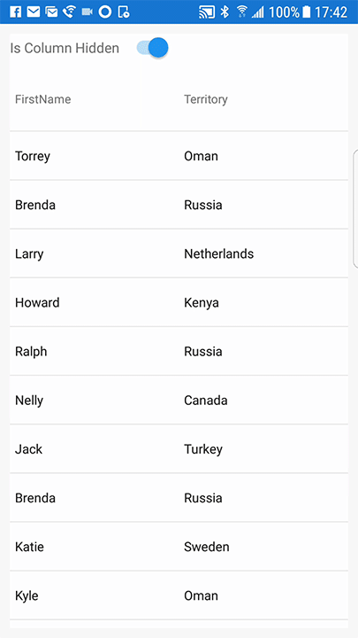

////

|metadata|
{
    "name": "datagrid-animation",
    "controlName": ["{DataGridName}"],
    "tags": [],
    "guid": "d610a8d2-68f0-4f96-9e6a-3121a8bf743d",  
    "buildFlags": [],
    "createdOn": "2016-02-05T19:10:27.5445551Z"
}
|metadata|
////

= アニメーション

このトピックでは、link:{DataGridLink}.{DataGridName}.html[{DataGridName}] コントロールを使用して列または行を操作するときに実装できるアニメーションの使用方法を分かりやすく説明し、理解を深めることができるようにします。

=== 概要

このトピックには、以下のセクションがあります。

* <<_Ref437875354,概要>>
* <<_Ref437875377,アニメーション プリセット>>
* <<_Ref437519563,アニメーション プリセットの適用>>
* <<_Ref437519564,アニメーション プリセットのカスタマイズ>>
** <<AnimationPhases,アニメーション フェーズ>> 
** <<CustomizationSettings,カスタマイズ設定>> 
** <<CustomizationSteps,カスタマイズ手順>> 
* <<_Ref437875510,プリフェーズ / メインフェーズ アニメーションの例>>
* <<_Ref437875518,メインフェーズ / ポストフェーズ アニメーションの例>>
* <<RelatedTopics,関連トピック>>

[[_Ref437875354]]
== 概要

{DataGridName} コントロールに、列選択、セル描画、および列操作の各タイプでアニメーションを実装できるアニメーション プリセットを適用できます。列操作の詳細については、「 link:datagrid-working-with-columns.html[列の作業]」のトピックを参照してください。

アニメーション プリセットは、{DataGridName} から公開される pick:[android="set"]<OperationName>AnimationMode pick:[android="メソッド"]pick:[xaml="プロパティ"]を使用して実装できます。アニメーション プリセットに加えて、カスタマイズしたアニメーションを作成することも可能です。詳細は、このトピックの<<_Ref437519564,「アニメーション プリセットのカスタマイズ」>>を参照してください。

[[_Ref437875377]]
== アニメーション プリセット

次の表に、{DataGridName} 操作とこれらに関連付けられたアニメーション プリセット セッター メソッド、およびこれらとともに使用できるアニメーション プリセットを示します。

[options="header", cols="a,a,a"]
|====
|*グリッド操作:*|*{ApiMember}:*|*アニメーション プリセット:*

|行の選択
| link:{DataGridLink}.{DataGridName}{ApiProp}rowselectionanimationmode.html[pick:[android="set"]RowSelectionAnimationMode]
|
* link:{DataGridLink}.RowSelectionAnimationMode.html[Auto] 
* link:{DataGridLink}.RowSelectionAnimationMode.html[None] 
* link:{DataGridLink}.RowSelectionAnimationMode.html[ColorBlend] 

|列移動
| link:{DataGridLink}.{DataGridName}{ApiProp}columnmovinganimationmode.html[pick:[android="set"]ColumnMovingAnimationMode]
|
* link:{DataGridLink}.ColumnMovingAnimationMode.html[Auto] 
* link:{DataGridLink}.ColumnMovingAnimationMode.html[None] 
* link:{DataGridLink}.ColumnMovingAnimationMode.html[SlideOver] 

|列表示
| link:{DataGridLink}.{DataGridName}{ApiProp}columnshowinganimationmode.html[pick:[android="set"]ColumnShowingAnimationMode]
|
* link:{DataGridLink}.ColumnShowingAnimationMode.html[Auto] 
* link:{DataGridLink}.ColumnShowingAnimationMode.html[None] 
* link:{DataGridLink}.ColumnShowingAnimationMode.html[FadeIn] 
* link:{DataGridLink}.ColumnShowingAnimationMode.html[SlideFromLeft] 
* link:{DataGridLink}.ColumnShowingAnimationMode.html[SlideFromRight]  
* link:{DataGridLink}.ColumnShowingAnimationMode.html[SlideFromTop] 
* link:{DataGridLink}.ColumnShowingAnimationMode.html[SlideFromBottom]  
* link:{DataGridLink}.ColumnShowingAnimationMode.html[SlideFromLeftAndFadeIn] 
* link:{DataGridLink}.ColumnShowingAnimationMode.html[SlideFromRightAndFadeIn]  
* link:{DataGridLink}.ColumnShowingAnimationMode.html[SlideFromTopAndFadeIn] 
* link:{DataGridLink}.ColumnShowingAnimationMode.html[SlideFromBottomAndFadeIn]  

|列の非表示
| link:{DataGridLink}.{DataGridName}{ApiProp}columnhidinganimationmode.html[pick:[android="set"]ColumnHidingAnimationMode]
|
* link:{DataGridLink}.ColumnHidingAnimationMode.html[Auto] 
* link:{DataGridLink}.ColumnHidingAnimationMode.html[None] 
* link:{DataGridLink}.ColumnHidingAnimationMode.html[FadeOut] 
* link:{DataGridLink}.ColumnHidingAnimationMode.html[SlideToLeft]  
* link:{DataGridLink}.ColumnHidingAnimationMode.html[SlideToRight]  
* link:{DataGridLink}.ColumnHidingAnimationMode.html[SlideToTop]  
* link:{DataGridLink}.ColumnHidingAnimationMode.html[SlideToBottom]  
* link:{DataGridLink}.ColumnHidingAnimationMode.html[SlideToLeftAndFadeOut]  
* link:{DataGridLink}.ColumnHidingAnimationMode.html[SlideToRightAndFadeOut]  
* link:{DataGridLink}.ColumnHidingAnimationMode.html[SlideToTopAndFadeOut]  
* link:{DataGridLink}.ColumnHidingAnimationMode.html[SlideToBottomAndFadeOut]  

|列の追加
| link:{DataGridLink}.{DataGridName}{ApiProp}columnaddinganimationmode.html[pick:[android="set"]ColumnAddingAnimationMode]
|
* link:{DataGridLink}.{DataGridName}{ApiProp}ColumnAddingAnimationMode.html[Auto] 
* link:{DataGridLink}.{DataGridName}{ApiProp}ColumnAddingAnimationMode.html[None] 
* link:{DataGridLink}.{DataGridName}{ApiProp}ColumnAddingAnimationMode.html[FadeIn] 
* link:{DataGridLink}.{DataGridName}{ApiProp}ColumnAddingAnimationMode.html[SlideFromLeft] 
* link:{DataGridLink}.{DataGridName}{ApiProp}ColumnAddingAnimationMode.html[SlideFromRight]  
* link:{DataGridLink}.{DataGridName}{ApiProp}ColumnAddingAnimationMode.html[SlideFromTop] 
* link:{DataGridLink}.{DataGridName}{ApiProp}ColumnAddingAnimationMode.html[SlideFromBottom]  
* link:{DataGridLink}.{DataGridName}{ApiProp}ColumnAddingAnimationMode.html[SlideFromLeftAndFadeIn] 
* link:{DataGridLink}.{DataGridName}{ApiProp}ColumnAddingAnimationMode.html[SlideFromRightAndFadeIn]  
* link:{DataGridLink}.{DataGridName}{ApiProp}ColumnAddingAnimationMode.html[SlideFromTopAndFadeIn] 
* link:{DataGridLink}.{DataGridName}{ApiProp}ColumnAddingAnimationMode.html[SlideFromBottomAndFadeIn] 

|列のプロパティ更新
| link:{DataGridLink}.{DataGridName}{ApiProp}columnpropertyupdatinganimationmode.html[pick:[android="set"]ColumnPropertyUpdatingAnimationMode]
|
* link:{DataGridLink}.ColumnPropertyUpdatingAnimationMode.html[Auto] 
* link:{DataGridLink}.ColumnPropertyUpdatingAnimationMode.html[None] 
* link:{DataGridLink}.ColumnPropertyUpdatingAnimationMode.html[Interpolate] 
* link:{DataGridLink}.ColumnPropertyUpdatingAnimationMode.html[InterpolateDeep] 

|====

[[_Ref437519563]]
== アニメーション プリセットの適用

次の例では、列を非表示にする場合にプリセット アニメーションを適用する方法を説明し、実際に使用されるアプリケーションのコンテキストを示します。この例では、チェックボックスを使用して列の表示状態を切り替え、結果のアニメーションを確認します。例の最初の部分では、サンプルの設定方法を順を追って説明します。

[start=1]
. FirstName、Sales、および Territory データの列を手動で定義して、{DataGridName} コントロールのインスタンスを作成します。

salesColumn オブジェクトから直接公開された link:{DataGridLink}.column{ApiProp}ishidden.html[pick:[android="set"]IsHidden()] メソッドにアクセスする必要があるため、手動でこれらの列を定義することが必要です。詳細は、「link:datagrid-working-with-columns.html#_Ref435537803[列の作業]」のトピックを参照してください。

link:{DataGridLink}.{DataGridName}{ApiProp}AutoGenerateColumns.html[pick:[android="set"]AutoGenerateColumns] を false に設定すると、{DataGridName} コントロールは DataSource が設定された後に自動的に列を作成しません。

ifdef::android[]
*Java の場合:*
[source, js]
----
TextColumn nameColumn = new TextColumn();
nameColumn.setKey("FirstName");
TextColumn territoryColumn = new TextColumn();
territoryColumn.setKey("Territory");
NumericColumn salesColumn = new NumericColumn();
salesColumn.setKey("Sales");

DataGridView DataGrid = new DataGridView(this);
DataGrid.setAutoGenerateColumns(false);
DataGrid.setDataSource(new SampleSalesTeam()); 
DataGrid.addColumn(nameColumn);
DataGrid.addColumn(territoryColumn);
DataGrid.addColumn(salesColumn);
----
endif::android[]

ifdef::xamarin[]
*XAML の場合:*
[source, xaml]
----
<ig:XamDataGrid x:Name="DataGrid" AutoGenerateColumns="False">
    <ig:XamDataGrid.ItemsSource>
        <data:SampleSalesTeam />
    </ig:XamDataGrid.ItemsSource> 
	<ig:XamDataGrid.Columns>  
		<ig:TextColumn PropertyPath="FirstName" /> 
        <ig:TextColumn PropertyPath="Territory" /> 
        <ig:NumericColumn PropertyPath="Sales" /> 
	</ig:XamDataGrid.Columns>   
</ig:XamDataGrid>	
----

*C# の場合:*
[source, csharp]
----
var column0 = new TextColumn();
column0.PropertyPath = "FirstName";
var column1 = new TextColumn();
column1.PropertyPath = "Territory";
var column2 = new NumericColumn();
column2.PropertyPath = "Sales";

var DataGrid = new XamDataGrid();
DataGrid.Columns.Add(column0);
DataGrid.Columns.Add(column1);
DataGrid.Columns.Add(column2);
DataGrid.AutoGenerateColumns = false;
DataGrid.ItemsSource = new SampleSalesTeam();
----
endif::xamarin[]

[start=2]
. 列がデータ グリッドで非表示になっているときに使用するアニメーション プリセットを適用します。

ifdef::android[]
*Java の場合:*

[source,js]
----
DataGrid.setColumnHidingAnimationMode(ColumnHidingAnimationMode.FADE_OUT);
----
endif::android[]

ifdef::xamarin[]
*XAML の場合:*

[source,xaml]
----
<ig:XamDataGrid x:Name="DataGrid" ColumnHidingAnimationMode="FadeOut"> 
...
</ig:XamDataGrid>
----

*C# の場合:*

[source,csharp]
----
DataGrid.ColumnHidingAnimationMode = ColumnHidingAnimationMode.FadeOut;
----
endif::xamarin[]

[start=3]
. データ グリッド内の列を非表示にするコントロールのインスタンスを作成します。たとえば、以下のコードで示すように、pick:[android="`Checkbox`"]pick:[xamarin="`Switch`"] コントロールを使用し、その pick:[android="`CheckedChanged`"]pick:[xamarin="`Toggled`"] イベントを処理できます。

ifdef::android[]
*Java の場合:*

[source,js]
----
CheckBox checkBox = new CheckBox(this);
checkBox.setChecked(false);
checkBox.setText("Is Column Hidden");
checkBox.setOnCheckedChangeListener(new CompoundButton.OnCheckedChangeListener() 
{
    @Override public void onCheckedChanged(CompoundButton buttonView, boolean isChecked)
    {
        salesColumn.setIsHidden(isChecked);
    }
});
----
endif::android[]

ifdef::xamarin[]
[start=4]
. 次のコードで示すように、この例では、Switch を使用して Sales 列の表示状態を切り替えています。 

*XAML の場合:*

[source,xaml]
----
 <StackLayout Orientation="Horizontal">
    <Label Text="Is Column Hidden"/>
    <Switch IsToggled="False" Toggled="Switch_Toggled"/>
</StackLayout>
----

*C# の場合:*

[source,csharp]
----
var AnimationSwitch = new Switch();
AnimationSwitch.IsToggled = false;
AnimationSwitch.Toggled += Switch_Toggled;
...
private void Switch_Toggled(object sender, ToggledEventArgs e)
{
    DataGrid.Columns[2].IsHidden = e.Value;
}
----
endif::xamarin[]

ifdef::xamarin[]
[start=5]
. アプリケーションを実行して、結果を確認します。 
endif::xamarin[]

ifdef::android[]
[start=4]
. アプリケーションを実行して、結果を確認します。 
endif::android[]

次のアニメーション グラフィックスは、{DataGridName} コントロールでの Sales 列の非表示を示しています。列非表示のアニメーションは、Sales 列を非表示の状態にするメインフェーズで始まります。Sales 列の要素は、列内で上から下へ順に透明になります。その後のポストフェーズで残りの列は、表示されていた Sales 列によって占有されていた非占有領域を適切に使用するように再分配されます。

image::images/Animating_DataGridView_Operations_1.gif[]

[[_Ref437519564]]
== アニメーション プリセットのカスタマイズ

[[AnimationPhases]]
==== アニメーション フェーズ

アニメーションは、実行される列操作によって、1 つまたは 2 つのフェーズで構成されます。次の表に、すべての列操作と関連付られたアニメーション フェーズを示します。

[options="header", cols="a,a,a,a"]
|====
|*グリッド操作*|*プリフェーズ*|*メイン フェーズ*|*ポスト フェーズ*

|列交換
|なし
|link:{DataGridLink}.gridcolumnanimationsettings{ApiProp}ColumnExchangingMainPhase.html[pick:[android="set"]ColumnExchangingMainPhase]
|link:{DataGridLink}.gridcolumnanimationsettings{ApiProp}ColumnExchangingCleanupPhase.html[pick:[android="set"]ColumnExchangingCleanupPhase]

|列の非表示
|なし
|link:{DataGridLink}.gridcolumnanimationsettings{ApiProp}ColumnHidingMainPhase.html[pick:[android="set"]ColumnHidingMainPhase]
|link:{DataGridLink}.gridcolumnanimationsettings{ApiProp}ColumnHidingPostPhase.html[pick:[android="set"]ColumnHidingPostPhase]

|列表示
|link:{DataGridLink}.gridcolumnanimationsettings{ApiProp}ColumnShowingPrePhase.html[pick:[android="set"]ColumnShowingPrePhase]
|link:{DataGridLink}.gridcolumnanimationsettings{ApiProp}ColumnShowingMainPhase.html[pick:[android="set"]ColumnShowingMainPhase]
|なし

|列の追加
|link:{DataGridLink}.gridcolumnanimationsettings{ApiProp}ColumnAddingPrePhase.html[pick:[android="set"]ColumnAddingPrePhase]
|link:{DataGridLink}.gridcolumnanimationsettings{ApiProp}ColumnAddingMainPhase.html[pick:[android="set"]ColumnAddingMainPhase]
|なし

|列移動
|link:{DataGridLink}.gridcolumnanimationsettings{ApiProp}ColumnMovingPrePhase.html[pick:[android="set"]ColumnMovingPrePhase]
|link:{DataGridLink}.gridcolumnanimationsettings{ApiProp}ColumnMovingMainPhase.html[pick:[android="set"]ColumnMovingMainPhase]
|なし

|列のプロパティ更新
|なし
|link:{DataGridLink}.gridcolumnanimationsettings{ApiProp}ColumnPropertyUpdatingMainPhase.html[pick:[android="set"]ColumnPropertyUpdatingMainPhase]
|なし

|====

[NOTE]
====
*注意:* `ColumnExchanging` 操作と `ColumnPropertyUpdating` 操作には、他の操作とは名前のみが少し異なるフェーズがあります。`ColumnExchanging` にはポストフェーズと同等の「link:{DataGridLink}.gridcolumnanimationsettings{ApiProp}ColumnExchangingCleanupPhase.html[pick:[android="set"]ColumnExchangingCleanupPhase]」があります。`ColumnPropertyUpdating` には単一のメインフェーズがあり、単に「link:{DataGridLink}.gridcolumnanimationsettings{ApiProp}ColumnPropertyUpdatingMainPhase.html[pick:[android="set"]ColumnPropertyUpdatingMainPhase]」と呼ばれます。
====

次の使用可能な 3 つのアニメーション フェーズがあります。

* メインフェーズは、列操作の最初のアニメーションを制御します（列の外観が速やかに変化します。通常は、ビューに表示、またはビューからの非表示です)。
* プリフェーズには、関連付けられた列がビュー内に移行する前に開始されるアニメーションが含まれます。たとえば、列の追加では、既存の列が移動して、新しい列を表示するスペースが作られます。
* ポストフェーズは、ビューから列を削除する列操作に使用されます。たとえば、列を非表示にする場合に、列が削除された後、残りの列が再配置されて、新しく使用可能になったスペース（非表示になった列が以前占有していた場所）を埋める操作などです。

[[CustomizationSettings]]
==== カスタマイズ設定

次の表では、link:{DataGridLink}.gridcolumnanimationsettings.html[GridAnimationPhaseSettings] タイプで提供される重要な設定について説明します。

[options="header", cols="a,a"]
|====
|*設定*|*説明*

|link:{DataGridLink}.gridanimationphasesettings{ApiProp}EasingFunctionType.html[pick:[android="set"]EasingFunctionType] 
| アニメーションの加速度に数学的演算を定義できます。これは、アニメーション フェーズのスタイルを設定する場合に役立ちます。
 
|link:{DataGridLink}.gridanimationphasesettings{ApiProp}DurationMilliseconds.html[pick:[android="set"]DurationMilliseconds] 
| アニメーションのメインフェーズの合計時間を定義できます。これは、指定した時間内にフェーズを実行して、アニメーション内のフェーズを編成する柔軟性を提供します。

|link:{DataGridLink}.gridanimationphasesettings{ApiProp}HoldInitialMilliseconds.html[pick:[android="set"]HoldInitialMilliseconds] 
| フェーズの遅延時間を定義できます。これにより、アニメーションのプレフェーズの終了からメインフェーズの開始までの期間をカスタマイズできるため、確認が容易になります。
  
|====

[[CustomizationSteps]]
==== カスタマイズ手順

カスタム アニメーションの実装プロセスは、次の手順で実行します。

[start=1]
. link:{DataGridLink}.gridcolumnanimationsettings.html[GridColumnAnimationSettings] クラスのインスタンスを作成します。このオブジェクトは、各 link:{DataGridLink}.gridcolumnanimationsettings.html[GridAnimationPhaseSettings] オブジェクトのカスタマイズ済みパラメーターを、使用する列操作フェーズに関連付けます。
[start=2]
. link:{DataGridLink}.gridcolumnanimationsettings.html[GridAnimationPhaseSettings] クラスを作成して、`GridAnimationPhaseSettings` オブジェクトのフェーズごとに 1 つカスタマイズします。1 つまたはすべて（使用する場合）のアニメーション フェーズをカスタマイズできますが、カスタマイズするフェーズごとに `GridAnimationPhaseSettings` オブジェクトを 1 つ作成する必要があります。このオブジェクトには、関連付けられたフェーズのカスタマイズ済みパラメーターを格納します。明示的にカスタマイズしなかったフェーズは、アニメーション プリセットで確認したように、デフォルトの動作が維持されます。
[start=3]
. 公開されたアニメーション pick:[android="メソッド"]pick:[xaml="プロパティ"]を使用して、`GridAnimationPhaseSettings` オブジェクトの値をカスタマイズします。明示的に変更しなかった値は、アニメーション フェーズで確認したように、デフォルトの値が維持されます。
[start=4]
. 各 `GridAnimationPhaseSettings` オブジェクトを、`GridColumnAnimationSettings` オブジェクトの目的の列操作フェーズに割り当てます。

[start=5]
. link:{DataGridLink}.{DataGridName}{ApiProp}ColumnAnimationSettings.html[pick:[android="set"]ColumnAnimationSettings] {ApiMember} を使用して、`{DataGridName}` コントロールに `GridColumnAnimationSettings` オブジェクトを割り当てます。

アニメーションのプリフェーズ / メインフェーズは、要素がビューに移行すると発生します。プリフェーズのアニメーションは、たとえば、列の追加や列の表示など、列をビュー内に表示する操作に関連付られています。プリフェーズの間、列がビュー内に表示される前は、既存の列の再配置やサイズの再設定などにより、新しい列が配置されるスペースを作ります。このシナリオのメインフェーズは、通常プリフェーズが開始された後のいずれかの時点で開始され（次の例で示すように、遅延を実装した場合）、具体的には列を非表示の状態から表示状態に遷移させます。

以下の例は、アニメーション フェーズをカスタマイズする方法を示しています。

[[_Ref437875510]]
== プリフェーズ / メインフェーズ アニメーションの例

この例では、プリフェーズ / メインフェーズで構成されるアニメーションのシナリオについて、列の表示を例に説明します。

[start=1]
. FirstName、Sales、および Territory データの `Column` オブジェクトを手動で定義して、`{DataGridName}` コントロールのインスタンスを作成します。この例では、Sales 列が非表示ですが、列表示アニメーションを使用して表示します。

ifdef::android[]
*Java の場合:*

[source,js]
----
TextColumn nameColumn = new TextColumn();
nameColumn.setKey("FirstName");
TextColumn territoryColumn = new TextColumn();
territoryColumn.setKey("Territory");
final NumericColumn salesColumn = new NumericColumn();
salesColumn.setKey("Sales");
salesColumn.setIsHidden(true);

{DataGridName} DataGrid = new {DataGridName}(this);
DataGrid.setAutoGenerateColumns(false);
DataGrid.addColumn(nameColumn);
DataGrid.addColumn(territoryColumn);
DataGrid.addColumn(salesColumn); 
DataGrid.setDataSource(new SampleSalesTeam());
DataGrid.setColumnShowingAnimationMode(ColumnShowingAnimationMode.FADE_IN);
...
CheckBox checkBox = new CheckBox(this);
checkBox.setChecked(false);
checkBox.setText("Is Column Hidden");
checkBox.setOnCheckedChangeListener(new CompoundButton.OnCheckedChangeListener() {
 @Override public void onCheckedChanged(CompoundButton buttonView, boolean isChecked)
    {
      salesColumn.setIsHidden(!isChecked);
    }
});
----
endif::android[]

ifdef::xamarin[]
*XAML の場合:*

[source,xaml]
----
<Grid>
    <Grid.RowDefinitions>
        <RowDefinition Height="Auto"/>
        <RowDefinition Height="*"/>
    </Grid.RowDefinitions>
	
	<StackLayout Orientation="Vertical" Grid.Row="0">
        <Label Text="Is Column Hidden" />
        <Switch x:Name="AnimationSwitch" IsToggled="True"/>
    </StackLayout>
      
	<ig:XamDataGrid x:Name="DataGrid" Grid.Row="1"
                AutoGenerateColumns="False" 
                ColumnShowingAnimationMode="FadeIn">
		<ig:XamDataGrid.ItemsSource>
			<data:SampleSalesTeam />
		</ig:XamDataGrid.ItemsSource>
		<ig:XamDataGrid.Columns>  
			<ig:TextColumn PropertyPath="FirstName" />
			<ig:TextColumn PropertyPath="Territory" /> 
			<ig:NumericColumn PropertyPath="Sales" 
				IsHidden="{Binding Source={Reference AnimationSwitch}, Path=IsToggled}"/>
		</ig:XamDataGrid.Columns>    
		<!-- TODO add ColumnAnimationSettings -->	
	</ig:XamDataGrid>
</Grid>
----

*C# の場合:*
[source, csharp]
----
var column0 = new TextColumn();
column0.PropertyPath = "FirstName";
var column1 = new TextColumn();
column1.PropertyPath = "Territory";
var column2 = new NumericColumn();
column2.PropertyPath = "Sales";
column2.IsHidden = true;

DataGrid.Columns.Add(column0);
DataGrid.Columns.Add(column1);
DataGrid.Columns.Add(column2);
DataGrid.AutoGenerateColumns = false;
DataGrid.ItemsSource = new SampleSalesTeam();
DataGrid.ColumnShowingAnimationMode = ColumnShowingAnimationMode.FadeIn;
...
var AnimationSwitch = new Switch();
AnimationSwitch.IsToggled = true;
AnimationSwitch.Toggled += Switch_Toggled;
...
private void Switch_Toggled(object sender, ToggledEventArgs e)
{
    DataGrid.Columns[2].IsHidden = e.Value;
}
----
endif::xamarin[]

[start=2]
. 列表示アニメーションのプリフェーズおよびメインフェーズで使用する、カスタム パラメータを持つ link:{DataGridLink}.GridColumnAnimationSettings.html[GridColumnAnimationSettings] タイプのインスタンスを作成します。

ifdef::android[]
*Java の場合:*

[source,js]
----
GridAnimationPhaseSettings prePhase = new GridAnimationPhaseSettings();
prePhase.setEasingFunctionType(GridEasingFunctionType.CIRCLE_IN_OUT);
prePhase.setDurationMilliseconds(1000);

GridAnimationPhaseSettings mainPhase = new GridAnimationPhaseSettings();
mainPhase.setEasingFunctionType(GridEasingFunctionType.CIRCLE_IN_OUT);
mainPhase.setHoldInitialMilliseconds(1000);
mainPhase.setDurationMilliseconds(2000);

GridColumnAnimationSettings settings = new GridColumnAnimationSettings();
settings.setColumnShowingMainPhase(mainPhase);
settings.setColumnShowingPrePhase(prePhase);
...
DataGrid.setColumnAnimationSettings(settings);
----
endif::android[]

ifdef::xamarin[]
*XAML の場合:*

[source,xaml]
----
<ig.XamDataGrid.ColumnAnimationSettings>
    <ig:GridColumnAnimationSettings>
        <ig.GridColumnAnimationSettings.ColumnShowingPrePhase>
            <ig:GridAnimationPhaseSettings EasingFunctionType="CircleInOut" 
                                           DurationMillisecond="1000"/>
        </ig.GridColumnAnimationSettings.ColumnShowingPrePhase>
        <ig:GridColumnAnimationSettings.ColumnShowingMainPhase>
            <ig:GridAnimationPhaseSettings DurationMilliseconds="2000"
                                           HoldInitialMilliseconds="1000" />
        </ig:GridColumnAnimationSettings.ColumnShowingMainPhase>
    </ig:GridColumnAnimationSettings>
</ig.XamDataGrid.ColumnAnimationSettings>
----

*C# の場合:*

[source,csharp]
----
var settings = new GridColumnAnimationSettings();
settings.ColumnShowingPrePhase = new GridAnimationPhaseSettings
{
    EasingFunctionType = GridEasingFunctionType.CircleInOut,
    DurationMilliseconds = 1000,
};
settings.ColumnShowingMainPhase = new GridAnimationPhaseSettings
{
    EasingFunctionType = GridEasingFunctionType.CircleInOut,
    DurationMilliseconds = 2000,
    HoldInitialMilliseconds = 1000,
};
...
DataGrid.ColumnAnimationSettings = settings;
----
endif::xamarin[]

[start=3]
. アプリケーションを実行して、結果を確認します。

次のアニメーション グラフィックスは、`{DataGridName}` コントロールでカスタム アニメーションを使用して Sales 列を表示する方法を示しています。`ColumnShowingAnimationMode` は、既存の列が再配置され、列を表示するためのスペースが確保される `ColumnShowingPrePhase` で始まります。この場合、Territory 列が左にシフトされ、Sales 列を表示するスペースが確保されます。その後、アニメーションの `ColumnShowingMainPhase` が開始され、Sales 列が表示されます。この時点で、この列の要素は、表示されると、上から下へ不透明度が徐々に高くなります。

[[_Ref437875518]]
== メインフェーズ / ポストフェーズ アニメーションの例

アニメーションのメインフェーズ / ポストフェーズは、要素がビュー外に移行すると発生します。

メインフェーズは、列操作の最初のアニメーションを対象にします。たとえば、列を非表示にするアニメーションでは、列が表示状態から非表示状態になる遷移はメインフェーズで発生します。列を非表示にする場合、アニメーションによって列がビュー外に遷移します。メインフェーズは同時に発生し、通常、アニメーションのポストフェーズが終了する前に終了します。 アニメーションのポストフェーズには、周辺の要素が含まれます。たとえば、表示されている列をシフトして、最初の段階で表示されていた列が非表示になった結果、その列が最初に占めていた場所を埋める操作などです。

次の例では、メインフェーズ/ポストフェーズで構成されるアニメーションのシナリオについて、列の非表示を例に説明します。

[start=1]
. FirstName、Sales、および Territory データの `Column` オブジェクトを手動で定義して、`{DataGridName}` コントロールのインスタンスを作成します。この例では、Sales 列が表示されますが、列非表示アニメーションを使用して非表示にできます。

ifdef::android[]
*Java の場合:*

[source,js]
----
TextColumn nameColumn = new TextColumn();
nameColumn.setKey("FirstName");
TextColumn territoryColumn = new TextColumn();
territoryColumn.setKey("Territory");
final NumericColumn salesColumn = new NumericColumn();
salesColumn.setKey("Sales");
salesColumn.setIsHidden(false);

DataGridView DataGrid = new DataGridView(this);
DataGrid.setAutoGenerateColumns(false);
DataGrid.addColumn(nameColumn);
DataGrid.addColumn(territoryColumn);
DataGrid.addColumn(salesColumn);
DataGrid.setDataSource(new SampleSalesTeam());
DataGrid.setColumnHidingAnimationMode(ColumnHidingAnimationMode.SLIDE_TO_RIGHT_AND_FADE_OUT);
...
CheckBox checkBox = new CheckBox(this);
checkBox.setChecked(false);
checkBox.setText("Is Column Hidden");
checkBox.setOnCheckedChangeListener(new CompoundButton.OnCheckedChangeListener() {
    @Override public void onCheckedChanged(CompoundButton buttonView, boolean isChecked)
    {
        salesColumn.setIsHidden(!isChecked);
    }
});
----
endif::android[]

ifdef::xamarin[]
*XAML の場合:*

[source,xaml]
----
<Grid>
    <Grid.RowDefinitions>
        <RowDefinition Height="Auto"/>
        <RowDefinition Height="*"/>
    </Grid.RowDefinitions>
	
	<StackLayout Orientation="Vertical" Grid.Row="0">
            <Label Text="Is Column Hidden" />
            <Switch x:Name="AnimationSwitch" IsToggled="False"/>
    </StackLayout>
	
    <ig:XamDataGrid x:Name="DataGrid" Grid.Row="1"
                    AutoGenerateColumns="False"
                    ColumnHidingAnimationMode="SlideToRightAndFadeOut">
        <ig:XamDataGrid.ItemsSource>
            <data:SampleSalesTeam />
        </ig:XamDataGrid.ItemsSource>
        <ig:XamDataGrid.Columns>
            <ig:TextColumn PropertyPath="FirstName" />
            <ig:TextColumn PropertyPath="Territory" />
            <ig:NumericColumn PropertyPath="Sales"
                IsHidden="{Binding Source={Reference AnimationSwitch}, Path=IsToggled}"/>
        </ig:XamDataGrid.Columns>
        <!-- TODO add ColumnAnimationSettings -->
    </ig:XamDataGrid>
</Grid>	
----

*C# の場合:*

[source,csharp]
----
var column0 = new TextColumn();
column0.PropertyPath = "FirstName";
var column1 = new TextColumn();
column1.PropertyPath = "Territory";
var column2 = new NumericColumn();
column2.PropertyPath = "Sales";
column2.IsHidden = false;

DataGrid.Columns.Add(column0);
DataGrid.Columns.Add(column1);
DataGrid.Columns.Add(column2);
DataGrid.AutoGenerateColumns = false;
DataGrid.ItemsSource = new SampleSalesTeam();
DataGrid.ColumnHidingAnimationMode = ColumnHidingAnimationMode.SlideToRightAndFadeOut;
...
var AnimationSwitch = new Switch();
AnimationSwitch.IsToggled = false;
AnimationSwitch.Toggled += Switch_Toggled;
...
private void Switch_Toggled(object sender, ToggledEventArgs e)
{
    DataGrid.Columns[2].IsHidden = e.Value;
}
----
endif::xamarin[]

[start=2]
. 列非表示アニメーションのメインフェーズおよびポストフェーズで使用する、カスタム パラメータをもつ link:{DataGridLink}.GridColumnAnimationSettings.html[GridColumnAnimationSettings] タイプのインスタンスを作成します。

ifdef::android[]
*Java の場合:*

[source,js]
----
GridAnimationPhaseSettings mainPhase = new GridAnimationPhaseSettings();
mainPhase.setEasingFunctionType(GridEasingFunctionType.CIRCLE_IN_OUT);
mainPhase.setHoldInitialMilliseconds(1000);
mainPhase.setDurationMilliseconds(2000);

GridAnimationPhaseSettings postPhase = new GridAnimationPhaseSettings();
postPhase.setEasingFunctionType(GridEasingFunctionType.CIRCLE_IN_OUT);
postPhase.setDurationMilliseconds(1000);

GridColumnAnimationSettings settings = new GridColumnAnimationSettings();
settings.setColumnHidingMainPhase(mainPhase);
settings.setColumnHidingPostPhase(postPhase);
...
DataGrid.setColumnAnimationSettings(settings);
----
endif::android[]

ifdef::xamarin[]
*XAML の場合:*

[source,xaml]
----
<ig.XamDataGrid.ColumnAnimationSettings>
    <ig:GridColumnAnimationSettings>
        <ig:GridColumnAnimationSettings.ColumnHidingMainPhase>
            <ig:GridAnimationPhaseSettings DurationMilliseconds="2000"
                                           HoldInitialMilliseconds="1000" />
        </ig:GridColumnAnimationSettings.ColumnHidingMainPhase>
        <ig.GridColumnAnimationSettings.ColumnHidingPostPhase>
            <ig:GridAnimationPhaseSettings EasingFunctionType="CircleInOut"
                                           DurationMillisecond="1000"/>
        </ig.GridColumnAnimationSettings.ColumnHidingPostPhase>
    </ig:GridColumnAnimationSettings>
</ig.XamDataGrid.ColumnAnimationSettings>
----

*C# の場合:*

[source,csharp]
----
var settings = new GridColumnAnimationSettings();
settings.ColumnHidingMainPhase = new GridAnimationPhaseSettings
{
    EasingFunctionType = GridEasingFunctionType.CircleInOut,
    DurationMilliseconds = 2000,
    HoldInitialMilliseconds = 1000,
};
settings.ColumnHidingPostPhase = new GridAnimationPhaseSettings
{
    EasingFunctionType = GridEasingFunctionType.CircleInOut,
    DurationMilliseconds = 1000,
};
...
DataGrid.ColumnAnimationSettings = settings;
----
endif::xamarin[]

[start=3]
. アプリケーションを実行して、結果を確認します。

次のアニメーション グラフィックスは、`{DataGridName}` コントロールでカスタム アニメーションを使用して Sales 列を非表示する方法を示しています。`ColumnHidingAnimationMode` は、列の各要素が徐々に透明になっていく、列の右の余白に移動されることによって、Sales 列が非表示になる `ColumnHidingMainPhase` で始まります。また、アニメーションの `ColumnHidingPostPhase` の開始でもあります。残りの列は、Sales 列が非表示になったことで空いたスペースを埋めるように再配置されます。

image::images/Animating_DataGridView_Operations_3.gif[] 

[[RelatedTopics]]   
=== 関連トピック
以下の表は、このトピックに関連するトピックを示します。
[options="header", cols="a,a"]
|====
|トピック|目的
 
| link:datagrid-supported-column-types.html[サポートされる列タイプ]
|このトピックでは、{DataGridName} コントロールでサポートされる列タイプの情報を提供します。
  
| link:datagrid-working-with-columns.html[列の作業]
|このトピックでは、{DataGridName} コントロールで列を使用する際のコード例を提供します。
|====