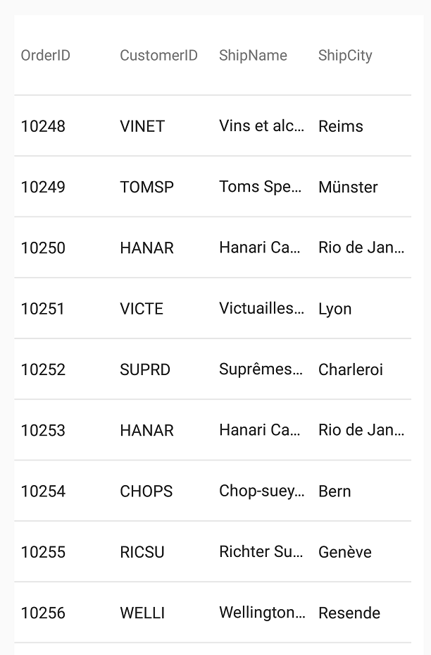

////
|metadata|
{
    "name": "datagrid-binding-remote-data-source",
    "controlName": ["{DataGridName}"],
    "tags": [],
    "guid": "","buildFlags": [],
    "createdOn": "2017-03-05T19:09:59.9912322Z"
}
|metadata|
////

= {DataGridName} のリモート データ ソースのバインディング

このトピックでは、link:{DataGridLink}.{DataGridName}.html[{DataGridName}] コントロールのリモート データソース バインディングの概念を分かりやすく説明します。
 
== このトピックの内容

このトピックには、以下のセクションがあります。

* <<_Background,前提条件>>
* <<_RemoteData,リモート データ>> 
* <<_BindingRData,データのバインド>> 
* <<RelatedTopics,関連トピック>>

[[Background]]   
== 前提条件 

本トピックの理解を深めるために、以下のトピックを参照することをお勧めします。

[options="header", cols="a,a"]
|====
|トピック|目的

| link:datagrid-getting-started-with-grid.html[{DataGridName} を使用した作業の開始] 
| このトピックでは、{DataGridName} コントロールをビューに追加してサンプルデータを生成するための基本的な手順を紹介します。
 
|====

[[_RemoteData]]
== リモート データ

この例では、{DataGridName} コントロールをリモートのデータ ソースにバインドする手順を説明します。ここでは、Northwind データベースをホスティングする Web サービスを対象にします。提供された oData リソースを使用して、{DataGridName} コントロールに 4 つの link:{DataGridLink}.TextColumn_members.html[TextColumn] (OrderID, CustomerID, ShipName and ShipName) と Orders 情報で生成された列を生成します。
 
ifdef::android[]
[start=1]
. odata-client-android-4.0.0-SNAPSHOT ライブラリをアプリケーション プロジェクトの libs フォルダーにコピーし、この jar ファイルをプロジェクト ライブラリとして追加します。これには、プロジェクト ペイン内を右クリックして、Add as Library というオプションを選択し、Infragistics jars と同じ手順に従います。

この java ライブラリは、Android 製品インストールに含まれる Source > libs フォルダーにあります。

インストール場所によっては、このフォルダーのファイル パスは次のようになります。C:\Users\Public\Documents\Infragistics\2016.1\Android\SamplesBrowser\Source\libs
endif::android[]

ifdef::xamarin[]
[start=1]
. 以下の NuGet パッケージを XF プロジェクトにインストールします。

* Microsoft.Data.Edm, Version=5.8.1
* Microsoft.Data.OData, Version=5.8.1
* Microsoft.Net.Http, Version=2.2.28
* Microsoft.OData.Edm, Version=6.15.0
* Microsoft.OData.Core, Version=6.15.0
* Microsoft.Spatial, Version=6.15.0
* Simple.OData.Client, Version=4.24.0.1
* System.Spatial, Version=5.8.1

endif::xamarin[]

ifdef::android[]
[start=2]
. OData フォルダーをアプリケーション プロジェクトの com.infragistics フォルダーにコピーします。

OData フォルダーには、必要な OData リソース クラスが含まれます。これらは、Android 製品とともにインストールされます。インストールの場所によりますが、このフォルダーのファイル パスは以下のようになります。
C:\Users\Public\Documents\Infragistics\2016.1\Android\SamplesBrowser\Source\src\com\infragistics\odata
endif::android[]

ifdef::xamarin[]
[start=2]
. 以下の OData リソース クラスをプロジェクトに含みます。

* link:ODataVirtualDataSource.html[ODataVirtualDataSource] 
* link:ODataVirtualDataProvider.html[ODataVirtualDataProvider] 
* link:ODataVirtualDataSettings.html[ODataVirtualDataSettings] 
* link:ODataSourcePage.html[ODataSourcePage] 

endif::xamarin[]

ifdef::android[]
[start=3]
. 以下のコードスニペットで示すように manifest タグ内の uses-permission タグを含むアプリケーション内の AndroidManifest.xml を変更してインターネット アクセス許可を追加します。
 
*Java の場合:*
[source, java]
----
<manifest xmlns:android="http://schemas.android.com/apk/res/android"
    package="com.infragistics.samplegridapp" >
    <uses-permission android:name="android.permission.INTERNET"/>
----
endif::android[]

ifdef::xamarin[]
[start=3]
. アプリケーションの *.Droid* および *.iOS* プロジェクトのプロパティを変更してインターネット アクセス許可を追加します。
endif::xamarin[]

[[_BindingRData]]
== データのバインド

[start=1]
. アプリケーションのメインビューに link:{DataGridLink}.{DataGridName}.html[{DataGridName}] コントロールのインスタンスを追加します。

ifdef::android[]
*Java の場合:*
[source, java]
----
import com.infragistics.controls.*;
...
{DataGridName} DataGrid = new {DataGridName}(this);
setContentView(DataGrid);
----
endif::android[]
 
ifdef::xamarin[]
*XAML の場合:*
[source, xaml]
----
xmlns:grids="clr-namespace:Infragistics.XamarinForms.Controls.Grids;assembly=Infragistics.XF.DataGrid"
xmlns:local="clr-namespace:Infragistics.Data;assembly=YourAppName" 
...
<grids:XamDataGrid x:Name="DataGrid" AutoGenerateColumns="False" >
    <!--TODO add text columns-->
    <!--TODO bind data source-->
</grids:XamDataGrid>
----
endif::xamarin[]

ifdef::xamarin[]
*C# の場合:*
[source, csharp]
----
using {DataGridNamespace};
using Infragistics.Data;
...
var DataGrid = new {DataGridName}();  
// TODO add text columns
// TODO bind data source 
----
endif::xamarin[]

[start=2]
. 以下のコードで示すように link:{DataGridLink}.TextColumn_members.html[TextColumn] クラスの 4 つのインスタンスを作成し、{DataGridName} コントロールに追加します。

ifdef::android[]
*Java の場合:*
[source, java]
----
TextColumn column1 = new TextColumn();
column1.setKey("OrderID");
column1.setHeaderText("Order ID");

TextColumn column2 = new TextColumn();
column2.setKey("CustomerID");
column2.setHeaderText("Customer ID");

TextColumn column3 = new TextColumn();
column3.setKey("ShipName");
column3.setHeaderText("Ship Name");

TextColumn column4 = new TextColumn();
column4.setKey("ShipCity");
column4.setHeaderText("ShipCity");

DataGrid.addColumn(column1);
DataGrid.addColumn(column2);
DataGrid.addColumn(column3);
DataGrid.addColumn(column4);
----
endif::android[]
 
ifdef::xamarin[]
*XAML の場合:*
[source, xaml]
----
<grids:XamDataGrid.Columns>
    <grids:TextColumn PropertyPath="OrderID"   />
    <grids:TextColumn PropertyPath="CustomerID"  />
    <grids:TextColumn PropertyPath="ShipName"  />
    <grids:TextColumn PropertyPath="ShipCity" />
</grids:XamDataGrid.Columns>
----
endif::xamarin[]

ifdef::xamarin[]
*C# の場合:*
[source, csharp]
----
var column1 = new TextColumn();
column1.PropertyPath = "OrderID";
var column2 = new TextColumn();
column2.PropertyPath = "CustomerID";

var column3 = new NumericColumn();
column3.PropertyPath = "ShipName";
var column4 = new NumericColumn();
column3.PropertyPath = "ShipCity";

DataGrid.Columns.Add(column1);
DataGrid.Columns.Add(column2);
DataGrid.Columns.Add(column3);
DataGrid.Columns.Add(column4);
----
endif::xamarin[]

[start=3]
. 以下のプロパティで OData 仮想データソースのインスタンスを作成し、{DataGridName} コントロールに割り当てます。

* BaseURI - NorthWind ウェブ サービスなど、仮想データソースのユニフォーム リソース識別子 (URI) を設定します。
* EntitySet - 仮想データソースに定義されたテーブルの名前を設定します。
* DesiredPageSize - リモート データソースから一度に読み込まれるレコード数を設定します。
* MaximumCachedPages - 仮想データソースのキャッシュ ページの最大数を設定します。

モバイル アプリケーション開発では、メモリー使用率が重要な要素であるため、{DataGridName} コントロールが使用するメモリーの総量や、リモート データの取得に必要な帯域幅を制限して、必要な場合にのみレコードを取得するようにします。
この動作は、`DesiredPageSize` および `MaximumCachedPages` プロパティを設定することでカスタマイズできます。この場合、ページあたり 25 個のレコードを取得し、所定の期間にこれらのレコードの 5 ページのみを保持します。レコードのセット全体を表示する必要がないイベントでは、必要なレコードのみがネットワークを介して取得および表示されるため、この機能は大変便利です。

ifdef::android[]
*Java の場合:*
[source, java]
----
OdataVirtualDataSource virtualDataSource = new OdataVirtualDataSource(this);
virtualDataSource.setBaseURI("link:http://services.odata.org/V4/Northwind/Northwind.svc");
virtualDataSource.setEntitySet("Orders");
virtualDataSource.setDesiredPageSize(25);
virtualDataSource.setMaximumCachedPages(5);
DataGrid.setAutoGenerateColumns(false);
DataGrid.setDataSource(virtualDataSource);
----
endif::android[]

ifdef::xamarin[]
*XAML の場合:*
[source, xaml]
----
<grids:XamDataGrid.ItemsSource>
    <local:ODataVirtualDataSource
        EntitySet= "Orders" PageSizeRequested="25" MaxCachedPages="5"
        BaseUri="http://services.odata.org/V4/Northwind/Northwind.svc">
    </local:ODataVirtualDataSource>
</grids:XamDataGrid.ItemsSource> 
----
endif::xamarin[]

ifdef::xamarin[]
*C# の場合:*
[source, csharp]
----
DataGrid.ItemsSource = new ODataVirtualDataSource()
{
    BaseUri = "http://services.odata.org/V4/Northwind/Northwind.svc",
    EntitySet = "Orders",
    PageSizeRequested = 25,
    MaxCachedPages = 5
};
----
endif::xamarin[]  

[start=4]
. アプリケーションを保存、実行して結果を確認します。アプリケーションは、画面の向きやピクセル密度によって異なりますが以下のスクリーンショットのようになります。

[[RelatedTopics]]   
=== 関連トピック

以下の表は、このトピックに関連するトピックを示します。

[options="header", cols="a,a"]
|====
|トピック|目的
 
| link:datagrid-supported-column-types.html[サポートされる列タイプ]
|このトピックでは、{DataGridName} コントロールでサポートされる列タイプの情報を提供します。
  
| link:datagrid-working-with-columns.html[列の作業]
|このトピックでは、{DataGridName} コントロールで列を使用する際のコード例を提供します。

| link:datagrid-binding-local-data-source.html[{DataGridName} のローカル データ ソースへのバインディング]
|このトピックでは、ローカル データを {DataGridName} コントロールへバインドするコード例を提供します。

| link:https://github.com/Infragistics/DataSource-Reference-Implementations[DataSource 実装の参照]
|データ ソースを使用したサンプル
|====