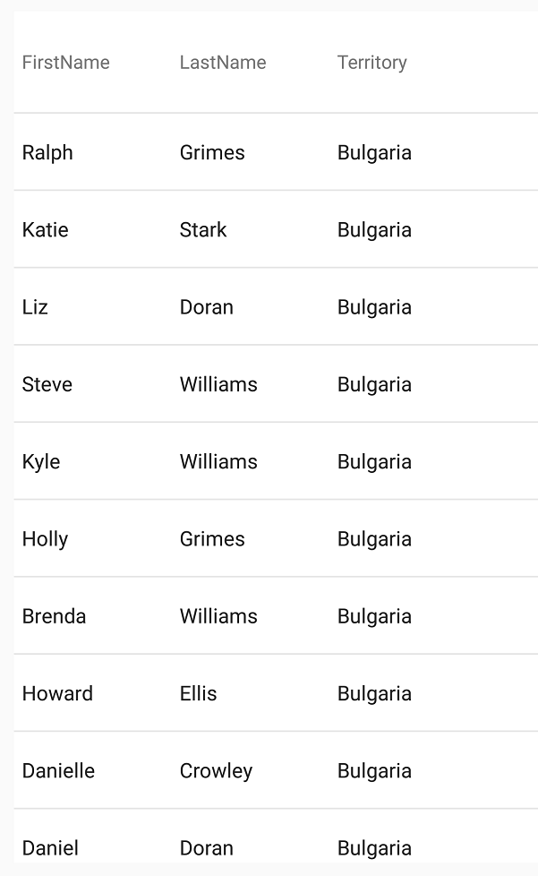
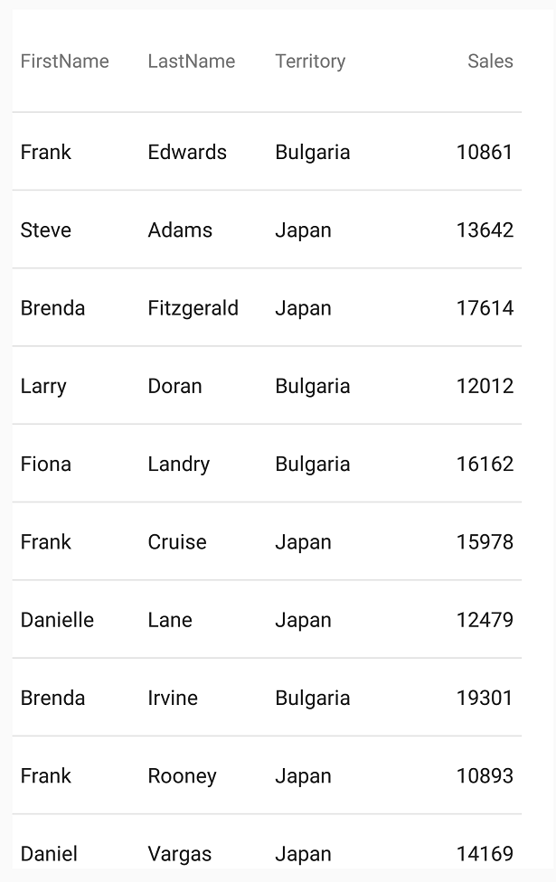

////
|metadata|
{
    "name": "datagrid-filtering-grid",
    "controlName": ["{DataGridName}"],
    "tags": [],
    "guid": "d004c57d-f71e-4a42-8704-9870f1346fd9","buildFlags": [],
    "createdOn": "2016-02-05T19:09:06.463303Z"
}
|metadata|
////

= {DataGridName} のフィルタリング

このトピックでは、link:{DataGridLink}.{DataGridName}.html[{DataGridName}] コントロールによって実装できるフィルタリング動作を分かりやすく説明し、簡単に理解できるようにします。

== このトピックの内容

このトピックには、以下のセクションがあります。

* <<Background,前提条件>>
* <<_Ref442263673,フィルタリング動作の概要>>
* <<_Ref442263687,フィルタリングの要件>>
* <<_Ref442263693,単一の列のレコードのフィルタリング>>
* <<_Ref442263699,複数の列のレコードのフィルタリング>>
* <<RelatedTopics,関連トピック>>

[[Background]]   
== 前提条件

本トピックの理解を深めるために、以下のトピックを参照することをお勧めします。

[options="header", cols="a,a"]
|====
|トピック|目的

| link:datagrid-getting-started-with-grid.html[{DataGridName} を使用した作業の開始] 
| このトピックでは、{DataGridName} コントロールをビューに追加してサンプルデータを生成するための基本的な手順を紹介します。

| link:SampleSalesPerson.html[営業担当者サンプル] 
| このリソース トピックは、 {DataGridName} コントロールのデータソースを使用したサンプル データの実装を提供します。

|====

[[_Ref442263673]]
== フィルタリング動作の概要

{DataGridName} コントロールを使用すると、レコードにフィルタリングを適用して、特定の条件に基づき表示するレコードを減らすことができます。{DataGridName} コントロールを使用したレコードのフィルタリングでは、 link:{DataGridLinkBase}.filterfactory.html[FilterFactory] クラスを使用して、カスタム フィルター式を構築します。この式は、単一で使用することも、式をひとつのチェーンにして複数の式を使用することもできます。

フィルタリングは、ローカルおよびリモートのデータ ソースに実装できます。詳細については、以下のトピックを参照してください。

* link:datagrid-binding-remote-data-source.html[リモート データ ソースへのバインディング]
* link:datagrid-binding-local-data-source.html[ローカル データ ソースへのバインディング]

次の手順では、フィルタリングを実装する方法を紹介します。

[start=1]
. link:{DataGridLinkBase}.FilterFactory.html[FilterFactory] クラスのインスタンスを作成します。
[start=2]
. link:{DataGridLink}.Column_members.html[Column] のpick:[android="キー"]pick:[xaml=" `PropertyPath` "]が link:{DataGridLinkBase}.FilterFactory.html[FilterFactory] インスタンスでフィルタリングされるように割り当てます。これには、キーを link:{DataGridLinkBase}.FilterFactory{ApiProp}Property.html[Property] {ApiMember}に渡し、link:{DataGridLinkBase}.FilterFactory.html[FilterFactory] オブジェクトから公開します。
[start=3]
. フィルター条件を link:{DataGridLinkBase}.FilterFactory.html[FilterFactory] インスタンスに割り当てます。これには、link:{DataGridLinkBase}.FilterFactory{ApiProp}Property.html[Property] {ApiMember}から公開されている条件拡張メソッドの 1 つにアクセスし、フィルタリングに使用する値を渡します。
[start=4]
. link:{DataGridLinkBase}.FilterFactory.html[FilterFactory] 式全体を {DataGridName} コントロールの link:{DataGridLinkBase}.FilterExpressionCollection.html[FilterExpressionCollection] コレクションに追加します。

[[_Ref442263687]]
== フィルタリングの要件

{DataGridName} コントロールは、 link:{DataGridLinkBase}.filterfactory.html[FilterFactory] クラスを使用して構築されたフィルター式を受け入れます。このクラスの基本式は、フィルタリングされるターゲット フィールド（フィルタリングされた link:{DataGridLink}.column_members.html[Column] のpick:[android="キー"]pick:[xaml=" `PropertyPath` "]として、 link:{DataGridLinkBase}.filterfactory{ApiProp}property.html[Property] に渡される）とフィルター演算子のメソッド（条件付きの値に関連付けられている）という 2 つの基本的なコンポーネントに分けることができます。

link:{DataGridLinkBase}.filterfactory.html[FilterFactory] クラスは広範囲なフィルター条件をサポートします。これには、基本的な論理演算子である and、or、not、contains、greaterThan などが含まれています（これらの演算子の完全なリストについては、 link:{DataGridLinkBase}.filterfactory.html[FilterFactory] API を参照してください）。これらの演算子は、拡張メソッドにより適用され、 link:{DataGridLinkBase}.filterfactory{ApiProp}property.html[Property] API メンバーの直後に追加されます。これらの演算子の拡張メソッドは、フィルタリングに使用される値で構成された単一のパラメーターを受け入れます。

[[_Ref442263693]]
== 単一の列のレコードのフィルタリング

次の例では、{DataGridName} コントロールを使用して、基本的なフィルタリング式を実装する方法を示します。このシナリオでは、Territory link:{DataGridLink}.column_members.html[Column] のレコードがフィルタリングされるため、国の「Bulgaria」を含むレコードのみが表示されます。

この例では、「link:datagrid-getting-started-with-grid.html[{DataGridName} を使用した作業の開始]」のトピックの SampleGridApp を使用しています。

[start=1]
. 次に示すコードのように、link:{DataGridLinkBase}.filterfactory.html[FilterFactory] インターフェイスへの参照を作成します。

ifdef::android[]
*Java の場合:*

[source,js]
----
FilterFactory Filter = FilterFactory.getInstance();
----
endif::android[]

ifdef::xamarin[]
*C# の場合:*

[source,csharp]
----
var Filter = Infragistics.Core.Controls.DataSource.FilterFactory.Instance;
----
endif::xamarin[]

[start=2]
. link:{DataGridLinkBase}.filterfactory.html[FilterFactory] インスタンスにターゲット フィールドとフィルター式を割り当て、式全体を link:{DataGridLink}.{DataGridName}{ApiPropGet}filterexpressions.html[pick:[android="set"]FilterExpressions] の pick:[android="`add()`"]pick:[xaml="`Add()`"] メソッドに渡します。

link:{DataGridLinkBase}.filterfactory.html[FilterFactory] インスタンスの link:{DataGridLinkBase}.filterfactory{ApiProp}property.html[Property] {ApiMember}にアクセスします。ターゲット フィールドを設定し、フィルタリングする link:{DataGridLink}.column_members.html[Column] のpick:[android=" `key` "]pick:[xaml=" `PropertyPath` "]として渡します。

フィルター式のメソッドは、`Property()` メソッドからアクセスされ、フィルターに使用される値は、そのパラメーターとして渡されます。

この場合、link:{DataGridLinkBase}.FilterExpression{ApiProp}isequalto.html[isEqualTo] 式のメソッドを使用するため、フィルタリングされるコンテンツは、Territory の「Bulgaria」のレコードが含まれたコンテンツのみになります。

ifdef::android[]
*Java の場合:*

[source,js]
----
DataGrid.getFilterExpressions().add(Filter.property("Territory").isEqualTo("Bulgaria"));
----
endif::android[]

ifdef::xaml[]
*C# の場合:*

[source,csharp]
----
DataGrid.FilterExpressions.Add(Filter.Property("Territory").IsEqualTo("Bulgaria"));
----
endif::xaml[]

[start=3]
. 結果を確認するために、SampleGridApp を保存し実行します。

次のスクリーンショットに示すように、{DataGridName} コントロールがそのレコードをフィルタリングするため、Territory がブルガリアのレコードのみが表示されます。

[[_Ref442263699]]
== 複数の列のレコードのフィルタリング

{DataGridName} コントロールは、複数のフィルター式と link:{DataGridLinkBase}.filterfactory.html[FilterFactory] インスタンスに適用された条件をサポートします。これは、式を同時に変更することによって可能になるため、複数の link:{DataGridLink}.column_members.html[Column] および値を同時にフィルタリングする複合フィルター条件を使用できます。

次の例では、複数フィルター式の使用方法を示します。このシナリオでは、「Bulgaria」または「Japan」が Territory に割り当てられたすべての従業員と、セールスの値が「10000」および「20000」の範囲内の従業員すべてがフィルタリングされたレコードに表示されます。

[start=1]
. 少なくとも 1000 データ項目を持つ {DataGridName} コントロールのデータソースを変更します。これによって複雑なフィルター条件を適用した場合もデータセットから十分な数の結果を得ることができます。

ifdef::android[]
*Java の場合:*

[source,js]
----
{DataGridName} DataGrid = new {DataGridName}(this);
DataGrid.setDataSource(SampleSalesPerson.GenerateSalesData(1000));
----
endif::android[]

ifdef::xaml[]
*C# の場合:*

[source,csharp]
----
var DataGrid = new {DataGridName}();
DataGrid.ItemsSource = SampleSalesPerson.GenerateSalesData(1000);
----
endif::xaml[]

[start=2]
. 次のコードのように、 link:{DataGridLinkBase}.filterfactory.html[FilterFactory] インターフェイスへの参照を作成します。

ifdef::android[]
*Java の場合:*

[source,js]
----
FilterFactory Filter = FilterFactory.getInstance();
----
endif::android[]

ifdef::xaml[]
*C# の場合:*

[source,csharp]
----
var Filter = Infragistics.Core.Controls.DataSource.FilterFactory.Instance;
----
endif::xaml[]

[start=3]
. {DataGridName} コントロールの link:{DataGridLink}.{DataGridName}{ApiPropGet}filterexpressions.html[pick:[android="set"]FilterExpressions()] {ApiMember}にアクセスし、対応する link:{DataGridLinkBase}.filterfactory{ApiProp}add.html[Add] メソッドを使用して、チェーン フィルター式をパラメーターとして渡します。

link:{DataGridLinkBase}.filterfactory{ApiProp}add.html[Add] メソッド内で、link:{DataGridLinkBase}.filterfactory.html[FilterFactory] インスタンスを渡します。その link:{DataGridLinkBase}.filterfactory{ApiProp}property.html[Property] メソッドを使用して、Territory link:{DataGridLink}.column_members.html[Column]をターゲットにします。この場合、「Territory」キーをパラメーターとして渡し、次に link:{DataGridLinkBase}.FilterExpression{ApiProp}isequalto.html[isEqualTo] 拡張メソッドにアクセスして文字列値「Bulgaria」を渡します。

前述の式から link:{DataGridLinkBase}.filterfactory{ApiProp}or.html[Or] メソッドにアクセスして、最初の式に OR 条件を追加し、そのパラメーターとして link:{DataGridLinkBase}.filterfactory.html[FilterFactory] インスタンスを渡します。今回は、Territory link:{DataGridLink}.column_members.html[Column] をターゲットにして、link:{DataGridLinkBase}.FilterExpression{ApiProp}isequalto.html[isEqualTo] 拡張メソッドにアクセスし文字値「Japan」を渡します。

前述の式に link:{DataGridLinkBase}.filterfactory{ApiProp}add.html[Add] メソッドを追加し、 link:{DataGridLinkBase}.filterfactory.html[FilterFactory] インスタンスを渡します。その link:{DataGridLinkBase}.filterfactory{ApiProp}property.html[Property] メソッドにアクセスして、Sales link:{DataGridLink}.column_members.html[Column] をターゲットにします。この場合、「Sales」キーを link:{DataGridLinkBase}.filterfactory{ApiProp}property.html[Property] メソッドのパラメーターとして渡し、次に link:{DataGridLinkBase}.FilterExpression{ApiProp}isgreaterthanorequalto.html[IsGreaterThanOrEqualTo] 拡張メソッドにアクセスして {DataGridName} の値をパラメーターとして渡します。

最後に、前述の式に link:{DataGridLinkBase}.filterfactory{ApiProp}add.html[Add] メソッドを追加し、 link:{DataGridLinkBase}.filterfactory.html[FilterFactory] インスタンスを渡します。その link:{DataGridLinkBase}.filterfactory{ApiProp}property.html[Property] メソッドにアクセスして、Sales link:{DataGridLink}.column_members.html[Column] を再度ターゲットにします。この場合、「Sales」キーをパラメーターとして渡し、次に link:{DataGridLinkBase}.FilterExpression{ApiProp}islessthanorequalto.html[IsLessThanOrEqualTo] 拡張メソッドにアクセスしてパラメーターの値「20000」を渡します。

ifdef::android[]
*Java の場合:*

[source,js]
----
DataGrid.getFilterExpressions().add(Filter.property("Territory").isEqualTo("Bulgaria")
    .or(Filter.property("Territory").isEqualTo("Japan"))
    .and(Filter.property("Sales").isGreaterThanOrEqualTo(10000)
    .and(Filter.property("Sales").isLessThanOrEqualTo(20000))));
----
endif::android[]

ifdef::xaml[]
*C# の場合:*

[source,csharp]
----
DataGrid.FilterExpressions.Add(Filter.Property("Territory").IsEqualTo("Bulgaria")
    .Or(Filter.Property("Territory").IsEqualTo("Japan"))
    .And(Filter.Property("Sales").IsGreaterThanOrEqualTo(10000))
    .And(Filter.Property("Sales").IsLessThanOrEqualTo(20000)));
----
endif::xaml[]

[start=4]
. 結果を確認するために、SampleGridApp を保存し実行します。次のスクリーンショットに示すように、{DataGridName} コントロールがそのレコードをフィルタリングするため、Territory link:{DataGridLink}.column_members.html[Column] に Japan と Bulgaria が含まれ、セールス値が 10000 から 20000 の範囲の従業員のみが UI に表示されます。

[[RelatedTopics]]   
=== 関連トピック

以下の表は、このトピックに関連するトピックを示します。

[options="header", cols="a,a"]
|====
|トピック|目的
 
| link:datagrid-supported-column-types.html[サポートされる列タイプ]
|このトピックでは、{DataGridName} コントロールでサポートされる列タイプの情報を提供します。
  
| link:datagrid-working-with-columns.html[列の作業]
|このトピックでは、{DataGridName} コントロールで列を使用する際のコード例を提供します。

| link:datagrid-sorting.html[並べ替え]
|このトピックは、{DataGridName} コントロールの並べ替え動作に関する情報とコード例を提供します。
|====