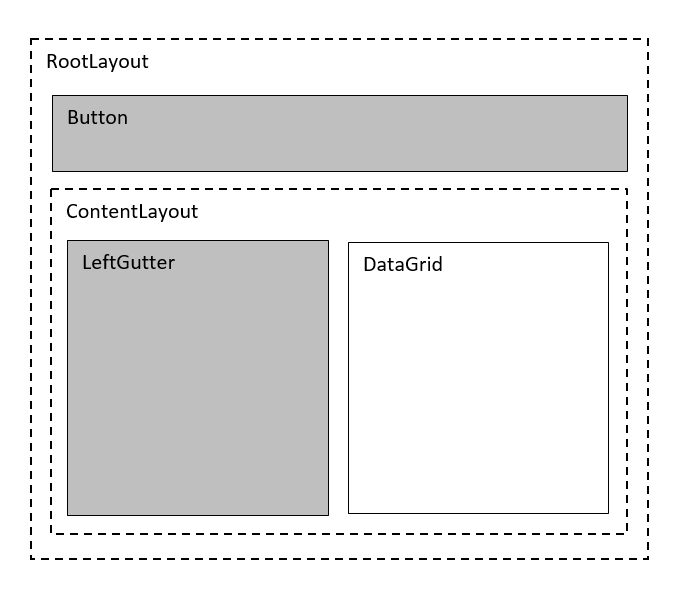

////
|metadata|
{
    "name": "datagrid-responsive-layout-on-grid-resize",
    "controlName": ["{DataGridName}"],
    "tags": [],
    "guid": "","buildFlags": [],
    "createdOn": "2017-02-05T19:11:09.6948794Z"
}
|metadata|
////

= 隣接サイズ変更のレスポンシブ レイアウト

このトピックでは、link:{DataGridLink}.{DataGridName}.html[{DataGridName}] コントロールの隣接レイアウトがサイズ変更される場合のレスポンシブ レイアウトの概念を解説します。
  
== 概要

このトピックは、以下のセクションで構成されます。
 
* <<_Requirements,前提条件>>
* <<_Introduction,概要>>
ifdef::xamarin[]  
* <<_Prepare_Application,アプリケーションの準備>>
endif::xamarin[] 
* <<_Responsive_Layout_Example,レスポンシブ レイアウトの例>>
* <<_Responsive_Layout_Preview,レスポンシブ レイアウトのプレビュー>>
* <<_Responsive_Layout_Animations,レスポンシブ レイアウトのアニメーション>>
* <<_RelatedContent,関連コンテンツ>>

[_Requirements]]   
== 前提条件 

本トピックの理解を深めるために、以下のトピックを参照することをお勧めします。

[options="header", cols="a,a"]
|====
|トピック|目的

| link:datagrid-getting-started-with-grid.html[{DataGridName} を使用した作業の開始] 
| このトピックでは、{DataGridName} コントロールをビューに追加し、サンプル データを生成するために必要な基本的な手順を紹介します。 
 
| link:datagrid-responsive-layout-on-grid-rotation.html[グリッド回転のレスポンシブ レイアウト] 
| このトピックでは、{DataGridName} コントロールの回転でレスポンシブ レイアウトを実装する方法について説明します。
 
|====
  
[[_Introduction]]
== 概要 

隣接するレイアウトの向きの変更により、アプリケーション内の `{DataGridName}` コントロールの幅を変更することが必要な場合があります。このようなシナリオでは、アプリケーションのデータの可読性と外観を維持する必要があります。この例では、{DataGridName} コントロールを使用して、このシナリオの条件に応答するレスポンシブ グリッド レイアウト ビヘイビアを実装するプロセスについて説明します。　このサンプルでは、応答に `Button` を使用して {DataGridName} コントロールの幅を変更し（隣接ビューの幅を変更）、`ResponsiveState` オブジェクトを適用して、優先度の低い列 （Territory 列および Sales 列) をビューで非表示にし、重要なデータ（Name 列）の可読性を維持します。

ifdef::xamarin[]  
[[_Prepare_Application]]
== アプリケーションの準備

レスポンシブ レイアウト ビヘイビアを実装する前に、 {DataGridName} コントロールの `ResponsiveState` オブジェクトを定義するために後で使用されるアプリケーション プロジェクトを準備し、デバイスの画面のパラメーターを保存する必要があります。

[start=1]
. *Portable* アプリケーション プロジェクトで、このコードを追加して、デバイスの画面のパラメーターを定義します。

*C# の場合:*
[source, csharp]
----
public partial class App : Application
{
    static public int ScreenWidth;
    static public int ScreenHeight;
    static public float ScreenDensity = 1;
    ...
}
----

[start=2]
. *.Droid* アプリケーション プロジェクトで、このコードを追加して、デバイスの画面のパラメーターを保存します。

*C# の場合:*
[source, csharp]
----
public class MainActivity : FormsAppCompatActivity
{
    protected override void OnCreate(Bundle bundle)
    {
        App.ScreenDensity = Resources.DisplayMetrics.Density;
        App.ScreenWidth   = Resources.DisplayMetrics.WidthPixels;
        App.ScreenHeight  = Resources.DisplayMetrics.HeightPixels;
        ...
    }
}
----

[start=3]
. *.iOS* アプリケーション プロジェクトで、このコードを追加して、デバイスの画面のパラメーターを保存します。

*C# の場合:*
[source, csharp]
----
public partial class AppDelegate : FormsApplicationDelegate
{
    public override bool FinishedLaunching(UIApplication app, NSDictionary options)
    {
        App.ScreenWidth  = (int)UIScreen.MainScreen.Bounds.Width;
        App.ScreenHeight = (int)UIScreen.MainScreen.Bounds.Height; 
        ...
    }
}
----
endif::xamarin[]

[[_Responsive_Layout_Example]]
== レスポンシブ レイアウトの例

ここで、アプリケーションのレイアウトを設定する必要があります。この例では、隣接したレイアウトの幅の変更によるさまざまな幅密度への {DataGridName} コントロールの反応を制御し表示するために、いくつかのネストしたレイアウトを使用しています。

理解しやすいようにこれらのレイアウトの配置を、次の図に示します。

  
[start=1]
. メインビューに次のコードを追加して、`Button` をクリックしたときの `LeftGutter` のサイズの変化に応じてサイズ変更される 1 つの `{DataGridName}` コントロールで上記のレイアウトを作成します。

ifdef::android[]
*Java の場合:*
[source, java]
---- 
final TextColumn nameColumn = new TextColumn();
nameColumn.setKey("FirstName");
final TextColumn territoryColumn = new TextColumn();
territoryColumn.setKey("Territory");
final NumericColumn salesColumn = new NumericColumn();
salesColumn.setKey("Sales");

{DataGridName} DataGrid = new {DataGridName}(this);
DataGrid.setAutoGenerateColumns(true);
DataGrid.setDataSource(new SampleSalesTeam());
DataGrid.addColumn(nameColumn);
DataGrid.addColumn(territoryColumn);
DataGrid.addColumn(salesColumn); 

Button button = new Button(this);
button.setText("Adjust Grid Width");
   
final FrameLayout LeftGutter = new FrameLayout(this);
LeftGutter.setMinimumWidth(0);
LeftGutter.setMinimumHeight(100);
 
LinearLayout ContentLayout = new LinearLayout(this);
ContentLayout.setOrientation(LinearLayout.HORIZONTAL);
ContentLayout.addView(LeftGutter);
ContentLayout.addView(DataGrid);

LinearLayout RootLayout = new LinearLayout(this);
RootLayout.setOrientation(LinearLayout.VERTICAL);
RootLayout.addView(Button);
RootLayout.addView(ContentLayout);
setContentView(RootLayout);
----
endif::android[]

ifdef::xamarin[]
*XAML の場合:*
[source, xaml]
----
<Grid x:Name="RootLayout" Margin="10"  >
    <Grid.RowDefinitions>
        <RowDefinition Height="Auto" />
        <RowDefinition Height="*" />
    </Grid.RowDefinitions>
    
    <Button x:Name="Button" Text="Change Grid Size"/>
    
    <Grid x:Name="ContentLayout" Grid.Row="1">
        <Grid.ColumnDefinitions>
            <ColumnDefinition Width="Auto" />
            <ColumnDefinition Width="*" />
        </Grid.ColumnDefinitions> 
        
        <Grid x:Name="LeftGutter" Grid.Column="0"
               MinimumWidthRequest="0" 
               MinimumHeightRequest="100"
               BackgroundColor="#FFCBCBCB" />
               
        <ig:XamDataGrid x:Name="DataGrid" Grid.Column="1" 
                        AutoGenerateColumns="False">
            <ig:XamDataGrid.ItemsSource>
                <local:SampleSalesTeam />
            </ig:XamDataGrid.ItemsSource>
            <ig:XamDataGrid.Columns>
                <ig:TextColumn PropertyPath="FirstName" />
                <ig:TextColumn PropertyPath="Territory" />
                <ig:NumericColumn PropertyPath="Sales"  />
            </ig:XamDataGrid.Columns> 
        </ig:XamDataGrid>
    </Grid>
</Grid>
----
endif::xamarin[] 

ifdef::wpf[]  
*XAML の場合:*
[source, xaml]
----
// TODO add XAML code snippet for WPF
----
endif::wpf[]
  
[start=2]
. `LeftGutter` および `DataGrid` の幅のサイズを保存するために、`int` 型の 5 つの変数を作成します。 
 
{DataGridName} コントロールは、幅の変化に応答しますが、幅は隣接したレイアウトの変更に応じて変化します。このシナリオでは、この隣接したレイアウトの 3 つの個別幅を画面全体幅に対する割合で切り替えます。この例では、0%、25%、および 50% を使用します。{DataGridName} コントロールは、応答でこれら 3 つの状態に対して、それぞれ画面の幅を残りの画面の幅の 100%、75%、および 40% に縮小します。

`LeftGutterWidth25` および `LeftGutterWidth50` 変数は、`ContentMaxWidth` 変数を使用して保存された画面の最大幅の 25% および 50% のピクセル単位の値を計算して保存するために使用されます。

`DataGridWidth1` および `DataGridWidth2` 変数は、 {DataGridName} コントロールが画面をリサイズした後に使用可能な画面幅を計算して保存するために使用されます。この値は、ResponsiveStates の範囲の値を設定するために必要です。

ifdef::android[]
*Java の場合:*
[source, java]
----
final int ContentMaxWidth = getResources().getDisplayMetrics().widthPixels;
final int LeftGutterWidth25 = (int)(ContentMaxWidth * .25);
final int LeftGutterWidth50 = (int)(ContentMaxWidth * .50);
final int DataGridWidth1 = ContentMaxWidth - LeftGutterWidth25;
final int DataGridWidth2 = ContentMaxWidth - LeftGutterWidth50;
----
endif::android[]

ifdef::xamarin[]  
[source, csharp]
----
static int ContentMaxWidth = (int)(App.ScreenWidth / App.ScreenDensity);
static int LeftGutterWidth25 = (int)(ContentMaxWidth * .25);
static int LeftGutterWidth50 = (int)(ContentMaxWidth * .50);
static int DataGridWidth1 = ContentMaxWidth - LeftGutterWidth25;
static int DataGridWidth2 = ContentMaxWidth - LeftGutterWidth50;
---- 
endif::xamarin[] 

ifdef::wpf[]  
*C# の場合:*
[source, csharp]
----
// TODO add code snippet for WPF
----
endif::wpf[]

[start=3]
. 次のコードを追加して、{DataGridName} コントロールの 3 つの幅の値 (100%、50%、および 25% の増分幅) を切り替えるボタンの `Click` イベントをハンドルします。この値は、画面で使用可能な幅に対する比率です。

ifdef::android[]
*Java の場合:*
[source, java]
----
button.setOnClickListener(new View.OnClickListener() 
{
    @Override public void onClick(View v) 
    {
        // Condition 1: if LeftGutter has its default width 
        // then set its width to LeftGutterStop: 25% of screen width 
        if (LeftGutter.getWidth() == 0) 
        {
            LeftGutter.setMinimumWidth(LeftGutterWidth25);
        }
        // Condition 2: if LeftGutter's width is equal to LeftGutterWidth25
        // then set its width to LeftGutterWidth50: 50% of screen width  
        else if (LeftGutter.getWidth() == LeftGutterWidth25) 
        {
            LeftGutter.setMinimumWidth(LeftGutterWidth50);
        }
        // Condition 3: if LeftGutter's width is equal to LeftGutterWidth50
        // then set its width to  default state of 0  
        else if (LeftGutter.getWidth() == LeftGutterWidth50) 
        {
            LeftGutter.setMinimumWidth(0);
        }
    }
});
----
endif::android[]

ifdef::xamarin[]  
*C# の場合:*
[source, csharp]
----
Button.Clicked += Button_Clicked;
...
private void Button_Clicked(object sender, EventArgs e)
{
    // Condition 1: if LeftGutter has its default width 
    // then set its width to LeftGutterStop: 25% of screen width
    if (LeftGutter.Width <= 0)
    {
        LeftGutter.WidthRequest = LeftGutterWidth25;
    }
    // Condition 2: if LeftGutter's width is equal to LeftGutterWidth25
    // then set its width to LeftGutterWidth50: 50% of screen width 
    else if (LeftGutter.Width == LeftGutterWidth25)
    {
        LeftGutter.WidthRequest = LeftGutterWidth50;
    }
    // Condition 3: if LeftGutter's width is equal to LeftGutterWidth50
    // then set its width to  default state of 0 
    else if (LeftGutter.Width == LeftGutterWidth50)
    {
        LeftGutter.WidthRequest = 0;
    }
}
----
endif::xamarin[]

ifdef::wpf[]  
*C# の場合:*
[source, csharp]
----
// TODO add code snippet for WPF
----
endif::wpf[]

[start=4]
. 以下のコードに示すように、link:{DataGridLink}.ResponsivePhase.html[ResponsivePhase] オブジェクトを作成するヘルパー メソッドを追加します。

ifdef::android[]
*Java の場合:*
[source, java]
---- 
private ResponsivePhase CreatePhase(string columnName, string propertyName, object value)
{
    var setter = new ColumnPropertySetter(columnName, propertyName, value);
    return new ResponsivePhase().addColumnPropertySetter(setter);
}
----
endif::android[]

ifdef::xaml[]  
*C# の場合:*
[source, csharp]
---- 
private ResponsivePhase CreatePhase(string columnName, string propertyName, object value)
{
    var setter = new ColumnPropertySetter()
    {
        ColumnName = columnName,
        PropertyName = propertyName,
        Value = value,
    }; 
    return new ResponsivePhase().AddColumnPropertySetter(setter);
}
----
endif::xaml[]

[start=5]
.  {DataGridName} コントロールの幅が調整される前のデフォルト状態で使用される最初の link:{DataGridLink}.ResponsiveState.html[ResponsiveState] を作成します。

このレスポンシブ状態は、{DataGridName} コントロールの幅が *DataGridWidth1* から *ContentMaxWidth* 値の範囲内にあるときにアクティブになり、*Territory* 列および *Sales* 列を表示します。

ifdef::android[]
*Java の場合:*
[source, java]
----
ResponsiveState state1 = new ResponsiveState(); 
state1.setMaximumWidth(TypedValue.COMPLEX_UNIT_PX, ContentMaxWidth);
state1.setMinimumWidth(TypedValue.COMPLEX_UNIT_PX, DataGridWidth1 + 1);
state1.addResponsivePhase(CreatePhase("Territory", "IsHidden", false));
state1.addResponsivePhase(CreatePhase("Sales", "IsHidden", false));
----
endif::android[]

ifdef::xaml[]  
*C# の場合:*
[source, csharp]
---- 
var state1 = new ResponsiveState();
state1.MaximumWidth = ContentMaxWidth;  
state1.MinimumWidth = DataGridWidth1 + 1; 
state1.AddResponsivePhase(CreatePhase("Territory", "IsHidden", false));
state1.AddResponsivePhase(CreatePhase("Sales", "IsHidden", false)); 
----
endif::xaml[]
 
[start=6]
. {DataGridName} コントロールの幅を *DataGridWidth1* と *DataGridWidth2* の間に変更し、*Sales* 列を非表示にするときに使用される 2 つ目の link:{DataGridLink}.ResponsiveState.html[ResponsiveState] を作成します。

ifdef::android[]
*Java の場合:*
[source, java]
----
ResponsiveState state2 = new ResponsiveState(); 
state2.setMaximumWidth(TypedValue.COMPLEX_UNIT_PX, DataGridWidth1);
state2.setMinimumWidth(TypedValue.COMPLEX_UNIT_PX, DataGridWidth2 + 1);
state2.addResponsivePhase(CreatePhase("Territory", "IsHidden", false));
state2.addResponsivePhase(CreatePhase("Sales", "IsHidden", true));
----
endif::android[]

ifdef::xaml[]  
*C# の場合:*
[source, csharp]
---- 
var state2 = new ResponsiveState();
state2.MaximumWidth = DataGridWidth1;  
state2.MinimumWidth = DataGridWidth2 + 1; 
state2.AddResponsivePhase(CreatePhase("Territory", "IsHidden", false));
state2.AddResponsivePhase(CreatePhase("Sales", "IsHidden", true)); 
----
endif::xaml[]

[start=7]
. {DataGridName} コントロールの幅を *DataGridWidth2* より小さく変更し、*Territory* および *Sales* 列を非表示にするときに使用される 3 つめの  link:{DataGridLink}.ResponsiveState.html[ResponsiveState] を作成します。 

ifdef::android[]
*Java の場合:*
[source, java]
----
ResponsiveState state3 = new ResponsiveState(); 
state3.setMaximumWidth(TypedValue.COMPLEX_UNIT_PX, DataGridWidth2);
state3.setMinimumWidth(0);
state3.addResponsivePhase(CreatePhase("Territory", "IsHidden", true));
state3.addResponsivePhase(CreatePhase("Sales", "IsHidden", true));
----
endif::android[]

ifdef::xaml[]  
*C# の場合:*
[source, csharp]
---- 
var state3 = new ResponsiveState();
state3.MaximumWidth = DataGridWidth2;  
state3.MinimumWidth = 0; 
state3.AddResponsivePhase(CreatePhase("Territory", "IsHidden", true));
state3.AddResponsivePhase(CreatePhase("Sales", "IsHidden", true)); 
----
endif::xaml[]

[start=8]
. 次のコード スニペットに示すように、{DataGridName} コントロールに 3 つの `ResponsiveState` オブジェクトをすべて追加します。

ifdef::android[]
*Java の場合:*
[source, java]
----
DataGrid.addResponsiveState(state1);
DataGrid.addResponsiveState(state2);
DataGrid.addResponsiveState(state3);
----
endif::android[]

ifdef::xaml[]  
*C# の場合:*
[source, csharp]
---- 
DataGrid.ResponsiveStates.Add(state1);
DataGrid.ResponsiveStates.Add(state2);
DataGrid.ResponsiveStates.Add(state3);
----
endif::xaml[]

[start=9]
. アプリケーションを保存して実行し、{DataGridName} コントロールのレスポンシブ レイアウト ビヘイビアを確認します。

[[_Responsive_Layout_Preview]]
== レスポンシブ レイアウトのプレビュー

次のアニメーション グラフィックスは、隣接するレイアウト （*LeftGutter*） の幅が 3 回変化した場合の {DataGridName} コントロールのレイアウト応答を示しています。 

* 最初、*LeftGutter* の幅は 0 です。*DataGrid* は 3 つの列 (*Name*、*Territory*、*Sales*) をすべて表示します。これは最初のレスポンシブ状態を表します。 
* 次に、*LeftGutter* の幅が画面の幅の 25% に増加します。*Sales* 列を非表示にする第 2 のレスポンシブ状態がトリガーされます。 
* 再度幅を増加した後、*LeftGutter* は画面の幅の 50% を占め、3 番目のレスポンシブ状態で *Territory* 列が非表示になります。 
* 最後に、*LeftGutter* の幅が 0 にリセットされ、最初のレスポンシブ状態がトリガーされ、*Territory* および *Sales* の両方の列が再度表示されます。

image::images/Responsive_Layout_On_Neighbor_Resize_2.gif[]

[[_Responsive_Layout_Animations]]
== レスポンシブ レイアウトのアニメーション

グリッドにアニメーションを適用し、レスポンシブ状態間のスムーズなトランジションを表示することもできます。たとえば、データ グリッド内の列非表示操作のフェードアウト アニメーションを適用すると、次のようになります。
 
ifdef::android[]
*Java の場合:*
[source, java]
----
DataGrid.setColumnHidingAnimationMode(ColumnHidingAnimationMode.FADE_OUT);
----
endif::android[]

ifdef::xaml[]
*XAML の場合:*
[source, xaml]
----
<ig:XamDataGrid x:Name="DataGrid" ColumnHidingAnimationMode="FadeOut"> 
...
</ig:XamDataGrid>
----
endif::xaml[]

ifdef::xaml[]
*C# の場合:*
[source, csharp]
----
DataGrid.ColumnHidingAnimationMode = ColumnHidingAnimationMode.FadeOut;
----
endif::xaml[]

このアニメーション化されたグラフィックスは、 {DataGridName} コントロールのレイアウトが列非表示操作のアニメーションにどのように反応するかを示しています。

image::images/Responsive_Layout_On_Neighbor_Resize_3.gif[]

[[_RelatedContent]]   
== 関連コンテンツ

以下の表は、このトピックに関連するトピックを示します。

[options="header", cols="a,a"]
|====
|トピック|目的

| link:datagrid-responsive-layout-on-grid-rotation.html[グリッド回転のレスポンシブ レイアウト] 
| このトピックでは、{DataGridName} コントロールの回転でレスポンシブ レイアウトを実装する方法について説明します。

| link:datagrid-animation.html[アニメーション]
| このトピックでは、{DataGridName} コントロールの列および行に対し操作を実行する場合のアニメーションを適用する方法について説明します。

| link:datagrid-supported-column-types.html[サポートされる列タイプ]
|このトピックでは、{DataGridName} コントロールでサポートされている列タイプについて説明します。
  
| link:datagrid-working-with-columns.html[列の作業]
|このトピックでは、{DataGridName} コントロールの列を操作する際のコード例を紹介します。

|====